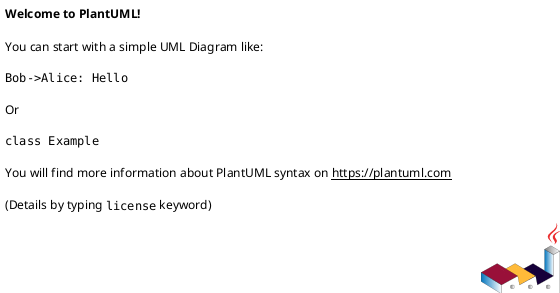

## Diagram Type

Specify the diagram type (e.g., Sequence, Class, Activity, Component, etc.).

## Example Title

A clear and descriptive title for the diagram example.

## Description

Describe what this diagram should demonstrate or explain.

## PlantUML Code (if contributing)

If you're contributing the example, provide the PlantUML code:

## Use Cases

Where would this example be useful?

1. **Use Case 1**: [Description]
2. **Use Case 2**: [Description]

## References

Any references, documentation, or examples that could help create this diagram.

## Checklist

- [ ] I have searched existing examples and this is not a duplicate
- [ ] I have provided all the required information above
- [ ] If contributing code, I have tested it locally
