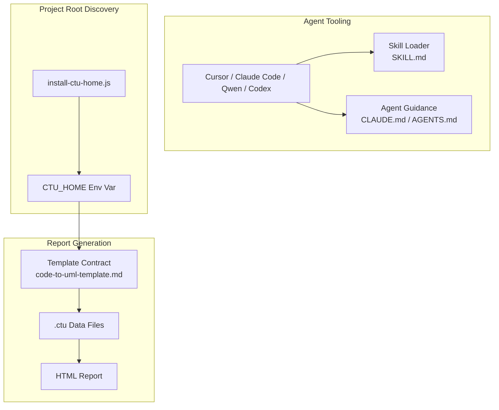
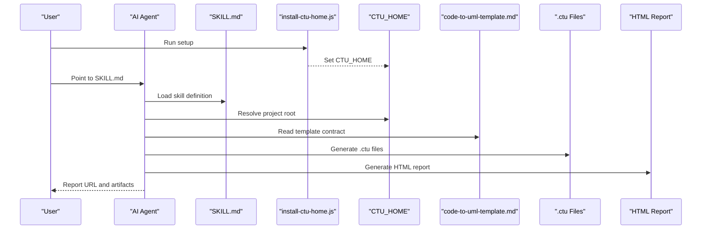
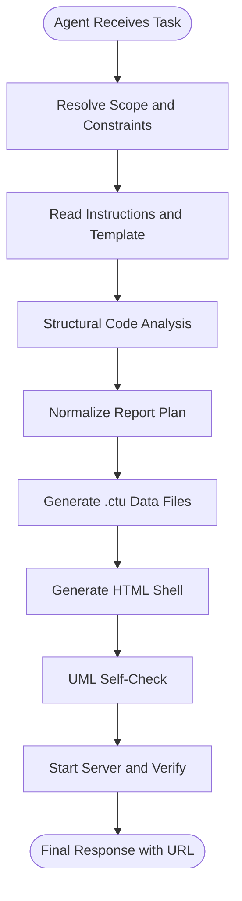
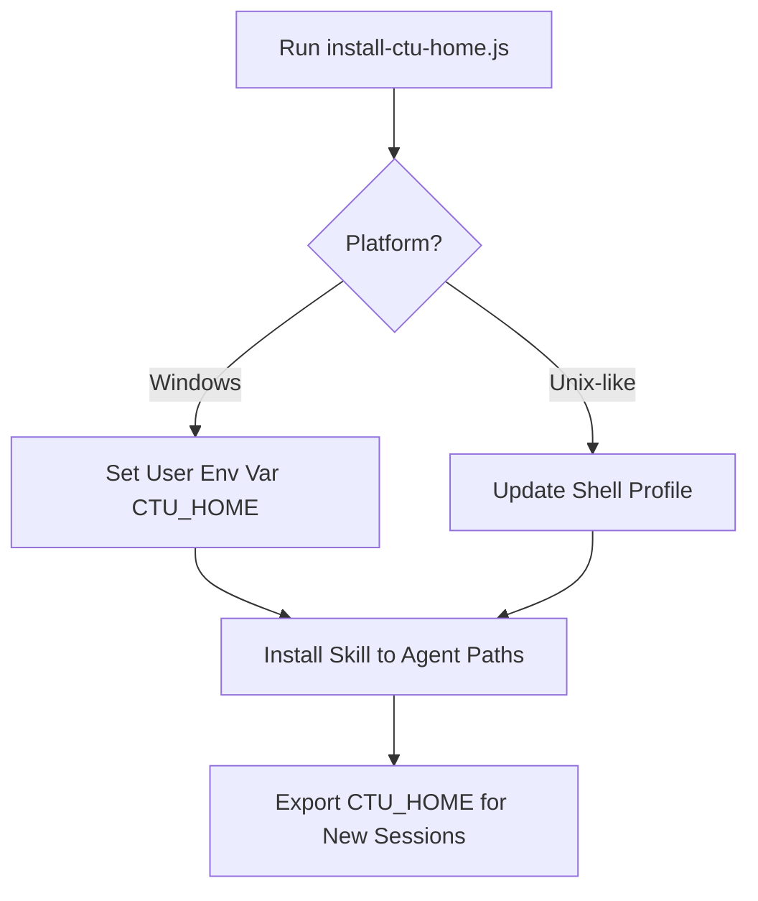
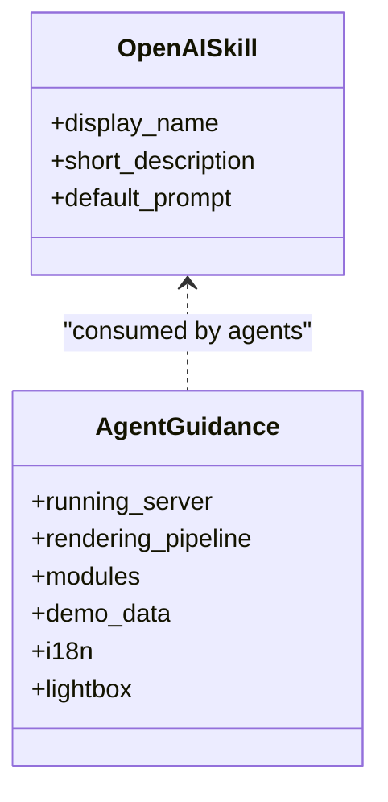
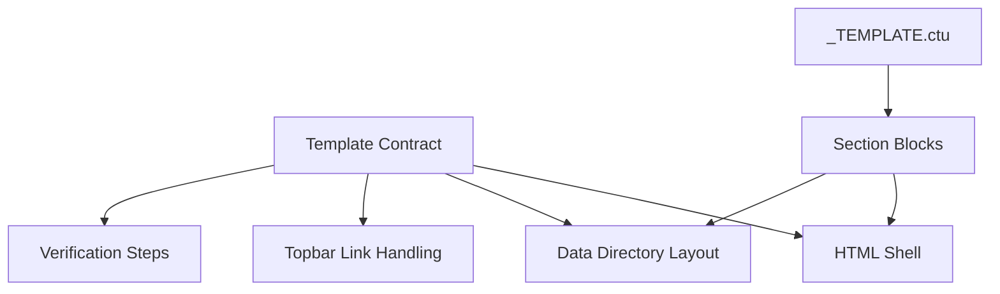
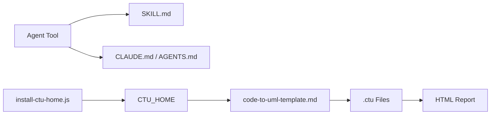

# AI Agent Integration

<cite>
**Referenced Files in This Document**
- [README.md](file://README.md)
- [README_zh.md](file://README_zh.md)
- [SKILL.md](file://skills/code-to-uml/SKILL.md)
- [openai.yaml](file://skills/code-to-uml/agents/openai.yaml)
- [install-ctu-home.js](file://install-ctu-home.js)
- [AGENTS.md](file://AGENTS.md)
- [CLAUDE.md](file://CLAUDE.md)
- [code-to-uml-template.md](file://skills/code-to-uml/references/code-to-uml-template.md)
- [_TEMPLATE.ctu](file://data/_TEMPLATE.ctu)
- [claude-code-guide.html](file://cache/claude-code-guide.html)
- [cc-haha overview--1_zh.ctu](file://data/cc-haha/overview--1_zh.ctu)
- [demo sequence--1_zh.ctu](file://data/demo/sequence--1_zh.ctu)
</cite>

## Table of Contents
1. [Introduction](#introduction)
2. [Project Structure](#project-structure)
3. [Core Components](#core-components)
4. [Architecture Overview](#architecture-overview)
5. [Detailed Component Analysis](#detailed-component-analysis)
6. [Dependency Analysis](#dependency-analysis)
7. [Performance Considerations](#performance-considerations)
8. [Troubleshooting Guide](#troubleshooting-guide)
9. [Conclusion](#conclusion)
10. [Appendices](#appendices)

## Introduction
This document explains how Code-To-UML integrates AI coding assistants to automatically generate UML-backed HTML analysis reports. It focuses on the SKILL.md structure that standardizes agent behavior, the CTU_HOME environment variable and registration process, agent configuration files, and YAML-based skill definitions. It also provides step-by-step setup and usage patterns for Cursor, Claude Code, Qwen Coder, and OpenAI Codex, and outlines the end-to-end workflow from code analysis to automated report generation. Finally, it includes troubleshooting guidance and best practices for reliable, reproducible AI-assisted report generation.

## Project Structure
The AI agent integration centers around a skill definition and a project root discovery mechanism:
- SKILL.md defines the agent’s purpose, constraints, workflow, and output contracts for Code-To-UML reports.
- install-ctu-home.js registers the project path as CTU_HOME and installs the bundled skill into agent skill directories.
- Agent-specific guidance documents (e.g., CLAUDE.md, AGENTS.md) provide tool-specific hints.
- The Code-To-UML template contract and .ctu data format define the structure of generated reports.

**Diagram sources**
- [SKILL.md:1-174](file://skills/code-to-uml/SKILL.md#L1-L174)
- [install-ctu-home.js:1-228](file://install-ctu-home.js#L1-L228)
- [code-to-uml-template.md:1-95](file://skills/code-to-uml/references/code-to-uml-template.md#L1-L95)
- [_TEMPLATE.ctu:1-46](file://data/_TEMPLATE.ctu#L1-L46)

**Section sources**
- [README.md:277-295](file://README.md#L277-L295)
- [README_zh.md:277-294](file://README_zh.md#L277-L294)

## Core Components
- SKILL.md: Defines purpose, hard rules, workflow, mandatory sections, UML standards, quality bar, verification checklist, and final response shape for AI-generated Code-To-UML reports.
- CTU_HOME and install-ctu-home.js: Centralizes project root resolution and installs the bundled skill into agent skill directories.
- Agent configuration (openai.yaml): Provides interface metadata for agents that consume the skill.
- Agent guidelines (CLAUDE.md, AGENTS.md): Offer tool-specific context and conventions for working with the repository.
- Template and data contracts (code-to-uml-template.md, _TEMPLATE.ctu): Specify HTML shell, data directory layout, and .ctu file format.

**Section sources**
- [SKILL.md:1-174](file://skills/code-to-uml/SKILL.md#L1-L174)
- [install-ctu-home.js:112-130](file://install-ctu-home.js#L112-L130)
- [openai.yaml:1-5](file://skills/code-to-uml/agents/openai.yaml#L1-L5)
- [code-to-uml-template.md:1-95](file://skills/code-to-uml/references/code-to-uml-template.md#L1-L95)
- [_TEMPLATE.ctu:1-46](file://data/_TEMPLATE.ctu#L1-L46)

## Architecture Overview
The AI agent integration architecture ties agent prompts and tooling to the Code-To-UML report pipeline:

**Diagram sources**
- [install-ctu-home.js:204-220](file://install-ctu-home.js#L204-L220)
- [SKILL.md:30-94](file://skills/code-to-uml/SKILL.md#L30-L94)
- [code-to-uml-template.md:15-38](file://skills/code-to-uml/references/code-to-uml-template.md#L15-L38)

## Detailed Component Analysis

### SKILL.md: AI Agent Skill Definition
SKILL.md establishes:
- Purpose: Produce consistent UML-backed HTML reports across project, module, file, class, or function scopes.
- Hard Rules: Root resolution via CTU_HOME, template reuse, read-only constraints, navigation handling, language defaults, and server invocation.
- Workflow: Scope resolution, template reading, structural analysis, normalized plan, data generation, HTML generation, UML self-check, server start and verification.
- Mandatory Sections: 13 standardized sections covering overview, structure, objects, architecture, flow, calls, dataflow, code, principles, guide, risks, Q&A, and maintainer quick reference.
- UML Standards: PlantUML-only syntax, diagram type guidance, readability, escaping, and detail requirement.
- Quality Bar: Concrete references, proportional synthesis, failure-path coverage, indexing, snippet limits, and actionable feedback.
- Verification Checklist: Read-only compliance, output existence, data directory and categories, .ctu syntax, UML checks, topbar links, server health, and final URL.

**Diagram sources**
- [SKILL.md:30-94](file://skills/code-to-uml/SKILL.md#L30-L94)
- [SKILL.md:95-122](file://skills/code-to-uml/SKILL.md#L95-L122)
- [SKILL.md:123-146](file://skills/code-to-uml/SKILL.md#L123-L146)
- [SKILL.md:147-163](file://skills/code-to-uml/SKILL.md#L147-L163)

**Section sources**
- [SKILL.md:8-29](file://skills/code-to-uml/SKILL.md#L8-L29)
- [SKILL.md:30-94](file://skills/code-to-uml/SKILL.md#L30-L94)
- [SKILL.md:95-163](file://skills/code-to-uml/SKILL.md#L95-L163)

### CTU_HOME Environment Variable and Registration
CTU_HOME is the canonical project root for AI-assisted report generation:
- If unset, the agent must resolve the root from the current working directory only if it contains the template marker files.
- install-ctu-home.js sets CTU_HOME and installs the bundled skill into agent skill directories. It supports Unix shells and Windows environments and can print commands for the current shell.

**Diagram sources**
- [install-ctu-home.js:204-220](file://install-ctu-home.js#L204-L220)
- [install-ctu-home.js:167-180](file://install-ctu-home.js#L167-L180)
- [install-ctu-home.js:182-202](file://install-ctu-home.js#L182-L202)

**Section sources**
- [SKILL.md:14-16](file://skills/code-to-uml/SKILL.md#L14-L16)
- [install-ctu-home.js:27-49](file://install-ctu-home.js#L27-L49)
- [install-ctu-home.js:204-220](file://install-ctu-home.js#L204-L220)

### Agent Configuration Files and YAML-Based Skill Definitions
- openai.yaml: Declares the skill’s display name, short description, and default prompt for agents that consume the skill definition.
- Agent-specific guidance:
  - CLAUDE.md: Provides Claude Code context, server running instructions, rendering pipeline, component modules, demo data conventions, i18n, and lightbox behavior.
  - AGENTS.md: Outlines repository structure, build/test/dev commands, coding style, testing guidelines, and commit/pr patterns.

**Diagram sources**
- [openai.yaml:1-5](file://skills/code-to-uml/agents/openai.yaml#L1-L5)
- [CLAUDE.md:9-21](file://CLAUDE.md#L9-L21)
- [CLAUDE.md:25-32](file://CLAUDE.md#L25-L32)
- [CLAUDE.md:34-50](file://CLAUDE.md#L34-L50)
- [CLAUDE.md:73-83](file://CLAUDE.md#L73-L83)
- [AGENTS.md:14-21](file://AGENTS.md#L14-L21)

**Section sources**
- [openai.yaml:1-5](file://skills/code-to-uml/agents/openai.yaml#L1-L5)
- [CLAUDE.md:1-100](file://CLAUDE.md#L1-L100)
- [AGENTS.md:1-46](file://AGENTS.md#L1-L46)

### Template and Data Contracts
- code-to-uml-template.md: Specifies HTML runtime contract, topbar link handling, .ctu file format, verification steps, and port cleanup location.
- _TEMPLATE.ctu: Defines the .ctu section structure and separators used by agents to generate report content.

**Diagram sources**
- [code-to-uml-template.md:23-48](file://skills/code-to-uml/references/code-to-uml-template.md#L23-L48)
- [code-to-uml-template.md:49-78](file://skills/code-to-uml/references/code-to-uml-template.md#L49-L78)
- [code-to-uml-template.md:79-95](file://skills/code-to-uml/references/code-to-uml-template.md#L79-L95)
- [_TEMPLATE.ctu:1-46](file://data/_TEMPLATE.ctu#L1-L46)

**Section sources**
- [code-to-uml-template.md:1-95](file://skills/code-to-uml/references/code-to-uml-template.md#L1-L95)
- [_TEMPLATE.ctu:1-46](file://data/_TEMPLATE.ctu#L1-L46)

### Example Artifacts
- claude-code-guide.html: Demonstrates a generated HTML report shell with tabs, overview paragraphs, and script loading.
- cc-haha overview--1_zh.ctu: Shows a multi-example .ctu file with UML diagrams and detailed explanations.
- demo sequence--1_zh.ctu: Illustrates a minimal .ctu example with a PlantUML sequence diagram and description.

**Section sources**
- [claude-code-guide.html:12-70](file://cache/claude-code-guide.html#L12-L70)
- [cc-haha overview--1_zh.ctu:1-153](file://data/cc-haha/overview--1_zh.ctu#L1-L153)
- [demo sequence--1_zh.ctu:1-22](file://data/demo/sequence--1_zh.ctu#L1-L22)

## Dependency Analysis
The AI agent integration depends on:
- Agent tooling consuming SKILL.md and optional agent-specific guidance.
- install-ctu-home.js to set CTU_HOME and install the skill into agent skill directories.
- Template and data contracts to validate generated artifacts.

**Diagram sources**
- [SKILL.md:1-174](file://skills/code-to-uml/SKILL.md#L1-L174)
- [install-ctu-home.js:112-130](file://install-ctu-home.js#L112-L130)
- [code-to-uml-template.md:1-95](file://skills/code-to-uml/references/code-to-uml-template.md#L1-L95)

**Section sources**
- [install-ctu-home.js:112-130](file://install-ctu-home.js#L112-L130)
- [SKILL.md:14-29](file://skills/code-to-uml/SKILL.md#L14-L29)

## Performance Considerations
- Prefer WASM-first rendering for most diagrams; rely on server fallback only when necessary.
- Batch-render UML blocks locally when PlantUML is available to catch syntax errors early.
- Keep report scope aligned with the requested depth to avoid unnecessary computation.
- Use concise code snippets (<30 lines) and focus on concrete examples to improve readability and reduce rendering overhead.

[No sources needed since this section provides general guidance]

## Troubleshooting Guide
Common integration issues and resolutions:
- CTU_HOME not set or incorrect:
  - Ensure install-ctu-home.js was run and that the environment variable is exported in new terminals or use the printed command for the current shell.
- Template mismatch or missing files:
  - Verify the presence of the template HTML and data template files under the resolved project root.
- UML syntax errors:
  - Perform static checks on [UML] blocks and, if available, batch-render with the local PlantUML JAR to detect rendering failures.
- Server port conflicts:
  - Allow the provided serve scripts to clean up the port; do not duplicate port-kill logic in the report-generation workflow.
- Navigation and topbar links:
  - Respect the template’s topbar link contract and remove placeholders if they no longer apply.

**Section sources**
- [SKILL.md:14-29](file://skills/code-to-uml/SKILL.md#L14-L29)
- [SKILL.md:78-94](file://skills/code-to-uml/SKILL.md#L78-L94)
- [code-to-uml-template.md:79-95](file://skills/code-to-uml/references/code-to-uml-template.md#L79-L95)

## Conclusion
By aligning agent behavior with SKILL.md, resolving the project root via CTU_HOME, and adhering to the template and data contracts, AI coding assistants can reliably generate consistent, UML-backed HTML reports. The provided setup and verification steps ensure reproducibility and high-quality outputs across Cursor, Claude Code, Qwen Coder, and OpenAI Codex.

[No sources needed since this section summarizes without analyzing specific files]

## Appendices

### Step-by-Step Setup and Usage Patterns

- Cursor
  - Install CTU_HOME and register the skill:
    - Run the installer and open a new terminal session.
  - Provide agent-specific guidance:
    - Refer to repository guidelines for structure and commands.
  - Generate a report:
    - Point Cursor to the skill definition and request an analysis for the desired scope.
  - Verify:
    - Confirm the HTML and .ctu files, run the server, and validate the report URL.

  **Section sources**
  - [AGENTS.md:14-21](file://AGENTS.md#L14-L21)
  - [README.md:97-111](file://README.md#L97-L111)

- Claude Code
  - Install CTU_HOME and register the skill:
    - Run the installer and open a new terminal session.
  - Use Claude-specific guidance:
    - Follow the rendering pipeline, component modules, and demo data conventions.
  - Generate a report:
    - Ask Claude to analyze the codebase using the skill definition.
  - Verify:
    - Confirm the HTML and .ctu files, run the server, and validate the report URL.

  **Section sources**
  - [CLAUDE.md:9-21](file://CLAUDE.md#L9-L21)
  - [CLAUDE.md:25-32](file://CLAUDE.md#L25-L32)
  - [CLAUDE.md:50-50](file://CLAUDE.md#L50-L50)
  - [README.md:97-111](file://README.md#L97-L111)

- Qwen Coder
  - Install CTU_HOME and register the skill:
    - Run the installer and open a new terminal session.
  - Provide agent-specific guidance:
    - Use the skill definition and template contracts to structure the report.
  - Generate a report:
    - Request Qwen to analyze the codebase and produce .ctu files and an HTML report.
  - Verify:
    - Confirm the HTML and .ctu files, run the server, and validate the report URL.

  **Section sources**
  - [README.md:277-295](file://README.md#L277-L295)
  - [README_zh.md:277-294](file://README_zh.md#L277-L294)
  - [README.md:97-111](file://README.md#L97-L111)

- OpenAI Codex
  - Install CTU_HOME and register the skill:
    - Run the installer and open a new terminal session.
  - Provide agent-specific guidance:
    - Use the skill definition and template contracts to structure the report.
  - Generate a report:
    - Ask Codex to analyze the codebase and produce .ctu files and an HTML report.
  - Verify:
    - Confirm the HTML and .ctu files, run the server, and validate the report URL.

  **Section sources**
  - [openai.yaml:1-5](file://skills/code-to-uml/agents/openai.yaml#L1-L5)
  - [README.md:277-295](file://README.md#L277-L295)
  - [README_zh.md:277-294](file://README_zh.md#L277-L294)
  - [README.md:97-111](file://README.md#L97-L111)

### Best Practices for Optimizing AI-Assisted Report Generation
- Align agent prompts with SKILL.md’s hard rules and workflow.
- Use the template’s topbar link contract to ensure navigation correctness.
- Keep UML diagrams focused and explain the rationale behind each diagram.
- Prefer concise code snippets and include concrete references to source locations.
- Validate report completeness against the mandatory sections and verification checklist.

**Section sources**
- [SKILL.md:123-163](file://skills/code-to-uml/SKILL.md#L123-L163)