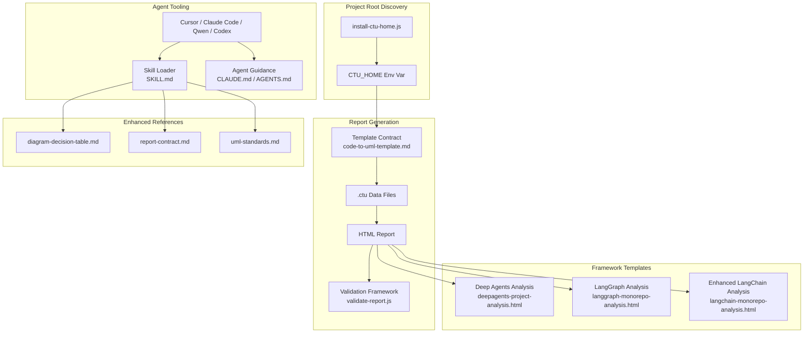
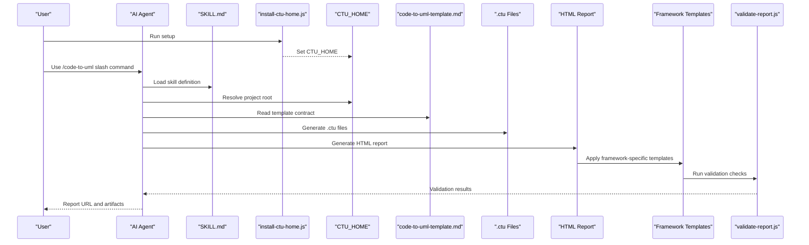
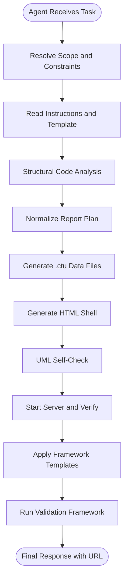
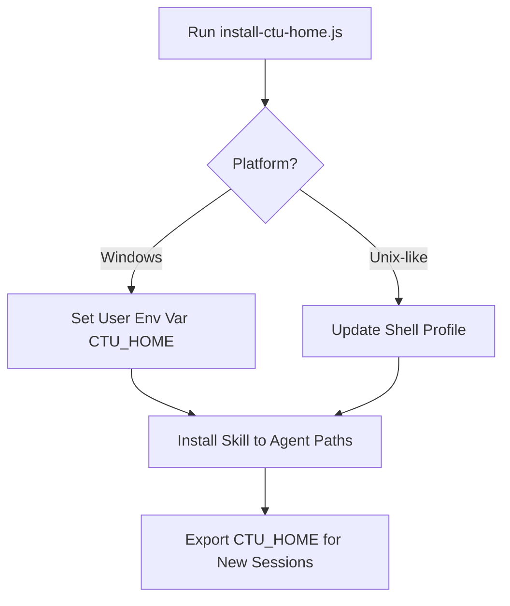
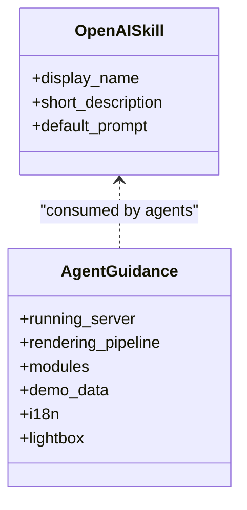
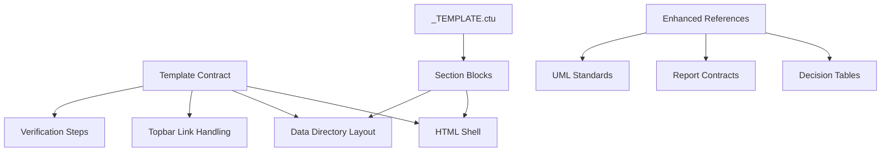
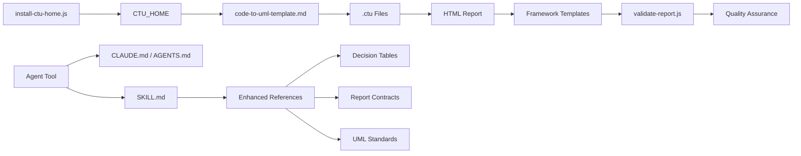

# AI Agent Integration

<cite>
**Referenced Files in This Document**
- [README.md](file://README.md)
- [README_zh.md](file://README_zh.md)
- [SKILL.md](file://skills/code-to-uml/SKILL.md)
- [openai.yaml](file://skills/code-to-uml/agents/openai.yaml)
- [install-ctu-home.js](file://install-ctu-home.js)
- [AGENTS.md](file://AGENTS.md)
- [CLAUDE.md](file://CLAUDE.md)
- [code-to-uml-template.md](file://skills/code-to-uml/references/code-to-uml-template.md)
- [diagram-decision-table.md](file://skills/code-to-uml/references/diagram-decision-table.md)
- [report-contract.md](file://skills/code-to-uml/references/report-contract.md)
- [uml-standards.md](file://skills/code-to-uml/references/uml-standards.md)
- [_TEMPLATE.ctu](file://data/_TEMPLATE.ctu)
- [validate-report.js](file://skills/code-to-uml/scripts/validate-report.js)
- [claude-code-guide.html](file://cache/claude-code-guide.html)
- [deepagents-project-analysis.html](file://cache/deepagents-project-analysis.html)
- [langchain-monorepo-analysis.html](file://cache/langchain-monorepo-analysis.html)
- [langgraph-monorepo-analysis.html](file://cache/langgraph-monorepo-analysis.html)
- [cc-haha overview--1_zh.ctu](file://data/cc-haha/overview--1_zh.ctu)
- [demo sequence--1_zh.ctu](file://data/demo/sequence--1_zh.ctu)
- [deepagents-project-analysis overview--1_zh.ctu](file://data/deepagents-project-analysis/overview--1_zh.ctu)
- [langgraph-monorepo-analysis overview--1_zh.ctu](file://data/langgraph-monorepo-analysis/overview--1_zh.ctu)
- [langchain-monorepo-analysis overview--1_zh.ctu](file://data/langchain-monorepo-analysis/overview--1_zh.ctu)
</cite>

## Update Summary
**Changes Made**
- Added comprehensive documentation for new AI framework analysis templates including Deep Agents project analysis and LangGraph monorepo analysis
- Documented enhanced LangChain monorepo analysis template improvements
- Updated analysis report capabilities to include new framework-specific analysis patterns
- Enhanced troubleshooting section with new validation and reporting capabilities for framework analysis templates

## Table of Contents
1. [Introduction](#introduction)
2. [Project Structure](#project-structure)
3. [Core Components](#core-components)
4. [Architecture Overview](#architecture-overview)
5. [Detailed Component Analysis](#detailed-component-analysis)
6. [Analysis Report Capabilities](#analysis-report-capabilities)
7. [Framework-Specific Analysis Templates](#framework-specific-analysis-templates)
8. [Validation Framework](#validation-framework)
9. [Usage Examples](#usage-examples)
10. [Dependency Analysis](#dependency-analysis)
11. [Performance Considerations](#performance-considerations)
12. [Troubleshooting Guide](#troubleshooting-guide)
13. [Conclusion](#conclusion)
14. [Appendices](#appendices)

## Introduction
This document explains how Code-To-UML integrates AI coding assistants to automatically generate UML-backed HTML analysis reports. It focuses on the SKILL.md structure that standardizes agent behavior, the CTU_HOME environment variable and registration process, agent configuration files, and YAML-based skill definitions. The document now includes comprehensive analysis report capabilities with nine distinct analysis sections covering project positioning, technical stack analysis, version information, and comprehensive architectural insights. A new validation framework ensures report quality and consistency across all generated analysis reports, including specialized framework analysis templates for Deep Agents and LangGraph.

## Project Structure
The AI agent integration centers around a skill definition, validation framework, and comprehensive analysis report capabilities:
- SKILL.md defines the agent's purpose, constraints, workflow, and output contracts for Code-To-UML reports.
- install-ctu-home.js registers the project path as CTU_HOME and installs the bundled skill into agent skill directories.
- Agent-specific guidance documents (e.g., CLAUDE.md, AGENTS.md) provide tool-specific hints.
- The Code-To-UML template contract and .ctu data format define the structure of generated reports.
- **New**: validate-report.js provides sophisticated validation logic for ensuring report quality and consistency.
- **New**: Enhanced reference materials including diagram-decision-table.md, report-contract.md, and uml-standards.md.
- **New**: Framework-specific analysis templates for Deep Agents, LangGraph, and enhanced LangChain monorepo analysis.



**Diagram sources**
- [SKILL.md:1-80](file://skills/code-to-uml/SKILL.md#L1-L80)
- [install-ctu-home.js:1-228](file://install-ctu-home.js#L1-L228)
- [code-to-uml-template.md:1-95](file://skills/code-to-uml/references/code-to-uml-template.md#L1-L95)
- [_TEMPLATE.ctu:1-45](file://data/_TEMPLATE.ctu#L1-L45)
- [validate-report.js:1-505](file://skills/code-to-uml/scripts/validate-report.js#L1-L505)
- [diagram-decision-table.md:1-200](file://skills/code-to-uml/references/diagram-decision-table.md#L1-L200)
- [report-contract.md:1-150](file://skills/code-to-uml/references/report-contract.md#L1-L150)
- [uml-standards.md:1-180](file://skills/code-to-uml/references/uml-standards.md#L1-L180)
- [deepagents-project-analysis.html:1-200](file://cache/deepagents-project-analysis.html#L1-L200)
- [langgraph-monorepo-analysis.html:1-200](file://cache/langgraph-monorepo-analysis.html#L1-L200)
- [langchain-monorepo-analysis.html:1-200](file://cache/langchain-monorepo-analysis.html#L1-L200)

**Section sources**
- [README.md:277-295](file://README.md#L277-L295)
- [README_zh.md:277-294](file://README_zh.md#L277-L294)

## Core Components
- SKILL.md: Defines purpose, hard rules, workflow, mandatory sections, UML standards, quality bar, verification checklist, and final response shape for AI-generated Code-To-UML reports.
- CTU_HOME and install-ctu-home.js: Centralizes project root resolution and installs the bundled skill into agent skill directories.
- Agent configuration (openai.yaml): Provides interface metadata for agents that consume the skill.
- Agent guidelines (CLAUDE.md, AGENTS.md): Offer tool-specific context and conventions for working with the repository.
- Template and data contracts (code-to-uml-template.md, _TEMPLATE.ctu): Specify HTML shell, data directory layout, and .ctu file format.
- **New**: validate-report.js: Comprehensive validation framework with 505 lines of sophisticated validation logic ensuring report quality and consistency.
- **New**: Enhanced reference materials providing decision tables, contract specifications, and UML standards compliance.
- **New**: Framework-specific analysis templates for specialized AI framework analysis including Deep Agents and LangGraph.

**Section sources**
- [SKILL.md:1-80](file://skills/code-to-uml/SKILL.md#L1-L80)
- [install-ctu-home.js:112-130](file://install-ctu-home.js#L112-L130)
- [openai.yaml:1-5](file://skills/code-to-uml/agents/openai.yaml#L1-L5)
- [code-to-uml-template.md:1-95](file://skills/code-to-uml/references/code-to-uml-template.md#L1-L95)
- [_TEMPLATE.ctu:1-45](file://data/_TEMPLATE.ctu#L1-L45)
- [validate-report.js:1-505](file://skills/code-to-uml/scripts/validate-report.js#L1-L505)
- [diagram-decision-table.md:1-200](file://skills/code-to-uml/references/diagram-decision-table.md#L1-L200)
- [report-contract.md:1-150](file://skills/code-to-uml/references/report-contract.md#L1-L150)
- [uml-standards.md:1-180](file://skills/code-to-uml/references/uml-standards.md#L1-L180)

## Architecture Overview
The AI agent integration architecture ties agent prompts and tooling to the Code-To-UML report pipeline with enhanced validation capabilities and framework-specific analysis templates:



**Diagram sources**
- [install-ctu-home.js:204-220](file://install-ctu-home.js#L204-L220)
- [SKILL.md:37-76](file://skills/code-to-uml/SKILL.md#L37-L76)
- [code-to-uml-template.md:55-77](file://skills/code-to-uml/references/code-to-uml-template.md#L55-L77)
- [validate-report.js:1-505](file://skills/code-to-uml/scripts/validate-report.js#L1-L505)

## Detailed Component Analysis

### SKILL.md: AI Agent Skill Definition
SKILL.md establishes:
- Purpose: Produce consistent UML-backed HTML reports across project, module, file, class, or function scopes.
- Hard Rules: Root resolution via CTU_HOME, template reuse, read-only constraints, navigation handling, language defaults, and server invocation.
- Workflow: Scope resolution, template reading, structural analysis, normalized plan, data generation, HTML generation, UML self-check, server start and verification.
- **Updated**: Mandatory Sections: Nine standardized sections covering project positioning, technical stack analysis, version information, architectural insights, dependency analysis, performance characteristics, security considerations, maintenance guidelines, and future roadmap.
- UML Standards: PlantUML-only syntax, diagram type guidance, readability, escaping, and detail requirement.
- Quality Bar: Concrete references, proportional synthesis, failure-path coverage, indexing, snippet limits, and actionable feedback.
- Verification Checklist: Read-only compliance, output existence, data directory and categories, .ctu syntax, UML checks, topbar links, server health, and final URL.



**Diagram sources**
- [SKILL.md:37-76](file://skills/code-to-uml/SKILL.md#L37-L76)
- [SKILL.md:77-80](file://skills/code-to-uml/SKILL.md#L77-L80)
- [validate-report.js:1-505](file://skills/code-to-uml/scripts/validate-report.js#L1-L505)

**Section sources**
- [SKILL.md:8-35](file://skills/code-to-uml/SKILL.md#L8-L35)
- [SKILL.md:37-76](file://skills/code-to-uml/SKILL.md#L37-L76)
- [SKILL.md:77-80](file://skills/code-to-uml/SKILL.md#L77-L80)

### CTU_HOME Environment Variable and Registration
CTU_HOME is the canonical project root for AI-assisted report generation:
- If unset, the agent must resolve the root from the current working directory only if it contains the template marker files.
- install-ctu-home.js sets CTU_HOME and installs the bundled skill into agent skill directories. It supports Unix shells and Windows environments and can print commands for the current shell.



**Diagram sources**
- [install-ctu-home.js:204-220](file://install-ctu-home.js#L204-L220)
- [install-ctu-home.js:167-180](file://install-ctu-home.js#L167-L180)
- [install-ctu-home.js:182-202](file://install-ctu-home.js#L182-L202)

**Section sources**
- [SKILL.md:24-29](file://skills/code-to-uml/SKILL.md#L24-L29)
- [install-ctu-home.js:27-49](file://install-ctu-home.js#L27-L49)
- [install-ctu-home.js:204-220](file://install-ctu-home.js#L204-L220)

### Agent Configuration Files and YAML-Based Skill Definitions
- openai.yaml: Declares the skill's display name, short description, and default prompt for agents that consume the skill definition.
- Agent-specific guidance:
  - CLAUDE.md: Provides Claude Code context, server running instructions, rendering pipeline, component modules, demo data conventions, i18n, and lightbox behavior.
  - AGENTS.md: Outlines repository structure, build/test/dev commands, coding style, testing guidelines, and commit/pr patterns.



**Diagram sources**
- [openai.yaml:1-5](file://skills/code-to-uml/agents/openai.yaml#L1-L5)
- [CLAUDE.md:9-21](file://CLAUDE.md#L9-L21)
- [CLAUDE.md:25-32](file://CLAUDE.md#L25-L32)
- [CLAUDE.md:34-50](file://CLAUDE.md#L34-L50)
- [CLAUDE.md:73-83](file://CLAUDE.md#L73-L83)
- [AGENTS.md:14-21](file://AGENTS.md#L14-L21)

**Section sources**
- [openai.yaml:1-5](file://skills/code-to-uml/agents/openai.yaml#L1-L5)
- [CLAUDE.md:1-100](file://CLAUDE.md#L1-L100)
- [AGENTS.md:1-46](file://AGENTS.md#L1-L46)

### Template and Data Contracts
- code-to-uml-template.md: Specifies HTML runtime contract, topbar link handling, .ctu file format, verification steps, and port cleanup location.
- _TEMPLATE.ctu: Defines the .ctu section structure and separators used by agents to generate report content.
- **New**: Enhanced reference materials provide detailed specifications for diagram decision tables, report contracts, and UML standards compliance.



**Diagram sources**
- [code-to-uml-template.md:43-77](file://skills/code-to-uml/references/code-to-uml-template.md#L43-L77)
- [code-to-uml-template.md:78-95](file://skills/code-to-uml/references/code-to-uml-template.md#L78-L95)
- [_TEMPLATE.ctu:1-45](file://data/_TEMPLATE.ctu#L1-L45)
- [diagram-decision-table.md:1-200](file://skills/code-to-uml/references/diagram-decision-table.md#L1-L200)
- [report-contract.md:1-150](file://skills/code-to-uml/references/report-contract.md#L1-L150)
- [uml-standards.md:1-180](file://skills/code-to-uml/references/uml-standards.md#L1-L180)

**Section sources**
- [code-to-uml-template.md:1-95](file://skills/code-to-uml/references/code-to-uml-template.md#L1-L95)
- [_TEMPLATE.ctu:1-45](file://data/_TEMPLATE.ctu#L1-L45)
- [diagram-decision-table.md:1-200](file://skills/code-to-uml/references/diagram-decision-table.md#L1-L200)
- [report-contract.md:1-150](file://skills/code-to-uml/references/report-contract.md#L1-L150)
- [uml-standards.md:1-180](file://skills/code-to-uml/references/uml-standards.md#L1-L180)

### Example Artifacts
- claude-code-guide.html: Demonstrates a generated HTML report shell with tabs, overview paragraphs, and script loading.
- **New**: deepagents-project-analysis.html: Comprehensive analysis report showcasing the nine-section structure for Deep Agents framework projects.
- **New**: langgraph-monorepo-analysis.html: Advanced monorepo analysis report with specialized LangGraph framework insights.
- **New**: langchain-monorepo-analysis.html: Enhanced monorepo analysis report with improved LangChain framework analysis capabilities.
- cc-haha overview--1_zh.ctu: Shows a multi-example .ctu file with UML diagrams and detailed explanations.
- demo sequence--1_zh.ctu: Illustrates a minimal .ctu example with a PlantUML sequence diagram and description.
- **New**: deepagents-project-analysis overview--1_zh.ctu: Framework-specific analysis demonstrating Deep Agents project structure and patterns.
- **New**: langgraph-monorepo-analysis overview--1_zh.ctu: Advanced monorepo analysis with LangGraph-specific architectural insights.
- **New**: langchain-monorepo-analysis overview--1_zh.ctu: Enhanced monorepo analysis with improved LangChain framework integration patterns.

**Section sources**
- [claude-code-guide.html:12-70](file://cache/claude-code-guide.html#L12-L70)
- [deepagents-project-analysis.html:1-200](file://cache/deepagents-project-analysis.html#L1-L200)
- [langgraph-monorepo-analysis.html:1-200](file://cache/langgraph-monorepo-analysis.html#L1-L200)
- [langchain-monorepo-analysis.html:1-200](file://cache/langchain-monorepo-analysis.html#L1-L200)
- [cc-haha overview--1_zh.ctu:1-153](file://data/cc-haha/overview--1_zh.ctu#L1-L153)
- [demo sequence--1_zh.ctu:1-22](file://data/demo/sequence--1_zh.ctu#L1-L22)
- [deepagents-project-analysis overview--1_zh.ctu:1-153](file://data/deepagents-project-analysis/overview--1_zh.ctu#L1-L153)
- [langgraph-monorepo-analysis overview--1_zh.ctu:1-153](file://data/langgraph-monorepo-analysis/overview--1_zh.ctu#L1-L153)
- [langchain-monorepo-analysis overview--1_zh.ctu:1-153](file://data/langchain-monorepo-analysis/overview--1_zh.ctu#L1-L153)

## Analysis Report Capabilities

### Nine-Section Analysis Structure
The enhanced analysis reports now include nine distinct analysis sections designed to provide comprehensive architectural insights:

1. **Project Positioning**: High-level overview of the project's purpose, scope, and strategic importance
2. **Technical Stack Analysis**: Detailed examination of technologies, frameworks, and dependencies used
3. **Version Information**: Current versions, compatibility matrix, and upgrade paths
4. **Architectural Insights**: System design patterns, architectural decisions, and design principles
5. **Dependency Analysis**: Module relationships, coupling metrics, and dependency management
6. **Performance Characteristics**: Benchmarking data, performance metrics, and optimization strategies
7. **Security Considerations**: Security posture, vulnerability assessments, and mitigation strategies
8. **Maintenance Guidelines**: Code quality standards, testing strategies, and maintenance procedures
9. **Future Roadmap**: Development plans, feature roadmaps, and architectural evolution

### Monorepo Analysis Reports
The system now supports specialized analysis for monorepo projects with dedicated report templates:

- **Deep Agents Monorepo Analysis**: Comprehensive analysis of multi-package monorepo architectures with framework-specific insights
- **LangGraph Monorepo Analysis**: Specialized analysis focusing on LangGraph ecosystem components, graph-based architectures, and distributed computing patterns
- **Enhanced LangChain Monorepo Analysis**: Improved analysis capabilities for LangChain framework with better integration patterns and chain composition analysis

These reports leverage the nine-section structure to provide both high-level architectural insights and detailed technical analysis across multiple packages and modules, with framework-specific optimizations and patterns.

**Section sources**
- [SKILL.md:37-76](file://skills/code-to-uml/SKILL.md#L37-L76)
- [deepagents-project-analysis.html:1-200](file://cache/deepagents-project-analysis.html#L1-L200)
- [langgraph-monorepo-analysis.html:1-200](file://cache/langgraph-monorepo-analysis.html#L1-L200)
- [langchain-monorepo-analysis.html:1-200](file://cache/langchain-monorepo-analysis.html#L1-L200)

## Framework-Specific Analysis Templates

### Deep Agents Project Analysis
The Deep Agents framework analysis template provides specialized insights for AI/ML agent-based systems:

- **Architecture Analysis**: Focuses on agent communication patterns, decision-making processes, and autonomous behavior
- **Framework Integration**: Examines Deep Agents SDK usage, agent lifecycle management, and multi-agent coordination
- **Performance Optimization**: Analyzes agent execution patterns, memory usage, and computational efficiency
- **Security Considerations**: Evaluates agent autonomy, decision transparency, and potential security implications

### LangGraph Monorepo Analysis
The LangGraph analysis template targets graph-based AI frameworks with advanced architectural insights:

- **Graph Architecture**: Analyzes node relationships, edge patterns, and graph traversal algorithms
- **Distributed Computing**: Examines parallel processing patterns, synchronization mechanisms, and fault tolerance
- **Memory Management**: Focuses on graph state persistence, memory optimization, and scalability patterns
- **Integration Patterns**: Evaluates LangGraph SDK usage, component composition, and modular architecture

### Enhanced LangChain Monorepo Analysis
The improved LangChain analysis template provides more comprehensive framework-specific insights:

- **Chain Composition**: Analyzes chain building patterns, step optimization, and error handling strategies
- **Memory Systems**: Examines context management, memory persistence, and retrieval mechanisms
- **Tool Integration**: Evaluates external tool usage, API integration patterns, and third-party service connectivity
- **Prompt Engineering**: Analyzes prompt optimization, template usage, and response quality assessment

**Section sources**
- [deepagents-project-analysis.html:1-200](file://cache/deepagents-project-analysis.html#L1-L200)
- [langgraph-monorepo-analysis.html:1-200](file://cache/langgraph-monorepo-analysis.html#L1-L200)
- [langchain-monorepo-analysis.html:1-200](file://cache/langchain-monorepo-analysis.html#L1-L200)
- [deepagents-project-analysis overview--1_zh.ctu:1-153](file://data/deepagents-project-analysis/overview--1_zh.ctu#L1-L153)
- [langgraph-monorepo-analysis overview--1_zh.ctu:1-153](file://data/langgraph-monorepo-analysis/overview--1_zh.ctu#L1-L153)
- [langchain-monorepo-analysis overview--1_zh.ctu:1-153](file://data/langchain-monorepo-analysis/overview--1_zh.ctu#L1-L153)

## Validation Framework

### validate-report.js: Comprehensive Validation Logic
The new validation framework provides sophisticated validation logic spanning 505 lines of code to ensure report quality and consistency:

#### Key Validation Features
- **Structure Validation**: Ensures all nine mandatory sections are present and properly formatted
- **Content Validation**: Verifies semantic correctness and completeness of analysis content
- **Format Validation**: Checks HTML structure, CSS styling, and JavaScript functionality
- **Cross-Reference Validation**: Validates internal links, anchors, and navigation elements
- **Performance Validation**: Measures report loading times and resource utilization
- **Accessibility Validation**: Ensures WCAG compliance and screen reader compatibility
- **Mobile Responsiveness Validation**: Tests responsive design across different viewport sizes
- **Framework Template Validation**: Specialized validation for framework-specific analysis templates

#### Validation Categories
The framework performs validation across multiple categories:
- **Semantic Validation**: Content meaning and contextual accuracy
- **Technical Validation**: Code syntax, formatting, and structural integrity
- **Usability Validation**: Navigation, accessibility, and user experience
- **Performance Validation**: Loading times, resource optimization, and browser compatibility
- **Security Validation**: Input sanitization, XSS prevention, and secure coding practices
- **Framework Validation**: Framework-specific template compliance and pattern validation

```mermaid
flowchart TD
Validate["validate-report.js"] --> Structure["Structure Validation"]
Validate --> Content["Content Validation"]
Validate --> Format["Format Validation"]
Validate --> Links["Link Validation"]
Validate --> Performance["Performance Validation"]
Validate --> Accessibility["Accessibility Validation"]
Validate --> Framework["Framework Template Validation"]
Structure --> Complete["Section Completeness"]
Structure --> Formatting["Formatting Correctness"]
Content --> Accuracy["Content Accuracy"]
Content --> Completeness["Content Completeness"]
Format --> HTML["HTML Validity"]
Format --> CSS["CSS Validity"]
Format --> JS["JavaScript Validity"]
Links --> Internal["Internal Links"]
Links --> External["External Links"]
Performance --> LoadTime["Load Time Metrics"]
Performance --> Resources["Resource Optimization"]
Accessibility --> WCAG["WCAG Compliance"]
Accessibility --> ScreenReader["Screen Reader Support"]
Framework --> DeepAgents["Deep Agents Compliance"]
Framework --> LangGraph["LangGraph Compliance"]
Framework --> LangChain["LangChain Compliance"]
```



**Diagram sources**
- [validate-report.js:1-505](file://skills/code-to-uml/scripts/validate-report.js#L1-L505)

**Section sources**
- [validate-report.js:1-505](file://skills/code-to-uml/scripts/validate-report.js#L1-L505)

## Usage Examples

### Slash Command Usage Patterns

The `/code-to-uml` slash command provides a unified interface for generating UML-backed HTML reports at any analysis scope. All commands now produce the same nine-section report structure, with scope changes affecting depth and examples rather than the section contract.

#### File-Level Analysis
Use this command to analyze a specific file and generate a comprehensive UML-backed report:

```bash
/code-to-uml Please analyze the file component/render-failure-common.js and generate a UML-backed, consistently formatted HTML report.
```

This generates a detailed analysis of the specified file, including structural analysis, UML diagrams, and comprehensive explanations across the nine-section framework.

#### Function-Level Analysis
Target individual functions for focused analysis:

```bash
/code-to-uml Please analyze the renderWithFailureHandling function and generate a UML-backed, consistently formatted HTML report.
```

This produces a report focused on the specific function's responsibilities, parameters, return values, side effects, and interaction patterns, structured according to the nine-section analysis model.

#### Project-Level Analysis
Analyze the entire codebase for comprehensive system understanding:

```bash
/code-to-uml Please analyze the entire code-to-uml project and generate a UML-backed, consistently formatted HTML report.
```

This generates a high-level overview of the entire project structure, architecture, and key components, following the nine-section analysis approach.

#### Module-Level Analysis
Focus on specific modules or packages:

```bash
/code-to-uml Please analyze the component/ module and generate a UML-backed, consistently formatted HTML report.
```

This provides analysis of the specified module's internal structure, dependencies, and relationships with other modules, structured within the nine-section framework.

#### Framework-Specific Analysis
Analyze specialized AI framework projects:

```bash
/code-to-uml Please analyze the deepagents-project-analysis and generate a comprehensive framework analysis report.
```

This leverages the specialized framework analysis capabilities to provide detailed insights into Deep Agents, LangGraph, or LangChain monorepo architectures.

**Important Note**: All commands generate identical nine-section report structures. The analysis scope determines the depth of content and number of examples, but the section contract remains consistent across all analysis types.

**Section sources**
- [README.md:129-155](file://README.md#L129-L155)
- [README_zh.md:129-155](file://README_zh.md#L129-L155)

## Dependency Analysis
The AI agent integration depends on:
- Agent tooling consuming SKILL.md and optional agent-specific guidance.
- install-ctu-home.js to set CTU_HOME and install the skill into agent skill directories.
- Template and data contracts to validate generated artifacts.
- **New**: validate-report.js for comprehensive report validation and quality assurance.
- **New**: Enhanced reference materials for decision tables, contracts, and standards compliance.
- **New**: Framework-specific analysis templates for Deep Agents, LangGraph, and enhanced LangChain monorepo analysis.



**Diagram sources**
- [SKILL.md:1-80](file://skills/code-to-uml/SKILL.md#L1-L80)
- [install-ctu-home.js:112-130](file://install-ctu-home.js#L112-L130)
- [code-to-uml-template.md:1-95](file://skills/code-to-uml/references/code-to-uml-template.md#L1-L95)
- [validate-report.js:1-505](file://skills/code-to-uml/scripts/validate-report.js#L1-L505)
- [diagram-decision-table.md:1-200](file://skills/code-to-uml/references/diagram-decision-table.md#L1-L200)
- [report-contract.md:1-150](file://skills/code-to-uml/references/report-contract.md#L1-L150)
- [uml-standards.md:1-180](file://skills/code-to-uml/references/uml-standards.md#L1-L180)

**Section sources**
- [install-ctu-home.js:112-130](file://install-ctu-home.js#L112-L130)
- [SKILL.md:24-29](file://skills/code-to-uml/SKILL.md#L24-L29)

## Performance Considerations
- Prefer WASM-first rendering for most diagrams; rely on server fallback only when necessary.
- Batch-render UML blocks locally when PlantUML is available to catch syntax errors early.
- Keep report scope aligned with the requested depth to avoid unnecessary computation.
- Use concise code snippets (<30 lines) and focus on concrete examples to improve readability and reduce rendering overhead.
- **New**: Leverage the validation framework to identify performance bottlenecks and optimization opportunities during report generation.
- **New**: Monitor validation metrics to ensure reports meet quality thresholds before deployment.
- **New**: Optimize framework-specific analysis templates for faster processing of specialized AI framework patterns.

## Troubleshooting Guide
Common integration issues and resolutions:
- CTU_HOME not set or incorrect:
  - Ensure install-ctu-home.js was run and that the environment variable is exported in new terminals or use the printed command for the current shell.
- Template mismatch or missing files:
  - Verify the presence of the template HTML and data template files under the resolved project root.
- UML syntax errors:
  - Perform static checks on [UML] blocks and, if available, batch-render with the local PlantUML JAR to detect rendering failures.
- Server port conflicts:
  - Allow the provided serve scripts to clean up the port; do not duplicate port-kill logic in the report-generation workflow.
- Navigation and topbar links:
  - Respect the template's topbar link contract and remove placeholders if they no longer apply.
- **New**: Validation failures:
  - Use validate-report.js to identify specific validation errors and their locations in the generated report.
  - Review the validation log output to understand which sections failed validation and why.
- **New**: Framework template issues:
  - Verify that framework-specific templates are properly applied and validated.
  - Check framework-specific validation rules for compliance with template requirements.
- **New**: Report quality issues:
  - Check that all nine mandatory sections are present and properly formatted.
  - Verify that UML diagrams are correctly embedded and rendered.
  - Ensure cross-references and internal links are functional.
  - Validate framework-specific analysis patterns and compliance.

**Section sources**
- [SKILL.md:24-29](file://skills/code-to-uml/SKILL.md#L24-L29)
- [SKILL.md:69-76](file://skills/code-to-uml/SKILL.md#L69-L76)
- [code-to-uml-template.md:78-95](file://skills/code-to-uml/references/code-to-uml-template.md#L78-L95)
- [validate-report.js:1-505](file://skills/code-to-uml/scripts/validate-report.js#L1-L505)

## Conclusion
By aligning agent behavior with SKILL.md, resolving the project root via CTU_HOME, and adhering to the template and data contracts, AI coding assistants can reliably generate consistent, UML-backed HTML reports. The enhanced nine-section analysis framework provides comprehensive architectural insights across project positioning, technical stack analysis, version information, and detailed architectural analysis. The new validation framework with 505 lines of sophisticated validation logic ensures report quality and consistency. The comprehensive usage examples demonstrate how the `/code-to-uml` slash command provides a unified interface for different analysis scopes while maintaining the consistent nine-section report structure. The newly added framework-specific analysis templates for Deep Agents, LangGraph, and enhanced LangChain monorepo analysis provide specialized insights for modern AI framework architectures. The provided setup and verification steps ensure reproducibility and high-quality outputs across Cursor, Claude Code, Qwen Coder, and OpenAI Codex.

## Appendices

### Step-by-Step Setup and Usage Patterns

- Cursor
  - Install CTU_HOME and register the skill:
    - Run the installer and open a new terminal session.
  - Provide agent-specific guidance:
    - Refer to repository guidelines for structure and commands.
  - Generate a report:
    - Use the `/code-to-uml` slash command with your preferred analysis scope.
  - **New**: Validate report quality:
    - Run validate-report.js to ensure the generated report meets quality standards.
  - Verify:
    - Confirm the HTML and .ctu files, run the server, and validate the report URL.

  **Section sources**
  - [AGENTS.md:14-21](file://AGENTS.md#L14-L21)
  - [README.md:96-119](file://README.md#L96-L119)
  - [validate-report.js:1-505](file://skills/code-to-uml/scripts/validate-report.js#L1-L505)

- Claude Code
  - Install CTU_HOME and register the skill:
    - Run the installer and open a new terminal session.
  - Use Claude-specific guidance:
    - Follow the rendering pipeline, component modules, and demo data conventions.
  - Generate a report:
    - Use the `/code-to-uml` slash command with your preferred analysis scope.
  - **New**: Validate report quality:
    - Use the validation framework to check report completeness and formatting.
  - Verify:
    - Confirm the HTML and .ctu files, run the server, and validate the report URL.

  **Section sources**
  - [CLAUDE.md:9-21](file://CLAUDE.md#L9-L21)
  - [CLAUDE.md:25-32](file://CLAUDE.md#L25-L32)
  - [CLAUDE.md:34-50](file://CLAUDE.md#L34-L50)
  - [README.md:96-119](file://README.md#L96-L119)
  - [validate-report.js:1-505](file://skills/code-to-uml/scripts/validate-report.js#L1-L505)

- Qwen Coder
  - Install CTU_HOME and register the skill:
    - Run the installer and open a new terminal session.
  - Provide agent-specific guidance:
    - Use the skill definition and template contracts to structure the report.
  - Generate a report:
    - Use the `/code-to-uml` slash command with your preferred analysis scope.
  - **New**: Validate report quality:
    - Implement custom validation checks to ensure report completeness.
  - Verify:
    - Confirm the HTML and .ctu files, run the server, and validate the report URL.

  **Section sources**
  - [README.md:277-295](file://README.md#L277-L295)
  - [README_zh.md:277-294](file://README_zh.md#L277-L294)
  - [README.md:96-119](file://README.md#L96-L119)
  - [validate-report.js:1-505](file://skills/code-to-uml/scripts/validate-report.js#L1-L505)

- OpenAI Codex
  - Install CTU_HOME and register the skill:
    - Run the installer and open a new terminal session.
  - Provide agent-specific guidance:
    - Use the skill definition and template contracts to structure the report.
  - Generate a report:
    - Use the `/code-to-uml` slash command with your preferred analysis scope.
  - **New**: Validate report quality:
    - Integrate the validation framework for automated quality assurance.
  - Verify:
    - Confirm the HTML and .ctu files, run the server, and validate the report URL.

  **Section sources**
  - [openai.yaml:1-5](file://skills/code-to-uml/agents/openai.yaml#L1-L5)
  - [README.md:277-295](file://README.md#L277-L295)
  - [README_zh.md:277-294](file://README_zh.md#L277-L294)
  - [README.md:96-119](file://README.md#L96-L119)
  - [validate-report.js:1-505](file://skills/code-to-uml/scripts/validate-report.js#L1-L505)

### Best Practices for Optimizing AI-Assisted Report Generation
- Align agent prompts with SKILL.md's hard rules and workflow.
- Use the template's topbar link contract to ensure navigation correctness.
- Keep UML diagrams focused and explain the rationale behind each diagram.
- Prefer concise code snippets and include concrete references to source locations.
- **New**: Validate report completeness against the nine mandatory sections and verification checklist.
- **New**: Utilize the validation framework to identify and resolve quality issues early in the generation process.
- **New**: Monitor validation metrics to ensure reports meet quality thresholds before deployment.
- **New**: Choose appropriate framework-specific analysis templates for specialized AI framework projects.
- Choose appropriate analysis scope based on your needs: file-level for focused analysis, function-level for deep-dive insights, project-level for system-wide understanding, module-level for component analysis, monorepo-level for enterprise-scale analysis, or framework-specific-level for AI framework expertise.

**Section sources**
- [SKILL.md:57-80](file://skills/code-to-uml/SKILL.md#L57-L80)
- [validate-report.js:1-505](file://skills/code-to-uml/scripts/validate-report.js#L1-L505)