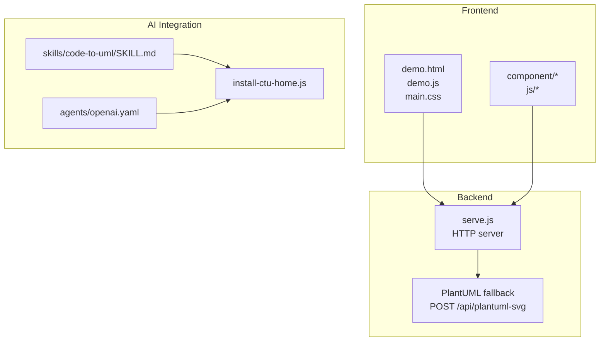
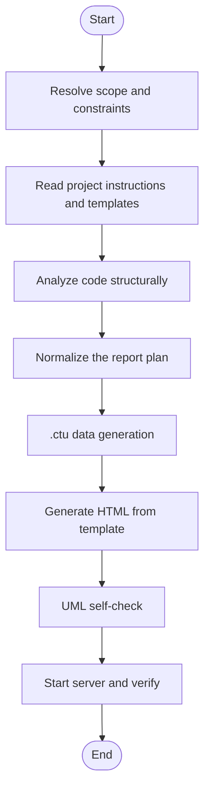

# Agent Selection Guide

<cite>
**Referenced Files in This Document**
- [README.md](file://README.md)
- [CLAUDE.md](file://CLAUDE.md)
- [AGENTS.md](file://AGENTS.md)
- [SKILL.md](file://skills/code-to-uml/SKILL.md)
- [openai.yaml](file://skills/code-to-uml/agents/openai.yaml)
- [install-ctu-home.js](file://install-ctu-home.js)
- [serve.js](file://serve.js)
- [_TEMPLATE.html](file://cache/_TEMPLATE.html)
- [_TEMPLATE.ctu](file://data/_TEMPLATE.ctu)
- [sequence--1_en.ctu](file://data/demo/sequence--1_en.ctu)
- [class--1_en.ctu](file://data/demo/class--1_en.ctu)
</cite>

## Table of Contents
1. [Introduction](#introduction)
2. [Project Structure](#project-structure)
3. [Core Components](#core-components)
4. [Architecture Overview](#architecture-overview)
5. [Detailed Component Analysis](#detailed-component-analysis)
6. [Decision Matrix and Selection Criteria](#decision-matrix-and-selection-criteria)
7. [Agent-Specific Strengths and Limitations](#agent-specific-strengths-and-limitations)
8. [Migration Strategies Between Agents](#migration-strategies-between-agents)
9. [Security, Privacy, and Compliance](#security-privacy-and-compliance)
10. [Performance Considerations](#performance-considerations)
11. [Troubleshooting Guide](#troubleshooting-guide)
12. [Conclusion](#conclusion)

## Introduction
This guide helps teams select the optimal AI agent for Code-To-UML projects. It compares Cursor, Claude Code, Qwen Coder, and OpenAI Codex across cost, performance, accuracy, and feature support. It documents a decision matrix, use-case mapping, migration strategies, configuration management, and security/privacy/compliance considerations grounded in the repository’s skill definitions, agent configuration, and server behavior.

## Project Structure
The repository is a static frontend application that renders PlantUML diagrams in the browser with a Node.js dev server and a bundled AI skill for report generation. Key elements:
- Frontend: HTML/CSS/JS with WASM-based PlantUML rendering and a fallback to a server-side Java-based renderer.
- Backend: A small HTTP server exposing static files and a PlantUML fallback endpoint.
- AI Skill: A reusable skill definition enabling Cursor, Claude Code, Qwen, and Codex to generate Code-To-UML reports consistently.



**Diagram sources**
- [README.md:166-198](file://README.md#L166-L198)
- [serve.js:454-561](file://serve.js#L454-L561)
- [SKILL.md:1-174](file://skills/code-to-uml/SKILL.md#L1-L174)
- [openai.yaml:1-5](file://skills/code-to-uml/agents/openai.yaml#L1-L5)
- [install-ctu-home.js:15-25](file://install-ctu-home.js#L15-L25)

**Section sources**
- [README.md:166-198](file://README.md#L166-L198)
- [CLAUDE.md:84-99](file://CLAUDE.md#L84-L99)
- [AGENTS.md:1-46](file://AGENTS.md#L1-L46)

## Core Components
- AI Skill Definition: Defines the scope, hard rules, workflow, mandatory sections, UML standards, and verification checklist for report generation.
- Agent Configuration: A minimal interface descriptor for OpenAI Codex integration.
- Server and Rendering: Two-tier rendering pipeline with WASM-first and a Java-based fallback.
- Templates: HTML and .ctu templates define the report structure and data conventions.

**Section sources**
- [SKILL.md:8-29](file://skills/code-to-uml/SKILL.md#L8-L29)
- [openai.yaml:1-5](file://skills/code-to-uml/agents/openai.yaml#L1-L5)
- [serve.js:239-274](file://serve.js#L239-L274)
- [_TEMPLATE.html:1-260](file://cache/_TEMPLATE.html#L1-L260)
- [_TEMPLATE.ctu:1-46](file://data/_TEMPLATE.ctu#L1-L46)

## Architecture Overview
The rendering pipeline prioritizes client-side WASM rendering and falls back to the server when needed. The AI skill orchestrates report generation and relies on the server for verification.

```mermaid
sequenceDiagram
participant User as "User"
participant Agent as "AI Agent"
participant Skill as "SKILL.md"
participant Server as "serve.js"
participant Renderer as "PlantUML WASM"
participant Jar as "plantuml.jar"
User->>Agent : "Analyze code and generate report"
Agent->>Skill : "Follow hard rules and workflow"
Agent->>Server : "POST /api/plantuml-svg (fallback)"
Server->>Jar : "Spawn java -jar plantuml.jar"
Jar-->>Server : "SVG"
Server-->>Agent : "{svg}"
Agent-->>User : "Report URL and artifacts"
Note over Renderer,Server : "Primary rendering uses WASM; fallback uses JAR"
```

**Diagram sources**
- [serve.js:472-496](file://serve.js#L472-L496)
- [SKILL.md:84-94](file://skills/code-to-uml/SKILL.md#L84-L94)

**Section sources**
- [README.md:237-274](file://README.md#L237-L274)
- [serve.js:454-561](file://serve.js#L454-L561)

## Detailed Component Analysis

### AI Skill Definition (SKILL.md)
- Purpose: Produce consistent, UML-backed HTML reports from code analysis.
- Hard Rules: Read-only by default, resolve project root via CTU_HOME, reuse templates strictly, preserve navigation links, enforce report shape and sections, and verify rendering.
- Workflow: Resolve scope, read templates, analyze code, normalize plan, generate .ctu data, generate HTML, self-check UML, start server, and verify.
- Mandatory Sections: 13 sections covering overview, structure, objects, architecture, flow, calls, dataflow, code, principles, guide, risks, QA, and index.
- UML Standards: Use PlantUML syntax, preferred diagram types by purpose, Chinese labels, and detailed explanations.



**Diagram sources**
- [SKILL.md:30-94](file://skills/code-to-uml/SKILL.md#L30-L94)

**Section sources**
- [SKILL.md:8-29](file://skills/code-to-uml/SKILL.md#L8-L29)
- [SKILL.md:95-122](file://skills/code-to-uml/SKILL.md#L95-L122)
- [SKILL.md:123-137](file://skills/code-to-uml/SKILL.md#L123-L137)
- [SKILL.md:138-146](file://skills/code-to-uml/SKILL.md#L138-L146)
- [SKILL.md:147-163](file://skills/code-to-uml/SKILL.md#L147-L163)
- [SKILL.md:164-174](file://skills/code-to-uml/SKILL.md#L164-L174)

### Agent Configuration (openai.yaml)
- Provides a minimal interface descriptor for OpenAI Codex integration, including display name, short description, and default prompt.

**Section sources**
- [openai.yaml:1-5](file://skills/code-to-uml/agents/openai.yaml#L1-L5)

### Server and Rendering (serve.js)
- Exposes endpoints for demo examples and PlantUML fallback rendering.
- Implements request body limits, path safety checks, and error handling.
- Uses a child process to invoke Java-based PlantUML rendering when WASM fails.

**Section sources**
- [serve.js:454-561](file://serve.js#L454-L561)
- [serve.js:56-88](file://serve.js#L56-L88)
- [serve.js:32-54](file://serve.js#L32-L54)

### Templates (_TEMPLATE.html and _TEMPLATE.ctu)
- _TEMPLATE.html: Defines the report shell, tab navigation, and script dependencies. It enforces fixed, editable, and configurable regions to maintain runtime behavior while allowing content customization.
- _TEMPLATE.ctu: Defines the .ctu data format with headers and example blocks for bilingual content and UML.

**Section sources**
- [_TEMPLATE.html:1-260](file://cache/_TEMPLATE.html#L1-L260)
- [_TEMPLATE.ctu:1-46](file://data/_TEMPLATE.ctu#L1-L46)

### Example Data Files
- sequence--1_en.ctu and class--1_en.ctu demonstrate the .ctu format and bilingual naming conventions used by the demo examples.

**Section sources**
- [sequence--1_en.ctu:1-23](file://data/demo/sequence--1_en.ctu#L1-L23)
- [class--1_en.ctu:1-34](file://data/demo/class--1_en.ctu#L1-L34)

## Decision Matrix and Selection Criteria
Below is a comparative decision framework for Cursor, Claude Code, Qwen Coder, and OpenAI Codex tailored to Code-To-UML projects. The matrix is grounded in the repository’s skill and agent configuration.

- Cost
  - Cursor: Typically usage-based; costs vary by provider and plan.
  - Claude Code: Usage-based; pricing depends on model and provider.
  - Qwen Coder: Usage-based; pricing varies by provider and region.
  - OpenAI Codex: Usage-based; pricing depends on model and provider.
  - Recommendation: Evaluate provider pricing per token/minute and monthly quotas. Use smaller scopes (function/class) to reduce cost.

- Performance
  - Cursor: Strong in code editing and tooling; may require agent-specific setup.
  - Claude Code: Well-aligned with the project’s guidelines and skill; supports bilingual content and structured outputs.
  - Qwen Coder: Strong multilingual support; suitable for Chinese/English workflows.
  - OpenAI Codex: Capable for report generation; agent configuration is minimal.
  - Recommendation: For Code-To-UML, choose agents that integrate with the skill and can reliably parse .ctu templates.

- Accuracy
  - Cursor: Effective for code analysis and report generation when configured with the skill.
  - Claude Code: Explicitly documented in the project’s guidelines; strong fit for the skill.
  - Qwen Coder: Good for multilingual tasks; ensure agent permissions and tool access align with the skill.
  - OpenAI Codex: Functional with the minimal agent interface; verify rendering and verification steps.
  - Recommendation: Validate accuracy by checking UML self-check and server verification steps.

- Feature Support
  - Cursor: Tool integrations and rules-based configuration.
  - Claude Code: Explicitly supported and documented in the project.
  - Qwen Coder: Multilingual and tool support; confirm compatibility with the skill.
  - OpenAI Codex: Minimal configuration; ensure it can execute the skill workflow end-to-end.
  - Recommendation: Confirm agent capability to read templates, generate .ctu files, and start the server.

- Security and Privacy
  - All agents operate remotely; ensure codebases are sanitized and sensitive data is excluded from prompts.
  - Use agent permissions and tool access controls to limit risky operations.
  - Recommendation: Review agent provider policies and enable audit logging where available.

- Compliance
  - Ensure agent usage complies with organizational policies and export controls.
  - Maintain records of generated reports and data handling procedures.
  - Recommendation: Establish governance around agent selection, data handling, and retention.

- Migration Strategy
  - Use install-ctu-home.js to register CTU_HOME and install the skill for multiple agents.
  - Switch agents by pointing them to the same skill and verifying the workflow.
  - Recommendation: Standardize agent configuration and run verification checks after migration.

- Best Practices for Configuration Management
  - Centralize agent configuration via install-ctu-home.js.
  - Keep templates immutable and version-controlled.
  - Automate verification post-generation (server start, API checks).
  - Recommendation: Document agent-specific settings and maintain a changelog for configuration updates.

**Section sources**
- [README.md:277-295](file://README.md#L277-L295)
- [CLAUDE.md:1-100](file://CLAUDE.md#L1-L100)
- [AGENTS.md:1-46](file://AGENTS.md#L1-L46)
- [openai.yaml:1-5](file://skills/code-to-uml/agents/openai.yaml#L1-L5)
- [install-ctu-home.js:15-25](file://install-ctu-home.js#L15-L25)

## Agent-Specific Strengths and Limitations
- Cursor
  - Strengths: Strong editing and tooling; flexible configuration via rules.
  - Limitations: Requires agent-specific setup; verify tool access for report generation.
  - Use Cases: Code analysis, documentation generation, report automation.
- Claude Code
  - Strengths: Explicitly supported and documented; good alignment with the skill and bilingual workflows.
  - Limitations: Provider-dependent; ensure adequate quota and permissions.
  - Use Cases: Code analysis, documentation generation, report automation.
- Qwen Coder
  - Strengths: Multilingual; robust for Chinese/English content.
  - Limitations: Tool access and permissions must be validated.
  - Use Cases: Code analysis, documentation generation, report automation.
- OpenAI Codex
  - Strengths: Minimal configuration; functional with the skill.
  - Limitations: Limited agent interface; verify rendering and verification steps.
  - Use Cases: Code analysis, documentation generation, report automation.

**Section sources**
- [README.md:277-295](file://README.md#L277-L295)
- [CLAUDE.md:1-100](file://CLAUDE.md#L1-L100)
- [openai.yaml:1-5](file://skills/code-to-uml/agents/openai.yaml#L1-L5)

## Migration Strategies Between Agents
- Preparation
  - Register CTU_HOME and install the skill for the target agents using install-ctu-home.js.
  - Confirm agent permissions and tool access.
- Execution
  - Point the new agent to the skill and run the workflow.
  - Verify report generation, UML rendering, and server startup.
- Validation
  - Compare generated .ctu files and HTML against the template.
  - Validate API endpoints and navigation links.
- Rollback
  - Re-run install-ctu-home.js for the previous agent if needed.
  - Maintain logs and artifacts for comparison.

**Section sources**
- [install-ctu-home.js:116-136](file://install-ctu-home.js#L116-L136)
- [SKILL.md:84-94](file://skills/code-to-uml/SKILL.md#L84-L94)

## Security, Privacy, and Compliance
- Data Handling
  - Ensure sensitive code and data are excluded from prompts and generated reports.
  - Sanitize inputs and outputs; avoid embedding secrets.
- Agent Permissions
  - Restrict tool access to prevent unintended file edits or external calls.
  - Use permission modes appropriate for the task (e.g., read-only).
- Audit and Logging
  - Enable audit logging where available to track agent usage.
  - Maintain records of generated reports and verification outcomes.
- Compliance
  - Align agent usage with organizational policies and export controls.
  - Establish governance for agent selection, data handling, and retention.

[No sources needed since this section provides general guidance]

## Performance Considerations
- Rendering Pipeline
  - Prefer WASM rendering for speed; use the fallback endpoint only when necessary.
  - Monitor server logs for fallback invocation frequency and errors.
- Report Generation
  - Use smaller scopes (function/class) to reduce generation time and cost.
  - Validate UML early to minimize retries.
- Server Resources
  - Ensure sufficient memory and CPU for the Node.js server and Java-based fallback.
  - Monitor disk usage for generated HTML and .ctu data.

**Section sources**
- [README.md:237-274](file://README.md#L237-L274)
- [serve.js:472-496](file://serve.js#L472-L496)

## Troubleshooting Guide
- Rendering Failures
  - If WASM rendering fails, the server attempts a fallback via POST /api/plantuml-svg.
  - Verify Java availability and plantuml.jar accessibility.
- Template Mismatches
  - Ensure .ctu filenames and categories match tab configurations.
  - Validate mandatory sections and UML syntax.
- Server Verification
  - Confirm the server is running and responds to API endpoints.
  - Check port conflicts and clean up stale processes if needed.

**Section sources**
- [serve.js:472-496](file://serve.js#L472-L496)
- [SKILL.md:147-163](file://skills/code-to-uml/SKILL.md#L147-L163)
- [README.md:202-224](file://README.md#L202-L224)

## Conclusion
Selecting an AI agent for Code-To-UML depends on cost, performance, accuracy, and feature support aligned with the skill and templates. Cursor, Claude Code, Qwen Coder, and OpenAI Codex can all generate consistent reports when properly configured. Use the decision matrix, migration strategies, and best practices outlined here to choose and manage agents effectively while maintaining security, privacy, and compliance.