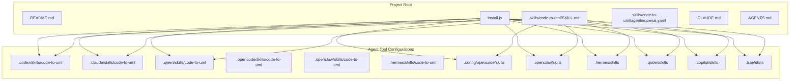
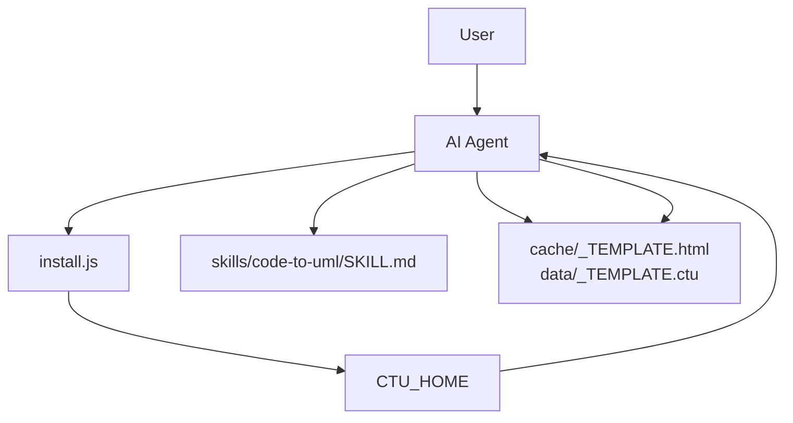
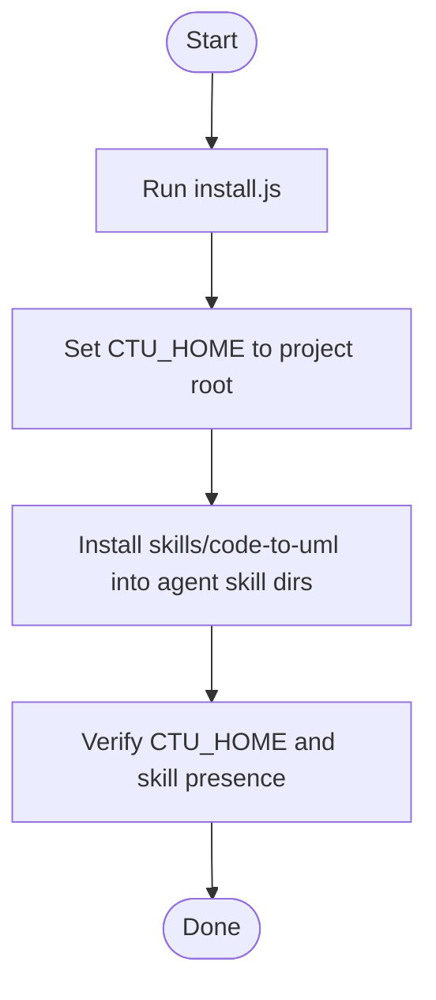
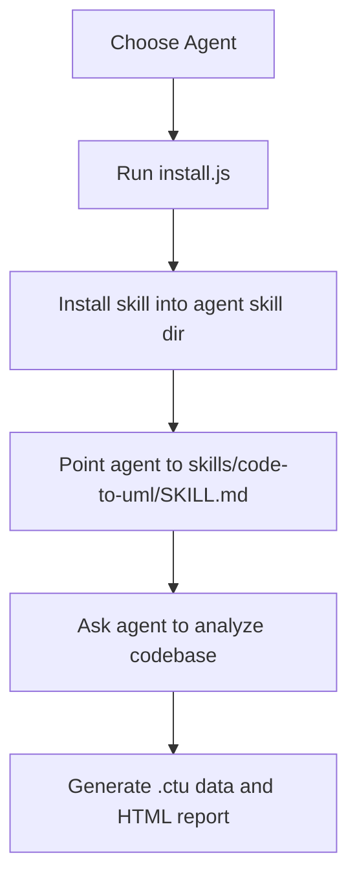
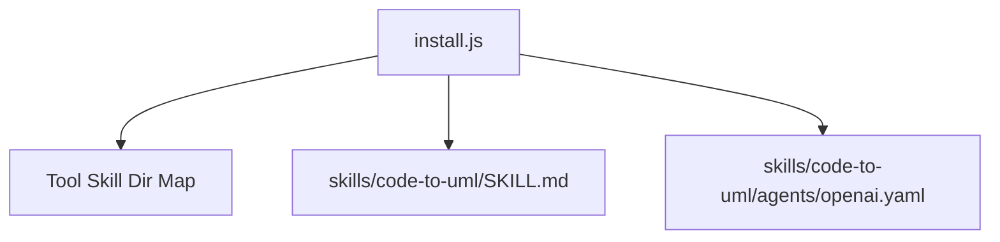

# Agent Setup Guides

<cite>
**Referenced Files in This Document**
- [README.md](file://README.md)
- [install.js](file://install.js)
- [skills/code-to-uml/SKILL.md](file://skills/code-to-uml/SKILL.md)
- [skills/code-to-uml/agents/openai.yaml](file://skills/code-to-uml/agents/openai.yaml)
- [CLAUDE.md](file://CLAUDE.md)
- [AGENTS.md](file://AGENTS.md)
- [test/install.test.js](file://test/install.test.js)
</cite>

## Table of Contents
1. [Introduction](#introduction)
2. [Project Structure](#project-structure)
3. [Core Components](#core-components)
4. [Architecture Overview](#architecture-overview)
5. [Detailed Component Analysis](#detailed-component-analysis)
6. [Dependency Analysis](#dependency-analysis)
7. [Performance Considerations](#performance-considerations)
8. [Troubleshooting Guide](#troubleshooting-guide)
9. [Conclusion](#conclusion)
10. [Appendices](#appendices)

## Introduction
This document provides comprehensive setup guides for the AI agents supported by Code-To-UML. It explains how to configure the CTU_HOME environment variable, register the project with AI agents, and set up Cursor, Claude Code, Qwen Coder, and OpenAI Codex. It also documents agent-specific configuration files, highlights differences among agents, and offers troubleshooting and best practices for reliable operation.

## Project Structure
The repository is a static frontend project with a Node.js dev server and a skill definition that enables AI agents to generate UML-backed HTML reports. The key elements for agent integration are:
- CTU_HOME environment variable pointing to the project root
- A bundled skill definition under skills/code-to-uml/SKILL.md
- An installer script install.js that writes CTU_HOME and installs the skill into agent-specific directories
- Optional agent-specific YAML interface definitions under skills/code-to-uml/agents/

**Diagram sources**
- [install.js:15-25](file://install.js#L15-L25)
- [install.js:116-130](file://install.js#L116-L130)
- [README.md:277-295](file://README.md#L277-L295)

**Section sources**
- [README.md:166-198](file://README.md#L166-L198)
- [README.md:277-295](file://README.md#L277-L295)

## Core Components
- CTU_HOME environment variable: Used by agents to locate the Code-To-UML project root and template files. The installer script sets this variable and installs the skill into agent-specific directories.
- Skill definition: The bundled SKILL.md instructs agents on how to analyze code and generate reports using the project’s templates and conventions.
- Agent-specific YAML: The openai.yaml file defines the interface metadata for the OpenAI agent integration.

**Section sources**
- [README.md:226-234](file://README.md#L226-L234)
- [skills/code-to-uml/SKILL.md:14-28](file://skills/code-to-uml/SKILL.md#L14-L28)
- [skills/code-to-uml/agents/openai.yaml:1-5](file://skills/code-to-uml/agents/openai.yaml#L1-L5)

## Architecture Overview
The agent integration architecture centers on a single skill definition and a shared installer that places the skill into each agent’s recognized skill directory. Agents resolve the project root via CTU_HOME and use the skill to generate .ctu data files and HTML reports.

**Diagram sources**
- [install.js:104-220](file://install.js#L104-L220)
- [skills/code-to-uml/SKILL.md:35-42](file://skills/code-to-uml/SKILL.md#L35-L42)

**Section sources**
- [install.js:104-220](file://install.js#L104-L220)
- [skills/code-to-uml/SKILL.md:35-42](file://skills/code-to-uml/SKILL.md#L35-L42)

## Detailed Component Analysis

### CTU_HOME Environment Variable and Project Registration
- Purpose: CTU_HOME tells agents where the Code-To-UML project root resides, enabling access to templates and data files.
- Registration method: Run the installer script to set CTU_HOME and install the skill into agent-specific directories.
- Validation: Confirm CTU_HOME is set and the skill exists in the agent’s skill directory.

**Diagram sources**
- [install.js:204-220](file://install.js#L204-L220)
- [install.js:116-130](file://install.js#L116-L130)

**Section sources**
- [README.md:97-101](file://README.md#L97-L101)
- [install.js:104-220](file://install.js#L104-L220)

### Cursor (Rules-based Agent)
- Setup steps:
  1. Register the project by running the installer script.
  2. Point Cursor to the skill definition at skills/code-to-uml/SKILL.md.
  3. Ask Cursor to analyze a codebase; it generates .ctu data files and an HTML report.
- Notes:
  - The installer supports Cursor via the .codex skill directory mapping.
  - The skill definition governs how Cursor interprets templates and report structure.

**Section sources**
- [README.md:283-287](file://README.md#L283-L287)
- [README.md:289-294](file://README.md#L289-L294)
- [install.js:15](file://install.js#L15)
- [skills/code-to-uml/SKILL.md:35-42](file://skills/code-to-uml/SKILL.md#L35-L42)

### Claude Code
- Setup steps:
  1. Register the project by running the installer script.
  2. Point Claude Code to the skill definition at skills/code-to-uml/SKILL.md.
  3. Ask Claude Code to analyze a codebase; it generates .ctu data files and an HTML report.
- Guidance:
  - Refer to the Claude-specific guidance document for additional context.
- Notes:
  - The installer supports Claude via the .claude skill directory mapping.
  - The skill definition ensures consistent report generation using templates.

**Section sources**
- [README.md:284-287](file://README.md#L284-L287)
- [README.md:289-294](file://README.md#L289-L294)
- [CLAUDE.md:1-100](file://CLAUDE.md#L1-L100)
- [install.js:16](file://install.js#L16)
- [skills/code-to-uml/SKILL.md:35-42](file://skills/code-to-uml/SKILL.md#L35-L42)

### Qwen Coder
- Setup steps:
  1. Register the project by running the installer script.
  2. Point Qwen Coder to the skill definition at skills/code-to-uml/SKILL.md.
  3. Ask Qwen Coder to analyze a codebase; it generates .ctu data files and an HTML report.
- Notes:
  - The installer supports Qwen via the .qwen skill directory mapping.
  - The skill definition ensures adherence to the project’s template and conventions.

**Section sources**
- [README.md:285-287](file://README.md#L285-L287)
- [README.md:289-294](file://README.md#L289-L294)
- [install.js:22](file://install.js#L22)
- [skills/code-to-uml/SKILL.md:35-42](file://skills/code-to-uml/SKILL.md#L35-L42)

### OpenAI Codex
- Setup steps:
  1. Register the project by running the installer script.
  2. Point OpenAI Codex to the skill definition at skills/code-to-uml/SKILL.md.
  3. Ask OpenAI Codex to analyze a codebase; it generates .ctu data files and an HTML report.
- Agent-specific configuration:
  - The openai.yaml file defines the interface metadata for OpenAI integration.
- Notes:
  - The installer supports OpenAI Codex via the .codex skill directory mapping.
  - The skill definition ensures consistent report generation using templates.

**Section sources**
- [README.md:286-287](file://README.md#L286-L287)
- [README.md:289-294](file://README.md#L289-L294)
- [skills/code-to-uml/agents/openai.yaml:1-5](file://skills/code-to-uml/agents/openai.yaml#L1-L5)
- [install.js:15](file://install.js#L15)
- [skills/code-to-uml/SKILL.md:35-42](file://skills/code-to-uml/SKILL.md#L35-L42)

### Conceptual Overview
The agent selection process is straightforward: choose an agent, run the installer to register the project, and direct the agent to the skill definition. The skill definition standardizes report generation across agents, while agent-specific YAML files define interface metadata.

[No sources needed since this diagram shows conceptual workflow, not actual code structure]

[No sources needed since this section doesn't analyze specific source files]

## Dependency Analysis
- install.js maps agent tool names to their respective skill directories and installs the skill into each.
- The skill definition depends on CTU_HOME being set to locate templates and data files.
- Agent-specific YAML files provide interface metadata for certain agents.

**Diagram sources**
- [install.js:15-25](file://install.js#L15-L25)
- [install.js:116-130](file://install.js#L116-L130)
- [skills/code-to-uml/agents/openai.yaml:1-5](file://skills/code-to-uml/agents/openai.yaml#L1-L5)

**Section sources**
- [install.js:15-25](file://install.js#L15-L25)
- [install.js:116-130](file://install.js#L116-L130)
- [skills/code-to-uml/agents/openai.yaml:1-5](file://skills/code-to-uml/agents/openai.yaml#L1-L5)

## Performance Considerations
- Use CTU_HOME to avoid scanning large filesystems; agents resolve the project root quickly.
- Keep the skill definition minimal and focused to reduce parsing overhead.
- Ensure templates are well-formed to minimize post-generation validation work.

[No sources needed since this section provides general guidance]

## Troubleshooting Guide
- CTU_HOME not set:
  - Symptom: Agents cannot locate templates or data files.
  - Fix: Run the installer script to set CTU_HOME and install the skill.
- Skill not found in agent directory:
  - Symptom: Agent cannot find the skill definition.
  - Fix: Verify the skill was installed into the correct agent skill directory and that the directory exists.
- Incorrect agent mapping:
  - Symptom: Skill not installed for the intended agent.
  - Fix: Specify the agent explicitly when running the installer or review the tool mapping.
- Port conflicts during report verification:
  - Symptom: Server fails to start on the chosen port.
  - Fix: Use the project’s server scripts which handle port cleanup; avoid adding CTU_HOME to PATH.

**Section sources**
- [README.md:97-101](file://README.md#L97-L101)
- [README.md:26-28](file://README.md#L26-L28)
- [test/install.test.js:40-44](file://test/install.test.js#L40-L44)
- [test/install.test.js:76-82](file://test/install.test.js#L76-L82)

## Conclusion
By setting CTU_HOME and installing the skill into agent-specific directories, you enable Cursor, Claude Code, Qwen Coder, and OpenAI Codex to consistently generate UML-backed HTML reports. The skill definition standardizes the process, while agent-specific YAML files provide interface metadata. Follow the troubleshooting steps to resolve common setup issues and adhere to best practices for optimal performance.

[No sources needed since this section summarizes without analyzing specific files]

## Appendices

### Best Practices for Optimal Performance
- Always run the installer script to register the project and install the skill.
- Keep CTU_HOME pointing to the project root to ensure fast resolution.
- Use the skill definition to enforce consistent report structure and quality.
- Validate report generation by starting the server and verifying the generated HTML and API responses.

**Section sources**
- [README.md:289-294](file://README.md#L289-L294)
- [README.md:88-117](file://README.md#L88-L117)

### Security Considerations and Credential Management
- The installer script sets CTU_HOME and installs the skill locally; no credentials are stored by the script.
- Agents may require their own credentials for external APIs; manage these according to each agent’s documentation.
- Keep the skill definition and templates within the project root to prevent accidental exposure outside the repository.

**Section sources**
- [install.js:204-220](file://install.js#L204-L220)
- [README.md:277-295](file://README.md#L277-L295)