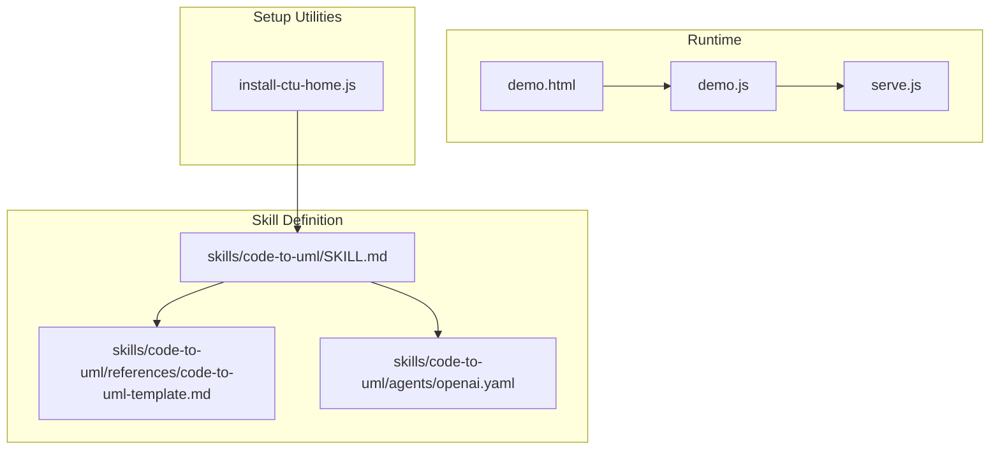
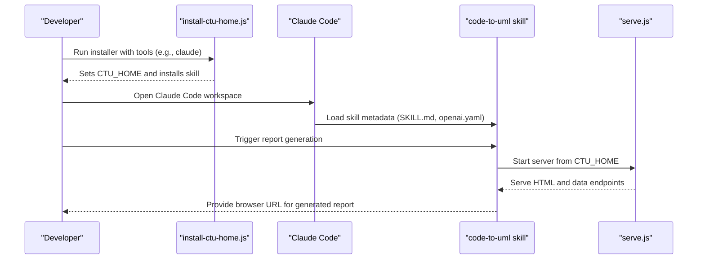
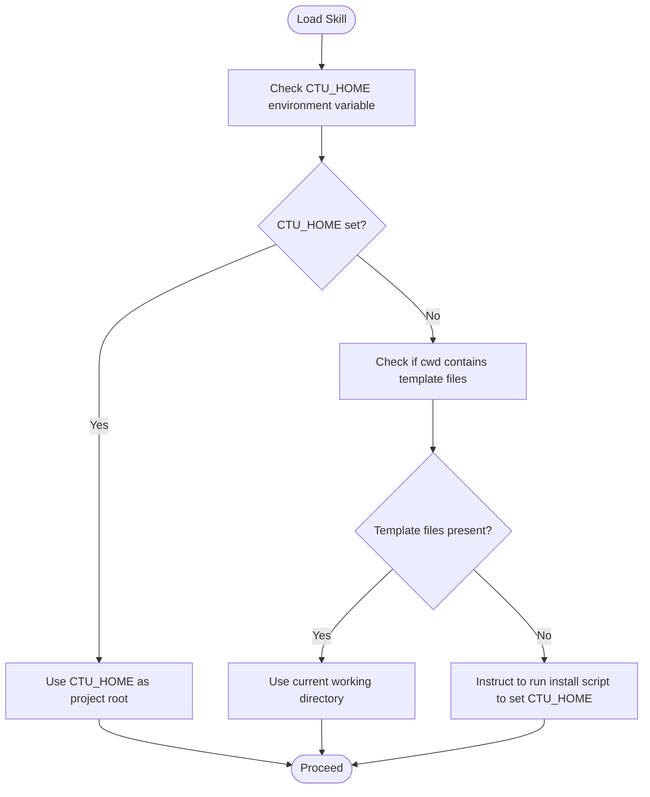
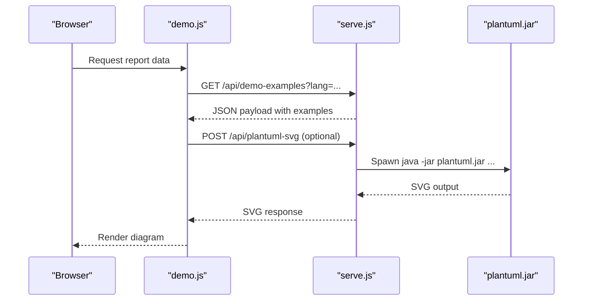
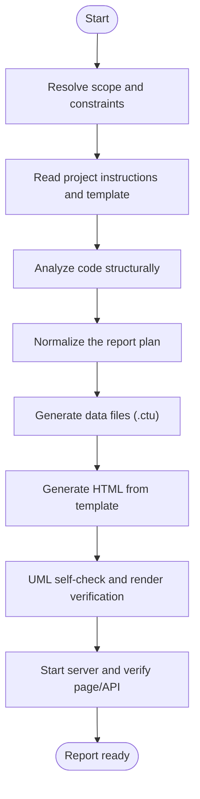
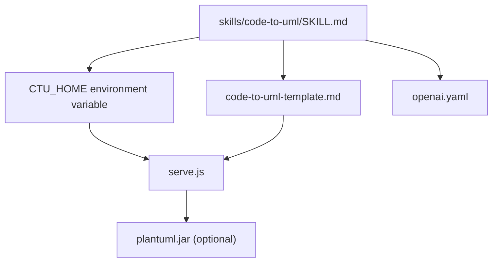

# Claude Code Setup

<cite>
**Referenced Files in This Document**
- [CLAUDE.md](file://CLAUDE.md)
- [AGENTS.md](file://AGENTS.md)
- [SKILL.md](file://skills/code-to-uml/SKILL.md)
- [code-to-uml-template.md](file://skills/code-to-uml/references/code-to-uml-template.md)
- [openai.yaml](file://skills/code-to-uml/agents/openai.yaml)
- [install-ctu-home.js](file://install-ctu-home.js)
- [serve.js](file://serve.js)
- [demo.html](file://demo.html)
- [demo.js](file://demo.js)
- [README.md](file://README.md)
- [README_zh.md](file://README_zh.md)
</cite>

## Table of Contents
1. [Introduction](#introduction)
2. [Project Structure](#project-structure)
3. [Core Components](#core-components)
4. [Architecture Overview](#architecture-overview)
5. [Detailed Component Analysis](#detailed-component-analysis)
6. [Dependency Analysis](#dependency-analysis)
7. [Performance Considerations](#performance-considerations)
8. [Troubleshooting Guide](#troubleshooting-guide)
9. [Conclusion](#conclusion)
10. [Appendices](#appendices)

## Introduction
This document provides comprehensive setup guidance for integrating Claude Code with the Code-To-UML project. It explains how to register the project as a Claude Code skill, configure the skill metadata, and prepare the environment for report generation and preview. It also documents the runtime behavior of the local development server used by the skill, including PlantUML rendering fallbacks, and offers best practices and troubleshooting advice for common setup issues.

## Project Structure
The repository is a static frontend application that renders PlantUML diagrams in the browser and provides a local Node.js server for development. The skill definition and runtime expectations are encapsulated in the skill documentation and the local server implementation.

**Diagram sources**
- [SKILL.md:1-174](file://skills/code-to-uml/SKILL.md#L1-L174)
- [code-to-uml-template.md:1-95](file://skills/code-to-uml/references/code-to-uml-template.md#L1-L95)
- [openai.yaml:1-5](file://skills/code-to-uml/agents/openai.yaml#L1-L5)
- [demo.html:1-116](file://demo.html#L1-L116)
- [demo.js:1-816](file://demo.js#L1-L816)
- [serve.js:1-567](file://serve.js#L1-L567)
- [install-ctu-home.js:1-228](file://install-ctu-home.js#L1-L228)

**Section sources**
- [CLAUDE.md:1-100](file://CLAUDE.md#L1-L100)
- [AGENTS.md:1-46](file://AGENTS.md#L1-L46)

## Core Components
- Skill definition and runtime contract: The skill defines the purpose, hard rules, workflow, and quality standards for generating UML-backed HTML reports. It also specifies how to resolve the project root via an environment variable and how to start the local server.
- Template reference: The template describes the HTML and data contracts for report pages and data directories.
- Agent interface definition: The agent YAML declares the skill’s display name, short description, and default prompt used by Claude Code.
- Setup utility: The installer script configures the environment variable pointing to the project root and installs the skill into Claude Code’s skill directory.
- Local server: The server provides static hosting and a PlantUML fallback endpoint for rendering large diagrams when browser rendering fails.

**Section sources**
- [SKILL.md:1-174](file://skills/code-to-uml/SKILL.md#L1-L174)
- [code-to-uml-template.md:1-95](file://skills/code-to-uml/references/code-to-uml-template.md#L1-L95)
- [openai.yaml:1-5](file://skills/code-to-uml/agents/openai.yaml#L1-L5)
- [install-ctu-home.js:1-228](file://install-ctu-home.js#L1-L228)
- [serve.js:1-567](file://serve.js#L1-L567)

## Architecture Overview
The Claude Code integration centers on installing the skill into Claude Code’s skill directory and configuring the environment variable that the skill uses to locate the project root. The skill’s workflow relies on the local server to serve report pages and data, and to render PlantUML content either in the browser or via a Java-based fallback.

**Diagram sources**
- [install-ctu-home.js:1-228](file://install-ctu-home.js#L1-L228)
- [SKILL.md:1-174](file://skills/code-to-uml/SKILL.md#L1-L174)
- [openai.yaml:1-5](file://skills/code-to-uml/agents/openai.yaml#L1-L5)
- [serve.js:1-567](file://serve.js#L1-L567)

## Detailed Component Analysis

### Skill Metadata and Agent Interface
- Purpose and constraints: The skill generates UML-backed HTML reports with strict adherence to the template structure and data conventions.
- Environment resolution: The skill resolves the project root from an environment variable and falls back to the current working directory only if specific template files are present.
- Default prompt: The agent YAML provides a default prompt used by Claude Code to invoke the skill.

**Diagram sources**
- [SKILL.md:14-26](file://skills/code-to-uml/SKILL.md#L14-L26)
- [code-to-uml-template.md:5-11](file://skills/code-to-uml/references/code-to-uml-template.md#L5-L11)

**Section sources**
- [SKILL.md:1-174](file://skills/code-to-uml/SKILL.md#L1-L174)
- [openai.yaml:1-5](file://skills/code-to-uml/agents/openai.yaml#L1-L5)

### Setup and Registration Steps
- Install the skill into Claude Code:
  - Run the installer with the desired tool (e.g., claude).
  - The installer sets the environment variable pointing to the project root and copies the skill into the tool’s skill directory.
- Verify installation:
  - Confirm that the skill appears in Claude Code and that the default prompt is applied.
- Prepare the environment:
  - Ensure the environment variable is exported in your shell profile or use the printed command for the current shell session.

**Section sources**
- [install-ctu-home.js:27-49](file://install-ctu-home.js#L27-L49)
- [install-ctu-home.js:158-165](file://install-ctu-home.js#L158-L165)
- [openai.yaml:1-5](file://skills/code-to-uml/agents/openai.yaml#L1-L5)

### Local Server and Rendering Pipeline
- Static hosting: The server serves static files and exposes endpoints for demo examples and PlantUML rendering.
- PlantUML fallback: When browser rendering fails or is unsuitable for large diagrams, the server invokes a Java-based renderer to produce SVG output.
- Data loading: The server reads and parses data files according to the template’s conventions and serves them via an API endpoint.

**Diagram sources**
- [demo.js:174-185](file://demo.js#L174-L185)
- [serve.js:459-496](file://serve.js#L459-L496)
- [serve.js:56-88](file://serve.js#L56-L88)

**Section sources**
- [demo.js:174-185](file://demo.js#L174-L185)
- [serve.js:459-496](file://serve.js#L459-L496)
- [serve.js:56-88](file://serve.js#L56-L88)

### Report Generation Workflow
- Scope and constraints: Determine the analysis scope (project/module/file/class/function) and record target path, output path, language, and template requirements.
- Read instructions and template: Load the skill documentation and template files to align with the project’s structure and conventions.
- Analyze code: Use structural tools and file reads to gather evidence for the report sections.
- Normalize the report plan: Produce the mandatory sections and maintain consistent categories.
- Generate data and HTML: Create data files and copy the template structure into the output HTML, preserving required scripts and attributes.
- UML self-check: Validate PlantUML syntax and, if available, render diagrams locally to ensure correctness.
- Start server and verify: Launch the server from the project root and verify the report URL, API responses, and navigation behavior.

**Diagram sources**
- [SKILL.md:30-94](file://skills/code-to-uml/SKILL.md#L30-L94)

**Section sources**
- [SKILL.md:30-94](file://skills/code-to-uml/SKILL.md#L30-L94)

### Claude Code Workspace and Authentication
- Workspace setup: Install the skill into Claude Code using the installer script. The skill’s metadata and default prompt are loaded from the skill definition files.
- Authentication: The skill does not require an API key for local report generation. The server runs locally and serves static content and rendering endpoints.
- Permissions: Ensure the environment variable is correctly set so the skill can locate the project root and data directories.

**Section sources**
- [openai.yaml:1-5](file://skills/code-to-uml/agents/openai.yaml#L1-L5)
- [install-ctu-home.js:1-228](file://install-ctu-home.js#L1-L228)

### Claude Code Settings and Environment Variables
- Required environment variable: The skill expects a specific environment variable to resolve the project root. The installer sets this variable and can print the appropriate command for the current shell.
- Port configuration: The server listens on a default port and supports custom ports via command-line arguments or environment variables.

**Section sources**
- [code-to-uml-template.md:81-88](file://skills/code-to-uml/references/code-to-uml-template.md#L81-L88)
- [serve.js:8-10](file://serve.js#L8-L10)

### Best Practices and Recommendations
- Model selection: The skill focuses on generating UML-backed HTML reports. Choose the appropriate scope (project/module/file/class/function) to balance depth and breadth.
- Performance tuning: For large diagrams, rely on the server-side PlantUML fallback to avoid browser rendering timeouts. Keep the server running during interactive sessions.
- Template compliance: Adhere strictly to the template’s HTML and data contracts to ensure consistent rendering and navigation.

**Section sources**
- [SKILL.md:123-137](file://skills/code-to-uml/SKILL.md#L123-L137)
- [code-to-uml-template.md:23-38](file://skills/code-to-uml/references/code-to-uml-template.md#L23-L38)

## Dependency Analysis
The skill depends on the presence of the environment variable and the local server to provide report pages and data. The server depends on the availability of Java for the PlantUML fallback renderer.

**Diagram sources**
- [SKILL.md:1-174](file://skills/code-to-uml/SKILL.md#L1-L174)
- [code-to-uml-template.md:1-95](file://skills/code-to-uml/references/code-to-uml-template.md#L1-L95)
- [openai.yaml:1-5](file://skills/code-to-uml/agents/openai.yaml#L1-L5)
- [serve.js:56-88](file://serve.js#L56-L88)

**Section sources**
- [SKILL.md:1-174](file://skills/code-to-uml/SKILL.md#L1-L174)
- [code-to-uml-template.md:1-95](file://skills/code-to-uml/references/code-to-uml-template.md#L1-L95)
- [openai.yaml:1-5](file://skills/code-to-uml/agents/openai.yaml#L1-L5)
- [serve.js:56-88](file://serve.js#L56-L88)

## Performance Considerations
- Browser rendering: Prefer client-side rendering for small to medium diagrams to minimize latency.
- Fallback rendering: For large diagrams, the server-side renderer ensures reliable output at the cost of additional overhead.
- Server startup: Use the provided scripts to start the server; they include port cleanup logic to avoid conflicts.

**Section sources**
- [demo.js:395-439](file://demo.js#L395-L439)
- [serve.js:56-88](file://serve.js#L56-L88)
- [code-to-uml-template.md:81-88](file://skills/code-to-uml/references/code-to-uml-template.md#L81-L88)

## Troubleshooting Guide
- API key validation: The skill does not require an API key for local operation. If encountering prompts for credentials, verify that the skill is configured to use local rendering.
- Rate limiting: There is no external API involved in the local report generation workflow. If experiencing delays, check server logs and ensure Java is available for the fallback renderer.
- Workspace permissions: Confirm that the environment variable is set and that the skill can access the project root and data directories. Re-run the installer if necessary.
- PlantUML rendering failures: If browser rendering fails, the server attempts a fallback to the Java-based renderer. Ensure Java is installed and available on PATH.

**Section sources**
- [demo.js:395-439](file://demo.js#L395-L439)
- [serve.js:56-88](file://serve.js#L56-L88)
- [install-ctu-home.js:182-202](file://install-ctu-home.js#L182-L202)

## Conclusion
Claude Code integration with the Code-To-UML project is streamlined through a dedicated skill definition, a clear template contract, and a local server that supports robust rendering. By installing the skill, setting the environment variable, and following the report generation workflow, developers can efficiently produce consistent UML-backed HTML reports tailored to their needs.

## Appendices

### Appendix A: Step-by-Step Setup Checklist
- Install the skill into Claude Code using the installer script.
- Verify the skill appears with the correct display name and default prompt.
- Ensure the environment variable is set and exported.
- Start the local server from the project root and confirm the report URL is accessible.
- Generate a report and validate the rendered diagrams and navigation.

**Section sources**
- [install-ctu-home.js:132-136](file://install-ctu-home.js#L132-L136)
- [openai.yaml:1-5](file://skills/code-to-uml/agents/openai.yaml#L1-L5)
- [code-to-uml-template.md:81-88](file://skills/code-to-uml/references/code-to-uml-template.md#L81-L88)
- [SKILL.md:84-94](file://skills/code-to-uml/SKILL.md#L84-L94)