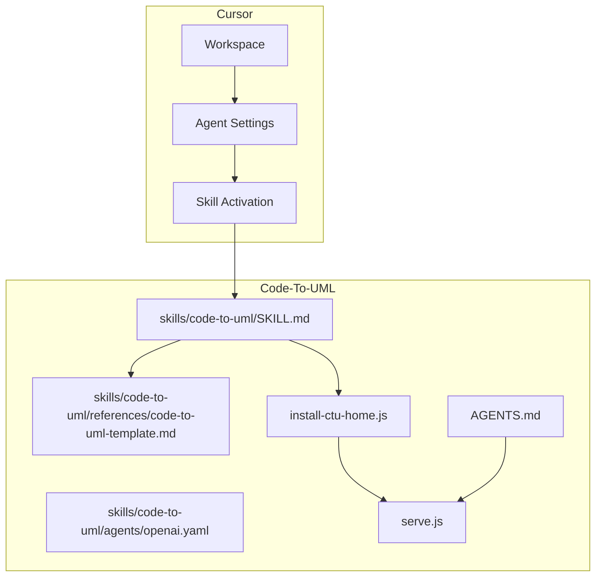
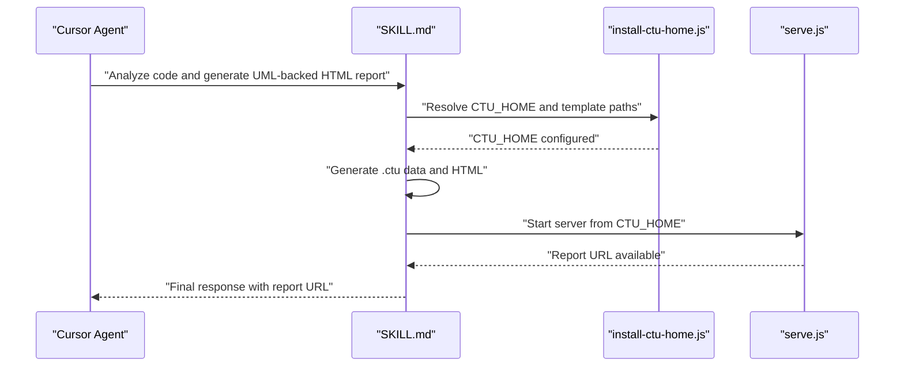
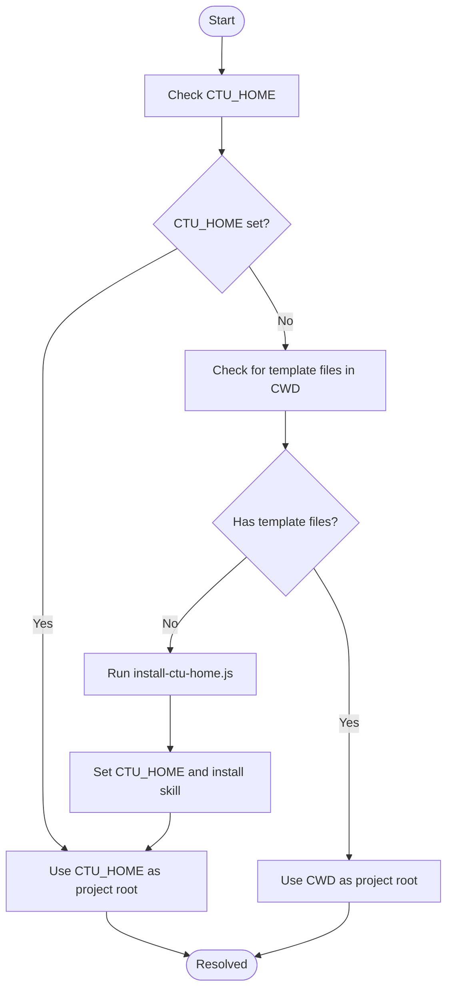
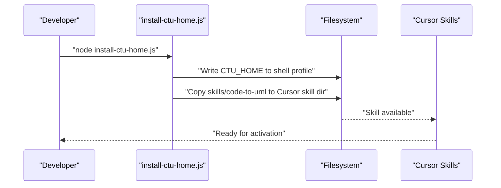
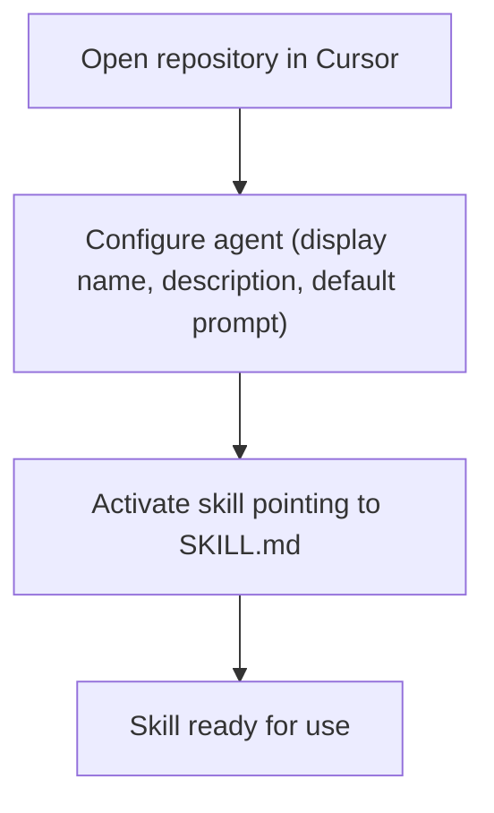
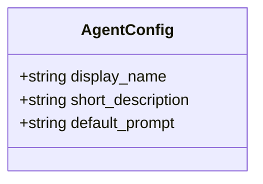
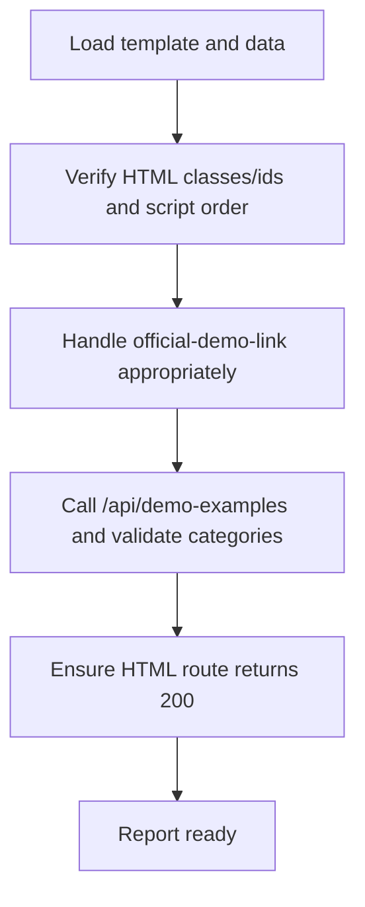
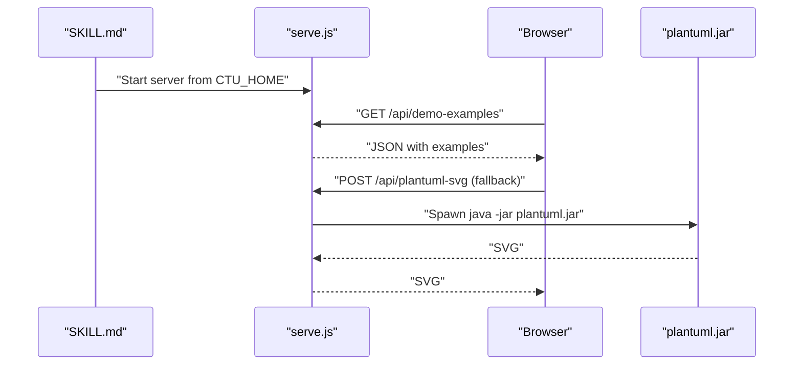
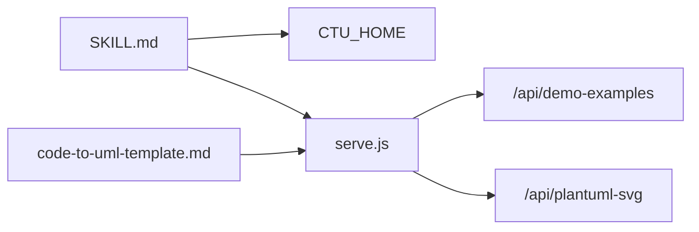

# Cursor Integration

<cite>
**Referenced Files in This Document**
- [README.md](file://README.md)
- [AGENTS.md](file://AGENTS.md)
- [CLAUDE.md](file://CLAUDE.md)
- [SKILL.md](file://skills/code-to-uml/SKILL.md)
- [openai.yaml](file://skills/code-to-uml/agents/openai.yaml)
- [code-to-uml-template.md](file://skills/code-to-uml/references/code-to-uml-template.md)
- [install-ctu-home.js](file://install-ctu-home.js)
- [serve.js](file://serve.js)
- [install-ctu-home.test.js](file://test/install-ctu-home.test.js)
</cite>

## Table of Contents
1. [Introduction](#introduction)
2. [Project Structure](#project-structure)
3. [Core Components](#core-components)
4. [Architecture Overview](#architecture-overview)
5. [Detailed Component Analysis](#detailed-component-analysis)
6. [Dependency Analysis](#dependency-analysis)
7. [Performance Considerations](#performance-considerations)
8. [Troubleshooting Guide](#troubleshooting-guide)
9. [Conclusion](#conclusion)
10. [Appendices](#appendices)

## Introduction
This document explains how to integrate Cursor AI with Code-To-UML to generate UML-backed HTML reports. It covers:
- Configuring the CTU_HOME environment variable
- Installing and registering the Code-To-UML skill for Cursor
- Cursor workspace setup and skill activation
- Credential and agent configuration
- Cursor-specific YAML settings
- Troubleshooting authentication, skill loading, and rendering performance
- Best practices for workspace and project structure

## Project Structure
The repository is a static frontend project that:
- Serves HTML/JS/CSS locally
- Renders PlantUML diagrams in the browser with a WASM renderer and falls back to a server endpoint backed by plantuml.jar
- Provides a skill definition for AI agents to generate reports from structured .ctu data

**Diagram sources**
- [README.md:166-198](file://README.md#L166-L198)
- [SKILL.md:1-174](file://skills/code-to-uml/SKILL.md#L1-L174)
- [openai.yaml:1-5](file://skills/code-to-uml/agents/openai.yaml#L1-L5)
- [code-to-uml-template.md:1-95](file://skills/code-to-uml/references/code-to-uml-template.md#L1-L95)
- [install-ctu-home.js:1-228](file://install-ctu-home.js#L1-L228)
- [serve.js:1-567](file://serve.js#L1-L567)
- [AGENTS.md:1-46](file://AGENTS.md#L1-L46)

**Section sources**
- [README.md:166-198](file://README.md#L166-L198)
- [AGENTS.md:1-46](file://AGENTS.md#L1-L46)

## Core Components
- Skill definition: The skill describes the purpose, hard rules, workflow, and quality bar for generating Code-To-UML reports. It also documents how Cursor resolves the project root via CTU_HOME and how to start the local server.
- Agent configuration: The agent YAML declares the display name, short description, and default prompt for Cursor.
- Template contract: The template reference documents required HTML and .ctu contracts, topbar link handling, and verification steps.
- Setup script: The install-ctu-home.js script sets CTU_HOME and installs the skill for Cursor and other agents.
- Local server: The serve.js dev server exposes endpoints for demo examples and PlantUML fallback rendering.

**Section sources**
- [SKILL.md:1-174](file://skills/code-to-uml/SKILL.md#L1-L174)
- [openai.yaml:1-5](file://skills/code-to-uml/agents/openai.yaml#L1-L5)
- [code-to-uml-template.md:1-95](file://skills/code-to-uml/references/code-to-uml-template.md#L1-L95)
- [install-ctu-home.js:1-228](file://install-ctu-home.js#L1-L228)
- [serve.js:1-567](file://serve.js#L1-L567)

## Architecture Overview
The Cursor-to-Code-To-UML integration relies on:
- Cursor invoking the skill with a scope (project/module/file/class/function)
- The skill resolving CTU_HOME and reading the template and data conventions
- The skill generating .ctu data files and an HTML report
- The local server hosting the report and verifying rendering

**Diagram sources**
- [SKILL.md:30-94](file://skills/code-to-uml/SKILL.md#L30-L94)
- [install-ctu-home.js:204-220](file://install-ctu-home.js#L204-L220)
- [serve.js:454-561](file://serve.js#L454-L561)

## Detailed Component Analysis

### CTU_HOME Environment Variable Configuration
- Purpose: CTU_HOME is the project root used by the skill to locate templates and data.
- Resolution order: The skill resolves CTU_HOME first; if unset, it falls back to the current working directory only if it contains the template files. Otherwise, run the install script to set CTU_HOME.
- Script behavior: The install-ctu-home.js script writes CTU_HOME to the user’s shell profile (on Unix-like systems) or sets a user environment variable (on Windows). It also installs the skill for Cursor and other agents.

**Diagram sources**
- [SKILL.md:14-16](file://skills/code-to-uml/SKILL.md#L14-L16)
- [install-ctu-home.js:150-202](file://install-ctu-home.js#L150-L202)

**Section sources**
- [SKILL.md:14-16](file://skills/code-to-uml/SKILL.md#L14-L16)
- [install-ctu-home.js:204-220](file://install-ctu-home.js#L204-L220)

### Project Registration and Skill Installation for Cursor
- Install script: Run the install-ctu-home.js script to set CTU_HOME and install the skill into the Cursor skill directory.
- Tool targeting: The script supports multiple tools; for Cursor, the relevant directory is created under the user’s home directory according to the tool’s conventions.
- Verification: Tests confirm that the skill is installed and that CTU_HOME is written to the shell profile.

**Diagram sources**
- [install-ctu-home.js:116-136](file://install-ctu-home.js#L116-L136)
- [install-ctu-home.js:167-202](file://install-ctu-home.js#L167-L202)
- [install-ctu-home.test.js:27-94](file://test/install-ctu-home.test.js#L27-L94)

**Section sources**
- [install-ctu-home.js:116-136](file://install-ctu-home.js#L116-L136)
- [install-ctu-home.js:167-202](file://install-ctu-home.js#L167-L202)
- [install-ctu-home.test.js:27-94](file://test/install-ctu-home.test.js#L27-L94)

### Cursor Workspace Setup and Skill Activation
- Workspace: Open the Code-To-UML repository in Cursor.
- Agent configuration: The agent YAML defines the display name, short description, and default prompt for Cursor.
- Skill activation: Point Cursor to the skill definition file (SKILL.md) and activate it for the session or globally depending on Cursor settings.

**Diagram sources**
- [openai.yaml:1-5](file://skills/code-to-uml/agents/openai.yaml#L1-L5)
- [SKILL.md:289-294](file://skills/code-to-uml/SKILL.md#L289-L294)

**Section sources**
- [openai.yaml:1-5](file://skills/code-to-uml/agents/openai.yaml#L1-L5)
- [SKILL.md:289-294](file://skills/code-to-uml/SKILL.md#L289-L294)

### Cursor-Specific YAML Settings and Agent Configuration Options
- YAML fields: The agent YAML includes display_name, short_description, and default_prompt. These fields influence how the skill appears and behaves in Cursor.
- Prompt customization: Adjust the default_prompt to tailor the initial instruction for report generation tasks.

**Diagram sources**
- [openai.yaml:1-5](file://skills/code-to-uml/agents/openai.yaml#L1-L5)

**Section sources**
- [openai.yaml:1-5](file://skills/code-to-uml/agents/openai.yaml#L1-L5)

### Template Contract and Report Generation
- Template resolution: The skill resolves the project root from CTU_HOME and reads the template files when present.
- HTML runtime contract: The template must preserve required classes, ids, and script order. Body attributes like data-dir indicate the data directory for .ctu files.
- Topbar link handling: The template’s official-demo-link must be preserved, adapted, or removed intentionally.
- Verification: The skill verifies the report via the local server, ensuring the API returns expected categories and the page loads correctly.

**Diagram sources**
- [code-to-uml-template.md:23-48](file://skills/code-to-uml/references/code-to-uml-template.md#L23-L48)
- [code-to-uml-template.md:79-91](file://skills/code-to-uml/references/code-to-uml-template.md#L79-L91)
- [SKILL.md:78-94](file://skills/code-to-uml/SKILL.md#L78-L94)

**Section sources**
- [code-to-uml-template.md:23-48](file://skills/code-to-uml/references/code-to-uml-template.md#L23-L48)
- [code-to-uml-template.md:79-91](file://skills/code-to-uml/references/code-to-uml-template.md#L79-L91)
- [SKILL.md:78-94](file://skills/code-to-uml/SKILL.md#L78-L94)

### Local Server and Rendering Pipeline
- Server startup: The skill starts the server from CTU_HOME using the provided scripts. The server exposes endpoints for demo examples and PlantUML fallback rendering.
- Rendering strategy: The server attempts browser-side rendering first and falls back to the jar endpoint if needed.

**Diagram sources**
- [SKILL.md:84-94](file://skills/code-to-uml/SKILL.md#L84-L94)
- [serve.js:454-561](file://serve.js#L454-L561)
- [serve.js:56-88](file://serve.js#L56-L88)

**Section sources**
- [SKILL.md:84-94](file://skills/code-to-uml/SKILL.md#L84-L94)
- [serve.js:454-561](file://serve.js#L454-L561)
- [serve.js:56-88](file://serve.js#L56-L88)

## Dependency Analysis
- Skill depends on CTU_HOME for locating templates and data.
- Skill invokes the local server for verification and rendering.
- Template contract depends on the server’s API and file structure.

**Diagram sources**
- [SKILL.md:38-42](file://skills/code-to-uml/SKILL.md#L38-L42)
- [code-to-uml-template.md:79-91](file://skills/code-to-uml/references/code-to-uml-template.md#L79-L91)
- [serve.js:459-496](file://serve.js#L459-L496)

**Section sources**
- [SKILL.md:38-42](file://skills/code-to-uml/SKILL.md#L38-L42)
- [code-to-uml-template.md:79-91](file://skills/code-to-uml/references/code-to-uml-template.md#L79-L91)
- [serve.js:459-496](file://serve.js#L459-L496)

## Performance Considerations
- Prefer WASM rendering for small to medium diagrams; large diagrams or certain stdlib imports may trigger the jar fallback.
- Keep the server running during report generation to avoid repeated startup costs.
- Minimize unnecessary file operations by adhering to the template and data conventions.

[No sources needed since this section provides general guidance]

## Troubleshooting Guide
- Authentication problems:
  - Ensure CTU_HOME is set and points to the repository root. If unset, the skill will instruct you to run the install script.
  - Confirm the shell profile was updated or restart the terminal to pick up the environment variable.
- Skill loading failures:
  - Verify the skill was copied to the Cursor skill directory.
  - Confirm SKILL.md exists in the installed location.
- Rendering performance:
  - Large diagrams may fall back to the jar endpoint; ensure Java is installed and available on PATH.
  - Use the server’s verification steps to confirm the API responds correctly and the page loads.

**Section sources**
- [SKILL.md:14-16](file://skills/code-to-uml/SKILL.md#L14-L16)
- [install-ctu-home.js:167-202](file://install-ctu-home.js#L167-L202)
- [install-ctu-home.test.js:27-94](file://test/install-ctu-home.test.js#L27-L94)
- [serve.js:56-88](file://serve.js#L56-L88)

## Conclusion
By configuring CTU_HOME, installing the Code-To-UML skill, and following the template and verification guidelines, Cursor can reliably generate UML-backed HTML reports from structured .ctu data. Adhering to the workspace and project structure best practices ensures smooth operation and optimal rendering performance.

[No sources needed since this section summarizes without analyzing specific files]

## Appendices

### Step-by-Step Installation and Configuration
- Install CTU_HOME and the skill:
  - Run the install script to set CTU_HOME and install the skill for Cursor.
- Start the server:
  - From the repository root, start the server on the default port or a custom port.
- Open the demo:
  - Navigate to the demo page to verify rendering and navigation.

**Section sources**
- [README.md:88-118](file://README.md#L88-L118)
- [AGENTS.md:14-21](file://AGENTS.md#L14-L21)

### Cursor Workspace Best Practices
- Keep the repository open in Cursor as the active workspace.
- Ensure CTU_HOME is set in the environment and recognized by Cursor.
- Use the skill’s default prompt or customize it via the agent YAML to fit your workflow.

**Section sources**
- [openai.yaml:1-5](file://skills/code-to-uml/agents/openai.yaml#L1-L5)
- [SKILL.md:289-294](file://skills/code-to-uml/SKILL.md#L289-L294)