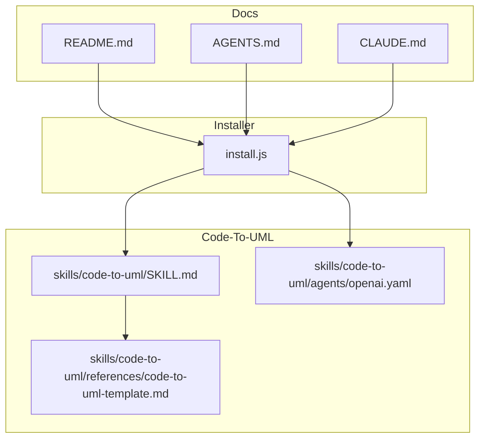
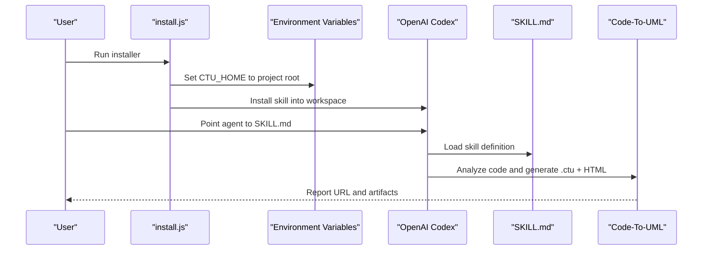
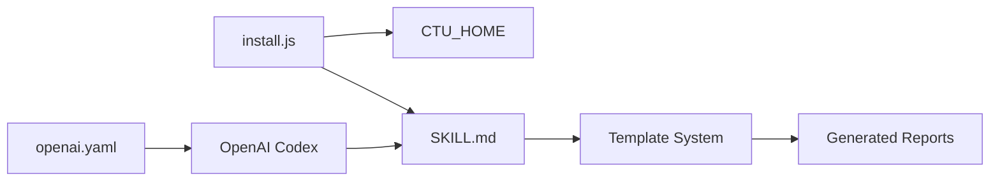

# OpenAI Codex Support

<cite>
**Referenced Files in This Document**
- [README.md](file://README.md)
- [AGENTS.md](file://AGENTS.md)
- [CLAUDE.md](file://CLAUDE.md)
- [install.js](file://install.js)
- [openai.yaml](file://skills/code-to-uml/agents/openai.yaml)
- [SKILL.md](file://skills/code-to-uml/SKILL.md)
</cite>

## Table of Contents
1. [Introduction](#introduction)
2. [Project Structure](#project-structure)
3. [Core Components](#core-components)
4. [Architecture Overview](#architecture-overview)
5. [Detailed Component Analysis](#detailed-component-analysis)
6. [Dependency Analysis](#dependency-analysis)
7. [Performance Considerations](#performance-considerations)
8. [Troubleshooting Guide](#troubleshooting-guide)
9. [Conclusion](#conclusion)
10. [Appendices](#appendices)

## Introduction
This document explains how to integrate OpenAI Codex with Code-To-UML. It covers environment setup, project registration, agent skill configuration, and practical guidance for using the bundled skill to generate UML-backed HTML reports. It also provides best practices for model selection and cost optimization, along with troubleshooting for common issues such as API key validation, rate limits, billing configuration, and workspace permissions.

## Project Structure
The repository provides:
- A skill definition that instructs AI agents (including OpenAI Codex) how to analyze code and produce Code-To-UML reports.
- An installer script to register the project root as CTU_HOME and install the skill into supported tool workspaces.
- A minimal OpenAI agent configuration file included alongside the skill.

**Diagram sources**
- [README.md:277-295](file://README.md#L277-L295)
- [install.js:112-130](file://install.js#L112-L130)
- [openai.yaml:1-5](file://skills/code-to-uml/agents/openai.yaml#L1-L5)
- [SKILL.md:1-174](file://skills/code-to-uml/SKILL.md#L1-L174)

**Section sources**
- [README.md:81-120](file://README.md#L81-L120)
- [install.js:150-202](file://install.js#L150-L202)

## Core Components
- Skill definition: Defines the purpose, constraints, workflow, and output format for generating Code-To-UML reports.
- Installer: Registers the project root as CTU_HOME and installs the skill into supported tool workspaces, including Codex.
- OpenAI agent configuration: Provides a minimal interface definition for OpenAI-compatible agents.

Key responsibilities:
- Skill definition ensures consistent report generation and template reuse.
- Installer configures environment variables and workspace paths for agent access.
- OpenAI agent configuration aligns the agent’s interface with the skill’s expectations.

**Section sources**
- [SKILL.md:6-28](file://skills/code-to-uml/SKILL.md#L6-L28)
- [install.js:112-130](file://install.js#L112-L130)
- [openai.yaml:1-5](file://skills/code-to-uml/agents/openai.yaml#L1-L5)

## Architecture Overview
The integration pathway for OpenAI Codex with Code-To-UML:

**Diagram sources**
- [install.js:204-220](file://install.js#L204-L220)
- [README.md:289-294](file://README.md#L289-L294)
- [SKILL.md:164-174](file://skills/code-to-uml/SKILL.md#L164-L174)

## Detailed Component Analysis

### Environment Setup and Project Registration
- Register the project root as CTU_HOME using the installer. This enables agents to locate templates and data directories consistently.
- The installer supports multiple tools and writes the appropriate configuration for each tool’s workspace.

Step-by-step:
1. Run the installer to set CTU_HOME and install the skill into supported tool workspaces.
2. Open a new terminal session to ensure environment changes take effect.
3. Confirm that the skill is present in the tool’s skills directory.

**Section sources**
- [README.md:97-101](file://README.md#L97-L101)
- [install.js:204-220](file://install.js#L204-L220)
- [install.js:150-202](file://install.js#L150-L202)

### OpenAI Agent Configuration
- The repository includes a minimal OpenAI agent interface definition alongside the skill.
- This file describes the agent’s display name, short description, and default prompt aligned with the skill’s purpose.

Recommendations:
- Use the default prompt provided by the interface definition as the starting point.
- Customize prompts only if your agent workflow requires specific phrasing or constraints.

**Section sources**
- [openai.yaml:1-5](file://skills/code-to-uml/agents/openai.yaml#L1-L5)

### Agent Skill Activation and Execution
- Point your OpenAI Codex agent to the skill definition file.
- The skill defines the full workflow, including scope resolution, template reuse, data generation, HTML generation, and server startup for verification.

Operational flow:
1. The agent resolves the analysis scope and constraints.
2. It reads project instructions and templates.
3. It analyzes code and normalizes the report plan.
4. It generates .ctu data files and an HTML report.
5. It starts the local server and verifies the report.

**Section sources**
- [README.md:289-294](file://README.md#L289-L294)
- [SKILL.md:30-94](file://skills/code-to-uml/SKILL.md#L30-L94)

### Authentication and Workspace Configuration
- The installer configures the agent’s workspace to access the skill and templates.
- Ensure the agent has permission to read the project root and write generated reports to the cache directory.

Best practices:
- Keep the project root private and restrict access to trusted environments.
- Use separate credentials for agent access if your platform supports it.

**Section sources**
- [install.js:112-130](file://install.js#L112-L130)
- [SKILL.md:14-28](file://skills/code-to-uml/SKILL.md#L14-L28)

### OpenAI-Specific YAML Settings
- The agent interface definition includes display metadata and a default prompt.
- Align your agent’s configuration with the skill’s expectations to ensure consistent report generation.

Guidance:
- Do not override the default prompt unless you have validated the change against the skill’s workflow.
- Ensure the agent’s model selection aligns with the skill’s content requirements.

**Section sources**
- [openai.yaml:1-5](file://skills/code-to-uml/agents/openai.yaml#L1-L5)
- [SKILL.md:123-136](file://skills/code-to-uml/SKILL.md#L123-L136)

### Model Selection and Cost Optimization
- Choose a model that balances quality and cost for your workload.
- Consider the skill’s content length and diagram complexity when selecting a model.
- Monitor usage and enable cost controls in your OpenAI dashboard.

[No sources needed since this section provides general guidance]

### Comparison with Other AI Agents
- The repository documents support for multiple agents, including OpenAI Codex, Cursor, Claude Code, Qwen, and others.
- Differences in capabilities and configuration are tool-specific; the skill remains consistent across agents.

**Section sources**
- [README.md:281-287](file://README.md#L281-L287)

## Dependency Analysis
The integration depends on:
- Installer to configure CTU_HOME and workspace paths.
- Skill definition to govern report generation.
- Agent configuration to define interface behavior.

**Diagram sources**
- [install.js:204-220](file://install.js#L204-L220)
- [openai.yaml:1-5](file://skills/code-to-uml/agents/openai.yaml#L1-L5)
- [SKILL.md:164-174](file://skills/code-to-uml/SKILL.md#L164-L174)

**Section sources**
- [install.js:112-130](file://install.js#L112-L130)
- [openai.yaml:1-5](file://skills/code-to-uml/agents/openai.yaml#L1-L5)
- [SKILL.md:6-28](file://skills/code-to-uml/SKILL.md#L6-L28)

## Performance Considerations
- Keep the project root organized to minimize scan times for agents.
- Use smaller, focused scopes when possible to reduce token usage and generation time.
- Cache frequently used templates and data to avoid repeated processing.

[No sources needed since this section provides general guidance]

## Troubleshooting Guide
Common issues and resolutions:
- API key validation failures: Ensure the agent has access to a valid API key and that the key has permissions for the selected model.
- Rate limits: Implement retry logic with exponential backoff and reduce concurrent requests.
- Billing configuration: Enable billing and confirm sufficient credits for your workload.
- Workspace permissions: Verify that the agent can read the project root and write to the cache directory.

**Section sources**
- [install.js:150-202](file://install.js#L150-L202)
- [SKILL.md:14-28](file://skills/code-to-uml/SKILL.md#L14-L28)

## Conclusion
Integrating OpenAI Codex with Code-To-UML involves registering the project root, installing the skill into the agent’s workspace, and aligning the agent’s configuration with the skill’s expectations. By following the steps outlined here and applying the best practices for model selection and cost optimization, you can reliably generate high-quality UML-backed HTML reports.

[No sources needed since this section summarizes without analyzing specific files]

## Appendices

### Step-by-Step Setup Checklist
- Run the installer to set CTU_HOME and install the skill.
- Open a new terminal session.
- Point your OpenAI Codex agent to the skill definition.
- Execute the skill to analyze code and generate reports.
- Verify the report URL and artifacts.

**Section sources**
- [README.md:97-101](file://README.md#L97-L101)
- [README.md:289-294](file://README.md#L289-L294)
- [install.js:204-220](file://install.js#L204-L220)