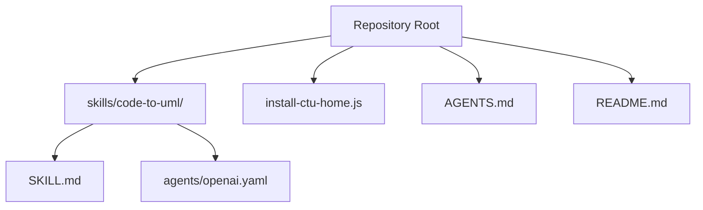
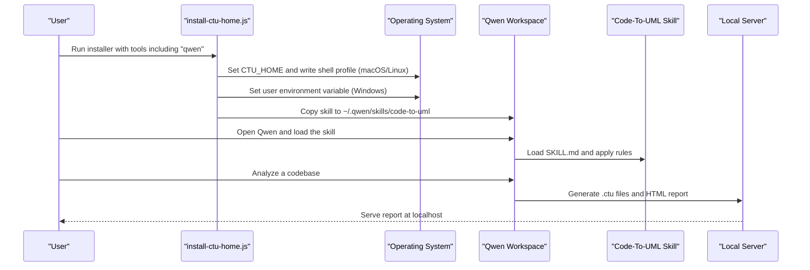
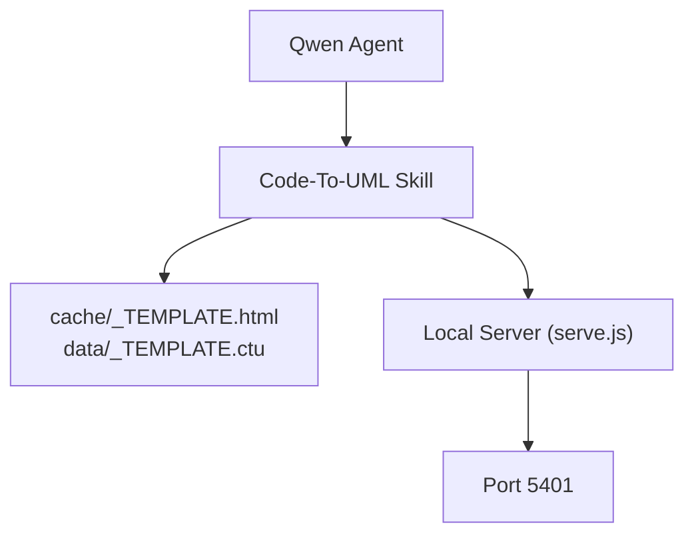

# Qwen Coder Configuration

<cite>
**Referenced Files in This Document**
- [README.md](file://README.md)
- [AGENTS.md](file://AGENTS.md)
- [install-ctu-home.js](file://install-ctu-home.js)
- [SKILL.md](file://skills/code-to-uml/SKILL.md)
- [openai.yaml](file://skills/code-to-uml/agents/openai.yaml)
- [install-ctu-home.test.js](file://test/install-ctu-home.test.js)
</cite>

## Table of Contents
1. [Introduction](#introduction)
2. [Project Structure](#project-structure)
3. [Core Components](#core-components)
4. [Architecture Overview](#architecture-overview)
5. [Detailed Component Analysis](#detailed-component-analysis)
6. [Dependency Analysis](#dependency-analysis)
7. [Performance Considerations](#performance-considerations)
8. [Troubleshooting Guide](#troubleshooting-guide)
9. [Conclusion](#conclusion)

## Introduction
This document explains how to configure Qwen Coder AI for integration with Code-To-UML. It covers environment setup, project registration, skill activation, and credential management tailored to Qwen’s workspace and agent ecosystem. It also documents Qwen-specific YAML settings, environment variables, best practices, model selection, performance optimization, and common setup issues such as API keys, regional availability, and workspace permissions.

## Project Structure
The repository is a static frontend project that renders PlantUML diagrams in the browser and via a local Node server. For Qwen integration, the key elements are:
- Skills directory containing the Code-To-UML skill definition
- Installation script to register the project root as CTU_HOME and install the skill into Qwen’s workspace
- Agent guidelines and server configuration for local rendering

**Diagram sources**
- [README.md](file://README.md)
- [AGENTS.md](file://AGENTS.md)
- [install-ctu-home.js](file://install-ctu-home.js)
- [SKILL.md](file://skills/code-to-uml/SKILL.md)
- [openai.yaml](file://skills/code-to-uml/agents/openai.yaml)

**Section sources**
- [README.md](file://README.md)
- [AGENTS.md](file://AGENTS.md)

## Core Components
- CTU_HOME environment variable: Points to the project root so AI agents can locate templates and data files.
- Code-To-UML skill: Defines the workflow, constraints, and output format for generating UML-backed HTML reports.
- Qwen workspace integration: The installation script places the skill into Qwen’s skills directory so the agent can discover and use it.

Key responsibilities:
- install-ctu-home.js: Sets CTU_HOME and installs the bundled skill into Qwen’s workspace.
- SKILL.md: Provides the instruction set and rules for Qwen to generate reports consistently.
- openai.yaml: Demonstrates the interface configuration format used by agents; Qwen consumes the same skill semantics.

**Section sources**
- [install-ctu-home.js](file://install-ctu-home.js)
- [SKILL.md](file://skills/code-to-uml/SKILL.md)
- [openai.yaml](file://skills/code-to-uml/agents/openai.yaml)

## Architecture Overview
The Qwen integration follows a simple, deterministic flow:
- Register the project as CTU_HOME
- Install the Code-To-UML skill into Qwen’s skills directory
- Launch Qwen and point it to the skill
- Provide a codebase to analyze; Qwen generates .ctu data files and an HTML report

**Diagram sources**
- [install-ctu-home.js](file://install-ctu-home.js)
- [SKILL.md](file://skills/code-to-uml/SKILL.md)

## Detailed Component Analysis

### Environment Setup and Project Registration
- Set CTU_HOME to the repository root so Qwen can resolve templates and data files.
- On macOS/Linux, the installer writes a profile block with markers to avoid duplication.
- On Windows, the installer sets a user environment variable via PowerShell or falls back to setx.
- The installer also copies the skill into Qwen’s skills directory under ~/.qwen/skills/code-to-uml.

Best practices:
- Open a new terminal after installation to ensure environment variables are loaded.
- Confirm CTU_HOME points to a directory containing cache/_TEMPLATE.html and data/_TEMPLATE.ctu.

**Section sources**
- [install-ctu-home.js](file://install-ctu-home.js)
- [AGENTS.md](file://AGENTS.md)

### Skill Activation and Credential Management
- The Code-To-UML skill is installed into Qwen’s workspace. Qwen will discover it automatically from ~/.qwen/skills/code-to-uml.
- The skill itself does not define external API credentials; it relies on the local environment and server rendering pipeline.
- If you use Qwen with external providers, manage credentials per Qwen’s provider configuration (e.g., API keys, base URLs). Ensure the selected provider region supports your needs.

Note: The skill’s hard rules emphasize resolving CTU_HOME, preserving templates, and verifying the generated report.

**Section sources**
- [SKILL.md](file://skills/code-to-uml/SKILL.md)
- [install-ctu-home.js](file://install-ctu-home.js)

### Qwen-Specific YAML Settings
- The repository includes an example agent interface definition under agents/openai.yaml. While this file targets OpenAI-style agents, Qwen consumes the same semantic skill definition.
- The YAML fields demonstrate how agents describe the skill’s display name, short description, and default prompt. Qwen interprets the same semantic meaning from the skill’s natural-language specification in SKILL.md.

Recommendations:
- Use the skill’s natural-language instructions as the authoritative specification.
- If you need to customize agent behavior, align your configuration with the skill’s rules and output expectations.

**Section sources**
- [openai.yaml](file://skills/code-to-uml/agents/openai.yaml)
- [SKILL.md](file://skills/code-to-uml/SKILL.md)

### Environment Variables and Server Configuration
- CTU_HOME: Required to locate templates and data files.
- PORT: Controls the local server port (default 5401).
- JAVA available on PATH: Required for server-side PlantUML rendering fallback.

Local server behavior:
- The server serves static files and exposes a PlantUML rendering endpoint.
- The skill instructs Qwen to start the server from CTU_HOME and verify the report URL.

**Section sources**
- [AGENTS.md](file://AGENTS.md)
- [SKILL.md](file://skills/code-to-uml/SKILL.md)

### Qwen Workspace Best Practices
- Keep CTU_HOME stable and version-controlled alongside your project.
- Use the bundled templates to ensure consistent report structure and rendering behavior.
- When generating reports, verify:
  - All mandatory sections are present
  - UML blocks pass static checks
  - The server is running and the report URL returns HTTP 200
  - Navigation and topbar links behave as intended

**Section sources**
- [SKILL.md](file://skills/code-to-uml/SKILL.md)

### Model Selection and Performance Optimization
- Choose a model appropriate for code analysis tasks. If using Qwen with external providers, select a provider region that meets your latency and compliance requirements.
- Optimize performance by:
  - Limiting scope to reduce rendering workload (module, file, class, or function)
  - Ensuring the local WASM renderer is used first; server fallback occurs only when necessary
  - Verifying PlantUML syntax to minimize re-renders

[No sources needed since this section provides general guidance]

## Dependency Analysis
The Qwen integration depends on:
- CTU_HOME resolution for locating templates and data
- Local server availability for report generation and verification
- Skill semantics defined in SKILL.md

**Diagram sources**
- [SKILL.md](file://skills/code-to-uml/SKILL.md)
- [AGENTS.md](file://AGENTS.md)

**Section sources**
- [SKILL.md](file://skills/code-to-uml/SKILL.md)
- [AGENTS.md](file://AGENTS.md)

## Performance Considerations
- Prefer smaller scopes (file/class/function) to reduce rendering time and memory usage.
- Keep UML syntax concise and localized to improve rendering throughput.
- Use the local WASM renderer first; server fallback is slower and should be avoided when possible.

[No sources needed since this section provides general guidance]

## Troubleshooting Guide
Common issues and resolutions:
- API key configuration
  - If using Qwen with external providers, ensure provider credentials are configured in Qwen’s provider settings.
  - Verify the provider region supports your workload and complies with your policies.
- Regional availability
  - Select a provider region closest to your location to reduce latency.
- Workspace permissions
  - Ensure Qwen has read/write access to CTU_HOME and the generated cache directory.
- Skill not found
  - Confirm the skill was copied to ~/.qwen/skills/code-to-uml by the installer.
  - Re-run the installer if necessary.
- Report not loading
  - Start the server from CTU_HOME and verify the report URL returns HTTP 200.
  - Check that the server is listening on the expected port and that firewall rules allow connections.

**Section sources**
- [install-ctu-home.js](file://install-ctu-home.js)
- [install-ctu-home.test.js](file://test/install-ctu-home.test.js)
- [SKILL.md](file://skills/code-to-uml/SKILL.md)
- [AGENTS.md](file://AGENTS.md)

## Conclusion
Integrating Qwen Coder with Code-To-UML centers on registering the project as CTU_HOME, installing the skill into Qwen’s workspace, and following the skill’s rules for report generation. By managing environment variables, validating server behavior, and selecting appropriate models and scopes, you can achieve reliable, high-quality UML-backed reports tailored to your codebases.