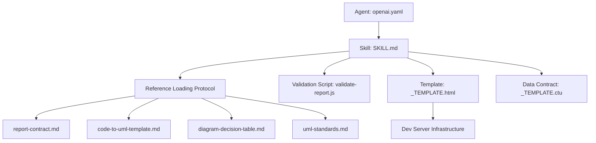
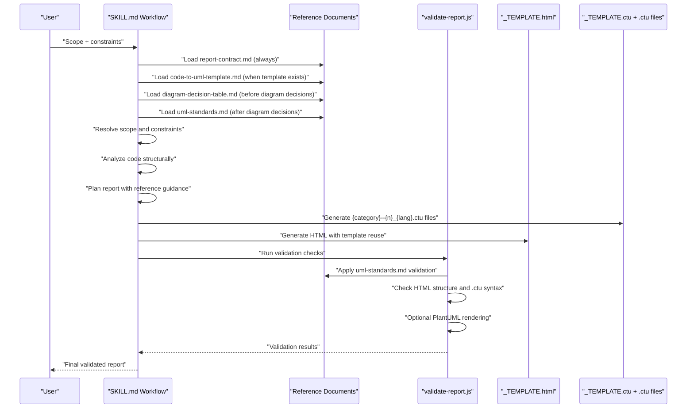
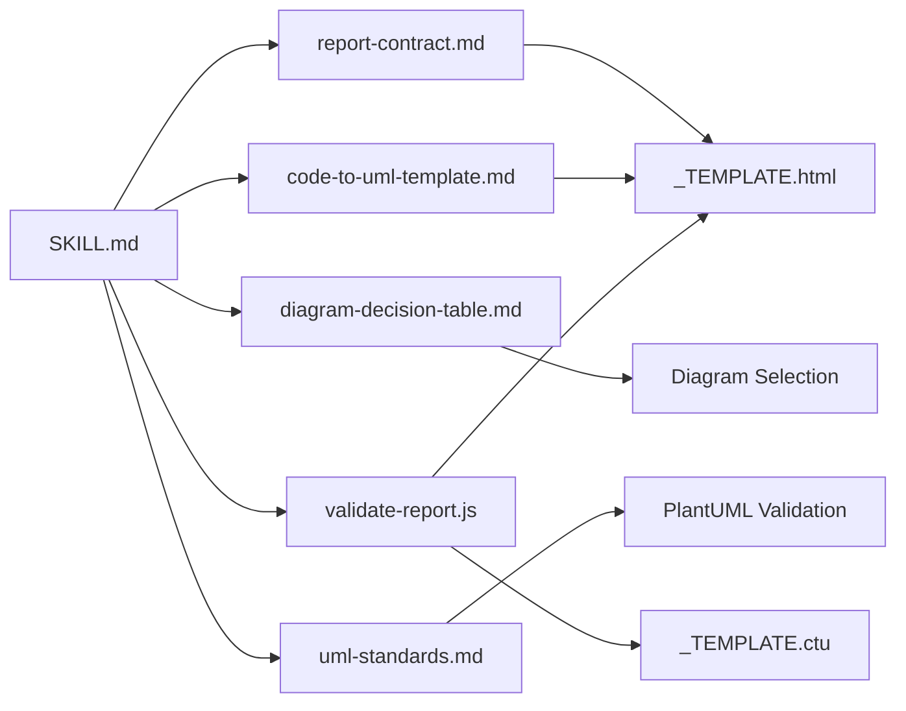
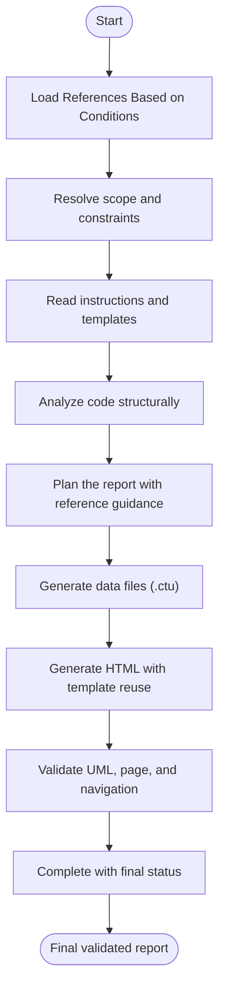

# Skill Definition System

<cite>
**Referenced Files in This Document**
- [SKILL.md](file://skills/code-to-uml/SKILL.md)
- [report-contract.md](file://skills/code-to-uml/references/report-contract.md)
- [code-to-uml-template.md](file://skills/code-to-uml/references/code-to-uml-template.md)
- [diagram-decision-table.md](file://skills/code-to-uml/references/diagram-decision-table.md)
- [uml-standards.md](file://skills/code-to-uml/references/uml-standards.md)
- [validate-report.js](file://skills/code-to-uml/scripts/validate-report.js)
- [openai.yaml](file://skills/code-to-uml/agents/openai.yaml)
- [_TEMPLATE.html](file://cache/_TEMPLATE.html)
- [_TEMPLATE.ctu](file://data/_TEMPLATE.ctu)
- [sequence--1_zh.ctu](file://data/demo/sequence--1_zh.ctu)
- [use-case--1_zh.ctu](file://data/demo/use-case--1_zh.ctu)
</cite>

## Update Summary
**Changes Made**
- Updated SKILL.md structure to reflect the streamlined 80-line documentation with emphasis on reference loading protocols
- Added comprehensive coverage of the seven-phase workflow: scope resolution, instruction reading, structural analysis, report planning, data generation, validation, and completion verification
- Enhanced documentation of reference loading conditions and their application timing
- Updated workflow stages with specific phase numbering and detailed procedures
- Expanded validation requirements including PlantUML rendering checks
- Added detailed explanation of the four reference documents and their roles

## Table of Contents
1. [Introduction](#introduction)
2. [Project Structure](#project-structure)
3. [Core Components](#core-components)
4. [Architecture Overview](#architecture-overview)
5. [Detailed Component Analysis](#detailed-component-analysis)
6. [Dependency Analysis](#dependency-analysis)
7. [Performance Considerations](#performance-considerations)
8. [Troubleshooting Guide](#troubleshooting-guide)
9. [Conclusion](#conclusion)
10. [Appendices](#appendices)

## Introduction
This document defines the Code-To-UML skill and its YAML-based agent configuration. It explains the SKILL.md structure, the YAML agent interface, and the end-to-end workflow for generating consistent UML-backed HTML reports from existing Code-To-UML templates. The skill now emphasizes systematic reference loading protocols and a structured seven-phase workflow that ensures consistent, validated output across all analysis scopes.

**Updated** Streamlined from 167 lines to 80 lines while maintaining comprehensive coverage of all essential requirements and workflows.

## Project Structure
The skill is organized around a YAML agent descriptor and a comprehensive set of reference materials that define the report generation contract and validation requirements:
- Agent interface: YAML that declares display metadata and default prompt.
- Skill definition: Markdown that specifies purpose, reference loading protocols, workflow phases, and validation requirements.
- Reference system: Four specialized documents that govern different aspects of report generation.
- Template system: HTML template and data contract for UML-backed reports.
- Validation scripts: Automated checking of HTML structure, .ctu syntax, and PlantUML rendering.

**Diagram sources**
- [openai.yaml:1-5](file://skills/code-to-uml/agents/openai.yaml#L1-L5)
- [SKILL.md:12-21](file://skills/code-to-uml/SKILL.md#L12-L21)
- [report-contract.md:1-191](file://skills/code-to-uml/references/report-contract.md#L1-L191)
- [code-to-uml-template.md:1-208](file://skills/code-to-uml/references/code-to-uml-template.md#L1-L208)
- [diagram-decision-table.md:1-95](file://skills/code-to-uml/references/diagram-decision-table.md#L1-L95)
- [uml-standards.md:1-172](file://skills/code-to-uml/references/uml-standards.md#L1-L172)
- [validate-report.js:1-506](file://skills/code-to-uml/scripts/validate-report.js#L1-L506)

**Section sources**
- [openai.yaml:1-5](file://skills/code-to-uml/agents/openai.yaml#L1-L5)
- [SKILL.md:12-21](file://skills/code-to-uml/SKILL.md#L12-L21)
- [report-contract.md:1-191](file://skills/code-to-uml/references/report-contract.md#L1-L191)
- [code-to-uml-template.md:1-208](file://skills/code-to-uml/references/code-to-uml-template.md#L1-L208)
- [diagram-decision-table.md:1-95](file://skills/code-to-uml/references/diagram-decision-table.md#L1-L95)
- [uml-standards.md:1-172](file://skills/code-to-uml/references/uml-standards.md#L1-L172)
- [validate-report.js:1-506](file://skills/code-to-uml/scripts/validate-report.js#L1-L506)

## Core Components
- **Agent interface (YAML)**: Defines display name, short description, and default prompt for the skill.
- **Reference loading system**: Four specialized documents that govern different aspects of report generation:
  - `report-contract.md`: Category model, section catalog, scope applicability, and validation requirements
  - `code-to-uml-template.md`: Template structure, naming conventions, and runtime contracts
  - `diagram-decision-table.md`: Diagram selection principles and complexity scoring
  - `uml-standards.md`: PlantUML syntax rules and validation requirements
- **Structured workflow**: Seven-phase process that ensures systematic report generation and validation.
- **Validation system**: Automated checking of HTML structure, .ctu syntax, and PlantUML rendering.
- **Template system**: HTML template and .ctu data contract that enforce structural reuse and runtime behavior.

**Section sources**
- [openai.yaml:1-5](file://skills/code-to-uml/agents/openai.yaml#L1-L5)
- [SKILL.md:12-21](file://skills/code-to-uml/SKILL.md#L12-L21)
- [SKILL.md:37-76](file://skills/code-to-uml/SKILL.md#L37-L76)
- [report-contract.md:1-191](file://skills/code-to-uml/references/report-contract.md#L1-L191)
- [code-to-uml-template.md:1-208](file://skills/code-to-uml/references/code-to-uml-template.md#L1-L208)
- [diagram-decision-table.md:1-95](file://skills/code-to-uml/references/diagram-decision-table.md#L1-L95)
- [uml-standards.md:1-172](file://skills/code-to-uml/references/uml-standards.md#L1-L172)
- [validate-report.js:1-506](file://skills/code-to-uml/scripts/validate-report.js#L1-L506)

## Architecture Overview
The skill orchestrates a systematic pipeline with emphasis on reference loading protocols and validation: resolve scope and constraints, load appropriate references, analyze code, plan report structure, generate data and HTML, validate UML and navigation, and verify completion.

**Diagram sources**
- [SKILL.md:12-21](file://skills/code-to-uml/SKILL.md#L12-L21)
- [SKILL.md:37-76](file://skills/code-to-uml/SKILL.md#L37-L76)
- [validate-report.js:454-506](file://skills/code-to-uml/scripts/validate-report.js#L454-L506)

## Detailed Component Analysis

### YAML Agent Interface (openai.yaml)
- Declares display metadata and default prompt for the skill.
- Provides a concise entry point for agent configuration with "Code UML Report" display name and "Analyze code into consistent Code-To-UML HTML reports" description.

**Section sources**
- [openai.yaml:1-5](file://skills/code-to-uml/agents/openai.yaml#L1-L5)

### SKILL.md: Purpose, Reference Loading Protocols, and Structured Workflow
- **Purpose**: Generate developer-friendly source-code analysis reports for any scope (project, module, file, class, or function) using existing Code-To-UML template/report conventions.
- **Reference Loading Protocols**: Systematic loading of reference documents based on specific conditions:
  - `references/report-contract.md`: Always read before planning or generating report content
  - `references/code-to-uml-template.md`: Read when `$CTU_HOME/cache/_TEMPLATE.html` and `$CTU_HOME/data/_TEMPLATE.ctu` exist, or when generating a Code-To-UML report page
  - `references/diagram-decision-table.md`: Read before deciding the text-to-diagram ratio or diagram types
  - `references/uml-standards.md`: Read after diagram decisions whenever the report will contain non-empty `[UML]` blocks
  - `scripts/validate-report.js`: Run after generating report HTML and `.ctu` data, before claiming completion
- **Structured Workflow**: Seven-phase process with specific procedures:
  1. **Resolve scope and constraints**: Identify target type, record constraints, resolve Code-To-UML root
  2. **Read instructions and templates**: Load local instructions and required references
  3. **Analyze code structurally**: Prefer structural tools, use focused file reads for text analysis
  4. **Plan the report**: Use reference documents for section IDs, category ownership, and diagram decisions
  5. **Generate data and HTML**: Create data directory and category-based .ctu files
  6. **Validate UML, page, and navigation**: Extract UML blocks, validate against standards, run validation script
  7. **Completion**: Return final status shape with validation results

**Section sources**
- [SKILL.md:8-21](file://skills/code-to-uml/SKILL.md#L8-L21)
- [SKILL.md:37-76](file://skills/code-to-uml/SKILL.md#L37-L76)

### Reference Loading System
The skill employs a systematic approach to loading reference documents based on specific conditions:

#### report-contract.md
- **Always loaded**: Before planning or generating report content
- **Purpose**: Defines category model, 13 section IDs, scope applicability matrix, and validation requirements
- **Key features**: Canonical categories (overview, structure, objects, architecture, flow, calls, dataflow, code, principles, guide), scope-specific depth requirements, and merge rules

#### code-to-uml-template.md
- **Loaded when**: Template files exist or when generating Code-To-UML report pages
- **Purpose**: Template structure, naming conventions, and runtime contracts
- **Key features**: HTML runtime contract, topbar link contract, .ctu file format, and verification procedures

#### diagram-decision-table.md
- **Loaded before**: Deciding text-to-diagram ratio or diagram types
- **Purpose**: Diagram selection principles and complexity scoring
- **Key features**: Six-dimensional complexity scoring (module count, external dependencies, state mutation, concurrency, exception paths, business rules), diagram type recommendations

#### uml-standards.md
- **Loaded after**: Diagram decisions, when reports contain non-empty `[UML]` blocks
- **Purpose**: PlantUML syntax rules and validation requirements
- **Key features**: Mandatory UML block contract, diagram-type specific rules, readability budget guidelines, and validation checklist

**Section sources**
- [SKILL.md:12-21](file://skills/code-to-uml/SKILL.md#L12-L21)
- [report-contract.md:1-191](file://skills/code-to-uml/references/report-contract.md#L1-L191)
- [code-to-uml-template.md:1-208](file://skills/code-to-uml/references/code-to-uml-template.md#L1-L208)
- [diagram-decision-table.md:1-95](file://skills/code-to-uml/references/diagram-decision-table.md#L1-L95)
- [uml-standards.md:1-172](file://skills/code-to-uml/references/uml-standards.md#L1-L172)

### Validation System
The skill includes comprehensive validation through `scripts/validate-report.js`:

#### HTML Structure Validation
- Validates presence of required HTML elements (`<body>`, `<main>`, `<nav>`, etc.)
- Checks for proper class attributes and data attributes
- Verifies tab and overview alignment
- Ensures official demo link integrity

#### Data Validation
- Validates .ctu file naming conventions (`{category}--{n}_{lang}.ctu`)
- Checks header format (Title:, Describe:)
- Validates card structure ([Example], [Description], [UML], [Detail])
- Ensures separator line presence and proper formatting

#### UML Validation
- Validates PlantUML syntax and structure
- Checks start/end tag matching
- Verifies bracket and delimiter balance
- Performs optional PlantUML rendering with `plantuml.jar`

#### Execution Flow
- Resolves Code-To-UML root from multiple sources
- Supports strict mode for warnings-as-errors
- Provides detailed error reporting with file and line information

**Section sources**
- [validate-report.js:1-506](file://skills/code-to-uml/scripts/validate-report.js#L1-L506)

### Template Reuse and Navigation Rules
- **Root resolution**: Prefer CTU_HOME; otherwise require current directory to contain template files
- **HTML template enforcement**: Preserve structural classes, ids, and script order
- **Data contract**: Title/Describe header followed by at least 60 hyphens separator
- **Navigation rules**: Tabs must align with .ctu category prefixes; data-dir must point to report's data directory

**Section sources**
- [code-to-uml-template.md:21-29](file://skills/code-to-uml/references/code-to-uml-template.md#L21-L29)
- [code-to-uml-template.md:55-83](file://skills/code-to-uml/references/code-to-uml-template.md#L55-L83)
- [code-to-uml-template.md:94-149](file://skills/code-to-uml/references/code-to-uml-template.md#L94-L149)

### Data Generation and Categories
- **Stable categories**: overview, structure, objects, architecture, flow, calls, dataflow, code, principles, guide
- **Naming convention**: `{category}--{n}_{lang}.ctu`
- **Language support**: Default `_zh`, optional `_en`

**Section sources**
- [report-contract.md:21-33](file://skills/code-to-uml/references/report-contract.md#L21-L33)
- [code-to-uml-template.md:30-42](file://skills/code-to-uml/references/code-to-uml-template.md#L30-L42)

### Example Data Files
Demonstrate minimal .ctu structure with UML blocks and optional descriptions/details for validation and rendering testing.

**Section sources**
- [sequence--1_zh.ctu:1-22](file://data/demo/sequence--1_zh.ctu#L1-L22)
- [use-case--1_zh.ctu:1-21](file://data/demo/use-case--1_zh.ctu#L1-L21)

## Dependency Analysis
The skill depends on a systematic reference loading mechanism and validation infrastructure:
- **Reference documents**: Four specialized documents governing different aspects of report generation
- **Template files**: For structure and navigation enforcement
- **Validation scripts**: For automated checking and PlantUML rendering
- **Data contracts**: For content generation and parsing

**Diagram sources**
- [SKILL.md:12-21](file://skills/code-to-uml/SKILL.md#L12-L21)
- [validate-report.js:454-506](file://skills/code-to-uml/scripts/validate-report.js#L454-L506)

**Section sources**
- [SKILL.md:12-21](file://skills/code-to-uml/SKILL.md#L12-L21)
- [validate-report.js:1-506](file://skills/code-to-uml/scripts/validate-report.js#L1-L506)

## Performance Considerations
- **Reference loading optimization**: Load only when conditions apply to minimize processing overhead
- **Validation prioritization**: Prefer static checks first; defer PlantUML rendering to server fallback when available
- **Template reuse efficiency**: Leverage existing template structure to reduce generation time
- **Selective diagram usage**: Use diagram-decision-table.md to avoid unnecessary diagrams that increase render time

## Troubleshooting Guide
Common pitfalls and remedies:
- **Reference loading issues**: Ensure correct loading conditions are met for each reference document
- **Template root resolution**: Verify CTU_HOME environment variable or provide explicit root path
- **Diagram decision conflicts**: Use diagram-decision-table.md consistently for diagram selection
- **UML syntax errors**: Validate against uml-standards.md before rendering
- **Validation failures**: Use validate-report.js with --strict mode for comprehensive checking
- **PlantUML rendering issues**: Ensure plantuml.jar is available and Java is on PATH when using --render flag

**Section sources**
- [SKILL.md:22-36](file://skills/code-to-uml/SKILL.md#L22-L36)
- [validate-report.js:13-26](file://skills/code-to-uml/scripts/validate-report.js#L13-L26)
- [validate-report.js:454-506](file://skills/code-to-uml/scripts/validate-report.js#L454-L506)

## Conclusion
The Code-To-UML skill provides a rigorous, reference-driven framework for generating consistent, UML-backed HTML reports across multiple analysis scopes. The streamlined 80-line SKILL.md documentation emphasizes systematic reference loading protocols and a structured seven-phase workflow that ensures comprehensive coverage while maintaining validation rigor. By adhering to the reference loading conditions, following the structured workflow, and meeting the validation criteria, practitioners can produce high-quality, maintainable reports that integrate seamlessly with the project's template system and validation infrastructure.

## Appendices

### Appendix A: SKILL.md Workflow Stages (Visualized)

**Diagram sources**
- [SKILL.md:12-21](file://skills/code-to-uml/SKILL.md#L12-L21)
- [SKILL.md:37-76](file://skills/code-to-uml/SKILL.md#L37-L76)

### Appendix B: Reference Loading Conditions Matrix
| Reference Document | Loading Condition | Purpose |
|-------------------|-------------------|---------|
| report-contract.md | Always before planning or generating | Category model, section catalog, scope applicability |
| code-to-uml-template.md | When template files exist or generating report | Template structure, naming conventions, runtime contracts |
| diagram-decision-table.md | Before diagram decisions | Diagram selection principles, complexity scoring |
| uml-standards.md | After diagram decisions with non-empty UML | PlantUML syntax rules, validation requirements |
| validate-report.js | After HTML and .ctu generation | Comprehensive validation, PlantUML rendering |

**Section sources**
- [SKILL.md:12-21](file://skills/code-to-uml/SKILL.md#L12-L21)