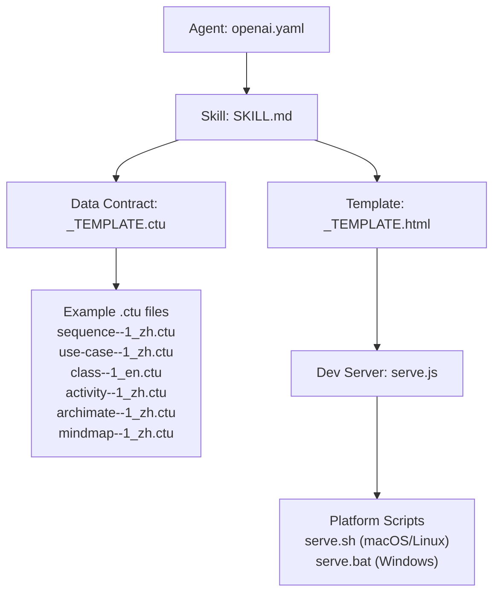
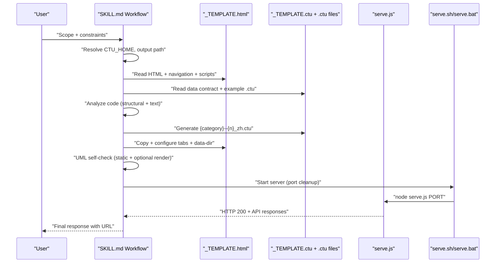
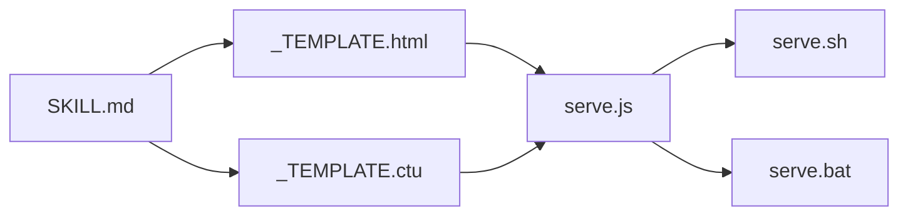
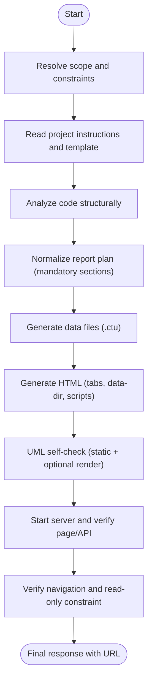

# Skill Definition System

<cite>
**Referenced Files in This Document**
- [SKILL.md](file://skills/code-to-uml/SKILL.md)
- [code-to-uml-template.md](file://skills/code-to-uml/references/code-to-uml-template.md)
- [openai.yaml](file://skills/code-to-uml/agents/openai.yaml)
- [_TEMPLATE.html](file://cache/_TEMPLATE.html)
- [_TEMPLATE.ctu](file://data/_TEMPLATE.ctu)
- [sequence--1_zh.ctu](file://data/demo/sequence--1_zh.ctu)
- [use-case--1_zh.ctu](file://data/demo/use-case--1_zh.ctu)
- [class--1_en.ctu](file://data/demo/class--1_en.ctu)
- [activity--1_zh.ctu](file://data/demo/activity--1_zh.ctu)
- [archimate--1_zh.ctu](file://data/demo/archimate--1_zh.ctu)
- [mindmap--1_zh.ctu](file://data/demo/mindmap--1_zh.ctu)
- [serve.js](file://serve.js)
- [serve.sh](file://serve.sh)
- [serve.bat](file://serve.bat)
</cite>

## Table of Contents
1. [Introduction](#introduction)
2. [Project Structure](#project-structure)
3. [Core Components](#core-components)
4. [Architecture Overview](#architecture-overview)
5. [Detailed Component Analysis](#detailed-component-analysis)
6. [Dependency Analysis](#dependency-analysis)
7. [Performance Considerations](#performance-considerations)
8. [Troubleshooting Guide](#troubleshooting-guide)
9. [Conclusion](#conclusion)
10. [Appendices](#appendices)

## Introduction
This document defines the Code-To-UML skill and its YAML-based agent configuration. It explains the SKILL.md structure, the YAML agent interface, and the end-to-end workflow for generating consistent UML-backed HTML reports from existing Code-To-UML templates. It documents hard rules, scope constraints, output formatting standards, mandatory report sections, UML standards, quality bar requirements, verification checklist, and final response format. It also highlights template reuse requirements, scope-specific depth expectations, and common pitfalls to avoid.

## Project Structure
The skill is organized around a YAML agent descriptor and a set of reference materials that define the report generation contract:
- Agent interface: YAML that declares display metadata and default prompt.
- Skill definition: Markdown that specifies purpose, hard rules, workflow, sections, standards, and verification.
- Template system: HTML template and data contract for UML-backed reports.
- Example data: Minimal .ctu files demonstrating the data format.
- Dev server: Node.js server and platform scripts for local verification.

**Diagram sources**
- [openai.yaml:1-5](file://skills/code-to-uml/agents/openai.yaml#L1-L5)
- [SKILL.md:1-174](file://skills/code-to-uml/SKILL.md#L1-L174)
- [_TEMPLATE.html:1-260](file://cache/_TEMPLATE.html#L1-L260)
- [_TEMPLATE.ctu:1-46](file://data/_TEMPLATE.ctu#L1-L46)
- [sequence--1_zh.ctu:1-22](file://data/demo/sequence--1_zh.ctu#L1-L22)
- [use-case--1_zh.ctu:1-21](file://data/demo/use-case--1_zh.ctu#L1-L21)
- [class--1_en.ctu:1-34](file://data/demo/class--1_en.ctu#L1-L34)
- [activity--1_zh.ctu:1-18](file://data/demo/activity--1_zh.ctu#L1-L18)
- [archimate--1_zh.ctu:1-20](file://data/demo/archimate--1_zh.ctu#L1-L20)
- [mindmap--1_zh.ctu:1-27](file://data/demo/mindmap--1_zh.ctu#L1-L27)
- [serve.js:1-567](file://serve.js#L1-L567)
- [serve.sh:1-54](file://serve.sh#L1-L54)
- [serve.bat:1-33](file://serve.bat#L1-L33)

**Section sources**
- [openai.yaml:1-5](file://skills/code-to-uml/agents/openai.yaml#L1-L5)
- [SKILL.md:1-174](file://skills/code-to-uml/SKILL.md#L1-L174)
- [_TEMPLATE.html:1-260](file://cache/_TEMPLATE.html#L1-L260)
- [_TEMPLATE.ctu:1-46](file://data/_TEMPLATE.ctu#L1-L46)
- [sequence--1_zh.ctu:1-22](file://data/demo/sequence--1_zh.ctu#L1-L22)
- [use-case--1_zh.ctu:1-21](file://data/demo/use-case--1_zh.ctu#L1-L21)
- [class--1_en.ctu:1-34](file://data/demo/class--1_en.ctu#L1-L34)
- [activity--1_zh.ctu:1-18](file://data/demo/activity--1_zh.ctu#L1-L18)
- [archimate--1_zh.ctu:1-20](file://data/demo/archimate--1_zh.ctu#L1-L20)
- [mindmap--1_zh.ctu:1-27](file://data/demo/mindmap--1_zh.ctu#L1-L27)
- [serve.js:1-567](file://serve.js#L1-L567)
- [serve.sh:1-54](file://serve.sh#L1-L54)
- [serve.bat:1-33](file://serve.bat#L1-L33)

## Core Components
- Agent interface (YAML): Defines display name, short description, and default prompt for the skill.
- Skill definition (Markdown): Specifies purpose, hard rules, workflow stages, mandatory sections, scope-specific depth, UML standards, content quality bar, verification checklist, and final response shape.
- Template system: HTML template and .ctu data contract that enforce structural reuse, navigation rules, and runtime behavior.
- Example data: Demonstrates the .ctu format and typical diagram categories.
- Dev server and scripts: Provide local verification endpoints and port cleanup semantics.

**Section sources**
- [openai.yaml:1-5](file://skills/code-to-uml/agents/openai.yaml#L1-L5)
- [SKILL.md:1-174](file://skills/code-to-uml/SKILL.md#L1-L174)
- [_TEMPLATE.html:1-260](file://cache/_TEMPLATE.html#L1-L260)
- [_TEMPLATE.ctu:1-46](file://data/_TEMPLATE.ctu#L1-L46)

## Architecture Overview
The skill orchestrates a deterministic pipeline: resolve scope and constraints, read template and instructions, analyze code, normalize report plan, generate data files, generate HTML, self-check UML, start server, and verify page/API.

**Diagram sources**
- [SKILL.md:30-94](file://skills/code-to-uml/SKILL.md#L30-L94)
- [_TEMPLATE.html:132-183](file://cache/_TEMPLATE.html#L132-L183)
- [_TEMPLATE.ctu:1-46](file://data/_TEMPLATE.ctu#L1-L46)
- [serve.js:454-561](file://serve.js#L454-L561)
- [serve.sh:1-54](file://serve.sh#L1-L54)
- [serve.bat:1-33](file://serve.bat#L1-L33)

## Detailed Component Analysis

### YAML Agent Interface (openai.yaml)
- Declares display metadata and default prompt for the skill.
- Provides a concise entry point for agent configuration.

**Section sources**
- [openai.yaml:1-5](file://skills/code-to-uml/agents/openai.yaml#L1-L5)

### SKILL.md: Purpose, Hard Rules, Workflow, and Output Contracts
- Purpose: Produce a consistent, UML-backed HTML report across scopes (project/module/file/class/function).
- Hard rules:
  - Source is read-only unless explicitly requested.
  - Resolve CTU_HOME and template reuse requirements.
  - Preserve fixed/script/nav attributes; only edit configurable/editable areas.
  - Handle topbar links intentionally (preserve, adapt, or remove).
  - Data-driven reports go into data directories.
  - Default to Chinese unless requested otherwise.
  - Enforce consistent final shape across scopes.
  - Avoid splitting into multiple HTML files unless justified.
  - Start server from CTU_HOME with provided scripts; include browser URL in final response.
  - Do not claim completion without verification.
- Workflow stages:
  - Resolve scope and constraints.
  - Read project instructions and template.
  - Analyze code structurally.
  - Normalize report plan (mandatory sections).
  - Generate data files (.ctu) with stable categories.
  - Generate HTML (tabs, data-dir, scripts).
  - UML self-check (static + optional PlantUML render).
  - Start server and verify page/API, navigation, and read-only constraint.
- Mandatory report sections (13):
  - File/Object Overview, Top-Level Structure, Core Objects/Functions, Overall Architecture, Core Flow, Call Relationship, Data/State Flow, Key Code Snippet Analysis, Core Principles, Getting Started Guide, Risks & Improvements, Q&A / Retrospective Checklist, Maintainer Quick Reference.
- Scope-specific depth:
  - Project: layers, entry points, subsystems, dependencies, runtime assumptions, onboarding.
  - Module/package: public API, internal files, dependency direction, state ownership, extension points.
  - File: top-level layout, contained classes/functions, globals, import-time side effects, primary runtime path.
  - Class: constructor/state, public methods, invariants, lifecycle, collaborators, subclass/consumer risks.
  - Function: signature, preconditions, algorithm, branches, exceptions, side effects, callers/callees, usage examples.
- UML standards:
  - Use PlantUML syntax inside [UML].
  - Prefer diagram types by purpose (component/package for architecture, activity for execution flow, sequence for call chains, state for lifecycle, class/object for data ownership, mindmap/wbs for overview/Q&A/reading path).
  - Keep labels readable; prefer Chinese when possible.
  - Avoid raw < and > unless required and safely escaped.
  - Avoid ambiguous activity continue statements.
  - Every diagram’s [Detail] must explain nodes/arrows and relevance.
- Content quality bar:
  - Be concrete (mention real names, files, constants, routes, commands).
  - Be proportional (broader scopes synthesize more; narrower scopes dive deeper).
  - Explain side effects and failure paths.
  - Include line numbers or symbol locations in maintainer index.
  - Prefer concise snippets (<30 lines) with explanation.
  - Avoid vague “improvement” statements; name specific risks and improvements.
- Verification checklist:
  - Read-only constraint respected.
  - HTML output exists at requested path.
  - Data directory exists and categories match tab data-diagram values.
  - .ctu syntax follows template.
  - All 13 mandatory sections present.
  - Every UML block passed static checks.
  - PlantUML render check passed or limitation stated.
  - Topbar links intentionally preserved/adapted/removed and verified.
  - Server started via serve.sh/serve.bat; port cleanup handled by scripts.
  - Local page/API loads; browser URL included in final response.
  - Final response uses user-requested concise status format when provided.
- Final response shape (when not customized):
  - HTML file path
  - Template reuse situation
  - Multi-file split status
  - PlantUML check result
  - Report section summary
  - Browser URL

**Section sources**
- [SKILL.md:8-29](file://skills/code-to-uml/SKILL.md#L8-L29)
- [SKILL.md:30-94](file://skills/code-to-uml/SKILL.md#L30-L94)
- [SKILL.md:95-112](file://skills/code-to-uml/SKILL.md#L95-L112)
- [SKILL.md:113-122](file://skills/code-to-uml/SKILL.md#L113-L122)
- [SKILL.md:123-137](file://skills/code-to-uml/SKILL.md#L123-L137)
- [SKILL.md:138-146](file://skills/code-to-uml/SKILL.md#L138-L146)
- [SKILL.md:147-163](file://skills/code-to-uml/SKILL.md#L147-L163)
- [SKILL.md:164-174](file://skills/code-to-uml/SKILL.md#L164-L174)

### Template Reuse and Navigation Rules
- Root resolution: Prefer CTU_HOME; otherwise require current directory to contain the template files.
- HTML template:
  - Enforce [FIXED], [EDIT], [CONFIG] markers.
  - Preserve structural classes, ids, and script order.
  - Tabs must align with .ctu category prefixes.
  - data-dir must point to the report’s data directory.
  - Topbar links (e.g., official-demo-link) must be preserved, adapted, or removed intentionally.
- Data contract:
  - Title/Describe header followed by at least 60 hyphens separator.
  - Blocks: [Example], [Description], [UML], [Detail].
  - Use zh/en suffixes; hide content by writing “None”.

**Section sources**
- [code-to-uml-template.md:5-11](file://skills/code-to-uml/references/code-to-uml-template.md#L5-L11)
- [code-to-uml-template.md:15-21](file://skills/code-to-uml/references/code-to-uml-template.md#L15-L21)
- [code-to-uml-template.md:23-38](file://skills/code-to-uml/references/code-to-uml-template.md#L23-L38)
- [code-to-uml-template.md:39-48](file://skills/code-to-uml/references/code-to-uml-template.md#L39-L48)
- [code-to-uml-template.md:49-78](file://skills/code-to-uml/references/code-to-uml-template.md#L49-L78)
- [code-to-uml-template.md:79-95](file://skills/code-to-uml/references/code-to-uml-template.md#L79-L95)
- [_TEMPLATE.html:18-91](file://cache/_TEMPLATE.html#L18-L91)
- [_TEMPLATE.html:132-183](file://cache/_TEMPLATE.html#L132-L183)
- [_TEMPLATE.html:244-257](file://cache/_TEMPLATE.html#L244-L257)
- [_TEMPLATE.ctu:1-46](file://data/_TEMPLATE.ctu#L1-L46)

### Data Generation and Categories
- Stable categories: overview, structure, objects, architecture, flow, calls, dataflow, code, principles, guide.
- Naming convention: {category}--{n}_zh.ctu.
- Each .ctu file must follow the template header and block structure.

**Section sources**
- [SKILL.md:55-70](file://skills/code-to-uml/SKILL.md#L55-L70)
- [_TEMPLATE.ctu:1-46](file://data/_TEMPLATE.ctu#L1-L46)

### Example Data Files
- Demonstrates minimal .ctu structure with UML blocks and optional descriptions/details.
- Useful for validating parsing and rendering behavior.

**Section sources**
- [sequence--1_zh.ctu:1-22](file://data/demo/sequence--1_zh.ctu#L1-L22)
- [use-case--1_zh.ctu:1-21](file://data/demo/use-case--1_zh.ctu#L1-L21)
- [class--1_en.ctu:1-34](file://data/demo/class--1_en.ctu#L1-L34)
- [activity--1_zh.ctu:1-18](file://data/demo/activity--1_zh.ctu#L1-L18)
- [archimate--1_zh.ctu:1-20](file://data/demo/archimate--1_zh.ctu#L1-L20)
- [mindmap--1_zh.ctu:1-27](file://data/demo/mindmap--1_zh.ctu#L1-L27)

### Dev Server and Verification
- serve.js:
  - API endpoints: /api/demo-examples (GET), /api/plantuml-svg (POST), cache management (DELETE/GET).
  - Parses .ctu files into grouped cards with i18n support.
  - Optional PlantUML JAR fallback for SVG rendering.
  - Path safety and MIME handling.
- Platform scripts:
  - serve.sh (macOS/Linux): port cleanup, foreground/background modes, logging, PID tracking.
  - serve.bat (Windows): port cleanup, foreground/background modes, PowerShell-based startup.

**Section sources**
- [serve.js:454-561](file://serve.js#L454-L561)
- [serve.js:90-170](file://serve.js#L90-L170)
- [serve.js:304-395](file://serve.js#L304-L395)
- [serve.js:56-88](file://serve.js#L56-L88)
- [serve.sh:1-54](file://serve.sh#L1-L54)
- [serve.bat:1-33](file://serve.bat#L1-L33)

## Dependency Analysis
The skill depends on:
- Template files for structure and navigation.
- Data contract for content generation.
- Dev server for API and rendering fallback.
- Platform scripts for port cleanup and server lifecycle.

**Diagram sources**
- [SKILL.md:38-42](file://skills/code-to-uml/SKILL.md#L38-L42)
- [_TEMPLATE.html:132-183](file://cache/_TEMPLATE.html#L132-L183)
- [_TEMPLATE.ctu:1-46](file://data/_TEMPLATE.ctu#L1-L46)
- [serve.js:454-561](file://serve.js#L454-L561)
- [serve.sh:1-54](file://serve.sh#L1-L54)
- [serve.bat:1-33](file://serve.bat#L1-L33)

**Section sources**
- [SKILL.md:38-42](file://skills/code-to-uml/SKILL.md#L38-L42)
- [_TEMPLATE.html:132-183](file://cache/_TEMPLATE.html#L132-L183)
- [_TEMPLATE.ctu:1-46](file://data/_TEMPLATE.ctu#L1-L46)
- [serve.js:454-561](file://serve.js#L454-L561)
- [serve.sh:1-54](file://serve.sh#L1-L54)
- [serve.bat:1-33](file://serve.bat#L1-L33)

## Performance Considerations
- Prefer static checks first; defer PlantUML rendering to server fallback when available.
- Keep UML concise and focused; avoid overly dense diagrams that increase render time.
- Limit multi-page splits to justified scenarios to reduce navigation overhead.
- Use the provided scripts’ port cleanup to avoid repeated startup failures.

[No sources needed since this section provides general guidance]

## Troubleshooting Guide
Common pitfalls and remedies:
- Incorrect CTU_HOME or missing template files: Ensure CTU_HOME points to the project root or the current directory contains the template files; otherwise run the installation script.
- Misaligned tabs and categories: Ensure each tab’s data-diagram matches the {category} prefix in .ctu filenames.
- Unintentionally preserved placeholders: Remove or adapt topbar links (e.g., official-demo-link) to match the report’s behavior.
- Missing mandatory sections: Include all 13 sections even for narrow scopes; adapt names without removing them.
- UML syntax errors: Validate PlantUML blocks; if rendering fails, note the limitation and explain the risk.
- Server startup conflicts: Use serve.sh/serve.bat to start the server; they handle port cleanup.
- Read-only violation: Respect the read-only constraint; do not modify source files during analysis.

Verification checklist reminders:
- Confirm HTML output path and data directory existence.
- Verify .ctu syntax and section completeness.
- Confirm UML static checks and optional render pass.
- Validate topbar link behavior and navigation.
- Ensure server is running and returns HTTP 200 for the report route.

**Section sources**
- [SKILL.md:14-29](file://skills/code-to-uml/SKILL.md#L14-L29)
- [SKILL.md:147-163](file://skills/code-to-uml/SKILL.md#L147-L163)
- [code-to-uml-template.md:39-48](file://skills/code-to-uml/references/code-to-uml-template.md#L39-L48)
- [serve.js:454-561](file://serve.js#L454-L561)
- [serve.sh:1-54](file://serve.sh#L1-L54)
- [serve.bat:1-33](file://serve.bat#L1-L33)

## Conclusion
The Code-To-UML skill provides a rigorous, template-driven framework for generating consistent, UML-backed HTML reports across multiple analysis scopes. By adhering to the hard rules, following the workflow, and meeting the verification criteria, practitioners can produce high-quality, maintainable reports that integrate seamlessly with the project’s frontend and dev server infrastructure.

[No sources needed since this section summarizes without analyzing specific files]

## Appendices

### Appendix A: SKILL.md Workflow Stages (Visualized)

**Diagram sources**
- [SKILL.md:30-94](file://skills/code-to-uml/SKILL.md#L30-L94)
- [SKILL.md:147-163](file://skills/code-to-uml/SKILL.md#L147-L163)
- [serve.js:454-561](file://serve.js#L454-L561)