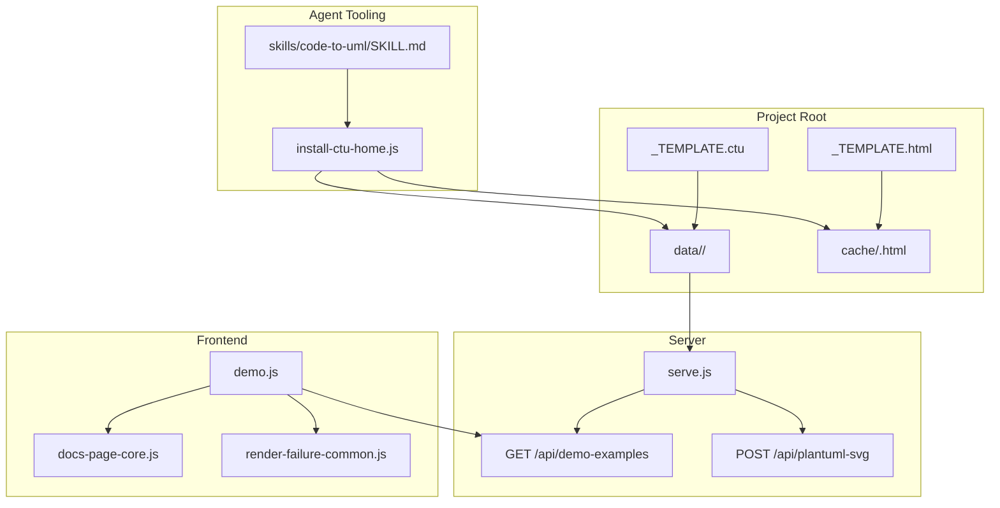
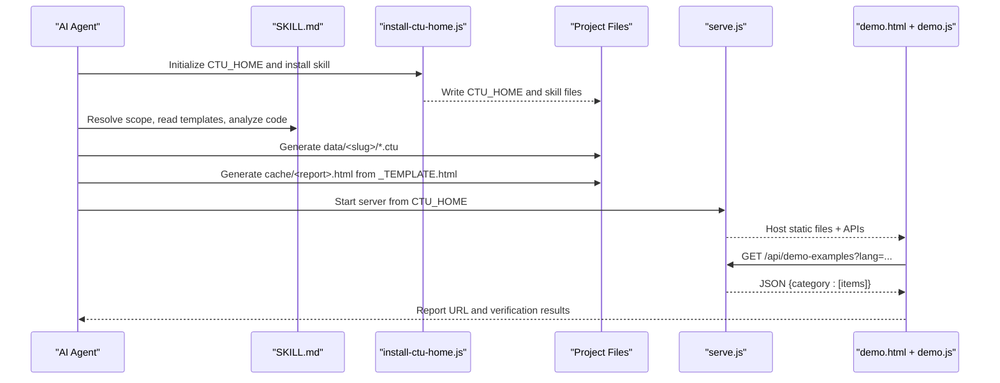
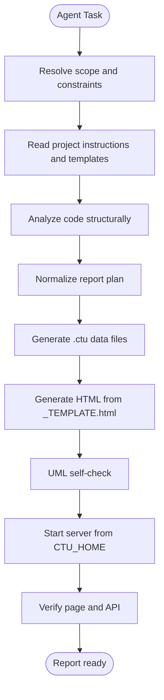
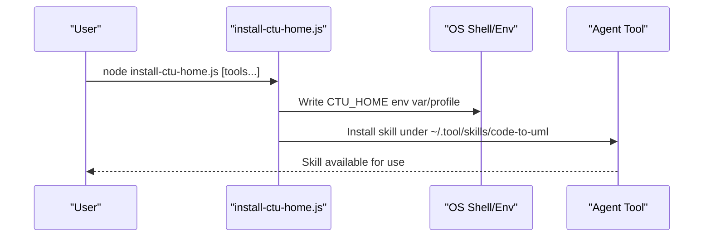
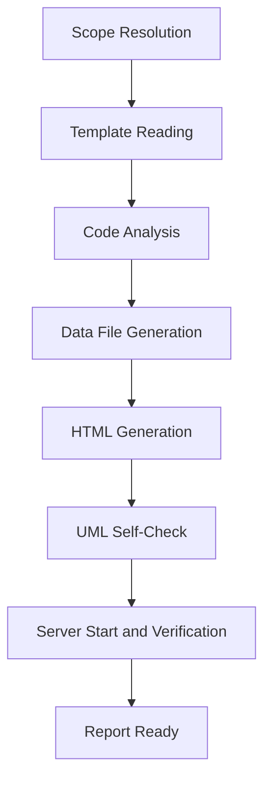
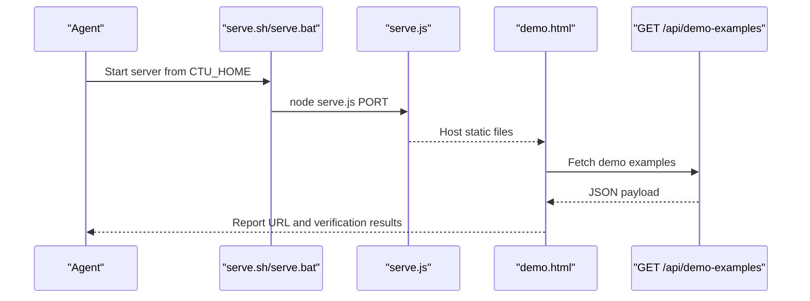
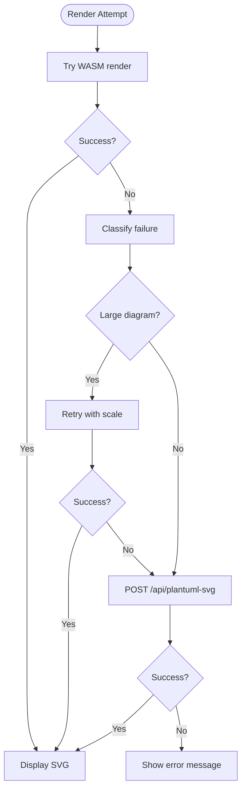
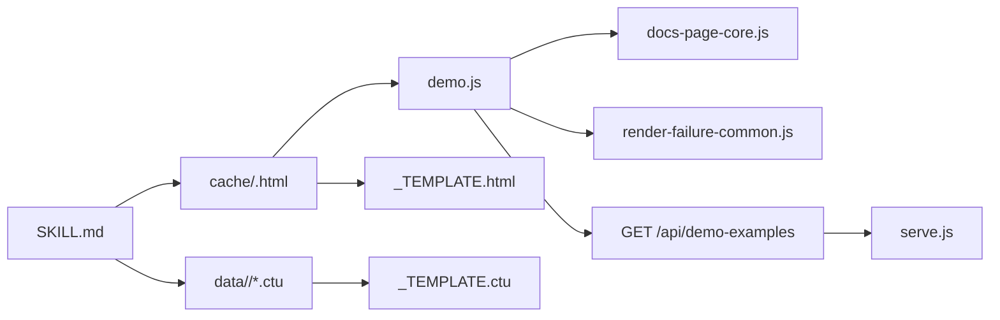

# Workflow Automation

<cite>
**Referenced Files in This Document**
- [README.md](file://README.md)
- [AGENTS.md](file://AGENTS.md)
- [CLAUDE.md](file://CLAUDE.md)
- [SKILL.md](file://skills/code-to-uml/SKILL.md)
- [_TEMPLATE.html](file://cache/_TEMPLATE.html)
- [_TEMPLATE.ctu](file://data/_TEMPLATE.ctu)
- [install-ctu-home.js](file://install-ctu-home.js)
- [serve.js](file://serve.js)
- [serve.sh](file://serve.sh)
- [serve.bat](file://serve.bat)
- [demo.js](file://demo.js)
- [docs-page-core.js](file://component/docs-page-core.js)
- [render-failure-common.js](file://component/render-failure-common.js)
- [cache-html-api.test.js](file://test/cache-html-api.test.js)
- [install-ctu-home.test.js](file://test/install-ctu-home.test.js)
</cite>

## Table of Contents
1. [Introduction](#introduction)
2. [Project Structure](#project-structure)
3. [Core Components](#core-components)
4. [Architecture Overview](#architecture-overview)
5. [Detailed Component Analysis](#detailed-component-analysis)
6. [Dependency Analysis](#dependency-analysis)
7. [Performance Considerations](#performance-considerations)
8. [Troubleshooting Guide](#troubleshooting-guide)
9. [Conclusion](#conclusion)
10. [Appendices](#appendices)

## Introduction
This document explains the automated workflow from code analysis to report generation in Code-To-UML, with emphasis on:
- How AI agents integrate with the pipeline via the bundled skill definition
- How CTU_HOME project initialization and environment setup enable automation
- The end-to-end automated report generation workflow: scope resolution, template reading, code analysis, data file generation, and HTML report creation
- Server startup and verification procedures
- Examples of automated workflows for different analysis scopes
- Error handling and recovery mechanisms
- Best practices for optimizing automated report generation performance

## Project Structure
Code-To-UML is a static frontend project that renders PlantUML diagrams in the browser and exposes a lightweight Node.js server for data loading and fallback rendering. Key elements:
- Frontend: HTML/CSS/JS with a SPA entry (demo.html) and modular components
- Data model: .ctu files under data/<report-slug> define report sections and diagrams
- Templates: cache/_TEMPLATE.html and data/_TEMPLATE.ctu define structure and conventions
- Server: serve.js provides static hosting and APIs for demo examples and fallback rendering
- Agent skill: skills/code-to-uml/SKILL.md defines the automated workflow for AI agents
- Environment: install-ctu-home.js sets CTU_HOME and installs the skill into agent toolchains

**Diagram sources**
- [SKILL.md](file://skills/code-to-uml/SKILL.md)
- [install-ctu-home.js](file://install-ctu-home.js)
- [_TEMPLATE.html](file://cache/_TEMPLATE.html)
- [_TEMPLATE.ctu](file://data/_TEMPLATE.ctu)
- [serve.js](file://serve.js)
- [demo.js](file://demo.js)
- [docs-page-core.js](file://component/docs-page-core.js)
- [render-failure-common.js](file://component/render-failure-common.js)

**Section sources**
- [README.md:166-198](file://README.md#L166-L198)
- [AGENTS.md:3-12](file://AGENTS.md#L3-L12)

## Core Components
- AI Agent Skill (SKILL.md): Defines the automated workflow, scope constraints, template reuse, data generation, HTML generation, UML self-check, and server verification steps. It also prescribes how to resolve CTU_HOME and start the server.
- CTU_HOME Initialization (install-ctu-home.js): Sets the project root as CTU_HOME, installs the skill into agent tool directories, and writes shell profile entries on Unix-like systems or environment variables on Windows.
- Server (serve.js): Provides static file hosting, parses .ctu files into JSON for the demo viewer, and exposes fallback rendering via plantuml.jar.
- Frontend (demo.js, docs-page-core.js, render-failure-common.js): Loads data from the server, orchestrates rendering with a WASM-first strategy, and falls back to the server when needed.
- Templates (_TEMPLATE.html, _TEMPLATE.ctu): Define the report structure, tab navigation, and .ctu data format.

**Section sources**
- [SKILL.md:30-94](file://skills/code-to-uml/SKILL.md#L30-L94)
- [install-ctu-home.js:204-220](file://install-ctu-home.js#L204-L220)
- [serve.js:454-561](file://serve.js#L454-L561)
- [demo.js:146-172](file://demo.js#L146-L172)
- [_TEMPLATE.html:13-91](file://cache/_TEMPLATE.html#L13-L91)
- [_TEMPLATE.ctu:1-46](file://data/_TEMPLATE.ctu#L1-L46)

## Architecture Overview
The automated pipeline integrates AI agents with the Code-To-UML runtime:
- Agent resolves scope and constraints, reads templates, analyzes code, generates .ctu data, creates HTML, validates UML, starts the server, and verifies the report.
- The server parses .ctu files and serves them as JSON to the frontend.
- The frontend renders diagrams using PlantUML WASM with automatic fallback to the server when needed.

**Diagram sources**
- [SKILL.md:30-94](file://skills/code-to-uml/SKILL.md#L30-L94)
- [install-ctu-home.js:204-220](file://install-ctu-home.js#L204-L220)
- [serve.js:459-469](file://serve.js#L459-L469)
- [demo.js:174-185](file://demo.js#L174-L185)

## Detailed Component Analysis

### AI Agent Integration and Automated Workflow
The agent workflow is defined in the skill:
- Scope and constraints: target type (project/module/file/class/function), output path, language, read-only constraints, template requirements
- Template reading: read CTU_HOME cache and data templates, and inspect nearby generated pages for runtime behavior
- Code analysis: structural analysis using available tools, file reads, and targeted exploration by scope
- Data generation: create data/<report-slug>/ with category-based .ctu files following the template format
- HTML generation: copy _TEMPLATE.html into cache/<report>.html, configure tabs and data-dir, preserve required scripts and relative paths
- UML self-check: validate PlantUML syntax and render with local renderer/JAR when available
- Server start and verification: start serve.sh/serve.bat from CTU_HOME, verify HTTP 200, API responses, navigation, and read-only constraints

**Diagram sources**
- [SKILL.md:30-94](file://skills/code-to-uml/SKILL.md#L30-L94)

**Section sources**
- [SKILL.md:8-29](file://skills/code-to-uml/SKILL.md#L8-L29)
- [SKILL.md:30-94](file://skills/code-to-uml/SKILL.md#L30-L94)

### CTU_HOME Project Initialization and Environment Setup
- install-ctu-home.js sets CTU_HOME to the project root and installs the bundled skill into agent tool directories. It supports multiple tools and writes shell profiles or Windows environment variables.
- The skill prescribes resolving CTU_HOME first, and if unset, instructs to run the install script.

**Diagram sources**
- [install-ctu-home.js:204-220](file://install-ctu-home.js#L204-L220)
- [SKILL.md:14-17](file://skills/code-to-uml/SKILL.md#L14-L17)

**Section sources**
- [install-ctu-home.js:27-77](file://install-ctu-home.js#L27-L77)
- [install-ctu-home.js:150-202](file://install-ctu-home.js#L150-L202)
- [SKILL.md:14-17](file://skills/code-to-uml/SKILL.md#L14-L17)

### Automated Report Generation Workflow
- Scope resolution: project/module/file/class/function with language defaults and read-only constraints
- Template reading: load _TEMPLATE.html and _TEMPLATE.ctu, plus nearby generated pages for runtime behavior
- Code analysis: structural mapping and evidence collection tailored to the scope
- Data file generation: create data/<report-slug>/ with stable categories and .ctu format
- HTML generation: populate cache/<report>.html with tabs, data-dir, and script dependencies
- UML self-check: static validation and optional render verification
- Server start and verification: start serve.sh/serve.bat, verify HTTP 200, API, navigation, and read-only constraints

**Diagram sources**
- [SKILL.md:30-94](file://skills/code-to-uml/SKILL.md#L30-L94)
- [_TEMPLATE.html:13-91](file://cache/_TEMPLATE.html#L13-L91)
- [_TEMPLATE.ctu:1-46](file://data/_TEMPLATE.ctu#L1-L46)

**Section sources**
- [SKILL.md:30-94](file://skills/code-to-uml/SKILL.md#L30-L94)
- [_TEMPLATE.html:13-91](file://cache/_TEMPLATE.html#L13-L91)
- [_TEMPLATE.ctu:1-46](file://data/_TEMPLATE.ctu#L1-L46)

### Server Startup and Verification
- The server is started from CTU_HOME using serve.sh (macOS/Linux) or serve.bat (Windows). These scripts handle port cleanup and logging.
- The frontend loads data from GET /api/demo-examples and renders diagrams using PlantUML WASM with automatic fallback to POST /api/plantuml-svg.

**Diagram sources**
- [serve.sh:35-53](file://serve.sh#L35-L53)
- [serve.bat:10-32](file://serve.bat#L10-L32)
- [serve.js:459-469](file://serve.js#L459-L469)
- [demo.js:174-185](file://demo.js#L174-L185)

**Section sources**
- [SKILL.md:84-94](file://skills/code-to-uml/SKILL.md#L84-L94)
- [serve.sh:35-53](file://serve.sh#L35-L53)
- [serve.bat:10-32](file://serve.bat#L10-L32)
- [serve.js:459-469](file://serve.js#L459-L469)
- [demo.js:174-185](file://demo.js#L174-L185)

### Error Handling and Recovery Mechanisms
- Frontend rendering pipeline:
  - WASM-first rendering with a render queue and controlled retries
  - Automatic fallback to POST /api/plantuml-svg when browser rendering fails
  - Large diagram scaling retry and error classification
- Server endpoints:
  - Robust error responses for invalid requests, traversal attempts, and failures
  - Clear HTTP error messages for jar fallback issues
- Tests validate server startup, API responses, and deletion semantics.

**Diagram sources**
- [render-failure-common.js:160-237](file://component/render-failure-common.js#L160-L237)
- [docs-page-core.js:293-355](file://component/docs-page-core.js#L293-L355)
- [docs-page-core.js:404-433](file://component/docs-page-core.js#L404-L433)
- [serve.js:498-540](file://serve.js#L498-L540)

**Section sources**
- [render-failure-common.js:160-237](file://component/render-failure-common.js#L160-L237)
- [docs-page-core.js:293-355](file://component/docs-page-core.js#L293-L355)
- [docs-page-core.js:377-402](file://component/docs-page-core.js#L377-L402)
- [serve.js:498-540](file://serve.js#L498-L540)

### Examples of Automated Workflows for Different Analysis Scopes
- Project scope: map subsystems, entry points, dependencies, and runtime processes; include architecture layers and cross-module dependencies
- Module/package scope: public API, internal files, dependency direction, state ownership, and extension points
- File scope: top-level layout, contained classes/functions, globals, side effects at import time, and primary runtime path
- Class scope: constructor/state, public methods, invariants, lifecycle, collaborators, and subclass/consumer risks
- Function scope: signature, preconditions, algorithm, branches, exceptions/errors, side effects, callers/callees, and examples of correct/incorrect use

These examples align with the mandatory sections and depth guidelines defined in the skill.

**Section sources**
- [SKILL.md:113-122](file://skills/code-to-uml/SKILL.md#L113-L122)
- [SKILL.md:95-112](file://skills/code-to-uml/SKILL.md#L95-L112)

## Dependency Analysis
The pipeline depends on:
- Agent skill to orchestrate the workflow and enforce template reuse and constraints
- Server to parse .ctu files and serve JSON to the frontend
- Frontend components to render diagrams and manage UI state
- Templates to define structure and data conventions

**Diagram sources**
- [SKILL.md](file://skills/code-to-uml/SKILL.md)
- [serve.js](file://serve.js)
- [demo.js](file://demo.js)
- [_TEMPLATE.html](file://cache/_TEMPLATE.html)
- [_TEMPLATE.ctu](file://data/_TEMPLATE.ctu)

**Section sources**
- [serve.js:459-469](file://serve.js#L459-L469)
- [demo.js:174-185](file://demo.js#L174-L185)

## Performance Considerations
- Prefer WASM rendering for most diagrams to avoid server round-trips
- Use the large diagram scaling retry path for oversized diagrams
- Minimize unnecessary re-renders by batching UI updates and using the render queue
- Keep .ctu files well-formed and avoid excessive diagram complexity per example
- Start the server once and reuse it for multiple report generations

[No sources needed since this section provides general guidance]

## Troubleshooting Guide
- Server startup failures: verify port availability and logs; use serve.sh/serve.bat port cleanup
- Jar fallback errors: ensure Java is installed and available on PATH; confirm POST /api/plantuml-svg is reachable
- Path traversal and deletion errors: the server rejects attempts outside cache/ and protects _TEMPLATE.html
- Template installation conflicts: the installer warns and avoids overwriting existing skills

**Section sources**
- [serve.sh:35-53](file://serve.sh#L35-L53)
- [serve.bat:10-32](file://serve.bat#L10-L32)
- [docs-page-core.js:377-402](file://component/docs-page-core.js#L377-L402)
- [serve.js:498-540](file://serve.js#L498-L540)
- [cache-html-api.test.js:144-159](file://test/cache-html-api.test.js#L144-L159)
- [install-ctu-home.test.js:57-63](file://test/install-ctu-home.test.js#L57-L63)

## Conclusion
Code-To-UML’s automated workflow integrates AI agents with a robust server and frontend rendering pipeline. By resolving scope and constraints, reusing templates, generating structured .ctu data, and validating UML, agents can consistently produce interactive HTML reports. The CTU_HOME initialization and server verification steps ensure reliable automation across environments.

[No sources needed since this section summarizes without analyzing specific files]

## Appendices
- Agent guidelines and conventions are documented in AGENTS.md and CLAUDE.md
- The demo viewer architecture and component modules are described in CLAUDE.md

**Section sources**
- [AGENTS.md:14-46](file://AGENTS.md#L14-L46)
- [CLAUDE.md:23-100](file://CLAUDE.md#L23-L100)