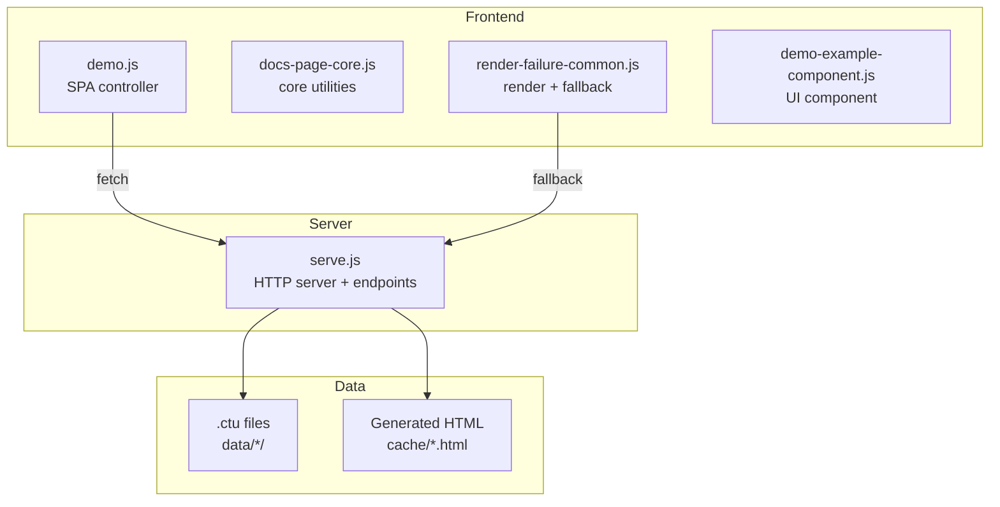
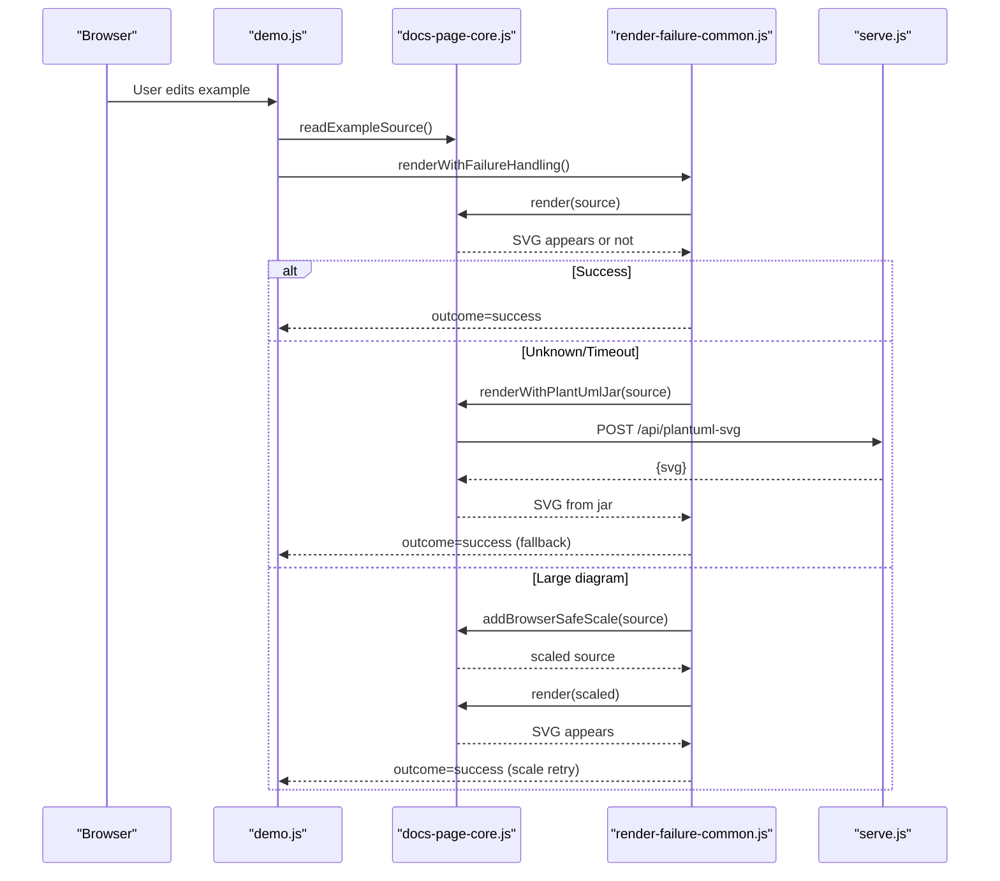
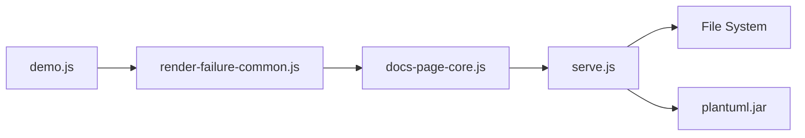

# API Reference

<cite>
**Referenced Files in This Document**
- [serve.js](file://serve.js)
- [demo.js](file://demo.js)
- [README.md](file://README.md)
- [cache/_TEMPLATE.html](file://cache/_TEMPLATE.html)
- [component/docs-page-core.js](file://component/docs-page-core.js)
- [component/render-failure-common.js](file://component/render-failure-common.js)
- [component/demo-example-component.js](file://component/demo-example-component.js)
- [test/cache-html-api.test.js](file://test/cache-html-api.test.js)
</cite>

## Table of Contents
1. [Introduction](#introduction)
2. [Project Structure](#project-structure)
3. [Core Components](#core-components)
4. [Architecture Overview](#architecture-overview)
5. [Detailed Component Analysis](#detailed-component-analysis)
6. [Dependency Analysis](#dependency-analysis)
7. [Performance Considerations](#performance-considerations)
8. [Troubleshooting Guide](#troubleshooting-guide)
9. [Conclusion](#conclusion)
10. [Appendices](#appendices)

## Introduction
This document describes the REST APIs and frontend APIs used by Code-To-UML. It covers:
- GET /api/demo-examples for loading diagram examples from .ctu data files
- POST /api/plantuml-svg for server-side PlantUML rendering fallback
- Cache management endpoints for listing and deleting generated HTML files
- Frontend API exposed through demo.js and related components
- Authentication, rate limiting, error responses, CORS, and security considerations
- Practical usage examples with curl and JavaScript fetch

## Project Structure
The server is implemented as a small Node.js HTTP server that serves static assets and exposes several JSON endpoints. The frontend is a vanilla JavaScript SPA that consumes these endpoints and renders PlantUML diagrams.

**Diagram sources**
- [serve.js:454-561](file://serve.js#L454-L561)
- [demo.js:174-185](file://demo.js#L174-L185)
- [component/render-failure-common.js:86-115](file://component/render-failure-common.js#L86-L115)

**Section sources**
- [serve.js:12-24](file://serve.js#L12-L24)
- [README.md:166-198](file://README.md#L166-L198)

## Core Components
- HTTP server with endpoints:
  - GET /api/demo-examples
  - POST /api/plantuml-svg
  - GET /api/cache-html
  - DELETE /api/cache-html
  - DELETE /api/cache-html/all
- Frontend SPA that:
  - Loads examples via GET /api/demo-examples
  - Renders diagrams client-side with plantuml.js
  - Falls back to server-side rendering via POST /api/plantuml-svg when needed
- Cache management utilities for listing and deleting generated HTML files

**Section sources**
- [serve.js:459-540](file://serve.js#L459-L540)
- [demo.js:174-185](file://demo.js#L174-L185)
- [component/render-failure-common.js:160-237](file://component/render-failure-common.js#L160-L237)

## Architecture Overview
The rendering pipeline uses a two-tier strategy:
- Primary: browser rendering via plantuml.js (WASM)
- Fallback: server-side rendering via plantuml.jar (POST /api/plantuml-svg)

**Diagram sources**
- [demo.js:374-439](file://demo.js#L374-L439)
- [component/render-failure-common.js:160-237](file://component/render-failure-common.js#L160-L237)
- [component/docs-page-core.js:404-433](file://component/docs-page-core.js#L404-L433)
- [serve.js:472-496](file://serve.js#L472-L496)

## Detailed Component Analysis

### GET /api/demo-examples
- Purpose: Load diagram examples from .ctu data files for the demo viewer.
- Method: GET
- Path: /api/demo-examples
- Query parameters:
  - lang (optional): "en" or "zh"; defaults to "zh"
  - dir (optional): data subdirectory name; defaults to "demo"
- Response format: JSON object keyed by diagram category (e.g., "sequence", "use-case").
  - Each value is an array of example items with fields:
    - id: integer
    - titleI18n: object with "zh" and/or "en" keys
    - descriptionI18n: object with "zh" and/or "en" keys
    - detailI18n: object with "zh" and/or "en" keys
    - sectionTitleI18n: object with "zh" and/or "en" keys
    - sectionDescriptionI18n: object with "zh" and/or "en" keys
    - title: localized title
    - description: localized description
    - sectionTitle: localized section title
    - sectionDescription: localized section description
    - detail: localized detail text
    - source: PlantUML source text
- Error responses:
  - 500: JSON with error field containing message

Practical usage:
- curl
  - curl "http://localhost:5401/api/demo-examples?lang=en&dir=demo"
- JavaScript (fetch)
  - fetch("/api/demo-examples?lang=zh&dir=demo", { cache: "no-store" })

Notes:
- The server reads .ctu files from data/{dir}/ and parses them into the response structure.
- Language selection follows zh/en precedence based on lang parameter.

**Section sources**
- [serve.js:459-470](file://serve.js#L459-L470)
- [serve.js:304-395](file://serve.js#L304-L395)
- [demo.js:174-185](file://demo.js#L174-L185)
- [README.md:204-213](file://README.md#L204-L213)

### POST /api/plantuml-svg
- Purpose: Server-side PlantUML rendering fallback when browser rendering fails or is unsuitable.
- Method: POST
- Path: /api/plantuml-svg
- Request body:
  - Content-Type: application/json
  - Body: { source: "<PlantUML source text>" }
- Response:
  - 200 OK: JSON { svg: "<SVG markup>" }
  - 400 Bad Request: JSON { error: "..." } when JSON is invalid or source is missing
  - 500 Internal Server Error: JSON { error: "..." } when rendering fails
- Behavior:
  - The server spawns plantuml.jar with --svg -pipe and returns the SVG output.
  - Rejects non-SVG output and errors from the process.

Practical usage:
- curl
  - curl -X POST "http://localhost:5401/api/plantuml-svg" -H "Content-Type: application/json" -d '{"source":"@startuml\nAlice->Bob: Hello\n@enduml"}'
- JavaScript (fetch)
  - const resp = await fetch("/api/plantuml-svg", { method: "POST", headers: {"Content-Type":"application/json"}, body: JSON.stringify({source}) });

Security and CORS:
- The fallback requires the page to be served over HTTP (not file://) because browsers restrict fetch to localhost for security.
- For development, start the server with ./serve.sh or node serve.js and open http://localhost:5401.

**Section sources**
- [serve.js:472-496](file://serve.js#L472-L496)
- [serve.js:56-88](file://serve.js#L56-L88)
- [component/render-failure-common.js:86-115](file://component/render-failure-common.js#L86-L115)
- [component/docs-page-core.js:404-433](file://component/docs-page-core.js#L404-L433)

### Cache Management Endpoints
- GET /api/cache-html
  - Lists all generated HTML files under cache/ except _TEMPLATE.html.
  - Response: JSON { files: [{ name, path, href, size, modifiedMs }, ...] }
- DELETE /api/cache-html
  - Deletes a specific cache HTML file and its matching data directory if present.
  - Request body: { path: "cache/..." }
  - Response: JSON { cachePath, dataDir }
  - Errors:
    - 400: Invalid path or attempt to delete _TEMPLATE.html
    - 500: Other filesystem errors
- DELETE /api/cache-html/all
  - Clears all generated HTML files and non-demo data directories.
  - Response: JSON { deletedHtml: [...], deletedDataDirs: [...] }

Practical usage:
- curl
  - List: curl -X GET "http://localhost:5401/api/cache-html"
  - Delete one: curl -X DELETE "http://localhost:5401/api/cache-html" -H "Content-Type: application/json" -d '{"path":"cache/demo.html"}'
  - Clear all: curl -X DELETE "http://localhost:5401/api/cache-html/all"

Validation and safety:
- Path validation prevents directory traversal and protects _TEMPLATE.html.
- Deleting a cache HTML file also removes its associated data directory.

**Section sources**
- [serve.js:498-540](file://serve.js#L498-L540)
- [serve.js:217-302](file://serve.js#L217-L302)
- [test/cache-html-api.test.js:116-170](file://test/cache-html-api.test.js#L116-L170)

### Frontend API Exposed Through demo.js
- API surface:
  - Global window.PlantUmlDemoExample
    - createExampleNode(options): creates DOM nodes for example cards
    - applyExampleLocale(wrapper, item, index, mode): applies i18n
    - renderMarkdown(text): renders markdown for details
  - Global window.PlantUmlDocsCore
    - readExampleSource(example)
    - splitPlantUmlLines(source)
    - addBrowserSafeScale(source, maxHeight?)
    - ensurePreviewId(example, index)
    - buildDownloadName(example, index)
    - setExampleMessage(example, message, state)
    - clearExampleMessage(example)
    - detectPreviewError(preview)
    - isPreviewErrorSvg(preview)
    - isPlantUmlRuntimeFailureMessage(message, source?)
    - createRuntimeErrorBuffer(options)
    - evaluateRenderOutcome(preview, options)
    - renderWithPlantUmlJar(source, endpoint?)
    - setPreviewSvg(preview, svgMarkup)
  - Global window.PlantUmlRenderFailureCommon
    - wait(ms)
    - describeRenderOutcome(outcome)
    - evaluateRenderOutcomeWithSignals(preview, options)
    - waitForSvg(preview, options)
    - requestJarFallbackSvg(source, options)
    - applyFallbackSvg(preview, svgMarkup)
    - renderWithFailureHandling(options)

- Event system:
  - docs:langchange: fired when language changes; triggers re-fetch of examples and re-rendering.

- Example usage patterns:
  - Loading examples: fetch("/api/demo-examples?lang=...&dir=...", { cache: "no-store" })
  - Rendering: renderWithFailureHandling({ preview, source, render, previewId, errorBuffer })
  - Actions: copy-source, copy-svg, download-svg

**Section sources**
- [demo.js:109-111](file://demo.js#L109-L111)
- [demo.js:131-144](file://demo.js#L131-L144)
- [demo.js:174-185](file://demo.js#L174-L185)
- [demo.js:353-372](file://demo.js#L353-L372)
- [demo.js:449-483](file://demo.js#L449-L483)
- [component/demo-example-component.js:82-155](file://component/demo-example-component.js#L82-L155)
- [component/docs-page-core.js:447-463](file://component/docs-page-core.js#L447-L463)
- [component/render-failure-common.js:239-247](file://component/render-failure-common.js#L239-L247)

## Dependency Analysis
- Server endpoints depend on:
  - File system for .ctu data and cache HTML
  - Java runtime for plantuml.jar fallback
- Frontend depends on:
  - Global modules exposed by component scripts
  - Browser fetch and DOM APIs
- Rendering pipeline:
  - demo.js -> render-failure-common.js -> docs-page-core.js -> serve.js

**Diagram sources**
- [demo.js:374-439](file://demo.js#L374-L439)
- [component/render-failure-common.js:160-237](file://component/render-failure-common.js#L160-L237)
- [component/docs-page-core.js:404-433](file://component/docs-page-core.js#L404-L433)
- [serve.js:56-88](file://serve.js#L56-L88)

**Section sources**
- [serve.js:454-561](file://serve.js#L454-L561)
- [demo.js:174-185](file://demo.js#L174-L185)

## Performance Considerations
- Browser-first rendering avoids server round-trips for typical diagrams.
- Large diagrams may trigger fallback scaling or server-side rendering; consider simplifying complex diagrams or adding scale directives.
- Cache management endpoints help reduce repeated generation overhead by clearing stale HTML and data directories.

[No sources needed since this section provides general guidance]

## Troubleshooting Guide
- GET /api/demo-examples returns 500:
  - Check data directory structure and .ctu file validity.
- POST /api/plantuml-svg returns 400 or 500:
  - Ensure request body is valid JSON with a non-empty source field.
  - Verify Java is installed and plantuml.jar is executable.
- Jar fallback fails with HTTP 404 or 501:
  - Confirm the server is running locally and reachable at the configured endpoint.
- Large diagrams fail in browser:
  - The system attempts a scale-based retry; if still failing, rely on jar fallback.
- CORS and security:
  - Do not access the page via file://; use a local HTTP server.

**Section sources**
- [serve.js:465-468](file://serve.js#L465-L468)
- [serve.js:477-494](file://serve.js#L477-L494)
- [component/docs-page-core.js:377-402](file://component/docs-page-core.js#L377-L402)
- [component/render-failure-common.js:86-115](file://component/render-failure-common.js#L86-L115)

## Conclusion
Code-To-UML provides a straightforward API for loading examples, rendering diagrams, and managing generated cache files. The frontend integrates seamlessly with these endpoints and offers robust fallback behavior for edge cases.

[No sources needed since this section summarizes without analyzing specific files]

## Appendices

### Authentication and Rate Limiting
- Authentication: None for local development.
- Rate limiting: Not implemented in the server; consider deploying behind a reverse proxy with rate limiting if needed.

**Section sources**
- [serve.js:454-561](file://serve.js#L454-L561)

### CORS Configuration (Development)
- The server does not set explicit CORS headers.
- For development, run the server locally and access via http://localhost:5401 to avoid cross-origin restrictions.

**Section sources**
- [serve.js:454-561](file://serve.js#L454-L561)

### Security Considerations (Production)
- Restrict access to cache management endpoints to trusted users.
- Validate and sanitize inputs for plantuml.jar fallback to prevent command injection.
- Run the server behind HTTPS and a reverse proxy with appropriate security headers.

**Section sources**
- [serve.js:193-215](file://serve.js#L193-L215)
- [serve.js:56-88](file://serve.js#L56-L88)

### Example Requests and Responses

- GET /api/demo-examples
  - Request: GET /api/demo-examples?lang=en&dir=demo
  - Response: JSON object with diagram categories and example arrays
  - Status: 200

- POST /api/plantuml-svg
  - Request: POST /api/plantuml-svg with JSON body { "source": "<PlantUML code>" }
  - Response: JSON { "svg": "<SVG markup>" }
  - Status: 200 or 400/500 on error

- GET /api/cache-html
  - Request: GET /api/cache-html
  - Response: JSON { "files": [...] }
  - Status: 200

- DELETE /api/cache-html
  - Request: DELETE /api/cache-html with JSON body { "path": "cache/..." }
  - Response: JSON { "cachePath": "...", "dataDir": "..." }
  - Status: 200 or 400/500 on error

- DELETE /api/cache-html/all
  - Request: DELETE /api/cache-html/all
  - Response: JSON { "deletedHtml": [...], "deletedDataDirs": [...] }
  - Status: 200

**Section sources**
- [serve.js:459-540](file://serve.js#L459-L540)
- [test/cache-html-api.test.js:116-170](file://test/cache-html-api.test.js#L116-L170)