# Frontend JavaScript APIs

<cite>
**Referenced Files in This Document**
- [demo.js](file://demo.js)
- [docs-page-core.js](file://component/docs-page-core.js)
- [toc-component.js](file://component/toc-component.js)
- [demo-example-component.js](file://component/demo-example-component.js)
- [render-failure-common.js](file://component/render-failure-common.js)
- [i18n-config.js](file://i18n-config.js)
- [en.js](file://i18n/en.js)
- [zh.js](file://i18n/zh.js)
- [demo.html](file://demo.html)
</cite>

## Table of Contents
1. [Introduction](#introduction)
2. [Project Structure](#project-structure)
3. [Core Components](#core-components)
4. [Architecture Overview](#architecture-overview)
5. [Detailed Component Analysis](#detailed-component-analysis)
6. [Dependency Analysis](#dependency-analysis)
7. [Performance Considerations](#performance-considerations)
8. [Troubleshooting Guide](#troubleshooting-guide)
9. [Conclusion](#conclusion)

## Introduction

This document provides comprehensive documentation for Code-To-UML's frontend JavaScript APIs and component interfaces. The system consists of five primary JavaScript modules that work together to render PlantUML diagrams in a web browser environment with robust error handling, internationalization support, and interactive features.

The frontend architecture follows a modular design pattern where each component has a specific responsibility:
- Application controller orchestrating the entire demo page
- Core utilities for diagram rendering and error detection
- Table of contents component for navigation
- Example component for individual diagram cards
- Render failure handling utilities

## Project Structure

The frontend JavaScript modules are organized in a clear hierarchical structure within the Code-To-UML project:

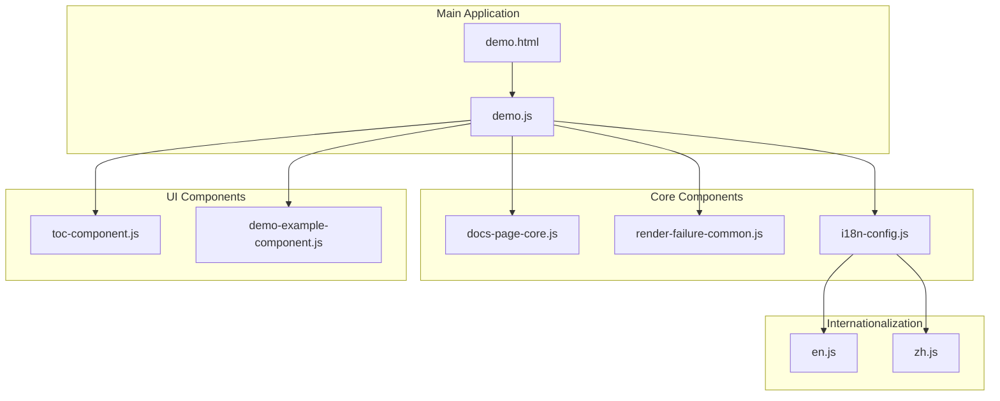

**Diagram sources**
- [demo.js:1-816](file://demo.js#L1-L816)
- [demo.html:1-116](file://demo.html#L1-L116)

**Section sources**
- [demo.html:1-116](file://demo.html#L1-L116)

## Core Components

### Application Controller (demo.js)

The main application controller serves as the central orchestrator for the demo page, managing initialization, rendering pipeline, and event handling mechanisms.

#### Initialization and Setup

The application initializes through a self-executing function that sets up global references to component libraries and performs essential bootstrapping:

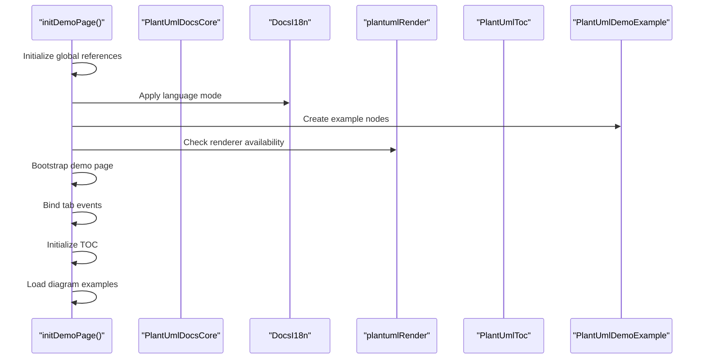

**Diagram sources**
- [demo.js:3-122](file://demo.js#L3-L122)

#### Rendering Pipeline Orchestration

The rendering system implements a sophisticated queue-based approach to manage diagram rendering with proper error handling and fallback mechanisms:

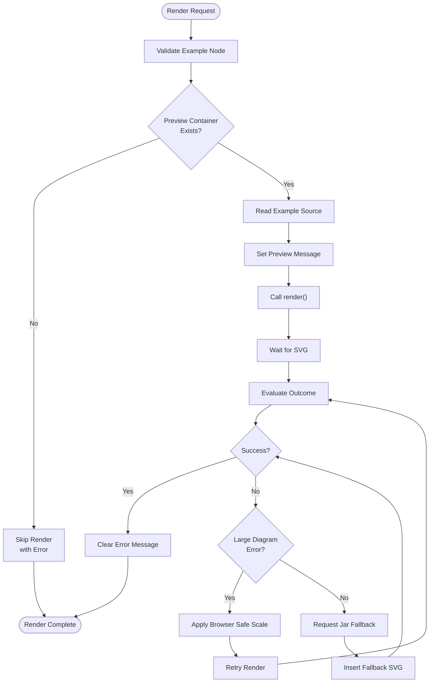

**Diagram sources**
- [demo.js:374-439](file://demo.js#L374-L439)
- [render-failure-common.js:160-237](file://component/render-failure-common.js#L160-L237)

#### Event Handling Mechanisms

The application implements comprehensive event handling for various user interactions:

| Event Type | Handler | Purpose |
|------------|---------|---------|
| `docs:langchange` | Language switching | Updates UI text and reloads examples |
| `click` on tabs | Tab switching | Navigates between diagram types |
| `input` on textarea | Source editing | Triggers delayed re-rendering |
| `click` on action buttons | Action execution | Copy, download, or other operations |
| `scroll` | TOC synchronization | Updates active navigation items |

**Section sources**
- [demo.js:124-144](file://demo.js#L124-L144)
- [demo.js:187-193](file://demo.js#L187-L193)
- [demo.js:347-351](file://demo.js#L347-L351)

### Core Utilities (docs-page-core.js)

The core utilities module provides fundamental functions for diagram processing, error detection, and DOM manipulation.

#### Key Functions

| Function | Parameters | Return Value | Description |
|----------|------------|--------------|-------------|
| `readExampleSource` | `example` | `string` | Extracts PlantUML source code from example containers |
| `splitPlantUmlLines` | `source` | `string[]` | Splits source into individual lines |
| `addBrowserSafeScale` | `source, maxHeight` | `string` | Adds scaling directive for large diagrams |
| `ensurePreviewId` | `example, index` | `string|null` | Ensures unique preview element ID |
| `buildDownloadName` | `example, index` | `string` | Generates downloadable filename |
| `setExampleMessage` | `example, message, state` | `void` | Sets status message for examples |
| `detectPreviewError` | `preview` | `string` | Detects rendering errors in SVG output |
| `createRuntimeErrorBuffer` | `options` | `object` | Creates error buffer for runtime monitoring |

#### Error Detection Logic

The error detection system identifies various types of rendering failures:

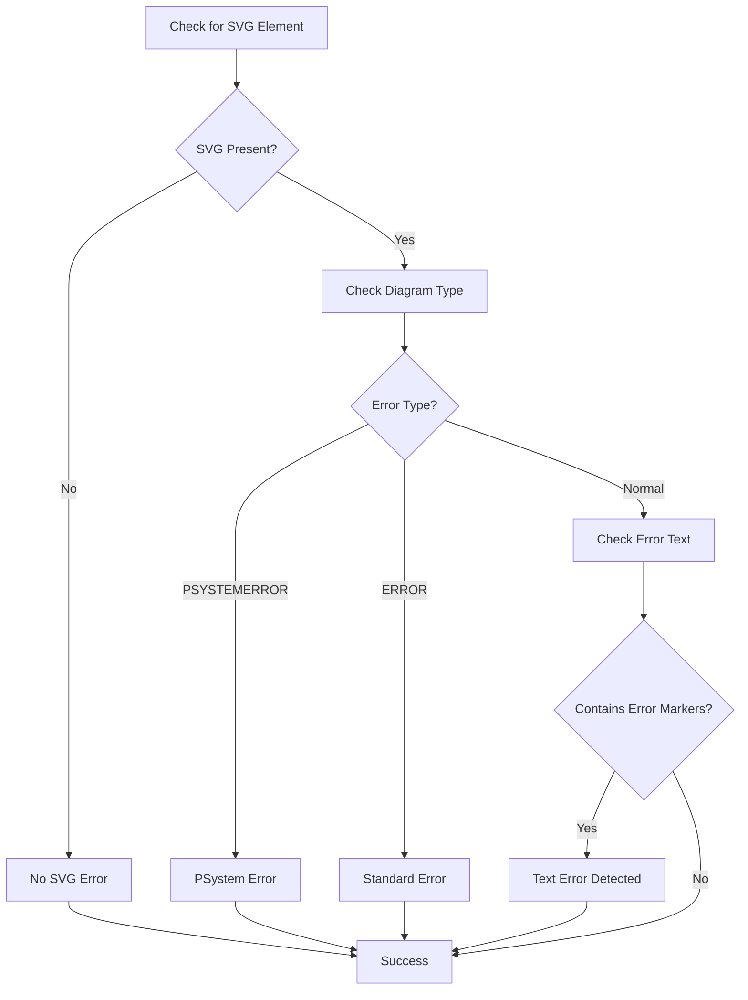

**Diagram sources**
- [docs-page-core.js:77-130](file://component/docs-page-core.js#L77-L130)

**Section sources**
- [docs-page-core.js:1-464](file://component/docs-page-core.js#L1-L464)

### Table of Contents Component (toc-component.js)

The TOC component provides navigation functionality with automatic synchronization and interactive features.

#### API Methods

| Method | Parameters | Return Value | Description |
|--------|------------|--------------|-------------|
| `render` | `options` | `void` | Renders navigation structure |
| `setActive` | `container, href` | `void` | Sets active navigation item |

#### Options Structure

The `render` method accepts an options object with the following properties:

| Property | Type | Required | Description |
|----------|------|----------|-------------|
| `sideContainer` | `Element` | Yes | Container for desktop TOC |
| `mobileContainer` | `Element` | No | Container for mobile TOC |
| `titleText` | `string` | No | TOC title text |
| `titleLink` | `object` | No | Title link configuration |
| `items` | `Array<object>` | Yes | Navigation items |

#### Item Configuration

Each navigation item supports the following structure:

| Property | Type | Required | Description |
|----------|------|----------|-------------|
| `label` | `string` | Yes | Display text |
| `href` | `string` | Yes | Target URL/hash |
| `level` | `number` | No | Heading level (2-3) |
| `onClick` | `function` | No | Click handler callback |

**Section sources**
- [toc-component.js:21-83](file://component/toc-component.js#L21-L83)

### Demo Example Component (demo-example-component.js)

The example component manages individual diagram cards with interactive features and localization support.

#### API Methods

| Method | Parameters | Return Value | Description |
|--------|------------|--------------|-------------|
| `createExampleNode` | `options` | `Element` | Creates complete example card |
| `applyExampleLocale` | `wrapper, item, index, mode` | `void` | Applies localization to example |
| `renderMarkdown` | `text` | `string` | Renders markdown to HTML |

#### Example Node Structure

The `createExampleNode` method generates a complete example card with the following structure:

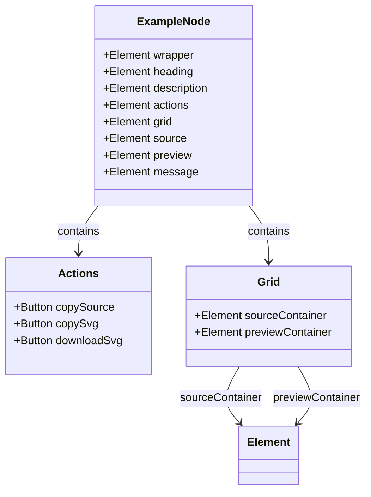

**Diagram sources**
- [demo-example-component.js:82-155](file://component/demo-example-component.js#L82-L155)

#### Event Handlers

The component supports two types of callbacks through the options parameter:

| Handler | Parameters | Trigger | Purpose |
|---------|------------|---------|---------|
| `onSourceInput` | `wrapper` | Textarea input | Handles source code changes |
| `onActionClick` | `wrapper, button` | Button click | Processes example actions |

**Section sources**
- [demo-example-component.js:82-155](file://component/demo-example-component.js#L82-L155)

### Render Failure Common (render-failure-common.js)

This module provides comprehensive error handling and fallback mechanisms for diagram rendering failures.

#### Core Functions

| Function | Parameters | Return Value | Description |
|----------|------------|--------------|-------------|
| `renderWithFailureHandling` | `options` | `Promise<object>` | Main rendering with error handling |
| `waitForSvg` | `preview, options` | `Promise<void>` | Waits for SVG rendering completion |
| `requestJarFallbackSvg` | `source, options` | `Promise<string>` | Requests fallback SVG from server |
| `evaluateRenderOutcomeWithSignals` | `preview, options` | `object` | Evaluates rendering outcome |

#### Error Handling Flow

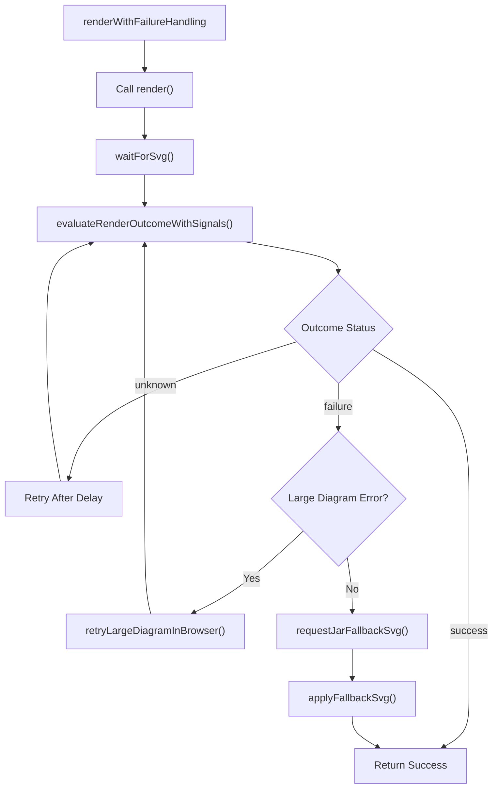

**Diagram sources**
- [render-failure-common.js:160-237](file://component/render-failure-common.js#L160-L237)

**Section sources**
- [render-failure-common.js:1-249](file://component/render-failure-common.js#L1-L249)

## Architecture Overview

The frontend architecture implements a layered design pattern with clear separation of concerns:

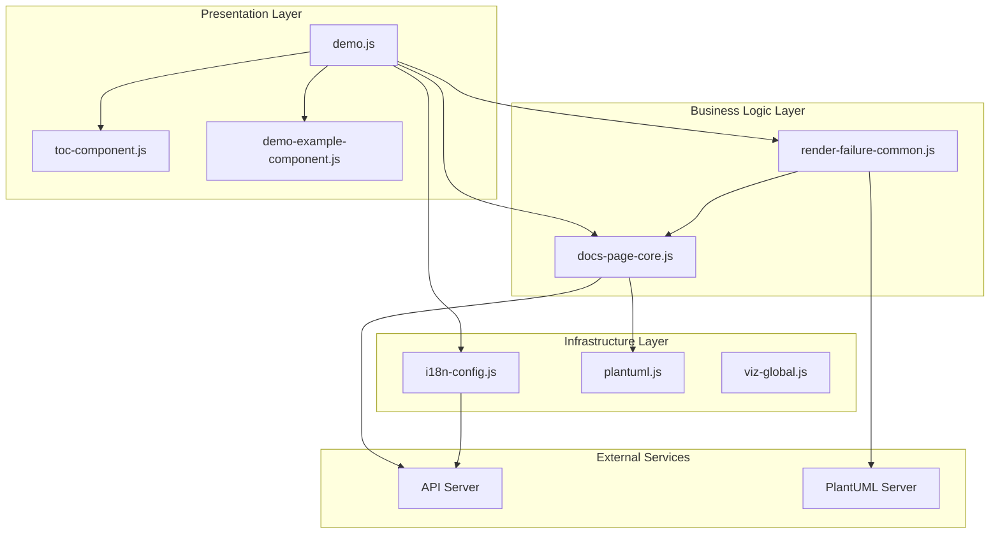

**Diagram sources**
- [demo.js:1-10](file://demo.js#L1-L10)
- [demo.html:79-89](file://demo.html#L79-L89)

### Component Integration Patterns

The components integrate through well-defined interfaces and event-driven communication:

1. **Event-Driven Communication**: Components communicate primarily through DOM events and custom events
2. **Shared State Management**: Global state is managed through the application controller
3. **Plugin Architecture**: Components expose APIs through global namespaces
4. **Error Propagation**: Errors are propagated through the rendering pipeline with appropriate handling

**Section sources**
- [demo.js:109-111](file://demo.js#L109-L111)
- [demo.js:124-129](file://demo.js#L124-L129)

## Detailed Component Analysis

### Application Controller Lifecycle

The demo application follows a structured lifecycle with clear initialization, rendering, and cleanup phases:

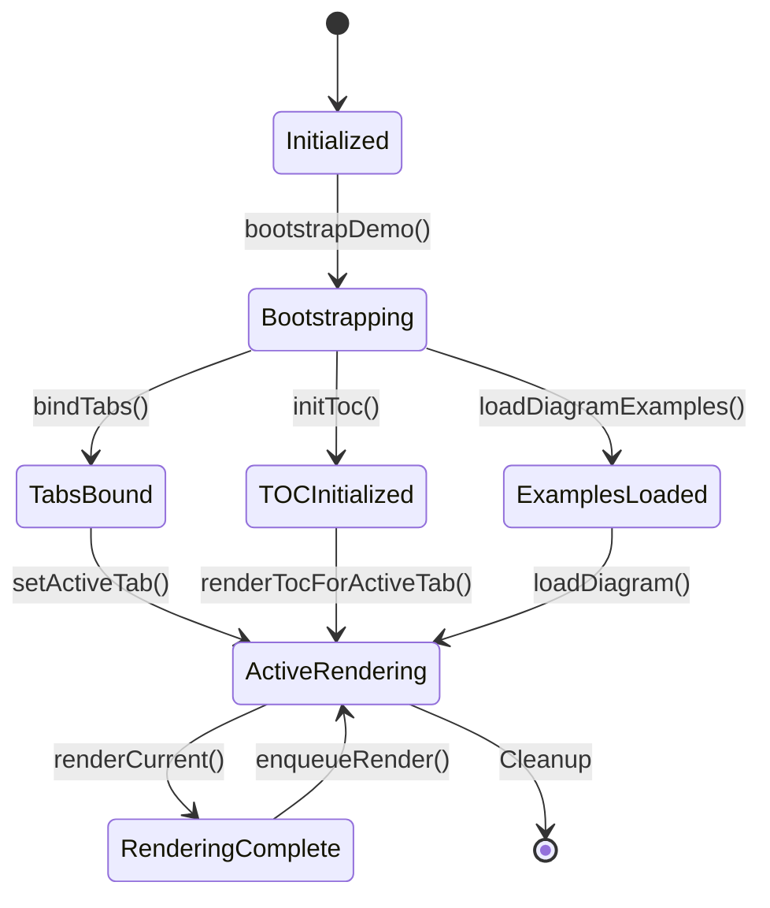

**Diagram sources**
- [demo.js:146-172](file://demo.js#L146-L172)
- [demo.js:237-287](file://demo.js#L237-L287)

#### Initialization Sequence

The initialization process follows a specific order to ensure proper setup:

1. **Global Reference Setup**: Establishes connections to component libraries
2. **Language Configuration**: Applies internationalization settings
3. **DOM Manipulation**: Initializes preview lightbox and error buffers
4. **Bootstrap Execution**: Loads diagram examples and sets up rendering pipeline
5. **Event Binding**: Attaches event listeners for user interactions

#### Rendering Pipeline

The rendering pipeline implements several advanced features:

- **Queue Management**: Uses Promise chains to serialize rendering operations
- **Generation Tracking**: Monitors rendering generations to prevent stale updates
- **Error Recovery**: Implements fallback mechanisms for failed renders
- **Performance Optimization**: Debounces user input to reduce unnecessary renders

**Section sources**
- [demo.js:23-29](file://demo.js#L23-L29)
- [demo.js:237-287](file://demo.js#L237-L287)

### Internationalization System

The internationalization system provides comprehensive language support with dynamic switching capabilities:

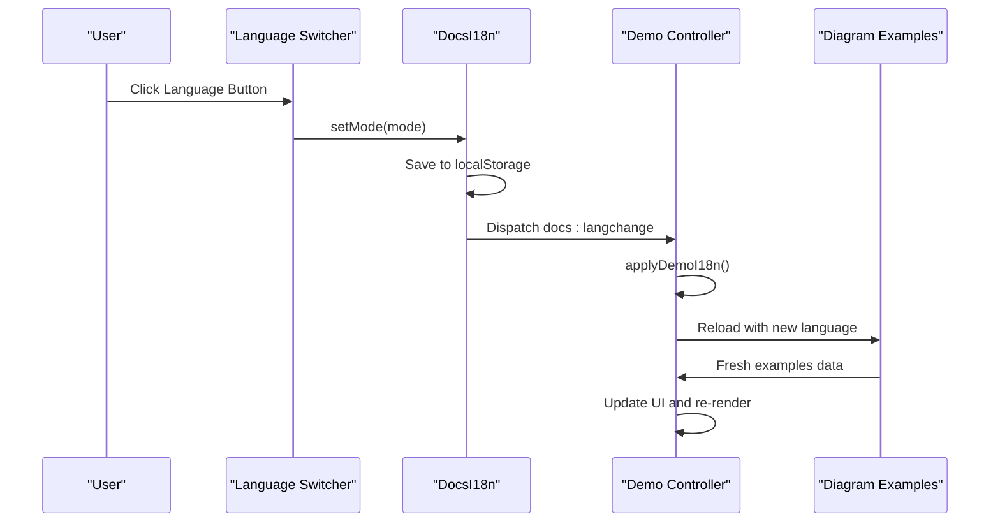

**Diagram sources**
- [i18n-config.js:48-54](file://i18n-config.js#L48-L54)
- [demo.js:131-144](file://demo.js#L131-L144)

#### Language Configuration

The system supports two languages with comprehensive translation coverage:

| Feature | English (en) | Chinese (zh) |
|---------|-------------|-------------|
| Page Title | "Code-To-UML Template" | "Code-To-UML 模板" |
| Intro Text | "Project/Code Overview." | "项目/代码概述。" |
| Diagram Labels | Full English names | Chinese translations |
| Action Buttons | English labels | Chinese translations |
| Error Messages | English error texts | Chinese error messages |

**Section sources**
- [en.js:5-48](file://i18n/en.js#L5-L48)
- [zh.js:5-48](file://i18n/zh.js#L5-L48)
- [i18n-config.js:7-10](file://i18n-config.js#L7-L10)

### Lightbox Implementation

The preview lightbox provides an interactive viewing experience for rendered diagrams:

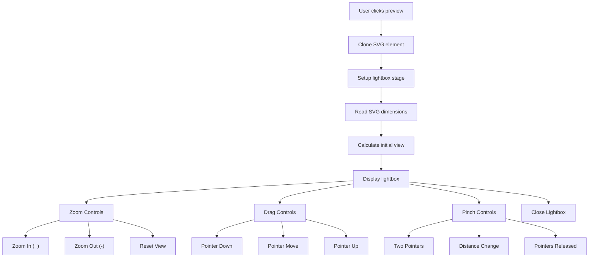

**Diagram sources**
- [demo.js:500-726](file://demo.js#L500-L726)

#### Interactive Features

The lightbox supports multiple interaction modes:

- **Mouse Wheel Zoom**: Smooth zooming with mouse wheel
- **Touch Gestures**: Pinch-to-zoom on touch devices
- **Drag Navigation**: Click-and-drag to pan around large diagrams
- **Keyboard Shortcuts**: Escape key to close, arrow keys for navigation
- **Responsive Design**: Automatically adjusts to viewport size

**Section sources**
- [demo.js:531-726](file://demo.js#L531-L726)

## Dependency Analysis

The frontend modules have well-defined dependencies that enable loose coupling and maintainable architecture:

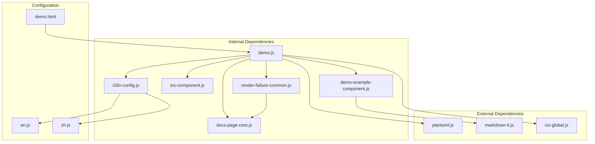

**Diagram sources**
- [demo.html:79-89](file://demo.html#L79-L89)
- [demo.js:1-10](file://demo.js#L1-L10)

### Component Coupling Analysis

| Component | Depends On | Provides | Cohesion |
|-----------|------------|----------|----------|
| demo.js | docs-page-core.js, render-failure-common.js, toc-component.js, demo-example-component.js, i18n-config.js | Application orchestration | High |
| docs-page-core.js | None | Core utilities | Very High |
| render-failure-common.js | docs-page-core.js | Error handling | High |
| toc-component.js | None | Navigation | Very High |
| demo-example-component.js | markdown-it.js | Example rendering | High |
| i18n-config.js | en.js, zh.js | Internationalization | Very High |

**Section sources**
- [demo.js:1-10](file://demo.js#L1-L10)
- [docs-page-core.js:1-11](file://component/docs-page-core.js#L1-L11)
- [render-failure-common.js:1-5](file://component/render-failure-common.js#L1-L5)

## Performance Considerations

The frontend implementation incorporates several performance optimization strategies:

### Rendering Optimization

1. **Render Queue Management**: Uses Promise chains to serialize rendering operations and prevent resource conflicts
2. **Debounced Input Handling**: Delays re-rendering after user input to reduce unnecessary computations
3. **Generation Tracking**: Prevents stale rendering updates by tracking render generations
4. **Lazy Loading**: Only renders visible examples, deferring others until needed

### Memory Management

1. **Event Listener Cleanup**: Properly removes event listeners during cleanup
2. **DOM Node Reuse**: Reuses DOM elements instead of creating new ones unnecessarily
3. **Resource Cleanup**: Disposes of render buffers and timers appropriately
4. **Image Optimization**: Uses SVG format for scalable vector graphics

### Network Optimization

1. **Cache Control**: Uses `cache: "no-store"` for demo examples to ensure fresh content
2. **Fallback Strategies**: Implements jar fallback for offline scenarios
3. **Error Caching**: Buffers runtime errors to prevent repeated failures

## Troubleshooting Guide

### Common Issues and Solutions

#### Diagram Rendering Failures

**Issue**: Diagrams fail to render in browser
**Solution**: The system automatically attempts to scale large diagrams and falls back to jar rendering

**Issue**: Large diagrams cause browser crashes
**Solution**: Automatic scaling with `addBrowserSafeScale` prevents rendering failures

#### Internationalization Problems

**Issue**: Language switching doesn't work
**Solution**: Verify localStorage has correct language setting and `docs:langchange` event dispatches properly

**Issue**: Missing translations
**Solution**: Check that dictionary files are loaded and keys exist in the translation objects

#### Lightbox Issues

**Issue**: Lightbox doesn't open or displays incorrectly
**Solution**: Verify SVG element exists and has proper dimensions; check pointer event handling

#### Performance Issues

**Issue**: Slow rendering or memory leaks
**Solution**: Monitor render queue length and ensure proper cleanup of event listeners

### Debug Information

The system provides comprehensive debug information through console logging:

- **Render Queue Status**: Tracks pending rendering operations
- **Error Buffer Content**: Shows recent runtime errors
- **Example Generation**: Monitors rendering generation numbers
- **DOM State**: Logs current active elements and states

**Section sources**
- [demo.js:347-351](file://demo.js#L347-L351)
- [docs-page-core.js:178-291](file://component/docs-page-core.js#L178-L291)
- [render-failure-common.js:160-237](file://component/render-failure-common.js#L160-L237)

## Conclusion

The Code-To-UML frontend JavaScript architecture demonstrates a well-structured, modular approach to building interactive diagram visualization applications. The system successfully balances functionality, performance, and maintainability through:

- **Clear Separation of Concerns**: Each component has a specific responsibility
- **Robust Error Handling**: Comprehensive fallback mechanisms for various failure scenarios
- **Internationalization Support**: Flexible language switching with comprehensive translation coverage
- **Performance Optimization**: Queued rendering and memory management strategies
- **Interactive Features**: Rich user experience with lightbox and navigation components

The modular design enables easy maintenance and extension while providing a solid foundation for future enhancements. The comprehensive API documentation and error handling mechanisms ensure reliable operation across different environments and use cases.