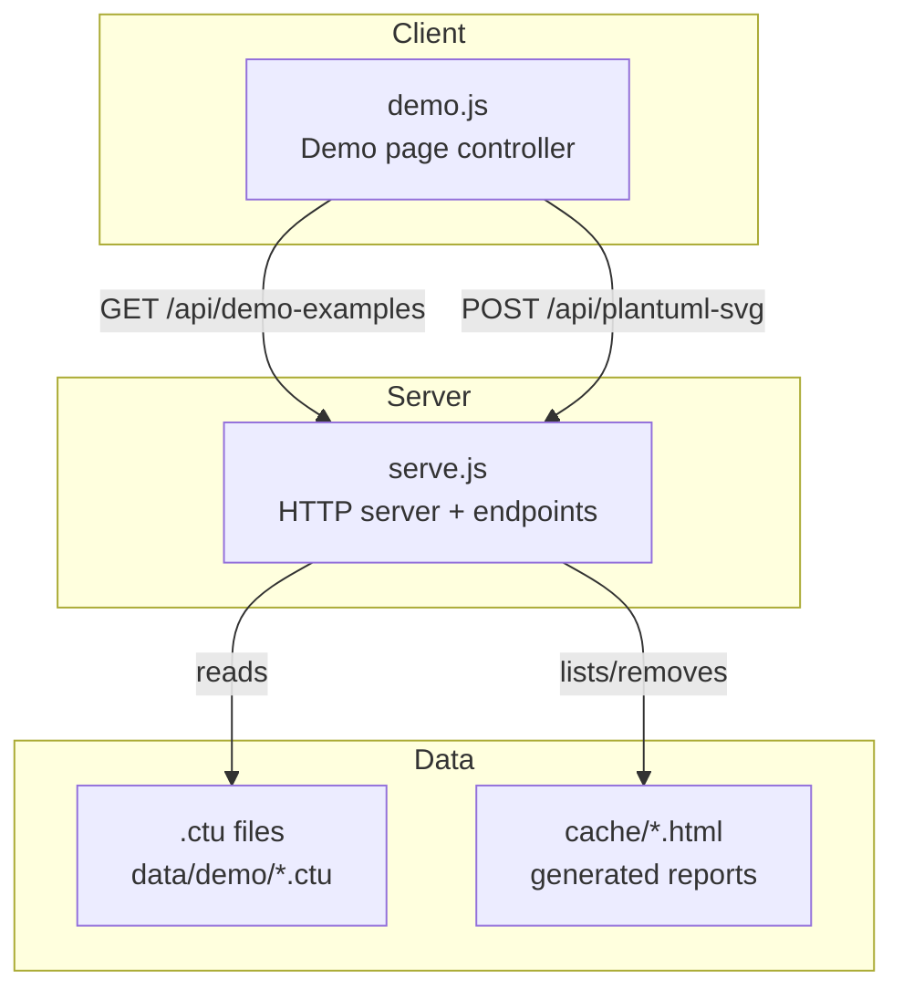
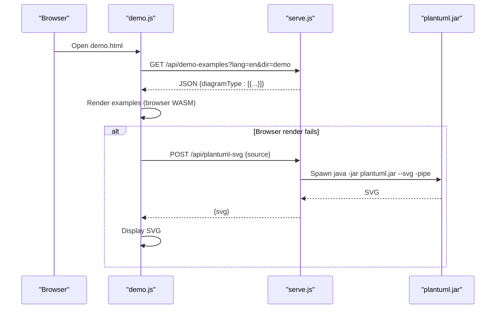
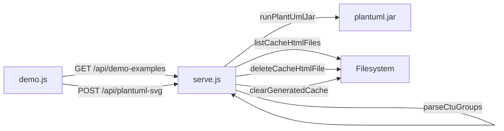

# Server REST Endpoints

<cite>
**Referenced Files in This Document**
- [serve.js](file://serve.js)
- [demo.js](file://demo.js)
- [README.md](file://README.md)
- [CLAUDE.md](file://CLAUDE.md)
- [test/cache-html-api.test.js](file://test/cache-html-api.test.js)
- [data/_TEMPLATE.ctu](file://data/_TEMPLATE.ctu)
- [data/demo/use-case--1_en.ctu](file://data/demo/use-case--1_en.ctu)
- [data/demo/class--1_en.ctu](file://data/demo/class--1_en.ctu)
</cite>

## Table of Contents
1. [Introduction](#introduction)
2. [Project Structure](#project-structure)
3. [Core Components](#core-components)
4. [Architecture Overview](#architecture-overview)
5. [Detailed Component Analysis](#detailed-component-analysis)
6. [Dependency Analysis](#dependency-analysis)
7. [Performance Considerations](#performance-considerations)
8. [Troubleshooting Guide](#troubleshooting-guide)
9. [Conclusion](#conclusion)

## Introduction
This document provides comprehensive API documentation for the server-side REST endpoints exposed by the development server. It covers:
- GET /api/demo-examples: Returns diagram examples grouped by type, filtered by language and data directory.
- POST /api/plantuml-svg: Server-side PlantUML rendering fallback returning SVG.
- Cache management endpoints: GET /api/cache-html, DELETE /api/cache-html, and DELETE /api/cache-html/all.

It includes request/response schemas, HTTP status codes, error handling, security considerations, input validation, and practical examples using curl.

## Project Structure
The server is implemented as a small Node.js HTTP server that serves static assets and exposes several API endpoints. The demo page consumes the demo-examples endpoint and can fall back to the PlantUML SVG endpoint when browser rendering fails.

**Diagram sources**
- [serve.js:454-561](file://serve.js#L454-L561)
- [demo.js:174-185](file://demo.js#L174-L185)

**Section sources**
- [README.md:166-198](file://README.md#L166-L198)
- [CLAUDE.md:84-88](file://CLAUDE.md#L84-L88)

## Core Components
- HTTP server with routing for API endpoints and static file serving.
- Demo examples loader that parses .ctu files into grouped examples.
- PlantUML fallback renderer using java -jar plantuml.jar.
- Cache HTML listing and deletion utilities.

**Section sources**
- [serve.js:454-561](file://serve.js#L454-L561)
- [serve.js:304-395](file://serve.js#L304-L395)
- [serve.js:56-88](file://serve.js#L56-L88)
- [serve.js:217-302](file://serve.js#L217-L302)

## Architecture Overview
The rendering pipeline uses a two-tier strategy: browser rendering via PlantUML WASM with automatic fallback to server-side rendering using plantuml.jar.

**Diagram sources**
- [demo.js:174-185](file://demo.js#L174-L185)
- [serve.js:472-496](file://serve.js#L472-L496)
- [serve.js:56-88](file://serve.js#L56-L88)

## Detailed Component Analysis

### GET /api/demo-examples
- Method: GET
- Path: /api/demo-examples
- Query parameters:
  - lang: Language filter. Values: en or zh. Default: zh.
  - dir: Data directory selector. Values: any subdirectory under data/. Default: demo.
- Response format: JSON object keyed by diagram type (lowercase, hyphenated), each mapping to an array of example items. Each item includes:
  - id: Numeric identifier derived from file metadata.
  - titleI18n, descriptionI18n, detailI18n: Bilingual text maps.
  - sectionTitleI18n, sectionDescriptionI18n: Bilingual section-level metadata.
  - title, description, sectionTitle, sectionDescription: Localized strings based on lang.
  - source: The PlantUML source string for the example.
- Status codes:
  - 200 OK: Successful response.
  - 500 Internal Server Error: On unexpected failures while loading data.
- Security considerations:
  - Directory traversal protection: The dir parameter is sanitized to prevent escaping the data directory.
  - Language parameter defaults to zh if unspecified.
- Input validation:
  - dir is sanitized to alphanumeric, dash, underscore characters only.
  - lang is validated against accepted values.
- Practical examples:
  - curl -i "http://localhost:5401/api/demo-examples?lang=en&dir=demo"
  - curl -i "http://localhost:5401/api/demo-examples?dir=kode-cli-comprehensive"

Request schema
- Query params
  - lang: string enum(en, zh). Default: zh.
  - dir: string. Default: demo.

Response schema
- Object<string, Example[]>
  - Example: {
      id: number,
      titleI18n: Record<string,string>,
      descriptionI18n: Record<string,string>,
      detailI18n: Record<string,string>,
      sectionTitleI18n: Record<string,string>,
      sectionDescriptionI18n: Record<string,string>,
      title: string,
      description: string,
      sectionTitle: string,
      sectionDescription: string,
      source: string
    }

Notes
- The server reads .ctu files from data/{dir}/ and groups them by diagram type and id.
- The response excludes items without a valid PlantUML source.

**Section sources**
- [serve.js:459-470](file://serve.js#L459-L470)
- [serve.js:304-395](file://serve.js#L304-L395)
- [data/_TEMPLATE.ctu:135-162](file://data/_TEMPLATE.ctu#L135-L162)
- [data/demo/use-case--1_en.ctu:1-21](file://data/demo/use-case--1_en.ctu#L1-L21)
- [data/demo/class--1_en.ctu:1-34](file://data/demo/class--1_en.ctu#L1-L34)

### POST /api/plantuml-svg
- Method: POST
- Path: /api/plantuml-svg
- Content-Type: application/json
- Request body:
  - source: string. Required. The PlantUML source code to render.
- Response format: JSON object with svg field containing the rendered SVG markup.
- Status codes:
  - 200 OK: Successful rendering.
  - 400 Bad Request: Invalid JSON body or missing source.
  - 500 Internal Server Error: Failure during rendering (e.g., java not available, invalid PlantUML).
- Security considerations:
  - The endpoint spawns a child process to run plantuml.jar. Ensure java is installed and available on PATH.
  - The request body is read with a maximum size limit to prevent abuse.
- Input validation:
  - JSON parsing is attempted; malformed JSON yields 400.
  - source must be a non-empty string; otherwise 400.
- Practical examples:
  - curl -i -X POST "http://localhost:5401/api/plantuml-svg" -H "Content-Type: application/json" -d '{"source":"@startuml\nAlice -> Bob: Hello\n@enduml"}'

Request schema
- Body: {
  source: string
}

Response schema
- {
  svg: string
}

Notes
- The server invokes java -jar plantuml.jar --svg -pipe and expects SVG output.
- Non-SVG output triggers an error response.

**Section sources**
- [serve.js:472-496](file://serve.js#L472-L496)
- [serve.js:56-88](file://serve.js#L56-L88)
- [CLAUDE.md:30](file://CLAUDE.md#L30)
- [README.md:214-224](file://README.md#L214-L224)

### GET /api/cache-html
- Method: GET
- Path: /api/cache-html
- Response format: JSON object with files array. Each file entry includes:
  - name: string. Basename of the HTML file.
  - path: string. Relative path from repository root.
  - href: string. URL-encoded path for browser consumption.
  - size: number. File size in bytes.
  - modifiedMs: number. Last modified timestamp in milliseconds since epoch.
- Status codes:
  - 200 OK: Successful listing.
  - 500 Internal Server Error: On filesystem errors.
- Security considerations:
  - The endpoint enumerates only HTML files under cache/.
  - Non-HTML files are ignored.
- Practical examples:
  - curl -i "http://localhost:5401/api/cache-html"

Response schema
- {
  files: Array<{
    name: string,
    path: string,
    href: string,
    size: number,
    modifiedMs: number
  }>
}

**Section sources**
- [serve.js:498-507](file://serve.js#L498-L507)
- [serve.js:217-260](file://serve.js#L217-L260)
- [test/cache-html-api.test.js:116-132](file://test/cache-html-api.test.js#L116-L132)

### DELETE /api/cache-html
- Method: DELETE
- Path: /api/cache-html
- Content-Type: application/json
- Request body:
  - path: string. Required. Relative path to the HTML file under cache/ to delete.
- Response format: JSON object indicating the deleted cache path and associated data directory (if any).
  - cachePath: string. The relative path of the deleted HTML file.
  - dataDir: string|null. The relative path of the removed data directory if it existed; otherwise null.
- Status codes:
  - 200 OK: Successful deletion.
  - 400 Bad Request: Invalid JSON, missing path, path traversal detected, or attempts to delete _TEMPLATE.html.
  - 500 Internal Server Error: On filesystem errors.
- Security considerations:
  - Path traversal prevention: Rejects absolute paths and paths outside cache/.
  - Template protection: Prevents deletion of _TEMPLATE.html.
  - Associated data directory removal: If the HTML corresponds to a data directory (by name), that directory is also removed.
- Practical examples:
  - curl -i -X DELETE "http://localhost:5401/api/cache-html" -H "Content-Type: application/json" -d '{"path":"cache/alpha.html"}'
  - curl -i -X DELETE "http://localhost:5401/api/cache-html" -H "Content-Type: application/json" -d '{"path":"cache/nested/beta%20report.html"}'

Request schema
- Body: {
  path: string
}

Response schema
- {
  cachePath: string,
  dataDir: string|null
}

**Section sources**
- [serve.js:509-529](file://serve.js#L509-L529)
- [serve.js:193-215](file://serve.js#L193-L215)
- [test/cache-html-api.test.js:133-151](file://test/cache-html-api.test.js#L133-L151)

### DELETE /api/cache-html/all
- Method: DELETE
- Path: /api/cache-html/all
- Response format: JSON object indicating deleted items.
  - deletedHtml: Array<string>. List of deleted HTML file paths.
  - deletedDataDirs: Array<string>. List of deleted data directories (excluding demo).
- Status codes:
  - 200 OK: Successful clearing.
  - 500 Internal Server Error: On filesystem errors.
- Security considerations:
  - Preserves _TEMPLATE.html in cache/.
  - Leaves non-HTML files in cache/ alone.
  - Leaves data/demo/ and data/_TEMPLATE.ctu alone.
  - Removes non-demo data directories.
- Practical examples:
  - curl -i -X DELETE "http://localhost:5401/api/cache-html/all"

Response schema
- {
  deletedHtml: string[],
  deletedDataDirs: string[]
}

**Section sources**
- [serve.js:531-540](file://serve.js#L531-L540)
- [serve.js:274-302](file://serve.js#L274-L302)
- [test/cache-html-api.test.js:160-170](file://test/cache-html-api.test.js#L160-L170)

## Dependency Analysis
The server routes requests to dedicated handlers. The demo page consumes the demo-examples endpoint and can call the PlantUML SVG endpoint as part of its fallback rendering strategy.

**Diagram sources**
- [demo.js:174-185](file://demo.js#L174-L185)
- [serve.js:459-540](file://serve.js#L459-L540)
- [serve.js:56-88](file://serve.js#L56-L88)
- [serve.js:90-170](file://serve.js#L90-L170)

**Section sources**
- [demo.js:174-185](file://demo.js#L174-L185)
- [serve.js:459-540](file://serve.js#L459-L540)

## Performance Considerations
- The demo-examples endpoint reads and parses .ctu files from disk. For large datasets, consider caching parsed results in memory or precomputing JSON to reduce I/O.
- The PlantUML SVG endpoint spawns a Java process. Limit concurrent requests or add rate limiting to avoid resource exhaustion.
- Static file serving uses streaming; ensure adequate buffer sizes for large assets.

[No sources needed since this section provides general guidance]

## Troubleshooting Guide
Common issues and resolutions:
- 400 Bad Request on /api/plantuml-svg:
  - Cause: Missing or invalid JSON body, or missing source field.
  - Resolution: Ensure Content-Type is application/json and the body contains a source string.
- 500 Internal Server Error on /api/plantuml-svg:
  - Cause: java not installed or not on PATH, or invalid PlantUML syntax.
  - Resolution: Install Java and verify plantuml.jar availability; validate source syntax.
- 400 Bad Request on /api/cache-html:
  - Cause: Invalid path, path traversal attempt, or attempting to delete _TEMPLATE.html.
  - Resolution: Use only cache-relative paths ending with .html; avoid ../ traversals.
- 500 Internal Server Error on cache endpoints:
  - Cause: Filesystem permissions or unexpected errors.
  - Resolution: Check directory permissions and ensure cache/ exists.

**Section sources**
- [serve.js:472-496](file://serve.js#L472-L496)
- [serve.js:509-529](file://serve.js#L509-L529)
- [serve.js:531-540](file://serve.js#L531-L540)
- [test/cache-html-api.test.js:144-158](file://test/cache-html-api.test.js#L144-L158)

## Conclusion
The server provides essential endpoints for loading diagram examples, rendering PlantUML server-side, and managing generated HTML reports. The design emphasizes simplicity and reliability, with clear validation and error handling. For production deployments, consider adding rate limiting, input sanitization, and monitoring around the PlantUML fallback endpoint.