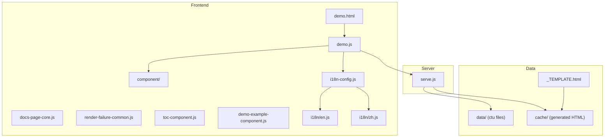
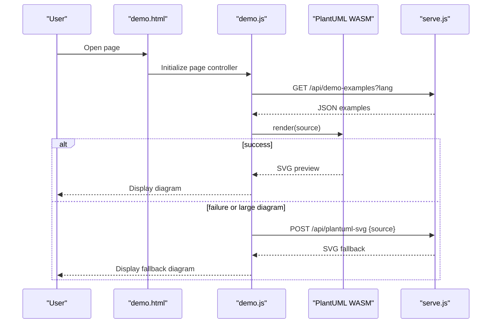
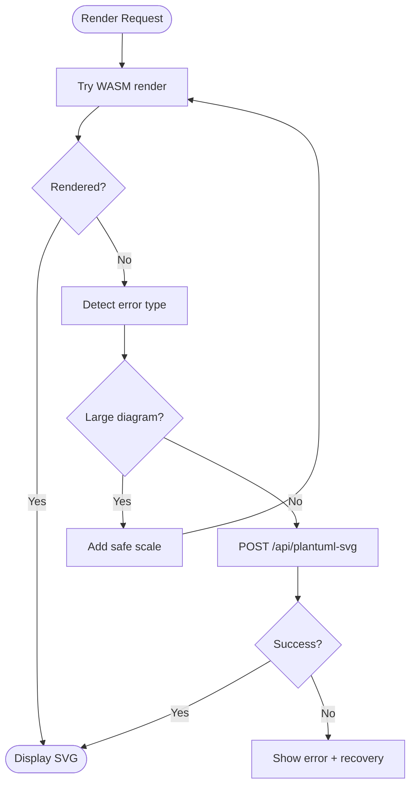
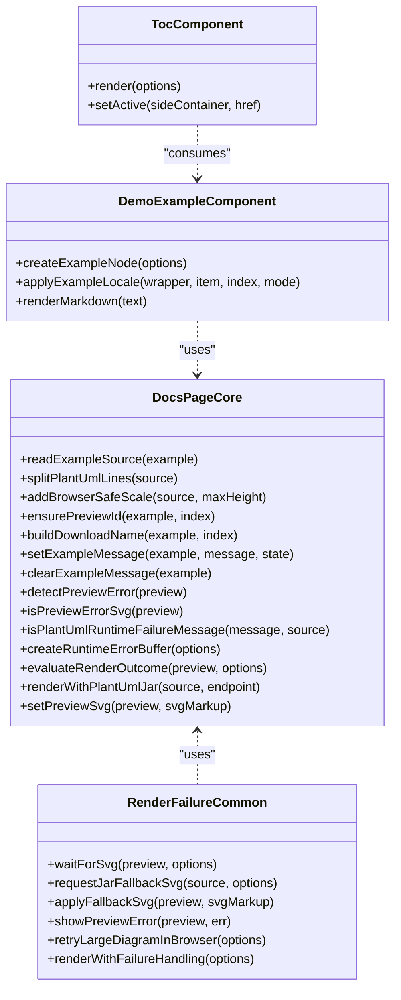
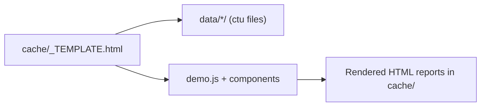
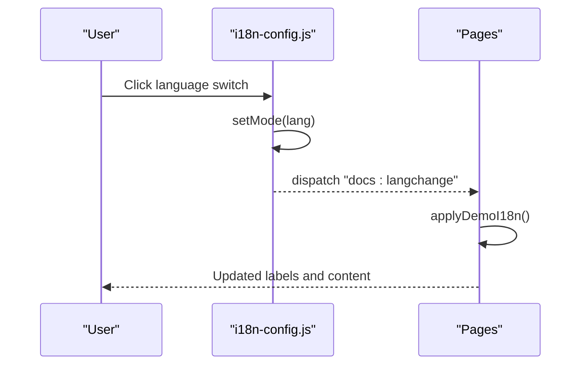
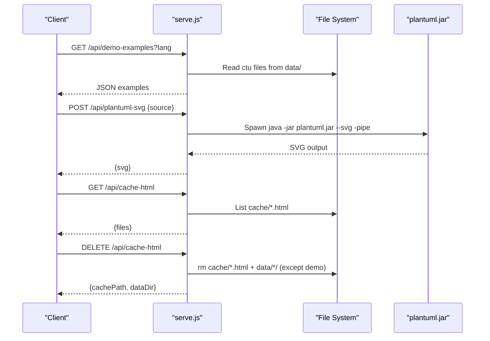
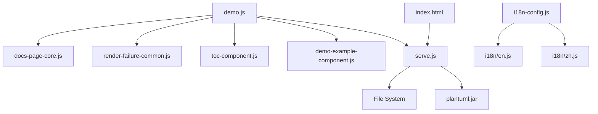

# Architecture Overview

<cite>
**Referenced Files in This Document**
- [index.html](file://index.html)
- [demo.html](file://demo.html)
- [demo.js](file://demo.js)
- [serve.js](file://serve.js)
- [i18n-config.js](file://i18n-config.js)
- [i18n/en.js](file://i18n/en.js)
- [i18n/zh.js](file://i18n/zh.js)
- [component/docs-page-core.js](file://component/docs-page-core.js)
- [component/render-failure-common.js](file://component/render-failure-common.js)
- [component/toc-component.js](file://component/toc-component.js)
- [component/demo-example-component.js](file://component/demo-example-component.js)
- [cache/_TEMPLATE.html](file://cache/_TEMPLATE.html)
- [README.md](file://README.md)
</cite>

## Table of Contents
1. [Introduction](#introduction)
2. [Project Structure](#project-structure)
3. [Core Components](#core-components)
4. [Architecture Overview](#architecture-overview)
5. [Detailed Component Analysis](#detailed-component-analysis)
6. [Dependency Analysis](#dependency-analysis)
7. [Performance Considerations](#performance-considerations)
8. [Troubleshooting Guide](#troubleshooting-guide)
9. [Conclusion](#conclusion)

## Introduction
This document describes the architecture of Code-To-UML, focusing on the browser-first rendering pipeline powered by PlantUML WASM, the automatic server-side fallback to Java-based rendering, the component-based frontend design, the template system separating data, presentation, and logic, and the internationalization system with localStorage persistence and event-driven language switching. It also covers the lightweight Node.js development server, the two-tier rendering strategy, error handling mechanisms, and the relationship between cache management and report generation.

## Project Structure
The project is organized around:
- A static HTML/JS frontend with modular UI components
- A Node.js development server exposing API endpoints
- A data model based on .ctu files
- A reusable HTML template for generating reports
- An internationalization runtime with localStorage persistence

**Diagram sources**
- [demo.html](file://demo.html)
- [demo.js](file://demo.js)
- [component/docs-page-core.js](file://component/docs-page-core.js)
- [component/render-failure-common.js](file://component/render-failure-common.js)
- [component/toc-component.js](file://component/toc-component.js)
- [component/demo-example-component.js](file://component/demo-example-component.js)
- [i18n-config.js](file://i18n-config.js)
- [i18n/en.js](file://i18n/en.js)
- [i18n/zh.js](file://i18n/zh.js)
- [serve.js](file://serve.js)
- [cache/_TEMPLATE.html](file://cache/_TEMPLATE.html)

**Section sources**
- [README.md](file://README.md)
- [demo.html](file://demo.html)
- [demo.js](file://demo.js)
- [serve.js](file://serve.js)
- [cache/_TEMPLATE.html](file://cache/_TEMPLATE.html)

## Core Components
- Frontend rendering pipeline: PlantUML WASM (primary) with automatic fallback to server-side Java rendering
- Component-based UI: modular modules for core logic, error handling, TOC, and example cards
- Template system: HTML template with embedded conventions for tabs, sections, and script dependencies
- Internationalization: localStorage-backed language mode with event-driven updates
- Server: lightweight Node.js HTTP server with API endpoints for demo examples and PlantUML fallback

**Section sources**
- [demo.js](file://demo.js)
- [component/docs-page-core.js](file://component/docs-page-core.js)
- [component/render-failure-common.js](file://component/render-failure-common.js)
- [component/toc-component.js](file://component/toc-component.js)
- [component/demo-example-component.js](file://component/demo-example-component.js)
- [i18n-config.js](file://i18n-config.js)
- [i18n/en.js](file://i18n/en.js)
- [i18n/zh.js](file://i18n/zh.js)
- [serve.js](file://serve.js)
- [cache/_TEMPLATE.html](file://cache/_TEMPLATE.html)

## Architecture Overview
The system follows a browser-first rendering strategy:
- The demo page initializes UI components and loads .ctu data via a server API
- PlantUML WASM renders diagrams in the browser
- On failure or large diagram detection, the system retries via a server-side Java-based fallback
- Internationalization is handled client-side with localStorage persistence and event-driven updates
- Reports are generated from .ctu data and cached as HTML pages

**Diagram sources**
- [demo.html](file://demo.html)
- [demo.js](file://demo.js)
- [serve.js](file://serve.js)

**Section sources**
- [README.md](file://README.md)
- [demo.js](file://demo.js)
- [serve.js](file://serve.js)

## Detailed Component Analysis

### Browser Rendering Pipeline (WASM-first with fallback)
- The demo controller orchestrates rendering, error detection, and fallback requests
- Core utilities provide error buffering, outcome evaluation, and fallback HTTP error messaging
- Failure handling coordinates retry logic and displays user-friendly messages

**Diagram sources**
- [demo.js](file://demo.js)
- [component/docs-page-core.js](file://component/docs-page-core.js)
- [component/render-failure-common.js](file://component/render-failure-common.js)

**Section sources**
- [demo.js](file://demo.js)
- [component/docs-page-core.js](file://component/docs-page-core.js)
- [component/render-failure-common.js](file://component/render-failure-common.js)

### Component-Based Frontend Architecture
- Core page logic: reading example source, splitting lines, adding safe scaling, evaluating outcomes, and fallback HTTP error messaging
- Failure handling: waiting for SVG, requesting fallback, applying fallback SVG, retrying large diagrams
- TOC component: building and synchronizing a side table of contents
- Example card component: rendering markdown, creating example nodes, applying localization

**Diagram sources**
- [component/docs-page-core.js](file://component/docs-page-core.js)
- [component/render-failure-common.js](file://component/render-failure-common.js)
- [component/toc-component.js](file://component/toc-component.js)
- [component/demo-example-component.js](file://component/demo-example-component.js)

**Section sources**
- [component/docs-page-core.js](file://component/docs-page-core.js)
- [component/render-failure-common.js](file://component/render-failure-common.js)
- [component/toc-component.js](file://component/toc-component.js)
- [component/demo-example-component.js](file://component/demo-example-component.js)

### Template System: Data, Presentation, and Logic Separation
- Presentation: HTML template defines structure, tabs, sections, and script dependencies
- Data: .ctu files provide diagram examples with metadata and UML source
- Logic: JavaScript components parse data, render previews, and manage UI interactions

**Diagram sources**
- [cache/_TEMPLATE.html](file://cache/_TEMPLATE.html)
- [demo.js](file://demo.js)

**Section sources**
- [cache/_TEMPLATE.html](file://cache/_TEMPLATE.html)
- [demo.html](file://demo.html)
- [demo.js](file://demo.js)

### Internationalization System
- Language mode persisted in localStorage
- Event-driven updates trigger UI refresh and content re-localization
- Dynamic language switcher buttons and page title updates

**Diagram sources**
- [i18n-config.js](file://i18n-config.js)
- [i18n/en.js](file://i18n/en.js)
- [i18n/zh.js](file://i18n/zh.js)
- [demo.js](file://demo.js)

**Section sources**
- [i18n-config.js](file://i18n-config.js)
- [i18n/en.js](file://i18n/en.js)
- [i18n/zh.js](file://i18n/zh.js)
- [demo.js](file://demo.js)

### Server Infrastructure and API Endpoints
- Lightweight Node.js HTTP server serving static assets and APIs
- Endpoints:
  - GET /api/demo-examples: returns parsed .ctu examples for the selected language
  - POST /api/plantuml-svg: server-side PlantUML rendering fallback
  - GET /api/cache-html: lists generated HTML files in cache/
  - DELETE /api/cache-html: deletes a specific HTML file and its data directory
  - DELETE /api/cache-html/all: clears generated HTML and non-demo data directories

**Diagram sources**
- [serve.js](file://serve.js)

**Section sources**
- [serve.js](file://serve.js)

## Dependency Analysis
- Frontend depends on PlantUML WASM for rendering and on the server for fallback rendering
- Internationalization is decoupled from rendering logic via events
- Components are loosely coupled and reusable across pages
- Server APIs are consumed by the frontend and by the cache index page

**Diagram sources**
- [demo.js](file://demo.js)
- [component/docs-page-core.js](file://component/docs-page-core.js)
- [component/render-failure-common.js](file://component/render-failure-common.js)
- [component/toc-component.js](file://component/toc-component.js)
- [component/demo-example-component.js](file://component/demo-example-component.js)
- [i18n-config.js](file://i18n-config.js)
- [i18n/en.js](file://i18n/en.js)
- [i18n/zh.js](file://i18n/zh.js)
- [index.html](file://index.html)
- [serve.js](file://serve.js)

**Section sources**
- [demo.js](file://demo.js)
- [i18n-config.js](file://i18n-config.js)
- [index.html](file://index.html)
- [serve.js](file://serve.js)

## Performance Considerations
- Prefer WASM rendering for most diagrams to avoid server round-trips
- Debounce user edits to reduce render frequency
- Use safe scaling for large diagrams to improve browser rendering reliability
- Cache generated HTML reports to minimize repeated processing
- Keep UI updates minimal and reactive to language changes

## Troubleshooting Guide
- If the page fails to load demo examples, verify the server is running and reachable
- If fallback rendering fails, ensure Java is installed and plantuml.jar is available
- If language switching does not take effect, confirm localStorage persistence and event dispatch
- If cache index shows errors, check server permissions and path validations

**Section sources**
- [component/docs-page-core.js](file://component/docs-page-core.js)
- [component/render-failure-common.js](file://component/render-failure-common.js)
- [i18n-config.js](file://i18n-config.js)
- [index.html](file://index.html)
- [serve.js](file://serve.js)

## Conclusion
Code-To-UML’s architecture emphasizes a fast, reliable, and flexible rendering pipeline. The browser-first WASM rendering combined with intelligent fallback ensures robustness, while the component-based frontend and template system promote maintainability and reusability. The internationalization and caching strategies further enhance usability and performance.