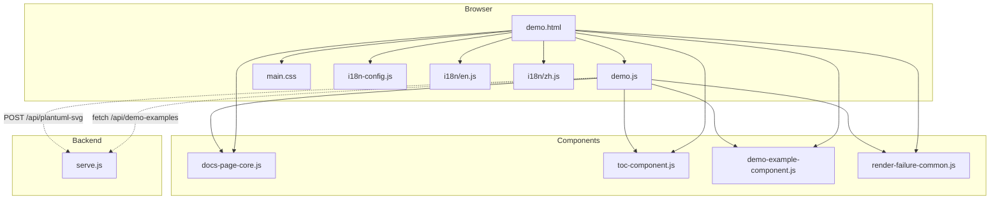
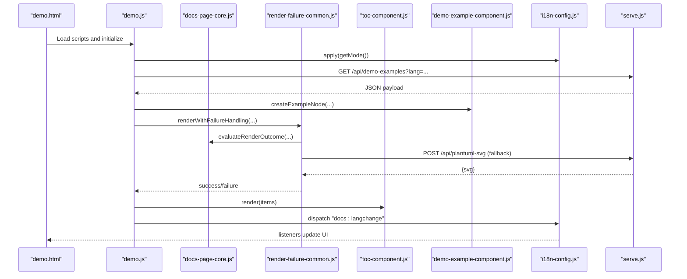
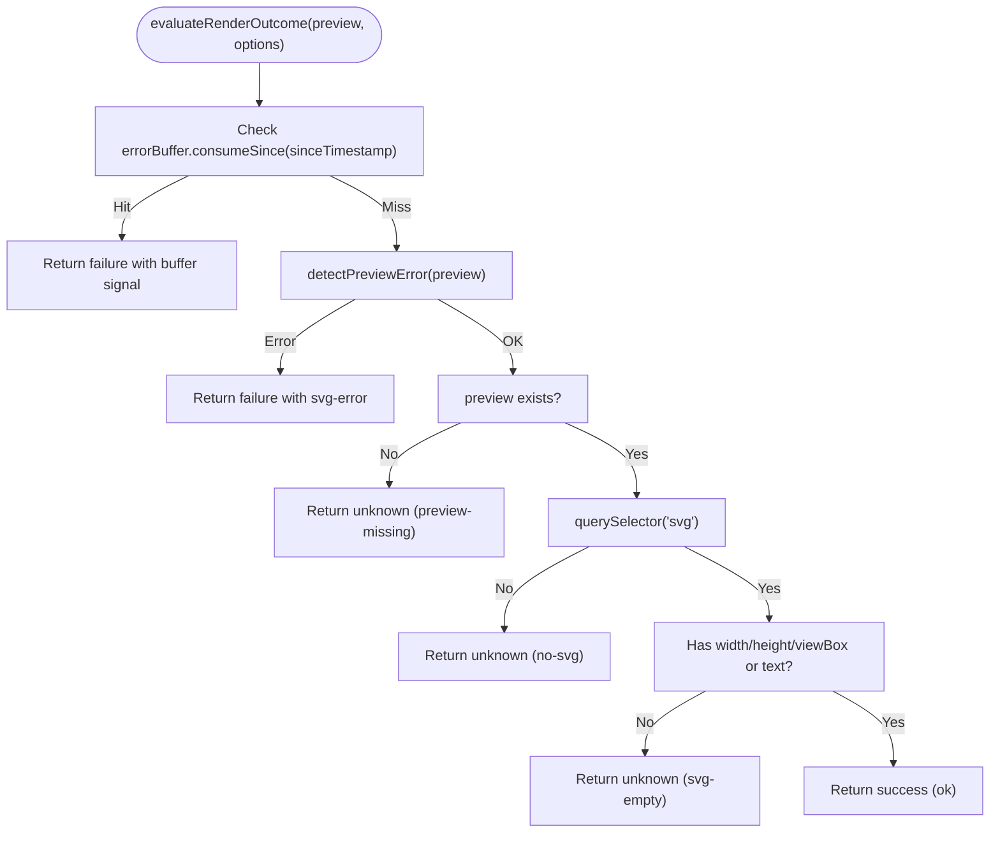
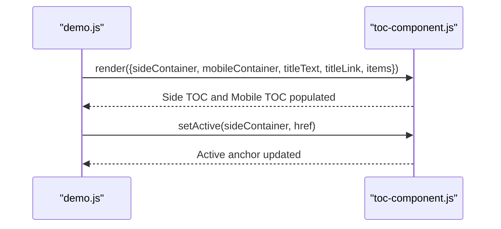
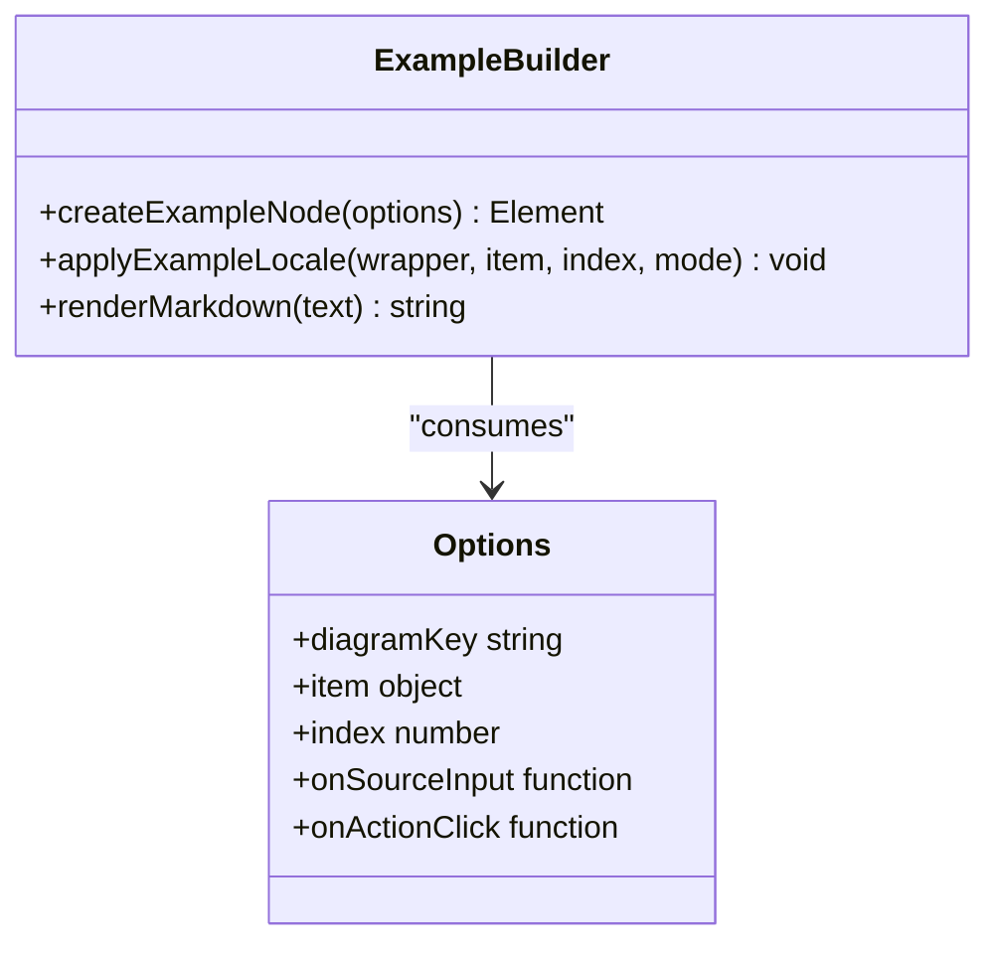
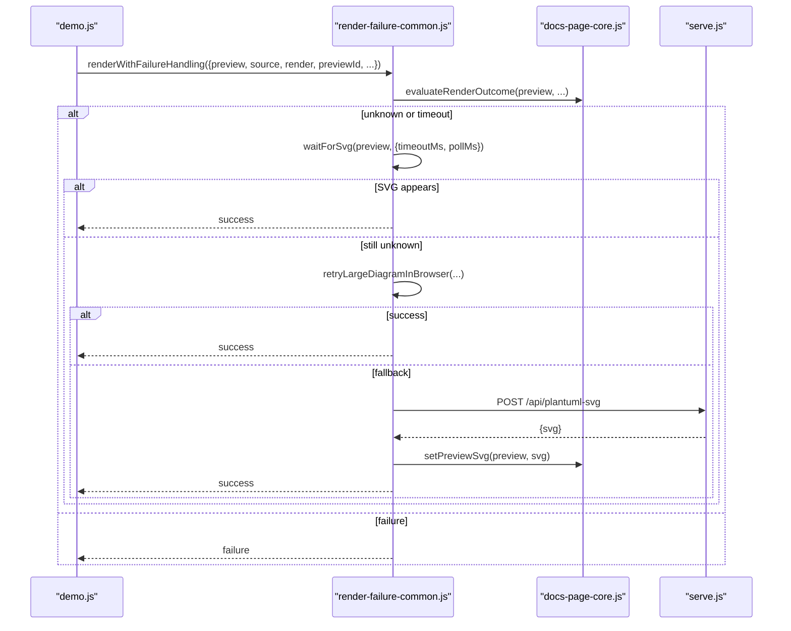
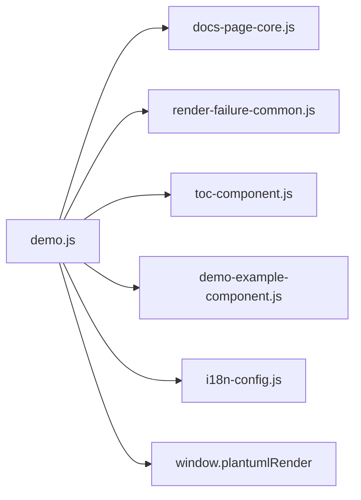

# Component System

<cite>
**Referenced Files in This Document**
- [docs-page-core.js](file://component/docs-page-core.js)
- [toc-component.js](file://component/toc-component.js)
- [demo-example-component.js](file://component/demo-example-component.js)
- [render-failure-common.js](file://component/render-failure-common.js)
- [demo.html](file://demo.html)
- [demo.js](file://demo.js)
- [i18n-config.js](file://i18n-config.js)
- [i18n/en.js](file://i18n/en.js)
- [i18n/zh.js](file://i18n/zh.js)
- [main.css](file://main.css)
- [serve.js](file://serve.js)
- [render-failure-common.test.js](file://test/render-failure-common.test.js)
</cite>

## Table of Contents
1. [Introduction](#introduction)
2. [Project Structure](#project-structure)
3. [Core Components](#core-components)
4. [Architecture Overview](#architecture-overview)
5. [Detailed Component Analysis](#detailed-component-analysis)
6. [Dependency Analysis](#dependency-analysis)
7. [Performance Considerations](#performance-considerations)
8. [Troubleshooting Guide](#troubleshooting-guide)
9. [Conclusion](#conclusion)
10. [Appendices](#appendices)

## Introduction
This document describes the component-based architecture used to render PlantUML examples in a browser-based demo page. It focuses on four key modules:
- docs-page-core.js: Core rendering utilities and error detection helpers
- toc-component.js: Table of contents generator for navigation
- demo-example-component.js: Individual example card builder and locale-aware content renderer
- render-failure-common.js: Failure handling, retries, and fallback mechanisms

It explains component interfaces, event-driven communication, data flow, lifecycle management, DOM manipulation strategies, responsive design, composition patterns, reusability, customization, and extension points.

## Project Structure
The demo page composes several modules:
- HTML page loads PlantUML renderer and component scripts
- i18n configuration and language dictionaries
- CSS defines responsive layout and component styles
- Backend server provides demo data and PlantUML jar fallback

**Diagram sources**
- [demo.html:79-89](file://demo.html#L79-L89)
- [demo.js:3-11](file://demo.js#L3-L11)
- [docs-page-core.js:447-462](file://component/docs-page-core.js#L447-L462)
- [render-failure-common.js:239-247](file://component/render-failure-common.js#L239-L247)
- [toc-component.js:82-83](file://component/toc-component.js#L82-L83)
- [demo-example-component.js:157-158](file://component/demo-example-component.js#L157-L158)
- [i18n-config.js:56-57](file://i18n-config.js#L56-L57)
- [serve.js:454-561](file://serve.js#L454-L561)

**Section sources**
- [demo.html:79-89](file://demo.html#L79-L89)
- [demo.js:3-11](file://demo.js#L3-L11)
- [main.css:1-804](file://main.css#L1-L804)
- [i18n-config.js:3-57](file://i18n-config.js#L3-L57)
- [serve.js:454-561](file://serve.js#L454-L561)

## Core Components
- docs-page-core.js: Provides rendering helpers, error detection, runtime error buffering, and SVG insertion utilities. Exposes a public API for consumers.
- toc-component.js: Renders a side TOC and mobile TOC from a list of items, and toggles active states based on current scroll position.
- demo-example-component.js: Builds example cards with title/description/detail, action buttons, source textarea, preview area, and locale-aware content.
- render-failure-common.js: Orchestrates rendering attempts, waits for SVG readiness, detects outcomes, handles timeouts, retries with scaling, and falls back to jar-based rendering.

These components are designed as self-contained modules with minimal coupling and explicit interfaces.

**Section sources**
- [docs-page-core.js:447-462](file://component/docs-page-core.js#L447-L462)
- [toc-component.js:21-83](file://component/toc-component.js#L21-L83)
- [demo-example-component.js:82-158](file://component/demo-example-component.js#L82-L158)
- [render-failure-common.js:160-247](file://component/render-failure-common.js#L160-L247)

## Architecture Overview
The demo page initializes components, loads localized example data, renders example cards, and manages rendering failures with graceful fallbacks. The i18n system broadcasts language changes to update UI and content.

**Diagram sources**
- [demo.html:79-89](file://demo.html#L79-L89)
- [demo.js:104-144](file://demo.js#L104-L144)
- [docs-page-core.js:293-355](file://component/docs-page-core.js#L293-L355)
- [render-failure-common.js:160-237](file://component/render-failure-common.js#L160-L237)
- [toc-component.js:21-64](file://component/toc-component.js#L21-L64)
- [demo-example-component.js:82-155](file://component/demo-example-component.js#L82-L155)
- [i18n-config.js:48-54](file://i18n-config.js#L48-L54)
- [serve.js:459-496](file://serve.js#L459-L496)

## Detailed Component Analysis

### docs-page-core.js
- Responsibilities:
  - Extract and normalize example source
  - Split lines and normalize line endings
  - Add browser-safe scaling directives for large diagrams
  - Ensure preview element IDs and build download filenames
  - Manage example messages and clear them
  - Detect preview errors from SVG attributes/text
  - Evaluate render outcomes (success/unknown/failure)
  - Buffer runtime errors and detect runtime failure messages
  - Render via jar fallback and insert SVG into preview
- Interfaces:
  - Public API exposes functions for consumers
  - Functions include readExampleSource, splitPlantUmlLines, addBrowserSafeScale, ensurePreviewId, buildDownloadName, setExampleMessage, clearExampleMessage, detectPreviewError, isPreviewErrorSvg, isPlantUmlRuntimeFailureMessage, createRuntimeErrorBuffer, evaluateRenderOutcome, renderWithPlantUmlJar, setPreviewSvg
- Factory pattern: Exposed as a singleton-like API via an IIFE factory returning an object of functions.
- Lifecycle: Used during example creation and rendering; buffers runtime errors for downstream consumers.

**Diagram sources**
- [docs-page-core.js:293-355](file://component/docs-page-core.js#L293-L355)

**Section sources**
- [docs-page-core.js:12-462](file://component/docs-page-core.js#L12-L462)

### toc-component.js
- Responsibilities:
  - Build anchor links from items with labels, hrefs, and onClick handlers
  - Render side TOC and mobile TOC containers
  - Toggle active state on anchors based on current href
- Interfaces:
  - render(options): sideContainer, mobileContainer, titleText, titleLink, items
  - setActive(sideContainer, href): toggles active class and aria-current
- Observer pattern: Consumers set up scroll/resize listeners and call setActive to reflect viewport position.

**Diagram sources**
- [toc-component.js:21-83](file://component/toc-component.js#L21-L83)
- [demo.js:195-345](file://demo.js#L195-L345)

**Section sources**
- [toc-component.js:21-83](file://component/toc-component.js#L21-L83)
- [demo.js:195-345](file://demo.js#L195-L345)

### demo-example-component.js
- Responsibilities:
  - Create example nodes with title, description, actions, source textarea, preview area, and message area
  - Apply locale-aware titles/descriptions/details
  - Render markdown for descriptions and details
  - Attach event handlers for source input and action clicks
- Interfaces:
  - createExampleNode(options): returns a DOM node for an example
  - applyExampleLocale(wrapper, item, index, mode): updates text based on locale
  - renderMarkdown(text): markdown rendering with fallback
- Factory pattern: createExampleNode builds and returns a DOM node configured with events and content.

**Diagram sources**
- [demo-example-component.js:82-158](file://component/demo-example-component.js#L82-L158)

**Section sources**
- [demo-example-component.js:82-158](file://component/demo-example-component.js#L82-L158)

### render-failure-common.js
- Responsibilities:
  - Render with failure handling: render, wait for SVG, evaluate outcome, retry with scaling, fallback to jar
  - Wait for SVG readiness with MutationObserver and polling
  - Request jar fallback and apply SVG into preview
  - Describe outcomes and show preview errors
- Interfaces:
  - wait(ms), describeRenderOutcome(outcome), evaluateRenderOutcomeWithSignals(preview, options)
  - waitForSvg(preview, options), requestJarFallbackSvg(source, options), applyFallbackSvg(preview, svgMarkup)
  - renderWithFailureHandling(options)
- Observer pattern: Uses MutationObserver to watch preview DOM changes.

**Diagram sources**
- [render-failure-common.js:160-237](file://component/render-failure-common.js#L160-L237)
- [docs-page-core.js:293-355](file://component/docs-page-core.js#L293-L355)
- [serve.js:472-496](file://serve.js#L472-L496)

**Section sources**
- [render-failure-common.js:160-247](file://component/render-failure-common.js#L160-L247)

### Event-driven Communication and Data Flow
- Language switching:
  - i18n-config.js stores mode in localStorage and dispatches a CustomEvent "docs:langchange"
  - demo.js listens for "docs:langchange" and refreshes examples and UI
  - toc-component.js and demo-example-component.js react to locale changes
- Rendering pipeline:
  - demo.js loads examples, creates example nodes, enqueues render tasks, and applies failure handling
  - docs-page-core.js provides rendering helpers and error detection
  - render-failure-common.js orchestrates retries and fallbacks
- DOM manipulation:
  - Components create and append DOM nodes, set attributes, manage classes, and update content
  - MutationObserver is used to detect SVG insertion for readiness

**Section sources**
- [i18n-config.js:48-54](file://i18n-config.js#L48-L54)
- [demo.js:131-144](file://demo.js#L131-L144)
- [toc-component.js:66-80](file://component/toc-component.js#L66-L80)
- [demo-example-component.js:48-80](file://component/demo-example-component.js#L48-L80)
- [render-failure-common.js:39-84](file://component/render-failure-common.js#L39-L84)

### Component Composition Patterns
- Factory pattern:
  - demo-example-component.js factory creates example nodes
  - docs-page-core.js factory exposes a public API of functions
- Observer pattern:
  - i18n-config.js publishes language change events
  - render-failure-common.js observes DOM changes for SVG readiness
- Pipeline pattern:
  - demo.js composes components to render examples with robust error handling

**Section sources**
- [demo-example-component.js:82-158](file://component/demo-example-component.js#L82-L158)
- [docs-page-core.js:447-462](file://component/docs-page-core.js#L447-L462)
- [i18n-config.js:48-54](file://i18n-config.js#L48-L54)
- [render-failure-common.js:39-84](file://component/render-failure-common.js#L39-L84)

### Responsive Design Implementation
- CSS grid and flex layouts adapt to screen sizes
- Fixed TOC on desktop, mobile TOC on small screens
- Large diagram layout switches to vertical stacking for readability
- Lightbox overlay with zoom/pan gestures for SVG inspection

**Section sources**
- [main.css:127-145](file://main.css#L127-L145)
- [main.css:586-662](file://main.css#L586-L662)
- [main.css:664-729](file://main.css#L664-L729)
- [main.css:754-800](file://main.css#L754-L800)
- [demo.js:500-726](file://demo.js#L500-L726)

## Dependency Analysis
- demo.js depends on:
  - PlantUML renderer (window.plantumlRender)
  - docs-page-core.js for rendering helpers and error detection
  - render-failure-common.js for robust rendering orchestration
  - toc-component.js for navigation
  - demo-example-component.js for example card creation
  - i18n-config.js for language management
- Components depend on each other through documented interfaces and shared globals exposed by the page.

**Diagram sources**
- [demo.js:3-11](file://demo.js#L3-L11)
- [docs-page-core.js:447-462](file://component/docs-page-core.js#L447-L462)
- [render-failure-common.js:239-247](file://component/render-failure-common.js#L239-L247)
- [toc-component.js:82-83](file://component/toc-component.js#L82-L83)
- [demo-example-component.js:157-158](file://component/demo-example-component.js#L157-L158)
- [i18n-config.js:56-57](file://i18n-config.js#L56-L57)

**Section sources**
- [demo.js:3-11](file://demo.js#L3-L11)

## Performance Considerations
- Debounced re-rendering: example source input is debounced to reduce rendering churn
- Render queue: render tasks are chained to prevent concurrent rendering conflicts
- Retry with scaling: large diagrams are retried with browser-safe scaling to improve reliability
- Lightweight DOM updates: components manipulate minimal DOM nodes and toggle classes rather than reconstructing entire subtrees
- Observers: MutationObserver is used to detect SVG insertion efficiently

[No sources needed since this section provides general guidance]

## Troubleshooting Guide
- Language switching not updating content:
  - Ensure "docs:langchange" is dispatched and listeners are attached
  - Verify i18n dictionary keys and mode persistence
- Rendering fails immediately:
  - Check evaluateRenderOutcome and detectPreviewError signals
  - Confirm jar fallback endpoint availability and CORS
- Large diagram rendering issues:
  - Verify browser-safe scaling is applied and retry succeeds
  - Inspect preview container sizing and layout classes
- Action buttons fail:
  - Confirm SVG is present before copying/downloading
  - Check clipboard permissions and download support

**Section sources**
- [i18n-config.js:48-54](file://i18n-config.js#L48-L54)
- [docs-page-core.js:293-355](file://component/docs-page-core.js#L293-L355)
- [render-failure-common.js:132-237](file://component/render-failure-common.js#L132-L237)
- [demo.js:449-498](file://demo.js#L449-L498)

## Conclusion
The component system is modular, event-driven, and resilient. Components expose clear interfaces, coordinate via observers and factories, and integrate with a responsive UI and robust failure-handling pipeline. The architecture supports localization, customization, and extension while maintaining separation of concerns and predictable data flow.

[No sources needed since this section summarizes without analyzing specific files]

## Appendices

### Component Interfaces Reference
- docs-page-core.js
  - readExampleSource, splitPlantUmlLines, addBrowserSafeScale, ensurePreviewId, buildDownloadName, setExampleMessage, clearExampleMessage, detectPreviewError, isPreviewErrorSvg, isPlantUmlRuntimeFailureMessage, createRuntimeErrorBuffer, evaluateRenderOutcome, renderWithPlantUmlJar, setPreviewSvg
- toc-component.js
  - render, setActive
- demo-example-component.js
  - createExampleNode, applyExampleLocale, renderMarkdown
- render-failure-common.js
  - wait, describeRenderOutcome, evaluateRenderOutcomeWithSignals, waitForSvg, requestJarFallbackSvg, applyFallbackSvg, renderWithFailureHandling

**Section sources**
- [docs-page-core.js:447-462](file://component/docs-page-core.js#L447-L462)
- [toc-component.js:82-83](file://component/toc-component.js#L82-L83)
- [demo-example-component.js:157-158](file://component/demo-example-component.js#L157-L158)
- [render-failure-common.js:239-247](file://component/render-failure-common.js#L239-L247)

### Backend Integration Notes
- /api/demo-examples: Loads localized example data from data directories
- /api/plantuml-svg: Jar fallback endpoint for rendering PlantUML to SVG

**Section sources**
- [serve.js:459-496](file://serve.js#L459-L496)

### Testing Patterns
- render-failure-common.test.js demonstrates mocking fetch and preview behavior to validate failure handling and fallback logic

**Section sources**
- [render-failure-common.test.js:18-76](file://test/render-failure-common.test.js#L18-L76)