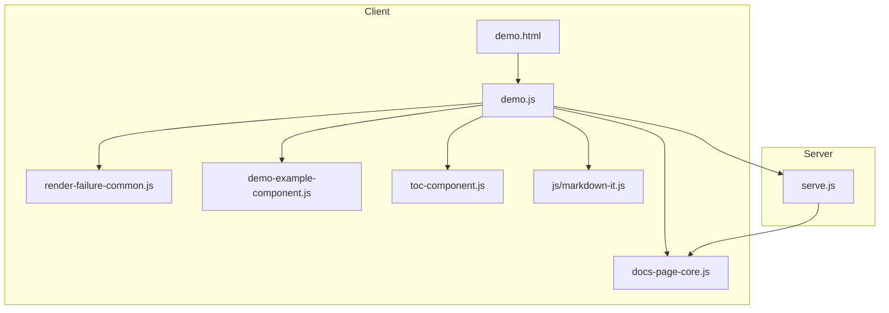
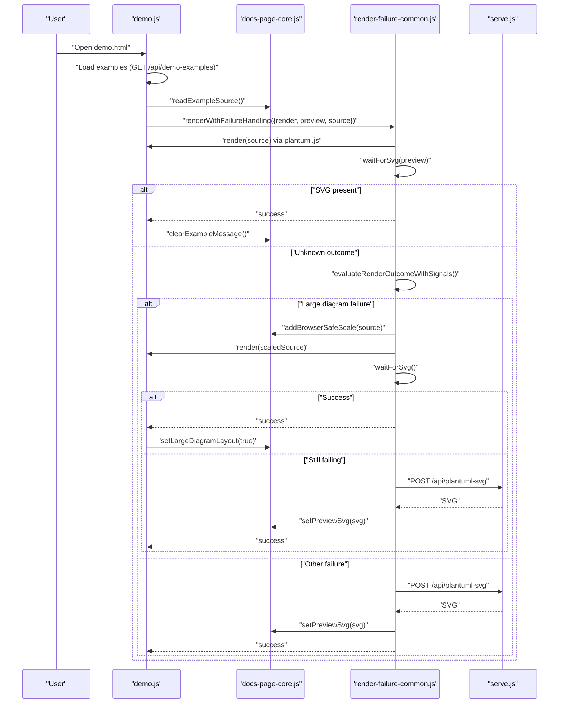
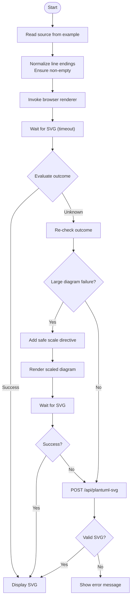
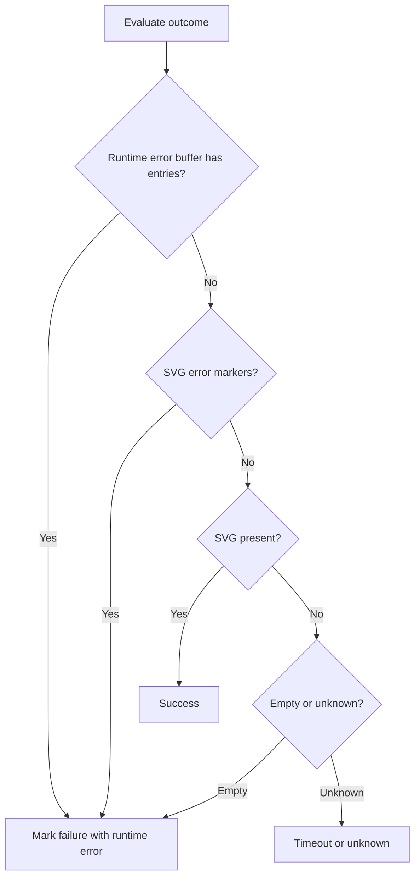
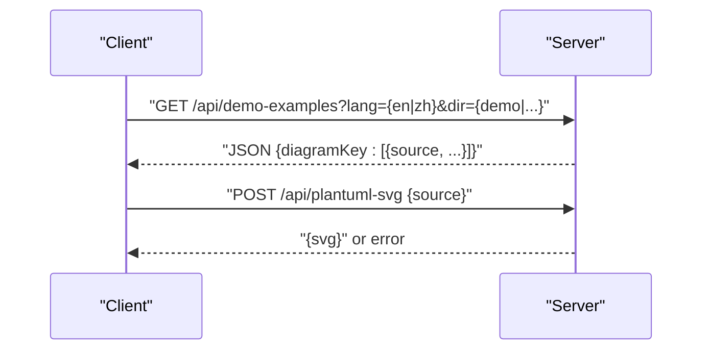
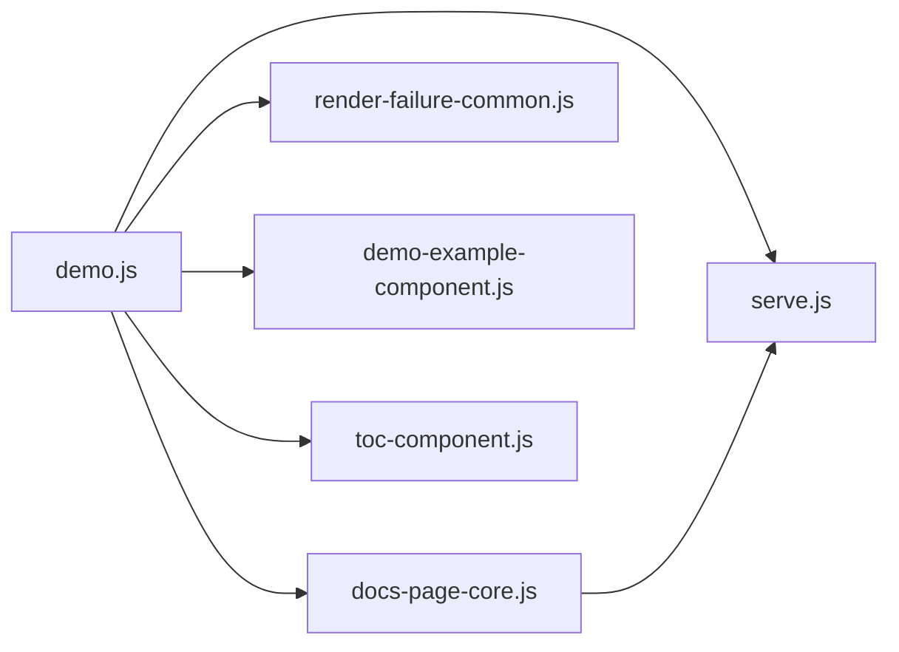

# Rendering Pipeline

<cite>
**Referenced Files in This Document**
- [README.md](file://README.md)
- [demo.html](file://demo.html)
- [demo.js](file://demo.js)
- [serve.js](file://serve.js)
- [docs-page-core.js](file://component/docs-page-core.js)
- [render-failure-common.js](file://component/render-failure-common.js)
- [demo-example-component.js](file://component/demo-example-component.js)
- [toc-component.js](file://component/toc-component.js)
- [index.html](file://index.html)
- [markdown-it.js](file://js/markdown-it.js)
</cite>

## Table of Contents
1. [Introduction](#introduction)
2. [Project Structure](#project-structure)
3. [Core Components](#core-components)
4. [Architecture Overview](#architecture-overview)
5. [Detailed Component Analysis](#detailed-component-analysis)
6. [Dependency Analysis](#dependency-analysis)
7. [Performance Considerations](#performance-considerations)
8. [Troubleshooting Guide](#troubleshooting-guide)
9. [Conclusion](#conclusion)

## Introduction
This document explains the rendering pipeline architecture used to transform PlantUML source into interactive HTML output. It focuses on the two-tier rendering strategy:
- Primary renderer: PlantUML WASM (browser-first)
- Automatic fallback: Server-side Java-based rendering via a Node.js dev server

The pipeline includes source validation, WASM execution, SVG generation, error detection and recovery, buffer management for runtime errors, and retry logic. It also covers integration with markdown-it for description processing and the component-based rendering system used in the demo viewer.

## Project Structure
The rendering pipeline spans client-side and server-side modules:
- Client-side modules: demo page controller, core utilities, failure-handling library, example component, TOC component, and markdown-it integration
- Server-side module: a lightweight Node.js HTTP server exposing APIs for demo data and PlantUML fallback rendering

**Diagram sources**
- [demo.html:1-116](file://demo.html#L1-L116)
- [demo.js:1-816](file://demo.js#L1-L816)
- [docs-page-core.js:1-464](file://component/docs-page-core.js#L1-L464)
- [render-failure-common.js:1-249](file://component/render-failure-common.js#L1-L249)
- [demo-example-component.js:1-159](file://component/demo-example-component.js#L1-L159)
- [toc-component.js:1-84](file://component/toc-component.js#L1-L84)
- [serve.js:1-567](file://serve.js#L1-L567)

**Section sources**
- [README.md:166-198](file://README.md#L166-L198)
- [demo.html:1-116](file://demo.html#L1-L116)

## Core Components
- Demo page controller orchestrates loading examples, rendering diagrams, and managing UI state.
- Core utilities provide source extraction, preprocessing, error detection, runtime error buffering, and server fallback helpers.
- Failure-handling library encapsulates rendering attempts, timeouts, outcome evaluation, and fallback requests.
- Example component builds DOM nodes for each diagram example, integrates markdown-it for descriptions, and wires actions.
- TOC component renders and synchronizes a side table of contents with the viewport.
- Server exposes endpoints for demo data and PlantUML fallback rendering.

**Section sources**
- [demo.js:1-816](file://demo.js#L1-L816)
- [docs-page-core.js:1-464](file://component/docs-page-core.js#L1-L464)
- [render-failure-common.js:1-249](file://component/render-failure-common.js#L1-L249)
- [demo-example-component.js:1-159](file://component/demo-example-component.js#L1-L159)
- [toc-component.js:1-84](file://component/toc-component.js#L1-L84)
- [serve.js:454-561](file://serve.js#L454-L561)

## Architecture Overview
The rendering pipeline follows a deterministic flow with robust error handling and automatic fallback.

**Diagram sources**
- [demo.js:374-439](file://demo.js#L374-L439)
- [docs-page-core.js:160-355](file://component/docs-page-core.js#L160-L355)
- [render-failure-common.js:160-237](file://component/render-failure-common.js#L160-L237)
- [serve.js:472-496](file://serve.js#L472-L496)

## Detailed Component Analysis

### Two-Tier Rendering Strategy
- Primary renderer: The demo page invokes a browser-based PlantUML renderer (via plantuml.js) to render diagrams directly in the browser. This avoids server round-trips for most diagrams.
- Automatic fallback: When the browser renderer fails or times out, the pipeline posts the PlantUML source to the server’s fallback endpoint, which runs plantuml.jar and returns SVG markup.

Key behaviors:
- Outcome evaluation distinguishes between success, failure, and unknown states.
- Large diagram failures trigger a scaling strategy to reduce memory pressure.
- Fallback requests are validated for content type and non-empty responses.

**Section sources**
- [README.md:237-274](file://README.md#L237-L274)
- [demo.js:374-439](file://demo.js#L374-L439)
- [docs-page-core.js:293-355](file://component/docs-page-core.js#L293-L355)
- [render-failure-common.js:160-237](file://component/render-failure-common.js#L160-L237)
- [serve.js:472-496](file://serve.js#L472-L496)

### Rendering Pipeline Stages
1. Source validation
   - Extract source from example nodes.
   - Normalize line endings and ensure non-empty content.
2. WASM execution
   - Invoke the browser renderer with the preprocessed source.
   - Wait for SVG insertion with a configurable timeout.
3. SVG generation
   - On success, clear messages and finalize layout.
4. Error handling and recovery
   - Evaluate outcomes (success, failure, unknown).
   - Detect runtime errors captured in a time-windowed buffer.
   - Retry with a scaled-down diagram for large diagrams.
   - Fallback to server-side rendering via POST /api/plantuml-svg.

**Diagram sources**
- [docs-page-core.js:21-35](file://component/docs-page-core.js#L21-L35)
- [render-failure-common.js:160-237](file://component/render-failure-common.js#L160-L237)
- [serve.js:472-496](file://serve.js#L472-L496)

**Section sources**
- [docs-page-core.js:12-35](file://component/docs-page-core.js#L12-L35)
- [render-failure-common.js:39-84](file://component/render-failure-common.js#L39-L84)
- [demo.js:374-439](file://demo.js#L374-L439)

### Failure Detection and Recovery
- Outcome evaluation
  - Uses a runtime error buffer to detect recent runtime exceptions.
  - Checks for SVG presence and validity (non-empty, has size or text).
  - Detects explicit PlantUML error markers in SVG text.
- Recovery strategies
  - Large diagram retry: injects a safe scale directive and re-renders.
  - Jar fallback: sends source to server and inserts returned SVG.
  - Robust error messaging with concise reasons.

**Diagram sources**
- [docs-page-core.js:293-355](file://component/docs-page-core.js#L293-L355)
- [render-failure-common.js:18-37](file://component/render-failure-common.js#L18-L37)

**Section sources**
- [docs-page-core.js:178-291](file://component/docs-page-core.js#L178-L291)
- [render-failure-common.js:18-37](file://component/render-failure-common.js#L18-L37)

### Buffer Management for Failed Renders
- A time-windowed buffer captures runtime errors (exceptions, unhandled rejections, console errors) during rendering.
- The buffer prunes old entries and allows “consumeSince” queries to correlate failures with specific render attempts.
- The failure handler reads the buffer to detect runtime crashes and abort waiting early.

**Section sources**
- [docs-page-core.js:178-291](file://component/docs-page-core.js#L178-L291)
- [render-failure-common.js:18-37](file://component/render-failure-common.js#L18-L37)

### Retry Logic
- Unknown outcomes are rechecked after a short delay.
- Large diagram failures trigger a retry with a safe scale directive injected into the source.
- After fallback, the returned SVG is validated and inserted into the preview.

**Section sources**
- [render-failure-common.js:195-237](file://component/render-failure-common.js#L195-L237)
- [docs-page-core.js:25-35](file://component/docs-page-core.js#L25-L35)

### Integration with markdown-it for Description Processing
- The example component initializes markdown-it with options suitable for embedding in HTML.
- Descriptions are rendered to HTML and embedded in the example UI.
- A fallback ensures descriptions still render even if markdown-it fails to load.

**Section sources**
- [demo-example-component.js:17-37](file://component/demo-example-component.js#L17-L37)
- [demo-example-component.js:48-80](file://component/demo-example-component.js#L48-L80)
- [markdown-it.js:3947-3960](file://js/markdown-it.js#L3947-L3960)

### Component-Based Rendering System
- Example nodes are constructed with title, description, actions (copy source, copy SVG, download SVG), source textarea, and preview area.
- Locale-aware rendering applies localized titles and descriptions.
- Actions serialize and copy SVG content or trigger downloads.

**Section sources**
- [demo-example-component.js:82-155](file://component/demo-example-component.js#L82-L155)
- [demo.js:353-372](file://demo.js#L353-L372)
- [demo.js:449-498](file://demo.js#L449-L498)

### Server-Side Java-Based Rendering
- The server exposes a POST endpoint to render PlantUML source via plantuml.jar.
- It validates request bodies, spawns the Java process, and returns SVG or error messages.
- The client-side fallback requests this endpoint when browser rendering fails.

**Section sources**
- [serve.js:472-496](file://serve.js#L472-L496)
- [serve.js:56-88](file://serve.js#L56-L88)
- [render-failure-common.js:86-115](file://component/render-failure-common.js#L86-L115)

### API Workflows
- GET /api/demo-examples: Returns parsed examples grouped by diagram type and localized.
- POST /api/plantuml-svg: Accepts PlantUML source and returns SVG.

**Diagram sources**
- [demo.js:174-185](file://demo.js#L174-L185)
- [serve.js:459-496](file://serve.js#L459-L496)

**Section sources**
- [README.md:202-224](file://README.md#L202-L224)
- [demo.js:174-185](file://demo.js#L174-L185)
- [serve.js:459-496](file://serve.js#L459-L496)

## Dependency Analysis
The client-side rendering depends on:
- PlantUML WASM renderer (via plantuml.js)
- Core utilities for source handling and error detection
- Failure-handling library for orchestration and fallback
- Example and TOC components for UI composition
- Server endpoints for demo data and fallback rendering

**Diagram sources**
- [demo.js:1-34](file://demo.js#L1-L34)
- [docs-page-core.js:1-11](file://component/docs-page-core.js#L1-L11)
- [render-failure-common.js:1-10](file://component/render-failure-common.js#L1-L10)
- [demo-example-component.js:1-10](file://component/demo-example-component.js#L1-L10)
- [toc-component.js:1-10](file://component/toc-component.js#L1-L10)
- [serve.js:1-10](file://serve.js#L1-L10)

**Section sources**
- [demo.html:79-89](file://demo.html#L79-L89)
- [demo.js:1-34](file://demo.js#L1-L34)

## Performance Considerations
- Browser-first rendering minimizes latency by avoiding server round-trips.
- Large diagram handling reduces memory pressure by injecting a safe scale directive before retrying in the browser.
- The failure handler uses polling with timeouts and mutation observers to avoid blocking the UI thread.
- The server limits request body sizes and validates responses to prevent resource exhaustion.

[No sources needed since this section provides general guidance]

## Troubleshooting Guide
Common issues and remedies:
- Cannot call fallback endpoint from file://
  - Symptom: Error indicating fallback endpoint cannot be called from local files.
  - Resolution: Start the local server and open the page over HTTP(S).
- Jar fallback endpoint not found or unsupported method
  - Symptom: HTTP 404 or method not allowed errors.
  - Resolution: Ensure the server is running and the endpoint is available.
- Empty or invalid SVG from fallback
  - Symptom: Fallback returns empty or non-SVG content.
  - Resolution: Verify plantuml.jar availability and Java installation.
- Large diagram rendering fails in browser
  - Symptom: Failure indicating diagram too large for browser rendering.
  - Resolution: The pipeline retries with a safe scale; if still failing, inspect the diagram complexity or external resources.
- Runtime errors during rendering
  - Symptom: Unhandled exceptions or rejections captured by the runtime error buffer.
  - Resolution: Review recent logs and consider simplifying the diagram or adjusting resources.

**Section sources**
- [render-failure-common.js:91-93](file://component/render-failure-common.js#L91-L93)
- [docs-page-core.js:377-402](file://component/docs-page-core.js#L377-L402)
- [docs-page-core.js:178-291](file://component/docs-page-core.js#L178-L291)
- [demo.js:413-429](file://demo.js#L413-L429)

## Conclusion
The rendering pipeline combines a fast, browser-first PlantUML WASM renderer with a resilient fallback to server-side Java-based rendering. It incorporates robust error detection, time-windowed runtime buffering, targeted retry logic for large diagrams, and strict validation of fallback responses. Together with markdown-it integration and a modular component system, it delivers a reliable, interactive experience for generating and viewing PlantUML diagrams.