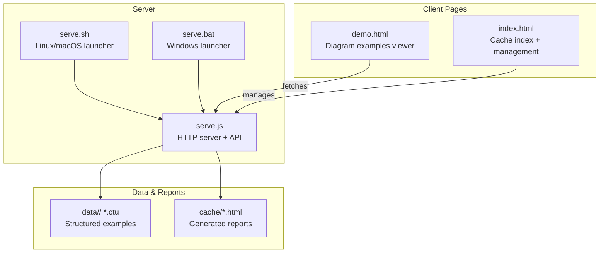
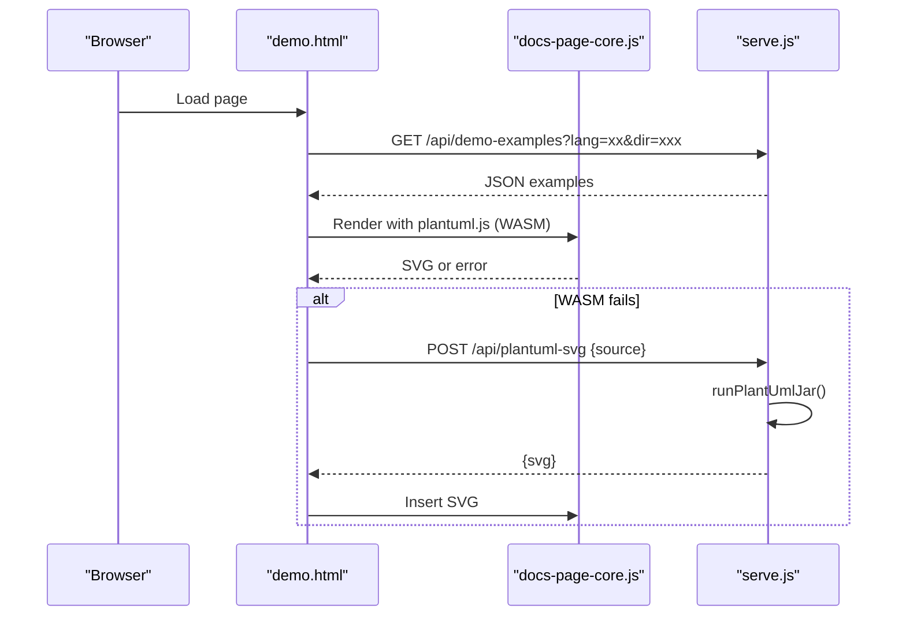
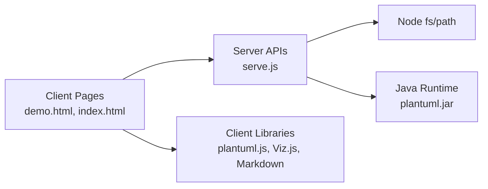

# Server Infrastructure

<cite>
**Referenced Files in This Document**
- [serve.js](file://serve.js)
- [serve.sh](file://serve.sh)
- [serve.bat](file://serve.bat)
- [README.md](file://README.md)
- [index.html](file://index.html)
- [demo.html](file://demo.html)
- [demo.js](file://demo.js)
- [docs-page-core.js](file://component/docs-page-core.js)
- [cache-html-api.test.js](file://test/cache-html-api.test.js)
- [install.js](file://install.js)
- [i18n-config.js](file://i18n-config.js)
</cite>

## Table of Contents
1. [Introduction](#introduction)
2. [Project Structure](#project-structure)
3. [Core Components](#core-components)
4. [Architecture Overview](#architecture-overview)
5. [Detailed Component Analysis](#detailed-component-analysis)
6. [Dependency Analysis](#dependency-analysis)
7. [Performance Considerations](#performance-considerations)
8. [Troubleshooting Guide](#troubleshooting-guide)
9. [Conclusion](#conclusion)
10. [Appendices](#appendices)

## Introduction
This document describes the Node.js development server that powers the in-browser UML diagram showcase and report generation. It covers the API endpoints for loading diagram examples, server-side PlantUML rendering, and cache management. It also documents the file management system for CTU data files and generated HTML reports, cross-platform server setup scripts, development server configuration, static file serving, client-server rendering relationship, deployment considerations, environment configuration, and maintenance procedures.

## Project Structure
The server is implemented as a single-file Node.js HTTP server with companion shell scripts for cross-platform startup. Static assets and generated reports live under cache/ and data/ directories. The client-side pages (demo.html and index.html) integrate with the server via JSON APIs.

**Diagram sources**
- [serve.js:454-561](file://serve.js#L454-L561)
- [serve.sh:1-54](file://serve.sh#L1-L54)
- [serve.bat:1-33](file://serve.bat#L1-L33)
- [demo.html:1-116](file://demo.html#L1-L116)
- [index.html:1-404](file://index.html#L1-L404)

**Section sources**
- [README.md:166-198](file://README.md#L166-L198)
- [serve.js:8-24](file://serve.js#L8-L24)

## Core Components
- Development server: A minimal HTTP server that serves static files and exposes JSON APIs for diagram examples, PlantUML rendering, and cache management.
- Cross-platform launchers: Shell scripts for Linux/macOS and Windows batch files to start the server in foreground or background modes, with port detection and PID management.
- Client integration: Two SPAs that call server APIs to populate content and manage cached HTML reports.

Key responsibilities:
- Static file serving with path safety checks.
- Parsing CTU files into diagram examples for the demo viewer.
- Server-side PlantUML rendering via Java-based plantuml.jar with automatic fallback.
- Listing, deleting, and clearing generated HTML reports and associated data directories.

**Section sources**
- [serve.js:454-561](file://serve.js#L454-L561)
- [serve.sh:1-54](file://serve.sh#L1-L54)
- [serve.bat:1-33](file://serve.bat#L1-L33)
- [README.md:202-224](file://README.md#L202-L224)

## Architecture Overview
The rendering pipeline prioritizes client-side WASM rendering for speed and responsiveness, with automatic fallback to server-side rendering when needed.

**Diagram sources**
- [demo.html:1-116](file://demo.html#L1-L116)
- [demo.js:174-185](file://demo.js#L174-L185)
- [docs-page-core.js:404-433](file://component/docs-page-core.js#L404-L433)
- [serve.js:56-88](file://serve.js#L56-L88)

## Detailed Component Analysis

### Development Server (serve.js)
The server is a single HTTP module with:
- Port/host configuration from CLI or environment.
- Static file serving with path traversal protection.
- API endpoints:
  - GET /api/demo-examples: Loads CTU files and returns parsed examples.
  - POST /api/plantuml-svg: Renders PlantUML source via plantuml.jar and returns SVG.
  - GET /api/cache-html: Lists generated HTML reports in cache/.
  - DELETE /api/cache-html: Deletes a specific HTML report and its matching data directory.
  - DELETE /api/cache-html/all: Clears generated HTML and non-demo data directories.

Security and safety:
- Path traversal checks for static and cache operations.
- Request body size limits.
- Strict MIME type mapping for static assets.
- Controlled error responses with HTTP status codes.

Rendering logic:
- CTU parsing supports multilingual examples and separates metadata blocks.
- PlantUML rendering spawns java -jar plantuml.jar with --svg -pipe and validates SVG output.

**Section sources**
- [serve.js:8-24](file://serve.js#L8-L24)
- [serve.js:32-35](file://serve.js#L32-L35)
- [serve.js:37-54](file://serve.js#L37-L54)
- [serve.js:56-88](file://serve.js#L56-L88)
- [serve.js:90-170](file://serve.js#L90-L170)
- [serve.js:193-215](file://serve.js#L193-L215)
- [serve.js:217-260](file://serve.js#L217-L260)
- [serve.js:262-302](file://serve.js#L262-L302)
- [serve.js:304-395](file://serve.js#L304-L395)
- [serve.js:397-452](file://serve.js#L397-L452)
- [serve.js:454-561](file://serve.js#L454-L561)

### Cross-Platform Launchers (serve.sh, serve.bat)
- Determine free ports, check for existing processes, and optionally kill them.
- Start Node.js server in foreground or background with logging and PID tracking.
- Provide platform-specific commands to find and stop processes occupying the port.

Usage:
- ./serve.sh [port] [--fg|--bg]
- serve.bat [port] [--fg|--bg]

**Section sources**
- [serve.sh:1-54](file://serve.sh#L1-L54)
- [serve.bat:1-33](file://serve.bat#L1-L33)

### Client Integration: Demo Viewer (demo.html, demo.js)
- demo.html loads the demo interface and initializes scripts.
- demo.js:
  - Fetches examples from /api/demo-examples.
  - Renders diagrams using plantuml.js (WASM) with failure handling.
  - Falls back to /api/plantuml-svg when WASM fails.
  - Provides UI actions: copy source, copy SVG, download SVG, lightbox preview.

**Section sources**
- [demo.html:1-116](file://demo.html#L1-L116)
- [demo.js:174-185](file://demo.js#L174-L185)
- [demo.js:374-439](file://demo.js#L374-L439)
- [docs-page-core.js:404-433](file://component/docs-page-core.js#L404-L433)

### Client Integration: Cache Index (index.html)
- index.html provides a UI to list, delete, and clear generated HTML reports.
- Uses /api/cache-html and /api/cache-html/all to manage cache.

**Section sources**
- [index.html:262-400](file://index.html#L262-L400)

### API Reference

- GET /api/demo-examples
  - Purpose: Load parsed diagram examples from CTU files.
  - Query parameters:
    - lang: en | zh (default en)
    - dir: data subdirectory (default demo)
  - Response: JSON object keyed by diagram type with arrays of example items.

- POST /api/plantuml-svg
  - Purpose: Server-side PlantUML rendering fallback.
  - Body: Plain text PlantUML source.
  - Response: { svg: string } containing SVG markup.

- GET /api/cache-html
  - Purpose: List generated HTML reports in cache/.
  - Response: { files: [ { name, path, href, size, modifiedMs }, ... ] }

- DELETE /api/cache-html
  - Purpose: Delete a specific HTML report and its matching data directory.
  - Body: { path: "cache/..." }
  - Response: { cachePath, dataDir }

- DELETE /api/cache-html/all
  - Purpose: Clear generated HTML files and non-demo data directories.
  - Response: { deletedHtml, deletedDataDirs }

Security notes:
- Path traversal is prevented for cache operations.
- Template files cannot be deleted.
- Non-HTML cache entries are ignored by clear operations.

**Section sources**
- [README.md:202-224](file://README.md#L202-L224)
- [serve.js:459-470](file://serve.js#L459-L470)
- [serve.js:472-496](file://serve.js#L472-L496)
- [serve.js:498-507](file://serve.js#L498-L507)
- [serve.js:509-529](file://serve.js#L509-L529)
- [serve.js:531-540](file://serve.js#L531-L540)
- [cache-html-api.test.js:116-132](file://test/cache-html-api.test.js#L116-L132)
- [cache-html-api.test.js:144-150](file://test/cache-html-api.test.js#L144-L150)
- [cache-html-api.test.js:152-158](file://test/cache-html-api.test.js#L152-L158)
- [cache-html-api.test.js:160-170](file://test/cache-html-api.test.js#L160-L170)

### File Management System (CTU and HTML Reports)
- CTU data files:
  - Stored under data/<project>/ with naming convention {type}--{id}_{lang}.ctu.
  - Parsed into diagram examples with metadata and multilingual support.
- Generated HTML reports:
  - Stored under cache/<name>.html.
  - Optionally paired with a data/<name>/ directory containing related artifacts.
  - Managed via cache index UI and API endpoints.

**Section sources**
- [README.md:135-163](file://README.md#L135-L163)
- [serve.js:304-395](file://serve.js#L304-L395)
- [serve.js:217-260](file://serve.js#L217-L260)
- [serve.js:262-302](file://serve.js#L262-L302)

### Static File Serving
- Root path resolves to index.html; directories are served as demo.html if present.
- MIME types are mapped per extension.
- Path traversal protection ensures requests stay within project root.

**Section sources**
- [serve.js:397-452](file://serve.js#L397-L452)

### Environment Configuration and Maintenance
- Port management:
  - PORT environment variable or CLI argument; defaults to 5401.
- Project root:
  - CTU_HOME can be set via install.js to register the project path for AI agent integration.
- Maintenance:
  - Use cache index UI or /api/cache-html/all to clear generated content.
  - Use serve.sh/serve.bat to start/stop the server across platforms.

**Section sources**
- [README.md:226-234](file://README.md#L226-L234)
- [install.js:1-228](file://install.js#L1-L228)

## Dependency Analysis
The server depends on Node.js built-ins and external tools:
- Node.js modules: fs, path, http, child_process.
- External tool: Java runtime for plantuml.jar.
- Client libraries: plantuml.js (WASM), Viz.js for graph layout, Markdown parser.

**Diagram sources**
- [serve.js:3-6](file://serve.js#L3-L6)
- [serve.js:56-88](file://serve.js#L56-L88)
- [demo.html:79-89](file://demo.html#L79-L89)

**Section sources**
- [serve.js:3-6](file://serve.js#L3-L6)
- [README.md:66-77](file://README.md#L66-L77)

## Performance Considerations
- Prefer client-side WASM rendering for most diagrams to avoid server round trips.
- Large diagrams may trigger fallback scaling; consider simplifying complex diagrams or using server rendering intentionally.
- Cache index operations are synchronous filesystem scans; keep cache directories lean for faster listing.
- Static file serving streams content; ensure adequate disk I/O for concurrent clients.

## Troubleshooting Guide
Common issues and resolutions:
- Port already in use:
  - Use serve.sh/serve.bat to stop existing processes or choose another port.
- PlantUML rendering failures:
  - Verify Java availability and plantuml.jar presence.
  - Confirm server is reachable at /api/plantuml-svg when using fallback.
- Path traversal errors:
  - Ensure cache paths are within cache/ and refer to .html files.
- CORS/file:// restrictions:
  - Jar fallback requires HTTP access; open via http://localhost:PORT, not file://.

**Section sources**
- [serve.sh:8-33](file://serve.sh#L8-L33)
- [serve.bat:10-15](file://serve.bat#L10-L15)
- [docs-page-core.js:404-433](file://component/docs-page-core.js#L404-L433)
- [serve.js:193-215](file://serve.js#L193-L215)

## Conclusion
The server infrastructure provides a lightweight, cross-platform development environment for browsing diagram examples, generating reports from CTU data, and managing cached HTML outputs. Its design emphasizes fast client-side rendering with reliable server-side fallback and robust file management.

## Appendices

### API Usage Examples
- Load examples for a specific language and data directory:
  - GET /api/demo-examples?lang=en&dir=s20-comprehensive
- Render a PlantUML diagram server-side:
  - POST /api/plantuml-svg with body containing PlantUML source text
- Manage cache:
  - GET /api/cache-html to list reports
  - DELETE /api/cache-html with { path: "cache/report.html" }
  - DELETE /api/cache-html/all to clear generated content

**Section sources**
- [README.md:202-224](file://README.md#L202-L224)
- [demo.js:174-185](file://demo.js#L174-L185)
- [docs-page-core.js:404-433](file://component/docs-page-core.js#L404-L433)
- [index.html:285-398](file://index.html#L285-L398)

### Integration Patterns
- CI/CD: Use serve.sh to start the server on ephemeral ports for preview deployments.
- AI agent integration: Configure CTU_HOME via install.js to enable agent skills.
- Local development: Use serve.sh/serve.bat to quickly spin up the server and open demo.html or index.html.

**Section sources**
- [README.md:81-120](file://README.md#L81-L120)
- [install.js:204-228](file://install.js#L204-L228)