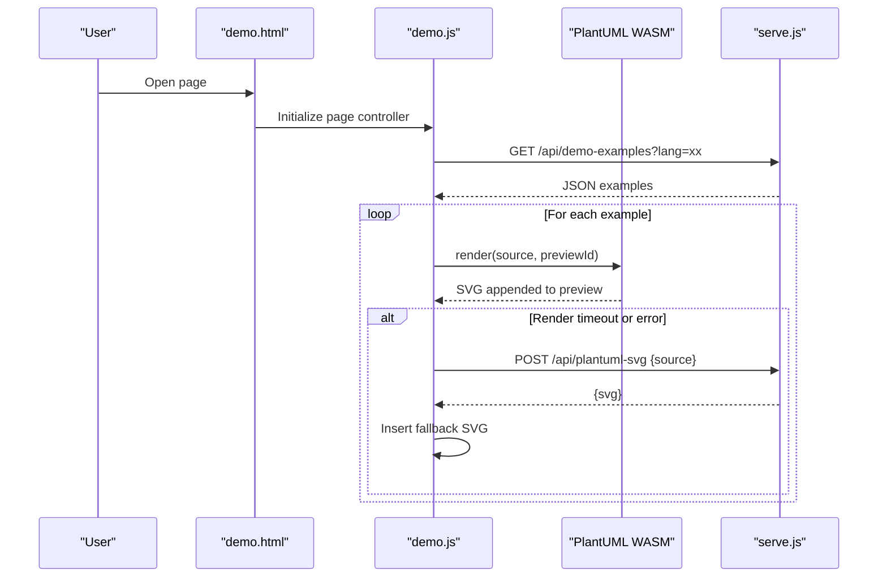
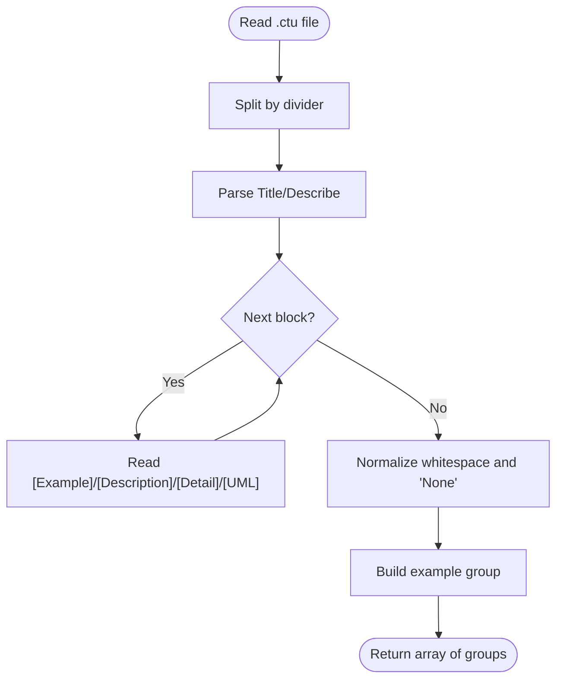
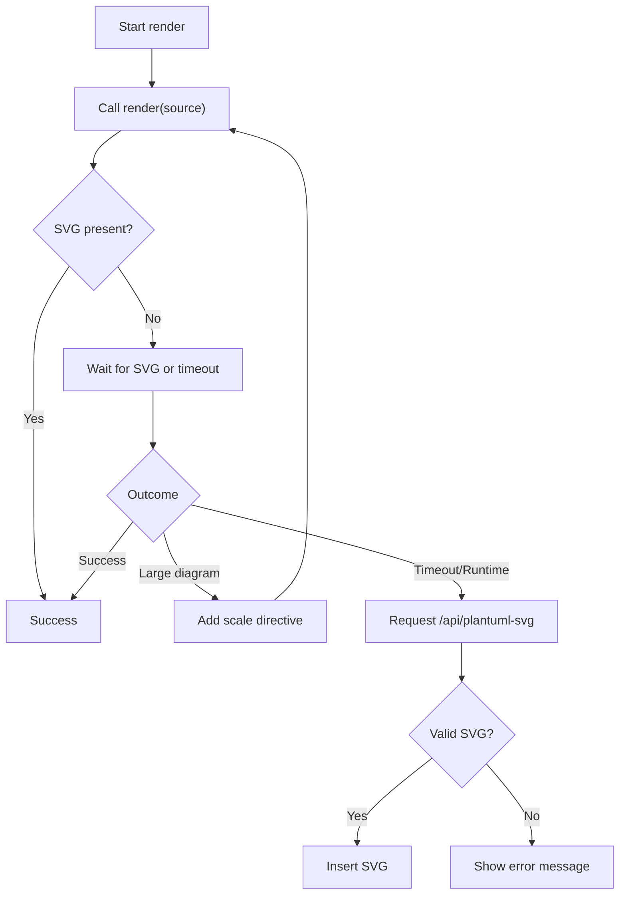
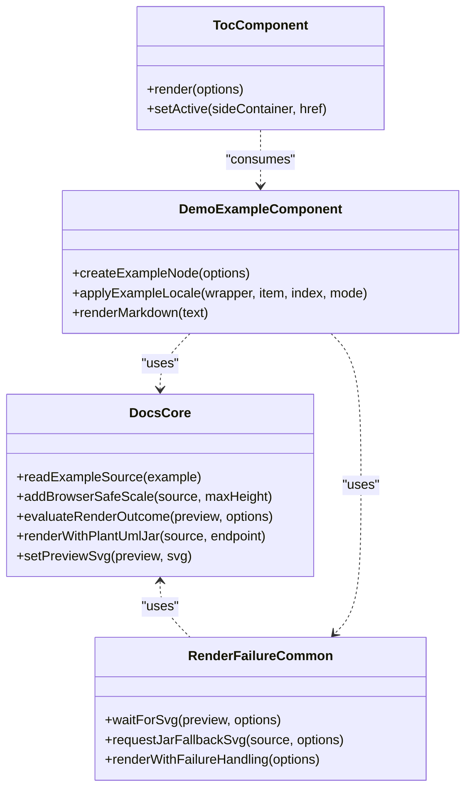
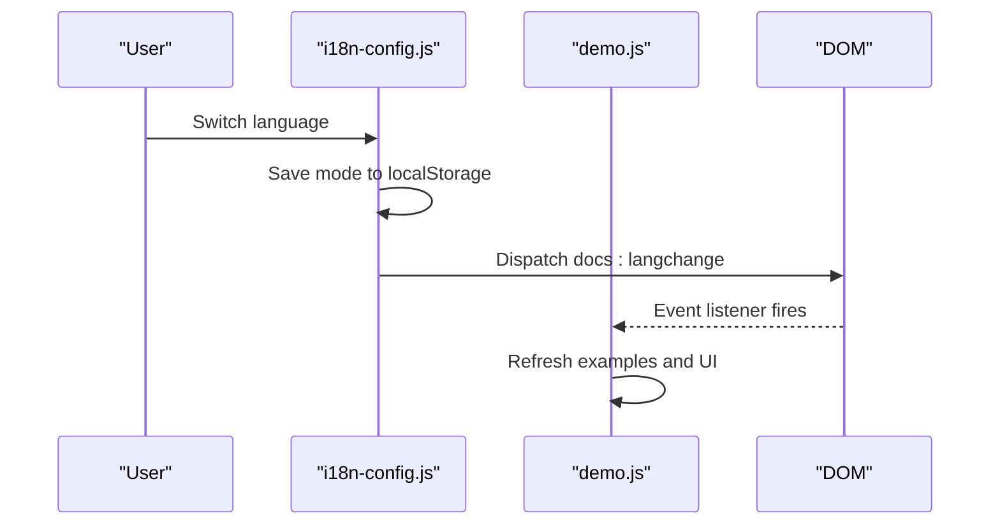
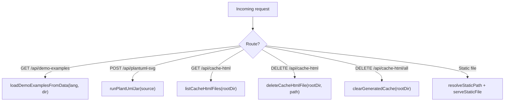
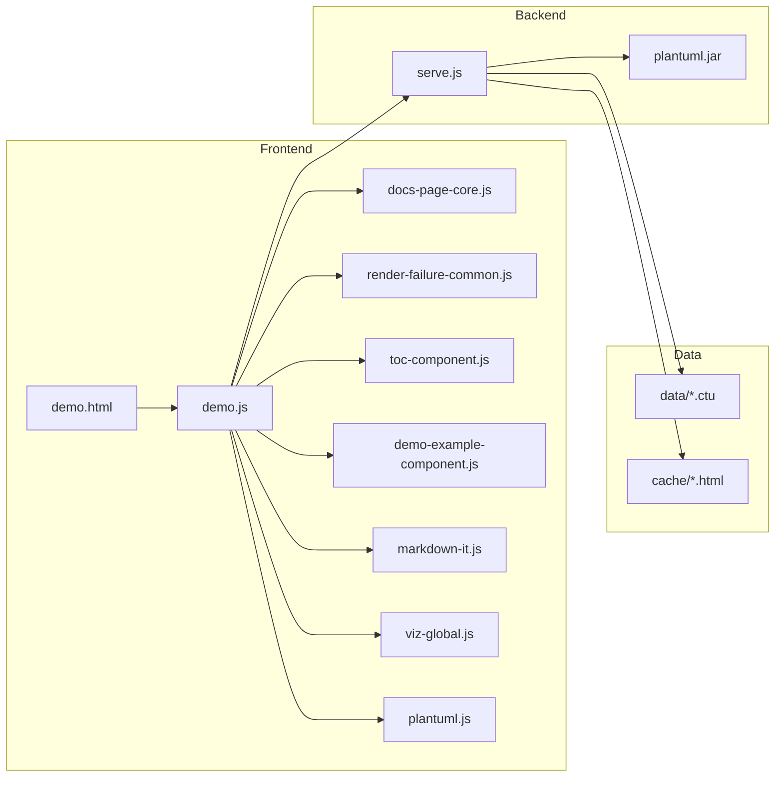

# System Design

<cite>
**Referenced Files in This Document**
- [README.md](file://README.md)
- [serve.js](file://serve.js)
- [demo.html](file://demo.html)
- [demo.js](file://demo.js)
- [index.html](file://index.html)
- [install-ctu-home.js](file://install-ctu-home.js)
- [component/docs-page-core.js](file://component/docs-page-core.js)
- [component/render-failure-common.js](file://component/render-failure-common.js)
- [component/toc-component.js](file://component/toc-component.js)
- [component/demo-example-component.js](file://component/demo-example-component.js)
- [i18n-config.js](file://i18n-config.js)
- [main.css](file://main.css)
- [data/_TEMPLATE.ctu](file://data/_TEMPLATE.ctu)
- [cache/_TEMPLATE.html](file://cache/_TEMPLATE.html)
</cite>

## Table of Contents
1. [Introduction](#introduction)
2. [Project Structure](#project-structure)
3. [Core Components](#core-components)
4. [Architecture Overview](#architecture-overview)
5. [Detailed Component Analysis](#detailed-component-analysis)
6. [Dependency Analysis](#dependency-analysis)
7. [Performance Considerations](#performance-considerations)
8. [Troubleshooting Guide](#troubleshooting-guide)
9. [Conclusion](#conclusion)
10. [Appendices](#appendices)

## Introduction
Code-To-UML is a browser-first system that renders PlantUML diagrams entirely in the client with a robust fallback to server-side rendering. It separates concerns cleanly:
- Data: .ctu files containing diagram examples and metadata
- Presentation: HTML templates and CSS
- Logic: Modular JavaScript components orchestrating rendering, internationalization, and UI interactions

The system supports both local development (static HTML + Node.js dev server) and production-like environments by serving static assets with a simple HTTP server. It emphasizes zero build tools, zero npm dependencies, and immediate usability.

## Project Structure
The repository organizes functionality by responsibility and runtime boundary:
- Root HTML pages: demo.html (interactive showcase), index.html (cache index)
- Data: data/ (CTU files), cache/ (generated report HTML)
- Components: component/ (modular UI/logic), js/ (libraries), i18n/ (language resources)
- Server: serve.js (lightweight dev server), install-ctu-home.js (agent integration helper)
- Styles: main.css (theme and layout)
- Documentation: README.md, SKILL.md, and agent guides

```mermaid
graph TB
subgraph "Browser Runtime"
A["demo.html<br/>Root SPA"]
B["demo.js<br/>Page controller"]
C["component/*<br/>UI/logic modules"]
D["i18n-config.js<br/>Language runtime"]
E["main.css<br/>Styling"]
end
subgraph "Server Runtime"
S["serve.js<br/>Dev HTTP server"]
end
subgraph "Data Layer"
T[".ctu files<br/>data/"]
U["Generated HTML<br/>cache/"]
end
A --> B
B --> C
B --> D
A --> E
B --> |"fetch() /api/...| S
S --> T
S --> U
```

**Diagram sources**
- [demo.html:1-116](file://demo.html#L1-L116)
- [demo.js:1-816](file://demo.js#L1-L816)
- [serve.js:1-567](file://serve.js#L1-L567)
- [main.css:1-200](file://main.css#L1-L200)

**Section sources**
- [README.md:166-198](file://README.md#L166-L198)
- [demo.html:1-116](file://demo.html#L1-L116)
- [index.html:1-404](file://index.html#L1-L404)

## Core Components
- Data parser and loader: serve.js reads .ctu files, parses them into structured examples, and exposes them via /api/demo-examples
- Rendering pipeline: demo.js orchestrates client-side PlantUML WASM rendering with a fallback to /api/plantuml-svg
- UI components: modular modules encapsulate core rendering logic, failure handling, TOC, and example card rendering
- Internationalization: i18n-config.js manages language mode, persistence, and DOM updates
- Presentation: HTML templates define structure; main.css provides theming and responsive layout

Key responsibilities:
- Data: .ctu parsing, grouping, localization, and API exposure
- Logic: render orchestration, error detection, retry logic, and UI synchronization
- Presentation: HTML templates, CSS, and component composition

**Section sources**
- [serve.js:90-170](file://serve.js#L90-L170)
- [demo.js:174-185](file://demo.js#L174-L185)
- [component/docs-page-core.js:1-464](file://component/docs-page-core.js#L1-L464)
- [component/render-failure-common.js:1-249](file://component/render-failure-common.js#L1-L249)
- [component/toc-component.js:1-84](file://component/toc-component.js#L1-L84)
- [component/demo-example-component.js:1-159](file://component/demo-example-component.js#L1-L159)
- [i18n-config.js:1-58](file://i18n-config.js#L1-L58)
- [main.css:1-200](file://main.css#L1-L200)

## Architecture Overview
The system follows a browser-first rendering strategy with a WASM-based primary renderer and a Java-based fallback:
- Primary path: client loads .ctu examples via /api/demo-examples, renders PlantUML via plantuml.js (WASM), displays SVG
- Fallback path: if client rendering fails or times out, request /api/plantuml-svg to server-side plantuml.jar
- Error handling: robust detection of runtime failures, SVG error panels, and user-friendly messages



**Diagram sources**
- [demo.js:174-439](file://demo.js#L174-L439)
- [serve.js:459-496](file://serve.js#L459-L496)

**Section sources**
- [README.md:237-274](file://README.md#L237-L274)
- [demo.js:374-439](file://demo.js#L374-L439)
- [serve.js:459-496](file://serve.js#L459-L496)

## Detailed Component Analysis

### Data Layer (.ctu files and API)
- .ctu format: header (Title, Describe), multiple example blocks separated by a long divider, each with [Example], [Description], [UML], [Detail]
- Parser: serve.js parseCtuGroups splits and normalizes blocks, builds arrays of examples with localized fields
- API: /api/demo-examples returns grouped examples keyed by diagram type; supports lang and dir query params



**Diagram sources**
- [serve.js:90-170](file://serve.js#L90-L170)
- [data/_TEMPLATE.ctu:1-46](file://data/_TEMPLATE.ctu#L1-L46)

**Section sources**
- [serve.js:90-170](file://serve.js#L90-L170)
- [data/_TEMPLATE.ctu:1-46](file://data/_TEMPLATE.ctu#L1-L46)

### Rendering Pipeline (Client + Fallback)
- Client rendering: demo.js invokes renderWithFailureHandling, which renders via plantuml.js and waits for SVG
- Failure detection: evaluateRenderOutcome checks for SVG presence, error markers, and runtime signals
- Large diagrams: adds a browser-safe scale directive and retries client-side
- Fallback: requests /api/plantuml-svg and inserts returned SVG



**Diagram sources**
- [demo.js:395-439](file://demo.js#L395-L439)
- [component/render-failure-common.js:160-237](file://component/render-failure-common.js#L160-L237)
- [component/docs-page-core.js:25-35](file://component/docs-page-core.js#L25-L35)

**Section sources**
- [demo.js:374-439](file://demo.js#L374-L439)
- [component/render-failure-common.js:160-237](file://component/render-failure-common.js#L160-L237)
- [component/docs-page-core.js:25-35](file://component/docs-page-core.js#L25-L35)

### UI Component Architecture
Modular components encapsulate distinct responsibilities:
- Docs Core: reading example source, adding safe scaling, evaluating outcomes, and fallback HTTP
- Render Failure Common: waiting for SVG, retry logic, and applying fallback SVG
- TOC Component: building and synchronizing a scroll-synced table of contents
- Demo Example Component: creating example cards, markdown rendering, and action handlers



**Diagram sources**
- [component/docs-page-core.js:1-464](file://component/docs-page-core.js#L1-L464)
- [component/render-failure-common.js:1-249](file://component/render-failure-common.js#L1-L249)
- [component/toc-component.js:1-84](file://component/toc-component.js#L1-L84)
- [component/demo-example-component.js:1-159](file://component/demo-example-component.js#L1-L159)

**Section sources**
- [component/docs-page-core.js:1-464](file://component/docs-page-core.js#L1-L464)
- [component/render-failure-common.js:1-249](file://component/render-failure-common.js#L1-L249)
- [component/toc-component.js:1-84](file://component/toc-component.js#L1-L84)
- [component/demo-example-component.js:1-159](file://component/demo-example-component.js#L1-L159)

### Internationalization and Theming
- Language runtime: i18n-config.js persists mode in localStorage, dispatches docs:langchange, and applies translations
- Demo page: demo.js listens for docs:langchange, reloads examples, and re-applies localized strings
- Styling: main.css defines CSS custom properties for themes and responsive layout



**Diagram sources**
- [i18n-config.js:1-58](file://i18n-config.js#L1-L58)
- [demo.js:131-144](file://demo.js#L131-L144)

**Section sources**
- [i18n-config.js:1-58](file://i18n-config.js#L1-L58)
- [demo.js:131-144](file://demo.js#L131-L144)
- [main.css:1-200](file://main.css#L1-L200)

### Server Responsibilities
- Static file serving: resolves paths safely, serves HTML/CSS/JS/WASM
- API endpoints:
  - GET /api/demo-examples: returns parsed examples for a language and data directory
  - POST /api/plantuml-svg: server-side rendering via plantuml.jar (requires Java)
  - GET /api/cache-html: lists generated HTML files in cache/
  - DELETE /api/cache-html: deletes a specific file and its matching data folder
  - DELETE /api/cache-html/all: clears generated cache and non-demo data folders



**Diagram sources**
- [serve.js:454-561](file://serve.js#L454-L561)

**Section sources**
- [serve.js:454-561](file://serve.js#L454-L561)

### Dual-Mode Operation
- Local development: open demo.html or index.html directly; demos work via local static files; server APIs are available via ./serve.sh or node serve.js
- Production-like: serve static files with any HTTP server; ensure /api/plantuml-svg is reachable for fallback rendering

**Section sources**
- [README.md:81-120](file://README.md#L81-L120)
- [README.md:202-224](file://README.md#L202-L224)

## Dependency Analysis
- Frontend depends on:
  - PlantUML WASM (plantuml.js) for primary rendering
  - Graphviz via Viz.js for graph layouts
  - Markdown rendering via markdown-it.js
  - Component modules for cohesive UI/logic
- Backend depends on:
  - Node.js HTTP server
  - Java runtime for plantuml.jar fallback
- Data dependencies:
  - .ctu files in data/ directory
  - Generated HTML in cache/



**Diagram sources**
- [demo.html:79-90](file://demo.html#L79-L90)
- [demo.js:1-34](file://demo.js#L1-L34)
- [serve.js:1-24](file://serve.js#L1-L24)
- [README.md:66-78](file://README.md#L66-L78)

**Section sources**
- [README.md:66-78](file://README.md#L66-L78)
- [demo.html:79-90](file://demo.html#L79-L90)
- [demo.js:1-34](file://demo.js#L1-L34)
- [serve.js:1-24](file://serve.js#L1-L24)

## Performance Considerations
- WASM-first rendering minimizes server round-trips for typical diagrams
- Large diagram handling: automatic browser-safe scaling reduces memory pressure
- Debounced re-rendering: input throttling prevents excessive re-renders during editing
- Efficient DOM updates: incremental rendering and targeted preview updates
- Static asset delivery: serve.js provides proper MIME types and HEAD support for caching

[No sources needed since this section provides general guidance]

## Troubleshooting Guide
Common issues and resolutions:
- Jar fallback not available: ensure server is running locally and /api/plantuml-svg is reachable; opening via file:// protocol disables fallback
- Empty or invalid SVG: verify PlantUML source syntax; check for runtime exceptions captured by the error buffer
- Timeout waiting for preview: large diagrams may require scaling or server fallback
- Cache index errors: confirm Node server is running and cache directory exists

**Section sources**
- [component/docs-page-core.js:377-402](file://component/docs-page-core.js#L377-L402)
- [component/render-failure-common.js:86-115](file://component/render-failure-common.js#L86-L115)
- [index.html:352-363](file://index.html#L352-L363)

## Conclusion
Code-To-UML achieves a clean separation of concerns with a browser-first rendering model and a resilient fallback strategy. Its modular component architecture, combined with a straightforward data format and minimal runtime dependencies, delivers an easy-to-use, interactive UML authoring and viewing experience suitable for both local development and production deployment.

[No sources needed since this section summarizes without analyzing specific files]

## Appendices

### Technology Stack
- Server: Node.js lightweight dev server
- Runtime: Vanilla ES6+ JavaScript
- Rendering: PlantUML WASM (primary), plantuml.jar (fallback)
- Graph layout: Viz.js (Graphviz)
- Data format: .ctu structured text
- Internationalization: custom JS with localStorage persistence
- Styling: CSS3 with custom properties

**Section sources**
- [README.md:66-78](file://README.md#L66-L78)

### System Boundaries and Integration Points
- Internal boundaries:
  - Data ingestion: .ctu parsing and API exposure
  - Rendering boundary: WASM vs server fallback
  - UI boundary: component modules and templates
- External integrations:
  - Java runtime for plantuml.jar
  - Static file server for production
  - AI agents via CTU_HOME integration

**Section sources**
- [README.md:81-87](file://README.md#L81-L87)
- [install-ctu-home.js:1-228](file://install-ctu-home.js#L1-L228)
- [serve.js:56-88](file://serve.js#L56-L88)