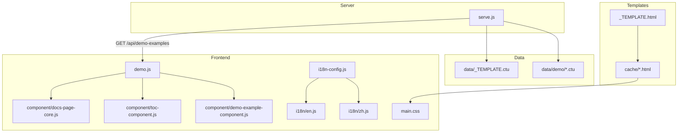
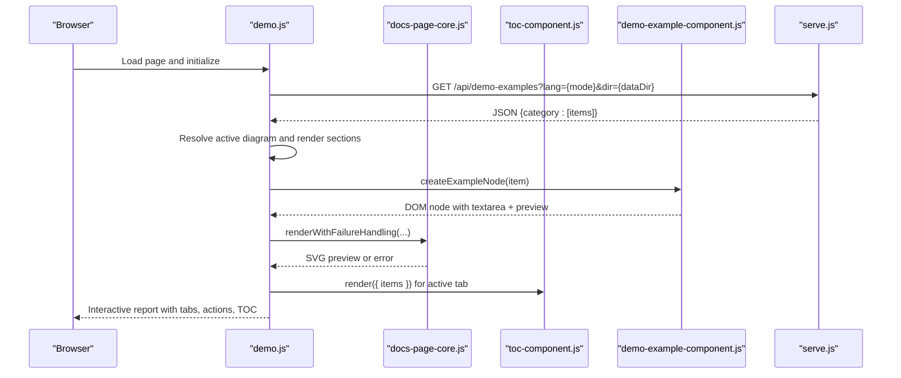
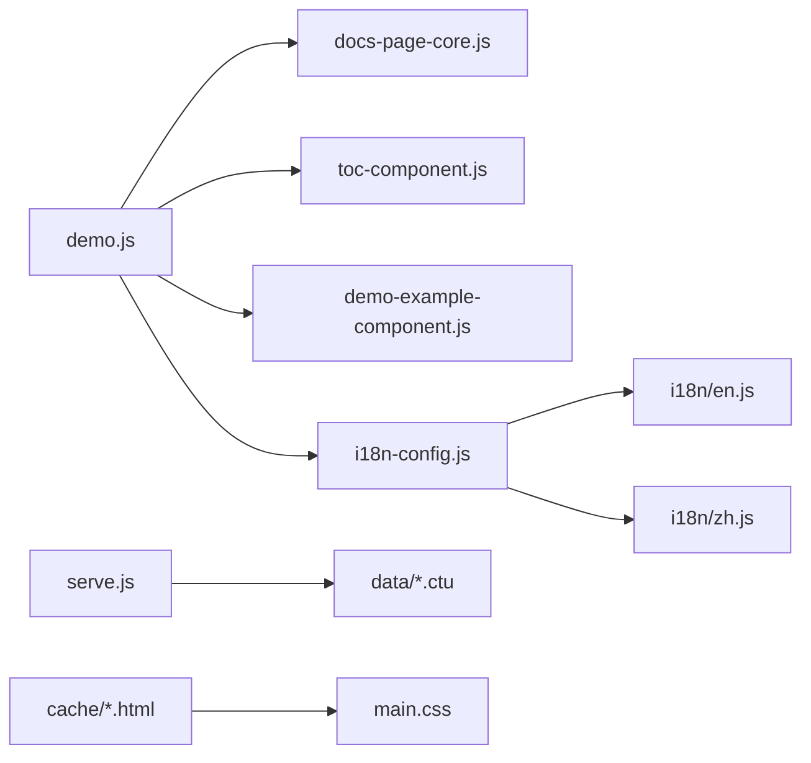

# Template Architecture

<cite>
**Referenced Files in This Document**
- [cache/_TEMPLATE.html](file://cache/_TEMPLATE.html)
- [data/_TEMPLATE.ctu](file://data/_TEMPLATE.ctu)
- [serve.js](file://serve.js)
- [demo.js](file://demo.js)
- [main.css](file://main.css)
- [component/docs-page-core.js](file://component/docs-page-core.js)
- [component/toc-component.js](file://component/toc-component.js)
- [component/demo-example-component.js](file://component/demo-example-component.js)
- [i18n/en.js](file://i18n/en.js)
- [i18n/zh.js](file://i18n/zh.js)
- [i18n-config.js](file://i18n-config.js)
- [data/demo/sequence--1_en.ctu](file://data/demo/sequence--1_en.ctu)
- [data/demo/activity--1_en.ctu](file://data/demo/activity--1_en.ctu)
- [index.html](file://index.html)
</cite>

## Table of Contents
1. [Introduction](#introduction)
2. [Project Structure](#project-structure)
3. [Core Components](#core-components)
4. [Architecture Overview](#architecture-overview)
5. [Detailed Component Analysis](#detailed-component-analysis)
6. [Dependency Analysis](#dependency-analysis)
7. [Performance Considerations](#performance-considerations)
8. [Troubleshooting Guide](#troubleshooting-guide)
9. [Conclusion](#conclusion)
10. [Appendices](#appendices)

## Introduction
This document explains the template architecture used to generate interactive, data-driven HTML reports. It covers the dual-template approach:
- Data layer: .ctu files define structured content and PlantUML sources.
- Presentation layer: HTML templates (including the shared _TEMPLATE.html) render the data into interactive, localized pages.

The system converts .ctu files into JSON payloads consumed by the frontend, which then renders UML diagrams, supports localization, theming via CSS custom properties, and dynamic content injection. It also documents template inheritance patterns, localization support, and customization options.

## Project Structure
The template system spans several directories and files:
- cache/: Generated HTML report pages (one per report) inheriting from the shared template.
- data/: Source data organized by report directories; each contains .ctu files grouped by category and language.
- component/: Reusable frontend components for rendering, TOC, and example cards.
- i18n/: Localization dictionaries for English and Chinese.
- js/: Third-party libraries and PlantUML WASM runtime.
- main.css: Global theme using CSS custom properties.
- Root server and demo pages: serve.js exposes APIs; demo.js orchestrates rendering and interactivity.

**Diagram sources**
- [serve.js:454-561](file://serve.js#L454-L561)
- [cache/_TEMPLATE.html:1-260](file://cache/_TEMPLATE.html#L1-L260)
- [demo.js:3-172](file://demo.js#L3-L172)
- [component/docs-page-core.js:1-464](file://component/docs-page-core.js#L1-L464)
- [component/toc-component.js:1-84](file://component/toc-component.js#L1-L84)
- [component/demo-example-component.js:1-159](file://component/demo-example-component.js#L1-L159)
- [i18n-config.js:1-58](file://i18n-config.js#L1-L58)
- [i18n/en.js:1-53](file://i18n/en.js#L1-L53)
- [i18n/zh.js:1-53](file://i18n/zh.js#L1-L53)
- [main.css:1-16](file://main.css#L1-L16)

**Section sources**
- [cache/_TEMPLATE.html:1-260](file://cache/_TEMPLATE.html#L1-L260)
- [data/_TEMPLATE.ctu:1-46](file://data/_TEMPLATE.ctu#L1-L46)
- [serve.js:454-561](file://serve.js#L454-L561)
- [demo.js:3-172](file://demo.js#L3-L172)
- [main.css:1-16](file://main.css#L1-L16)

## Core Components
- Template definition: _TEMPLATE.html defines the HTML skeleton, editable regions, and component hooks.
- Data definition: .ctu files define grouped examples with title, description, detail, and PlantUML source blocks.
- Server API: serve.js parses .ctu files, builds JSON payloads, and serves them via /api/demo-examples.
- Frontend orchestration: demo.js loads JSON, renders examples, manages tabs, localization, and actions.
- Components: reusable modules for rendering, TOC, and example cards.
- Theming: main.css defines CSS custom properties for a cohesive theme.
- Localization: i18n-config.js and dictionaries provide language switching and labels.

**Section sources**
- [cache/_TEMPLATE.html:132-237](file://cache/_TEMPLATE.html#L132-L237)
- [data/_TEMPLATE.ctu:1-46](file://data/_TEMPLATE.ctu#L1-L46)
- [serve.js:304-395](file://serve.js#L304-L395)
- [demo.js:146-172](file://demo.js#L146-L172)
- [component/docs-page-core.js:1-464](file://component/docs-page-core.js#L1-L464)
- [component/toc-component.js:1-84](file://component/toc-component.js#L1-L84)
- [component/demo-example-component.js:1-159](file://component/demo-example-component.js#L1-L159)
- [main.css:1-16](file://main.css#L1-L16)
- [i18n-config.js:1-58](file://i18n-config.js#L1-L58)

## Architecture Overview
The system follows a client-server model:
- Server: Reads .ctu files from data/, parses them into structured groups, and exposes a JSON API.
- Client: Loads the JSON, renders examples, and provides interactive controls (tabs, actions, TOC).
- Templates: _TEMPLATE.html defines the presentation layer; cache/*.html are generated pages inheriting the template.

**Diagram sources**
- [demo.js:174-287](file://demo.js#L174-L287)
- [component/docs-page-core.js:404-433](file://component/docs-page-core.js#L404-L433)
- [component/toc-component.js:21-64](file://component/toc-component.js#L21-L64)
- [component/demo-example-component.js:82-155](file://component/demo-example-component.js#L82-L155)
- [serve.js:459-470](file://serve.js#L459-L470)

## Detailed Component Analysis

### Template Definition: _TEMPLATE.html
- Editable regions: Titles, descriptions, and copy areas marked for customization.
- Configurable regions: Tabs and overviews mapped to .ctu categories.
- Fixed runtime dependencies: Classes, IDs, and data-* attributes required by JavaScript.
- Data convention: .ctu files stored under data/{report}/ with filenames {category}--{id}_{lang}.ctu.
- Architecture overview: Inline documentation describes the server and client roles.

Best practices:
- Preserve [FIXED] sections; only edit [EDIT] and [CONFIG] areas.
- Keep tab buttons’ data-diagram values aligned with .ctu prefixes.
- Maintain the script loading order for dependencies.

**Section sources**
- [cache/_TEMPLATE.html:14-91](file://cache/_TEMPLATE.html#L14-L91)
- [cache/_TEMPLATE.html:132-237](file://cache/_TEMPLATE.html#L132-L237)
- [cache/_TEMPLATE.html:244-257](file://cache/_TEMPLATE.html#L244-L257)

### Data Definition: .ctu Files
Structure:
- Header: Title and optional Describe.
- Groups: Separated by a long line of dashes.
- Blocks per group: [Example], [Description], [UML], [Detail].
- Special handling: “None” values are treated as empty.

Parsing behavior:
- parseCtuGroups extracts blocks and normalizes “None” to empty strings.
- loadDemoExamplesFromData reads all .ctu files in a directory, filters by language suffix, and builds a map keyed by diagram category and id.

Validation:
- Filenames must match {category}--{id}_{lang}.ctu.
- Category must match the tab’s data-diagram attribute.

**Section sources**
- [data/_TEMPLATE.ctu:1-46](file://data/_TEMPLATE.ctu#L1-L46)
- [serve.js:90-170](file://serve.js#L90-L170)
- [serve.js:304-395](file://serve.js#L304-L395)

### Server API: Template Parsing and JSON Payload
Endpoints:
- GET /api/demo-examples: Returns JSON grouped by diagram category with localized titles, descriptions, details, and PlantUML sources.

Processing pipeline:
- Directory enumeration and filename parsing.
- File reading and parseCtuGroups.
- Localization via localizeValue.
- Sorting by id and groupIndex.

Error handling:
- Graceful failures with JSON error payloads.

**Section sources**
- [serve.js:459-470](file://serve.js#L459-L470)
- [serve.js:304-395](file://serve.js#L304-L395)
- [serve.js:90-170](file://serve.js#L90-L170)
- [serve.js:172-178](file://serve.js#L172-L178)

### Frontend Orchestration: demo.js
Responsibilities:
- Initialize language mode and apply i18n.
- Bootstrap demo: load JSON, set active tab, render sections, and TOC.
- Render examples: create nodes, attach event handlers, and manage preview updates.
- Actions: copy source, copy SVG, download SVG.
- Large diagrams: auto-scale and fallback rendering.

Localization:
- Uses DocsI18n to translate labels and messages.

**Section sources**
- [demo.js:3-172](file://demo.js#L3-L172)
- [demo.js:174-287](file://demo.js#L174-L287)
- [demo.js:449-498](file://demo.js#L449-L498)
- [demo.js:728-778](file://demo.js#L728-L778)

### Components

#### docs-page-core.js
- Utilities for reading/editing example source, splitting PlantUML lines, adding safe scaling, ensuring preview IDs, building download names, and managing messages.
- Runtime error detection and buffer for PlantUML failures.
- Jar fallback rendering and outcome evaluation.

**Section sources**
- [component/docs-page-core.js:12-464](file://component/docs-page-core.js#L12-L464)

#### toc-component.js
- Renders a table of contents with active state synchronization.
- Supports both desktop and mobile layouts.

**Section sources**
- [component/toc-component.js:21-84](file://component/toc-component.js#L21-L84)

#### demo-example-component.js
- Creates example nodes with title, description, actions, source textarea, preview area, and detail message.
- Applies localization to titles and descriptions.
- Provides markdown rendering for details.

**Section sources**
- [component/demo-example-component.js:82-159](file://component/demo-example-component.js#L82-L159)

### CSS Custom Properties and Theming
- Theme variables defined in :root (e.g., --bg, --fg, --accent).
- Color-mix and var() used throughout main.css for consistent theming.
- Dark/light color-scheme preference respected.

Customization:
- Override variables in :root to adapt themes.
- Keep color-mix usage consistent for accessible contrast.

**Section sources**
- [main.css:1-16](file://main.css#L1-16)
- [main.css:26-31](file://main.css#L26-L31)

### Localization
- i18n-config.js manages language mode persistence and translation lookup.
- Dictionaries in i18n/en.js and i18n/zh.js provide labels for UI and example content.
- demo.js applies translations on load and on language change events.

**Section sources**
- [i18n-config.js:12-57](file://i18n-config.js#L12-L57)
- [i18n/en.js:4-52](file://i18n/en.js#L4-L52)
- [i18n/zh.js:4-52](file://i18n/zh.js#L4-L52)
- [demo.js:104-144](file://demo.js#L104-L144)

### Dynamic Content Injection and Actions
- Example nodes are dynamically created and appended to the examples container.
- Preview rendering is queued and debounced to optimize performance.
- Actions trigger clipboard writes and downloads.

**Section sources**
- [demo.js:237-287](file://demo.js#L237-L287)
- [demo.js:353-372](file://demo.js#L353-L372)
- [demo.js:449-498](file://demo.js#L449-L498)

### Relationship Between Templates and Generated Reports
- _TEMPLATE.html defines the shared structure.
- cache/*.html are individual report pages inheriting the template and data directory mapping.
- index.html provides a cache index page listing generated HTML files and enabling deletion.

**Section sources**
- [cache/_TEMPLATE.html:1-260](file://cache/_TEMPLATE.html#L1-260)
- [index.html:238-404](file://index.html#L238-L404)

## Dependency Analysis
High-level dependencies:
- demo.js depends on docs-page-core.js, toc-component.js, demo-example-component.js, and i18n-config.js.
- docs-page-core.js provides rendering utilities and error handling.
- toc-component.js and demo-example-component.js encapsulate UI concerns.
- serve.js depends on filesystem and child process spawning for PlantUML fallback.

**Diagram sources**
- [demo.js:3-172](file://demo.js#L3-L172)
- [component/docs-page-core.js:1-464](file://component/docs-page-core.js#L1-L464)
- [component/toc-component.js:1-84](file://component/toc-component.js#L1-L84)
- [component/demo-example-component.js:1-159](file://component/demo-example-component.js#L1-L159)
- [i18n-config.js:1-58](file://i18n-config.js#L1-L58)
- [i18n/en.js:1-53](file://i18n/en.js#L1-L53)
- [i18n/zh.js:1-53](file://i18n/zh.js#L1-L53)
- [serve.js:304-395](file://serve.js#L304-L395)
- [main.css:1-16](file://main.css#L1-L16)

**Section sources**
- [demo.js:3-172](file://demo.js#L3-L172)
- [component/docs-page-core.js:1-464](file://component/docs-page-core.js#L1-L464)
- [component/toc-component.js:1-84](file://component/toc-component.js#L1-L84)
- [component/demo-example-component.js:1-159](file://component/demo-example-component.js#L1-L159)
- [i18n-config.js:1-58](file://i18n-config.js#L1-L58)
- [i18n/en.js:1-53](file://i18n/en.js#L1-L53)
- [i18n/zh.js:1-53](file://i18n/zh.js#L1-L53)
- [serve.js:304-395](file://serve.js#L304-L395)
- [main.css:1-16](file://main.css#L1-L16)

## Performance Considerations
- Debounced rendering: Source edits are queued with a delay to avoid excessive re-renders.
- Render chaining: Promises ensure sequential rendering per generation.
- Large diagram handling: Auto-scaling reduces memory pressure and improves responsiveness.
- CSS custom properties: Centralized theming minimizes style recalculation overhead.

[No sources needed since this section provides general guidance]

## Troubleshooting Guide
Common issues and resolutions:
- Empty or missing JSON: Verify data directory and .ctu filenames match tab categories.
- Render failures: Check PlantUML syntax; the system detects errors and displays messages.
- Jar fallback errors: Ensure the server is running and /api/plantuml-svg is reachable.
- Localization not applied: Confirm i18n dictionaries and language mode persistence.

**Section sources**
- [demo.js:374-439](file://demo.js#L374-L439)
- [component/docs-page-core.js:293-355](file://component/docs-page-core.js#L293-L355)
- [component/docs-page-core.js:404-433](file://component/docs-page-core.js#L404-L433)
- [i18n-config.js:12-57](file://i18n-config.js#L12-L57)

## Conclusion
The template architecture cleanly separates data (.ctu) from presentation (_TEMPLATE.html), with a robust server that transforms structured content into JSON for the client. The frontend composes reusable components to render interactive, localized reports with dynamic content injection and theming. Following the editable/configurable/fixed conventions ensures maintainability and extensibility.

[No sources needed since this section summarizes without analyzing specific files]

## Appendices

### Template Inheritance Patterns
- _TEMPLATE.html acts as the base template; cache/*.html inherit its structure and connect to data directories.
- Tabs and overviews must align with .ctu categories to ensure proper data loading.

**Section sources**
- [cache/_TEMPLATE.html:132-237](file://cache/_TEMPLATE.html#L132-L237)

### Localization Support Details
- Language mode stored in localStorage; DocsI18n applies translations across UI and example content.
- Diagram labels and example actions are localized.

**Section sources**
- [i18n-config.js:12-57](file://i18n-config.js#L12-L57)
- [demo.js:728-778](file://demo.js#L728-L778)

### Dynamic Content Injection Details
- Example nodes are created per .ctu group; titles, descriptions, and details are injected based on language mode.
- Preview containers receive rendered SVG or error messages.

**Section sources**
- [demo.js:237-287](file://demo.js#L237-L287)
- [component/demo-example-component.js:82-155](file://component/demo-example-component.js#L82-L155)

### Validation Mechanisms
- Filename parsing validates category and id; only valid .ctu files are included.
- Section separators and block parsing enforce structure.
- Localized values fall back gracefully if missing.

**Section sources**
- [serve.js:304-395](file://serve.js#L304-L395)
- [serve.js:90-170](file://serve.js#L90-L170)

### Best Practices for Extending the Template System
- Keep tab buttons’ data-diagram values synchronized with .ctu prefixes.
- Use “None” semantics consistently for optional fields.
- Preserve [FIXED] attributes and classes required by JavaScript.
- Override CSS custom properties in :root for theme customization.
- Add new diagram categories by updating tabs and adding matching .ctu files.

**Section sources**
- [cache/_TEMPLATE.html:132-237](file://cache/_TEMPLATE.html#L132-L237)
- [data/_TEMPLATE.ctu:1-46](file://data/_TEMPLATE.ctu#L1-L46)
- [main.css:1-16](file://main.css#L1-L16)