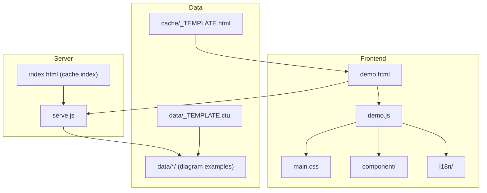
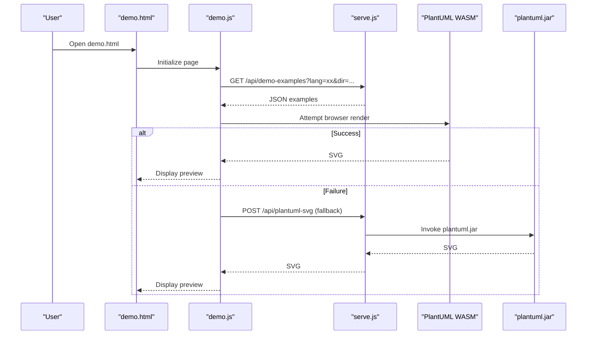
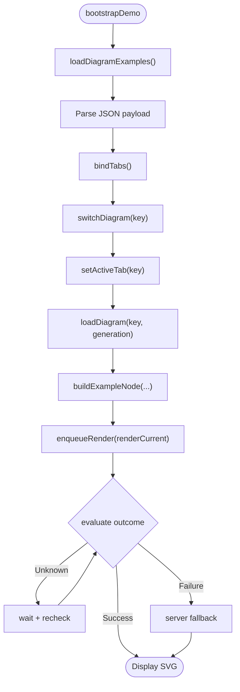
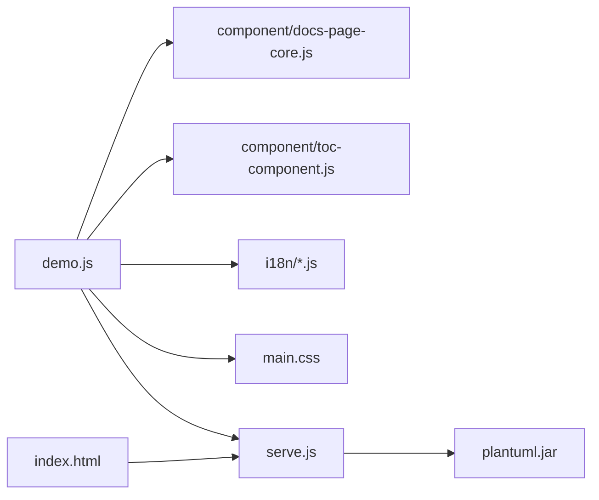

# Contributing and Development

<cite>
**Referenced Files in This Document**
- [README.md](file://README.md)
- [demo.js](file://demo.js)
- [serve.js](file://serve.js)
- [index.html](file://index.html)
- [main.css](file://main.css)
- [cache/_TEMPLATE.html](file://cache/_TEMPLATE.html)
- [data/_TEMPLATE.ctu](file://data/_TEMPLATE.ctu)
- [component/docs-page-core.js](file://component/docs-page-core.js)
- [component/toc-component.js](file://component/toc-component.js)
- [i18n/en.js](file://i18n/en.js)
- [i18n/zh.js](file://i18n/zh.js)
- [test/cache-html-api.test.js](file://test/cache-html-api.test.js)
- [test/demo-tabs-static.test.js](file://test/demo-tabs-static.test.js)
- [test/install-ctu-home.test.js](file://test/install-ctu-home.test.js)
</cite>

## Table of Contents
1. [Introduction](#introduction)
2. [Project Structure](#project-structure)
3. [Core Components](#core-components)
4. [Architecture Overview](#architecture-overview)
5. [Detailed Component Analysis](#detailed-component-analysis)
6. [Dependency Analysis](#dependency-analysis)
7. [Performance Considerations](#performance-considerations)
8. [Troubleshooting Guide](#troubleshooting-guide)
9. [Contribution Workflow](#contribution-workflow)
10. [Testing Requirements](#testing-requirements)
11. [Pull Request and Review Process](#pull-request-and-review-process)
12. [Extending Examples and Templates](#extending-examples-and-templates)
13. [Developing New UI Components](#developing-new-ui-components)
14. [Documentation Standards](#documentation-standards)
15. [Release and Versioning](#release-and-versioning)
16. [Conclusion](#conclusion)

## Introduction
This document provides a comprehensive guide for contributing to Code-To-UML. It covers development environment setup, Git workflow, branch management, code standards, testing, pull requests, UI component development, extending examples and templates, documentation standards, and the release process. The goal is to help contributors make impactful changes quickly and consistently while maintaining the project’s simplicity and reliability.

## Project Structure
Code-To-UML is a browser-first, zero-dependency project that serves static assets and a lightweight dev server. The key directories and files are:
- serve.js: Lightweight Node.js dev server with API endpoints for examples and fallback rendering.
- demo.js: Frontend controller for the demo viewer, managing tabs, examples, rendering, and internationalization.
- index.html: Cache index page listing generated HTML reports and enabling deletion/clearing.
- main.css: Central stylesheet with CSS custom properties for theming and responsive design.
- cache/_TEMPLATE.html: Reusable HTML template for generating illustrated reports from .ctu data.
- data/_TEMPLATE.ctu: Structured data template for diagram examples.
- component/: Reusable UI components (core, TOC, example card).
- i18n/: English and Chinese localization bundles.
- test/: Node-based tests validating server APIs, frontend behavior, and installation scripts.

**Diagram sources**
- [demo.js:1-800](file://demo.js#L1-L800)
- [serve.js:1-567](file://serve.js#L1-L567)
- [index.html:1-404](file://index.html#L1-L404)
- [main.css:1-804](file://main.css#L1-L804)
- [cache/_TEMPLATE.html:1-260](file://cache/_TEMPLATE.html#L1-L260)
- [data/_TEMPLATE.ctu:1-46](file://data/_TEMPLATE.ctu#L1-L46)

**Section sources**
- [README.md:166-198](file://README.md#L166-L198)

## Core Components
- Demo page controller (demo.js): Manages tab switching, example loading, rendering lifecycle, error handling, and internationalization.
- Server (serve.js): Provides API endpoints for loading examples, fallback rendering via plantuml.jar, and cache index management.
- Cache index (index.html): Lists generated HTML reports, supports deletion and bulk clearing.
- Styles (main.css): Theming via CSS custom properties and responsive breakpoints.
- Templates: cache/_TEMPLATE.html and data/_TEMPLATE.ctu define the report generation and example data conventions.
- UI components: Docs core, TOC, and example card components encapsulate shared behavior.

**Section sources**
- [demo.js:146-172](file://demo.js#L146-L172)
- [serve.js:454-561](file://serve.js#L454-L561)
- [index.html:262-399](file://index.html#L262-L399)
- [main.css:1-804](file://main.css#L1-L804)
- [cache/_TEMPLATE.html:1-260](file://cache/_TEMPLATE.html#L1-L260)
- [data/_TEMPLATE.ctu:1-46](file://data/_TEMPLATE.ctu#L1-L46)

## Architecture Overview
The system follows a WASM-first rendering strategy with automatic fallback to server-side PlantUML rendering when needed. The demo viewer fetches example data from the server, renders diagrams in the browser, and falls back to the server when necessary.

**Diagram sources**
- [demo.js:374-439](file://demo.js#L374-L439)
- [serve.js:459-496](file://serve.js#L459-L496)

## Detailed Component Analysis

### Demo Page Controller (demo.js)
Responsibilities:
- Load and parse examples from the server.
- Manage tab switching and active panel updates.
- Render diagrams with WASM and fallback to server rendering.
- Handle large diagrams by auto-scaling and lightbox interactions.
- Apply internationalization and update UI on language changes.

Key behaviors:
- Bootstrapping and error handling during example loading.
- Render queue and generation tracking to avoid stale renders.
- Failure detection and retry logic with targeted fallback.

**Diagram sources**
- [demo.js:146-287](file://demo.js#L146-L287)
- [demo.js:347-439](file://demo.js#L347-L439)

**Section sources**
- [demo.js:146-287](file://demo.js#L146-L287)
- [demo.js:347-439](file://demo.js#L347-L439)

### Server (serve.js)
Responsibilities:
- Serve static assets and dynamic pages.
- Expose API endpoints:
  - GET /api/demo-examples: Returns parsed examples grouped by diagram type.
  - POST /api/plantuml-svg: Server-side rendering fallback.
  - GET /api/cache-html: List generated HTML files.
  - DELETE /api/cache-html: Delete a specific HTML and matching data folder.
  - DELETE /api/cache-html/all: Clear generated files and non-demo data folders.
- Parse .ctu files into structured examples with multilingual support.

Security and validation:
- Path checks to prevent directory traversal.
- Reject attempts to delete the template HTML file.
- Enforce allowed file extensions and safe paths.

**Section sources**
- [serve.js:454-561](file://serve.js#L454-L561)
- [serve.js:304-395](file://serve.js#L304-L395)
- [serve.js:193-215](file://serve.js#L193-L215)

### Cache Index (index.html)
Responsibilities:
- Scan cache/ for generated HTML reports.
- Provide UI to delete individual reports and clear all generated content.
- Communicate with server endpoints to list and remove files.

**Section sources**
- [index.html:262-399](file://index.html#L262-L399)

### UI Components
- Docs core (component/docs-page-core.js): Provides utilities for reading example source, splitting PlantUML lines, adding safe scaling, building download names, detecting errors, buffering runtime errors, evaluating render outcomes, and performing server fallback rendering.
- TOC component (component/toc-component.js): Renders a side table of contents and manages active state synchronization with the viewport.

**Section sources**
- [component/docs-page-core.js:1-464](file://component/docs-page-core.js#L1-L464)
- [component/toc-component.js:1-84](file://component/toc-component.js#L1-L84)

### Internationalization
- i18n/en.js and i18n/zh.js provide localized strings for the demo page and actions.
- demo.js listens for language changes and updates UI labels and tooltips.

**Section sources**
- [i18n/en.js:1-53](file://i18n/en.js#L1-L53)
- [i18n/zh.js:1-53](file://i18n/zh.js#L1-L53)
- [demo.js:131-144](file://demo.js#L131-L144)
- [demo.js:728-778](file://demo.js#L728-L778)

## Dependency Analysis
- Frontend depends on:
  - Component modules (core, TOC, example).
  - Markdown rendering library.
  - PlantUML WASM for primary rendering.
  - Optional server fallback via /api/plantuml-svg.
- Server depends on Node.js built-ins and Java (for plantuml.jar fallback).
- Tests validate server endpoints, frontend behavior, and installation scripts.

**Diagram sources**
- [demo.js:1-30](file://demo.js#L1-L30)
- [index.html:262-399](file://index.html#L262-L399)
- [serve.js:56-88](file://serve.js#L56-L88)

**Section sources**
- [demo.js:1-30](file://demo.js#L1-L30)
- [index.html:262-399](file://index.html#L262-L399)
- [serve.js:56-88](file://serve.js#L56-L88)

## Performance Considerations
- WASM-first rendering minimizes server round-trips for most diagrams.
- Large diagrams are auto-scaled to improve rendering performance and UX.
- Render queue and generation tracking prevent redundant work and stale updates.
- Responsive CSS reduces layout thrashing and improves scrolling performance.

[No sources needed since this section provides general guidance]

## Troubleshooting Guide
Common issues and remedies:
- Browser rendering failures: The system detects runtime failures and triggers server fallback. Verify the server is reachable and the fallback endpoint is available.
- Empty or invalid SVG: Confirm the PlantUML source is valid and the diagram type is supported.
- Large diagrams: Auto-scaling is applied; if still failing, reduce complexity or split the diagram.
- Cache index errors: Ensure the server is running and cache files are within allowed paths.

**Section sources**
- [component/docs-page-core.js:178-291](file://component/docs-page-core.js#L178-L291)
- [demo.js:413-438](file://demo.js#L413-L438)

## Contribution Workflow
Development environment setup:
- Prerequisites: Node.js 18+, Java (for server fallback).
- Optional: Set CTU_HOME via install-ctu-home.js for AI agent integration.
- Start the server with ./serve.sh or node serve.js and open http://localhost:5401/demo.html.

Git workflow and branch management:
- Use feature branches for contributions.
- Keep commits focused and descriptive.
- Rebase before opening pull requests to maintain a clean history.

Local development procedures:
- Run the server locally.
- Test changes in demo.html and verify rendering behavior.
- Validate cache index operations and server endpoints.

**Section sources**
- [README.md:81-120](file://README.md#L81-L120)
- [README.md:297-306](file://README.md#L297-L306)

## Testing Requirements
Testing framework:
- Node-based tests under test/.
- Coverage includes server endpoints, frontend behavior, and installation scripts.

How to add new tests:
- Follow the pattern of existing tests:
  - Use assert for assertions.
  - Spawn the server for endpoint tests.
  - Validate behavior with temporary directories and files.
  - Ensure tests isolate state and clean up after completion.

Test categories:
- Cache HTML API: Validates listing, deletion, and clearing of generated HTML files.
- Demo tabs behavior: Ensures tab binding and switching occur before loading examples.
- Installation script: Verifies skill installation across multiple agents and profile creation.

**Section sources**
- [test/cache-html-api.test.js:1-181](file://test/cache-html-api.test.js#L1-L181)
- [test/demo-tabs-static.test.js:1-41](file://test/demo-tabs-static.test.js#L1-L41)
- [test/install-ctu-home.test.js:1-95](file://test/install-ctu-home.test.js#L1-L95)

## Pull Request and Review Process
Guidelines:
- Keep PRs small and focused.
- Include tests for new features or behavior changes.
- Update documentation (README, inline comments) when relevant.
- Ensure no console warnings or errors in demo.html after changes.

Review criteria:
- Code clarity, adherence to existing patterns.
- Backward compatibility for public APIs.
- Performance impact minimal or justified.
- Accessibility and internationalization maintained.

Merge criteria:
- At least one maintainer approval.
- All CI checks pass.
- No unresolved comments.

[No sources needed since this section provides general guidance]

## Extending Examples and Templates
Adding new diagram examples:
- Create .ctu files in data/<your-data>/ following the naming convention {category}--{id}_{lang}.ctu.
- Use data/_TEMPLATE.ctu as a reference for structure and sections.
- Place multiple examples separated by the required delimiter.

Extending the template system:
- Customize cache/_TEMPLATE.html for report pages:
  - Update titles and descriptions in [EDIT] sections.
  - Configure tabs in [CONFIG] sections to match .ctu filenames.
  - Preserve [FIXED] sections to maintain runtime behavior.

Best practices:
- Align data-diagram values with .ctu prefixes.
- Keep descriptions concise and use Markdown for readability.
- Validate examples render correctly in demo.html.

**Section sources**
- [data/_TEMPLATE.ctu:1-46](file://data/_TEMPLATE.ctu#L1-46)
- [cache/_TEMPLATE.html:132-237](file://cache/_TEMPLATE.html#L132-L237)

## Developing New UI Components
Component development guidelines:
- Encapsulate behavior in self-contained modules similar to component/docs-page-core.js and component/toc-component.js.
- Export a singleton object with public methods.
- Use semantic HTML and ARIA attributes for accessibility.
- Keep styles scoped and leverage CSS custom properties for theming.

Integration tips:
- Expose components via window namespace for demo.js to consume.
- Ensure components are loaded in the correct order in HTML.

**Section sources**
- [component/docs-page-core.js:1-464](file://component/docs-page-core.js#L1-L464)
- [component/toc-component.js:1-84](file://component/toc-component.js#L1-L84)

## Documentation Standards
Updating README and inline comments:
- Keep README concise and focused on user-facing features.
- Document new APIs and endpoints with request/response details.
- Inline comments should explain “why” and “how,” not just “what.”

Standards:
- Use sentence case for headings and titles.
- Link to related sections and external resources.
- Keep examples minimal and reproducible.

**Section sources**
- [README.md:297-306](file://README.md#L297-L306)

## Release and Versioning
Versioning strategy:
- Use semantic versioning (major.minor.patch).
- Increment major for breaking changes, minor for new features, patch for bug fixes.

Release checklist:
- Update version references in relevant files.
- Verify all tests pass.
- Confirm demo.html works as expected.
- Update changelog and README highlights.

[No sources needed since this section provides general guidance]

## Conclusion
By following this guide, contributors can confidently develop, test, and ship changes to Code-To-UML. Focus on small, well-tested contributions, maintain backward compatibility, and keep documentation up to date. Together we can expand the diagram showcase, improve rendering reliability, and enhance the developer experience.