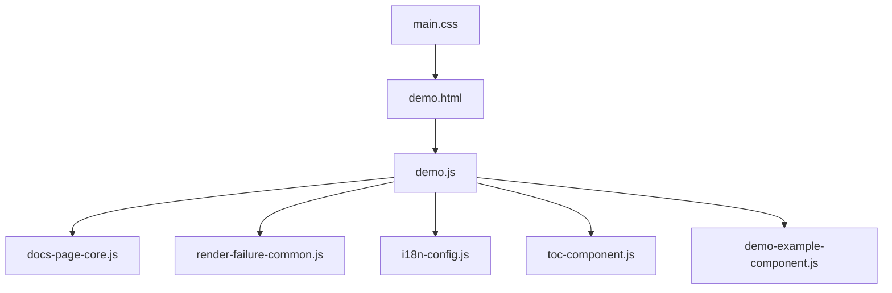
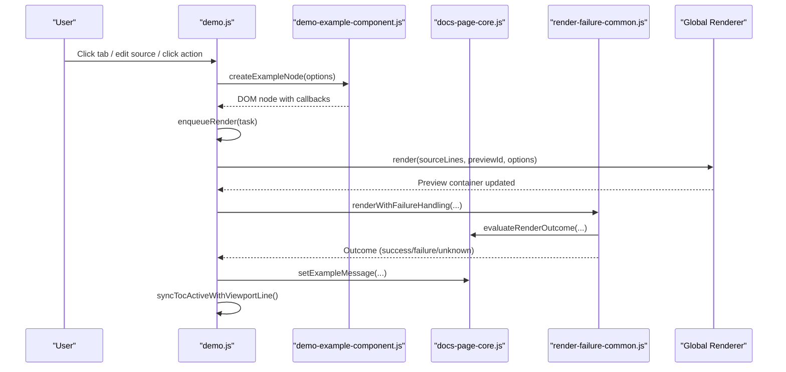
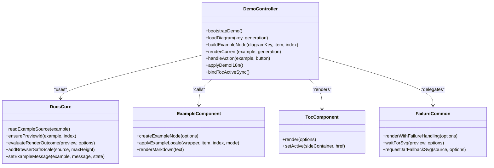
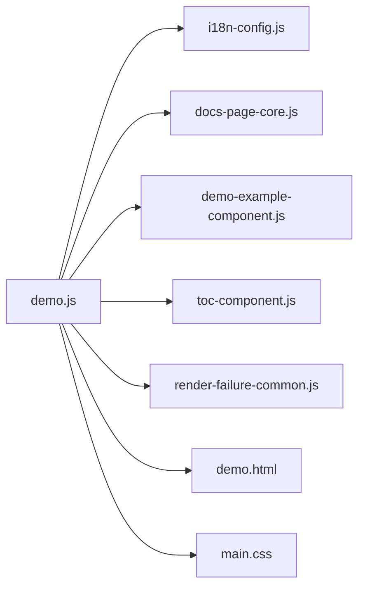

# Core Components

<cite>
**Referenced Files in This Document**
- [demo.js](file://demo.js)
- [docs-page-core.js](file://component/docs-page-core.js)
- [toc-component.js](file://component/toc-component.js)
- [demo-example-component.js](file://component/demo-example-component.js)
- [render-failure-common.js](file://component/render-failure-common.js)
- [demo.html](file://demo.html)
- [main.css](file://main.css)
- [i18n-config.js](file://i18n-config.js)
- [render-failure-common.test.js](file://test/render-failure-common.test.js)
</cite>

## Table of Contents
1. [Introduction](#introduction)
2. [Project Structure](#project-structure)
3. [Core Components](#core-components)
4. [Architecture Overview](#architecture-overview)
5. [Detailed Component Analysis](#detailed-component-analysis)
6. [Dependency Analysis](#dependency-analysis)
7. [Performance Considerations](#performance-considerations)
8. [Troubleshooting Guide](#troubleshooting-guide)
9. [Conclusion](#conclusion)

## Introduction
This document explains the core component system of Code-To-UML’s interactive demo page. It focuses on the main application controller (demo.js) and how it orchestrates UI interactions and the rendering pipeline. It also documents reusable UI components: docs-page-core.js for rendering utilities, toc-component.js for navigation, demo-example-component.js for individual diagram cards, and render-failure-common.js for robust error handling. The document covers component interfaces, event systems, data flow patterns, lifecycle management, state handling, and integration patterns. It concludes with practical usage and customization guidance grounded in the repository’s implementation.

## Project Structure
The demo page is composed of:
- A main HTML shell (demo.html) that defines containers and loads scripts in a specific order.
- A main controller (demo.js) that bootstraps the page, manages tabs, builds example cards, renders diagrams, and synchronizes the table of contents.
- Reusable UI components under component/ that encapsulate rendering utilities, example cards, navigation, and failure handling.
- A shared CSS layer (main.css) that styles example cards, actions, preview areas, and the table of contents.
- An internationalization system (i18n-config.js) that switches languages and dispatches events consumed by the controller.

**Diagram sources**
- [demo.html](file://demo.html)
- [demo.js](file://demo.js)
- [docs-page-core.js](file://component/docs-page-core.js)
- [render-failure-common.js](file://component/render-failure-common.js)
- [i18n-config.js](file://i18n-config.js)
- [toc-component.js](file://component/toc-component.js)
- [demo-example-component.js](file://component/demo-example-component.js)
- [main.css](file://main.css)

**Section sources**
- [demo.html](file://demo.html)
- [demo.js](file://demo.js)
- [main.css](file://main.css)

## Core Components
This section introduces the primary components and their roles.

- docs-page-core.js
  - Provides rendering utilities and helpers for reading example source, splitting PlantUML lines, adding safe scaling for large diagrams, ensuring preview IDs, building download filenames, setting/clearing example messages, detecting preview errors, evaluating outcomes, and performing jar fallback requests.
  - Exposes a singleton API attached to the global scope for other components to use.

- toc-component.js
  - Renders a side table of contents and mobile TOC from structured items.
  - Sets active states based on the current location hash.

- demo-example-component.js
  - Builds a single example card DOM with title, description, actions, source textarea, preview area, and message panel.
  - Handles markdown rendering for descriptions and details.
  - Emits callbacks for source edits and action clicks.

- render-failure-common.js
  - Implements a robust rendering pipeline with timeouts, outcome evaluation, large diagram retries, and jar fallback.
  - Provides helpers to wait for SVG insertion, apply fallback SVG, and report failures.

- demo.js (Main Controller)
  - Bootstraps the demo page, initializes i18n, builds example cards, renders diagrams, and synchronizes the TOC.
  - Manages tab switching, scroll-driven TOC activation, and a render queue to avoid overlapping renders.
  - Integrates with the global rendering function and error buffer.

**Section sources**
- [docs-page-core.js](file://component/docs-page-core.js)
- [toc-component.js](file://component/toc-component.js)
- [demo-example-component.js](file://component/demo-example-component.js)
- [render-failure-common.js](file://component/render-failure-common.js)
- [demo.js](file://demo.js)

## Architecture Overview
The demo page follows a modular, event-driven architecture:
- The controller initializes and orchestrates all components.
- Components communicate through well-defined APIs exposed on the global scope.
- Rendering is delegated to a shared renderer while robustness is handled by the failure-handling component.
- Internationalization is centralized and emits a language change event that the controller listens to.

**Diagram sources**
- [demo.js](file://demo.js)
- [demo-example-component.js](file://component/demo-example-component.js)
- [docs-page-core.js](file://component/docs-page-core.js)
- [render-failure-common.js](file://component/render-failure-common.js)

## Detailed Component Analysis

### Main Application Controller (demo.js)
Responsibilities:
- Initialize i18n, language switcher, and preview lightbox.
- Bootstrap the demo by loading diagram examples, binding tabs, initializing TOC, and rendering the active diagram.
- Build example nodes via the example component and enqueue rendering tasks.
- Render diagrams with a controlled chain to prevent race conditions.
- Handle large diagrams by adding a safe scale and retrying in the browser.
- Provide actions for copying source, copying SVG, and downloading SVG.
- Synchronize TOC active states based on viewport position.

Key interfaces and patterns:
- Event system: Listens to a language change event and refreshes content accordingly.
- Render queue: Uses a promise chain to serialize rendering tasks.
- Error handling: Uses a runtime error buffer and a dedicated failure-handling component.
- Lifecycle: Initializes on page load, binds UI, and cleans up on unload.

Customization options:
- Adjust render wait times and retry delays.
- Modify TOC synchronization thresholds.
- Extend action handlers for additional operations.

**Section sources**
- [demo.js](file://demo.js)

### Rendering Utilities (docs-page-core.js)
Responsibilities:
- Parse and normalize PlantUML source.
- Add a safe scale directive for large diagrams.
- Ensure unique preview IDs and build downloadable filenames.
- Detect preview errors and evaluate render outcomes.
- Buffer runtime errors and provide a consumer for them.
- Perform jar fallback requests and insert SVG into the preview.

Key interfaces:
- readExampleSource, splitPlantUmlLines, addBrowserSafeScale
- ensurePreviewId, buildDownloadName
- setExampleMessage, clearExampleMessage
- detectPreviewError, isPreviewErrorSvg
- evaluateRenderOutcome, createRuntimeErrorBuffer
- renderWithPlantUmlJar, setPreviewSvg

Usage examples:
- Called by the controller to prepare source and preview IDs before rendering.
- Used by the failure handler to retry with scaled source and to insert fallback SVG.

**Section sources**
- [docs-page-core.js](file://component/docs-page-core.js)

### Navigation Component (toc-component.js)
Responsibilities:
- Render a side TOC and a mobile TOC from a list of items.
- Set active states based on the current hash.
- Support click handlers per TOC item.

Key interfaces:
- render(options): Accepts sideContainer, mobileContainer, titleText, titleLink, items.
- setActive(sideContainer, href): Updates active classes and aria-current.

Integration:
- The controller calls render with computed items and updates active states on scroll.

**Section sources**
- [toc-component.js](file://component/toc-component.js)
- [demo.js](file://demo.js)

### Example Card Component (demo-example-component.js)
Responsibilities:
- Construct a single example card with title, description, actions, source textarea, preview area, and message panel.
- Apply locale-specific titles and descriptions.
- Emit callbacks for source input and action clicks.

Key interfaces:
- createExampleNode(options): Returns a DOM node configured with callbacks.
- applyExampleLocale(wrapper, item, index, mode): Applies localized text.
- renderMarkdown(text): Renders markdown with a fallback.

Integration:
- The controller passes callbacks to createExampleNode to integrate with the render queue and actions.

**Section sources**
- [demo-example-component.js](file://component/demo-example-component.js)
- [demo.js](file://demo.js)

### Failure Handling (render-failure-common.js)
Responsibilities:
- Wait for SVG insertion with timeouts and mutation observers.
- Evaluate render outcomes using the core component or fallback detection.
- Retry large diagrams by adding a safe scale and re-rendering.
- Request a fallback SVG via jar endpoint and apply it to the preview.
- Report failures and surface user-friendly messages.

Key interfaces:
- waitForSvg(preview, options)
- evaluateRenderOutcomeWithSignals(preview, options)
- renderWithFailureHandling(options)
- retryLargeDiagramInBrowser(options)
- requestJarFallbackSvg(source, options)
- applyFallbackSvg(preview, svgMarkup)
- showPreviewError(preview, err)

Integration:
- The controller invokes renderWithFailureHandling and handles large diagram scaling and fallback.

**Section sources**
- [render-failure-common.js](file://component/render-failure-common.js)
- [docs-page-core.js](file://component/docs-page-core.js)
- [demo.js](file://demo.js)

### Component Interfaces and Data Flow
The components communicate through:
- Global APIs: demo.js relies on PlantUmlDocsCore, PlantUmlToc, PlantUmlDemoExample, PlantUmlRenderFailureCommon.
- Callbacks: The example component emits onSourceInput and onActionClick to the controller.
- Events: The i18n system dispatches a language change event that the controller listens to.
- DOM contracts: Components expect specific data attributes and IDs (e.g., data-source, data-preview, data-example-message).

**Diagram sources**
- [demo.js](file://demo.js)
- [docs-page-core.js](file://component/docs-page-core.js)
- [demo-example-component.js](file://component/demo-example-component.js)
- [toc-component.js](file://component/toc-component.js)
- [render-failure-common.js](file://component/render-failure-common.js)

## Dependency Analysis
The controller depends on:
- Global i18n module for language switching.
- Global renderer function for diagram rendering.
- Global error buffer for runtime error detection.
- Components for rendering utilities, example cards, TOC, and failure handling.

**Diagram sources**
- [demo.js](file://demo.js)
- [i18n-config.js](file://i18n-config.js)
- [docs-page-core.js](file://component/docs-page-core.js)
- [demo-example-component.js](file://component/demo-example-component.js)
- [toc-component.js](file://component/toc-component.js)
- [render-failure-common.js](file://component/render-failure-common.js)
- [demo.html](file://demo.html)
- [main.css](file://main.css)

**Section sources**
- [demo.js](file://demo.js)
- [demo.html](file://demo.html)

## Performance Considerations
- Render Queue: The controller serializes rendering tasks to avoid contention and reduce redundant work.
- Large Diagram Scaling: Adds a safe scale directive to prevent browser rendering failures for oversized diagrams.
- TOC Synchronization: Uses requestAnimationFrame to batch viewport checks and minimize layout thrash.
- Lightbox Interaction: Uses transform-based zoom and pan with pointer capture to keep updates efficient.

[No sources needed since this section provides general guidance]

## Troubleshooting Guide
Common issues and remedies:
- No SVG rendered: The failure handler evaluates outcomes and may retry with a scaled diagram or request a fallback SVG. The controller surfaces user-friendly messages via the example message panel.
- Jar fallback errors: The failure handler constructs detailed error messages from HTTP responses and logs them to the console.
- Large diagram failures: The controller attempts to add a safe scale and re-render; if successful, it updates the layout to accommodate larger previews.
- Runtime errors: The controller maintains a runtime error buffer and detects runtime exceptions to improve diagnostics.

Validation and tests:
- Unit tests exercise the failure handling pipeline, asserting that fallback requests are made and errors are reported appropriately.

**Section sources**
- [render-failure-common.js](file://component/render-failure-common.js)
- [render-failure-common.test.js](file://test/render-failure-common.test.js)
- [demo.js](file://demo.js)

## Conclusion
The demo page’s core component system is designed around modularity and resilience. The main controller coordinates UI orchestration, rendering, and error handling while delegating specialized tasks to focused components. The documented interfaces and patterns enable straightforward customization and extension, such as adjusting render timings, adding new actions, or integrating alternative rendering backends.