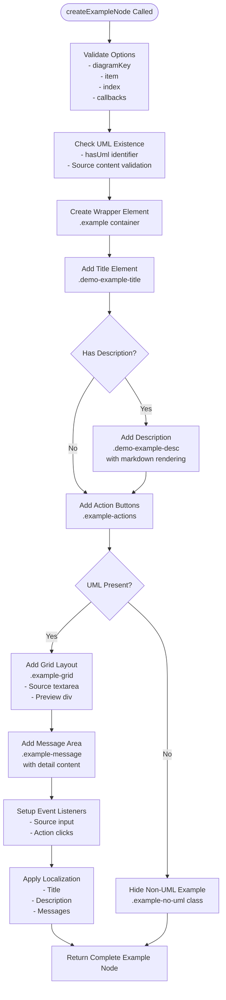
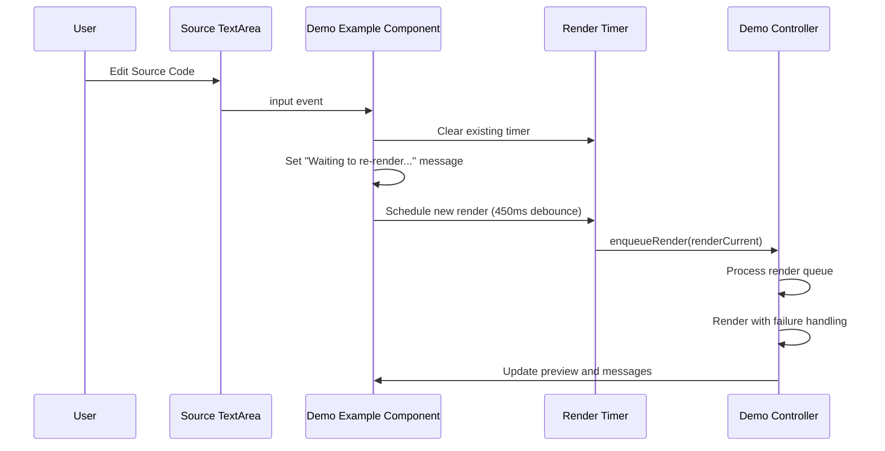
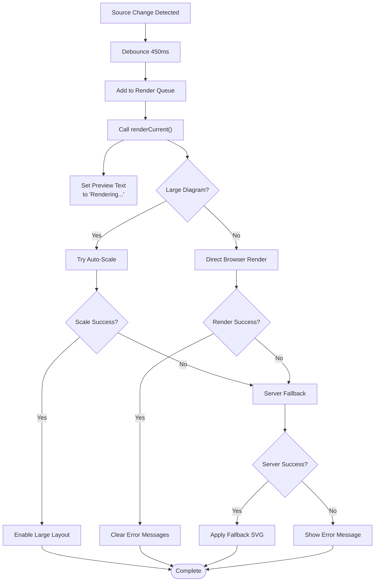
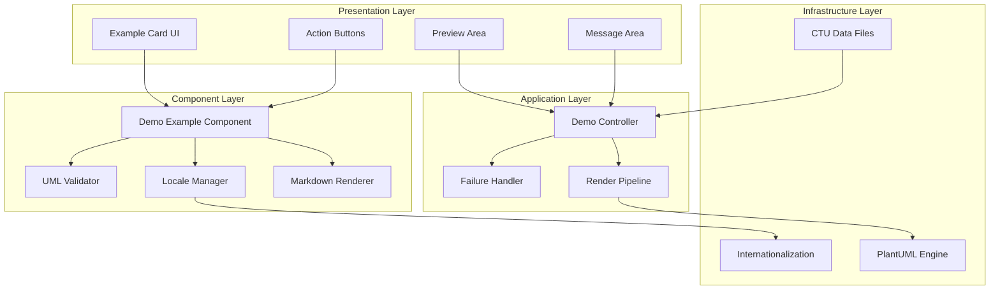
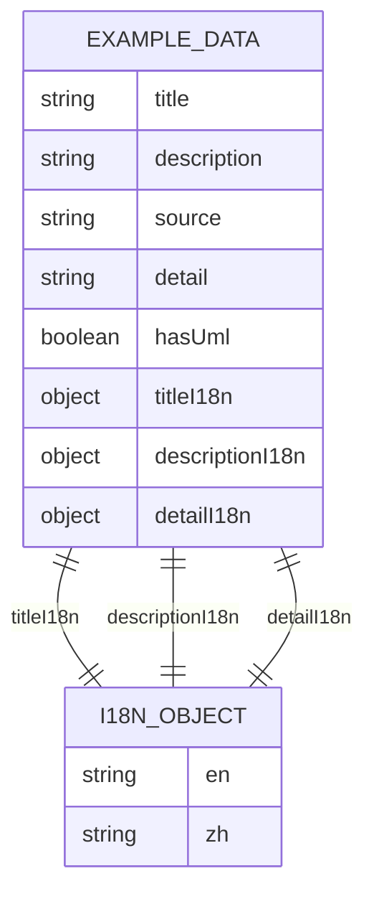
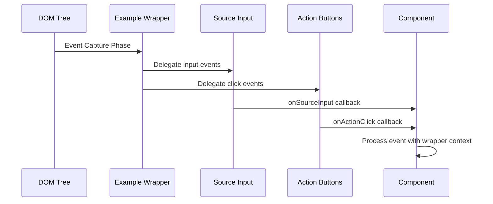
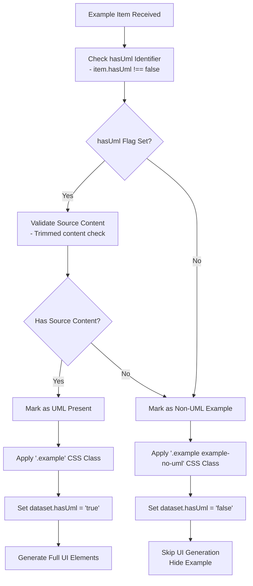
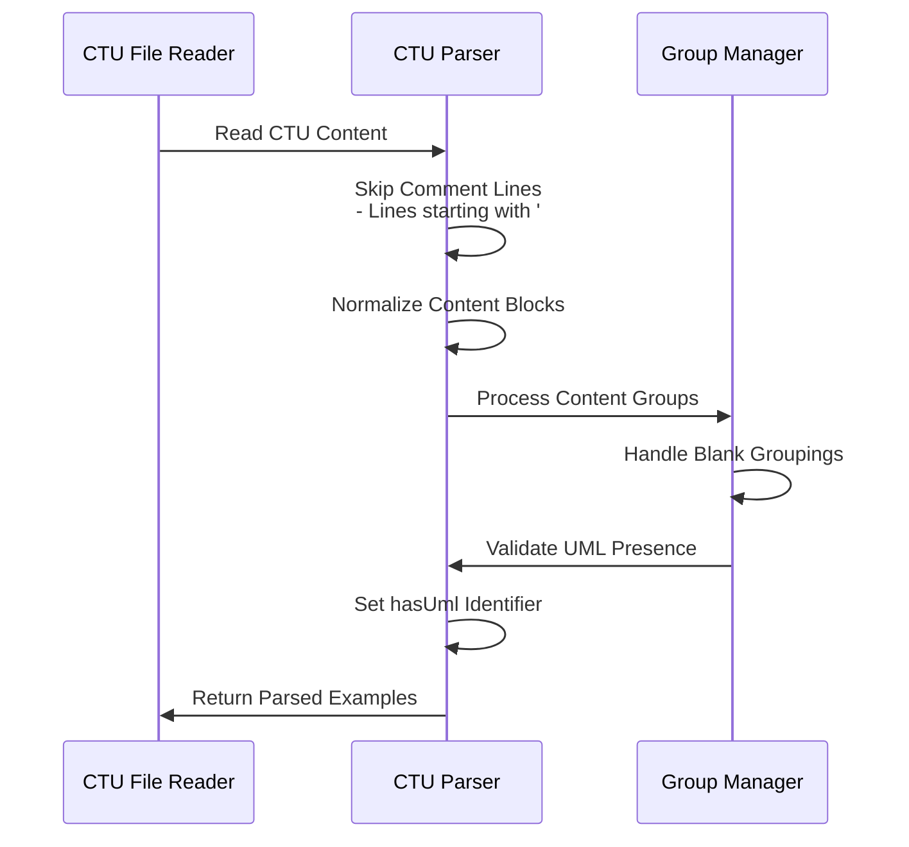
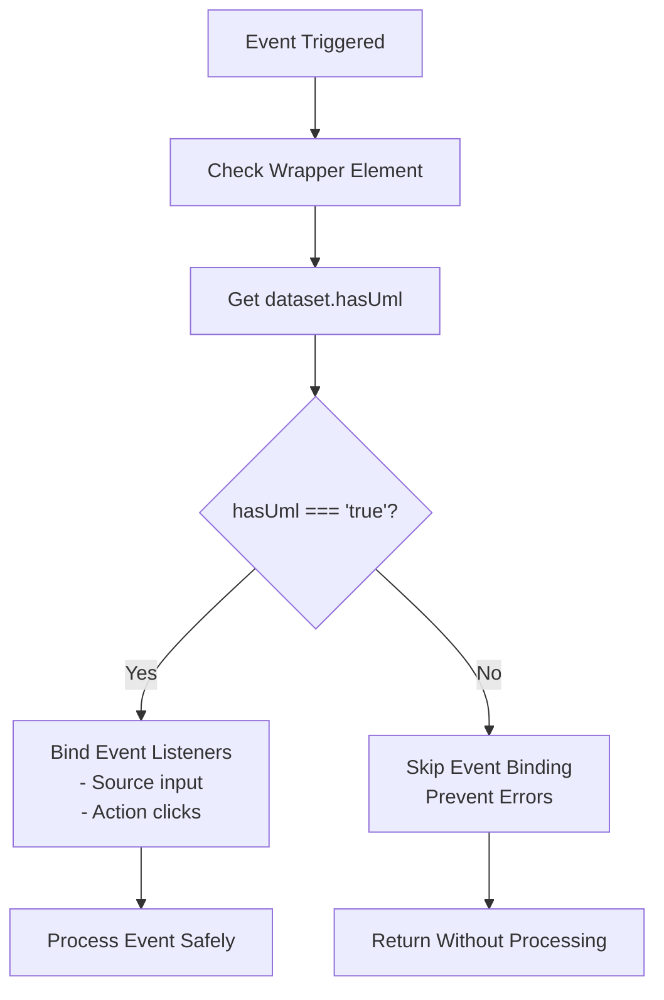
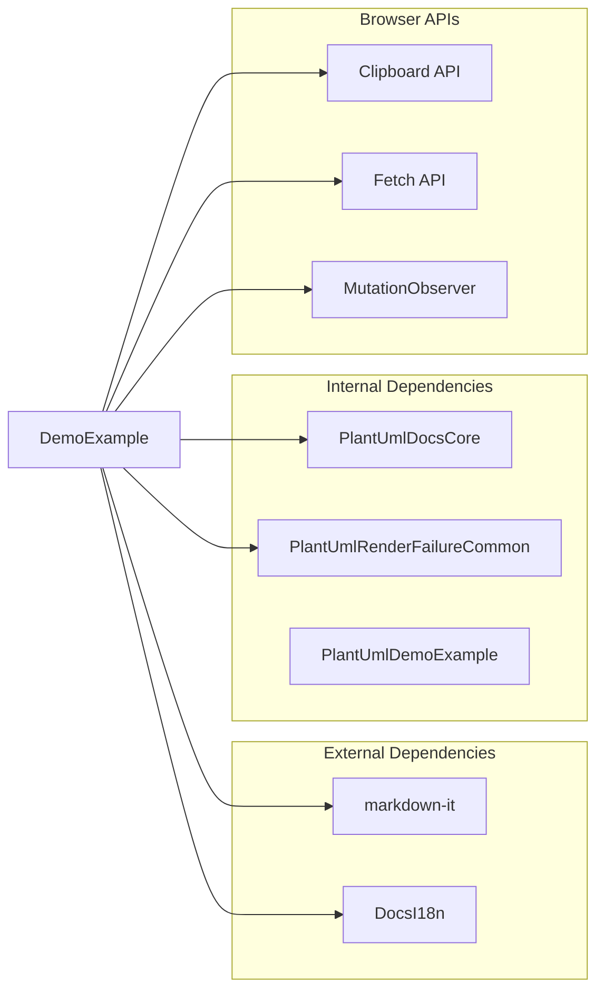

# Demo Example Component

<cite>
**Referenced Files in This Document**
- [demo-example-component.js](file://component/demo-example-component.js)
- [demo.js](file://demo.js)
- [demo.html](file://demo.html)
- [docs-page-core.js](file://component/docs-page-core.js)
- [render-failure-common.js](file://component/render-failure-common.js)
- [toc-component.js](file://component/toc-component.js)
- [en.js](file://i18n/en.js)
- [zh.js](file://i18n/zh.js)
- [i18n-config.js](file://i18n-config.js)
- [_TEMPLATE.ctu](file://data/_TEMPLATE.ctu)
- [sequence--1_en.ctu](file://data/demo/sequence--1_en.ctu)
- [serve.js](file://serve.js)
- [serve.sh](file://serve.sh)
- [serve.bat](file://serve.bat)
- [index.html](file://index.html)
- [README.md](file://README.md)
- [README_zh.md](file://README_zh.md)
</cite>

## Update Summary
**Changes Made**
- Updated UML existence validation logic and CSS class management
- Enhanced server-side CTU parsing to skip comment lines and handle blank grouping
- Improved example filtering to prevent action buttons and previews for non-UML examples
- Added hasUml identifier support and special CSS classes for hiding non-UML examples
- Fixed invalid event binding errors for source code input in non-UML examples

## Table of Contents
1. [Introduction](#introduction)
2. [Project Structure](#project-structure)
3. [Core Components](#core-components)
4. [Architecture Overview](#architecture-overview)
5. [Detailed Component Analysis](#detailed-component-analysis)
6. [UML Detection and Filtering System](#uml-detection-and-filtering-system)
7. [Simplified Demo Access Mechanism](#simplified-demo-access-mechanism)
8. [Dependency Analysis](#dependency-analysis)
9. [Performance Considerations](#performance-considerations)
10. [Troubleshooting Guide](#troubleshooting-guide)
11. [Conclusion](#conclusion)

## Introduction

The Demo Example Component is a specialized JavaScript module responsible for creating and managing individual diagram example cards within the PlantUML demo page. This component serves as the foundation for the interactive demonstration system, handling everything from example card creation to user interaction management and preview generation.

The component integrates seamlessly with the broader demo page architecture, providing a reusable system for displaying PlantUML diagrams with live editing capabilities, action buttons, and comprehensive internationalization support. It transforms structured data from CTU files into interactive, visually appealing example cards that users can edit, copy, and download.

**Updated** The component now features enhanced UML detection logic that prevents ineffective display of action buttons and preview areas for examples lacking UML content. This improvement addresses critical bug fixes that ensure proper filtering of non-UML examples and prevents invalid event binding errors.

## Project Structure

The demo example component operates within a well-organized project structure that separates concerns across multiple modules:

```mermaid
graph TB
subgraph "Demo Page Architecture"
HTML[demo.html]
JS[demo.js]
CSS[main.css]
end
subgraph "Component Layer"
DEMO[demo-example-component.js]
CORE[docs-page-core.js]
FAILURE[render-failure-common.js]
TOC[toc-component.js]
end
subgraph "Internationalization"
EN[i18n/en.js]
ZH[i18n/zh.js]
CONFIG[i18n-config.js]
end
subgraph "Data Layer"
TEMPLATE[_TEMPLATE.ctu]
DATA[data/demo/]
end
subgraph "Server Infrastructure"
SERVER[serve.js]
SH[serve.sh]
BAT[serve.bat]
end
HTML --> JS
JS --> DEMO
JS --> CORE
JS --> FAILURE
JS --> TOC
JS --> EN
JS --> ZH
JS --> CONFIG
DATA --> JS
TEMPLATE --> DATA
SERVER --> DEMO_EXAMPLES_API[/api/demo-examples]
SERVER --> PLANTUML_API[/api/plantuml-svg]
SH --> SERVER
BAT --> SERVER
```

**Diagram sources**
- [demo.html:1-116](file://demo.html#L1-L116)
- [demo.js:1-819](file://demo.js#L1-L819)
- [demo-example-component.js:1-167](file://component/demo-example-component.js#L1-L167)
- [serve.js:458-571](file://serve.js#L458-L571)
- [serve.sh:1-54](file://serve.sh#L1-L54)
- [serve.bat:1-33](file://serve.bat#L1-L33)

**Section sources**
- [demo.html:1-116](file://demo.html#L1-L116)
- [demo.js:1-819](file://demo.js#L1-L819)
- [serve.js:458-571](file://serve.js#L458-L571)

## Core Components

The Demo Example Component consists of several interconnected systems that work together to provide a comprehensive example rendering solution:

### Example Card Creation System

The component creates individual example cards through a structured process that generates HTML elements with specific classes and data attributes. Each example card follows a consistent layout pattern:



**Diagram sources**
- [demo-example-component.js:82-163](file://component/demo-example-component.js#L82-L163)

### Source Input Handling

The component implements sophisticated source input handling with debouncing and intelligent rendering triggers:



**Diagram sources**
- [demo-example-component.js:145-150](file://component/demo-example-component.js#L145-L150)
- [demo.js:365-373](file://demo.js#L365-L373)

### Action Button Management

The component provides three primary action buttons with comprehensive functionality:

| Action | Purpose | Implementation |
|--------|---------|----------------|
| Copy Source | Copies PlantUML source code to clipboard | Uses Clipboard API with success/error feedback |
| Copy SVG | Copies rendered SVG markup to clipboard | Serializes SVG element with proper namespace |
| Download SVG | Downloads SVG as file | Creates Blob, generates download link |

**Section sources**
- [demo-example-component.js:113-118](file://component/demo-example-component.js#L113-L118)
- [demo.js:456-486](file://demo.js#L456-L486)

### Preview Generation

The component integrates with the PlantUML rendering pipeline through a robust preview system:



**Diagram sources**
- [demo.js:376-442](file://demo.js#L376-L442)
- [render-failure-common.js:160-237](file://component/render-failure-common.js#L160-L237)

**Section sources**
- [demo-example-component.js:17-37](file://component/demo-example-component.js#L17-L37)
- [demo.js:376-442](file://demo.js#L376-L442)

## Architecture Overview

The Demo Example Component operates within a layered architecture that promotes separation of concerns and reusability:



**Diagram sources**
- [demo-example-component.js:1-167](file://component/demo-example-component.js#L1-L167)
- [demo.js:1-819](file://demo.js#L1-L819)

The architecture follows these key principles:

1. **Separation of Concerns**: Each component has a specific responsibility
2. **Event-Driven Architecture**: Uses event delegation for efficient handling
3. **Fail-Safe Rendering**: Implements comprehensive error handling and fallbacks
4. **Internationalization**: Built-in support for multiple languages
5. **UML Validation**: Prevents rendering for non-UML examples
6. **Reusable Design**: Exposed as a standalone module for potential reuse

## Detailed Component Analysis

### Component Structure and Methods

The Demo Example Component exposes three primary public methods:

#### createExampleNode Method

The `createExampleNode` method is the core factory function that generates complete example cards:

**Method Signature**: `createExampleNode(options)`

**Parameters**:
- `diagramKey`: String identifier for the diagram type
- `item`: Object containing example data (title, description, source, etc.)
- `index`: Numeric index for positioning
- `onSourceInput`: Callback for source change events
- `onActionClick`: Callback for action button clicks

**Return Value**: DOM Element representing the complete example card

**Implementation Details**:
- Creates wrapper with unique ID and dataset attributes
- Validates UML existence before generating UI elements
- Generates hierarchical structure: title → description → actions → grid → message
- Sets up event listeners with proper callback delegation
- Applies internationalization and localization
- Uses special CSS classes to hide non-UML examples

#### applyExampleLocale Method

Handles dynamic localization updates for existing example nodes:

**Method Signature**: `applyExampleLocale(wrapper, item, index, mode)`

**Features**:
- Supports bidirectional title/description localization
- Handles markdown content rendering
- Manages detail message display
- Updates accessibility attributes

#### renderMarkdown Method

Provides markdown rendering capability with fallback support:

**Method Signature**: `renderMarkdown(text)`

**Capabilities**:
- Uses markdown-it library when available
- Provides fallback HTML escaping and line break conversion
- Handles empty content gracefully

**Section sources**
- [demo-example-component.js:82-163](file://component/demo-example-component.js#L82-L163)

### Data Model and Structure

The component expects a specific data structure from CTU files:



**Diagram sources**
- [demo-example-component.js:8-15](file://component/demo-example-component.js#L8-L15)
- [demo-example-component.js:48-80](file://component/demo-example-component.js#L48-L80)

**Section sources**
- [demo-example-component.js:8-80](file://component/demo-example-component.js#L8-L80)
- [_TEMPLATE.ctu:1-46](file://data/_TEMPLATE.ctu#L1-L46)

### Event Delegation Pattern

The component implements efficient event delegation to minimize memory usage and improve performance:



**Diagram sources**
- [demo-example-component.js:145-158](file://component/demo-example-component.js#L145-L158)

**Section sources**
- [demo-example-component.js:145-158](file://component/demo-example-component.js#L145-L158)

### State Management Patterns

The component manages state through several mechanisms:

1. **DOM Data Attributes**: Stores metadata in `dataset` properties including `hasUml`
2. **Message State**: Tracks current message state and HTML content
3. **Render Generation**: Manages rendering lifecycle with generation counters
4. **Timer Management**: Handles debounced rendering with clearTimeout
5. **CSS Class Management**: Dynamically applies `.example-no-uml` class for filtering

**Section sources**
- [demo-example-component.js:39-46](file://component/demo-example-component.js#L39-L46)
- [demo.js:365-373](file://demo.js#L365-L373)

## UML Detection and Filtering System

**Updated** The component now features enhanced UML detection logic that prevents ineffective display of action buttons and preview areas for examples lacking UML content.

### UML Existence Validation

The component implements sophisticated UML detection through multiple validation layers:



**Diagram sources**
- [demo-example-component.js:91-98](file://component/demo-example-component.js#L91-L98)

### CSS Class Management

The component uses special CSS classes to control example visibility and behavior:

| CSS Class | Purpose | Behavior |
|-----------|---------|----------|
| `.example` | Standard UML example | Visible with full UI |
| `.example-no-uml` | Non-UML example | Hidden via CSS rules |
| `example-no-uml` | Dataset flag | Controls rendering logic |

### Server-Side CTU Parsing Enhancements

The server-side parsing has been enhanced to skip comment lines and handle blank grouping scenarios:



**Diagram sources**
- [serve.js:90-160](file://serve.js#L90-L160)
- [serve.js:376-390](file://serve.js#L376-L390)

**Section sources**
- [demo-example-component.js:91-98](file://component/demo-example-component.js#L91-L98)
- [demo.js:281](file://demo.js#L281)
- [demo.js:378](file://demo.js#L378)
- [serve.js:90-160](file://serve.js#L90-L160)
- [serve.js:376-390](file://serve.js#L376-L390)

### Event Binding Prevention

The component prevents invalid event binding errors by checking UML existence before setting up event listeners:



**Diagram sources**
- [demo.js:378](file://demo.js#L378)

**Section sources**
- [demo.js:378](file://demo.js#L378)

## Simplified Demo Access Mechanism

**Updated** The demo system now features a streamlined access pattern designed for simplicity and developer productivity.

### Clean Endpoint Access

The new simplified access mechanism centers around the http://localhost:5401 endpoint, eliminating the complexity of the previous demo.html URL structure:

```mermaid
flowchart TD
User[Developer] --> CleanURL["http://localhost:5401"]
CleanURL --> Server[Node.js Server]
Server --> Index[index.html]
Index --> Redirect["Redirect to demo content"]
Redirect --> DemoPage["Interactive Demo Interface"]
DemoPage --> API[API Endpoints]
API --> DemoExamples[/api/demo-examples]
API --> PlantUMLJar[/api/plantuml-svg]
```

**Diagram sources**
- [serve.js:458-571](file://serve.js#L458-L571)
- [index.html:244](file://index.html#L244)

### Server Configuration

The development server configuration has been optimized for the simplified access pattern:

| Configuration | Default Value | Description |
|---------------|---------------|-------------|
| **Port** | 5401 | Clean, memorable port number |
| **Host** | localhost | Localhost binding for security |
| **API Routes** | /api/demo-examples, /api/plantuml-svg | Dedicated endpoints for demo data and rendering |
| **Auto-restart** | Enabled | Automatic restart on port conflicts |

### Development Workflow

The simplified workflow reduces cognitive load for developers:

1. **Start Server**: `./serve.sh` or `node serve.js 5401`
2. **Access Demo**: Navigate to `http://localhost:5401`
3. **Explore Examples**: Browse interactive PlantUML diagrams
4. **Language Toggle**: Switch between English and Chinese
5. **Edit Source**: Live editing with instant preview

**Section sources**
- [serve.js:458-571](file://serve.js#L458-L571)
- [serve.sh:1-54](file://serve.sh#L1-L54)
- [serve.bat:1-33](file://serve.bat#L1-L33)
- [README.md:112-121](file://README.md#L112-L121)
- [README_zh.md:112-121](file://README_zh.md#L112-L121)

## Dependency Analysis

The Demo Example Component has well-defined dependencies that promote modularity and maintainability:



**Diagram sources**
- [demo-example-component.js:1-167](file://component/demo-example-component.js#L1-L167)
- [demo.js:1-819](file://demo.js#L1-L819)

### Integration Points

The component integrates with several key systems:

1. **Internationalization System**: Uses DocsI18n for language switching
2. **Core Rendering Functions**: Leverages PlantUmlDocsCore for utility functions
3. **Failure Handling**: Integrates with PlantUmlRenderFailureCommon for robust rendering
4. **Main Controller**: Works with demo.js for orchestration and coordination
5. **Server API**: Connects to /api/demo-examples for dynamic content loading
6. **UML Detection**: Utilizes hasUml identifiers from server-side parsing

**Section sources**
- [demo.js:1-819](file://demo.js#L1-L819)
- [docs-page-core.js:1-464](file://component/docs-page-core.js#L1-L464)
- [render-failure-common.js:1-249](file://component/render-failure-common.js#L1-L249)

## Performance Considerations

The component implements several performance optimization strategies:

### Debounced Rendering
- 450ms debounce period for source input events
- Render queue prevents excessive re-renders
- Generation counters prevent stale renders

### Efficient DOM Manipulation
- Single DOM creation per example card
- Event delegation reduces listener overhead
- Batched updates minimize reflows

### Memory Management
- Proper cleanup of timers and observers
- Weak references for DOM nodes
- Controlled scope closure to prevent leaks

### Internationalization Efficiency
- Precomputed locale lookups
- Cached markdown rendering
- Minimal DOM traversal for updates

### UML Filtering Benefits
- CSS-based hiding of non-UML examples
- Reduced DOM tree size
- Fewer event listeners and bindings
- Optimized rendering pipeline

**Section sources**
- [demo.js:347-371](file://demo.js#L347-L371)
- [demo-example-component.js:145-158](file://component/demo-example-component.js#L145-L158)

## Troubleshooting Guide

### Common Issues and Solutions

#### Demo Access Problems
**Symptoms**: Cannot access http://localhost:5401, server errors
**Causes**:
- Port 5401 already in use
- Node.js not installed or outdated
- Java not available for server fallback

**Solutions**:
- Use custom port: `./serve.sh 5402`
- Check Node.js version: `node --version`
- Install Java for server-side rendering fallback

#### Example Cards Not Rendering
**Symptoms**: Blank preview area, error messages
**Causes**:
- Missing PlantUML renderer
- Invalid source code
- Network connectivity issues
- UML detection failures

**Solutions**:
- Verify PlantUML engine availability
- Check source code syntax
- Ensure fallback server is running
- Validate hasUml identifier in CTU files

#### Action Buttons Not Working
**Symptoms**: Buttons appear but don't respond
**Causes**:
- Clipboard permissions blocked
- Browser compatibility issues
- Event delegation failures
- Non-UML example filtering

**Solutions**:
- Check browser permissions for clipboard access
- Test in supported browsers
- Verify event listener registration
- Ensure example has UML content

#### UML Detection Issues
**Symptoms**: Non-UML examples showing incorrectly
**Causes**:
- Missing hasUml identifier in parsed data
- Incorrect UML content validation
- CSS class application errors

**Solutions**:
- Verify CTU file contains proper UML sections
- Check server-side parsing logic
- Validate CSS class application
- Ensure dataset.hasUml attribute is set correctly

#### Localization Issues
**Symptoms**: Mixed language content, missing translations
**Causes**:
- Incorrect locale detection
- Missing translation keys
- Timing issues during initialization

**Solutions**:
- Verify DocsI18n configuration
- Check translation dictionary completeness
- Ensure proper initialization order

#### Performance Problems
**Symptoms**: Slow rendering, lag during editing
**Causes**:
- Too many simultaneous renders
- Memory leaks from event handlers
- Inefficient DOM updates
- Excessive UML filtering

**Solutions**:
- Adjust debounce timing
- Clean up unused event listeners
- Optimize DOM manipulation patterns
- Review UML detection logic

**Section sources**
- [demo.js:376-442](file://demo.js#L376-L442)
- [render-failure-common.js:160-237](file://component/render-failure-common.js#L160-L237)

## Conclusion

The Demo Example Component represents a well-architected solution for interactive diagram example rendering and management. Its modular design, comprehensive internationalization support, and robust error handling make it a valuable component within the PlantUML ecosystem.

**Updated** The recent enhancements to UML detection and filtering logic significantly improve the component's reliability and user experience. The addition of hasUml identifiers, special CSS classes for hiding non-UML examples, and improved server-side parsing ensures that users only see examples with valid UML content, preventing ineffective displays and invalid event binding errors.

Key strengths of the component include:

1. **Modular Architecture**: Clean separation of concerns with well-defined interfaces
2. **Internationalization**: Built-in support for multiple languages with dynamic switching
3. **Robust Error Handling**: Comprehensive fallback mechanisms for various failure scenarios
4. **Performance Optimization**: Efficient rendering with debouncing and queue management
5. **UML Validation**: Intelligent filtering prevents non-UML examples from being displayed
6. **Accessibility**: Proper ARIA labels and keyboard navigation support
7. **Extensibility**: Designed as a reusable module for potential integration elsewhere
8. **Simplified Access**: Streamlined development workflow with clean endpoint

The component successfully bridges the gap between static CTU data and interactive web applications, providing users with a powerful tool for exploring and experimenting with PlantUML diagrams. The enhanced UML detection system and simplified access mechanism further enhance this value by reducing friction in the development and testing process while ensuring reliable operation.

Future enhancements could include additional action capabilities, enhanced preview features, and expanded customization options while maintaining the component's core architectural principles and the benefits of the simplified access pattern.