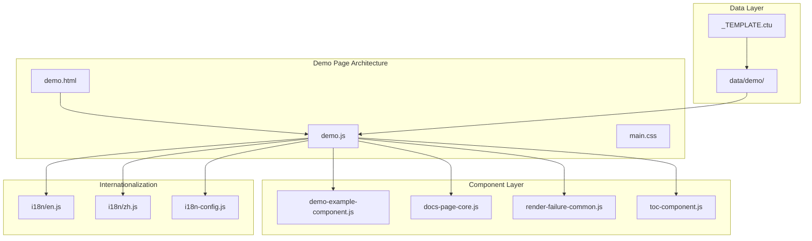
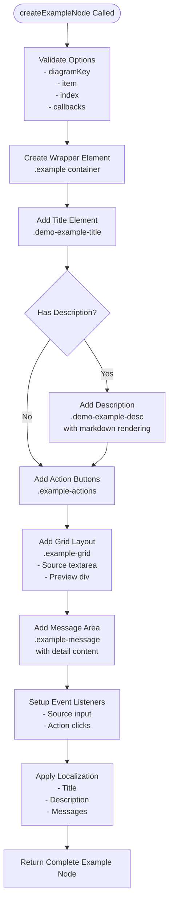
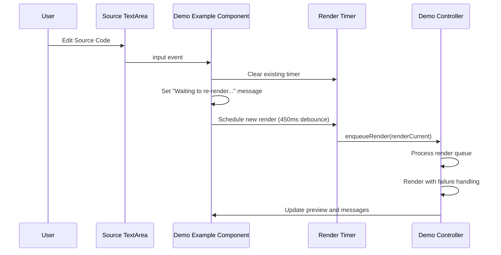
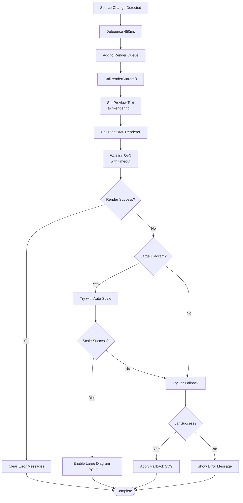
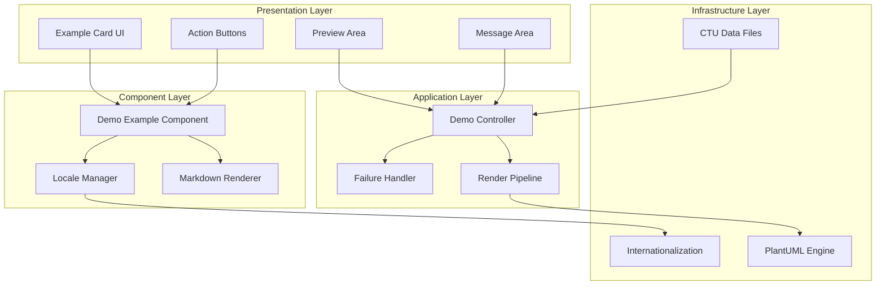
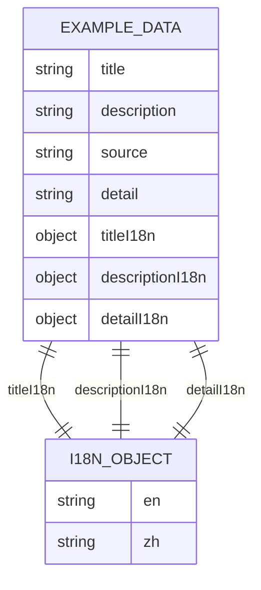
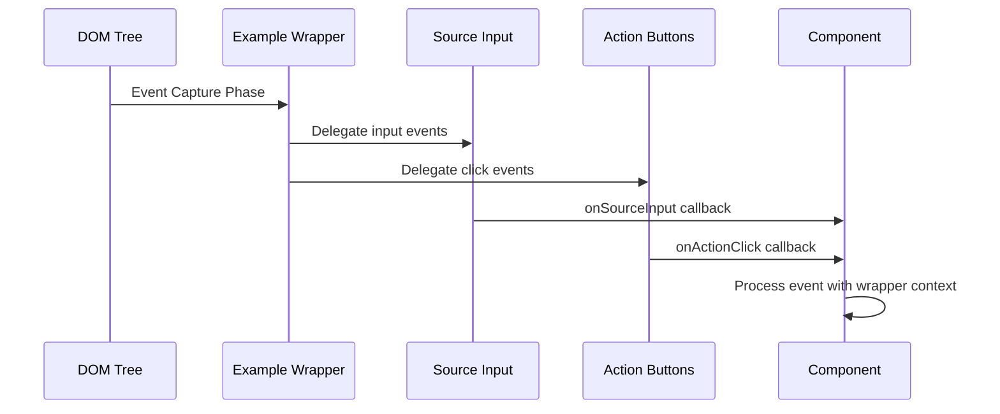
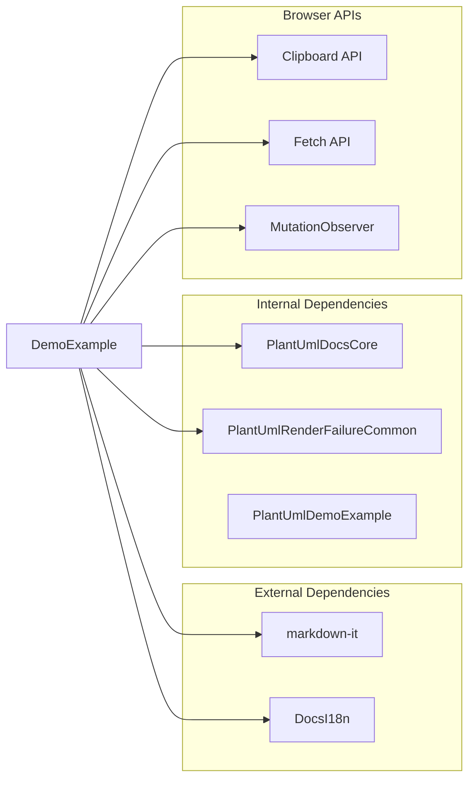

# Demo Example Component

<cite>
**Referenced Files in This Document**
- [demo-example-component.js](file://component/demo-example-component.js)
- [demo.js](file://demo.js)
- [demo.html](file://demo.html)
- [docs-page-core.js](file://component/docs-page-core.js)
- [render-failure-common.js](file://component/render-failure-common.js)
- [toc-component.js](file://component/toc-component.js)
- [en.js](file://i18n/en.js)
- [zh.js](file://i18n/zh.js)
- [i18n-config.js](file://i18n-config.js)
- [_TEMPLATE.ctu](file://data/_TEMPLATE.ctu)
- [sequence--1_en.ctu](file://data/demo/sequence--1_en.ctu)
</cite>

## Table of Contents
1. [Introduction](#introduction)
2. [Project Structure](#project-structure)
3. [Core Components](#core-components)
4. [Architecture Overview](#architecture-overview)
5. [Detailed Component Analysis](#detailed-component-analysis)
6. [Dependency Analysis](#dependency-analysis)
7. [Performance Considerations](#performance-considerations)
8. [Troubleshooting Guide](#troubleshooting-guide)
9. [Conclusion](#conclusion)

## Introduction

The Demo Example Component is a specialized JavaScript module responsible for creating and managing individual diagram example cards within the PlantUML demo page. This component serves as the foundation for the interactive demonstration system, handling everything from example card creation to user interaction management and preview generation.

The component integrates seamlessly with the broader demo page architecture, providing a reusable system for displaying PlantUML diagrams with live editing capabilities, action buttons, and comprehensive internationalization support. It transforms structured data from CTU files into interactive, visually appealing example cards that users can edit, copy, and download.

## Project Structure

The demo example component operates within a well-organized project structure that separates concerns across multiple modules:

**Diagram sources**
- [demo.html:1-116](file://demo.html#L1-L116)
- [demo.js:1-816](file://demo.js#L1-L816)
- [demo-example-component.js:1-159](file://component/demo-example-component.js#L1-L159)

**Section sources**
- [demo.html:1-116](file://demo.html#L1-L116)
- [demo.js:1-816](file://demo.js#L1-L816)

## Core Components

The Demo Example Component consists of several interconnected systems that work together to provide a comprehensive example rendering solution:

### Example Card Creation System

The component creates individual example cards through a structured process that generates HTML elements with specific classes and data attributes. Each example card follows a consistent layout pattern:

**Diagram sources**
- [demo-example-component.js:82-155](file://component/demo-example-component.js#L82-L155)

### Source Input Handling

The component implements sophisticated source input handling with debouncing and intelligent rendering triggers:

**Diagram sources**
- [demo-example-component.js:136-142](file://component/demo-example-component.js#L136-L142)
- [demo.js:358-371](file://demo.js#L358-L371)

### Action Button Management

The component provides three primary action buttons with comprehensive functionality:

| Action | Purpose | Implementation |
|--------|---------|----------------|
| Copy Source | Copies PlantUML source code to clipboard | Uses Clipboard API with success/error feedback |
| Copy SVG | Copies rendered SVG markup to clipboard | Serializes SVG element with proper namespace |
| Download SVG | Downloads SVG as file | Creates Blob, generates download link |

**Section sources**
- [demo-example-component.js:111-116](file://component/demo-example-component.js#L111-L116)
- [demo.js:449-483](file://demo.js#L449-L483)

### Preview Generation

The component integrates with the PlantUML rendering pipeline through a robust preview system:

**Diagram sources**
- [demo.js:374-439](file://demo.js#L374-L439)
- [render-failure-common.js:160-237](file://component/render-failure-common.js#L160-L237)

**Section sources**
- [demo-example-component.js:17-37](file://component/demo-example-component.js#L17-L37)
- [demo.js:374-439](file://demo.js#L374-L439)

## Architecture Overview

The Demo Example Component operates within a layered architecture that promotes separation of concerns and reusability:

**Diagram sources**
- [demo-example-component.js:1-159](file://component/demo-example-component.js#L1-L159)
- [demo.js:1-816](file://demo.js#L1-L816)

The architecture follows these key principles:

1. **Separation of Concerns**: Each component has a specific responsibility
2. **Event-Driven Architecture**: Uses event delegation for efficient handling
3. **Fail-Safe Rendering**: Implements comprehensive error handling and fallbacks
4. **Internationalization**: Built-in support for multiple languages
5. **Reusable Design**: Exposed as a standalone module for potential reuse

## Detailed Component Analysis

### Component Structure and Methods

The Demo Example Component exposes three primary public methods:

#### createExampleNode Method

The `createExampleNode` method is the core factory function that generates complete example cards:

**Method Signature**: `createExampleNode(options)`

**Parameters**:
- `diagramKey`: String identifier for the diagram type
- `item`: Object containing example data (title, description, source, etc.)
- `index`: Numeric index for positioning
- `onSourceInput`: Callback for source change events
- `onActionClick`: Callback for action button clicks

**Return Value**: DOM Element representing the complete example card

**Implementation Details**:
- Creates wrapper with unique ID and dataset attributes
- Generates hierarchical structure: title → description → actions → grid → message
- Sets up event listeners with proper callback delegation
- Applies internationalization and localization

#### applyExampleLocale Method

Handles dynamic localization updates for existing example nodes:

**Method Signature**: `applyExampleLocale(wrapper, item, index, mode)`

**Features**:
- Supports bidirectional title/description localization
- Handles markdown content rendering
- Manages detail message display
- Updates accessibility attributes

#### renderMarkdown Method

Provides markdown rendering capability with fallback support:

**Method Signature**: `renderMarkdown(text)`

**Capabilities**:
- Uses markdown-it library when available
- Provides fallback HTML escaping and line break conversion
- Handles empty content gracefully

**Section sources**
- [demo-example-component.js:82-155](file://component/demo-example-component.js#L82-L155)

### Data Model and Structure

The component expects a specific data structure from CTU files:

**Diagram sources**
- [demo-example-component.js:8-15](file://component/demo-example-component.js#L8-L15)
- [demo-example-component.js:48-80](file://component/demo-example-component.js#L48-L80)

**Section sources**
- [demo-example-component.js:8-80](file://component/demo-example-component.js#L8-L80)
- [_TEMPLATE.ctu:1-46](file://data/_TEMPLATE.ctu#L1-L46)

### Event Delegation Pattern

The component implements efficient event delegation to minimize memory usage and improve performance:

**Diagram sources**
- [demo-example-component.js:136-150](file://component/demo-example-component.js#L136-L150)

**Section sources**
- [demo-example-component.js:136-150](file://component/demo-example-component.js#L136-L150)

### State Management Patterns

The component manages state through several mechanisms:

1. **DOM Data Attributes**: Stores metadata in `dataset` properties
2. **Message State**: Tracks current message state and HTML content
3. **Render Generation**: Manages rendering lifecycle with generation counters
4. **Timer Management**: Handles debounced rendering with clearTimeout

**Section sources**
- [demo-example-component.js:39-46](file://component/demo-example-component.js#L39-L46)
- [demo.js:358-371](file://demo.js#L358-L371)

## Dependency Analysis

The Demo Example Component has well-defined dependencies that promote modularity and maintainability:

**Diagram sources**
- [demo-example-component.js:1-159](file://component/demo-example-component.js#L1-L159)
- [demo.js:1-816](file://demo.js#L1-L816)

### Integration Points

The component integrates with several key systems:

1. **Internationalization System**: Uses DocsI18n for language switching
2. **Core Rendering Functions**: Leverages PlantUmlDocsCore for utility functions
3. **Failure Handling**: Integrates with PlantUmlRenderFailureCommon for robust rendering
4. **Main Controller**: Works with demo.js for orchestration and coordination

**Section sources**
- [demo.js:1-816](file://demo.js#L1-L816)
- [docs-page-core.js:1-464](file://component/docs-page-core.js#L1-L464)
- [render-failure-common.js:1-249](file://component/render-failure-common.js#L1-L249)

## Performance Considerations

The component implements several performance optimization strategies:

### Debounced Rendering
- 450ms debounce period for source input events
- Render queue prevents excessive re-renders
- Generation counters prevent stale renders

### Efficient DOM Manipulation
- Single DOM creation per example card
- Event delegation reduces listener overhead
- Batched updates minimize reflows

### Memory Management
- Proper cleanup of timers and observers
- Weak references for DOM nodes
- Controlled scope closure to prevent leaks

### Internationalization Efficiency
- Precomputed locale lookups
- Cached markdown rendering
- Minimal DOM traversal for updates

**Section sources**
- [demo.js:347-371](file://demo.js#L347-L371)
- [demo-example-component.js:136-150](file://component/demo-example-component.js#L136-L150)

## Troubleshooting Guide

### Common Issues and Solutions

#### Example Cards Not Rendering
**Symptoms**: Blank preview area, error messages
**Causes**:
- Missing PlantUML renderer
- Invalid source code
- Network connectivity issues

**Solutions**:
- Verify PlantUML engine availability
- Check source code syntax
- Ensure fallback server is running

#### Action Buttons Not Working
**Symptoms**: Buttons appear but don't respond
**Causes**:
- Clipboard permissions blocked
- Browser compatibility issues
- Event delegation failures

**Solutions**:
- Check browser permissions for clipboard access
- Test in supported browsers
- Verify event listener registration

#### Localization Issues
**Symptoms**: Mixed language content, missing translations
**Causes**:
- Incorrect locale detection
- Missing translation keys
- Timing issues during initialization

**Solutions**:
- Verify DocsI18n configuration
- Check translation dictionary completeness
- Ensure proper initialization order

#### Performance Problems
**Symptoms**: Slow rendering, lag during editing
**Causes**:
- Too many simultaneous renders
- Memory leaks from event handlers
- Inefficient DOM updates

**Solutions**:
- Adjust debounce timing
- Clean up unused event listeners
- Optimize DOM manipulation patterns

**Section sources**
- [demo.js:374-439](file://demo.js#L374-L439)
- [render-failure-common.js:160-237](file://component/render-failure-common.js#L160-L237)

## Conclusion

The Demo Example Component represents a well-architected solution for interactive diagram example rendering and management. Its modular design, comprehensive internationalization support, and robust error handling make it a valuable component within the PlantUML ecosystem.

Key strengths of the component include:

1. **Modular Architecture**: Clean separation of concerns with well-defined interfaces
2. **Internationalization**: Built-in support for multiple languages with dynamic switching
3. **Robust Error Handling**: Comprehensive fallback mechanisms for various failure scenarios
4. **Performance Optimization**: Efficient rendering with debouncing and queue management
5. **Accessibility**: Proper ARIA labels and keyboard navigation support
6. **Extensibility**: Designed as a reusable module for potential integration elsewhere

The component successfully bridges the gap between static CTU data and interactive web applications, providing users with a powerful tool for exploring and experimenting with PlantUML diagrams. Its design patterns and implementation strategies serve as excellent examples for building maintainable, scalable web components.

Future enhancements could include additional action capabilities, enhanced preview features, and expanded customization options while maintaining the component's core architectural principles.