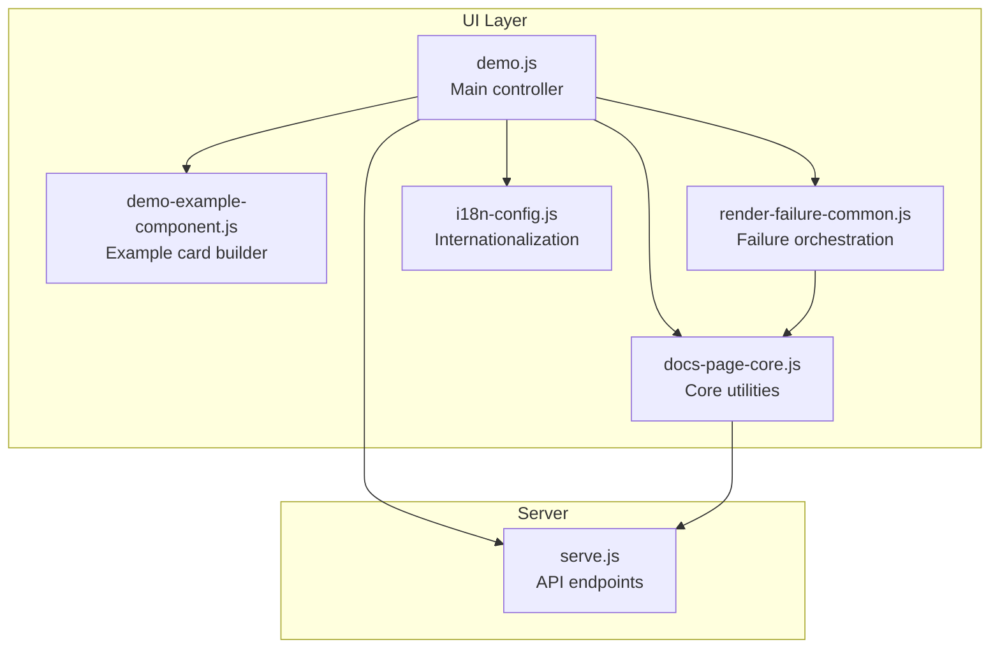
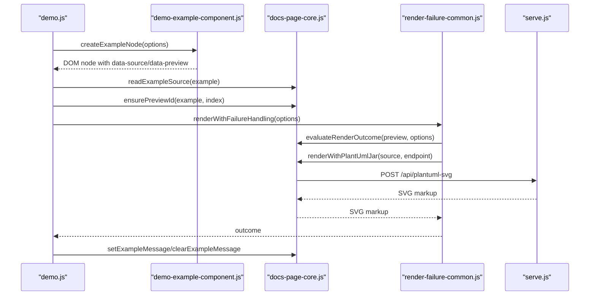
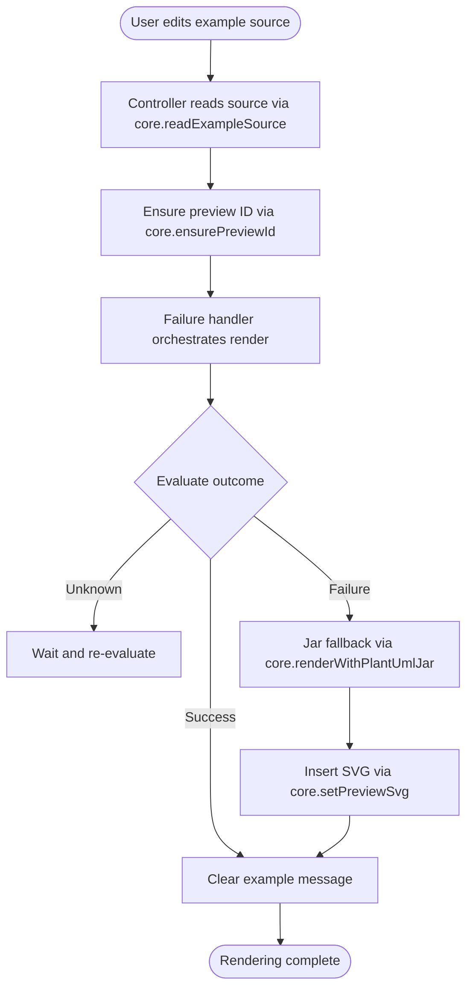
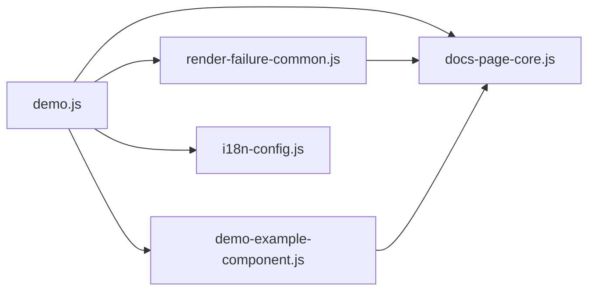

# Documentation Page Core

<cite>
**Referenced Files in This Document**
- [docs-page-core.js](file://component/docs-page-core.js)
- [demo-example-component.js](file://component/demo-example-component.js)
- [render-failure-common.js](file://component/render-failure-common.js)
- [demo.js](file://demo.js)
- [i18n-config.js](file://i18n-config.js)
- [serve.js](file://serve.js)
- [demo.html](file://demo.html)
- [detail-markdown.test.js](file://test/detail-markdown.test.js)
- [render-failure-common.test.js](file://test/render-failure-common.test.js)
</cite>

## Table of Contents
1. [Introduction](#introduction)
2. [Project Structure](#project-structure)
3. [Core Components](#core-components)
4. [Architecture Overview](#architecture-overview)
5. [Detailed Component Analysis](#detailed-component-analysis)
6. [Dependency Analysis](#dependency-analysis)
7. [Performance Considerations](#performance-considerations)
8. [Troubleshooting Guide](#troubleshooting-guide)
9. [Conclusion](#conclusion)
10. [Appendices](#appendices)

## Introduction
This document describes the docs-page-core.js component, which provides essential rendering utilities and DOM manipulation functions for the PlantUML documentation viewer. It focuses on:
- Core rendering functions for reading example sources, splitting PlantUML lines, and adding browser-safe scaling
- Preview ID management and download naming
- Message handling for example status and markdown-backed detail messages
- Error messaging and detection for runtime failures and SVG errors
- Integration with the main controller and other UI components
- Rendering state tracking and fallback mechanisms

The component is designed as a standalone utility module exposed globally and consumed by the demo controller and example component.

## Project Structure
The docs-page-core.js resides in the component/ directory alongside other UI components and is integrated into the demo page via the main controller.

**Diagram sources**
- [demo.js:1-120](file://demo.js#L1-L120)
- [demo-example-component.js:1-159](file://component/demo-example-component.js#L1-L159)
- [docs-page-core.js:1-464](file://component/docs-page-core.js#L1-L464)
- [render-failure-common.js:1-249](file://component/render-failure-common.js#L1-L249)
- [i18n-config.js:1-58](file://i18n-config.js#L1-L58)
- [serve.js:454-496](file://serve.js#L454-L496)

**Section sources**
- [demo.html:30-50](file://demo.html#L30-L50)
- [demo.js:1-120](file://demo.js#L1-L120)

## Core Components
The docs-page-core.js module exports a cohesive set of utilities grouped by responsibility:

- Example source reading and normalization
- Line splitting and browser-safe scaling
- Preview ID management and download naming
- Message handling for example status and markdown-backed detail
- Error detection for SVG and runtime failures
- Runtime error buffering and evaluation of render outcomes
- Jar fallback HTTP client for SVG generation
- Preview SVG insertion

These utilities are used by the demo controller to orchestrate rendering, by the example component to manage example cards, and by the failure handler to coordinate retries and fallbacks.

**Section sources**
- [docs-page-core.js:12-464](file://component/docs-page-core.js#L12-L464)

## Architecture Overview
The docs-page-core.js component sits at the intersection of DOM manipulation, rendering orchestration, and error handling. It is consumed by:
- The demo controller for reading example sources, ensuring preview IDs, and evaluating render outcomes
- The example component for building example nodes and managing markdown-backed detail messages
- The failure handler for coordinating retries and fallbacks

**Diagram sources**
- [demo.js:353-439](file://demo.js#L353-L439)
- [demo-example-component.js:82-155](file://component/demo-example-component.js#L82-L155)
- [docs-page-core.js:12-464](file://component/docs-page-core.js#L12-L464)
- [render-failure-common.js:160-237](file://component/render-failure-common.js#L160-L237)
- [serve.js:472-496](file://serve.js#L472-L496)

## Detailed Component Analysis

### Rendering Utilities
- readExampleSource: Extracts the example source from either a textarea with a data-source attribute or a code element. Normalizes whitespace and returns a trimmed string.
- splitPlantUmlLines: Normalizes line endings to LF and splits into an array of lines.
- addBrowserSafeScale: Adds a browser-safe scale directive to the PlantUML source if not present and if a start block is detected. Uses a configurable maximum height.

These functions provide the foundation for reliable source extraction and safe rendering.

**Section sources**
- [docs-page-core.js:12-35](file://component/docs-page-core.js#L12-L35)

### Preview Management
- ensurePreviewId: Ensures the preview container has a stable ID, generating one if missing.
- buildDownloadName: Builds a filename for downloads, defaulting to a diagram-specific name and ensuring .svg extension.
- setExampleMessage/clearExampleMessage: Manage the example message area, supporting plain text status messages and restoring markdown-backed detail messages.

These utilities coordinate DOM state and user feedback during rendering.

**Section sources**
- [docs-page-core.js:37-75](file://component/docs-page-core.js#L37-L75)

### Error Detection and Messaging
- detectPreviewError: Inspects the rendered SVG for known error markers and diagram type attributes to classify SVG-level errors.
- isPreviewErrorSvg: Convenience predicate to check if a preview contains an error.
- isPlantUmlRuntimeFailureMessage: Detects runtime failure messages across console, window error, and rejection signals.
- createRuntimeErrorBuffer: Maintains a sliding window buffer of runtime errors, with methods to record, consume, and clear entries, and to dispose listeners.
- evaluateRenderOutcome: Evaluates the render outcome by checking runtime buffers, SVG errors, preview availability, and SVG content.

These functions enable robust error detection and classification across runtime and SVG contexts.

**Section sources**
- [docs-page-core.js:77-355](file://component/docs-page-core.js#L77-L355)

### Jar Fallback and Preview Insertion
- buildJarFallbackHttpErrorMessage: Constructs human-readable error messages for jar fallback HTTP requests, handling various failure modes.
- renderWithPlantUmlJar: Performs a POST request to the jar fallback endpoint, validates the response, and returns SVG markup.
- setPreviewSvg: Inserts SVG markup into the preview container and verifies successful insertion.

These functions provide a reliable fallback mechanism when browser rendering fails.

**Section sources**
- [docs-page-core.js:377-445](file://component/docs-page-core.js#L377-L445)

### Integration with Demo Controller and Example Component
- Example creation: The example component builds example nodes with data-source and data-preview containers, and sets up actions and markdown-backed detail messages.
- Controller orchestration: The demo controller reads example sources, ensures preview IDs, and coordinates rendering with failure handling and fallbacks.
- Message lifecycle: The controller uses setExampleMessage and clearExampleMessage to reflect rendering states and restore markdown-backed detail messages.

**Diagram sources**
- [demo.js:353-439](file://demo.js#L353-L439)
- [demo-example-component.js:82-155](file://component/demo-example-component.js#L82-L155)
- [docs-page-core.js:12-464](file://component/docs-page-core.js#L12-L464)
- [render-failure-common.js:160-237](file://component/render-failure-common.js#L160-L237)

**Section sources**
- [demo.js:353-439](file://demo.js#L353-L439)
- [demo-example-component.js:82-155](file://component/demo-example-component.js#L82-L155)
- [render-failure-common.js:160-237](file://component/render-failure-common.js#L160-L237)

### Example Manipulation and DOM Traversal
- DOM selectors: The component relies on data-* attributes (data-source, data-preview, data-example-message) to locate and manipulate example elements.
- Markdown-backed detail: The example component stores markdown detail in dataset fields and restores them when clearing example messages.
- Internationalization: The i18n runtime provides labels and messages used by the controller and example component.

**Section sources**
- [demo-example-component.js:39-80](file://component/demo-example-component.js#L39-L80)
- [i18n-config.js:38-56](file://i18n-config.js#L38-L56)
- [demo.js:368-498](file://demo.js#L368-L498)

### State Management and Rendering Queue
- Render chain: The demo controller maintains a promise chain to serialize rendering tasks and prevent race conditions.
- Generation tracking: A generation counter ensures stale renders are ignored when switching tabs or reloading examples.
- Timer-based debouncing: Input handlers debounce re-rendering to reduce unnecessary work.

**Section sources**
- [demo.js:22-29](file://demo.js#L22-L29)
- [demo.js:347-351](file://demo.js#L347-L351)
- [demo.js:358-367](file://demo.js#L358-L367)

### Error Messaging System and Validation
- Runtime error buffering: Captures console errors, unhandled rejections, and window errors within a sliding time window.
- Outcome evaluation: Provides structured outcomes with status, signal type, and reason for downstream handling.
- Jar fallback error messages: Builds actionable messages for HTTP errors and malformed responses.

**Section sources**
- [docs-page-core.js:178-291](file://component/docs-page-core.js#L178-L291)
- [docs-page-core.js:293-355](file://component/docs-page-core.js#L293-L355)
- [docs-page-core.js:377-402](file://component/docs-page-core.js#L377-L402)

## Dependency Analysis
The docs-page-core.js component has explicit and implicit dependencies:

- Explicit dependencies:
  - render-failure-common.js: Uses evaluateRenderOutcome and setPreviewSvg when not present.
  - demo.js: Consumes readExampleSource, ensurePreviewId, setExampleMessage, clearExampleMessage, addBrowserSafeScale, buildDownloadName, renderWithPlantUmlJar, and evaluateRenderOutcome.
  - demo-example-component.js: Uses setDetailMessage and applies markdown-backed detail messages.
  - i18n-config.js: Provides internationalization labels used by the controller.

- Implicit dependencies:
  - DOM structure: Relies on data-source, data-preview, and data-example-message attributes.
  - Global exposure: Exposed as PlantUmlDocsCore on window for cross-module access.

**Diagram sources**
- [demo.js:1-120](file://demo.js#L1-L120)
- [render-failure-common.js:1-249](file://component/render-failure-common.js#L1-L249)
- [demo-example-component.js:1-159](file://component/demo-example-component.js#L1-L159)
- [i18n-config.js:1-58](file://i18n-config.js#L1-L58)

**Section sources**
- [demo.js:1-120](file://demo.js#L1-L120)
- [render-failure-common.js:1-249](file://component/render-failure-common.js#L1-L249)
- [demo-example-component.js:1-159](file://component/demo-example-component.js#L1-L159)
- [i18n-config.js:1-58](file://i18n-config.js#L1-L58)

## Performance Considerations
- Debounced re-rendering: Input handlers debounce rendering to reduce redundant work.
- Sliding window error buffering: Limits memory footprint and processing overhead for runtime error detection.
- Efficient SVG checks: Early exits when preview or SVG are missing to avoid unnecessary processing.
- Render queue serialization: Prevents contention and improves responsiveness under heavy editing.

[No sources needed since this section provides general guidance]

## Troubleshooting Guide
Common issues and resolutions:

- Preview container missing: The controller logs a skip message when the preview container is absent. Ensure the example node includes a data-preview container.
- No SVG rendered yet: The outcome evaluator reports unknown status until an SVG appears. Wait or check for rendering errors.
- Jar fallback endpoint not available: The fallback throws a descriptive error when the endpoint is unreachable or returns an error. Start the development server and ensure the endpoint is reachable.
- Large diagrams: The controller attempts to scale down large diagrams and retries browser rendering. If it fails, the fallback is used.
- Runtime failures: The runtime error buffer captures console errors and unhandled rejections. Review buffered entries for crash details.

**Section sources**
- [demo.js:374-439](file://demo.js#L374-L439)
- [docs-page-core.js:377-402](file://component/docs-page-core.js#L377-L402)
- [docs-page-core.js:178-291](file://component/docs-page-core.js#L178-L291)

## Conclusion
The docs-page-core.js component centralizes rendering utilities, DOM manipulation, and error handling for the PlantUML documentation viewer. Its clean API enables seamless integration with the demo controller, example component, and failure handler, while providing robust fallbacks and state management. By leveraging data-* attributes and a global exposure pattern, it remains flexible and maintainable across the UI stack.

[No sources needed since this section summarizes without analyzing specific files]

## Appendices

### API Reference
- readExampleSource(example): Extracts and normalizes example source.
- splitPlantUmlLines(source): Splits source into lines with normalized line endings.
- addBrowserSafeScale(source, maxHeight): Adds a browser-safe scale directive.
- ensurePreviewId(example, index): Ensures a stable preview ID.
- buildDownloadName(example, index): Builds a filename for downloads.
- setExampleMessage(example, message, state): Sets example message with state.
- clearExampleMessage(example): Restores markdown-backed detail message.
- detectPreviewError(preview): Detects SVG-level errors.
- isPreviewErrorSvg(preview): Checks if preview contains an error.
- isPlantUmlRuntimeFailureMessage(message, source): Detects runtime failure messages.
- createRuntimeErrorBuffer(options): Creates a runtime error buffer.
- evaluateRenderOutcome(preview, options): Evaluates render outcome.
- renderWithPlantUmlJar(source, endpoint): Requests SVG via jar fallback.
- setPreviewSvg(preview, svgMarkup): Inserts SVG into preview.

**Section sources**
- [docs-page-core.js:12-464](file://component/docs-page-core.js#L12-L464)

### Integration Notes
- The demo controller initializes the runtime error buffer and uses core APIs to orchestrate rendering and messaging.
- The example component builds example nodes and manages markdown-backed detail messages, relying on core message APIs.
- The failure handler coordinates retries and fallbacks, delegating to core for outcome evaluation and SVG insertion.

**Section sources**
- [demo.js:27-29](file://demo.js#L27-L29)
- [demo.js:353-439](file://demo.js#L353-L439)
- [demo-example-component.js:39-80](file://component/demo-example-component.js#L39-L80)
- [render-failure-common.js:160-237](file://component/render-failure-common.js#L160-L237)