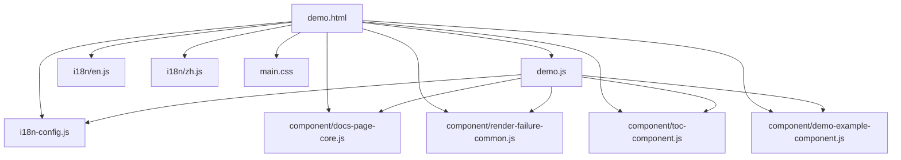
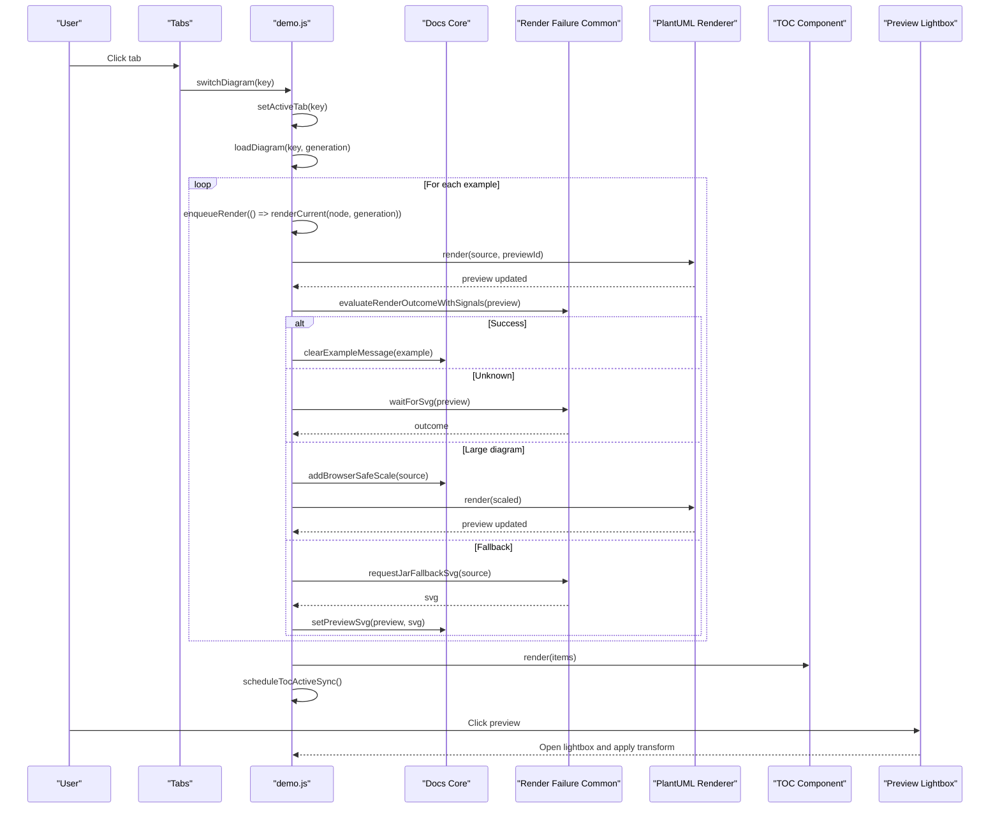
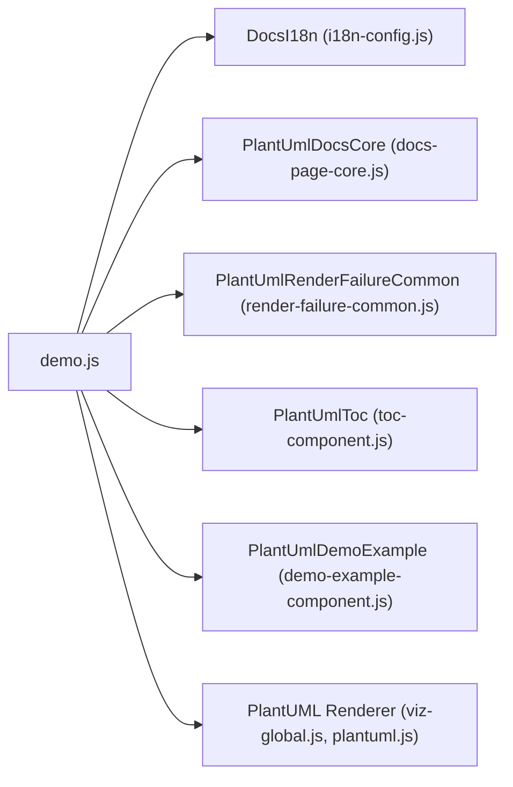

# Main Application Controller

<cite>
**Referenced Files in This Document**
- [demo.js](file://demo.js)
- [demo.html](file://demo.html)
- [i18n-config.js](file://i18n-config.js)
- [i18n/en.js](file://i18n/en.js)
- [i18n/zh.js](file://i18n/zh.js)
- [component/toc-component.js](file://component/toc-component.js)
- [component/docs-page-core.js](file://component/docs-page-core.js)
- [component/render-failure-common.js](file://component/render-failure-common.js)
- [component/demo-example-component.js](file://component/demo-example-component.js)
- [main.css](file://main.css)
</cite>

## Table of Contents
1. [Introduction](#introduction)
2. [Project Structure](#project-structure)
3. [Core Components](#core-components)
4. [Architecture Overview](#architecture-overview)
5. [Detailed Component Analysis](#detailed-component-analysis)
6. [Dependency Analysis](#dependency-analysis)
7. [Performance Considerations](#performance-considerations)
8. [Troubleshooting Guide](#troubleshooting-guide)
9. [Conclusion](#conclusion)

## Introduction
This document explains the main application controller responsible for orchestrating the demo page. It manages UI interactions, the rendering pipeline, and component coordination. The controller initializes the page, handles tab switching, loads diagram examples, synchronizes the table of contents, and manages internationalization. It also implements a robust render queue, error handling, and fallback mechanisms for rendering failures, including a preview lightbox and language switching.

## Project Structure
The demo page is composed of:
- A controller script that orchestrates UI and rendering
- Global components exposed via window objects for rendering, failure handling, and table of contents
- An internationalization system that exposes translation functions and language modes
- Example components that render interactive demo blocks with source editing and actions
- Styles that support responsive layout and lightbox interactions

**Diagram sources**
- [demo.html:81-89](file://demo.html#L81-L89)
- [demo.js:3-11](file://demo.js#L3-L11)
- [i18n-config.js:3-57](file://i18n-config.js#L3-L57)
- [component/docs-page-core.js:3-11](file://component/docs-page-core.js#L3-L11)
- [component/render-failure-common.js:3-11](file://component/render-failure-common.js#L3-L11)
- [component/toc-component.js:3-11](file://component/toc-component.js#L3-L11)
- [component/demo-example-component.js:3-11](file://component/demo-example-component.js#L3-L11)
- [main.css:1-200](file://main.css#L1-L200)

**Section sources**
- [demo.html:1-116](file://demo.html#L1-L116)
- [demo.js:1-120](file://demo.js#L1-L120)

## Core Components
- Internationalization system: Provides language mode, translations, and emits language change events.
- Docs core: Utility functions for reading example source, scaling large diagrams, evaluating render outcomes, and fallback rendering.
- Render failure common: Implements a robust rendering pipeline with timeouts, retries, and fallback to plantuml.jar.
- Table of contents component: Renders and updates active state for navigation.
- Demo example component: Builds example nodes with editable source, preview area, actions, and localization.
- Preview lightbox: Fullscreen viewer for rendered diagrams with zoom, pan, and keyboard controls.

**Section sources**
- [demo.js:3-11](file://demo.js#L3-L11)
- [component/docs-page-core.js:11-464](file://component/docs-page-core.js#L11-L464)
- [component/render-failure-common.js:3-249](file://component/render-failure-common.js#L3-L249)
- [component/toc-component.js:3-84](file://component/toc-component.js#L3-L84)
- [component/demo-example-component.js:3-159](file://component/demo-example-component.js#L3-L159)

## Architecture Overview
The controller coordinates multiple subsystems:
- Initialization: Loads diagram examples, binds tabs, sets up TOC, applies i18n, and starts rendering.
- Tab switching: Updates active tab, resolves diagram key, and triggers rendering with a generation counter to cancel stale renders.
- Rendering pipeline: Queues render tasks, waits for SVG insertion, evaluates outcomes, and applies fallbacks.
- Error handling: Detects runtime errors, large diagrams, and unknown states; retries with scaling or falls back to plantuml.jar.
- UI updates: Applies i18n labels, updates TOC, syncs active state with scroll position, and manages preview lightbox.

**Diagram sources**
- [demo.js:204-287](file://demo.js#L204-L287)
- [demo.js:374-439](file://demo.js#L374-L439)
- [component/render-failure-common.js:160-237](file://component/render-failure-common.js#L160-L237)
- [component/docs-page-core.js:25-35](file://component/docs-page-core.js#L25-L35)
- [component/toc-component.js:21-64](file://component/toc-component.js#L21-L64)
- [demo.js:500-726](file://demo.js#L500-L726)

## Detailed Component Analysis

### Initialization and Bootstrapping
- Initializes language switcher and applies i18n mode.
- Validates presence of core components and demo example creator.
- Sets up preview lightbox and registers a cleanup handler for the runtime error buffer.
- Bootstraps the demo by binding tabs, initializing TOC, loading diagram examples, applying i18n, and rendering the active diagram.

Key behaviors:
- Language change listener refreshes examples and restarts rendering with a new generation.
- Error boundary wraps bootstrap to display a user-friendly message if example loading fails.

**Section sources**
- [demo.js:104-144](file://demo.js#L104-L144)
- [demo.js:146-172](file://demo.js#L146-L172)

### Tab Switching Mechanism
- Listens for tab clicks and switches diagrams.
- Normalizes diagram keys to ensure consistent matching across UI and data.
- Resets render generation and clears the render chain to cancel stale renders.
- Updates active tab visuals, overview visibility, and page title.

**Section sources**
- [demo.js:187-226](file://demo.js#L187-L226)

### Diagram Loading Workflow
- Resolves the active diagram key against loaded examples.
- Iterates examples, builds section headings and descriptions, and creates example nodes.
- Enqueues rendering tasks in a chain to avoid concurrent rendering conflicts.
- Builds TOC items for sections and examples, then renders TOC and schedules active sync.

**Section sources**
- [demo.js:237-287](file://demo.js#L237-L287)

### Render Queue Management
- Maintains a promise chain to serialize rendering operations.
- Uses a generation counter to discard stale renders when switching tabs rapidly.
- Clears timers for debounced source edits to prevent redundant renders.

Rendering steps:
- Reads example source, ensures preview ID, and displays a temporary message.
- Calls the failure-handling renderer with timeouts and error buffers.
- On success, clears messages; on failure, displays localized error messages.

**Section sources**
- [demo.js:237-287](file://demo.js#L237-L287)
- [demo.js:347-351](file://demo.js#L347-L351)
- [demo.js:374-439](file://demo.js#L374-L439)
- [component/render-failure-common.js:160-237](file://component/render-failure-common.js#L160-L237)

### Error Handling and Fallback Strategies
- Runtime error detection via buffered signals and SVG error markers.
- Large diagram detection and automatic scaling with a safe height limit.
- Timeout handling with unknown state rechecks and fallback to plantuml.jar.
- Jar fallback request with detailed error messages for common server issues.

**Section sources**
- [component/docs-page-core.js:178-291](file://component/docs-page-core.js#L178-L291)
- [component/docs-page-core.js:293-355](file://component/docs-page-core.js#L293-L355)
- [component/docs-page-core.js:404-433](file://component/docs-page-core.js#L404-L433)
- [component/render-failure-common.js:132-237](file://component/render-failure-common.js#L132-L237)

### Internationalization Handling
- Exposes language mode, translations, and a dispatcher for language changes.
- Applies language to document metadata and dispatches custom events.
- Controller listens for language changes, refreshes examples, resets generation, and re-renders.

Translation keys include:
- Page title, intro text, tabs accessibility label, section overview, diagram labels, example actions, and UI messages for rendering and actions.

**Section sources**
- [i18n-config.js:3-57](file://i18n-config.js#L3-L57)
- [demo.js:131-144](file://demo.js#L131-L144)
- [demo.js:728-778](file://demo.js#L728-L778)
- [i18n/en.js:4-52](file://i18n/en.js#L4-L52)

### Preview Lightbox Functionality
- Creates a fullscreen overlay with toolbar buttons for zoom, pan, and reset.
- Supports mouse wheel zoom, pointer drag for panning, pinch gestures for zoom, and keyboard escape to close.
- Computes SVG size from viewBox or attributes and fits the view initially.
- Synchronizes labels with language changes.

**Section sources**
- [demo.js:500-726](file://demo.js#L500-L726)

### Table of Contents Synchronization
- Renders TOC with items for sections and examples.
- Schedules active state updates on scroll and resize using requestAnimationFrame.
- Resolves active item by viewport line (25% down) and toggles active class accordingly.

**Section sources**
- [demo.js:297-304](file://demo.js#L297-L304)
- [demo.js:306-345](file://demo.js#L306-L345)
- [component/toc-component.js:21-80](file://component/toc-component.js#L21-L80)

### Event Handling Patterns and Component Integration
- Uses global window objects to integrate components:
  - Docs core for source reading, scaling, and evaluation
  - Render failure common for robust rendering and fallback
  - TOC component for navigation
  - Demo example component for building example nodes
- Handles user actions for copying source, copying SVG, and downloading SVG.
- Debounces source edits with a timer to batch re-renders.

**Section sources**
- [demo.js:353-372](file://demo.js#L353-L372)
- [demo.js:449-483](file://demo.js#L449-L483)
- [demo.js:363-367](file://demo.js#L363-L367)

### Promise-Based Rendering Chain
- Serializes rendering tasks using a promise chain.
- Ensures only the latest generation renders, discarding stale results.
- Waits for SVG insertion with polling and mutation observers, then evaluates outcomes.

**Section sources**
- [demo.js:237-287](file://demo.js#L237-L287)
- [demo.js:347-351](file://demo.js#L347-L351)
- [component/render-failure-common.js:39-84](file://component/render-failure-common.js#L39-L84)

### Memory Management and Cleanup
- Disposes runtime error buffer on page unload to prevent memory leaks.
- Clears render timers when switching tabs to avoid unnecessary work.
- Removes DOM nodes and revokes object URLs after downloads.

**Section sources**
- [demo.js:118-122](file://demo.js#L118-L122)
- [demo.js:360-367](file://demo.js#L360-L367)
- [demo.js:468-477](file://demo.js#L468-L477)

## Dependency Analysis
The controller depends on several global components and the DOM structure defined in the HTML template.

**Diagram sources**
- [demo.js:3-11](file://demo.js#L3-L11)
- [demo.html:79-89](file://demo.html#L79-L89)

**Section sources**
- [demo.js:3-11](file://demo.js#L3-L11)
- [demo.html:79-89](file://demo.html#L79-L89)

## Performance Considerations
- Render queue serialization prevents concurrent rendering and reduces resource contention.
- Debouncing source edits limits re-render frequency during typing.
- Large diagram scaling avoids browser rendering crashes for oversized diagrams.
- RequestAnimationFrame-based TOC sync minimizes layout thrashing.
- CSS grid and minimal transforms optimize layout performance.

[No sources needed since this section provides general guidance]

## Troubleshooting Guide
Common issues and remedies:
- Example loading failures: The controller displays a user-friendly message when example loading fails. Verify the data directory and .ctu files.
- Render timeouts: The rendering pipeline retries with unknown state checks and falls back to plantuml.jar. Ensure the server endpoint is reachable.
- Large diagrams: The controller automatically scales large diagrams. If still failing, reduce diagram complexity.
- Jar fallback errors: Confirm the server is running and the endpoint is available. The controller provides detailed error messages for common scenarios.
- Language switching: Ensure the language mode is persisted and applied correctly. The controller listens for language change events and refreshes content accordingly.

**Section sources**
- [demo.js:124-129](file://demo.js#L124-L129)
- [component/render-failure-common.js:86-115](file://component/render-failure-common.js#L86-L115)
- [component/docs-page-core.js:377-402](file://component/docs-page-core.js#L377-L402)
- [demo.js:131-144](file://demo.js#L131-L144)

## Conclusion
The main application controller serves as the central orchestrator for the demo page. It integrates internationalization, rendering, error handling, and UI components while maintaining a responsive and accessible user experience. Its promise-based rendering chain, robust fallback strategies, and efficient synchronization mechanisms ensure reliable operation across diverse environments.