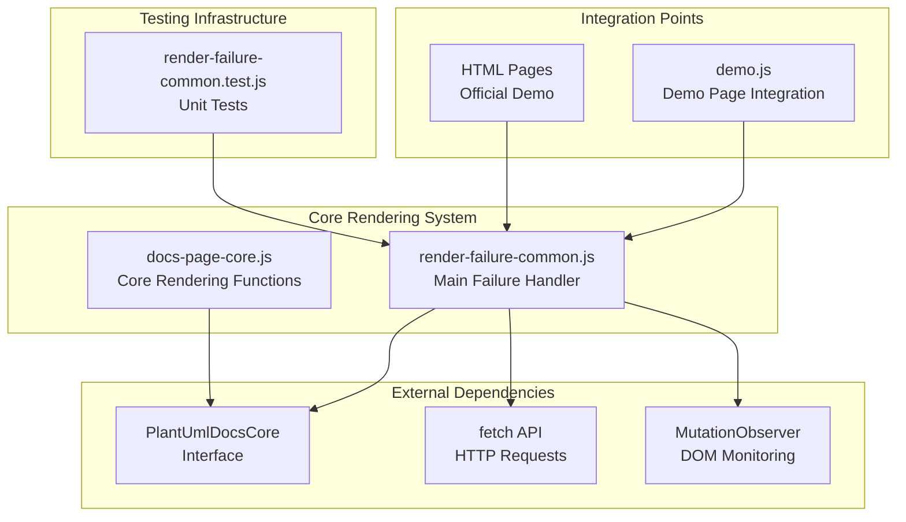
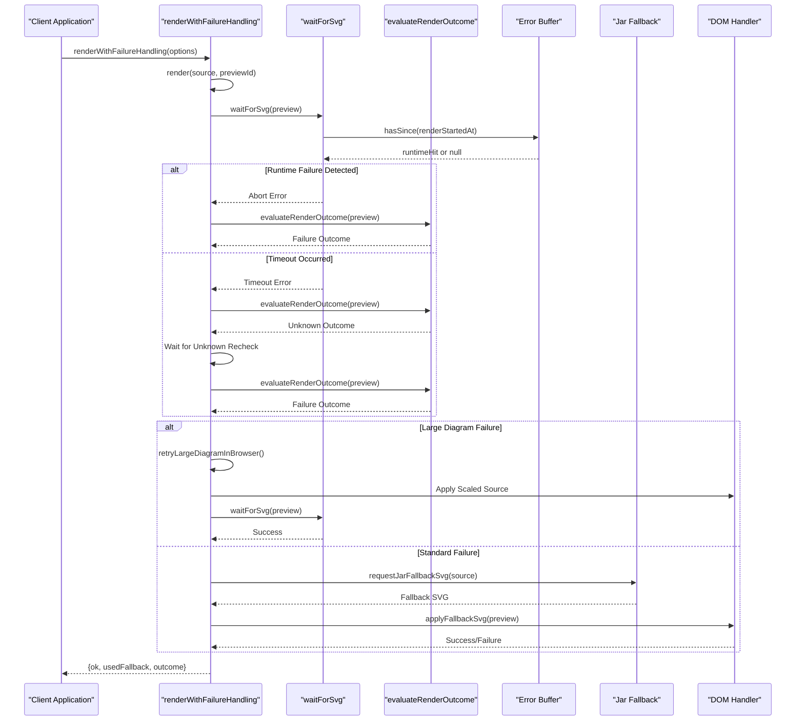
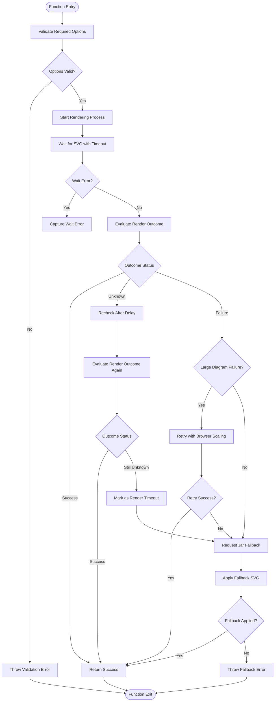
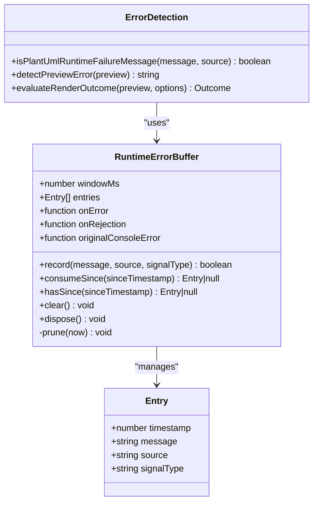
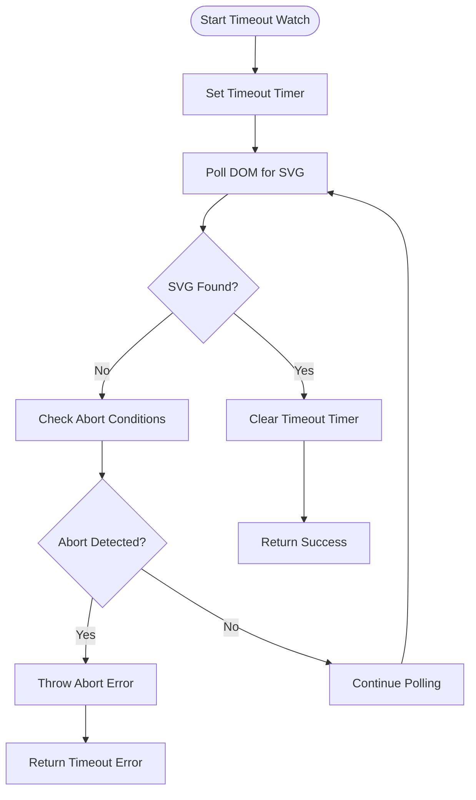
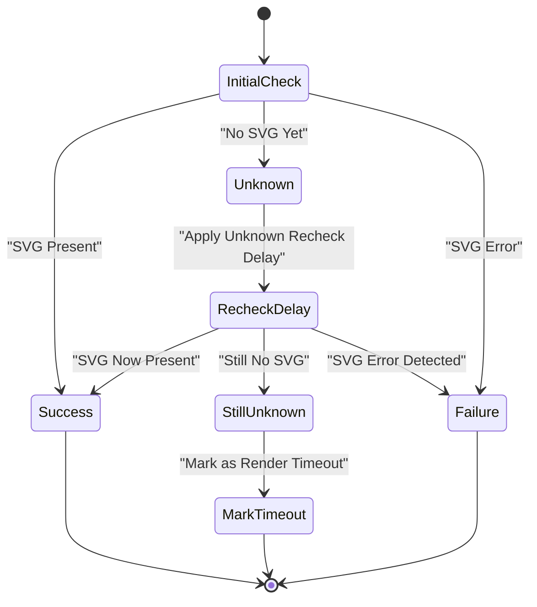
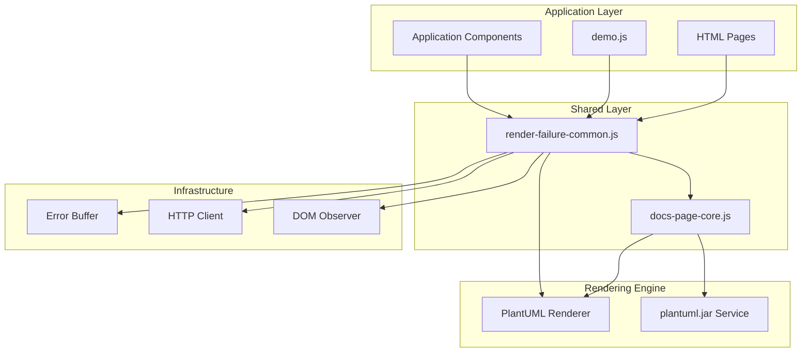
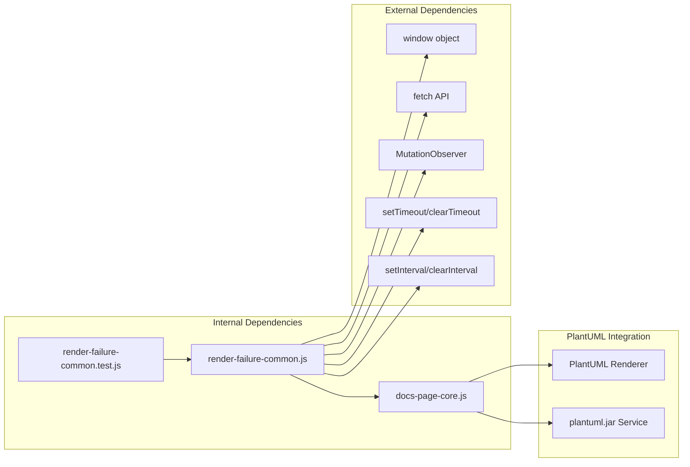

# Render Failure Handling

<cite>
**Referenced Files in This Document**
- [render-failure-common.js](file://component/render-failure-common.js)
- [docs-page-core.js](file://component/docs-page-core.js)
- [render-failure-common.test.js](file://test/render-failure-common.test.js)
- [archimate-diagram_en.html](file://plantuml-official-demo/en/archimate-diagram_en.html)
- [demo.js](file://demo.js)
</cite>

## Table of Contents
1. [Introduction](#introduction)
2. [Project Structure](#project-structure)
3. [Core Components](#core-components)
4. [Architecture Overview](#architecture-overview)
5. [Detailed Component Analysis](#detailed-component-analysis)
6. [Dependency Analysis](#dependency-analysis)
7. [Performance Considerations](#performance-considerations)
8. [Troubleshooting Guide](#troubleshooting-guide)
9. [Conclusion](#conclusion)

## Introduction

The render-failure-common.js module provides comprehensive error handling and recovery mechanisms for diagram rendering in the PlantUML documentation system. This module serves as a critical component that ensures application stability and maintains excellent user experience during rendering failures by implementing sophisticated failure detection, automatic retry mechanisms, and intelligent fallback strategies.

The module operates as a shared failure handling library that integrates seamlessly with the PlantUML rendering pipeline, providing robust error detection algorithms, render timeout handling, unknown state detection, and fallback strategies that gracefully recover from various rendering failures.

## Project Structure

The render failure handling system is organized as follows:

**Diagram sources**
- [render-failure-common.js:1-249](file://component/render-failure-common.js#L1-L249)
- [docs-page-core.js:1-464](file://component/docs-page-core.js#L1-L464)
- [demo.js:1-816](file://demo.js#L1-L816)

**Section sources**
- [render-failure-common.js:1-249](file://component/render-failure-common.js#L1-L249)
- [docs-page-core.js:1-464](file://component/docs-page-core.js#L1-L464)

## Core Components

The render failure handling system consists of several interconnected components that work together to provide comprehensive error management:

### Main Failure Handler Module

The primary module exposes a comprehensive API for handling rendering failures:

- **renderWithFailureHandling**: Main orchestration function that coordinates the entire failure handling process
- **waitForSvg**: Asynchronous polling mechanism for detecting SVG completion
- **evaluateRenderOutcomeWithSignals**: Comprehensive outcome evaluation with error detection
- **requestJarFallbackSvg**: HTTP-based fallback mechanism using plantuml.jar
- **applyFallbackSvg**: DOM insertion mechanism for fallback SVG content

### Core Rendering Functions

The docs-page-core.js module provides essential rendering infrastructure:

- **createRuntimeErrorBuffer**: Runtime error capture and analysis system
- **evaluateRenderOutcome**: Advanced render outcome assessment
- **detectPreviewError**: SVG error detection and classification
- **addBrowserSafeScale**: Large diagram scaling for browser compatibility

### Integration Components

The system integrates with multiple interfaces:

- **MutationObserver**: Real-time DOM change monitoring
- **PlantUmlDocsCore**: Shared rendering interface
- **PlantUmlRenderFailureCommon**: Public API exposure

**Section sources**
- [render-failure-common.js:160-237](file://component/render-failure-common.js#L160-L237)
- [docs-page-core.js:178-355](file://component/docs-page-core.js#L178-L355)

## Architecture Overview

The render failure handling architecture implements a multi-layered approach to error management:

**Diagram sources**
- [render-failure-common.js:160-237](file://component/render-failure-common.js#L160-L237)
- [docs-page-core.js:293-355](file://component/docs-page-core.js#L293-L355)

The architecture implements several key design patterns:

1. **Fail-Fast Pattern**: Immediate detection and reporting of obvious failures
2. **Graceful Degradation**: Progressive fallback to alternative rendering methods
3. **Observability**: Comprehensive error tracking and analysis
4. **Resilience**: Automatic retry mechanisms for transient failures

## Detailed Component Analysis

### renderWithFailureHandling Function

The `renderWithFailureHandling` function serves as the central orchestrator for the entire failure handling process:

**Diagram sources**
- [render-failure-common.js:160-237](file://component/render-failure-common.js#L160-L237)

The function implements sophisticated error detection and recovery mechanisms:

#### Error Detection Algorithms

The module employs multiple layers of error detection:

1. **Runtime Error Detection**: Uses the error buffer to detect runtime failures during rendering
2. **SVG Error Detection**: Analyzes rendered SVG content for error indicators
3. **Timeout Detection**: Monitors rendering progress with configurable timeouts
4. **Unknown State Detection**: Handles scenarios where rendering status is ambiguous

#### Automatic Retry Mechanisms

The system implements intelligent retry logic:

- **Large Diagram Retry**: Automatically scales down large diagrams for browser compatibility
- **Fallback Retry**: Attempts alternative rendering methods when primary fails
- **Progressive Timeout**: Uses exponential backoff for repeated failures

#### Fallback Strategies

Multiple fallback mechanisms ensure rendering success:

- **Jar Fallback**: Uses plantuml.jar service for rendering when browser fails
- **Scaled Rendering**: Applies browser-safe scaling for large diagrams
- **DOM Recovery**: Attempts to recover from partial rendering failures

**Section sources**
- [render-failure-common.js:160-237](file://component/render-failure-common.js#L160-L237)

### Error Buffer System

The error buffer system provides comprehensive runtime error tracking and analysis:

**Diagram sources**
- [docs-page-core.js:178-291](file://component/docs-page-core.js#L178-L291)
- [docs-page-core.js:145-176](file://component/docs-page-core.js#L145-L176)

The error buffer implements several key features:

- **Window-based Tracking**: Maintains errors within configurable time windows
- **Signal Type Classification**: Categorizes different types of runtime failures
- **Automatic Pruning**: Removes expired entries to prevent memory leaks
- **Event Integration**: Hooks into browser error events and console output

**Section sources**
- [docs-page-core.js:178-291](file://component/docs-page-core.js#L178-L291)

### Render Timeout Handling

The timeout handling mechanism provides robust detection and recovery for slow or hanging renders:

**Diagram sources**
- [render-failure-common.js:39-84](file://component/render-failure-common.js#L39-L84)

The timeout system includes:

- **Configurable Timeout Values**: Adjustable timeout periods for different scenarios
- **Polling Intervals**: Efficient polling mechanisms to minimize resource usage
- **Abort Signal Integration**: Real-time abort detection through error buffers
- **Cleanup Mechanisms**: Proper cleanup of timers and observers

**Section sources**
- [render-failure-common.js:39-84](file://component/render-failure-common.js#L39-L84)

### Unknown State Detection

The unknown state detection system handles ambiguous rendering scenarios:

**Diagram sources**
- [render-failure-common.js:195-211](file://component/render-failure-common.js#L195-L211)

The unknown state detection includes:

- **Recheck Delays**: Configurable delays to allow for late SVG generation
- **Outcome Reassessment**: Second-chance evaluation of rendering status
- **Timeout Conversion**: Automatic conversion of unknown states to timeouts
- **Failure Classification**: Proper classification of unknown failures

**Section sources**
- [render-failure-common.js:195-211](file://component/render-failure-common.js#L195-L211)

### Integration with Rendering Pipeline

The module integrates deeply with the PlantUML rendering pipeline:

**Diagram sources**
- [render-failure-common.js:3-4](file://component/render-failure-common.js#L3-L4)
- [demo.js:392-403](file://demo.js#L392-L403)

The integration provides:

- **Seamless API Exposure**: Clean public API through PlantUmlRenderFailureCommon
- **Core Function Integration**: Deep integration with PlantUmlDocsCore interface
- **Event System Integration**: Full integration with browser error and rejection events
- **DOM Manipulation**: Safe and efficient DOM manipulation for error display

**Section sources**
- [render-failure-common.js:3-4](file://component/render-failure-common.js#L3-L4)
- [demo.js:392-403](file://demo.js#L392-L403)

## Dependency Analysis

The render failure handling system has carefully managed dependencies that ensure modularity and maintainability:

**Diagram sources**
- [render-failure-common.js:1-249](file://component/render-failure-common.js#L1-L249)
- [docs-page-core.js:1-464](file://component/docs-page-core.js#L1-L464)

### Coupling and Cohesion Analysis

The module demonstrates excellent design principles:

- **Low Internal Coupling**: Functions are modular and self-contained
- **High External Cohesion**: Strong integration with PlantUML ecosystem
- **Interface-Based Design**: Reliance on well-defined interfaces rather than implementation details
- **Event-Driven Architecture**: Minimal direct dependencies, maximizing flexibility

### Potential Circular Dependencies

The system avoids circular dependencies through:

- **Forward References**: Core functions are referenced but not directly dependent
- **Event-Driven Communication**: No direct function calls between modules
- **Interface Contracts**: Clear separation of concerns through interfaces

**Section sources**
- [render-failure-common.js:1-249](file://component/render-failure-common.js#L1-L249)
- [docs-page-core.js:1-464](file://component/docs-page-core.js#L1-L464)

## Performance Considerations

The render failure handling system is designed with performance optimization in mind:

### Memory Management

- **Automatic Cleanup**: All timers, intervals, and observers are properly cleaned up
- **Error Buffer Pruning**: Automatic removal of expired error entries prevents memory leaks
- **DOM Cleanup**: Proper cleanup of temporary DOM elements and event listeners

### Resource Optimization

- **Efficient Polling**: Configurable polling intervals minimize CPU usage
- **Early Termination**: Immediate termination on success or critical failures
- **Lazy Loading**: Error detection and fallback mechanisms are only activated when needed

### Scalability Features

- **Configurable Timeouts**: Adjustable timeout values for different use cases
- **Modular Design**: Individual components can be used independently
- **Event-Driven Architecture**: Minimizes blocking operations and improves responsiveness

## Troubleshooting Guide

### Common Issues and Solutions

#### Render Timeout Issues

**Symptoms**: Renders hang indefinitely or exceed timeout limits
**Causes**: Large diagrams, complex layouts, or browser performance issues
**Solutions**:
- Increase `renderWaitMs` parameter for complex diagrams
- Enable large diagram scaling automatically
- Monitor browser performance and optimize diagram complexity

#### Fallback Service Failures

**Symptoms**: Jar fallback requests fail or return invalid responses
**Causes**: Network connectivity, server unavailability, or incorrect endpoints
**Solutions**:
- Verify fallback endpoint accessibility
- Check network connectivity and firewall settings
- Ensure plantuml.jar service is running and configured correctly

#### Error Detection Problems

**Symptoms**: Runtime errors not being detected or incorrectly classified
**Causes**: Insufficient error buffering, missing event handlers, or detection algorithm limitations
**Solutions**:
- Configure appropriate error buffer window sizes
- Ensure proper event handler registration
- Review and adjust error detection thresholds

### Diagnostic Capabilities

The system provides comprehensive diagnostic information:

- **Outcome Descriptions**: Human-readable descriptions of render outcomes
- **Error Classification**: Detailed categorization of different error types
- **Timing Information**: Performance metrics and timing data
- **Debug Logging**: Extensive logging for troubleshooting and analysis

**Section sources**
- [render-failure-common.js:11-16](file://component/render-failure-common.js#L11-L16)
- [docs-page-core.js:377-402](file://component/docs-page-core.js#L377-L402)

## Conclusion

The render-failure-common.js module represents a sophisticated and robust solution for handling diagram rendering failures in the PlantUML ecosystem. Through its multi-layered approach to error detection, automatic recovery mechanisms, and intelligent fallback strategies, it ensures application stability and maintains excellent user experience even under challenging conditions.

The module's design demonstrates excellent software engineering principles, including modularity, extensibility, and maintainability. Its deep integration with the PlantUML rendering pipeline and comprehensive error handling capabilities make it an essential component for any production-ready PlantUML documentation system.

Key strengths of the implementation include:

- **Comprehensive Error Coverage**: Handles virtually all types of rendering failures
- **Intelligent Recovery**: Implements multiple layers of fallback mechanisms
- **Performance Optimization**: Minimizes resource usage while maximizing reliability
- **Developer Experience**: Provides clear diagnostics and easy integration
- **Scalability**: Adaptable to different use cases and performance requirements

The module successfully balances reliability, performance, and usability, making it an exemplary implementation of error handling and recovery systems in modern web applications.