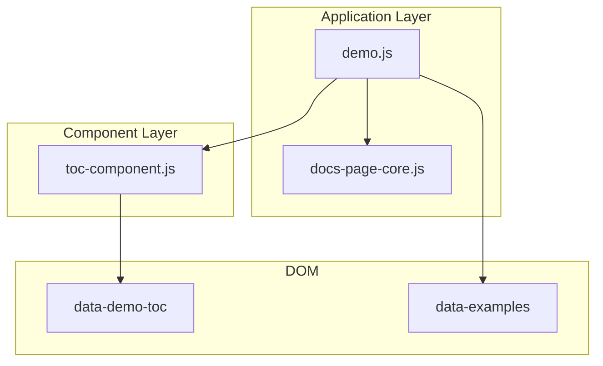
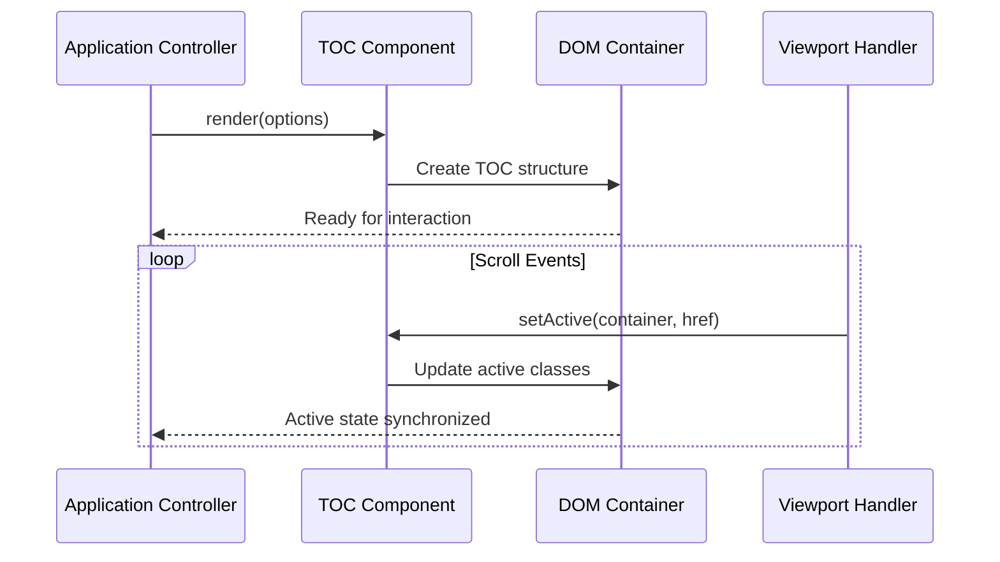
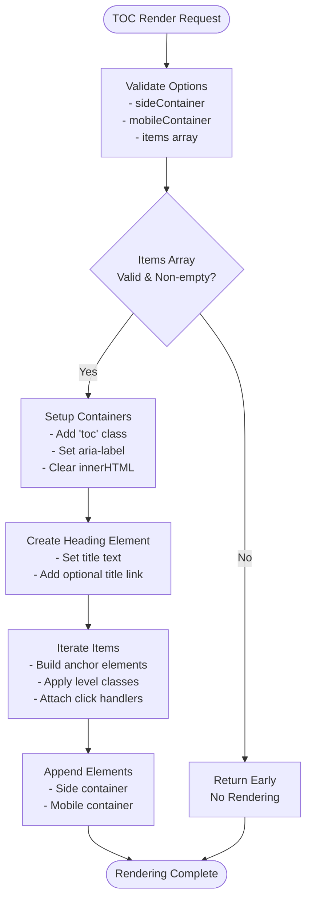
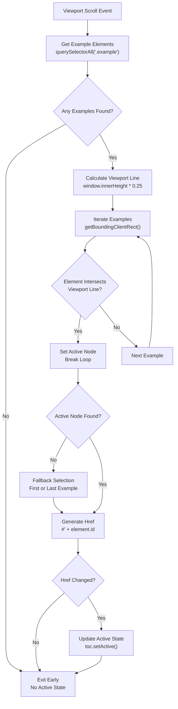
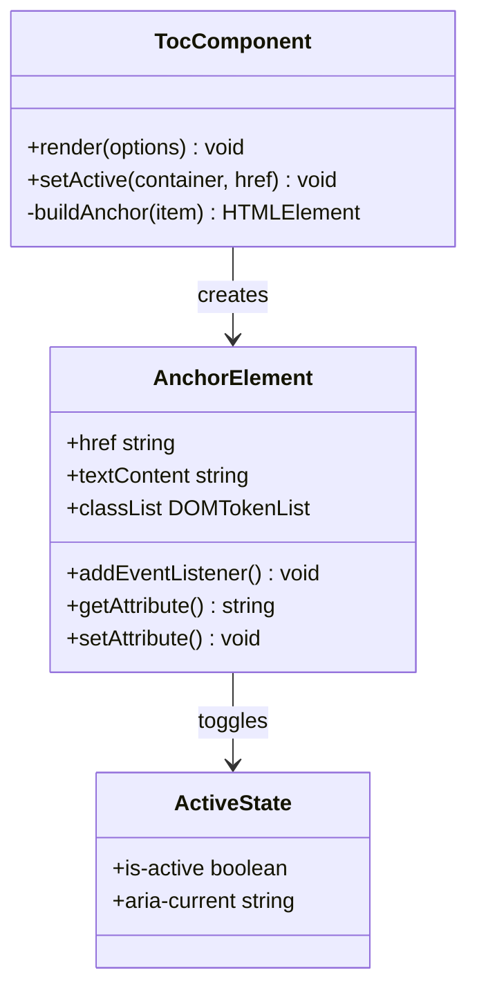
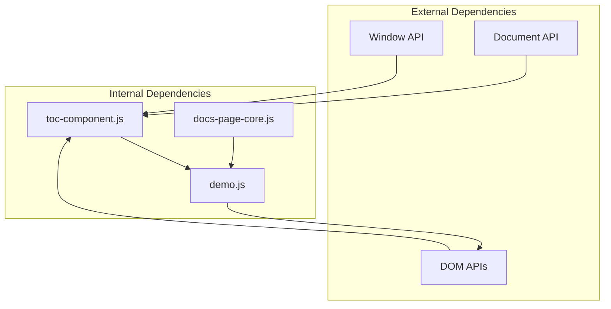

# Table of Contents Component

<cite>
**Referenced Files in This Document**
- [toc-component.js](file://component/toc-component.js)
- [demo.js](file://demo.js)
- [docs-page-core.js](file://component/docs-page-core.js)
</cite>

## Table of Contents
1. [Introduction](#introduction)
2. [Project Structure](#project-structure)
3. [Core Components](#core-components)
4. [Architecture Overview](#architecture-overview)
5. [Detailed Component Analysis](#detailed-component-analysis)
6. [Dependency Analysis](#dependency-analysis)
7. [Performance Considerations](#performance-considerations)
8. [Troubleshooting Guide](#troubleshooting-guide)
9. [Conclusion](#conclusion)

## Introduction
This document provides comprehensive technical documentation for the TOC (Table of Contents) component responsible for generating and managing the side table of contents in the frontend application. It explains the TOC rendering system, active state synchronization, viewport-based navigation, integration with the main application controller, scroll event handling, and dynamic content updates. The documentation also covers viewport line detection algorithms, active link highlighting, smooth scrolling integration, performance considerations for large document structures, and responsive behavior.

## Project Structure
The TOC component is implemented as a standalone module that exposes a simple API for rendering and updating active states. It integrates with the main demo page controller to synchronize the active TOC link with the current viewport position.



**Diagram sources**
- [toc-component.js:1-84](file://component/toc-component.js#L1-L84)
- [demo.js:195-200](file://demo.js#L195-L200)
- [demo.js:320-345](file://demo.js#L320-L345)

**Section sources**
- [toc-component.js:1-84](file://component/toc-component.js#L1-L84)
- [demo.js:195-200](file://demo.js#L195-L200)

## Core Components
The TOC component consists of two primary functions:
- `render(options)`: Creates and populates the TOC HTML structure from a data model
- `setActive(container, href)`: Updates the active state of TOC links based on the current location

Key features:
- Dynamic anchor element creation with proper accessibility attributes
- Support for hierarchical TOC levels with CSS classes
- Click event handling with custom onClick callbacks
- Mobile-responsive TOC container support
- Internationalization-friendly title rendering

**Section sources**
- [toc-component.js:21-54](file://component/toc-component.js#L21-L54)
- [toc-component.js:66-80](file://component/toc-component.js#L66-L80)

## Architecture Overview
The TOC system follows a unidirectional data flow pattern where the application controller generates TOC data from document structure, renders it via the TOC component, and maintains synchronization with viewport position.



**Diagram sources**
- [demo.js:320-345](file://demo.js#L320-L345)
- [toc-component.js:21-54](file://component/toc-component.js#L21-L54)

## Detailed Component Analysis

### TOC Rendering System
The rendering system transforms structured data into accessible HTML with proper semantic markup and internationalization support.



**Diagram sources**
- [toc-component.js:21-54](file://component/toc-component.js#L21-L54)

**Section sources**
- [toc-component.js:21-54](file://component/toc-component.js#L21-L54)

### Active State Synchronization
The active state synchronization mechanism uses viewport intersection detection to automatically update the TOC based on visible content.



**Diagram sources**
- [demo.js:320-345](file://demo.js#L320-L345)

**Section sources**
- [demo.js:320-345](file://demo.js#L320-L345)

### Viewport Line Detection Algorithm
The viewport line detection algorithm uses a 25% offset from the top of the viewport to determine the active example section. This approach ensures that the active TOC link updates appropriately as users scroll through content.

Key algorithm characteristics:
- Uses `window.innerHeight * 0.25` to calculate the detection line
- Iterates through all `.example` elements to find intersection
- Falls back to first or last element if no intersection found
- Returns URL hash fragments for navigation compatibility

**Section sources**
- [demo.js:320-337](file://demo.js#L320-L337)

### Active Link Highlighting
The active link highlighting system manages CSS classes and ARIA attributes to indicate the currently active TOC item.



**Diagram sources**
- [toc-component.js:66-80](file://component/toc-component.js#L66-L80)
- [toc-component.js:4-19](file://component/toc-component.js#L4-L19)

**Section sources**
- [toc-component.js:66-80](file://component/toc-component.js#L66-L80)

### Integration with Main Application Controller
The TOC component integrates seamlessly with the main application controller through a well-defined API contract.

```mermaid
sequenceDiagram
participant Controller as Demo Controller
participant Toc as TOC Component
participant DOM as DOM Elements
Controller->>Toc : render({
sideContainer : DOM element
titleText : "Diagram Title"
items : [{href, label, level, onClick}]
})
Toc->>DOM : Populate TOC structure
DOM-->>Controller : Ready for interaction
Controller->>Toc : setActive(sideToc, '#example-id')
Toc->>DOM : Update active classes
DOM-->>Controller : State synchronized
Controller->>Controller : resolveExampleHrefAtViewportLine()
Controller->>Toc : setActive(sideToc, href)
Toc->>DOM : Update active classes
```

**Diagram sources**
- [demo.js:195-200](file://demo.js#L195-L200)
- [demo.js:339-345](file://demo.js#L339-L345)

**Section sources**
- [demo.js:195-200](file://demo.js#L195-L200)
- [demo.js:339-345](file://demo.js#L339-L345)

## Dependency Analysis
The TOC component maintains loose coupling with external dependencies while providing a focused API surface.



**Diagram sources**
- [toc-component.js:1-84](file://component/toc-component.js#L1-L84)
- [demo.js:1-200](file://demo.js#L1-L200)

**Section sources**
- [toc-component.js:1-84](file://component/toc-component.js#L1-L84)
- [demo.js:1-200](file://demo.js#L1-L200)

## Performance Considerations
For large document structures, several optimization strategies should be considered:

### Rendering Performance
- **Batch DOM Operations**: Group multiple DOM updates into single operations
- **Virtual Scrolling**: Implement virtualization for extremely large TOC lists
- **Debounced Updates**: Debounce scroll events to reduce frequent reflows

### Memory Management
- **Event Listener Cleanup**: Remove unused event listeners when switching diagrams
- **Weak References**: Use weak references for DOM nodes when appropriate
- **Lazy Loading**: Load TOC items on-demand as users navigate

### Accessibility Optimization
- **Reduced ARIA Complexity**: Minimize ARIA attributes for large lists
- **Focus Management**: Implement efficient focus management for keyboard navigation
- **Screen Reader Optimization**: Optimize announcements for assistive technologies

## Troubleshooting Guide
Common issues and their solutions:

### TOC Not Updating
**Symptoms**: Active TOC link remains static during scrolling
**Causes**: 
- Missing viewport event listeners
- Incorrect element selectors
- Timing issues with DOM readiness

**Solutions**:
- Verify `examplesContainer` selector exists
- Ensure `resolveExampleHrefAtViewportLine()` executes after DOM load
- Check for console errors in viewport detection logic

### Active State Not Persisting
**Symptoms**: Active state resets when navigating between sections
**Causes**:
- Missing `activeTocHref` tracking variable
- Event listener conflicts between sections

**Solutions**:
- Initialize `activeTocHref` variable in controller scope
- Implement proper event listener cleanup when switching diagrams

### Rendering Issues
**Symptoms**: TOC fails to render or displays incorrectly
**Causes**:
- Invalid items array format
- Missing DOM containers
- CSS class conflicts

**Solutions**:
- Validate items array structure before rendering
- Ensure `sideContainer` and `mobileContainer` exist
- Check CSS specificity conflicts with existing styles

**Section sources**
- [demo.js:320-345](file://demo.js#L320-L345)
- [toc-component.js:21-54](file://component/toc-component.js#L21-L54)

## Conclusion
The TOC component provides a robust, accessible, and performant solution for managing table of contents in the application. Its modular design enables seamless integration with the main application controller while maintaining flexibility for various use cases. The viewport-based synchronization system ensures accurate active state management, and the component's API design supports easy customization and extension for future requirements.

The implementation demonstrates good separation of concerns, proper accessibility considerations, and efficient DOM manipulation patterns that scale well for both small and large document structures.