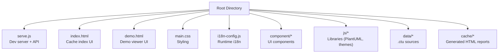
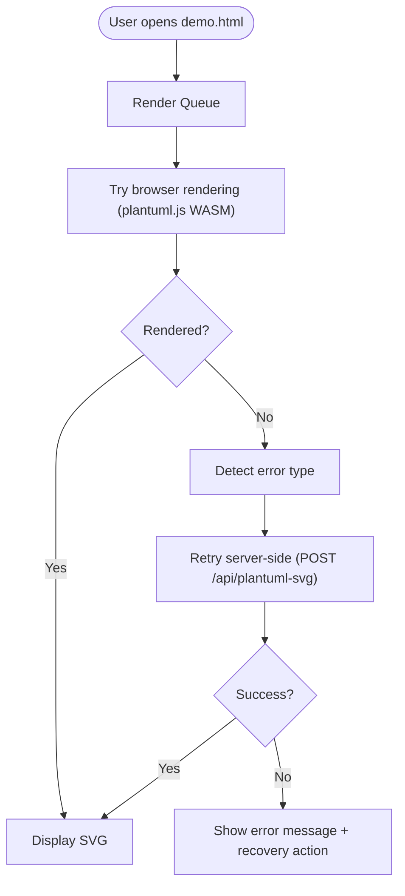
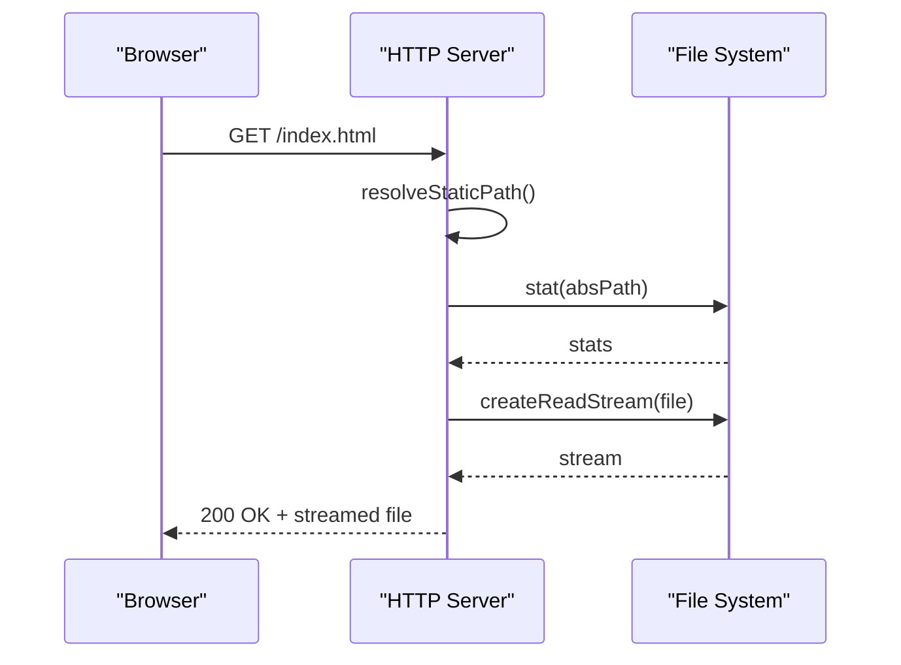
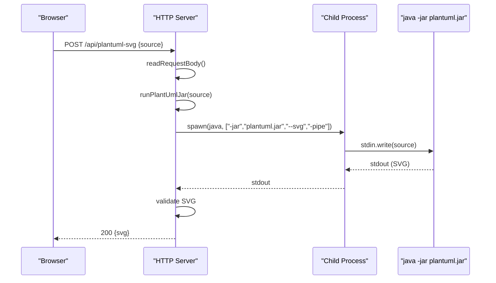
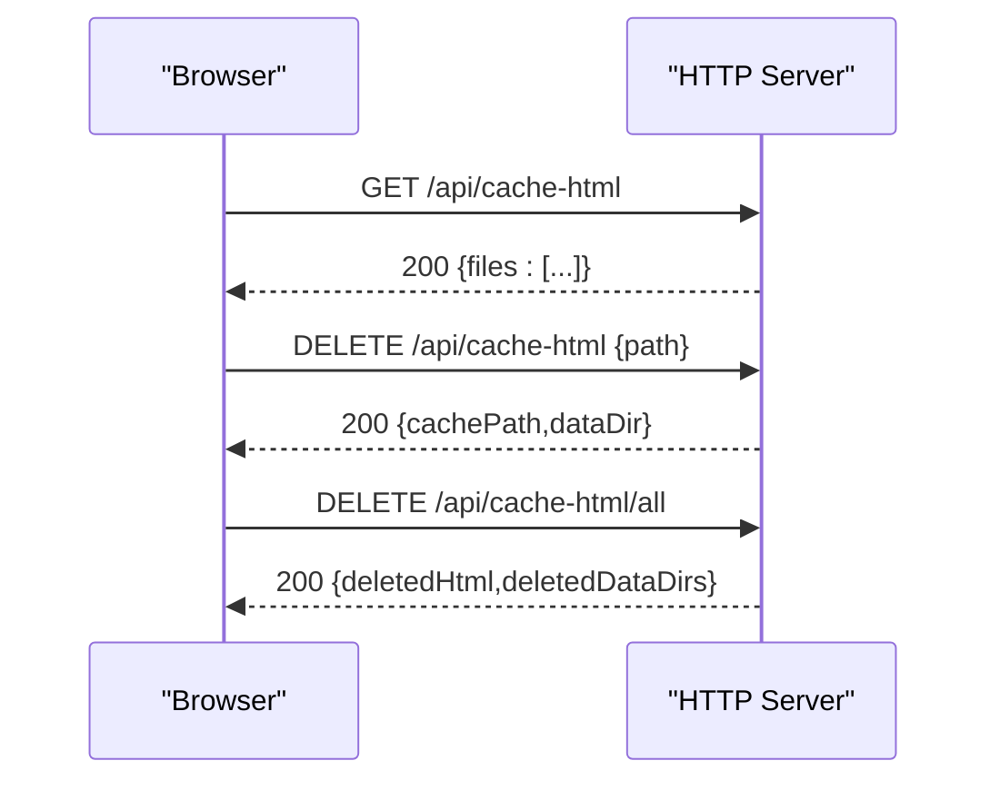
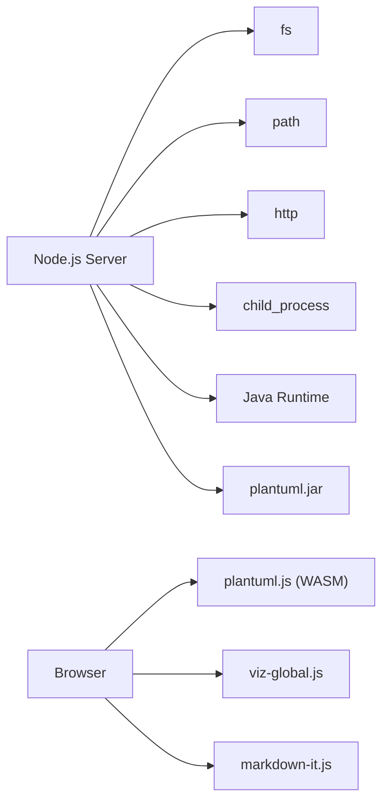
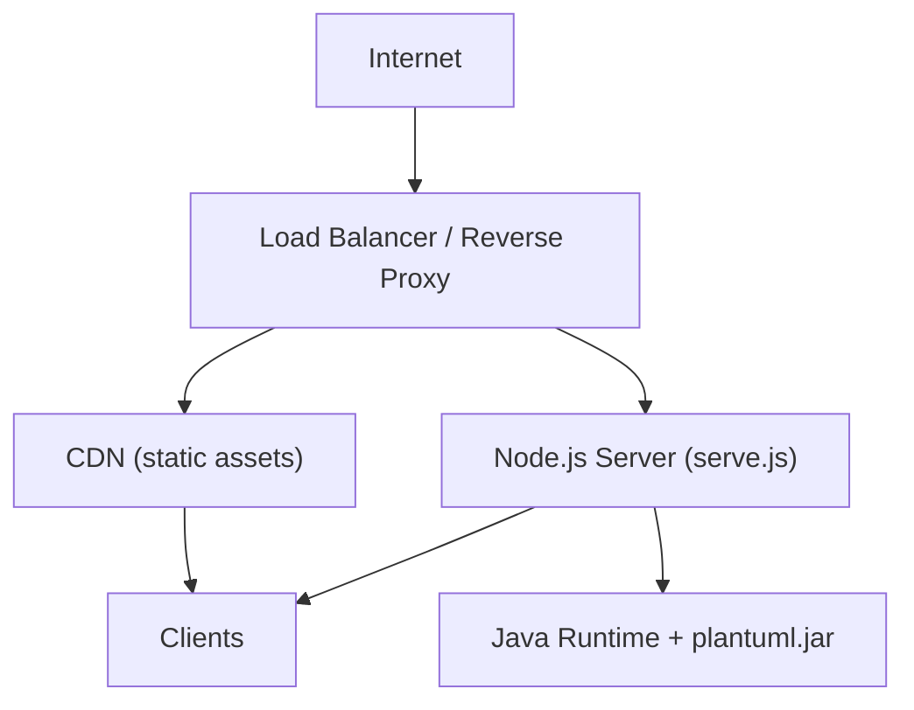

# Deployment and Production

<cite>
**Referenced Files in This Document**
- [README.md](file://README.md)
- [serve.js](file://serve.js)
- [serve.sh](file://serve.sh)
- [serve.bat](file://serve.bat)
- [install.js](file://install.js)
- [index.html](file://index.html)
- [demo.html](file://demo.html)
- [main.css](file://main.css)
- [i18n-config.js](file://i18n-config.js)
</cite>

## Table of Contents
1. [Introduction](#introduction)
2. [Project Structure](#project-structure)
3. [Core Components](#core-components)
4. [Architecture Overview](#architecture-overview)
5. [Detailed Component Analysis](#detailed-component-analysis)
6. [Dependency Analysis](#dependency-analysis)
7. [Performance Considerations](#performance-considerations)
8. [Security Considerations](#security-considerations)
9. [Production Deployment Topology](#production-deployment-topology)
10. [Containerization Options](#containerization-options)
11. [Monitoring and Logging](#monitoring-and-logging)
12. [Backup and Maintenance](#backup-and-maintenance)
13. [Troubleshooting Guide](#troubleshooting-guide)
14. [Conclusion](#conclusion)

## Introduction
This document provides production-grade deployment guidance for Code-To-UML. It covers server configuration, environment variables, API endpoints, security hardening, performance optimization, containerization, monitoring, backups, and maintenance procedures. The system is designed around a Node.js development server that serves static assets and exposes a PlantUML fallback rendering endpoint, while client-side rendering leverages WASM for speed and resilience.

## Project Structure
The repository is a static site generator with a small Node.js server:
- Static assets: HTML, CSS, JS, images, and PlantUML templates/data
- Server: a lightweight HTTP server that serves static files and exposes APIs
- Optional AI skill registration via a setup script

**Diagram sources**
- [README.md:166-198](file://README.md#L166-L198)
- [serve.js:12-24](file://serve.js#L12-L24)

**Section sources**
- [README.md:166-198](file://README.md#L166-L198)
- [serve.js:12-24](file://serve.js#L12-L24)

## Core Components
- Static file server: Serves HTML, CSS, JS, images, and WASM libraries from the project root with strict path checks.
- API endpoints:
  - GET /api/demo-examples: Returns parsed .ctu examples for the demo UI.
  - POST /api/plantuml-svg: Server-side PlantUML rendering fallback using Java + plantuml.jar.
  - GET /api/cache-html: Lists generated HTML reports in cache/.
  - DELETE /api/cache-html: Deletes a specific HTML report and associated data directory.
  - DELETE /api/cache-html/all: Clears all generated HTML and non-demo data directories.
- Client-side rendering: Uses PlantUML WASM for fast rendering; falls back to the server when needed.
- Internationalization: Runtime i18n stored in localStorage and applied via i18n-config.js.

**Section sources**
- [serve.js:454-561](file://serve.js#L454-L561)
- [README.md:202-224](file://README.md#L202-L224)
- [README.md:226-234](file://README.md#L226-L234)
- [i18n-config.js:12-57](file://i18n-config.js#L12-L57)

## Architecture Overview
The rendering pipeline prioritizes client-side WASM rendering with automatic server fallback for edge cases.

**Diagram sources**
- [README.md:237-274](file://README.md#L237-L274)

**Section sources**
- [README.md:237-274](file://README.md#L237-L274)

## Detailed Component Analysis

### Static File Serving and Path Validation
- Path resolution enforces that requested paths are within the project root and resolves special cases for legacy JS paths.
- MIME type mapping ensures correct content types for static assets.
- HEAD support and streaming reduce memory footprint.

**Diagram sources**
- [serve.js:397-452](file://serve.js#L397-L452)

**Section sources**
- [serve.js:397-452](file://serve.js#L397-L452)

### API Endpoints and Request Handling
- /api/demo-examples: Parses .ctu files from data/<dir>, filters by language, and returns grouped examples.
- /api/plantuml-svg: Validates JSON body, extracts PlantUML source, spawns java -jar plantuml.jar --svg -pipe, captures stdout, validates SVG output, and returns JSON with svg.
- /api/cache-html: Lists HTML files in cache/, excluding _TEMPLATE.html.
- /api/cache-html (DELETE): Deletes a specific HTML and its matching data directory.
- /api/cache-html/all (DELETE): Clears generated HTML and non-demo data directories.

**Diagram sources**
- [serve.js:472-496](file://serve.js#L472-L496)
- [serve.js:56-88](file://serve.js#L56-L88)

**Section sources**
- [serve.js:472-496](file://serve.js#L472-L496)
- [serve.js:56-88](file://serve.js#L56-L88)

### Cache Management UI
- index.html lists generated HTML reports, supports per-file deletion, and bulk clearing.
- Uses /api/cache-html endpoints to manage cache.

**Diagram sources**
- [index.html:349-395](file://index.html#L349-L395)
- [serve.js:498-540](file://serve.js#L498-L540)

**Section sources**
- [index.html:349-395](file://index.html#L349-L395)
- [serve.js:498-540](file://serve.js#L498-L540)

### Internationalization Runtime
- Reads/stores language preference in localStorage.
- Applies language to document and dispatches a docs:langchange event.

**Section sources**
- [i18n-config.js:12-57](file://i18n-config.js#L12-L57)

## Dependency Analysis
- Node.js built-ins: fs, path, http, child_process.
- External runtime dependencies:
  - Java (JRE/JDK) for server-side PlantUML rendering fallback.
  - PlantUML standalone JAR (plantuml.jar) must be present in the working directory for the fallback endpoint to function.
- Client-side libraries: PlantUML WASM, Viz.js (Graphviz), markdown-it, and theme libraries loaded from js/.

**Diagram sources**
- [serve.js:3-6](file://serve.js#L3-L6)
- [README.md:66-77](file://README.md#L66-L77)

**Section sources**
- [serve.js:3-6](file://serve.js#L3-L6)
- [README.md:66-77](file://README.md#L66-L77)

## Performance Considerations
- Prefer client-side WASM rendering to avoid server round-trips for most diagrams.
- Cache generated HTML reports in cache/ to minimize repeated generation.
- Serve static assets with compression and appropriate caching headers via a reverse proxy or CDN.
- Use CDN for js/ libraries and images to reduce origin load.
- Limit concurrent fallback rendering by rate-limiting POST /api/plantuml-svg or by adding a queue.
- Monitor CPU and memory usage of the Java process during fallback rendering.

[No sources needed since this section provides general guidance]

## Security Considerations
- Input validation for PlantUML fallback:
  - Validate JSON body and enforce a reasonable request size limit.
  - Reject empty or whitespace-only PlantUML source.
  - Verify SVG output contains expected markers before returning.
- Path traversal protection:
  - All static paths are resolved relative to the project root and validated to prevent directory traversal.
  - Cache HTML path resolution enforces .html extension and disallows deletion of _TEMPLATE.html.
- Method enforcement:
  - Only GET/HEAD/POST/DELETE are supported; other methods return 405.
- CORS:
  - The embedded server does not set CORS headers. For cross-origin access, deploy behind a reverse proxy that adds appropriate Access-Control-Allow-* headers.
- Sanitization:
  - Treat PlantUML source as untrusted input. Consider limiting diagram complexity or timeout for rendering.
- Least privilege:
  - Run the Node.js process with minimal privileges and restrict filesystem access to the project root.

**Section sources**
- [serve.js:37-54](file://serve.js#L37-L54)
- [serve.js:193-215](file://serve.js#L193-L215)
- [serve.js:454-561](file://serve.js#L454-L561)

## Production Deployment Topology
Recommended topology:
- Reverse proxy (e.g., Nginx/Caddy) or cloud load balancer:
  - Exposes HTTPS and terminates TLS.
  - Serves static assets from cache/ and project root with caching headers.
  - Proxies API requests to the Node.js server.
- Node.js server:
  - Listens on loopback or internal interface (e.g., 127.0.0.1:PORT).
  - Requires Java installed and plantuml.jar present in working directory.
- Optional CDN:
  - Hosts js/ and media assets for global distribution.
- Monitoring:
  - Proxy logs + application logs for health checks and metrics.

[No sources needed since this diagram shows conceptual workflow, not actual code structure]

## Containerization Options
- Base image: node:alpine or node:slim for the server; include OpenJDK for fallback rendering.
- Copy project files into container; ensure plantuml.jar is present at runtime.
- Expose port 80 (or 443 via proxy) and mount cache/ for persistence.
- Entrypoint: start the server with ./serve.sh or node serve.js.
- Health check: curl against /api/demo-examples to verify readiness.

[No sources needed since this section provides general guidance]

## Monitoring and Logging
- Application logs:
  - Redirect Node.js stdout/stderr to syslog or a log aggregator.
  - Capture errors from /api/plantuml-svg and cache management endpoints.
- Metrics:
  - Track request counts, response times, and error rates for each endpoint.
  - Monitor Java process resource usage during fallback rendering.
- Health checks:
  - Liveness probe: curl /api/demo-examples
  - Readiness probe: verify cache directory accessibility and Java availability
- Alerting:
  - High error rates, cache growth, and Java rendering failures.

[No sources needed since this section provides general guidance]

## Backup and Maintenance
- Backups:
  - Periodically archive cache/ and data/ directories.
  - Store offsite copies of generated reports for audit/recovery.
- Maintenance:
  - Rotate logs and enforce disk quotas on cache/.
  - Monitor free disk space and prune old reports automatically.
  - Update plantuml.jar and Node.js runtime regularly.
- Disaster recovery:
  - Restore from latest backup and redeploy with verified plantuml.jar.

[No sources needed since this section provides general guidance]

## Troubleshooting Guide
- Server fails to start or port is in use:
  - Use serve.sh or serve.bat to launch with automatic port cleanup.
- Java not found or plantuml.jar missing:
  - Ensure Java is installed and plantuml.jar is present in the working directory.
  - Confirm the fallback endpoint responds and returns SVG.
- Static assets not loading:
  - Verify path resolution and MIME types; confirm paths are within project root.
- Cache management errors:
  - Check permissions for cache/ and data/; ensure _TEMPLATE.html is not being deleted.
- CORS issues:
  - Configure reverse proxy to add Access-Control-Allow-Origin and related headers.

**Section sources**
- [serve.sh:8-33](file://serve.sh#L8-L33)
- [serve.bat:10-15](file://serve.bat#L10-L15)
- [README.md:83-86](file://README.md#L83-L86)
- [README.md:214-223](file://README.md#L214-L223)

## Conclusion
Deploying Code-To-UML in production centers on a lightweight Node.js server that serves static assets and provides a secure, rate-limited PlantUML fallback endpoint. Combine a reverse proxy for TLS and CORS, a CDN for static delivery, and robust monitoring and backup procedures to achieve a reliable, scalable system.