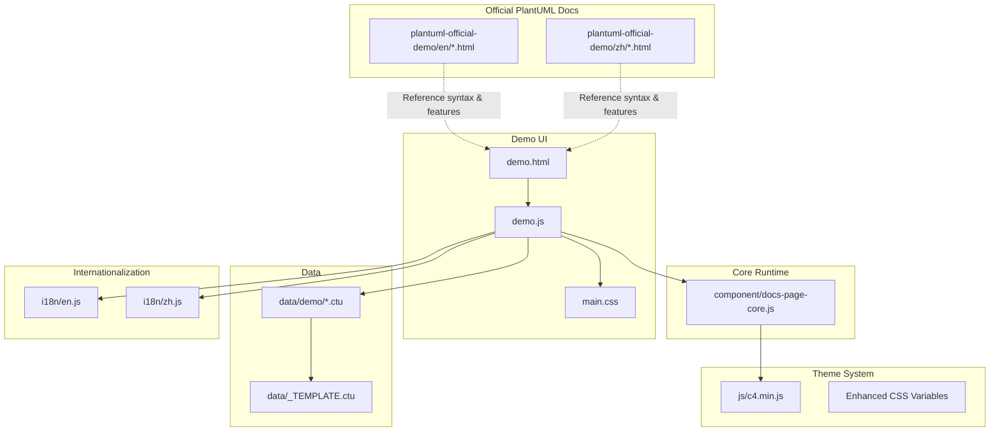
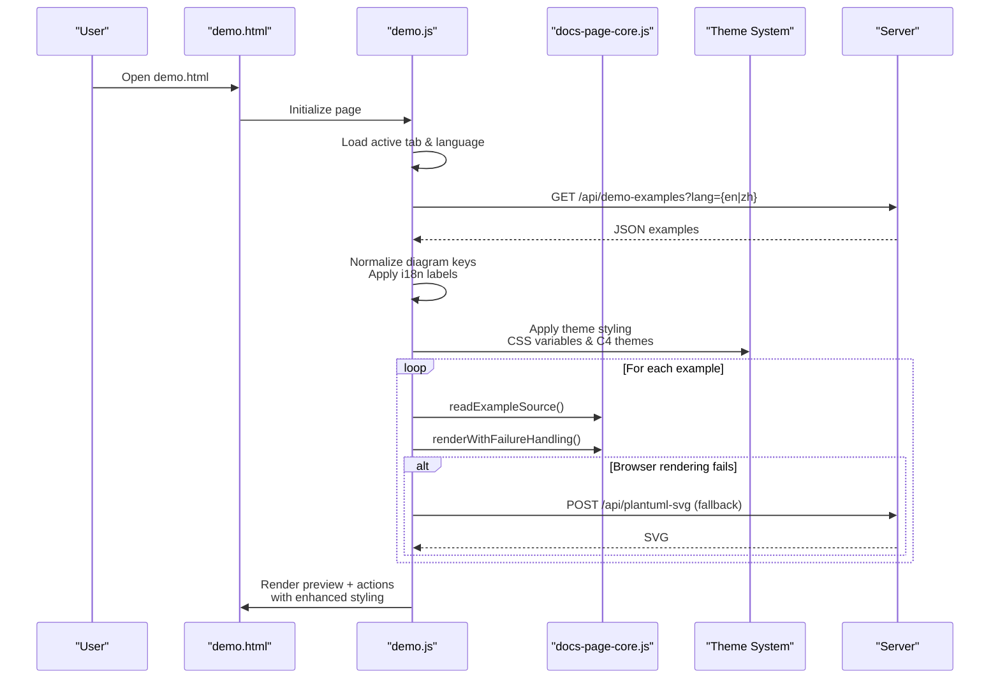
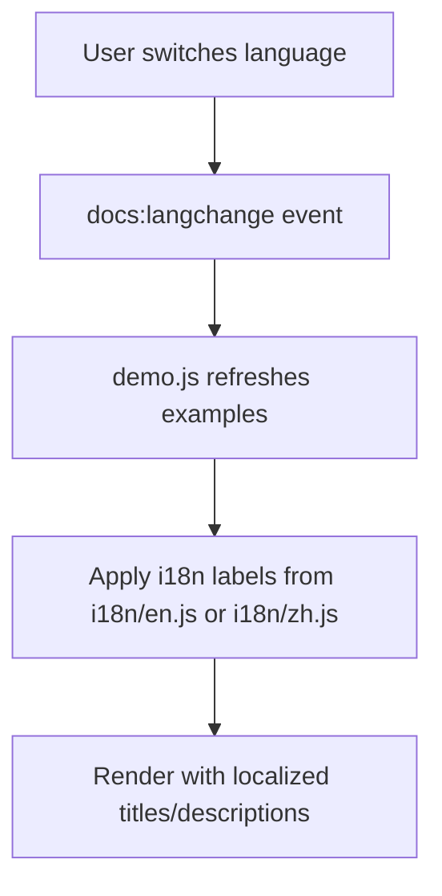
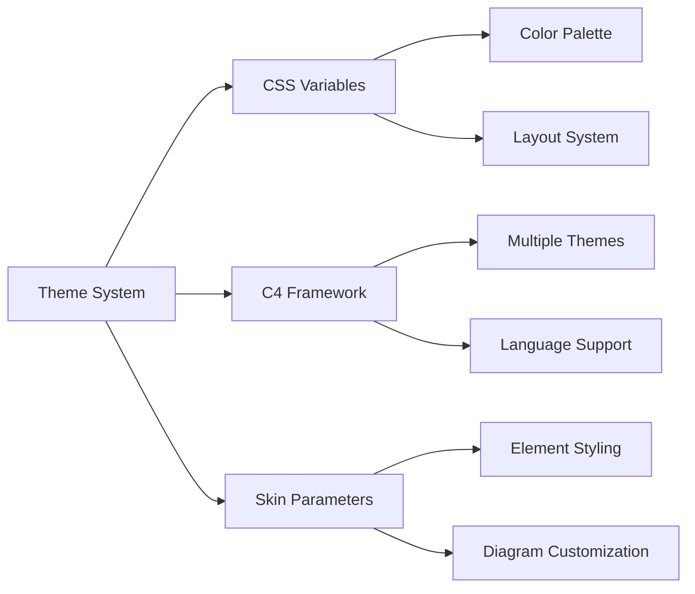
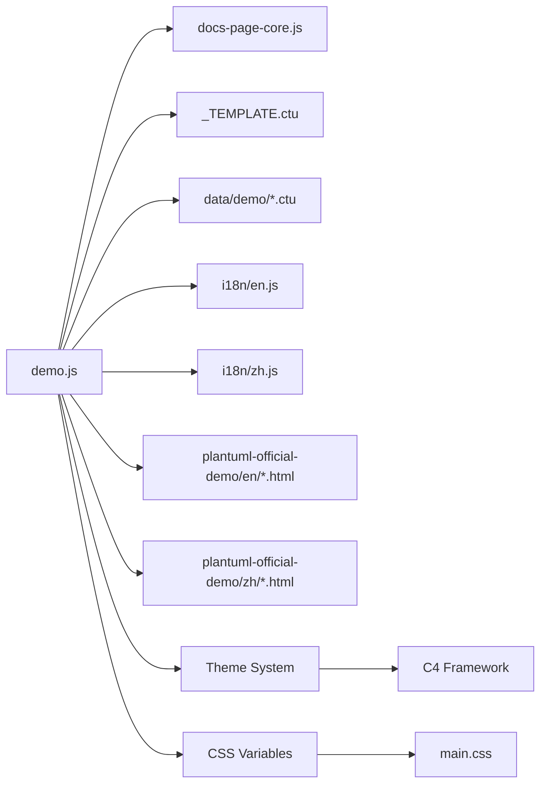
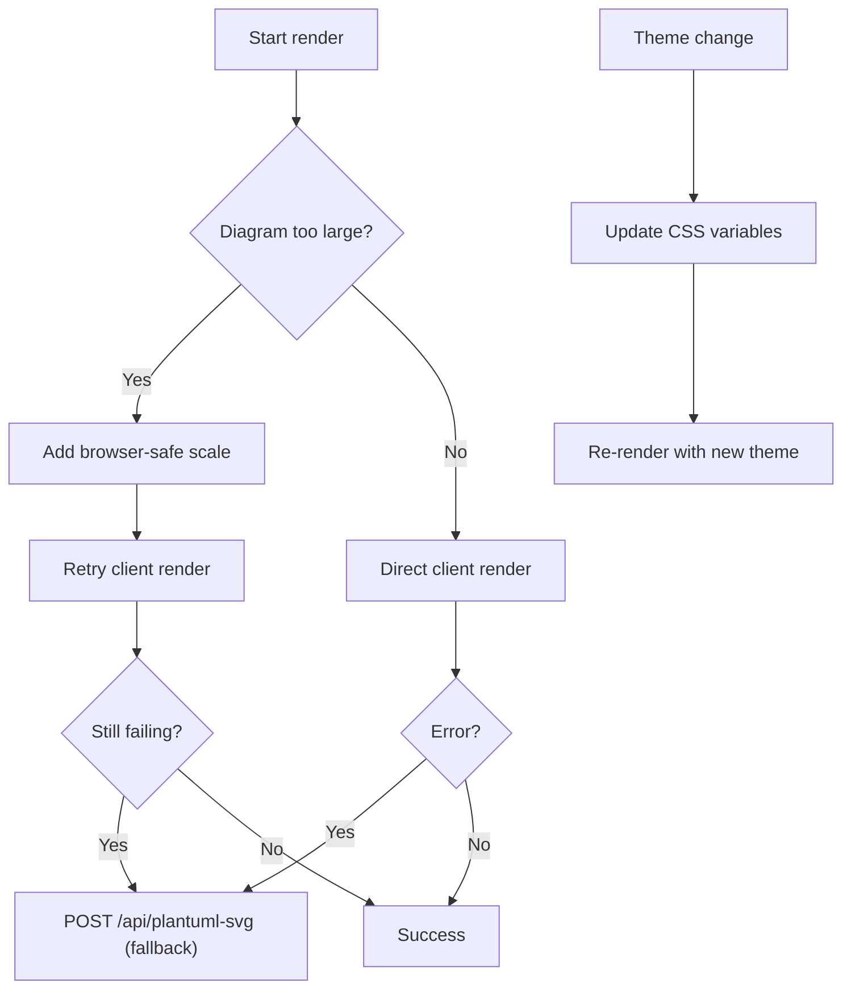

# Diagram Examples

<cite>
**Referenced Files in This Document**
- [README.md](file://README.md)
- [README_zh.md](file://README_zh.md)
- [demo.js](file://demo.js)
- [data/_TEMPLATE.ctu](file://data/_TEMPLATE.ctu)
- [data/demo/sequence--1_en.ctu](file://data/demo/sequence--1_en.ctu)
- [data/demo/class--1_en.ctu](file://data/demo/class--1_en.ctu)
- [data/demo/use-case--1_en.ctu](file://data/demo/use-case--1_en.ctu)
- [data/demo/use-case--17_en.ctu](file://data/demo/use-case--17_en.ctu)
- [data/demo/regex--1_en.ctu](file://data/demo/regex--1_en.ctu)
- [data/demo/gantt--1_en.ctu](file://data/demo/gantt--1_en.ctu)
- [i18n/en.js](file://i18n/en.js)
- [i18n/zh.js](file://i18n/zh.js)
- [component/docs-page-core.js](file://component/docs-page-core.js)
- [plantuml-official-demo/en/sequence-diagram_en.html](file://plantuml-official-demo/en/sequence-diagram_en.html)
- [plantuml-official-demo/zh/sequence-diagram_zh.html](file://plantuml-official-demo/zh/sequence-diagram_zh.html)
- [main.css](file://main.css)
- [js/c4.min.js](file://js/c4.min.js)
</cite>

## Update Summary
**Changes Made**
- Added new section on Visual Presentation Guidelines and Styling Recommendations
- Updated Theme Improvements section with enhanced styling standards
- Added content refinement standards documentation
- Enhanced example quality guidelines and best practices

## Table of Contents
1. [Introduction](#introduction)
2. [Project Structure](#project-structure)
3. [Core Components](#core-components)
4. [Architecture Overview](#architecture-overview)
5. [Detailed Component Analysis](#detailed-component-analysis)
6. [Visual Presentation Guidelines and Styling Recommendations](#visual-presentation-guidelines-and-styling-recommendations)
7. [Theme Improvements](#theme-improvements)
8. [Content Refinement Standards](#content-refinement-standards)
9. [Dependency Analysis](#dependency-analysis)
10. [Performance Considerations](#performance-considerations)
11. [Troubleshooting Guide](#troubleshooting-guide)
12. [Conclusion](#conclusion)
13. [Appendices](#appendices)

## Introduction
This document describes Code-To-UML's extensive diagram example library. It explains how examples are categorized by UML and Non-UML types, how CTU files are named and organized, how bilingual examples work, and how the official PlantUML demo integrates with the built-in examples. It also provides practical guidance for adding and maintaining examples, documents enhanced visual presentation guidelines and styling recommendations, and discusses how example complexity relates to rendering performance.

## Project Structure
The example library lives under the data/demo/ directory and is consumed by the interactive demo page. The demo page loads examples via an API endpoint, renders them using PlantUML (client or server), and supports bilingual display with enhanced visual styling.

**Diagram sources**
- [demo.js:146-185](file://demo.js#L146-L185)
- [README.md:166-198](file://README.md#L166-L198)
- [README_zh.md:166-198](file://README_zh.md#L166-L198)
- [main.css:1-16](file://main.css#L1-L16)
- [js/c4.min.js:121-144](file://js/c4.min.js#L121-L144)

**Section sources**
- [README.md:166-198](file://README.md#L166-L198)
- [README_zh.md:166-198](file://README_zh.md#L166-L198)

## Core Components
- Example data format: CTU files define one or more examples with metadata and PlantUML source blocks.
- Naming convention: {diagram-type}--{number}_{language}.ctu (e.g., sequence--1_en.ctu).
- Organization: data/demo/ holds all built-in examples grouped by diagram type and language.
- Bilingual support: Each diagram type typically includes both _en.ctu and _zh.ctu variants.
- API consumption: demo.js fetches examples from /api/demo-examples?lang=en|zh and renders them dynamically.
- Enhanced styling: Built-in theme system with CSS variables and C4 framework integration.

**Section sources**
- [README.md:135-163](file://README.md#L135-L163)
- [README_zh.md:135-163](file://README_zh.md#L135-L163)
- [demo.js:174-185](file://demo.js#L174-L185)
- [data/_TEMPLATE.ctu:1-46](file://data/_TEMPLATE.ctu#L1-L46)
- [main.css:1-16](file://main.css#L1-L16)
- [js/c4.min.js:121-144](file://js/c4.min.js#L121-L144)

## Architecture Overview
The demo page orchestrates loading, internationalization, and rendering of examples with enhanced visual styling. It normalizes diagram keys, applies i18n labels, renders PlantUML sources with robust error handling, and implements theme-aware styling through CSS variables and C4 framework integration.

**Diagram sources**
- [demo.js:146-185](file://demo.js#L146-L185)
- [demo.js:374-439](file://demo.js#L374-L439)
- [component/docs-page-core.js:12-23](file://component/docs-page-core.js#L12-L23)
- [main.css:1-16](file://main.css#L1-L16)
- [js/c4.min.js:121-144](file://js/c4.min.js#L121-L144)

**Section sources**
- [demo.js:146-185](file://demo.js#L146-L185)
- [demo.js:374-439](file://demo.js#L374-L439)
- [README.md:237-274](file://README.md#L237-L274)

## Detailed Component Analysis

### UML Categories
- Sequence: Demonstrates message arrows and interaction styles.
- Use Case: Shows actor and use case notation.
- Class: Illustrates class elements, stereotypes, and visibility.
- Object: Visualizes object diagrams.
- Activity: Depicts activities and control flows.
- Component: Displays component relationships and ports.
- Deployment: Shows deployment diagrams with nodes and artifacts.
- State: Renders state transitions and regions.
- Timing: Illustrates lifelines and state state diagrams.

**Section sources**
- [README.md:57-63](file://README.md#L57-L63)
- [README_zh.md:57-63](file://README_zh.md#L57-L63)
- [data/demo/sequence--1_en.ctu:1-23](file://data/demo/sequence--1_en.ctu#L1-L23)
- [data/demo/use-case--1_en.ctu:1-21](file://data/demo/use-case--1_en.ctu#L1-L21)
- [data/demo/class--1_en.ctu:1-34](file://data/demo/class--1_en.ctu#L1-L34)

### Non-UML Categories
- Gantt: Timeline and task durations.
- MindMap: Hierarchical branching structures.
- WBS: Work breakdown structures.
- EBNF: Grammar notation.
- Regex: Regular expression diagrams.
- Network (nwdiag): Network diagrams.
- JSON: JSON schema-like structures.
- YAML: YAML-like structures.
- Archimate: ArchiMate diagrams.
- Salt (Wireframe): Wireframe diagrams.

**Section sources**
- [README.md:57-63](file://README.md#L57-L63)
- [README_zh.md:57-63](file://README_zh.md#L57-L63)
- [data/demo/gantt--1_en.ctu:1-23](file://data/demo/gantt--1_en.ctu#L1-L23)
- [data/demo/regex--1_en.ctu:1-17](file://data/demo/regex--1_en.ctu#L1-L17)

### CTU File Format and Template
CTU files contain:
- Title and optional group description.
- One or more [Example] blocks with:
  - Optional example title.
  - Optional Markdown description.
  - [UML] block with PlantUML source.
  - Optional [Detail] explanation.

The template defines the structure and recommended placeholders.

**Section sources**
- [data/_TEMPLATE.ctu:1-46](file://data/_TEMPLATE.ctu#L1-L46)

### Bilingual Examples and Labels
- Naming pattern ensures both English and Chinese variants coexist per diagram type.
- The demo normalizes diagram keys to match tabs and labels.
- i18n dictionaries provide labels for diagram types and UI strings.

**Diagram sources**
- [demo.js:131-144](file://demo.js#L131-L144)
- [demo.js:728-778](file://demo.js#L728-L778)
- [i18n/en.js:10-30](file://i18n/en.js#L10-L30)
- [i18n/zh.js:10-30](file://i18n/zh.js#L10-L30)

**Section sources**
- [demo.js:131-144](file://demo.js#L131-L144)
- [demo.js:728-778](file://demo.js#L728-L778)
- [i18n/en.js:10-30](file://i18n/en.js#L10-L30)
- [i18n/zh.js:10-30](file://i18n/zh.js#L10-L30)

### Official PlantUML Demo Integration
- The repository includes official PlantUML reference pages in English and Chinese.
- These pages complement built-in examples by providing authoritative syntax and feature coverage.
- Users can cross-reference official docs while exploring built-in examples.

**Section sources**
- [README.md:192-192](file://README.md#L192-L192)
- [README_zh.md:192-192](file://README_zh.md#L192-L192)
- [plantuml-official-demo/en/sequence-diagram_en.html:775-795](file://plantuml-official-demo/en/sequence-diagram_en.html#L775-L795)
- [plantuml-official-demo/zh/sequence-diagram_zh.html:761-783](file://plantuml-official-demo/zh/sequence-diagram_zh.html#L761-L783)

### Adding New Examples
- Choose the appropriate diagram type and number; follow the naming convention.
- Place the .ctu file in data/demo/.
- Ensure both _en.ctu and _zh.ctu variants exist for bilingual coverage.
- Use the template to structure content consistently.
- Apply enhanced visual styling guidelines for improved presentation.

**Section sources**
- [README.md:160-163](file://README.md#L160-L163)
- [README_zh.md:160-163](file://README_zh.md#L160-L163)
- [data/_TEMPLATE.ctu:1-46](file://data/_TEMPLATE.ctu#L1-L46)

### Modifying Existing Examples
- Update the relevant .ctu file in data/demo/.
- Keep the filename unchanged to preserve tab and link stability.
- When changing diagram keys, update i18n labels accordingly.
- Apply content refinement standards for consistency.

**Section sources**
- [demo.js:35-52](file://demo.js#L35-L52)
- [i18n/en.js:10-30](file://i18n/en.js#L10-L30)
- [i18n/zh.js:10-30](file://i18n/zh.js#L10-L30)

### Maintaining Consistency Across the Library
- Use the shared template to ensure consistent metadata and section ordering.
- Keep titles concise and descriptions clear; leverage Markdown formatting.
- Prefer canonical diagram types aligned with the supported list.
- Follow visual presentation guidelines for uniform styling.

**Section sources**
- [README.md:57-63](file://README.md#L57-L63)
- [README_zh.md:57-63](file://README_zh.md#L57-L63)
- [data/_TEMPLATE.ctu:1-46](file://data/_TEMPLATE.ctu#L1-L46)

## Visual Presentation Guidelines and Styling Recommendations

### Enhanced Visual Guidelines
The example library now incorporates comprehensive visual presentation guidelines to ensure consistent, professional appearance across all diagrams:

#### Color Scheme Standards
- Primary accent color: #1f6feb (blue) for interactive elements and highlights
- Success color: #1a7f37 for positive feedback states
- Error color: #cf222e for error states and warnings
- Surface colors: #f6f8fa for backgrounds, #ffffff for diagram backgrounds
- Text colors: #1f2328 for primary text, #59636e for muted text

#### Typography and Spacing
- Base font size: 15px with 1.55 line height
- Monospace font for code blocks: Consolas, Monaco, "Courier New"
- Grid spacing: 1rem base unit for consistent layout
- Responsive breakpoints at 900px and 520px for optimal viewing

#### Interactive Elements
- Button states: Hover effects with brightness adjustments
- Active states: Accent color borders with soft backgrounds
- Focus states: 2px solid outline with offset for accessibility
- Tooltip positioning: Absolute positioning with directional arrows

#### Layout and Responsiveness
- Fixed sidebar navigation with scrollable content
- Mobile-first responsive design with adaptive layouts
- Flexible grid system for example presentations
- Lightbox modal system for diagram magnification

**Section sources**
- [main.css:1-804](file://main.css#L1-L804)

## Theme Improvements

### Advanced Theme System
The example library now features an enhanced theme system supporting multiple visual styles and customization options:

#### CSS Custom Properties System
- Comprehensive color palette defined through CSS custom properties
- Light and dark mode support through color-scheme property
- Dynamic color mixing for hover states and interactive elements
- Semantic color naming for maintainability

#### C4 Framework Integration
- Multiple predefined themes: blue, brown, green, violet, superhero, united
- Language-specific legend translations for international users
- Style customization through skinparam directives
- Theme inheritance and override capabilities

#### Theme Features
- Rounded corners for modern aesthetic appeal
- Consistent border styling across all diagram elements
- Typography hierarchy with proper font weights and sizes
- Accessibility considerations with proper contrast ratios
- Performance optimization through efficient CSS delivery

**Diagram sources**
- [main.css:1-16](file://main.css#L1-L16)
- [js/c4.min.js:121-144](file://js/c4.min.js#L121-L144)

**Section sources**
- [main.css:1-16](file://main.css#L1-L16)
- [js/c4.min.js:121-144](file://js/c4.min.js#L121-L144)

### Inline Styling Capabilities
Examples now demonstrate advanced inline styling techniques for fine-grained control:

#### Element-Level Styling
- Individual element color customization using `#[color|back:color]` syntax
- Line style variations: bold, dashed, dotted for visual distinction
- Text color customization for improved readability
- Combined styling attributes for complex visual effects

#### Styling Syntax Examples
- `#pink;line:red;line.bold;text:red` - Multi-colored actor with bold lines
- `#palegreen;line:green;line.dashed;text:green` - Green dashed usecase
- `#aliceblue;line:blue;line.dotted;text:blue` - Blue dotted usecase

**Section sources**
- [data/demo/use-case--17_en.ctu:1-19](file://data/demo/use-case--17_en.ctu#L1-L19)

## Content Refinement Standards

### Quality Assurance Guidelines
The example library maintains high standards for content quality and presentation consistency:

#### Content Structure Standards
- Clear, descriptive titles that accurately represent diagram content
- Concise descriptions with practical explanations
- Well-formatted PlantUML code with proper indentation
- Logical grouping of related examples
- Consistent use of markdown formatting

#### Technical Quality Standards
- Valid PlantUML syntax without deprecated features
- Optimized diagram complexity for rendering performance
- Proper use of diagram elements and relationships
- Consistent naming conventions for participants and elements
- Appropriate use of stereotypes and annotations

#### Visual Quality Standards
- Balanced composition with adequate spacing
- Consistent color usage following theme guidelines
- Readable typography with appropriate sizing
- Accessible contrast ratios for text and backgrounds
- Responsive design considerations for different screen sizes

#### Educational Value Standards
- Progressive complexity from basic to advanced examples
- Clear learning objectives for each example
- Practical applications and real-world scenarios
- Cross-references to related diagram types
- Links to official PlantUML documentation

**Section sources**
- [data/_TEMPLATE.ctu:1-46](file://data/_TEMPLATE.ctu#L1-L46)
- [data/demo/use-case--17_en.ctu:1-19](file://data/demo/use-case--17_en.ctu#L1-L19)

## Dependency Analysis
The demo page depends on:
- docs-page-core for reading sources, splitting lines, scaling large diagrams, and error detection.
- i18n modules for labels and UI strings.
- data/demo files for example content.
- Official PlantUML docs for reference.
- Enhanced theme system for visual styling.
- CSS custom properties for dynamic theming.

**Diagram sources**
- [demo.js:1-30](file://demo.js#L1-L30)
- [component/docs-page-core.js:12-35](file://component/docs-page-core.js#L12-L35)
- [README.md:192-192](file://README.md#L192-L192)
- [main.css:1-16](file://main.css#L1-L16)
- [js/c4.min.js:121-144](file://js/c4.min.js#L121-L144)

**Section sources**
- [demo.js:1-30](file://demo.js#L1-L30)
- [component/docs-page-core.js:12-35](file://component/docs-page-core.js#L12-L35)

## Performance Considerations
- Large diagrams may exceed browser rendering capacity; the demo detects oversized diagrams and attempts auto-scaling.
- If auto-scaling still fails, the demo falls back to server-side rendering via /api/plantuml-svg.
- Rendering is queued and generation-aware to avoid stale updates when switching tabs or languages.
- Enhanced theme system uses CSS custom properties for efficient styling updates.
- Responsive design minimizes layout thrashing during theme switching.

**Diagram sources**
- [demo.js:413-429](file://demo.js#L413-L429)
- [demo.js:395-403](file://demo.js#L395-L403)
- [README.md:237-274](file://README.md#L237-L274)
- [main.css:1-16](file://main.css#L1-L16)

**Section sources**
- [demo.js:413-429](file://demo.js#L413-L429)
- [demo.js:395-403](file://demo.js#L395-L403)
- [README.md:237-274](file://README.md#L237-L274)

## Troubleshooting Guide
- If examples fail to load, verify the API response and the presence of .ctu files in data/demo/.
- If rendering fails, check for syntax errors or unsupported constructs; the demo detects common error markers in the rendered SVG.
- For large diagrams, confirm auto-scaling is applied and consider simplifying the diagram.
- If client rendering crashes persistently, ensure server-side fallback is functioning.
- For theme-related issues, verify CSS variable definitions and C4 framework integration.
- Check color contrast ratios for accessibility compliance.

**Section sources**
- [demo.js:124-130](file://demo.js#L124-L130)
- [demo.js:374-439](file://demo.js#L374-L439)
- [component/docs-page-core.js:77-130](file://component/docs-page-core.js#L77-L130)

## Conclusion
Code-To-UML's example library offers a comprehensive, bilingual, and maintainable collection of diagrams spanning UML and Non-UML categories. The enhanced visual presentation guidelines and styling recommendations ensure consistent, professional appearance across all examples. The advanced theme system provides flexibility while maintaining design coherence. The demo page's architecture ensures reliable rendering with graceful fallbacks, while the official PlantUML docs provide authoritative reference material. Following the naming convention, using the template, applying visual guidelines, and keeping bilingual parity will help sustain a high-quality example library with excellent visual presentation.

## Appendices

### Appendix A: Supported Diagram Types
- UML: Sequence, Use Case, Class, Object, Activity, Component, Deployment, State, Timing
- Non-UML: Gantt, MindMap, WBS, EBNF, Regex, Network (nwdiag), JSON, YAML, Archimate, Salt (Wireframe)

**Section sources**
- [README.md:57-63](file://README.md#L57-L63)
- [README_zh.md:57-63](file://README_zh.md#L57-L63)

### Appendix B: Example File Naming and Organization
- Pattern: {diagram-type}--{number}_{language}.ctu
- Location: data/demo/
- Variants: Both _en.ctu and _zh.ctu for each example number

**Section sources**
- [README.md:160-163](file://README.md#L160-L163)
- [README_zh.md:160-163](file://README_zh.md#L160-L163)
- [data/demo/sequence--1_en.ctu:1-23](file://data/demo/sequence--1_en.ctu#L1-L23)
- [data/demo/class--1_en.ctu:1-34](file://data/demo/class--1_en.ctu#L1-L34)
- [data/demo/use-case--1_en.ctu:1-21](file://data/demo/use-case--1_en.ctu#L1-L21)
- [data/demo/regex--1_en.ctu:1-17](file://data/demo/regex--1_en.ctu#L1-L17)
- [data/demo/gantt--1_en.ctu:1-23](file://data/demo/gantt--1_en.ctu#L1-L23)

### Appendix C: Visual Styling Reference
- Primary colors: #1f6feb (accent), #1a7f37 (success), #cf222e (error)
- Background colors: #ffffff (white), #f6f8fa (surface), #1f2328 (dark text)
- Typography: 15px base font with 1.55 line height
- Responsive breakpoints: 900px and 520px
- CSS custom properties for dynamic theming

**Section sources**
- [main.css:1-804](file://main.css#L1-L804)
- [js/c4.min.js:121-144](file://js/c4.min.js#L121-L144)