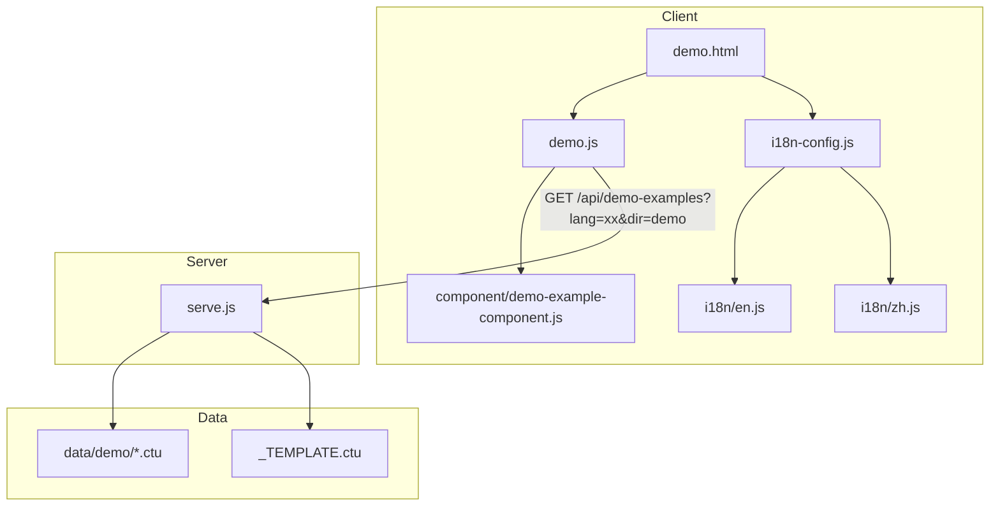
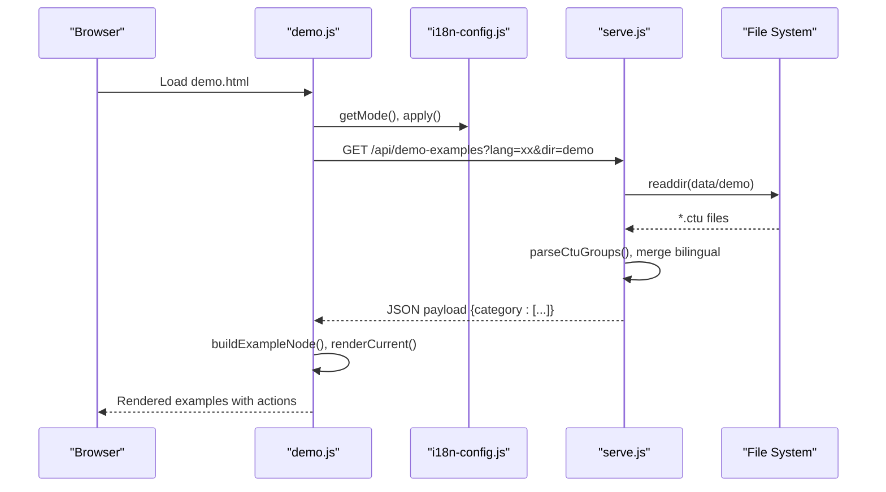
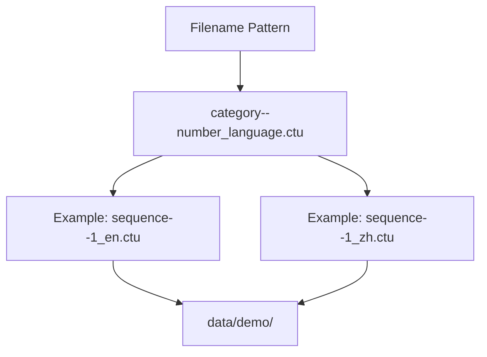
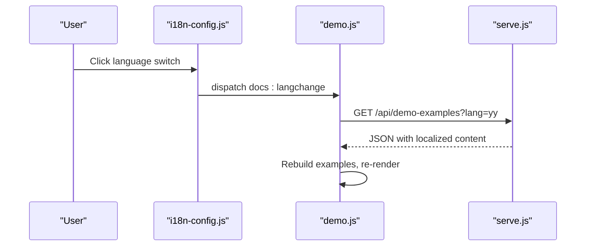
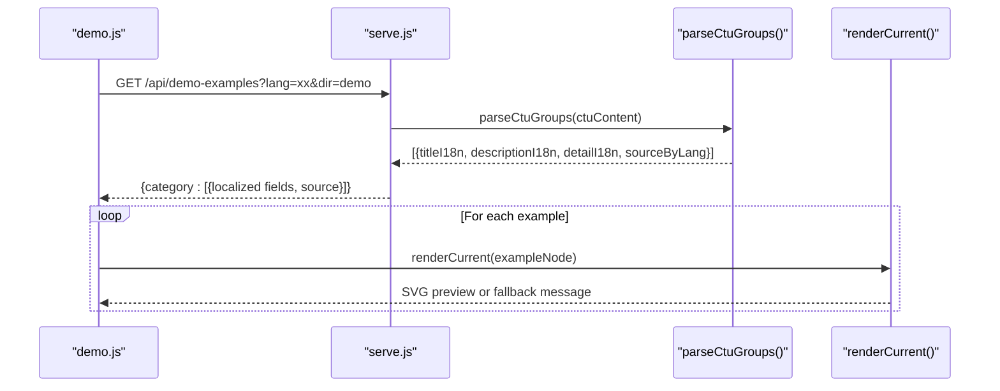
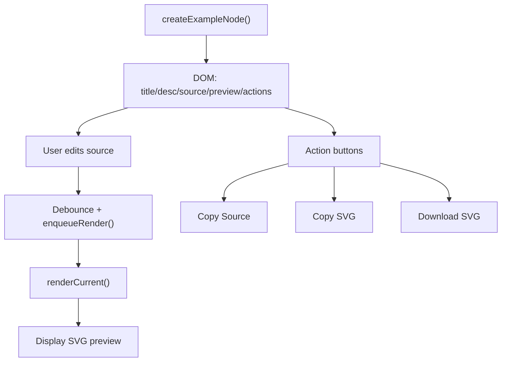
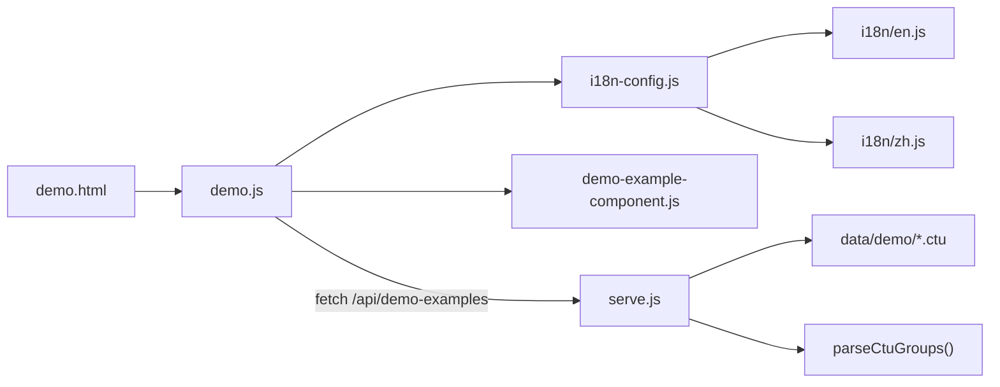

# Example Management and Organization

<cite>
**Referenced Files in This Document**
- [demo.html](file://demo.html)
- [demo.js](file://demo.js)
- [serve.js](file://serve.js)
- [demo-example-component.js](file://component/demo-example-component.js)
- [i18n-config.js](file://i18n-config.js)
- [en.js](file://i18n/en.js)
- [zh.js](file://i18n/zh.js)
- [_TEMPLATE.ctu](file://data/_TEMPLATE.ctu)
- [sequence--1_en.ctu](file://data/demo/sequence--1_en.ctu)
- [sequence--1_zh.ctu](file://data/demo/sequence--1_zh.ctu)
- [sequence--2_zh.ctu](file://data/demo/sequence--2_zh.ctu)
- [sequence--3_zh.ctu](file://data/demo/sequence--3_zh.ctu)
- [use-case--1_en.ctu](file://data/demo/use-case--1_en.ctu)
- [use-case--10_zh.ctu](file://data/demo/use-case--10_zh.ctu)
- [use-case--11_zh.ctu](file://data/demo/use-case--11_zh.ctu)
</cite>

## Table of Contents
1. [Introduction](#introduction)
2. [Project Structure](#project-structure)
3. [Core Components](#core-components)
4. [Architecture Overview](#architecture-overview)
5. [Detailed Component Analysis](#detailed-component-analysis)
6. [Dependency Analysis](#dependency-analysis)
7. [Performance Considerations](#performance-considerations)
8. [Troubleshooting Guide](#troubleshooting-guide)
9. [Conclusion](#conclusion)
10. [Appendices](#appendices)

## Introduction
This document explains how diagram examples are managed and organized in Code-To-UML. It covers the CTU file naming convention, the directory layout under data/demo/, how examples are loaded and displayed in the demo interface, and the bilingual organization system supporting English and Chinese. It also provides practical guidance for adding new examples, maintaining consistency across language variants, and optimizing performance for large diagrams.

## Project Structure
The example system centers around:
- A static demo page that renders interactive examples
- A development server that exposes an API to load and transform CTU files into JSON
- CTU files stored under data/<subdir> organized by diagram category and number, with bilingual variants
- Client-side JavaScript that renders examples, handles language switching, and manages UI interactions



**Diagram sources**
- [demo.html](file://demo.html)
- [demo.js](file://demo.js)
- [i18n-config.js](file://i18n-config.js)
- [en.js](file://i18n/en.js)
- [zh.js](file://i18n/zh.js)
- [demo-example-component.js](file://component/demo-example-component.js)
- [serve.js](file://serve.js)
- [_TEMPLATE.ctu](file://data/_TEMPLATE.ctu)

**Section sources**
- [demo.html](file://demo.html)
- [demo.js](file://demo.js)
- [serve.js](file://serve.js)

## Core Components
- Demo page and UI shell: Provides tabs for diagram categories, a title area, overview text per category, a container for examples, and a side table of contents.
- Demo loader and renderer: Fetches examples via an API, builds example nodes, renders PlantUML SVGs, and supports actions (copy source/SVG, download).
- Internationalization: Manages language mode, labels, and localized strings; triggers re-rendering on language change.
- Example component: Builds DOM nodes for each example, applies localization, and renders markdown.
- Server-side loader: Parses CTU files, normalizes content, and produces a JSON payload keyed by diagram category.

**Section sources**
- [demo.html](file://demo.html)
- [demo.js](file://demo.js)
- [demo-example-component.js](file://component/demo-example-component.js)
- [i18n-config.js](file://i18n-config.js)
- [en.js](file://i18n/en.js)
- [zh.js](file://i18n/zh.js)
- [serve.js](file://serve.js)

## Architecture Overview
The example pipeline follows a client-server model:
- The client requests examples from /api/demo-examples with query parameters for language and data directory.
- The server reads CTU files from data/<dir>, parses them, merges bilingual content, and returns a structured JSON payload.
- The client renders the examples, applies localization, and displays PlantUML diagrams.



**Diagram sources**
- [demo.js](file://demo.js)
- [i18n-config.js](file://i18n-config.js)
- [serve.js](file://serve.js)

## Detailed Component Analysis

### CTU File Naming Convention and Directory Layout
- Naming pattern: category--number_language.ctu
  - category: lowercase, hyphenated diagram type (e.g., sequence, use-case, class)
  - number: positive integer indicating example order within the category
  - language: _en or _zh suffix
- Directory: data/demo/ holds all example files; bilingual pairs are co-located
- Example files demonstrate multiple examples per file separated by a long horizontal divider line



**Diagram sources**
- [sequence--1_en.ctu](file://data/demo/sequence--1_en.ctu)
- [sequence--1_zh.ctu](file://data/demo/sequence--1_zh.ctu)

**Section sources**
- [sequence--1_en.ctu](file://data/demo/sequence--1_en.ctu)
- [sequence--1_zh.ctu](file://data/demo/sequence--1_zh.ctu)
- [sequence--2_zh.ctu](file://data/demo/sequence--2_zh.ctu)
- [sequence--3_zh.ctu](file://data/demo/sequence--3_zh.ctu)
- [use-case--1_en.ctu](file://data/demo/use-case--1_en.ctu)
- [use-case--10_zh.ctu](file://data/demo/use-case--10_zh.ctu)
- [use-case--11_zh.ctu](file://data/demo/use-case--11_zh.ctu)

### Bilingual Organization and Language Selection
- Language selection is controlled by DocsI18n.getMode() and persisted in localStorage.
- The demo page applies labels and localized strings for diagram names and UI elements.
- On language change, the client re-fetches examples and re-renders the active tab.
- The server merges bilingual content from CTU files and selects the appropriate variant based on the requested language.



**Diagram sources**
- [i18n-config.js](file://i18n-config.js)
- [demo.js](file://demo.js)
- [serve.js](file://serve.js)

**Section sources**
- [i18n-config.js](file://i18n-config.js)
- [demo.js](file://demo.js)
- [en.js](file://i18n/en.js)
- [zh.js](file://i18n/zh.js)

### Example Loading and Display Pipeline
- The client loads examples via fetch to /api/demo-examples with query parameters for language and directory.
- The server scans the data directory, parses CTU files, and returns a JSON object keyed by diagram category.
- The client builds example nodes, applies localization, and renders PlantUML SVGs with failure handling and optional scaling for large diagrams.



**Diagram sources**
- [demo.js](file://demo.js)
- [serve.js](file://serve.js)

**Section sources**
- [demo.js](file://demo.js)
- [serve.js](file://serve.js)

### CTU File Format and Content Model
CTU files support multiple examples grouped by a separator line. Each example can include:
- Title and section-level metadata
- Description and Detail blocks
- One or more PlantUML code blocks

```mermaid
flowchart TD
Header["Header Lines<br/>Title: ...<br/>Describe: ..."] --> Examples["Examples"]
Separator["Divider Line"] --> Examples
Examples --> Example1["[Example]<br/>[Description]<br/>[Detail]<br/>[UML]"]
Example1 --> Separator
Separator --> ExampleN["... repeat ..."
```

**Diagram sources**
- [_TEMPLATE.ctu](file://data/_TEMPLATE.ctu)

**Section sources**
- [_TEMPLATE.ctu](file://data/_TEMPLATE.ctu)
- [sequence--1_en.ctu](file://data/demo/sequence--1_en.ctu)
- [sequence--1_zh.ctu](file://data/demo/sequence--1_zh.ctu)
- [sequence--2_zh.ctu](file://data/demo/sequence--2_zh.ctu)
- [sequence--3_zh.ctu](file://data/demo/sequence--3_zh.ctu)
- [use-case--1_en.ctu](file://data/demo/use-case--1_en.ctu)
- [use-case--10_zh.ctu](file://data/demo/use-case--10_zh.ctu)
- [use-case--11_zh.ctu](file://data/demo/use-case--11_zh.ctu)

### Client-Side Rendering and Actions
- Example nodes are created with a title, description, editable source textarea, preview area, and action buttons.
- Actions include copying source, copying SVG, and downloading SVG.
- Large diagrams trigger an automatic scaling fallback and a notice message.



**Diagram sources**
- [demo-example-component.js](file://component/demo-example-component.js)
- [demo.js](file://demo.js)

**Section sources**
- [demo-example-component.js](file://component/demo-example-component.js)
- [demo.js](file://demo.js)

## Dependency Analysis
- The demo page depends on i18n modules and the demo loader/renderer.
- The demo loader depends on the example component for DOM construction and on the renderer for SVG generation.
- The server depends on filesystem access and PlantUML jar fallback for rendering.
- The server’s CTU parser depends on the CTU file format and language suffix rules.



**Diagram sources**
- [demo.html](file://demo.html)
- [demo.js](file://demo.js)
- [i18n-config.js](file://i18n-config.js)
- [en.js](file://i18n/en.js)
- [zh.js](file://i18n/zh.js)
- [demo-example-component.js](file://component/demo-example-component.js)
- [serve.js](file://serve.js)

**Section sources**
- [demo.js](file://demo.js)
- [serve.js](file://serve.js)

## Performance Considerations
- Rendering queue: The client serializes renders to avoid contention and reduce flicker.
- Large diagrams: When browser rendering fails due to size, the client attempts a scaled rendering and updates the layout accordingly.
- Debounced editing: Source edits are debounced to limit render frequency during typing.
- Markdown rendering: A lightweight markdown engine is used; a fallback ensures basic rendering if the engine is unavailable.

[No sources needed since this section provides general guidance]

## Troubleshooting Guide
- Example configuration load failures: The client displays an error message when the demo examples payload is invalid or the fetch fails.
- Render failures: The client shows a concise error message and clears transient messages after rendering completes.
- Large diagram fallback: If a diagram is too large for browser rendering, the client scales it down and informs the user.
- Language switching: Ensure the language cookie/localStorage is set; the client listens for a language change event and reloads examples.

**Section sources**
- [demo.js](file://demo.js)
- [i18n-config.js](file://i18n-config.js)

## Conclusion
The Code-To-UML example system combines a clear CTU file structure, a bilingual organization scheme, and a robust client-server rendering pipeline. By following the naming convention and content model, contributors can efficiently add and maintain examples while ensuring consistent localization and optimal user experience.

[No sources needed since this section summarizes without analyzing specific files]

## Appendices

### Best Practices for Adding and Maintaining Examples
- Use the CTU template to structure examples with clear Titles, Descriptions, Details, and PlantUML code blocks.
- Keep bilingual variants synchronized: add/update both _en and _zh files for each category and number.
- Organize by complexity and use case: increment the number field to indicate difficulty progression within a category.
- Validate syntax: ensure PlantUML code compiles and renders cleanly; test both languages.
- Optimize large diagrams: prefer compact diagrams or leverage the automatic scaling fallback for very large visuals.
- Maintain accessibility: keep descriptions concise and meaningful; ensure action buttons have proper labels.

**Section sources**
- [_TEMPLATE.ctu](file://data/_TEMPLATE.ctu)
- [sequence--1_en.ctu](file://data/demo/sequence--1_en.ctu)
- [sequence--1_zh.ctu](file://data/demo/sequence--1_zh.ctu)
- [sequence--2_zh.ctu](file://data/demo/sequence--2_zh.ctu)
- [sequence--3_zh.ctu](file://data/demo/sequence--3_zh.ctu)
- [use-case--1_en.ctu](file://data/demo/use-case--1_en.ctu)
- [use-case--10_zh.ctu](file://data/demo/use-case--10_zh.ctu)
- [use-case--11_zh.ctu](file://data/demo/use-case--11_zh.ctu)