# Non-UML Diagrams

<cite>
**Referenced Files in This Document**
- [data/demo/gantt--1_en.ctu](file://data/demo/gantt--1_en.ctu)
- [data/demo/gantt--2_en.ctu](file://data/demo/gantt--2_en.ctu)
- [data/demo/gantt--3_en.ctu](file://data/demo/gantt--3_en.ctu)
- [data/demo/mindmap--1_en.ctu](file://data/demo/mindmap--1_en.ctu)
- [data/demo/mindmap--2_en.ctu](file://data/demo/mindmap--2_en.ctu)
- [data/demo/mindmap--3_en.ctu](file://data/demo/mindmap--3_en.ctu)
- [data/demo/wbs--1_en.ctu](file://data/demo/wbs--1_en.ctu)
- [data/demo/wbs--2_en.ctu](file://data/demo/wbs--2_en.ctu)
- [data/demo/wbs--3_en.ctu](file://data/demo/wbs--3_en.ctu)
- [data/demo/ebnf--1_en.ctu](file://data/demo/ebnf--1_en.ctu)
- [data/demo/ebnf--2_en.ctu](file://data/demo/ebnf--2_en.ctu)
- [data/demo/ebnf--3_en.ctu](file://data/demo/ebnf--3_en.ctu)
- [data/demo/regex--1_en.ctu](file://data/demo/regex--1_en.ctu)
- [data/demo/regex--2_en.ctu](file://data/demo/regex--2_en.ctu)
- [data/demo/regex--3_en.ctu](file://data/demo/regex--3_en.ctu)
- [data/demo/network--1_zh.ctu](file://data/demo/network--1_zh.ctu)
- [data/demo/network--2_zh.ctu](file://data/demo/network--2_zh.ctu)
- [data/demo/network--3_zh.ctu](file://data/demo/network--3_zh.ctu)
- [data/demo/nwdiag--1_en.ctu](file://data/demo/nwdiag--1_en.ctu)
- [data/demo/nwdiag--2_en.ctu](file://data/demo/nwdiag--2_en.ctu)
- [data/demo/nwdiag--3_en.ctu](file://data/demo/nwdiag--3_en.ctu)
- [data/demo/json--1_en.ctu](file://data/demo/json--1_en.ctu)
- [data/demo/yaml--1_en.ctu](file://data/demo/yaml--1_en.ctu)
- [data/demo/archimate--1_en.ctu](file://data/demo/archimate--1_en.ctu)
- [data/demo/salt--1_en.ctu](file://data/demo/salt--1_en.ctu)
- [data/demo/salt--2_en.ctu](file://data/demo/salt--2_en.ctu)
- [data/demo/salt--3_en.ctu](file://data/demo/salt--3_en.ctu)
- [data/demo/wireframe--1_zh.ctu](file://data/demo/wireframe--1_zh.ctu)
</cite>

## Table of Contents
1. [Introduction](#introduction)
2. [Project Structure](#project-structure)
3. [Core Components](#core-components)
4. [Architecture Overview](#architecture-overview)
5. [Detailed Component Analysis](#detailed-component-analysis)
6. [Dependency Analysis](#dependency-analysis)
7. [Performance Considerations](#performance-considerations)
8. [Troubleshooting Guide](#troubleshooting-guide)
9. [Conclusion](#conclusion)
10. [Appendices](#appendices)

## Introduction
This document explains non-UML diagram types supported in the Code-To-UML ecosystem and demonstrates how to use them effectively alongside traditional UML diagrams. It covers Gantt charts, Mind Maps, Work Breakdown Structures (WBS), EBNF grammars, Regular Expressions, Network diagrams (nwdiag), JSON/YAML structures, Archimate diagrams, Salt orchestration diagrams, and Wireframe mockups. For each type, we describe purpose, typical syntax, and practical use cases in software development and documentation. We also show how these diagrams integrate with PlantUML and the broader Code-To-UML pipeline.

## Project Structure
The repository organizes non-UML examples under a dedicated data directory. Each example is a self-contained .ctu file with a standardized header and a PlantUML block delimited by [Example], [Description], and [UML]. The examples demonstrate the minimal syntax required to render each diagram type.

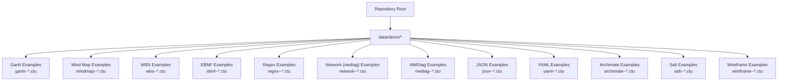

**Section sources**
- [data/demo/gantt--1_en.ctu:1-23](file://data/demo/gantt--1_en.ctu#L1-L23)
- [data/demo/mindmap--1_en.ctu:1-27](file://data/demo/mindmap--1_en.ctu#L1-L27)
- [data/demo/wbs--1_en.ctu:1-26](file://data/demo/wbs--1_en.ctu#L1-L26)
- [data/demo/ebnf--1_en.ctu:1-16](file://data/demo/ebnf--1_en.ctu#L1-L16)
- [data/demo/regex--1_en.ctu:1-17](file://data/demo/regex--1_en.ctu#L1-L17)
- [data/demo/network--1_zh.ctu:1-20](file://data/demo/network--1_zh.ctu#L1-L20)
- [data/demo/nwdiag--1_en.ctu:1-20](file://data/demo/nwdiag--1_en.ctu#L1-L20)
- [data/demo/json--1_en.ctu:1-20](file://data/demo/json--1_en.ctu#L1-L20)
- [data/demo/yaml--1_en.ctu:1-20](file://data/demo/yaml--1_en.ctu#L1-L20)
- [data/demo/archimate--1_en.ctu:1-20](file://data/demo/archimate--1_en.ctu#L1-L20)
- [data/demo/salt--1_en.ctu:1-25](file://data/demo/salt--1_en.ctu#L1-L25)
- [data/demo/wireframe--1_zh.ctu:1-25](file://data/demo/wireframe--1_zh.ctu#L1-L25)

## Core Components
Each non-UML example follows a consistent pattern:
- A header with Title and Describe
- An Example section describing the diagram’s purpose
- A Description section with optional notes
- A UML section containing the PlantUML block with the appropriate start/end directive

Key directives used across examples:
- Gantt: @startgantt ... @endgantt
- Mind Map: @startmindmap ... @endmindmap
- WBS: @startwbs ... @endwbs
- EBNF: @startebnf ... @endebnf
- Regex: @startregex ... @endregex
- Network (nwdiag): @startnwdiag ... @endnwdiag
- JSON: @startjson ... @endjson
- YAML: @startyaml ... @endyaml
- Archimate: embedded within @startuml ... @enduml
- Salt/Wireframe: @startsalt ... @endsalt

These directives enable rendering of specialized diagrams directly from .ctu files via the Code-To-UML pipeline.

**Section sources**
- [data/demo/gantt--1_en.ctu:10-23](file://data/demo/gantt--1_en.ctu#L10-L23)
- [data/demo/mindmap--1_en.ctu:10-27](file://data/demo/mindmap--1_en.ctu#L10-L27)
- [data/demo/wbs--1_en.ctu:10-26](file://data/demo/wbs--1_en.ctu#L10-L26)
- [data/demo/ebnf--1_en.ctu:10-16](file://data/demo/ebnf--1_en.ctu#L10-L16)
- [data/demo/regex--1_en.ctu:10-17](file://data/demo/regex--1_en.ctu#L10-L17)
- [data/demo/network--1_zh.ctu:10-20](file://data/demo/network--1_zh.ctu#L10-L20)
- [data/demo/nwdiag--1_en.ctu:10-20](file://data/demo/nwdiag--1_en.ctu#L10-L20)
- [data/demo/json--1_en.ctu:10-20](file://data/demo/json--1_en.ctu#L10-L20)
- [data/demo/yaml--1_en.ctu:10-20](file://data/demo/yaml--1_en.ctu#L10-L20)
- [data/demo/archimate--1_en.ctu:10-20](file://data/demo/archimate--1_en.ctu#L10-L20)
- [data/demo/salt--1_en.ctu:10-25](file://data/demo/salt--1_en.ctu#L10-L25)
- [data/demo/wireframe--1_zh.ctu:10-25](file://data/demo/wireframe--1_zh.ctu#L10-L25)

## Architecture Overview
The Code-To-UML pipeline reads .ctu files, extracts the PlantUML block, and renders the corresponding diagram. Non-UML diagrams are treated uniformly: the UML section is passed to PlantUML, which interprets the appropriate directive and produces an image.

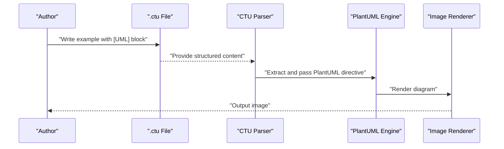

[No sources needed since this diagram shows conceptual workflow, not actual code structure]

## Detailed Component Analysis

### Gantt Charts
Purpose
- Visualize project timelines, tasks, durations, and dependencies.
- Ideal for sprint planning, release schedules, and resource allocation.

Syntax highlights
- Tasks declared with labels and durations.
- Optional start dates and relative start markers.
- Date formats like YYYY-MM-DD or relative markers like D+X.

Practical use cases
- Track prototype design and testing phases.
- Coordinate team efforts across milestones.
- Communicate timelines to stakeholders.

Integration notes
- Works seamlessly with the Code-To-UML pipeline by placing the block inside [UML].

Examples
- Workload timeline with absolute durations.
- Start date-driven scheduling.
- Relative day-based scheduling.

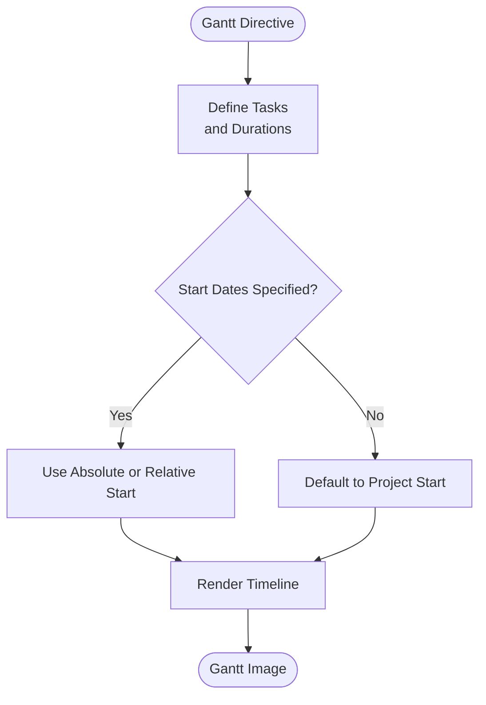

**Diagram sources**
- [data/demo/gantt--1_en.ctu:11-20](file://data/demo/gantt--1_en.ctu#L11-L20)
- [data/demo/gantt--2_en.ctu:11-19](file://data/demo/gantt--2_en.ctu#L11-L19)
- [data/demo/gantt--3_en.ctu:11-17](file://data/demo/gantt--3_en.ctu#L11-L17)

**Section sources**
- [data/demo/gantt--1_en.ctu:1-23](file://data/demo/gantt--1_en.ctu#L1-L23)
- [data/demo/gantt--2_en.ctu:1-22](file://data/demo/gantt--2_en.ctu#L1-L22)
- [data/demo/gantt--3_en.ctu:1-20](file://data/demo/gantt--3_en.ctu#L1-L20)

### Mind Maps
Purpose
- Capture hierarchical ideas, branching topics, and brainstorming outcomes.
- Useful for organizing product roadmaps, feature breakdowns, and design concepts.

Syntax highlights
- Headings (#) and nested levels.
- Indented lists or Markdown-style markers.
- Rich text and inline markup support.

Practical use cases
- Organize product features by categories and subcategories.
- Document design thinking and user journey mapping.
- Present conceptual structures to cross-functional teams.

Integration notes
- Mind maps are ideal for early-stage documentation and exploratory sessions.

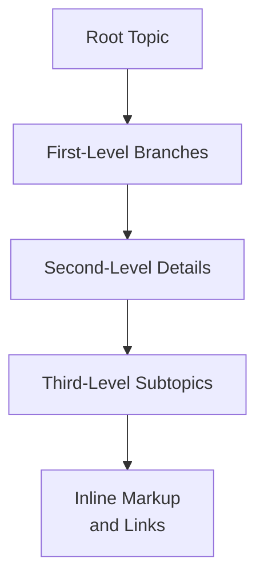

**Diagram sources**
- [data/demo/mindmap--1_en.ctu:11-24](file://data/demo/mindmap--1_en.ctu#L11-L24)
- [data/demo/mindmap--2_en.ctu:11-17](file://data/demo/mindmap--2_en.ctu#L11-L17)
- [data/demo/mindmap--3_en.ctu:11-17](file://data/demo/mindmap--3_en.ctu#L11-L17)

**Section sources**
- [data/demo/mindmap--1_en.ctu:1-27](file://data/demo/mindmap--1_en.ctu#L1-L27)
- [data/demo/mindmap--2_en.ctu:1-20](file://data/demo/mindmap--2_en.ctu#L1-L20)
- [data/demo/mindmap--3_en.ctu:1-20](file://data/demo/mindmap--3_en.ctu#L1-L20)

### Work Breakdown Structures (WBS)
Purpose
- Decompose projects into manageable work packages.
- Support planning, budgeting, and risk assessment.

Syntax highlights
- Hierarchical bullet levels and directional indicators.
- Arithmetic notation for nested steps.
- Directional arrows to indicate sequencing.

Practical use cases
- Define project phases and deliverables.
- Align tasks with organizational units.
- Track progress against milestones.

Integration notes
- Combine WBS with Gantt for schedule alignment.

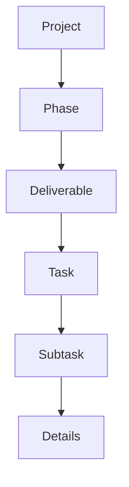

**Diagram sources**
- [data/demo/wbs--1_en.ctu:11-23](file://data/demo/wbs--1_en.ctu#L11-L23)
- [data/demo/wbs--2_en.ctu:11-22](file://data/demo/wbs--2_en.ctu#L11-L22)
- [data/demo/wbs--3_en.ctu:11-28](file://data/demo/wbs--3_en.ctu#L11-L28)

**Section sources**
- [data/demo/wbs--1_en.ctu:1-26](file://data/demo/wbs--1_en.ctu#L1-L26)
- [data/demo/wbs--2_en.ctu:1-25](file://data/demo/wbs--2_en.ctu#L1-L25)
- [data/demo/wbs--3_en.ctu:1-31](file://data/demo/wbs--3_en.ctu#L1-L31)

### EBNF Grammars
Purpose
- Specify formal syntax for domain-specific languages, protocols, and parsers.
- Aid in compiler construction, protocol design, and validation logic.

Syntax highlights
- Terminals, rules, alternatives, groups, and repetition constructs.
- Optional and zero-or-more forms.
- Special sequences and separators.

Practical use cases
- Define lexer/parser grammar for internal DSLs.
- Document protocol message formats.
- Validate configuration and data schemas.

Integration notes
- Pair EBNF diagrams with parser implementations for clarity.

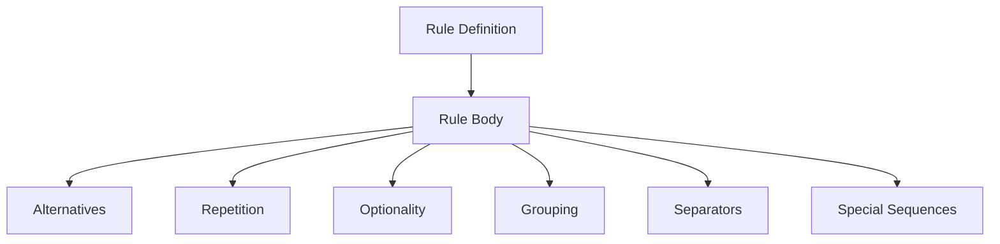

**Diagram sources**
- [data/demo/ebnf--1_en.ctu:11-13](file://data/demo/ebnf--1_en.ctu#L11-L13)
- [data/demo/ebnf--2_en.ctu:11-36](file://data/demo/ebnf--2_en.ctu#L11-L36)
- [data/demo/ebnf--3_en.ctu:11-23](file://data/demo/ebnf--3_en.ctu#L11-L23)

**Section sources**
- [data/demo/ebnf--1_en.ctu:1-16](file://data/demo/ebnf--1_en.ctu#L1-L16)
- [data/demo/ebnf--2_en.ctu:1-39](file://data/demo/ebnf--2_en.ctu#L1-L39)
- [data/demo/ebnf--3_en.ctu:1-26](file://data/demo/ebnf--3_en.ctu#L1-L26)

### Regular Expressions
Purpose
- Describe matching patterns for text processing, validation, and parsing.
- Essential for log analysis, configuration parsing, and input sanitization.

Syntax highlights
- Shorthand character classes.
- Literal sequences and quoted literals.
- Escaped metacharacters.

Practical use cases
- Validate user inputs and identifiers.
- Extract structured data from logs.
- Build lexical analyzers.

Integration notes
- Use regex diagrams to illustrate intended matches before implementation.

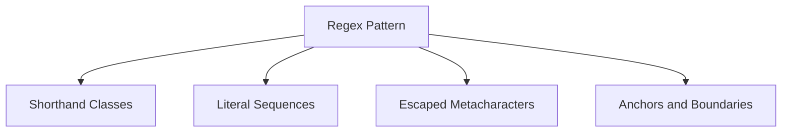

**Diagram sources**
- [data/demo/regex--1_en.ctu:11-14](file://data/demo/regex--1_en.ctu#L11-L14)
- [data/demo/regex--2_en.ctu:11-14](file://data/demo/regex--2_en.ctu#L11-L14)
- [data/demo/regex--3_en.ctu:11-14](file://data/demo/regex--3_en.ctu#L11-L14)

**Section sources**
- [data/demo/regex--1_en.ctu:1-17](file://data/demo/regex--1_en.ctu#L1-L17)
- [data/demo/regex--2_en.ctu:1-17](file://data/demo/regex--2_en.ctu#L1-L17)
- [data/demo/regex--3_en.ctu:1-17](file://data/demo/regex--3_en.ctu#L1-L17)

### Network Diagrams (nwdiag)
Purpose
- Visualize network topologies, segments, and device placement.
- Aid in infrastructure documentation and security boundary design.

Syntax highlights
- Network blocks with address assignments.
- Device entries with IP attributes.
- Nested networks and devices.

Practical use cases
- Document DMZ layouts and server placement.
- Illustrate routing and segmentation strategies.
- Support incident response and forensic analysis.

Integration notes
- Embed nwdiag within PlantUML blocks for unified rendering.

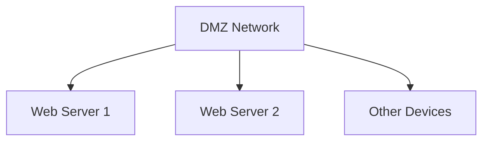

**Diagram sources**
- [data/demo/network--1_zh.ctu:11-17](file://data/demo/network--1_zh.ctu#L11-L17)
- [data/demo/network--2_zh.ctu:11-15](file://data/demo/network--2_zh.ctu#L11-L15)
- [data/demo/network--3_zh.ctu:11-23](file://data/demo/network--3_zh.ctu#L11-L23)
- [data/demo/nwdiag--1_en.ctu:11-17](file://data/demo/nwdiag--1_en.ctu#L11-L17)
- [data/demo/nwdiag--2_en.ctu:11-15](file://data/demo/nwdiag--2_en.ctu#L11-L15)
- [data/demo/nwdiag--3_en.ctu:11-18](file://data/demo/nwdiag--3_en.ctu#L11-L18)

**Section sources**
- [data/demo/network--1_zh.ctu:1-20](file://data/demo/network--1_zh.ctu#L1-L20)
- [data/demo/network--2_zh.ctu:1-18](file://data/demo/network--2_zh.ctu#L1-L18)
- [data/demo/network--3_zh.ctu:1-26](file://data/demo/network--3_zh.ctu#L1-L26)
- [data/demo/nwdiag--1_en.ctu:1-20](file://data/demo/nwdiag--1_en.ctu#L1-L20)
- [data/demo/nwdiag--2_en.ctu:1-18](file://data/demo/nwdiag--2_en.ctu#L1-L18)
- [data/demo/nwdiag--3_en.ctu:1-21](file://data/demo/nwdiag--3_en.ctu#L1-L21)

### JSON and YAML Structures
Purpose
- Model and communicate data schemas and configuration formats.
- Reduce ambiguity in APIs, manifests, and settings.

Syntax highlights
- JSON with nested objects and arrays.
- YAML with indentation and lists.

Practical use cases
- Document API payloads and configuration files.
- Validate schema compliance during CI.
- Onboard developers with clear examples.

Integration notes
- Use @startjson and @startyaml to render structured views.

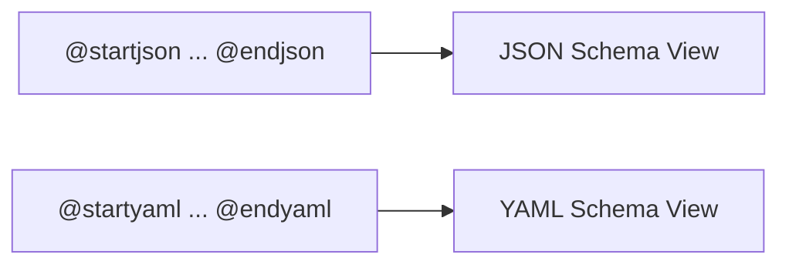

**Diagram sources**
- [data/demo/json--1_en.ctu:11-17](file://data/demo/json--1_en.ctu#L11-L17)
- [data/demo/yaml--1_en.ctu:11-17](file://data/demo/yaml--1_en.ctu#L11-L17)

**Section sources**
- [data/demo/json--1_en.ctu:1-20](file://data/demo/json--1_en.ctu#L1-L20)
- [data/demo/yaml--1_en.ctu:1-20](file://data/demo/yaml--1_en.ctu#L1-L20)

### Archimate Diagrams
Purpose
- Bridge business, application, and technology layers.
- Support enterprise architecture and solution design.

Syntax highlights
- Archimate elements with keywords and roles.
- Rectangles for goals and other nodes.
- Combined with standard PlantUML blocks.

Practical use cases
- Document capability-to-technology mapping.
- Align stakeholder concerns with technical artifacts.
- Facilitate gap analysis and roadmap planning.

Integration notes
- Use within @startuml ... @enduml for compatibility.

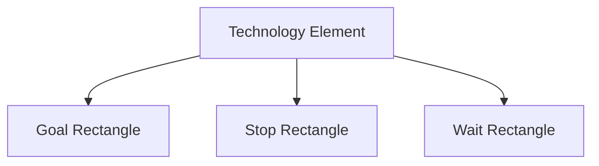

**Diagram sources**
- [data/demo/archimate--1_en.ctu:11-17](file://data/demo/archimate--1_en.ctu#L11-L17)

**Section sources**
- [data/demo/archimate--1_en.ctu:1-20](file://data/demo/archimate--1_en.ctu#L1-L20)

### Salt Orchestration and Wireframe Mockups
Purpose
- Model UI components and form elements for rapid prototyping.
- Represent orchestration-like interactions in documentation.

Syntax highlights
- Salt block for widget-like structures.
- Plain text, buttons, checkboxes, radios, text areas, and dropdowns.

Practical use cases
- Create clickable wireframes for UX reviews.
- Document form flows and validation points.
- Share interactive mockups with stakeholders.

Integration notes
- Use @startsalt ... @endsalt for rendering.

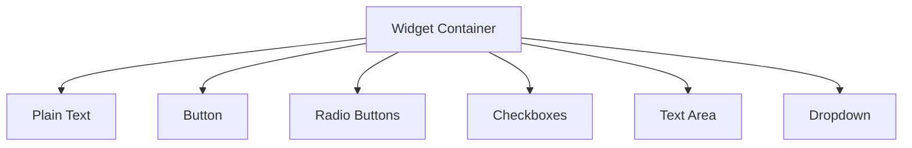

**Diagram sources**
- [data/demo/salt--1_en.ctu:11-22](file://data/demo/salt--1_en.ctu#L11-L22)
- [data/demo/salt--2_en.ctu:11-18](file://data/demo/salt--2_en.ctu#L11-L18)
- [data/demo/salt--3_en.ctu:11-18](file://data/demo/salt--3_en.ctu#L11-L18)
- [data/demo/wireframe--1_zh.ctu:11-22](file://data/demo/wireframe--1_zh.ctu#L11-L22)

**Section sources**
- [data/demo/salt--1_en.ctu:1-25](file://data/demo/salt--1_en.ctu#L1-L25)
- [data/demo/salt--2_en.ctu:1-21](file://data/demo/salt--2_en.ctu#L1-L21)
- [data/demo/salt--3_en.ctu:1-21](file://data/demo/salt--3_en.ctu#L1-L21)
- [data/demo/wireframe--1_zh.ctu:1-25](file://data/demo/wireframe--1_zh.ctu#L1-L25)

## Dependency Analysis
Non-UML diagrams depend on PlantUML directives and the Code-To-UML pipeline to transform .ctu files into images. The pipeline extracts the [UML] block and passes it to PlantUML, which interprets the directive and renders the diagram.

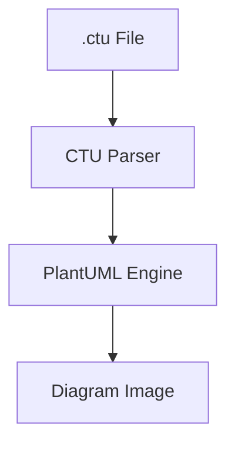

[No sources needed since this diagram shows conceptual workflow, not actual code structure]

## Performance Considerations
- Keep diagram complexity moderate to avoid rendering delays.
- Prefer concise labels and minimal nesting for readability.
- Use batch rendering for multiple diagrams in a single run.

## Troubleshooting Guide
Common issues and resolutions
- Incorrect directive placement: Ensure the [UML] block uses the correct start/end directive for the target diagram type.
- Encoding problems: Verify UTF-8 encoding and proper escaping of special characters.
- Excessive nesting: Simplify hierarchy to improve rendering performance and clarity.

**Section sources**
- [data/demo/gantt--1_en.ctu:10-23](file://data/demo/gantt--1_en.ctu#L10-L23)
- [data/demo/mindmap--1_en.ctu:10-27](file://data/demo/mindmap--1_en.ctu#L10-L27)
- [data/demo/wbs--1_en.ctu:10-26](file://data/demo/wbs--1_en.ctu#L10-L26)
- [data/demo/ebnf--1_en.ctu:10-16](file://data/demo/ebnf--1_en.ctu#L10-L16)
- [data/demo/regex--1_en.ctu:10-17](file://data/demo/regex--1_en.ctu#L10-L17)
- [data/demo/network--1_zh.ctu:10-20](file://data/demo/network--1_zh.ctu#L10-L20)
- [data/demo/nwdiag--1_en.ctu:10-20](file://data/demo/nwdiag--1_en.ctu#L10-L20)
- [data/demo/json--1_en.ctu:10-20](file://data/demo/json--1_en.ctu#L10-L20)
- [data/demo/yaml--1_en.ctu:10-20](file://data/demo/yaml--1_en.ctu#L10-L20)
- [data/demo/archimate--1_en.ctu:10-20](file://data/demo/archimate--1_en.ctu#L10-L20)
- [data/demo/salt--1_en.ctu:10-25](file://data/demo/salt--1_en.ctu#L10-L25)
- [data/demo/wireframe--1_zh.ctu:10-25](file://data/demo/wireframe--1_zh.ctu#L10-L25)

## Conclusion
Non-UML diagrams complement traditional UML by addressing diverse modeling needs: timelines (Gantt), exploration (Mind Maps), decomposition (WBS), syntax (EBNF), patterns (Regex), infrastructure (nwdiag), data (JSON/YAML), enterprise perspective (Archimate), and UX (Salt/Wireframe). Together, they form a comprehensive toolkit for software documentation and communication.

## Appendices
- Choose Gantt for scheduling, Mind Maps for ideation, WBS for decomposition, EBNF for syntax definition, Regex for pattern matching, nwdiag for network layout, JSON/YAML for data schemas, Archimate for enterprise alignment, and Salt/Wireframe for UI prototyping.
- Integrate with Code-To-UML by placing the appropriate PlantUML directive in the [UML] section of a .ctu file.