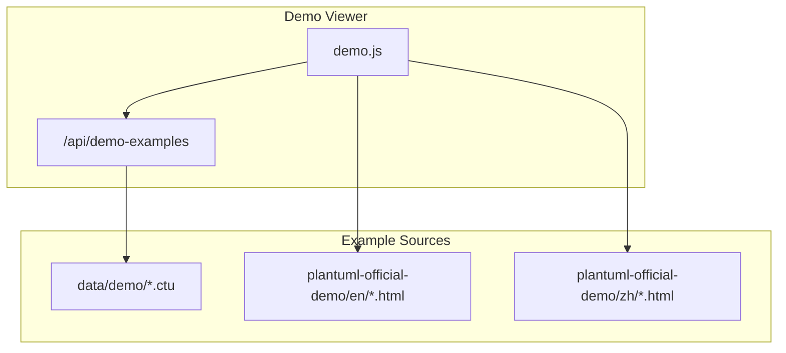
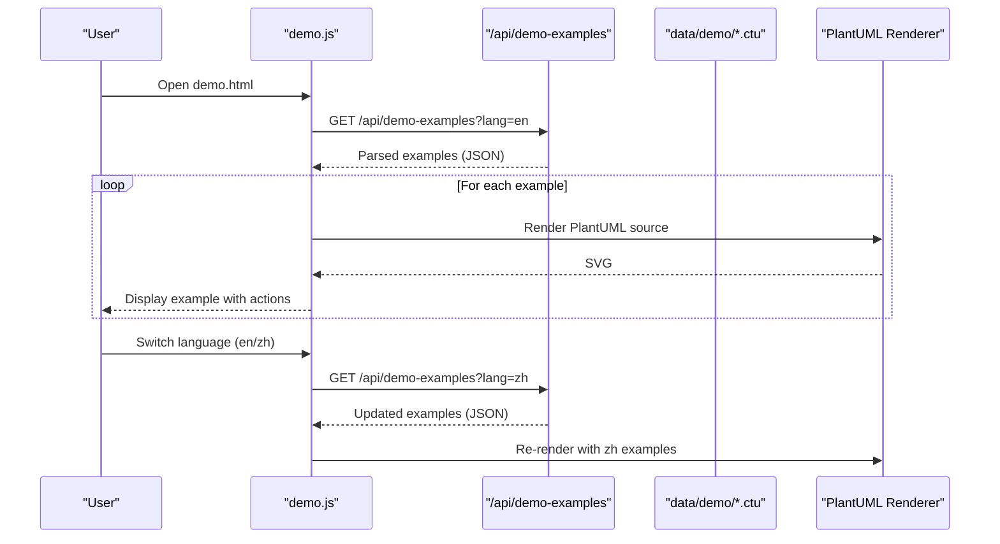
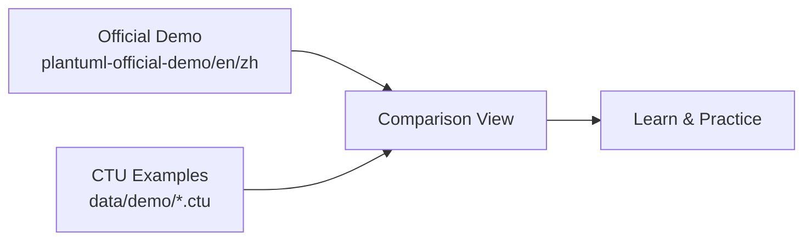
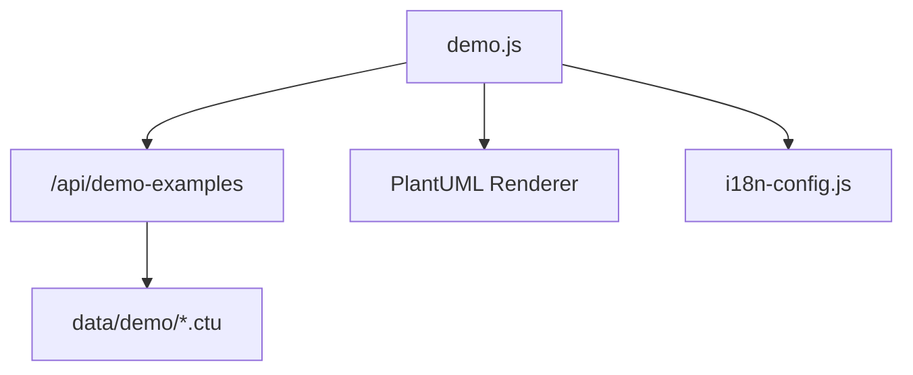

# Official PlantUML Integration

<cite>
**Referenced Files in This Document**
- [README.md](file://README.md)
- [README_zh.md](file://README_zh.md)
- [demo.js](file://demo.js)
- [plantuml-official-demo/en/activity-diagram-beta_en.html](file://plantuml-official-demo/en/activity-diagram-beta_en.html)
- [plantuml-official-demo/zh/activity-diagram-beta_zh.html](file://plantuml-official-demo/zh/activity-diagram-beta_zh.html)
- [plantuml-official-demo/en/class-diagram_en.html](file://plantuml-official-demo/en/class-diagram_en.html)
- [plantuml-official-demo/zh/class-diagram_zh.html](file://plantuml-official-demo/zh/class-diagram_zh.html)
- [data/demo/activity--1_en.ctu](file://data/demo/activity--1_en.ctu)
- [data/demo/activity--1_zh.ctu](file://data/demo/activity--1_zh.ctu)
- [data/demo/class--1_en.ctu](file://data/demo/class--1_en.ctu)
- [data/demo/class--10_en.ctu](file://data/demo/class--10_en.ctu)
- [data/demo/sequence--1_en.ctu](file://data/demo/sequence--1_en.ctu)
- [data/demo/use-case--1_en.ctu](file://data/demo/use-case--1_en.ctu)
</cite>

## Table of Contents
1. [Introduction](#introduction)
2. [Project Structure](#project-structure)
3. [Core Components](#core-components)
4. [Architecture Overview](#architecture-overview)
5. [Detailed Component Analysis](#detailed-component-analysis)
6. [Dependency Analysis](#dependency-analysis)
7. [Performance Considerations](#performance-considerations)
8. [Troubleshooting Guide](#troubleshooting-guide)
9. [Conclusion](#conclusion)

## Introduction
This document explains the official PlantUML integration in Code-To-UML. It focuses on how the plantuml-official-demo directory provides standardized, authoritative examples from the official PlantUML documentation, organized by language (en/zh). It also documents how these official examples complement the custom CTU examples in the data/demo directory, enhancing the example library with authoritative syntax patterns and best practices. Guidance is provided for comparing official examples with Code-To-UML variants, understanding syntax differences, and leveraging both sources for comprehensive learning. The bilingual nature of the official demos supports international users by offering identical content in English and Chinese.

## Project Structure
The official PlantUML integration is centered around:
- plantuml-official-demo/: Official HTML pages from PlantUML’s documentation, mirrored here for offline browsing and comparison.
- data/demo/: Custom Code-To-UML examples in .ctu format, designed for the demo viewer and bilingual rendering.
- demo.js: The demo page controller that loads and renders examples, supports language switching, and integrates with the PlantUML rendering pipeline.

**Diagram sources**
- [demo.js:174-185](file://demo.js#L174-L185)
- [README.md:166-198](file://README.md#L166-L198)

**Section sources**
- [README.md:166-198](file://README.md#L166-L198)
- [README_zh.md:166-198](file://README_zh.md#L166-L198)

## Core Components
- Official PlantUML HTML pages: These mirror PlantUML’s official documentation pages for activity, class, sequence, use-case, and other diagram types. They are bilingual (en/zh) and demonstrate authoritative syntax and features.
- Code-To-UML .ctu examples: Structured example files in data/demo/, each containing metadata and PlantUML source blocks. These are consumed by the demo viewer and rendered in the browser.
- Demo page controller: Loads examples via /api/demo-examples, applies i18n, and orchestrates rendering and user interactions.

Key capabilities:
- Bilingual support: Both official demos and CTU examples support English and Chinese.
- Authoritative patterns: Official demos showcase current PlantUML syntax and features.
- Consistent comparison: Same diagram types are represented in both official and CTU formats, enabling side-by-side learning.

**Section sources**
- [README.md:14-24](file://README.md#L14-L24)
- [README_zh.md:14-24](file://README_zh.md#L14-L24)
- [demo.js:104-144](file://demo.js#L104-L144)

## Architecture Overview
The demo viewer fetches .ctu examples from the backend, renders them in the browser using PlantUML WASM, and provides interactive features like lightbox previews and copy/download actions. The official PlantUML HTML pages are referenced for authoritative syntax and feature coverage.

**Diagram sources**
- [demo.js:174-185](file://demo.js#L174-L185)
- [demo.js:374-439](file://demo.js#L374-L439)

## Detailed Component Analysis

### Official PlantUML HTML Pages (en/zh)
- Purpose: Provide authoritative, up-to-date PlantUML syntax and feature demonstrations in English and Chinese.
- Organization: Each diagram type has a dedicated HTML page in en/ and zh/ subdirectories. These pages include embedded PlantUML examples and navigation aids.
- Bilingual support: Titles, descriptions, and navigation reflect the selected language, enabling international users to learn from native-language content.

Examples of official pages included:
- Activity diagrams (beta): Demonstrates new activity diagram syntax and features.
- Class diagrams: Shows class, interface, stereotype, and note syntax.
- Other diagram types: Sequence, use-case, state, deployment, timing, and more.

These pages are browsable locally and serve as a reference for syntax accuracy and feature coverage.

**Section sources**
- [plantuml-official-demo/en/activity-diagram-beta_en.html:1-120](file://plantuml-official-demo/en/activity-diagram-beta_en.html#L1-L120)
- [plantuml-official-demo/zh/activity-diagram-beta_zh.html:1-120](file://plantuml-official-demo/zh/activity-diagram-beta_zh.html#L1-L120)
- [plantuml-official-demo/en/class-diagram_en.html:1-120](file://plantuml-official-demo/en/class-diagram_en.html#L1-L120)
- [plantuml-official-demo/zh/class-diagram_zh.html:1-120](file://plantuml-official-demo/zh/class-diagram_zh.html#L1-L120)

### Code-To-UML .ctu Examples
- Format: Each .ctu file contains metadata (Title, Describe) and one or more example sections with PlantUML source blocks ([UML]).
- Naming convention: {diagram-type}--{number}_{language}.ctu (e.g., activity--1_en.ctu, class--10_en.ctu).
- Content: Designed for the demo viewer, with optional Description and Detail sections for explanations.

Examples present:
- Activity examples: Simple actions, action lists, and multi-line text.
- Class examples: Basic declarations, stereotypes, and notes.
- Sequence examples: Basic message flows with solid and dotted arrows.
- Use-case examples: Use-case creation and aliases.

These examples integrate seamlessly with the demo viewer and benefit from the same bilingual rendering and interactive features.

**Section sources**
- [data/demo/activity--1_en.ctu:1-18](file://data/demo/activity--1_en.ctu#L1-L18)
- [data/demo/activity--1_zh.ctu:1-18](file://data/demo/activity--1_zh.ctu#L1-L18)
- [data/demo/class--1_en.ctu:1-34](file://data/demo/class--1_en.ctu#L1-L34)
- [data/demo/class--10_en.ctu:1-30](file://data/demo/class--10_en.ctu#L1-L30)
- [data/demo/sequence--1_en.ctu:1-23](file://data/demo/sequence--1_en.ctu#L1-L23)
- [data/demo/use-case--1_en.ctu:1-21](file://data/demo/use-case--1_en.ctu#L1-L21)

### Demo Page Controller (demo.js)
- Loads examples: Fetches parsed examples from /api/demo-examples with language filtering.
- Applies i18n: Updates UI labels and example titles/descriptions according to the selected language.
- Renders examples: Uses the PlantUML renderer to convert @startuml ... @enduml blocks into SVG, with fallback to server-side rendering when needed.
- Interactive features: Copy source, copy SVG, download SVG, and lightbox preview with zoom/pan.

Comparison workflow:
- Load examples for the active language.
- Render each example’s PlantUML source.
- Provide actions to copy or export rendered diagrams.
- Support language switching to compare official and CTU examples side by side.

**Section sources**
- [demo.js:174-185](file://demo.js#L174-L185)
- [demo.js:374-439](file://demo.js#L374-L439)
- [demo.js:728-778](file://demo.js#L728-L778)

### Relationship Between Official Demos and CTU Examples
- Scope alignment: Both official and CTU examples cover the same diagram types (e.g., activity, class, sequence, use-case).
- Authoritativeness vs. customization: Official demos reflect PlantUML’s current syntax and features. CTU examples are tailored for the demo viewer and include metadata and explanations.
- Bilingual parity: Official demos are bilingual (en/zh), mirroring the CTU example language support.
- Learning progression: Users can start with official demos to understand authoritative syntax, then explore CTU examples for structured explanations and additional patterns.

[No sources needed since this diagram shows conceptual workflow, not actual code structure]

## Dependency Analysis
- demo.js depends on:
  - /api/demo-examples for loading .ctu-based examples.
  - PlantUML renderer for SVG generation.
  - i18n system for language switching and UI updates.
- Official demos are static HTML pages that can be browsed independently and referenced for authoritative syntax.
- CTU examples depend on the demo viewer’s parsing and rendering pipeline.

**Diagram sources**
- [demo.js:174-185](file://demo.js#L174-L185)
- [demo.js:104-144](file://demo.js#L104-L144)

**Section sources**
- [demo.js:104-144](file://demo.js#L104-L144)
- [demo.js:174-185](file://demo.js#L174-L185)

## Performance Considerations
- WASM-first rendering: The demo viewer prioritizes client-side rendering for speed and responsiveness.
- Automatic fallback: When client rendering fails or is unsuitable (e.g., very large diagrams), the system retries server-side rendering.
- Large diagram handling: The renderer scales diagrams and adjusts layout to maintain usability.

Practical tips:
- Prefer smaller, focused examples for quick iteration.
- Use the lightbox to inspect details without reloading.
- Leverage copy actions to reuse verified PlantUML snippets.

**Section sources**
- [README.md:237-274](file://README.md#L237-L274)
- [README_zh.md:237-274](file://README_zh.md#L237-L274)
- [demo.js:413-429](file://demo.js#L413-L429)

## Troubleshooting Guide
Common issues and resolutions:
- Examples fail to load: Verify the .ctu files are well-formed and placed in data/demo/. Check the console for errors during bootstrap.
- Rendering failures: The demo viewer attempts automatic fallback to server-side rendering. If repeated failures occur, check the PlantUML source for syntax errors or unsupported constructs.
- Language switching anomalies: Ensure the i18n system is initialized and that .ctu files include appropriate metadata for bilingual titles/descriptions.

Actions:
- Refresh the page after correcting .ctu content.
- Use the “Copy source” action to isolate problematic PlantUML blocks.
- Compare with official demos to validate syntax against authoritative references.

**Section sources**
- [demo.js:124-129](file://demo.js#L124-L129)
- [demo.js:392-439](file://demo.js#L392-L439)
- [demo.js:449-483](file://demo.js#L449-L483)

## Conclusion
The official PlantUML integration in Code-To-UML enriches the example library by combining authoritative, bilingual PlantUML documentation with customizable, structured .ctu examples. Users can leverage official demos for accurate syntax and feature coverage, and CTU examples for guided learning and practical comparisons. The bilingual design ensures international accessibility, while the demo viewer’s rendering pipeline and interactive features streamline exploration and experimentation.