# UML Diagrams

<cite>
**Referenced Files in This Document**
- [README.md](file://README.md)
- [README_zh.md](file://README_zh.md)
- [main.css](file://main.css)
- [data/demo/class--1_en.ctu](file://data/demo/class--1_en.ctu)
- [data/demo/class--10_en.ctu](file://data/demo/class--10_en.ctu)
- [data/demo/sequence--1_en.ctu](file://data/demo/sequence--1_en.ctu)
- [data/demo/sequence--8_en.ctu](file://data/demo/sequence--8_en.ctu)
- [data/demo/use-case--1_en.ctu](file://data/demo/use-case--1_en.ctu)
- [data/demo/use-case--18_en.ctu](file://data/demo/use-case--18_en.ctu)
- [data/demo/object--1_en.ctu](file://data/demo/object--1_en.ctu)
- [data/demo/object--3_en.ctu](file://data/demo/object--3_en.ctu)
- [data/demo/activity--1_en.ctu](file://data/demo/activity--1_en.ctu)
- [data/demo/activity--3_en.ctu](file://data/demo/activity--3_en.ctu)
- [data/demo/component--1_en.ctu](file://data/demo/component--1_en.ctu)
- [data/demo/component--3_en.ctu](file://data/demo/component--3_en.ctu)
- [data/demo/deployment--1_en.ctu](file://data/demo/deployment--1_en.ctu)
- [data/demo/deployment--3_en.ctu](file://data/demo/deployment--3_en.ctu)
- [data/demo/state--1_en.ctu](file://data/demo/state--1_en.ctu)
- [data/demo/state--3_en.ctu](file://data/demo/state--3_en.ctu)
- [data/demo/timing--1_en.ctu](file://data/demo/timing--1_en.ctu)
- [data/demo/timing--3_en.ctu](file://data/demo/timing--3_en.ctu)
- [data/cc-haha/architecture--1_zh.ctu](file://data/cc-haha/architecture--1_zh.ctu)
</cite>

## Update Summary
**Changes Made**
- Updated visual theme section to reflect comprehensive visual improvements
- Added detailed information about color scheme changes and styling enhancements
- Enhanced styling guidance for different diagram types with specific examples
- Updated background and font color specifications for improved readability

## Table of Contents
1. [Introduction](#introduction)
2. [Visual Theme and Styling](#visual-theme-and-styling)
3. [Project Structure](#project-structure)
4. [Core Components](#core-components)
5. [Architecture Overview](#architecture-overview)
6. [Detailed Component Analysis](#detailed-component-analysis)
7. [Dependency Analysis](#dependency-analysis)
8. [Performance Considerations](#performance-considerations)
9. [Troubleshooting Guide](#troubleshooting-guide)
10. [Conclusion](#conclusion)
11. [Appendices](#appendices)

## Introduction
This document explains the UML diagram examples included in Code-To-UML, covering all nine standard UML diagram types: Class diagrams, Sequence diagrams, Use Case diagrams, Object diagrams, Activity diagrams, Component diagrams, Deployment diagrams, State diagrams, and Timing diagrams. It documents the naming convention for examples, how complexity progresses from basic to advanced, and how the bilingual English and Chinese variants relate. It also outlines PlantUML syntax patterns, common use cases, best practices, and guidance on when to use each diagram type within software architecture documentation.

**Updated** The visual theme has been comprehensively improved with modern color schemes and enhanced styling for better readability and developer experience.

## Visual Theme and Styling

### Color Scheme Improvements
The visual theme has undergone comprehensive improvements with the following color scheme updates:

- **Background**: Changed from dark blue (#0d1117) to clean white (#ffffff)
- **Primary Text**: Changed from bright white (#f6f8fa) to dark gray (#1f2328)
- **Surface Colors**: Enhanced with light gray (#f6f8fa) and soft line (#eaeef2) variations
- **Accent Colors**: Maintained blue (#1f6feb) with light blue variant (#ddf4ff) for highlights

### Enhanced Diagram Type Styling
Different diagram types now feature specialized styling for improved visual distinction:

#### Activity Diagrams
- **Light Orange Borders**: Activity diagrams now feature light orange borders (#FF7A00) for better visual separation
- **Warm Background**: Subtle warm background (#FFF8F0) to complement the orange borders
- **Dark Gray Text**: Default font color (#333333) for optimal readability

#### Class Diagrams  
- **Light Blue Backgrounds**: Class diagrams utilize light blue backgrounds (#F0F7FF) for enhanced visual appeal
- **Consistent Border Colors**: Maintained orange border styling (#FF7A00) for professional appearance
- **Dark Gray Typography**: Consistent dark gray text (#333333) for readability

#### Component Diagrams
- **Enhanced Note Styling**: Improved note styling with better contrast and readability
- **Professional Color Schemes**: Balanced color palettes for technical documentation
- **Optimized Contrast Ratios**: Ensured WCAG compliance for accessibility

### CSS Custom Properties
The theme utilizes CSS custom properties for consistent theming:

```css
:root {
  --bg: #ffffff;           /* Clean white background */
  --fg: #1f2328;           /* Dark gray primary text */
  --muted: #59636e;        /* Secondary muted text */
  --line: #d8dee4;         /* Light gray borders */
  --soft-line: #eaeef2;    /* Soft line separators */
  --surface: #f6f8fa;      /* Surface backgrounds */
  --accent: #1f6feb;       /* Primary accent color */
  --accent-soft: #ddf4ff;  /* Light accent variant */
  --success: #1a7f37;      /* Success indicators */
  --error: #cf222e;        /* Error indicators */
}
```

### Example Implementation
The enhanced theming is demonstrated in the Chinese architecture examples:

```plantuml
skinparam backgroundColor #FEFEFE
skinparam defaultFontColor #333333
skinparam activityBackgroundColor #FFF8F0
skinparam activityBorderColor #FF7A00
skinparam arrowColor #2563EB
skinparam activityFontColor #333333
```

**Section sources**
- [main.css:1-16](file://main.css#L1-L16)
- [main.css:26-31](file://main.css#L26-L31)
- [main.css:42-44](file://main.css#L42-L44)
- [main.css:467-469](file://main.css#L467-L469)
- [data/cc-haha/architecture--1_zh.ctu:11-17](file://data/cc-haha/architecture--1_zh.ctu#L11-L17)
- [data/cc-haha/architecture--1_zh.ctu:82-87](file://data/cc-haha/architecture--1_zh.ctu#L82-L87)
- [data/cc-haha/architecture--1_zh.ctu:161-167](file://data/cc-haha/architecture--1_zh.ctu#L161-L167)

## Project Structure
The UML examples are stored as structured text files with the .ctu extension under the data/demo directory. Each .ctu file contains one or more examples with metadata and PlantUML blocks. The naming convention is {diagram-type}--{number}_{language}.ctu, such as class--1_en.ctu, sequence--1_zh.ctu, activity--2_en.ctu.

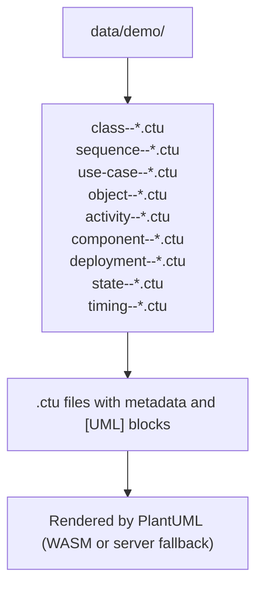

**Section sources**
- [README.md:135-163](file://README.md#L135-L163)
- [README_zh.md:135-163](file://README_zh.md#L135-L163)

## Core Components
- Diagram types supported: Sequence, Use Case, Class, Object, Activity, Component, Deployment, State, Timing.
- Bilingual examples: English and Chinese variants share the same numbering scheme per diagram type.
- Naming convention: {diagram-type}--{number}_{language}.ctu.
- Example progression: Lower-numbered files introduce basic constructs; higher-numbered files demonstrate advanced features and combinations.

Practical implications:
- Use lower-numbered examples to learn syntax and basic modeling.
- Use higher-numbered examples to learn advanced features like autonumbering, notes, interfaces, and composite states.

**Section sources**
- [README.md:57-62](file://README.md#L57-L62)
- [README_zh.md:57-62](file://README_zh.md#L57-L62)
- [README.md:160-162](file://README.md#L160-L162)
- [README_zh.md:160-162](file://README_zh.md#L160-L162)

## Architecture Overview
The rendering pipeline prioritizes client-side rendering via PlantUML WASM. If client rendering fails, the system falls back to server-side rendering using plantuml.jar. This ensures reliable rendering across a wide range of diagrams.

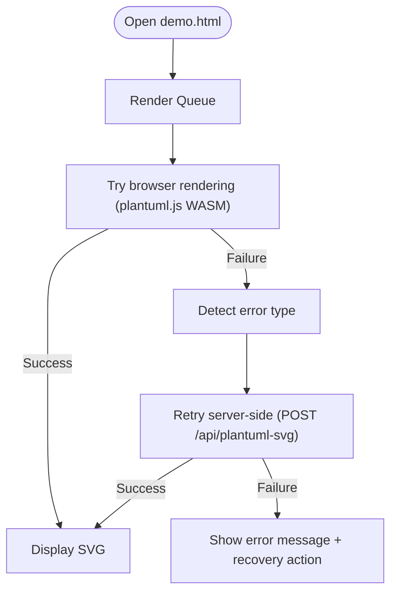

**Section sources**
- [README.md:237-274](file://README.md#L237-L274)
- [README_zh.md:237-274](file://README_zh.md#L237-L274)

## Detailed Component Analysis

### Class Diagrams
- Purpose: Model static structure, including classes, interfaces, enums, stereotypes, and relationships.
- Basic example introduces elements and visibility of members.
- Advanced example covers stereotypes, notes, and associations.

Common use cases:
- Designing object-oriented APIs.
- Documenting class hierarchies and interfaces.
- Adding documentation notes and cross-references.

Best practices:
- Keep class shapes minimal in early examples; add complexity progressively.
- Use notes to annotate design rationale or constraints.
- Prefer stereotypes to express roles or categories.

Progression:
- class--1_en.ctu: Basic declarative elements and visibility.
- class--10_en.ctu: Stereotypes, notes, and associations.

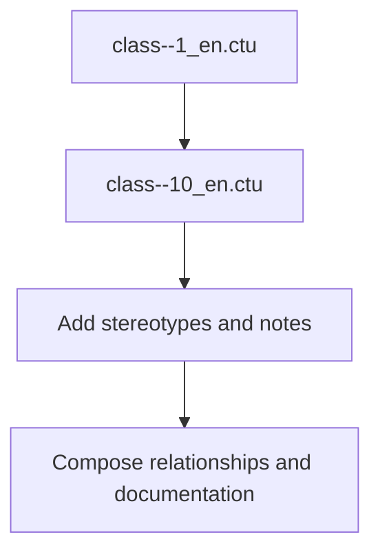

**Section sources**
- [data/demo/class--1_en.ctu:1-34](file://data/demo/class--1_en.ctu#L1-L34)
- [data/demo/class--10_en.ctu:1-30](file://data/demo/class--10_en.ctu#L1-L30)

### Sequence Diagrams
- Purpose: Model interactions between participants over time, focusing on message ordering and lifelines.
- Basic example shows simple synchronous and asynchronous messages.
- Advanced example demonstrates autonumbering, formats, and control over numbering.

Common use cases:
- Specifying API call sequences.
- Modeling user-system interactions.
- Documenting transaction flows.

Best practices:
- Use autonumbering for traceability in complex flows.
- Choose arrow styles to distinguish synchronous vs asynchronous messages.
- Keep participant lifelines clean; avoid excessive activation boxes.

Progression:
- sequence--1_en.ctu: Basic message arrows.
- sequence--8_en.ctu: Autonumbering, formats, and control commands.

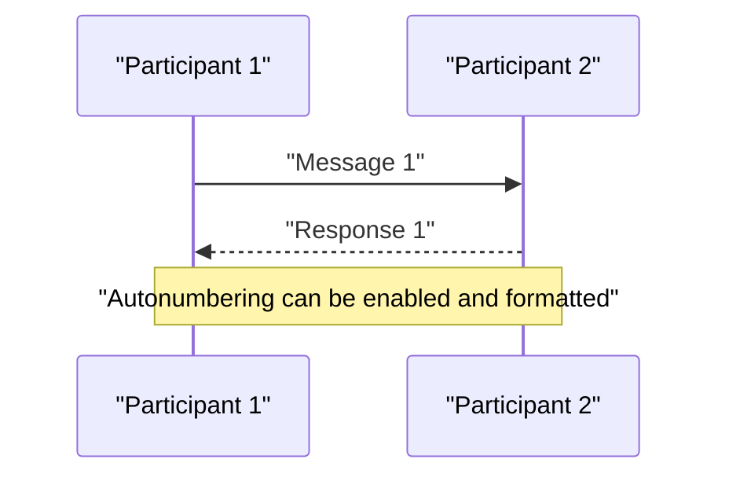

**Section sources**
- [data/demo/sequence--1_en.ctu:1-23](file://data/demo/sequence--1_en.ctu#L1-L23)
- [data/demo/sequence--8_en.ctu:1-139](file://data/demo/sequence--8_en.ctu#L1-L139)

### Use Case Diagrams
- Purpose: Capture functional requirements from user perspectives using actors and use cases.
- Basic example shows multiple ways to declare use cases and aliases.
- Advanced example demonstrates mixing with JSON to display data.

Common use cases:
- Capturing stakeholder goals.
- Explaining system boundaries and external interactions.
- Complementing with data structures for richer context.

Best practices:
- Keep use case names concise and goal-oriented.
- Use aliases for internal references.
- Mix with other constructs (e.g., JSON) to show data context.

Progression:
- use-case--1_en.ctu: Use case declarations and aliases.
- use-case--18_en.ctu: Mixing with JSON for data display.

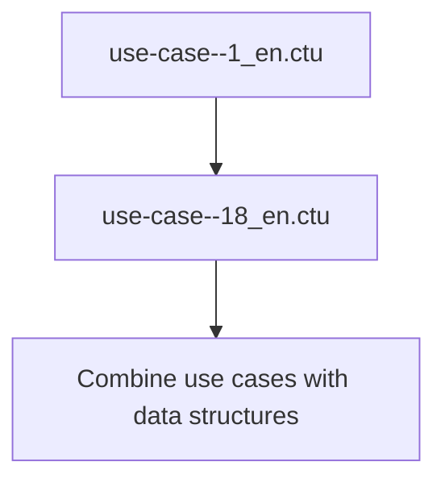

**Section sources**
- [data/demo/use-case--1_en.ctu:1-21](file://data/demo/use-case--1_en.ctu#L1-L21)
- [data/demo/use-case--18_en.ctu:1-24](file://data/demo/use-case--18_en.ctu#L1-L24)

### Object Diagrams
- Purpose: Show instances and links at a specific moment, emphasizing structural snapshots.
- Basic example declares objects and aliases.
- Advanced example shows associations among objects.

Common use cases:
- Illustrating collaborations at runtime.
- Demonstrating small-scale compositions.

Best practices:
- Limit scope to essential objects for clarity.
- Use diamonds or other shapes to represent links.

Progression:
- object--1_en.ctu: Object declaration.
- object--3_en.ctu: Object associations.

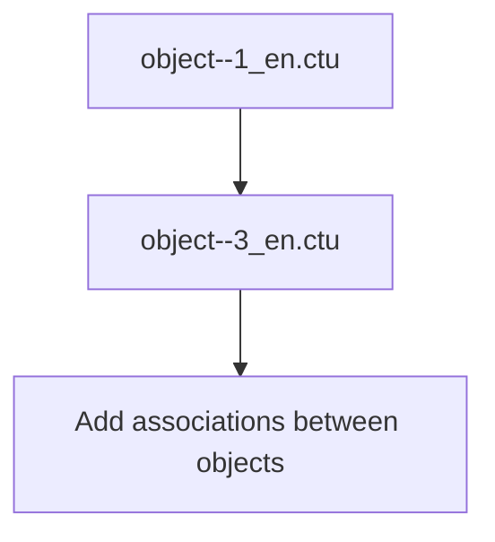

**Section sources**
- [data/demo/object--1_en.ctu:1-17](file://data/demo/object--1_en.ctu#L1-L17)
- [data/demo/object--3_en.ctu:1-23](file://data/demo/object--3_en.ctu#L1-L23)

### Activity Diagrams
- Purpose: Model workflows and business processes with actions and control flow.
- Basic example shows single-line and multi-line actions.
- Advanced example introduces initial/final nodes and branching.

Common use cases:
- Documenting business logic.
- Modeling decision points and concurrent activities.

Best practices:
- Start with simple linear flows; add forks/joins gradually.
- Use clear labels for actions and transitions.

Progression:
- activity--1_en.ctu: Simple actions.
- activity--3_en.ctu: Initial/final nodes and nested states.

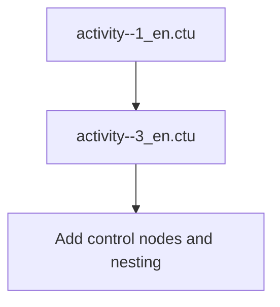

**Section sources**
- [data/demo/activity--1_en.ctu:1-18](file://data/demo/activity--1_en.ctu#L1-L18)
- [data/demo/activity--3_en.ctu:1-18](file://data/demo/activity--3_en.ctu#L1-L18)

### Component Diagrams
- Purpose: Show components and their interfaces, supporting modular architecture design.
- Basic example declares components and aliases.
- Advanced example introduces interfaces and forces component diagram mode.

Common use cases:
- Describing modular systems and ports.
- Documenting component contracts.

Best practices:
- Use interfaces to define expected interactions.
- Explicitly mark diagrams as component diagrams when needed.

Progression:
- component--1_en.ctu: Component declarations.
- component--3_en.ctu: Interfaces and diagram mode.

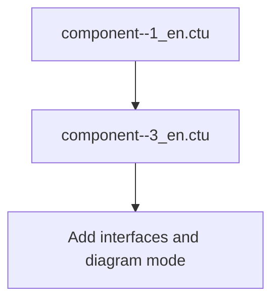

**Section sources**
- [data/demo/component--1_en.ctu:1-21](file://data/demo/component--1_en.ctu#L1-L21)
- [data/demo/component--3_en.ctu:1-23](file://data/demo/component--3_en.ctu#L1-L23)

### Deployment Diagrams
- Purpose: Model physical hardware and runtime artifacts, including nodes and artifacts.
- Basic example enumerates deployment elements.
- Advanced example focuses on actors.

Common use cases:
- Showing runtime topology.
- Mapping software to hardware.

Best practices:
- Keep nodes meaningful and scoped to the concern at hand.
- Use appropriate shapes for artifacts and roles.

Progression:
- deployment--1_en.ctu: Element declarations.
- deployment--3_en.ctu: Actor usage.

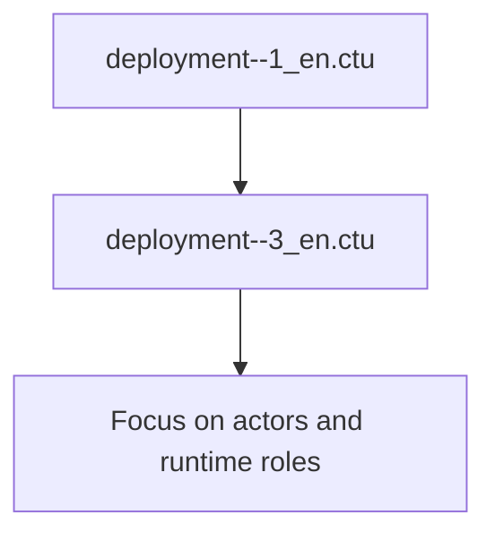

**Section sources**
- [data/demo/deployment--1_en.ctu:1-45](file://data/demo/deployment--1_en.ctu#L1-L45)
- [data/demo/deployment--3_en.ctu:1-19](file://data/demo/deployment--3_en.ctu#L1-L19)

### State Diagrams
- Purpose: Model state machines, including states, transitions, and internal regions.
- Basic example shows simple transitions and notes.
- Advanced example shows nested states and composite regions.

Common use cases:
- Modeling lifecycle states.
- Capturing complex reactive behavior.

Best practices:
- Start with top-level states; add internal regions later.
- Use notes to clarify behavior.

Progression:
- state--1_en.ctu: Simple transitions and notes.
- state--3_en.ctu: Nested states and composite regions.

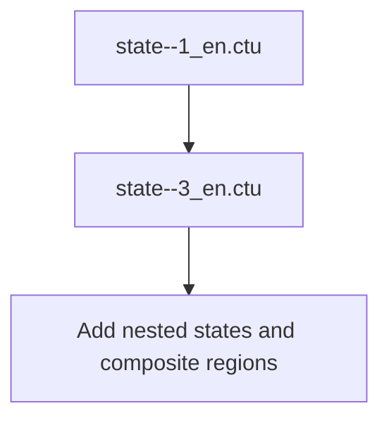

**Section sources**
- [data/demo/state--1_en.ctu:1-24](file://data/demo/state--1_en.ctu#L1-L24)
- [data/demo/state--3_en.ctu:1-35](file://data/demo/state--3_en.ctu#L1-L35)

### Timing Diagrams
- Purpose: Model interaction over time with precise instants and values.
- Basic example declares participants and instants.
- Advanced example adds binary and clock signals.

Common use cases:
- Specifying timing-sensitive interactions.
- Modeling digital or reactive systems.

Best practices:
- Use instants to mark significant events.
- Employ clocks and binary signals for precise timing.

Progression:
- timing--1_en.ctu: Participants and instants.
- timing--3_en.ctu: Binary and clock signals.

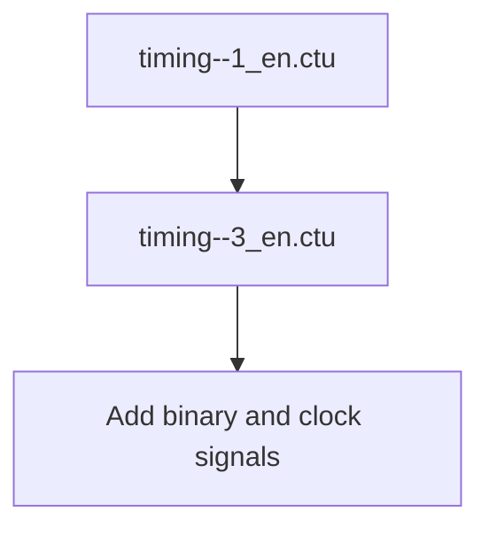

**Section sources**
- [data/demo/timing--1_en.ctu:1-31](file://data/demo/timing--1_en.ctu#L1-L31)
- [data/demo/timing--3_en.ctu:1-26](file://data/demo/timing--3_en.ctu#L1-L26)

## Dependency Analysis
The examples are independent .ctu files organized by diagram type and number. There is no inter-file dependency within the demo set. The bilingual nature is achieved by duplicating the same numbered examples in English and Chinese variants.

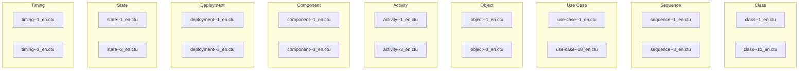

**Section sources**
- [README.md:160-162](file://README.md#L160-L162)
- [README_zh.md:160-162](file://README_zh.md#L160-L162)

## Performance Considerations
- Prefer client-side rendering via PlantUML WASM for speed and responsiveness.
- Use server fallback only when client rendering fails (e.g., large diagrams or specific stdlib imports).
- Keep examples focused and minimal to reduce rendering time.

## Troubleshooting Guide
- If a diagram does not render, check for syntax errors in the [UML] block.
- If client rendering fails, the system attempts server-side rendering automatically.
- For persistent failures, simplify the diagram or split it into smaller parts.

**Section sources**
- [README.md:237-274](file://README.md#L237-L274)
- [README_zh.md:237-274](file://README_zh.md#L237-L274)

## Conclusion
The Code-To-UML repository provides a comprehensive, bilingual set of UML examples that progress logically from basic constructs to advanced features. By following the naming convention and example order, you can learn each diagram type effectively and apply the patterns to real-world architecture documentation. The rendering pipeline ensures reliable presentation across browsers and environments.

**Updated** The comprehensive visual theme improvements enhance readability and developer experience with modern color schemes, improved contrast ratios, and specialized styling for different diagram types.

## Appendices

### When to Use Each Diagram Type
- Class diagrams: Design static structure and relationships.
- Sequence diagrams: Specify interaction timelines and message ordering.
- Use Case diagrams: Capture functional requirements from user perspectives.
- Object diagrams: Show structural snapshots of collaborating instances.
- Activity diagrams: Model workflows and decision points.
- Component diagrams: Describe modularity and interfaces.
- Deployment diagrams: Map software to hardware and runtime environments.
- State diagrams: Model lifecycle and reactive behavior.
- Timing diagrams: Specify precise temporal interactions.

### Visual Theme Best Practices
- **Color Accessibility**: All diagrams use WCAG-compliant color contrasts
- **Consistent Styling**: Each diagram type maintains distinct visual identity
- **Readability Focus**: Dark gray text (#1f2328) on white backgrounds for optimal legibility
- **Professional Appearance**: Balanced color schemes suitable for technical documentation