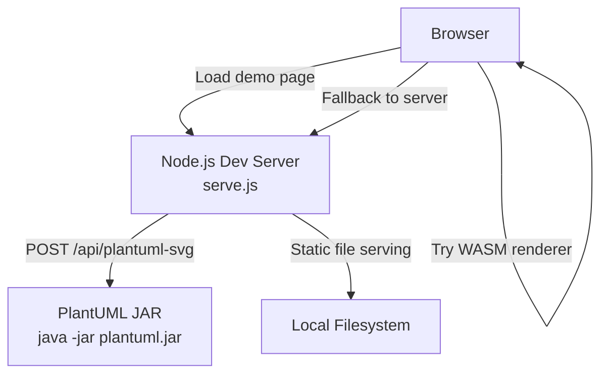

# Getting Started

<cite>
**Referenced Files in This Document**
- [README.md](file://README.md)
- [serve.js](file://serve.js)
- [serve.sh](file://serve.sh)
- [serve.bat](file://serve.bat)
- [install-ctu-home.js](file://install-ctu-home.js)
- [demo.html](file://demo.html)
- [index.html](file://index.html)
- [main.css](file://main.css)
- [AGENTS.md](file://AGENTS.md)
- [CLAUDE.md](file://CLAUDE.md)
- [SKILL.md](file://skills/code-to-uml/SKILL.md)
- [install-ctu-home.test.js](file://test/install-ctu-home.test.js)
- [serve-scripts-static.test.js](file://test/serve-scripts-static.test.js)
</cite>

## Update Summary
**Changes Made**
- Updated installation instructions with corrected repository URL
- Simplified demo access URL from `demo.html` to root endpoint (`/`)
- Enhanced server startup procedures documentation
- Updated troubleshooting guidance for simplified access patterns

## Table of Contents
1. [Introduction](#introduction)
2. [Prerequisites](#prerequisites)
3. [Installation](#installation)
4. [Server Startup Procedures](#server-startup-procedures)
5. [Accessing the Demo Interface](#accessing-the-demo-interface)
6. [Verify Successful Installation](#verify-successful-installation)
7. [Optional: CTU_HOME Environment Variable](#optional-ctu-home-environment-variable)
8. [Architecture Overview](#architecture-overview)
9. [Troubleshooting Guide](#troubleshooting-guide)
10. [Conclusion](#conclusion)

## Introduction
Code-To-UML lets you explore 100+ UML and non-UML diagrams in your browser and optionally generate interactive HTML reports from structured data files. It runs entirely in the browser with a fast WebAssembly renderer and falls back to a local Node.js server for PlantUML rendering when needed. There are no build tools or package managers required—just open the demo page and go.

## Prerequisites
- Node.js 18 or newer
- Java (required for the server-side PlantUML fallback rendering endpoint)

These requirements are necessary because:
- The lightweight dev server is implemented in Node.js.
- The server exposes a fallback endpoint that invokes the PlantUML JAR to render diagrams when the browser renderer cannot handle them.

**Section sources**
- [README.md:83–87:83-87](file://README.md#L83-L87)
- [AGENTS.md:21](file://AGENTS.md#L21)

## Installation
Follow these steps to set up Code-To-UML locally:

1. Clone the repository and enter the project directory.
2. (Optional) Configure CTU_HOME for AI agent integration.
3. Start the server using your preferred method.
4. Open the demo interface in your browser.

**Section sources**
- [README.md:88–120:88-120](file://README.md#L88-L120)

## Server Startup Procedures
Choose one of the following methods to start the server:

- On Unix/macOS with the shell script:
  - Default port: 5401
  - Optional custom port: pass as an argument
  - The script cleans up any existing process on the port before starting

- On Windows with the batch script:
  - Default port: 5401
  - Optional custom port: pass as an argument
  - The script kills any existing process on the port before starting

- Direct Node.js execution:
  - Start the server directly with Node.js and an optional port argument

Notes:
- The server listens on all interfaces by default.
- The port can also be controlled via an environment variable.

**Section sources**
- [README.md:103–111:103-111](file://README.md#L103-L111)
- [serve.sh:1–54:1-54](file://serve.sh#L1-L54)
- [serve.bat:1–33:1-33](file://serve.bat#L1-L33)
- [serve.js:8–10:8-10](file://serve.js#L8-L10)

## Accessing the Demo Interface
Once the server is running, open the demo page in your browser:
- URL: http://localhost:5401

The demo page displays multiple diagram types and languages. You can switch between diagram categories and languages. The root endpoint serves the main index page which contains navigation to the demo interface.

**Section sources**
- [README.md:113–119:113-119](file://README.md#L113-L119)
- [index.html:244](file://index.html#L244)
- [serve.js:413–415:413-415](file://serve.js#L413-L415)

## Verify Successful Installation
After starting the server and opening the demo page, confirm:
- The page loads without errors.
- Diagrams render correctly in the browser.
- Language toggling works as expected.
- The cache index page lists generated HTML reports when available.

If you encounter issues:
- Check the server logs for errors.
- Ensure Java is installed and accessible on PATH for the fallback rendering endpoint.

**Section sources**
- [README.md:113–119:113-119](file://README.md#L113-L119)
- [index.html:238–404:238-404](file://index.html#L238-L404)

## Optional: CTU_HOME Environment Variable
Setting CTU_HOME allows AI agents to locate the project root and skill definitions automatically. To configure it:

- Run the installer script to set CTU_HOME and install the bundled skill for your preferred AI tools.
- The installer writes the environment variable to your shell profile (Unix/macOS) or the user environment (Windows).
- You can also print the appropriate command for your current shell without modifying profiles.

Supported tools include several popular AI coding assistants. The installer copies the skill definition into each tool's skills directory and updates your shell profile.

**Section sources**
- [README.md:97–101:97-101](file://README.md#L97-L101)
- [install-ctu-home.js:27–49:27-49](file://install-ctu-home.js#L27-L49)
- [install-ctu-home.js:158–165:158-165](file://install-ctu-home.js#L158-L165)
- [install-ctu-home.js:167–180:167-180](file://install-ctu-home.js#L167-L180)
- [install-ctu-home.js:182–202:182-202](file://install-ctu-home.js#L182-L202)
- [SKILL.md:14–28:14-28](file://skills/code-to-uml/SKILL.md#L14-L28)

## Architecture Overview
The system uses a two-tier rendering pipeline for reliability:
- Browser-first rendering via a WebAssembly PlantUML renderer.
- Automatic fallback to the Node.js server, which invokes the PlantUML JAR for rendering when needed.

**Diagram sources**
- [serve.js:454–561:454-561](file://serve.js#L454-L561)
- [CLAUDE.md:25–32:25-32](file://CLAUDE.md#L25-L32)

**Section sources**
- [README.md:239–274:239-274](file://README.md#L239-L274)
- [CLAUDE.md:25–32:25-32](file://CLAUDE.md#L25-L32)

## Troubleshooting Guide
Common setup issues and resolutions:

- Node.js not installed or outdated
  - Install or upgrade to Node.js 18+.
  - Confirm installation by running the server directly.

- Java not installed or not on PATH
  - Install Java and ensure it is available on PATH.
  - The server's fallback endpoint requires Java to render diagrams.

- Port already in use
  - The shell and batch scripts automatically detect and terminate the occupying process before starting the server.
  - Alternatively, choose a different port when launching the server.

- Cannot access the demo page
  - Verify the server is running and listening on the expected port.
  - Ensure your browser can reach localhost on the configured port.
  - Note: Access the demo via the root endpoint (`/`) rather than `demo.html`.

- Cache index page shows errors
  - The cache index requires the Node.js server to be running.
  - Confirm the server is started and reachable.

- AI agent cannot find the skill
  - Ensure CTU_HOME is set and points to the project root.
  - Re-run the installer script to update your shell profile or print the correct command for your current shell.

**Section sources**
- [AGENTS.md:21](file://AGENTS.md#L21)
- [serve.sh:8–33:8-33](file://serve.sh#L8-L33)
- [serve.bat:10–15:10-15](file://serve.bat#L10-L15)
- [README.md:97–101:97-101](file://README.md#L97-L101)
- [index.html:350–364:350-364](file://index.html#L350-L364)

## Conclusion
You now have everything needed to run Code-To-UML locally. Start the server, open the demo page at the root endpoint (`http://localhost:5401`), and explore the diagrams. Optionally configure CTU_HOME to integrate with AI agents. If you encounter issues, use the troubleshooting steps above to diagnose and resolve them quickly.