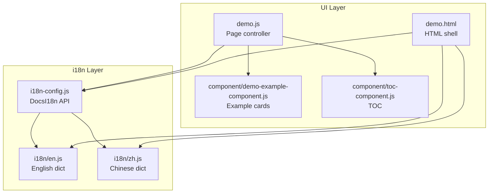
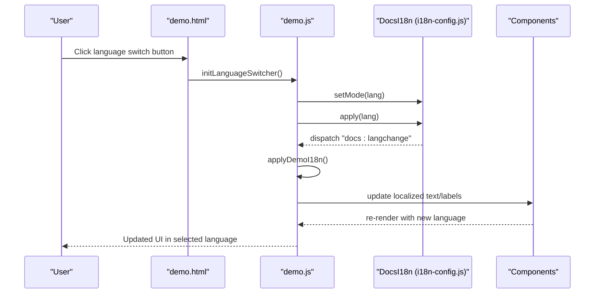
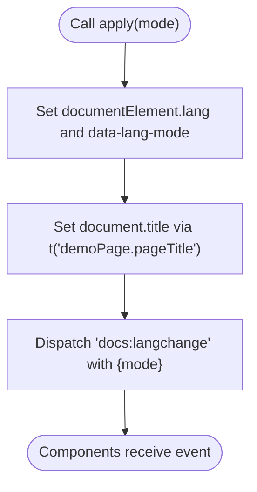
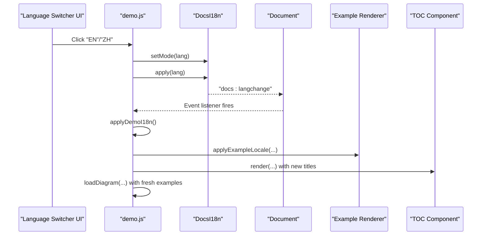
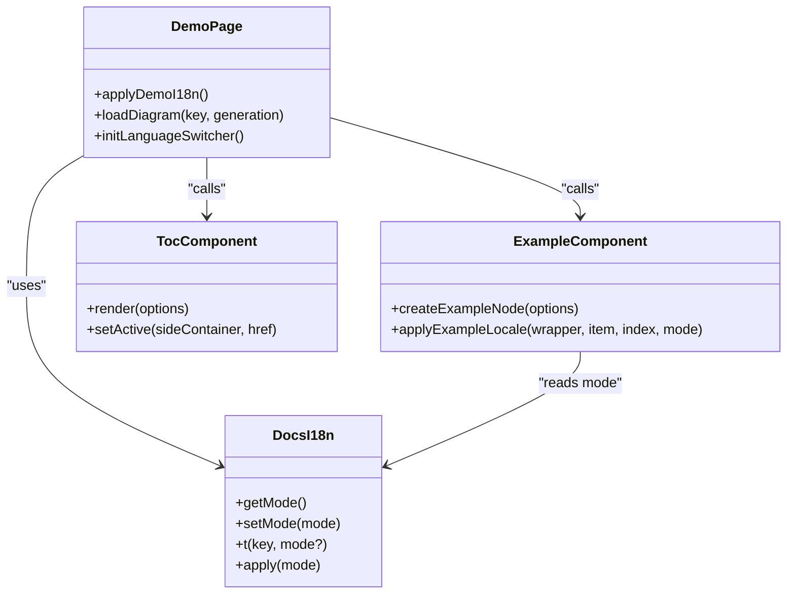
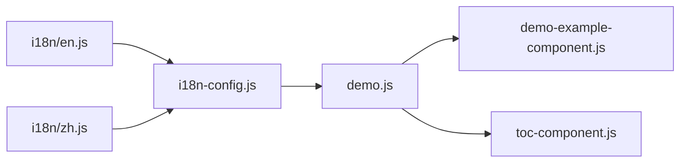

# Internationalization System

<cite>
**Referenced Files in This Document**
- [i18n-config.js](file://i18n-config.js)
- [i18n/en.js](file://i18n/en.js)
- [i18n/zh.js](file://i18n/zh.js)
- [demo.html](file://demo.html)
- [demo.js](file://demo.js)
- [component/demo-example-component.js](file://component/demo-example-component.js)
- [component/toc-component.js](file://component/toc-component.js)
- [README.md](file://README.md)
- [README_zh.md](file://README_zh.md)
- [serve.js](file://serve.js)
- [CLAUDE.md](file://CLAUDE.md)
</cite>

## Update Summary
**Changes Made**
- Updated feature descriptions to clarify that bilingual by default feature has been removed
- Enhanced documentation of current language toggle functionality in demo interface
- Added clarification about persistent language preference storage
- Updated examples to reflect current implementation details

## Table of Contents
1. [Introduction](#introduction)
2. [Project Structure](#project-structure)
3. [Core Components](#core-components)
4. [Architecture Overview](#architecture-overview)
5. [Detailed Component Analysis](#detailed-component-analysis)
6. [Dependency Analysis](#dependency-analysis)
7. [Performance Considerations](#performance-considerations)
8. [Troubleshooting Guide](#troubleshooting-guide)
9. [Conclusion](#conclusion)
10. [Appendices](#appendices)

## Introduction
This document explains Code-To-UML's internationalization (i18n) system. The system provides language switching capabilities through a persistent language preference mechanism using localStorage, event-driven language switching via the "docs:langchange" custom event, and comprehensive UI component integration. While the system previously supported a "bilingual by default" feature, this functionality has been removed in favor of explicit language selection. The current implementation focuses on flexible language switching with persistent preferences and dynamic content updates across all UI elements.

**Updated** Removed mention of "bilingual by default" feature as it has been dropped from the main feature lists, though the language toggle functionality remains available in the demo interface.

## Project Structure
The i18n system is organized around a small, focused runtime library and two language bundles:
- i18n-config.js: exposes DocsI18n with functions to get/set language mode, translate keys, and apply language changes.
- i18n/en.js and i18n/zh.js: provide the dictionary objects for English and Chinese translations.
- demo.html and demo.js: demonstrate how the system is initialized, language switches are handled, and components react to language changes.
- component/demo-example-component.js and component/toc-component.js: show how reusable components integrate with the i18n system.

**Diagram sources**
- [i18n-config.js:1-58](file://i18n-config.js#L1-L58)
- [i18n/en.js:1-53](file://i18n/en.js#L1-L53)
- [i18n/zh.js:1-53](file://i18n/zh.js#L1-L53)
- [demo.html:1-116](file://demo.html#L1-L116)
- [demo.js:1-819](file://demo.js#L1-L819)
- [component/demo-example-component.js:1-167](file://component/demo-example-component.js#L1-L167)
- [component/toc-component.js:1-84](file://component/toc-component.js#L1-L84)

**Section sources**
- [README.md:75-75](file://README.md#L75-L75)
- [README_zh.md:75-75](file://README_zh.md#L75-L75)

## Core Components
- DocsI18n (i18n-config.js): Provides:
  - getMode(): reads the language mode from localStorage or falls back to default.
  - setMode(mode): writes the language mode to localStorage.
  - t(key, mode?): resolves a translation by dot-separated key path, falling back to Chinese if the key is missing in the active language.
  - apply(mode): updates documentElement.lang, data-lang-mode, document.title, and dispatches the "docs:langchange" event.
- English and Chinese dictionaries (i18n/en.js, i18n/zh.js): Provide translation objects keyed by categories such as demoPage.pageTitle, demoPage.introText, demoPage.diagramLabels, and action labels.

Key behaviors:
- Persistent language preference via localStorage key "plantuml-docs-lang".
- Event-driven propagation via "docs:langchange" to notify components to refresh their content.
- Dynamic content switching by updating DOM attributes and text nodes.

**Section sources**
- [i18n-config.js:3-57](file://i18n-config.js#L3-L57)
- [i18n/en.js:3-52](file://i18n/en.js#L3-L52)
- [i18n/zh.js:3-52](file://i18n/zh.js#L3-L52)

## Architecture Overview
The i18n architecture is event-driven and component-aware. The page initializes DocsI18n, applies the current mode, and listens for "docs:langchange" to refresh UI content. Components subscribe to this event and re-render localized content accordingly.

**Diagram sources**
- [demo.html:83-112](file://demo.html#L83-L112)
- [demo.js:780-819](file://demo.js#L780-L819)
- [i18n-config.js:48-54](file://i18n-config.js#L48-L54)

## Detailed Component Analysis

### DocsI18n Runtime (i18n-config.js)
- Mode persistence: getMode() reads from localStorage; setMode() writes to localStorage.
- Translation resolution: t() resolves nested keys using dot notation; falls back to Chinese if the key is not present in the active language.
- Application: apply() sets documentElement.lang and data-lang-mode, updates document.title, and dispatches "docs:langchange".

**Diagram sources**
- [i18n-config.js:48-54](file://i18n-config.js#L48-L54)

**Section sources**
- [i18n-config.js:12-57](file://i18n-config.js#L12-L57)

### Language Switcher and Event Handling (demo.html, demo.js)
- demo.html loads i18n bundles and i18n-config.js, then initializes a language switcher that:
  - Reads the current mode via DocsI18n.getMode().
  - Resolves the official demo link language based on current mode.
  - Listens for "docs:langchange" to keep the external link synchronized.
- demo.js:
  - Initializes the language switcher UI and binds click events to change mode.
  - Calls DocsI18n.apply(mode) and re-renders the language buttons.
  - Subscribes to "docs:langchange" to refresh localized UI and reload examples.

**Diagram sources**
- [demo.html:90-112](file://demo.html#L90-L112)
- [demo.js:780-819](file://demo.js#L780-L819)
- [demo.js:131-144](file://demo.js#L131-L144)

**Section sources**
- [demo.html:83-112](file://demo.html#L83-L112)
- [demo.js:780-819](file://demo.js#L780-L819)
- [demo.js:131-144](file://demo.js#L131-L144)

### Translation Management Structure (i18n/en.js, i18n/zh.js)
- Both files define __DOCS_I18N_EN__ and __DOCS_I18N_ZH__ respectively, containing nested objects for:
  - demoPage.pageTitle, demoPage.introText, demoPage.tabsAria
  - demoPage.diagramLabels (keys for diagram types)
  - Action labels (copySource, copySvg, downloadSvg, rendering, renderFailed, etc.)
  - Language toggle labels (switchZh, switchEn)

These dictionaries are merged into DocsI18n.dictionaries during initialization.

**Section sources**
- [i18n/en.js:3-52](file://i18n/en.js#L3-L52)
- [i18n/zh.js:3-52](file://i18n/zh.js#L3-L52)

### Dynamic Content Switching in Components
- Demo page (demo.js):
  - applyDemoI18n() updates document title, headings, aria-labels, tab labels, and example action tooltips.
  - Uses t() to localize text and diagram labels via diagramLabel().
  - Calls applyExampleLocale() for each example card to localize titles, descriptions, and messages.
- Example component (component/demo-example-component.js):
  - applyExampleLocale() merges per-example titleI18n and descriptionI18n according to the active mode.
  - Renders markdown descriptions and sets localized messages.
- TOC component (component/toc-component.js):
  - Sets aria-labels for accessibility and renders links with localized labels.

**Diagram sources**
- [i18n-config.js:3-57](file://i18n-config.js#L3-L57)
- [demo.js:728-778](file://demo.js#L728-L778)
- [component/demo-example-component.js:48-80](file://component/demo-example-component.js#L48-L80)
- [component/toc-component.js:21-82](file://component/toc-component.js#L21-L82)

**Section sources**
- [demo.js:728-778](file://demo.js#L728-L778)
- [component/demo-example-component.js:48-80](file://component/demo-example-component.js#L48-L80)
- [component/toc-component.js:21-82](file://component/toc-component.js#L21-L82)

### Relationship Between Language Preferences and Cached Content
- Language preference is stored in localStorage under the key "plantuml-docs-lang". This ensures that the selected language persists across page reloads and sessions.
- The demo page loads examples via an API endpoint that accepts a lang query parameter. When the language changes, the page reloads examples with the new language, ensuring cached content remains consistent with the active language setting.

Best practice:
- Always pass the lang parameter to data-loading endpoints to ensure localized content is fetched.
- Clear or invalidate caches that depend on language when switching modes to avoid stale content.

**Section sources**
- [i18n-config.js:12-20](file://i18n-config.js#L12-L20)
- [demo.js:174-185](file://demo.js#L174-L185)

### Best Practices for Adding New Languages
- Create a new language bundle file under i18n/, e.g., i18n/fr.js, mirroring the structure of en.js and zh.js.
- Merge the new dictionary into DocsI18n.dictionaries in i18n-config.js.
- Update the language switcher UI in demo.html/demo.js to include the new language option.
- Ensure all components that render text listen for "docs:langchange" and refresh their content.
- Verify that example data files are named with the appropriate language suffix and that the API endpoint filters by lang.

Guidelines:
- Keep translation keys consistent across languages.
- Use dot notation for nested keys to simplify lookup.
- Provide fallbacks (e.g., Chinese) when a key is missing in the active language.

**Section sources**
- [i18n-config.js:7-10](file://i18n-config.js#L7-L10)
- [demo.html:780-819](file://demo.html#L780-L819)
- [demo.js:780-819](file://demo.js#L780-L819)

### Implementing Multilingual Support in Custom Components and Templates
- Components:
  - Read the current mode via DocsI18n.getMode().
  - Use DocsI18n.t() to resolve localized strings.
  - Listen for "docs:langchange" to refresh content.
- Templates:
  - Ensure templates set documentElement.lang and data-lang-mode appropriately.
  - Provide placeholders for localized strings and update them on "docs:langchange".

Example patterns:
- Apply localized text to headings, buttons, and aria-labels.
- Localize example titles and descriptions using per-example i18n fields.
- Update TOC and other navigational elements with localized labels.

**Section sources**
- [demo.js:728-778](file://demo.js#L728-L778)
- [component/demo-example-component.js:48-80](file://component/demo-example-component.js#L48-L80)
- [component/toc-component.js:21-82](file://component/toc-component.js#L21-L82)

## Dependency Analysis
The i18n system has minimal coupling and clear boundaries:
- i18n-config.js depends on the presence of language bundles in global scope (__DOCS_I18N_EN__, __DOCS_I18N_ZH__).
- demo.js depends on DocsI18n for mode management and on components for rendering localized content.
- Components depend on DocsI18n for mode and translation functions.

**Diagram sources**
- [i18n/en.js:3-52](file://i18n/en.js#L3-L52)
- [i18n/zh.js:3-52](file://i18n/zh.js#L3-L52)
- [i18n-config.js:7-10](file://i18n-config.js#L7-L10)
- [demo.js:1-34](file://demo.js#L1-L34)
- [component/demo-example-component.js:1-167](file://component/demo-example-component.js#L1-L167)
- [component/toc-component.js:1-84](file://component/toc-component.js#L1-L84)

**Section sources**
- [i18n-config.js:7-10](file://i18n-config.js#L7-L10)
- [demo.js:1-34](file://demo.js#L1-L34)

## Performance Considerations
- Translation lookups are O(n) in the depth of the dot path; keep translation keys shallow and reuse common prefixes.
- Avoid frequent DOM updates by batching localization changes during "docs:langchange" handlers.
- Cache the current mode and only re-fetch examples when the language actually changes.

## Troubleshooting Guide
Common issues and resolutions:
- Missing translation keys:
  - t() falls back to Chinese if a key is missing in the active language. Verify that all required keys exist in both dictionaries.
- Language switch not taking effect:
  - Ensure setMode() is called and apply() is invoked, and that components listen for "docs:langchange".
- Stale cached examples:
  - When switching languages, reload examples with the new lang parameter to avoid serving stale content.

**Section sources**
- [i18n-config.js:40-46](file://i18n-config.js#L40-L46)
- [demo.js:131-144](file://demo.js#L131-L144)
- [demo.js:174-185](file://demo.js#L174-L185)

## Conclusion
Code-To-UML's i18n system is a lightweight, event-driven solution that persists language preferences in localStorage and propagates changes across components via the "docs:langchange" event. The system cleanly separates translation data into language bundles and centralizes translation resolution in DocsI18n, enabling consistent, dynamic content switching across the UI. While the previous "bilingual by default" feature has been removed, the current implementation provides robust language toggle functionality in the demo interface and maintains flexibility for future enhancements. By following the best practices outlined here, developers can extend the system to support additional languages and maintain consistency across cached content and custom components.

## Appendices

### API Summary
- DocsI18n.getMode(): returns current language ("en" or "zh").
- DocsI18n.setMode(mode): saves language to localStorage.
- DocsI18n.t(key, mode?): resolves translation by dot path, with fallback to Chinese.
- DocsI18n.apply(mode): updates document lang/data attributes and dispatches "docs:langchange".

**Section sources**
- [i18n-config.js:12-57](file://i18n-config.js#L12-L57)

### Current Feature Status
**Updated** The system now operates with explicit language selection rather than automatic bilingual display:
- Language preference is stored in localStorage under "plantuml-docs-lang"
- Users must explicitly select their preferred language via the demo interface
- The system supports both English and Chinese with dynamic switching capability
- Previous "bilingual by default" functionality has been removed from main feature lists

**Section sources**
- [demo.js:783-819](file://demo.js#L783-L819)
- [CLAUDE.md:75-78](file://CLAUDE.md#L75-L78)