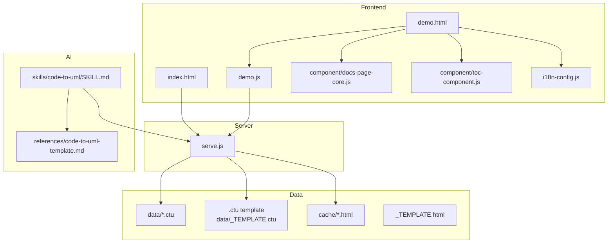
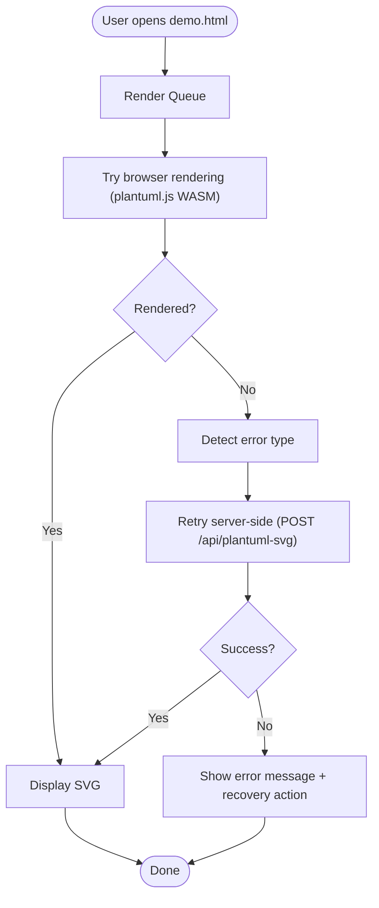
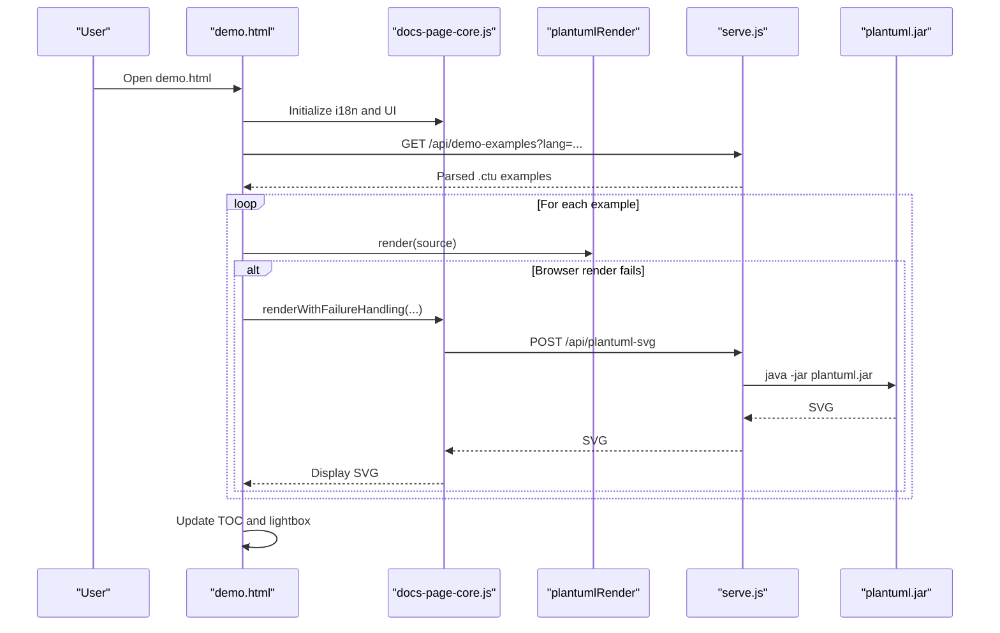
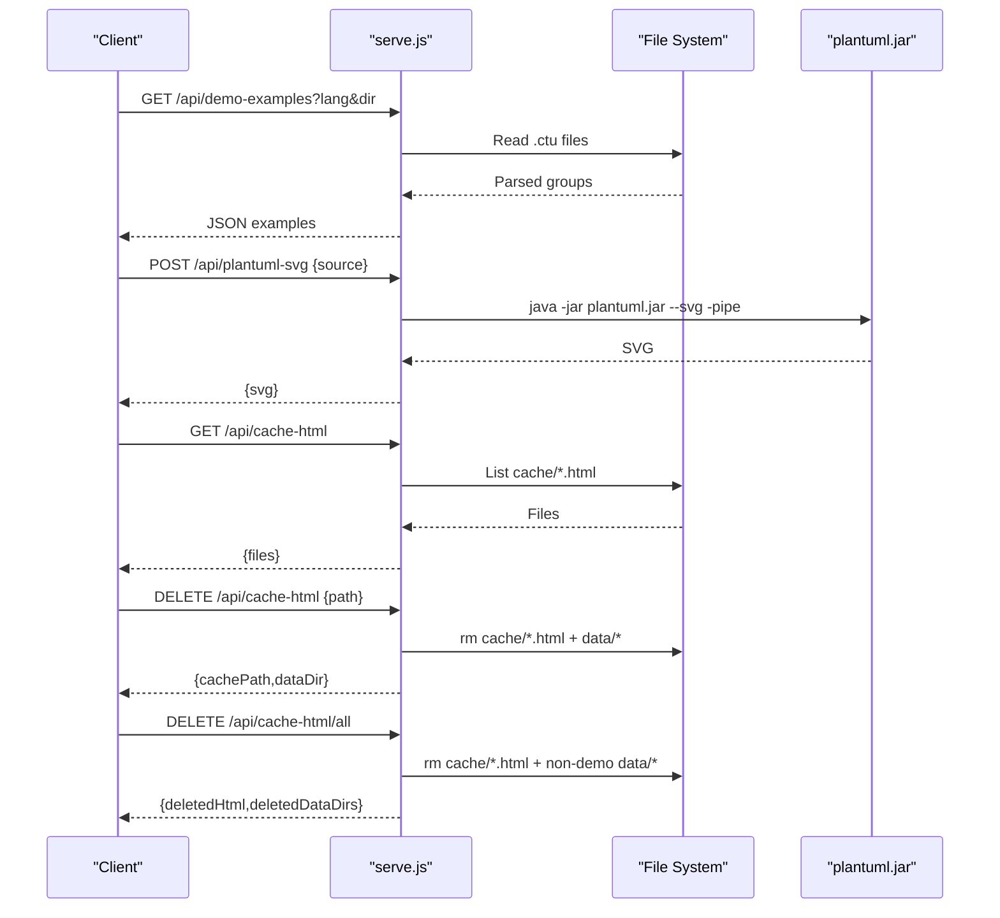
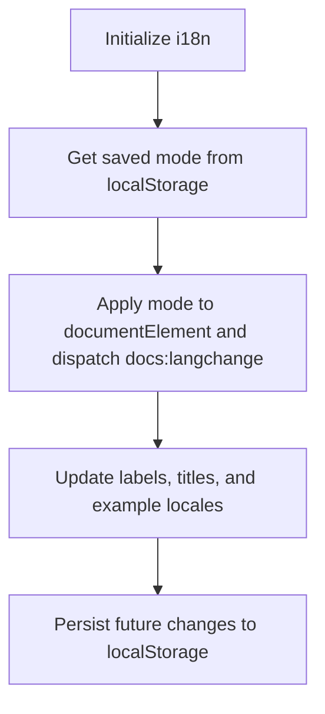
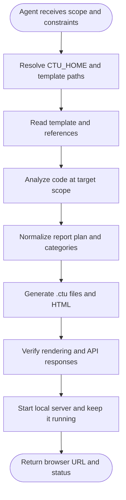
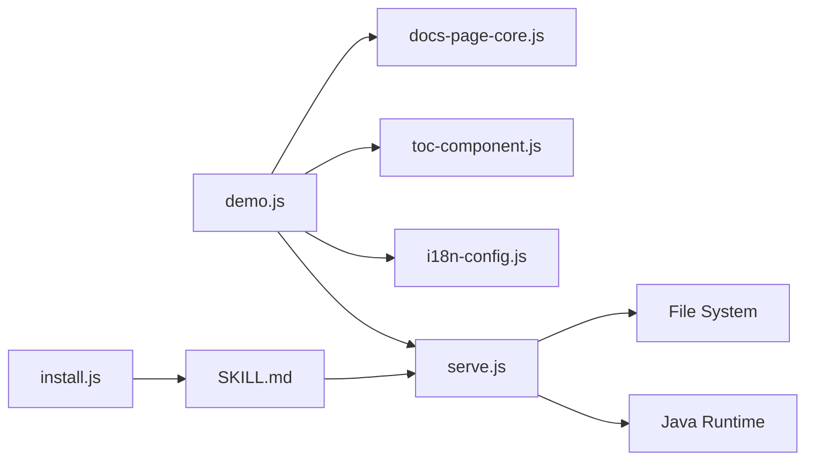

# Project Overview

<cite>
**Referenced Files in This Document**
- [README.md](file://README.md)
- [README_zh.md](file://README_zh.md)
- [index.html](file://index.html)
- [demo.html](file://demo.html)
- [demo.js](file://demo.js)
- [serve.js](file://serve.js)
- [i18n-config.js](file://i18n-config.js)
- [component/docs-page-core.js](file://component/docs-page-core.js)
- [component/toc-component.js](file://component/toc-component.js)
- [install.js](file://install.js)
- [skills/code-to-uml/SKILL.md](file://skills/code-to-uml/SKILL.md)
- [skills/code-to-uml/references/code-to-uml-template.md](file://skills/code-to-uml/references/code-to-uml-template.md)
- [AGENTS.md](file://AGENTS.md)
</cite>

## Table of Contents
1. [Introduction](#introduction)
2. [Project Structure](#project-structure)
3. [Core Components](#core-components)
4. [Architecture Overview](#architecture-overview)
5. [Detailed Component Analysis](#detailed-component-analysis)
6. [Dependency Analysis](#dependency-analysis)
7. [Performance Considerations](#performance-considerations)
8. [Troubleshooting Guide](#troubleshooting-guide)
9. [Conclusion](#conclusion)

## Introduction
Code-To-UML is a browser-first UML documentation generator that transforms structured code analysis reports into interactive HTML documents. It emphasizes zero-dependency, in-browser rendering with automatic fallback capabilities, enabling teams to generate bilingual UML reports without build tools or external SaaS dependencies. The project targets developers, technical writers, and AI agent users who need fast, reliable, and reusable documentation artifacts.

Key value propositions:
- Zero build tools and no framework overhead: pure HTML/JS served directly from a lightweight Node.js dev server.
- Browser-first rendering powered by PlantUML WASM with automatic fallback to server-side PlantUML rendering via Java.
- Bilingual by default with persistent language preferences and a reusable template system for generating analysis reports from structured `.ctu` data files.
- AI skill integration for autonomous report generation and validation.

Practical use cases:
- Generate interactive UML reports from AI-assisted code analysis.
- Explore 100+ bilingual PlantUML examples across 20+ diagram types in the built-in demo.
- Produce reusable HTML reports from structured `.ctu` data files for projects, modules, files, classes, or functions.

**Section sources**
- [README.md:45-54](file://README.md#L45-L54)
- [README_zh.md:45-54](file://README_zh.md#L45-L54)

## Project Structure
The project is organized around a static frontend, a small Node.js dev server, and a reusable template system for generating HTML reports from `.ctu` data files. The structure supports both interactive demos and automated report generation.

High-level layout:
- Frontend entrypoints: `demo.html` (interactive demo), `index.html` (cache index).
- Client runtime: `demo.js`, UI components under `component/`, internationalization under `i18n/`, and styling under `main.css`.
- Server: `serve.js` exposes APIs for demo examples and PlantUML rendering fallback.
- Data model: `.ctu` files under `data/` define diagram examples and metadata.
- Templates: `cache/_TEMPLATE.html` and `data/_TEMPLATE.ctu` enable reusable report generation.
- AI integration: `skills/code-to-uml/SKILL.md` and `skills/code-to-uml/references/code-to-uml-template.md` define agent workflows and template contracts.

**Diagram sources**
- [demo.html:1-116](file://demo.html#L1-L116)
- [index.html:1-404](file://index.html#L1-L404)
- [demo.js:1-816](file://demo.js#L1-L816)
- [serve.js:1-567](file://serve.js#L1-L567)
- [component/docs-page-core.js:1-464](file://component/docs-page-core.js#L1-L464)
- [component/toc-component.js:1-84](file://component/toc-component.js#L1-L84)
- [i18n-config.js:1-58](file://i18n-config.js#L1-L58)
- [skills/code-to-uml/SKILL.md:1-174](file://skills/code-to-uml/SKILL.md#L1-L174)
- [skills/code-to-uml/references/code-to-uml-template.md:1-95](file://skills/code-to-uml/references/code-to-uml-template.md#L1-L95)

**Section sources**
- [README.md:166-198](file://README.md#L166-L198)
- [README_zh.md:166-198](file://README_zh.md#L166-L198)

## Core Components
- Browser-first rendering pipeline: The demo page orchestrates diagram rendering via PlantUML WASM and falls back to server-side rendering when needed. It manages language switching, error detection, and a lightbox for interactive previews.
- Server fallback: The dev server exposes `/api/demo-examples` for loading `.ctu` data and `/api/plantuml-svg` for server-side PlantUML rendering via Java.
- Reusable template system: `.ctu` files define diagram examples with metadata; `_TEMPLATE.html` and `_TEMPLATE.ctu` standardize report generation and navigation.
- Internationalization: A lightweight i18n system persists language preferences and dispatches language change events to update UI and content.
- AI skill integration: A skill definition guides AI agents to generate reports that reuse the template system and verify rendering.

Key benefits:
- No build tools: Open `demo.html` directly or start the server for API endpoints.
- Bilingual support: Toggle languages and persist preferences.
- Reusable templates: Generate consistent HTML reports from structured `.ctu` data.

**Section sources**
- [demo.js:146-172](file://demo.js#L146-L172)
- [serve.js:454-561](file://serve.js#L454-L561)
- [i18n-config.js:3-57](file://i18n-config.js#L3-L57)
- [README.md:14-23](file://README.md#L14-L23)

## Architecture Overview
The system uses a two-tier rendering strategy to maximize reliability:
- Try browser rendering (PlantUML WASM) first.
- If rendering fails or is unsuitable, automatically retry server-side rendering via the dev server’s PlantUML endpoint.
- Error detection and classification enable targeted recovery actions.

**Diagram sources**
- [README.md:237-274](file://README.md#L237-L274)
- [demo.js:374-439](file://demo.js#L374-L439)
- [component/docs-page-core.js:404-433](file://component/docs-page-core.js#L404-L433)
- [serve.js:56-88](file://serve.js#L56-L88)

**Section sources**
- [README.md:237-274](file://README.md#L237-L274)
- [demo.js:374-439](file://demo.js#L374-L439)

## Detailed Component Analysis

### Browser Rendering Pipeline
The demo page coordinates rendering, error handling, and UI updates:
- Loads localized `.ctu` examples via `/api/demo-examples`.
- Renders diagrams using the PlantUML WASM renderer and displays them in a lightbox with zoom/pan and keyboard navigation.
- Applies scroll-synced side TOC and language-aware labels.
- Handles large diagrams by adding a safe scale and adjusting layout.

**Diagram sources**
- [demo.js:146-172](file://demo.js#L146-L172)
- [demo.js:374-439](file://demo.js#L374-L439)
- [component/docs-page-core.js:404-433](file://component/docs-page-core.js#L404-L433)
- [serve.js:459-496](file://serve.js#L459-L496)

**Section sources**
- [demo.js:146-172](file://demo.js#L146-L172)
- [demo.js:374-439](file://demo.js#L374-L439)
- [component/docs-page-core.js:404-433](file://component/docs-page-core.js#L404-L433)

### Server Fallback and API Endpoints
The dev server provides:
- `/api/demo-examples`: Loads and parses `.ctu` files from the data directory, returning localized examples grouped by diagram type.
- `/api/plantuml-svg`: Accepts PlantUML source text and renders SVG via `plantuml.jar` (requires Java on PATH).
- `/api/cache-html`: Lists generated HTML files in `cache/` for the index page.
- `/api/cache-html` (DELETE): Deletes a specific HTML file and its associated data directory.
- `/api/cache-html/all` (DELETE): Clears generated HTML and non-demo data directories.

**Diagram sources**
- [serve.js:459-561](file://serve.js#L459-L561)

**Section sources**
- [serve.js:459-561](file://serve.js#L459-L561)

### Internationalization and UI
The i18n system:
- Persists language preference in `localStorage`.
- Dispatches a `docs:langchange` event to update UI and content dynamically.
- Provides translation keys for demo page labels and example actions.

**Diagram sources**
- [i18n-config.js:3-57](file://i18n-config.js#L3-L57)
- [demo.js:131-144](file://demo.js#L131-L144)

**Section sources**
- [i18n-config.js:3-57](file://i18n-config.js#L3-L57)
- [demo.js:131-144](file://demo.js#L131-L144)

### AI Agent Integration
The skill definition enables AI agents to:
- Resolve the project root from `CTU_HOME` or current working directory.
- Reuse the template system (`_TEMPLATE.html` and `_TEMPLATE.ctu`) and preserve required scripts and navigation.
- Generate `.ctu` files grouped by categories and produce HTML reports under `cache/`.
- Start the local server and verify the report page and data API.

**Diagram sources**
- [skills/code-to-uml/SKILL.md:30-94](file://skills/code-to-uml/SKILL.md#L30-L94)
- [skills/code-to-uml/references/code-to-uml-template.md:1-95](file://skills/code-to-uml/references/code-to-uml-template.md#L1-L95)
- [install.js:1-228](file://install.js#L1-L228)

**Section sources**
- [skills/code-to-uml/SKILL.md:30-94](file://skills/code-to-uml/SKILL.md#L30-L94)
- [skills/code-to-uml/references/code-to-uml-template.md:1-95](file://skills/code-to-uml/references/code-to-uml-template.md#L1-L95)
- [install.js:1-228](file://install.js#L1-L228)

## Dependency Analysis
- Frontend depends on:
  - `demo.js` for orchestration and rendering.
  - `docs-page-core.js` for rendering helpers, error detection, and fallback logic.
  - `toc-component.js` for side table-of-contents rendering and active state management.
  - `i18n-config.js` for language persistence and UI updates.
- Server depends on:
  - Node.js APIs for file system, HTTP, and child process spawning.
  - Java runtime for PlantUML JAR fallback.
- AI integration depends on:
  - Environment variable `CTU_HOME` and installed skill directories for various agents.

**Diagram sources**
- [demo.js:1-816](file://demo.js#L1-L816)
- [component/docs-page-core.js:1-464](file://component/docs-page-core.js#L1-L464)
- [component/toc-component.js:1-84](file://component/toc-component.js#L1-L84)
- [i18n-config.js:1-58](file://i18n-config.js#L1-L58)
- [serve.js:1-567](file://serve.js#L1-L567)
- [install.js:1-228](file://install.js#L1-L228)
- [skills/code-to-uml/SKILL.md:1-174](file://skills/code-to-uml/SKILL.md#L1-L174)

**Section sources**
- [demo.js:1-816](file://demo.js#L1-L816)
- [serve.js:1-567](file://serve.js#L1-L567)
- [install.js:1-228](file://install.js#L1-L228)

## Performance Considerations
- Browser-first rendering minimizes server round-trips for typical diagrams, improving perceived responsiveness.
- Automatic fallback ensures reliability for edge cases (large diagrams, certain stdlib imports) without compromising UX.
- Lightweight server and minimal dependencies reduce startup and memory overhead.
- Large diagrams are handled by adding a safe scale and adjusting layout to improve readability.

[No sources needed since this section provides general guidance]

## Troubleshooting Guide
Common issues and resolutions:
- Cannot call server fallback from file:// pages: Start the local server via `./serve.sh` and open `http://localhost:5401`.
- Jar fallback endpoint not found: Ensure the server is running and the endpoint is available.
- PlantUML jar not found or not executable: Install Java and ensure `plantuml.jar` is accessible.
- Language switching not applied: Confirm `localStorage` key and `docs:langchange` event propagation.
- Cache index not loading: Access `index.html` through the local server to enable API endpoints.

**Section sources**
- [component/docs-page-core.js:404-433](file://component/docs-page-core.js#L404-L433)
- [demo.js:113-115](file://demo.js#L113-L115)
- [i18n-config.js:3-57](file://i18n-config.js#L3-L57)
- [index.html:262-399](file://index.html#L262-L399)

## Conclusion
Code-To-UML delivers a streamlined, browser-first approach to UML documentation generation with zero build tools and robust fallback capabilities. Its reusable template system, bilingual support, and AI skill integration make it suitable for developers, technical writers, and AI agents who need fast, reliable, and consistent HTML reports from code analysis.

[No sources needed since this section summarizes without analyzing specific files]