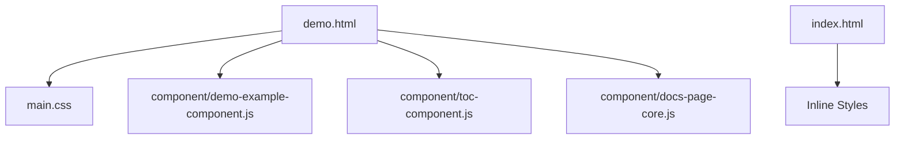
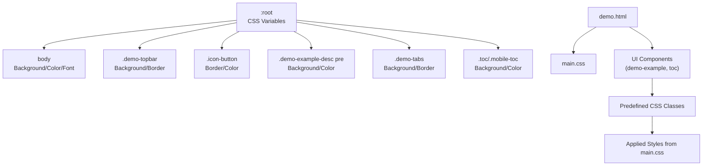
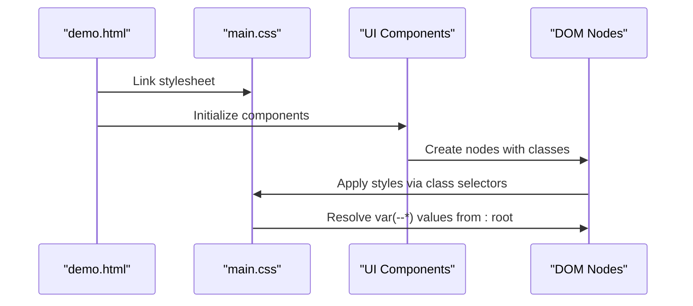
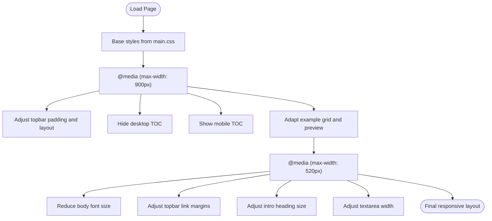
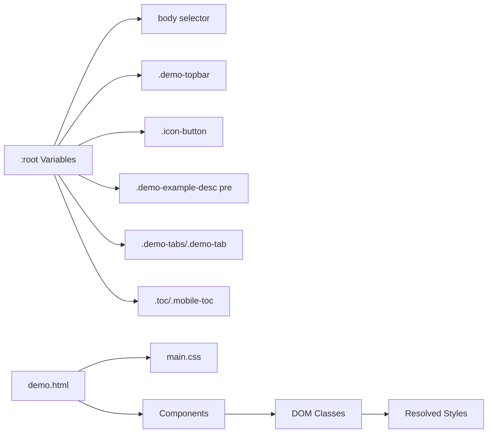

# Styling and Theming

<cite>
**Referenced Files in This Document**
- [main.css](file://main.css)
- [demo.html](file://demo.html)
- [index.html](file://index.html)
- [demo-example-component.js](file://component/demo-example-component.js)
- [toc-component.js](file://component/toc-component.js)
- [docs-page-core.js](file://component/docs-page-core.js)
- [README.md](file://README.md)
- [markdown-code-block-css.test.js](file://test/markdown-code-block-css.test.js)
</cite>

## Table of Contents
1. [Introduction](#introduction)
2. [Project Structure](#project-structure)
3. [Core Components](#core-components)
4. [Architecture Overview](#architecture-overview)
5. [Detailed Component Analysis](#detailed-component-analysis)
6. [Dependency Analysis](#dependency-analysis)
7. [Performance Considerations](#performance-considerations)
8. [Troubleshooting Guide](#troubleshooting-guide)
9. [Conclusion](#conclusion)

## Introduction
This document explains Code-To-UML’s styling and theming system. It focuses on the CSS custom property system that powers theming, how styles cascade through the component hierarchy, the responsive design and mobile-first approach, and practical guidelines for creating custom themes. It also clarifies the relationship between global styles in main.css and component-specific styling, and provides examples for common customization scenarios such as brand color changes, typography adjustments, and layout modifications.

## Project Structure
The styling system centers around a single global stylesheet and a small set of reusable UI components. The demo page links to the global stylesheet and composes UI components that rely on shared CSS classes and CSS variables.

**Diagram sources**
- [demo.html:1-116](file://demo.html#L1-L116)
- [main.css:1-804](file://main.css#L1-L804)
- [demo-example-component.js:1-159](file://component/demo-example-component.js#L1-L159)
- [toc-component.js:1-84](file://component/toc-component.js#L1-L84)
- [docs-page-core.js:1-464](file://component/docs-page-core.js#L1-L464)
- [index.html:1-404](file://index.html#L1-L404)

**Section sources**
- [demo.html:1-116](file://demo.html#L1-L116)
- [main.css:1-804](file://main.css#L1-L804)
- [README.md:166-198](file://README.md#L166-L198)

## Core Components
- Global CSS custom properties define the theme surface. They are declared in :root and consumed throughout the stylesheet using var(--name).
- The demo page applies global styles via main.css and composes UI components that render DOM nodes with predefined CSS classes.
- Component scripts attach DOM nodes with specific classes (for example, example cards, action buttons, and table-of-contents links) and rely on global styles for appearance.

Key facts:
- CSS variables are defined in :root and reused across selectors for colors, backgrounds, borders, and accents.
- Component scripts create nodes with classes such as example, example-grid, example-source, example-preview, icon-button, demo-topbar, demo-tabs, toc, and mobile-toc.
- Global styles in main.css include media queries for responsive behavior.

**Section sources**
- [main.css:1-16](file://main.css#L1-L16)
- [main.css:26-31](file://main.css#L26-L31)
- [demo-example-component.js:94-155](file://component/demo-example-component.js#L94-L155)
- [toc-component.js:21-82](file://component/toc-component.js#L21-L82)
- [demo.html:12-78](file://demo.html#L12-L78)

## Architecture Overview
The styling architecture follows a simple, predictable pattern:
- Global theme variables live in :root.
- Global styles in main.css apply baseline typography, layout, and component-level styles.
- Component scripts generate DOM nodes with specific classes that align with selectors in main.css.
- Media queries in main.css adapt the layout for smaller screens.

**Diagram sources**
- [main.css:1-16](file://main.css#L1-L16)
- [main.css:26-31](file://main.css#L26-L31)
- [main.css:33-44](file://main.css#L33-L44)
- [main.css:311-351](file://main.css#L311-L351)
- [main.css:430-470](file://main.css#L430-L470)
- [main.css:754-798](file://main.css#L754-L798)
- [main.css:586-663](file://main.css#L586-L663)
- [demo.html:1-116](file://demo.html#L1-L116)
- [demo-example-component.js:94-155](file://component/demo-example-component.js#L94-L155)
- [toc-component.js:21-82](file://component/toc-component.js#L21-L82)

## Detailed Component Analysis

### CSS Custom Property System and Theming
- Theme variables are defined in :root and include color-scheme, background (--bg), foreground (--fg), muted text (--muted), borders (--line, --soft-line), surfaces (--surface, --surface-strong), code background/foreground (--code-bg, --code-fg), accent colors (--accent, --accent-soft), and error (--error).
- These variables are consumed across selectors to unify color application and enable easy theme swaps.

Practical implications:
- Changing a single variable updates related colors consistently across components.
- Using color-mix helps derive contextual shades from base variables.

**Section sources**
- [main.css:1-16](file://main.css#L1-L16)
- [main.css:27-31](file://main.css#L27-L31)
- [main.css:41-74](file://main.css#L41-L74)
- [main.css:208-214](file://main.css#L208-L214)
- [main.css:282-305](file://main.css#L282-L305)

### Component Styling Architecture and CSS Variable Cascade
- The demo page links to main.css, ensuring global variables and styles are available.
- Components create DOM nodes with classes that match selectors in main.css:
  - Example cards: example, example-grid, example-source, example-preview, example-actions, example-message.
  - Action buttons: icon-button with hover/focus states.
  - Navigation: demo-topbar, demo-tabs, demo-tab, demo-panel.
  - Table of contents: toc and mobile-toc.
- CSS variables cascade from :root to all descendants, so component classes inherit and apply theme colors uniformly.

**Diagram sources**
- [demo.html:9-9](file://demo.html#L9-L9)
- [main.css:1-16](file://main.css#L1-L16)
- [demo-example-component.js:94-155](file://component/demo-example-component.js#L94-L155)
- [toc-component.js:21-82](file://component/toc-component.js#L21-L82)

**Section sources**
- [demo.html:9-9](file://demo.html#L9-L9)
- [demo-example-component.js:94-155](file://component/demo-example-component.js#L94-L155)
- [toc-component.js:21-82](file://component/toc-component.js#L21-L82)
- [main.css:33-44](file://main.css#L33-L44)
- [main.css:311-351](file://main.css#L311-L351)
- [main.css:430-470](file://main.css#L430-L470)
- [main.css:586-663](file://main.css#L586-L663)

### Responsive Design and Mobile-First Approach
- The stylesheet uses media queries targeting widths below thresholds to progressively adjust layout and spacing.
- Examples include reducing topbar padding, hiding the desktop TOC and showing a mobile TOC, adjusting font sizes, and adapting example grids and preview containers for smaller screens.

**Diagram sources**
- [main.css:664-729](file://main.css#L664-L729)
- [main.css:731-752](file://main.css#L731-L752)

**Section sources**
- [main.css:664-729](file://main.css#L664-L729)
- [main.css:731-752](file://main.css#L731-L752)

### Relationship Between Global Styles and Component-Specific Styling
- Global styles in main.css define baseline layouts, typography, and component-level styles.
- Component scripts create nodes with classes that align with selectors in main.css, ensuring consistent styling without duplicating CSS.
- Inline styles in index.html demonstrate an alternative approach for pages that do not link main.css.

**Section sources**
- [main.css:1-804](file://main.css#L1-L804)
- [index.html:9-235](file://index.html#L9-L235)
- [demo-example-component.js:94-155](file://component/demo-example-component.js#L94-L155)
- [toc-component.js:21-82](file://component/toc-component.js#L21-L82)

### Guidelines for Creating Custom Themes
To create a custom theme:
- Override :root variables in a separate stylesheet or via inlined styles to change colors, surfaces, and accents.
- Keep the existing class names on DOM nodes to leverage existing selectors in main.css.
- Use color-mix expressions to derive contextual shades consistently.
- Validate responsive behavior by testing breakpoints and adjusting variables as needed.

Common customization scenarios:
- Brand color changes: update --accent and --accent-soft to reflect your brand identity. Related hover and active states will cascade automatically.
- Typography adjustments: modify body font family and size in the body selector; ensure sufficient line-height for readability.
- Layout modifications: adjust page shell paddings, grid gaps, and component container widths to fit your content density.

**Section sources**
- [main.css:1-16](file://main.css#L1-L16)
- [main.css:26-31](file://main.css#L26-L31)
- [main.css:33-44](file://main.css#L33-L44)
- [main.css:754-798](file://main.css#L754-L798)

### Browser Compatibility and Performance Implications
- CSS custom properties are widely supported in modern browsers. For older environments, consider providing fallback declarations or a build step that inlines values.
- color-mix is broadly supported but may not be available in very old browsers; ensure acceptable fallbacks for critical UI elements.
- Media queries are well supported; test across devices to confirm breakpoint behavior.
- Performance: CSS variables incur minimal runtime cost. Prefer theming via variables rather than JavaScript manipulation to avoid layout thrashing. Keep selectors efficient and avoid overly broad rules to minimize reflows.

**Section sources**
- [README.md:66-77](file://README.md#L66-L77)
- [main.css:1-16](file://main.css#L1-L16)
- [main.css:41-74](file://main.css#L41-L74)

## Dependency Analysis
The styling system exhibits low coupling and high cohesion:
- Global theme variables are centralized in :root.
- Component classes are decoupled from specific color values, relying on variables.
- Media queries depend on viewport width and do not introduce cross-component coupling.

**Diagram sources**
- [main.css:1-16](file://main.css#L1-L16)
- [main.css:26-31](file://main.css#L26-L31)
- [main.css:33-44](file://main.css#L33-L44)
- [main.css:311-351](file://main.css#L311-L351)
- [main.css:430-470](file://main.css#L430-L470)
- [main.css:586-663](file://main.css#L586-L663)
- [demo.html:1-116](file://demo.html#L1-L116)
- [demo-example-component.js:94-155](file://component/demo-example-component.js#L94-L155)
- [toc-component.js:21-82](file://component/toc-component.js#L21-L82)

**Section sources**
- [main.css:1-804](file://main.css#L1-L804)
- [demo.html:1-116](file://demo.html#L1-L116)
- [demo-example-component.js:94-155](file://component/demo-example-component.js#L94-L155)
- [toc-component.js:21-82](file://component/toc-component.js#L21-L82)

## Performance Considerations
- Prefer CSS variables for theming to reduce duplication and improve maintainability.
- Avoid excessive repaints by minimizing forced synchronous layout reads in JavaScript and applying class toggles instead of inline style mutations.
- Keep media queries focused and avoid deep nesting that increases specificity and complicates maintenance.

[No sources needed since this section provides general guidance]

## Troubleshooting Guide
- If colors do not update as expected, verify that your overrides are applied after main.css or with higher specificity.
- If code blocks lose visibility, ensure that pre and code selectors inside example descriptions still reference var(--surface) and var(--fg).
- If responsive breakpoints behave unexpectedly, inspect media queries and confirm device viewport settings.

Validation references:
- Tests confirm that code blocks preserve whitespace and use visible background/text colors derived from CSS variables.

**Section sources**
- [markdown-code-block-css.test.js:21-35](file://test/markdown-code-block-css.test.js#L21-L35)
- [main.css:270-305](file://main.css#L270-L305)

## Conclusion
Code-To-UML’s styling system is intentionally simple and powerful: a single global stylesheet with CSS custom properties provides a cohesive theme that cascades through the component hierarchy. The mobile-first responsive design ensures usability across devices, while component classes remain decoupled from hard-coded colors. By overriding variables and maintaining class names, teams can quickly implement custom themes and tailor typography and layout to their needs.