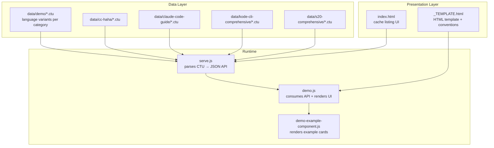
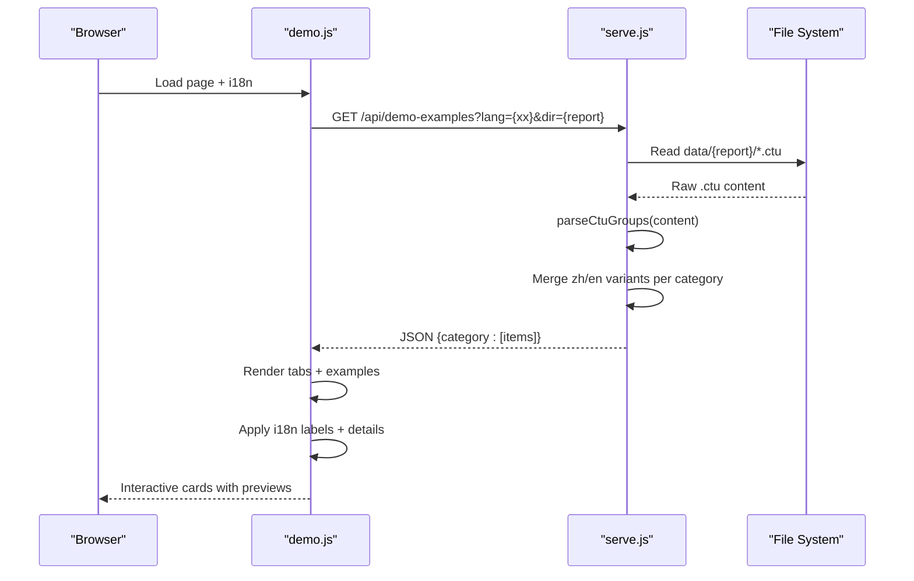
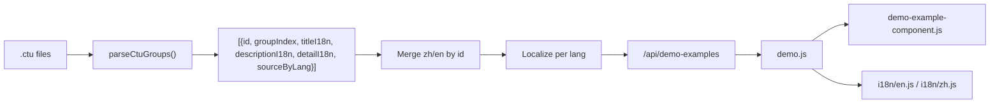

# CTU File Format

<cite>
**Referenced Files in This Document**
- [_TEMPLATE.ctu](file://data/_TEMPLATE.ctu)
- [activity--1_en.ctu](file://data/demo/activity--1_en.ctu)
- [activity--1_zh.ctu](file://data/demo/activity--1_zh.ctu)
- [class--1_en.ctu](file://data/demo/class--1_en.ctu)
- [use-case--1_en.ctu](file://data/demo/use-case--1_en.ctu)
- [sequence--1_en.ctu](file://data/demo/sequence--1_en.ctu)
- [_TEMPLATE.html](file://cache/_TEMPLATE.html)
- [index.html](file://index.html)
- [install-ctu-home.js](file://install-ctu-home.js)
- [serve.js](file://serve.js)
- [demo.js](file://demo.js)
- [demo-example-component.js](file://component/demo-example-component.js)
- [en.js](file://i18n/en.js)
- [zh.js](file://i18n/zh.js)
</cite>

## Table of Contents
1. [Introduction](#introduction)
2. [Project Structure](#project-structure)
3. [Core Components](#core-components)
4. [Architecture Overview](#architecture-overview)
5. [Detailed Component Analysis](#detailed-component-analysis)
6. [Dependency Analysis](#dependency-analysis)
7. [Performance Considerations](#performance-considerations)
8. [Troubleshooting Guide](#troubleshooting-guide)
9. [Conclusion](#conclusion)
10. [Appendices](#appendices)

## Introduction
This document specifies the CTU (Code-To-UML Template) file format used to define structured, localized diagram examples for the Code-To-UML system. It explains the complete syntax for headers, example blocks, PlantUML source formatting, and localization support. It also documents how CTU files are organized hierarchically, how the server parses them into a JSON API consumed by the frontend, and how they integrate with HTML presentation templates. Practical examples, best practices, and maintenance guidelines are included to ensure consistency across template files.

## Project Structure
CTU files live under the data/ directory, grouped by report categories and language variants. Each report directory corresponds to a dedicated HTML page that reads from the data/ tree via the server’s API.

- Data organization
  - data/{report-directory-name}/ stores CTU files for a report page.
  - File naming convention: {category}--{id}_{lang}.ctu (e.g., sequence--1_en.ctu).
  - Category must match the data-diagram attribute of the corresponding tab.
- Presentation templates
  - cache/_TEMPLATE.html defines the HTML skeleton and data conventions for report pages.
  - index.html provides a cache index page that lists generated HTML files and supports deletion.



**Diagram sources**
- [serve.js:304-395](file://serve.js#L304-L395)
- [demo.js:174-185](file://demo.js#L174-L185)
- [_TEMPLATE.html:29-38](file://cache/_TEMPLATE.html#L29-L38)
- [index.html:247-260](file://index.html#L247-L260)

**Section sources**
- [serve.js:304-395](file://serve.js#L304-L395)
- [_TEMPLATE.html:29-38](file://cache/_TEMPLATE.html#L29-L38)
- [index.html:247-260](file://index.html#L247-L260)

## Core Components
- Header section
  - Title: A single-line header specifying the section title.
  - Describe: A single-line header specifying a group overview; supports multi-line until the first example separator.
- Example block
  - [Example]: Optional example title; write "None" to hide.
  - [Description]: Short explanation; supports Markdown; write "None" or leave empty to skip.
  - [UML]: Required PlantUML source code block delimited by @startuml and @enduml.
  - [Detail]: Optional detailed walkthrough; supports Markdown; write "None" or leave empty to skip.
- Block separation
  - Use a minimum of 60 hyphens to separate multiple example blocks within a file.
- Localization
  - Language suffix: _en or _zh in the filename.
  - The server merges zh and en variants into a single item set per category, selecting the appropriate language at runtime.

**Section sources**
- [_TEMPLATE.ctu:1-46](file://data/_TEMPLATE.ctu#L1-L46)
- [activity--1_en.ctu:1-18](file://data/demo/activity--1_en.ctu#L1-L18)
- [activity--1_zh.ctu:1-18](file://data/demo/activity--1_zh.ctu#L1-L18)
- [class--1_en.ctu:1-34](file://data/demo/class--1_en.ctu#L1-L34)
- [use-case--1_en.ctu:1-21](file://data/demo/use-case--1_en.ctu#L1-L21)
- [sequence--1_en.ctu:1-23](file://data/demo/sequence--1_en.ctu#L1-L23)
- [serve.js:90-170](file://serve.js#L90-L170)

## Architecture Overview
The CTU parsing pipeline transforms .ctu files into a JSON API consumed by the frontend. The frontend renders example cards with editable PlantUML source and live SVG previews, with localization applied per user-selected language.



**Diagram sources**
- [demo.js:174-185](file://demo.js#L174-L185)
- [serve.js:304-395](file://serve.js#L304-L395)
- [serve.js:90-170](file://serve.js#L90-L170)

## Detailed Component Analysis

### CTU Syntax and Semantics
- Header
  - Title: single line; used as the section title for grouping examples.
  - Describe: single line; supports multi-line until the first example separator; used as a group overview.
- Example block
  - [Example]: optional; if omitted or "None", the example title is hidden.
  - [Description]: optional; supports Markdown; if omitted or "None", the description is hidden.
  - [UML]: required; PlantUML code between @startuml and @enduml; must be present to include an example.
  - [Detail]: optional; supports Markdown; if omitted or "None", hidden.
- Separators
  - Use at least 60 hyphens to separate blocks; the parser also splits implicitly when a new [Example] appears after an existing block already has UML content.
- Localization
  - Two files per example: {category}--{id}_en.ctu and {category}--{id}_zh.ctu.
  - The server merges both into a single item, selecting the language at runtime.

```mermaid
flowchart TD
Start(["Read .ctu content"]) --> ParseHeader["Parse Title and Describe"]
ParseHeader --> Loop{"Next line"}
Loop --> |Header lines| CollectHeader["Collect header lines"]
CollectHeader --> Loop
Loop --> |Separator "---" (≥60)| FlushBlock["Flush previous block"]
Loop --> |"[Example]"| EnterSection["Enter Example section"]
Loop --> |"[Description]"| EnterSection
Loop --> |"[Detail]"| EnterSection
Loop --> |"[UML]"| EnterSection
EnterSection --> ReadSection["Accumulate section lines"]
ReadSection --> Loop
FlushBlock --> Loop
Loop --> |EOF| FinalFlush["Flush last block"]
FinalFlush --> MergeLang["Merge zh/en variants by id"]
MergeLang --> Localize["Localize per client language"]
Localize --> Done(["JSON ready"])
```

**Diagram sources**
- [serve.js:90-170](file://serve.js#L90-L170)

**Section sources**
- [_TEMPLATE.ctu:1-46](file://data/_TEMPLATE.ctu#L1-L46)
- [serve.js:90-170](file://serve.js#L90-L170)

### Parsing Mechanism
The server-side parser:
- Reads each .ctu file in the requested data directory.
- Splits content into blocks separated by long hyphen lines or implicit transitions.
- Normalizes "None" values to empty strings.
- Builds arrays of blocks with fields: title, description, detail, source, plus section-level title/description.
- Merges zh and en variants into items keyed by diagram category and numeric id.
- Applies localization at runtime based on the lang query parameter.

Key implementation points:
- parseCtuGroups(content): tokenizes headers, sections, and separators; normalizes values; attaches section-level metadata.
- loadDemoExamplesFromData(lang, dataSubdir): enumerates .ctu files, validates naming, parses, merges, filters, and localizes.

**Section sources**
- [serve.js:90-170](file://serve.js#L90-L170)
- [serve.js:304-395](file://serve.js#L304-L395)

### Frontend Rendering and Localization
The frontend:
- Fetches JSON from /api/demo-examples with lang and dir parameters.
- Renders category tabs and example cards; applies i18n labels and localized details.
- Provides interactive actions: copy source, copy SVG, download SVG.
- Supports a lightbox for SVG previews with zoom and pan.

Localization:
- i18n/en.js and i18n/zh.js provide labels for UI strings and diagram category labels.
- The demo page selects language via DocsI18n and updates labels and example details accordingly.

**Section sources**
- [demo.js:174-185](file://demo.js#L174-L185)
- [demo.js:728-778](file://demo.js#L728-L778)
- [demo-example-component.js:48-80](file://component/demo-example-component.js#L48-L80)
- [en.js:1-53](file://i18n/en.js#L1-L53)
- [zh.js:1-53](file://i18n/zh.js#L1-L53)

### HTML Template Conventions
The HTML template defines:
- Data conventions for .ctu files (storage path, naming, structure).
- Architecture overview showing server endpoints and frontend components.
- Configuration sections for tabs and content panels.
- Editable and configurable regions with clear markers for maintainability.

**Section sources**
- [_TEMPLATE.html:29-91](file://cache/_TEMPLATE.html#L29-L91)

### Cache Index and Management
The cache index page:
- Lists generated HTML files under cache/.
- Supports deleting individual HTML files and associated data directories.
- Supports clearing all generated HTML and non-demo data directories.

**Section sources**
- [index.html:247-260](file://index.html#L247-L260)
- [index.html:285-399](file://index.html#L285-L399)
- [serve.js:217-302](file://serve.js#L217-L302)

### Tool Integration and Environment Setup
The install-ctu-home.js script:
- Installs the bundled skill directory into tool-specific locations.
- Sets the CTU_HOME environment variable for downstream tooling.
- Supports Windows and Unix shells with appropriate quoting and profiles.

**Section sources**
- [install-ctu-home.js:150-220](file://install-ctu-home.js#L150-L220)

## Dependency Analysis
CTU files depend on consistent naming and structure to be parsed and rendered correctly. The server depends on:
- Correct file naming: {category}--{id}_{lang}.ctu.
- Proper section delimiters and PlantUML boundaries.
- Valid UTF-8 content and reasonable request sizes.

The frontend depends on:
- Consistent JSON shape from the server.
- Availability of i18n resources and markdown renderer.
- Correctly configured tabs and data-diagram attributes.



**Diagram sources**
- [serve.js:90-170](file://serve.js#L90-L170)
- [serve.js:304-395](file://serve.js#L304-L395)
- [demo.js:174-185](file://demo.js#L174-L185)
- [demo-example-component.js:82-155](file://component/demo-example-component.js#L82-L155)

**Section sources**
- [serve.js:90-170](file://serve.js#L90-L170)
- [serve.js:304-395](file://serve.js#L304-L395)
- [demo.js:174-185](file://demo.js#L174-L185)
- [demo-example-component.js:82-155](file://component/demo-example-component.js#L82-L155)

## Performance Considerations
- Large diagrams
  - The frontend detects oversized diagrams and attempts a browser-safe scaling fallback; if rendering still fails, it falls back to the server-side plantuml.jar endpoint.
- Rendering throttling
  - Source edits are debounced before re-rendering to avoid excessive computation.
- Request size limits
  - The server enforces a maximum request body size for safety.

**Section sources**
- [demo.js:374-439](file://demo.js#L374-L439)
- [serve.js:37-54](file://serve.js#L37-L54)
- [serve.js:472-496](file://serve.js#L472-L496)

## Troubleshooting Guide
Common issues and resolutions:
- No examples appear
  - Verify the data directory exists and contains .ctu files with correct naming and PlantUML blocks.
  - Confirm the HTML template’s tabs match the category prefixes in filenames.
- Wrong language shown
  - Ensure both _en and _zh variants exist for the same {category}--{id}.
  - Check the lang query parameter and i18n resource availability.
- Rendering failures
  - For very large diagrams, the frontend attempts a scaled render; if it fails, the server-side plantuml.jar endpoint can be used as a fallback.
- Cache index errors
  - Use the cache index UI to delete problematic HTML files and their matching data directories, or clear all generated content.

**Section sources**
- [demo.js:124-129](file://demo.js#L124-L129)
- [demo.js:413-439](file://demo.js#L413-L439)
- [index.html:366-399](file://index.html#L366-L399)
- [serve.js:472-496](file://serve.js#L472-L496)

## Conclusion
The CTU file format provides a compact, structured way to author PlantUML examples with localization support. The server’s parser and the frontend’s rendering pipeline work together to deliver an interactive, localized experience. By following the naming conventions, section structure, and localization patterns described here, teams can maintain consistent, scalable sets of diagram examples across projects and languages.

## Appendices

### Appendix A: File Naming and Organization
- Directory: data/{report-directory-name}/
- File naming: {category}--{id}_{lang}.ctu
  - Example: sequence--1_en.ctu, auth--2_zh.ctu
- Category must match the data-diagram attribute of the corresponding tab.
- Grouping: multiple example blocks separated by at least 60 hyphens.

**Section sources**
- [_TEMPLATE.html:30-36](file://cache/_TEMPLATE.html#L30-L36)
- [sequence--1_en.ctu:1-23](file://data/demo/sequence--1_en.ctu#L1-L23)
- [use-case--1_en.ctu:1-21](file://data/demo/use-case--1_en.ctu#L1-L21)

### Appendix B: Example File Structures
- Minimal example with English variant
  - [activity--1_en.ctu:1-18](file://data/demo/activity--1_en.ctu#L1-L18)
- Minimal example with Chinese variant
  - [activity--1_zh.ctu:1-18](file://data/demo/activity--1_zh.ctu#L1-L18)
- Class diagram examples
  - [class--1_en.ctu:1-34](file://data/demo/class--1_en.ctu#L1-34)
- Use-case examples
  - [use-case--1_en.ctu:1-21](file://data/demo/use-case--1_en.ctu#L1-21)
- Sequence examples
  - [sequence--1_en.ctu:1-23](file://data/demo/sequence--1_en.ctu#L1-23)

### Appendix C: Best Practices
- Keep example titles concise; use "None" to hide when appropriate.
- Prefer short descriptions; reserve [Detail] for deeper explanations.
- Use @startuml/@enduml consistently around PlantUML code.
- Maintain both _en and _zh variants for bilingual audiences.
- Use 60+ hyphens to separate blocks; avoid mixing spaces with hyphens in separators.
- Align tab names with category prefixes to ensure proper loading.

**Section sources**
- [_TEMPLATE.ctu:1-46](file://data/_TEMPLATE.ctu#L1-L46)
- [demo.js:728-778](file://demo.js#L728-L778)