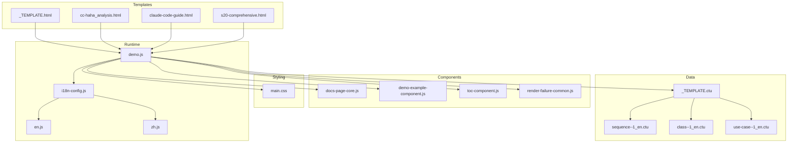
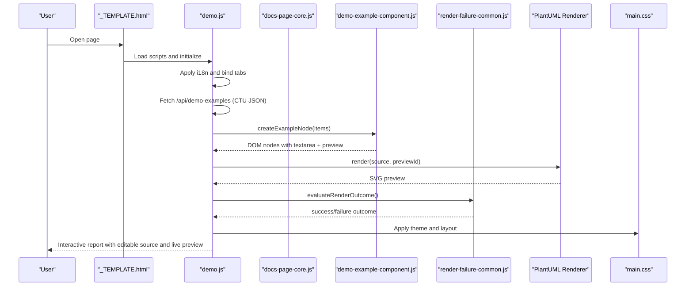
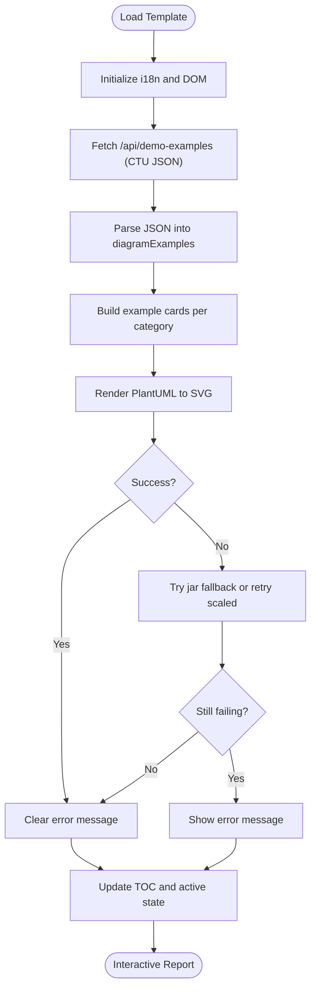
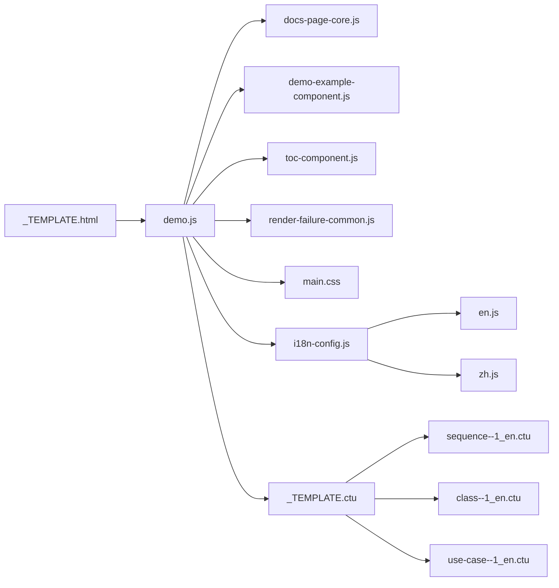

# HTML Template System

<cite>
**Referenced Files in This Document**
- [_TEMPLATE.html](file://cache/_TEMPLATE.html)
- [cc-haha_analysis.html](file://cache/cc-haha_analysis.html)
- [claude-code-guide.html](file://cache/claude-code-guide.html)
- [s20-comprehensive.html](file://cache/s20-comprehensive.html)
- [_TEMPLATE.ctu](file://data/_TEMPLATE.ctu)
- [docs-page-core.js](file://component/docs-page-core.js)
- [demo-example-component.js](file://component/demo-example-component.js)
- [toc-component.js](file://component/toc-component.js)
- [render-failure-common.js](file://component/render-failure-common.js)
- [main.css](file://main.css)
- [demo.js](file://demo.js)
- [en.js](file://i18n/en.js)
- [zh.js](file://i18n/zh.js)
- [i18n-config.js](file://i18n-config.js)
- [sequence--1_en.ctu](file://data/demo/sequence--1_en.ctu)
- [class--1_en.ctu](file://data/demo/class--1_en.ctu)
- [use-case--1_en.ctu](file://data/demo/use-case--1_en.ctu)
</cite>

## Table of Contents
1. [Introduction](#introduction)
2. [Project Structure](#project-structure)
3. [Core Components](#core-components)
4. [Architecture Overview](#architecture-overview)
5. [Detailed Component Analysis](#detailed-component-analysis)
6. [Dependency Analysis](#dependency-analysis)
7. [Performance Considerations](#performance-considerations)
8. [Troubleshooting Guide](#troubleshooting-guide)
9. [Conclusion](#conclusion)
10. [Appendices](#appendices)

## Introduction
This document explains the HTML template system that transforms CTU data into interactive, web-ready reports. It focuses on:
- The base template structure and placeholder conventions
- The CSS custom property theming system
- The component integration pipeline connecting templates to rendering
- Dynamic content injection from CTU data to HTML elements
- Rendering pipeline from CTU to final HTML output
- Error handling and performance optimization strategies

## Project Structure
The template system centers around a shared HTML base template and a set of reusable components. The CTU data files under data/ feed the page via a server-provided JSON API consumed by the frontend.

**Diagram sources**
- [_TEMPLATE.html:1-260](file://cache/_TEMPLATE.html#L1-L260)
- [cc-haha_analysis.html:1-81](file://cache/cc-haha_analysis.html#L1-L81)
- [claude-code-guide.html:1-73](file://cache/claude-code-guide.html#L1-L73)
- [s20-comprehensive.html:1-73](file://cache/s20-comprehensive.html#L1-L73)
- [docs-page-core.js:1-464](file://component/docs-page-core.js#L1-L464)
- [demo-example-component.js:1-159](file://component/demo-example-component.js#L1-L159)
- [toc-component.js:1-84](file://component/toc-component.js#L1-L84)
- [render-failure-common.js:1-249](file://component/render-failure-common.js#L1-L249)
- [main.css:1-804](file://main.css#L1-L804)
- [demo.js:1-816](file://demo.js#L1-L816)
- [i18n-config.js:1-58](file://i18n-config.js#L1-L58)
- [_TEMPLATE.ctu:1-46](file://data/_TEMPLATE.ctu#L1-L46)
- [sequence--1_en.ctu:1-23](file://data/demo/sequence--1_en.ctu#L1-L23)
- [class--1_en.ctu:1-34](file://data/demo/class--1_en.ctu#L1-L34)
- [use-case--1_en.ctu:1-21](file://data/demo/use-case--1_en.ctu#L1-L21)

**Section sources**
- [_TEMPLATE.html:1-260](file://cache/_TEMPLATE.html#L1-L260)
- [main.css:1-804](file://main.css#L1-L804)
- [demo.js:1-816](file://demo.js#L1-L816)

## Core Components
- Base template: Defines structural placeholders and configuration markers for tabs, content panels, and script dependencies.
- Component library: Provides core rendering utilities, example card creation, table-of-contents generation, and robust failure handling.
- Theming system: Uses CSS custom properties for colors, typography, and responsive breakpoints.
- Data model: CTU files define grouped examples with optional titles, descriptions, PlantUML source, and detailed explanations.

Key responsibilities:
- Template placeholders: [FIXED], [EDIT], [CONFIG] markers guide customization boundaries.
- Theming: CSS variables in :root and color-mix usage enable easy theme swaps.
- Rendering: Components orchestrate fetching, parsing, rendering, and error reporting.

**Section sources**
- [_TEMPLATE.html:1-260](file://cache/_TEMPLATE.html#L1-L260)
- [main.css:1-804](file://main.css#L1-L804)
- [docs-page-core.js:1-464](file://component/docs-page-core.js#L1-L464)
- [demo-example-component.js:1-159](file://component/demo-example-component.js#L1-L159)
- [toc-component.js:1-84](file://component/toc-component.js#L1-L84)
- [render-failure-common.js:1-249](file://component/render-failure-common.js#L1-L249)
- [_TEMPLATE.ctu:1-46](file://data/_TEMPLATE.ctu#L1-L46)

## Architecture Overview
The runtime pipeline:
- The base template loads script dependencies and exposes containers for content and TOC.
- demo.js initializes internationalization, loads CTU data via the API, builds example cards, and renders PlantUML diagrams.
- Components handle markdown rendering, error detection, and fallback rendering via plantuml.jar.
- main.css applies the theme and responsive layout.

**Diagram sources**
- [_TEMPLATE.html:240-257](file://cache/_TEMPLATE.html#L240-L257)
- [demo.js:146-172](file://demo.js#L146-L172)
- [docs-page-core.js:447-462](file://component/docs-page-core.js#L447-L462)
- [demo-example-component.js:82-155](file://component/demo-example-component.js#L82-L155)
- [render-failure-common.js:160-237](file://component/render-failure-common.js#L160-L237)
- [main.css:1-804](file://main.css#L1-L804)

## Detailed Component Analysis

### Template Placeholders and Layout Organization
- Structural markers:
  - [FIXED]: Do not modify classes, ids, or data-* attributes that drive JavaScript behavior.
  - [EDIT]: Free to edit titles, descriptions, and visible content.
  - [CONFIG]: Must align with .ctu data; adding/removing/rename tabs requires updating .ctu filenames and categories.
- Tab navigation: Each button has data-diagram mapped to CTU category prefixes.
- Content panel: Contains a default title and per-tab overview paragraphs; the examples container is where cards are appended.
- Script dependencies: Order matters; all must be present for proper initialization.

Customization guidelines:
- Keep [FIXED] sections intact.
- Update [EDIT] content to reflect your report topic.
- Align [CONFIG] tab lists with .ctu categories.

**Section sources**
- [_TEMPLATE.html:13-91](file://cache/_TEMPLATE.html#L13-L91)
- [_TEMPLATE.html:132-237](file://cache/_TEMPLATE.html#L132-L237)
- [_TEMPLATE.html:244-257](file://cache/_TEMPLATE.html#L244-L257)

### CSS Custom Property System and Theming
- Color scheme: :root defines color-scheme and semantic variables for backgrounds, text, muted text, borders, accents, and states.
- Typography: Body font stack and sizes are centralized.
- Surface and contrast: color-mix is used to derive soft variants for backgrounds and borders.
- Component styles: Buttons, inputs, previews, and TOC leverage variables for consistent theming.
- Responsive design: Media queries adjust layout for tablets and phones, including mobile TOC and reduced spacing.

Customization tips:
- Modify :root variables to change brand colors or palettes.
- Override component-level variables for granular control.
- Extend media queries for additional breakpoints.

**Section sources**
- [main.css:1-31](file://main.css#L1-L31)
- [main.css:127-145](file://main.css#L127-L145)
- [main.css:586-763](file://main.css#L586-L763)
- [main.css:664-752](file://main.css#L664-L752)

### Component Integration System
- docs-page-core.js: Provides rendering helpers, error detection, runtime error buffering, and fallback requests.
- demo-example-component.js: Creates example cards with editable textarea, preview area, and action buttons; supports markdown rendering and locale-aware titles/descriptions.
- toc-component.js: Builds and updates the sidebar and mobile TOCs, syncing active states with scroll position.
- render-failure-common.js: Implements retry logic for large diagrams, waits for SVG readiness, and handles jar fallback rendering.

Integration pattern:
- demo.js orchestrates loading, i18n application, tab switching, and rendering.
- Components are invoked to construct DOM and manage lifecycle events.

**Section sources**
- [docs-page-core.js:1-464](file://component/docs-page-core.js#L1-L464)
- [demo-example-component.js:1-159](file://component/demo-example-component.js#L1-L159)
- [toc-component.js:1-84](file://component/toc-component.js#L1-L84)
- [render-failure-common.js:1-249](file://component/render-failure-common.js#L1-L249)
- [demo.js:1-816](file://demo.js#L1-L816)

### Dynamic Content Injection and Data Mapping
CTU data structure:
- Title and Describe headers define grouping metadata.
- Multiple [Example] blocks separated by dividers.
- Each block includes:
  - [Example]: Optional title (use "None" to hide).
  - [Description]: Short explanation (supports markdown).
  - [UML]: PlantUML source code.
  - [Detail]: Extended explanation (supports markdown).

Mapping to HTML:
- demo.js loads JSON from /api/demo-examples, keyed by diagram category.
- For each example, demo-example-component.js creates a card with:
  - Title and description (markdown-rendered).
  - Editable textarea containing the UML source.
  - Preview container for the rendered SVG.
  - Action buttons to copy source/SVG or download SVG.
- Section headings and descriptions are inserted before example groups when titles change.

**Section sources**
- [_TEMPLATE.ctu:1-46](file://data/_TEMPLATE.ctu#L1-L46)
- [demo.js:237-287](file://demo.js#L237-L287)
- [demo-example-component.js:82-155](file://component/demo-example-component.js#L82-L155)
- [sequence--1_en.ctu:1-23](file://data/demo/sequence--1_en.ctu#L1-L23)
- [class--1_en.ctu:1-34](file://data/demo/class--1_en.ctu#L1-L34)
- [use-case--1_en.ctu:1-21](file://data/demo/use-case--1_en.ctu#L1-L21)

### Rendering Pipeline: From CTU to Final HTML

**Diagram sources**
- [demo.js:146-172](file://demo.js#L146-L172)
- [demo.js:374-439](file://demo.js#L374-L439)
- [render-failure-common.js:160-237](file://component/render-failure-common.js#L160-L237)
- [docs-page-core.js:293-355](file://component/docs-page-core.js#L293-L355)

**Section sources**
- [demo.js:146-172](file://demo.js#L146-L172)
- [demo.js:374-439](file://demo.js#L374-L439)
- [render-failure-common.js:160-237](file://component/render-failure-common.js#L160-L237)

### Internationalization and Localization
- i18n-config.js manages language mode persistence and dispatches a docs:langchange event.
- en.js and zh.js provide term banks for UI strings.
- demo.js listens for language changes, refreshes localized content, and re-renders examples.

Usage:
- Switch languages via the floating language switcher.
- All labels, tooltips, and messages adapt automatically.

**Section sources**
- [i18n-config.js:1-58](file://i18n-config.js#L1-L58)
- [en.js:1-53](file://i18n/en.js#L1-L53)
- [zh.js:1-53](file://i18n/zh.js#L1-L53)
- [demo.js:131-144](file://demo.js#L131-L144)
- [demo.js:728-778](file://demo.js#L728-L778)

### Template Variants and Customization Examples
- cc-haha_analysis.html: Demonstrates a Chinese-language variant with a data-dir attribute and localized tab labels and overviews.
- claude-code-guide.html and s20-comprehensive.html: Show alternative layouts while preserving the same structural markers and script dependencies.

Customization patterns:
- Change [EDIT] titles and summaries to reflect your domain.
- Adjust [CONFIG] tabs to match your CTU categories.
- Keep [FIXED] attributes intact to preserve interactivity.

**Section sources**
- [cc-haha_analysis.html:1-81](file://cache/cc-haha_analysis.html#L1-L81)
- [claude-code-guide.html:1-73](file://cache/claude-code-guide.html#L1-L73)
- [s20-comprehensive.html:1-73](file://cache/s20-comprehensive.html#L1-L73)

## Dependency Analysis

**Diagram sources**
- [_TEMPLATE.html:244-257](file://cache/_TEMPLATE.html#L244-L257)
- [demo.js:1-33](file://demo.js#L1-L33)
- [docs-page-core.js:1-11](file://component/docs-page-core.js#L1-L11)
- [demo-example-component.js:1-11](file://component/demo-example-component.js#L1-L11)
- [toc-component.js:1-11](file://component/toc-component.js#L1-L11)
- [render-failure-common.js:1-11](file://component/render-failure-common.js#L1-L11)
- [main.css:1-31](file://main.css#L1-L31)
- [i18n-config.js:1-11](file://i18n-config.js#L1-L11)
- [en.js:1-11](file://i18n/en.js#L1-L11)
- [zh.js:1-11](file://i18n/zh.js#L1-L11)
- [_TEMPLATE.ctu:1-10](file://data/_TEMPLATE.ctu#L1-L10)
- [sequence--1_en.ctu:1-10](file://data/demo/sequence--1_en.ctu#L1-L10)
- [class--1_en.ctu:1-10](file://data/demo/class--1_en.ctu#L1-L10)
- [use-case--1_en.ctu:1-10](file://data/demo/use-case--1_en.ctu#L1-L10)

**Section sources**
- [demo.js:1-33](file://demo.js#L1-L33)
- [docs-page-core.js:1-11](file://component/docs-page-core.js#L1-L11)
- [demo-example-component.js:1-11](file://component/demo-example-component.js#L1-L11)
- [toc-component.js:1-11](file://component/toc-component.js#L1-L11)
- [render-failure-common.js:1-11](file://component/render-failure-common.js#L1-L11)
- [main.css:1-31](file://main.css#L1-L31)
- [i18n-config.js:1-11](file://i18n-config.js#L1-L11)

## Performance Considerations
- Debounced re-rendering: Editing triggers a delayed render to avoid excessive reflows.
- Render chaining: A promise chain serializes renders to prevent contention.
- Large diagram scaling: Automatic scaling reduces memory pressure for large diagrams.
- Fallback rendering: Jar fallback ensures reliability when browser rendering fails.
- Lazy TOC updates: Active state sync is scheduled to minimize layout thrash.

Recommendations:
- Keep example counts reasonable per page.
- Prefer concise PlantUML sources to reduce render time.
- Use responsive breakpoints to optimize mobile performance.

**Section sources**
- [demo.js:347-351](file://demo.js#L347-L351)
- [demo.js:374-439](file://demo.js#L374-L439)
- [render-failure-common.js:137-158](file://component/render-failure-common.js#L137-L158)
- [render-failure-common.js:160-237](file://component/render-failure-common.js#L160-L237)

## Troubleshooting Guide
Common issues and resolutions:
- Missing renderer: If the PlantUML renderer is unavailable, the system falls back to jar rendering.
- Runtime failures: A runtime error buffer captures exceptions and surfaces meaningful messages.
- Empty or invalid SVG: The system detects empty previews and errors embedded in SVG text.
- Large diagrams: Automatically scales diagrams and retries rendering.
- Jar fallback errors: Clear error messages indicate HTTP status and reasons.

Actions:
- Verify /api/plantuml-svg availability when using fallback.
- Check console for captured runtime errors.
- Ensure CTU files conform to the documented structure.

**Section sources**
- [demo.js:113-115](file://demo.js#L113-L115)
- [docs-page-core.js:178-291](file://component/docs-page-core.js#L178-L291)
- [docs-page-core.js:293-355](file://component/docs-page-core.js#L293-L355)
- [render-failure-common.js:86-124](file://component/render-failure-common.js#L86-L124)
- [render-failure-common.js:132-158](file://component/render-failure-common.js#L132-L158)

## Conclusion
The HTML template system provides a robust, extensible foundation for transforming CTU data into interactive, themed, and localized web reports. By adhering to placeholder markers, leveraging the component library, and applying the CSS variable theme, teams can rapidly produce high-quality documentation with editable sources, live previews, and resilient rendering.

## Appendices

### Placeholder Reference
- [FIXED]: Structural attributes and classes required by JavaScript.
- [EDIT]: Content areas that can be freely customized.
- [CONFIG]: Tabs and data alignment that must match .ctu categories.

**Section sources**
- [_TEMPLATE.html:14-91](file://cache/_TEMPLATE.html#L14-L91)

### Theming Customization Checklist
- Modify :root variables for brand colors.
- Adjust typography and spacing variables.
- Extend media queries for device-specific tweaks.
- Verify color-mix variants for surfaces and borders.

**Section sources**
- [main.css:1-31](file://main.css#L1-L31)
- [main.css:664-752](file://main.css#L664-L752)

### Component API Highlights
- docs-page-core.js: Rendering helpers, error detection, and fallback utilities.
- demo-example-component.js: Card creation, markdown rendering, and locale handling.
- toc-component.js: TOC building and active state synchronization.
- render-failure-common.js: Retry logic, timeouts, and jar fallback.

**Section sources**
- [docs-page-core.js:447-462](file://component/docs-page-core.js#L447-L462)
- [demo-example-component.js:82-155](file://component/demo-example-component.js#L82-L155)
- [toc-component.js:21-64](file://component/toc-component.js#L21-L64)
- [render-failure-common.js:160-237](file://component/render-failure-common.js#L160-L237)