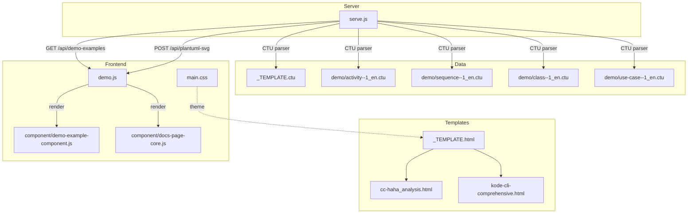
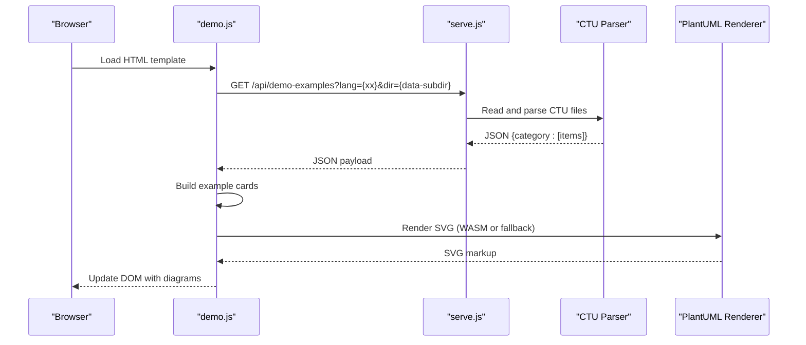
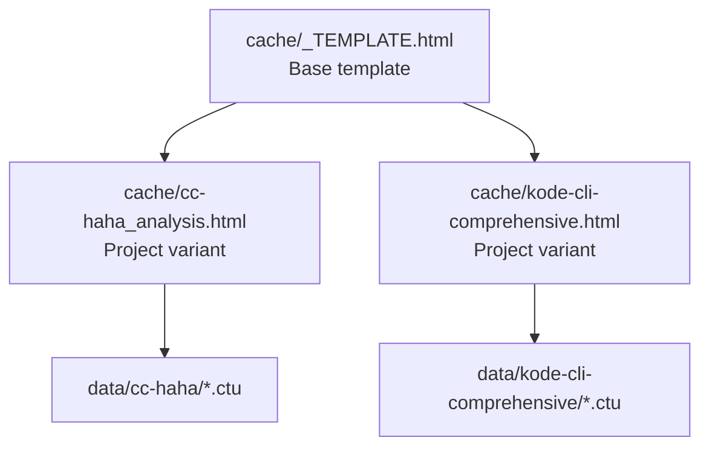
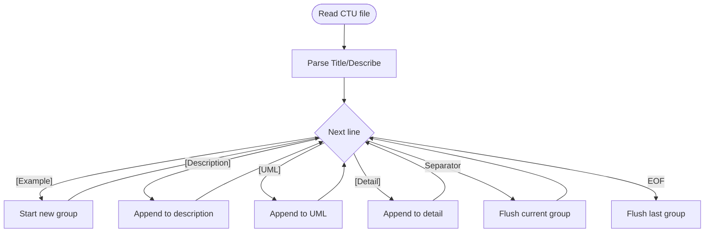
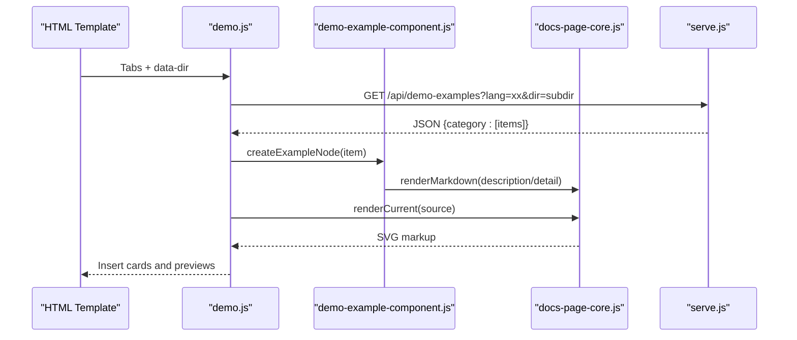
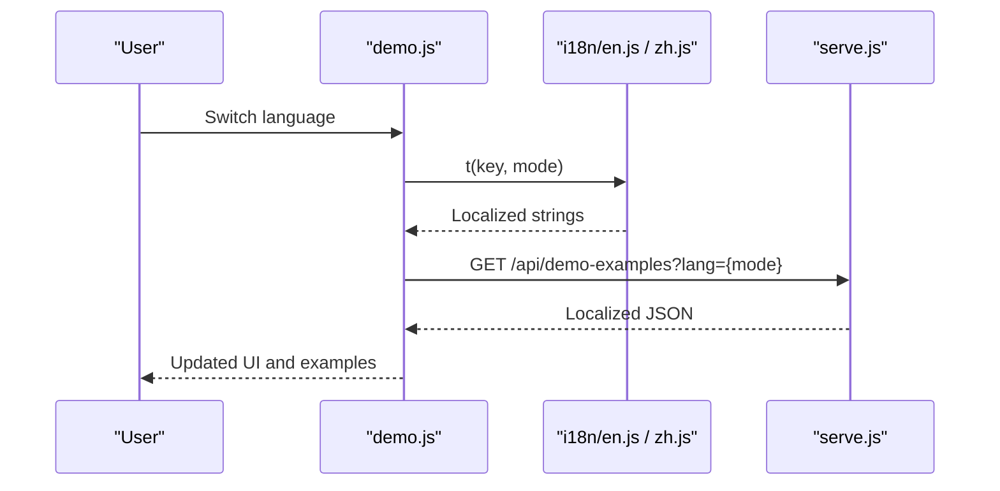
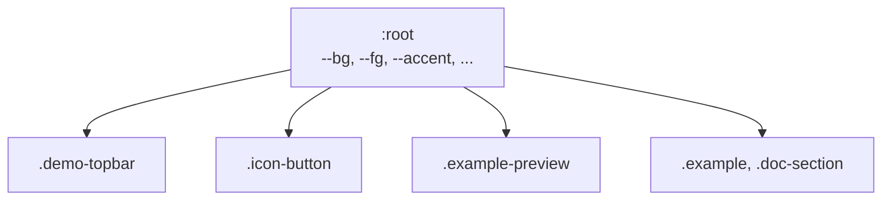
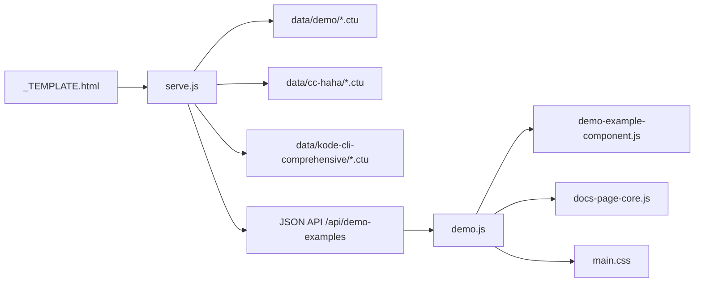

# Template System

<cite>
**Referenced Files in This Document**
- [cache/_TEMPLATE.html](file://cache/_TEMPLATE.html)
- [data/_TEMPLATE.ctu](file://data/_TEMPLATE.ctu)
- [main.css](file://main.css)
- [i18n/en.js](file://i18n/en.js)
- [i18n/zh.js](file://i18n/zh.js)
- [demo.js](file://demo.js)
- [serve.js](file://serve.js)
- [component/demo-example-component.js](file://component/demo-example-component.js)
- [component/docs-page-core.js](file://component/docs-page-core.js)
- [cache/cc-haha_analysis.html](file://cache/cc-haha_analysis.html)
- [cache/kode-cli-comprehensive.html](file://cache/kode-cli-comprehensive.html)
- [data/demo/activity--1_en.ctu](file://data/demo/activity--1_en.ctu)
- [data/demo/sequence--1_en.ctu](file://data/demo/sequence--1_en.ctu)
- [data/demo/class--1_en.ctu](file://data/demo/class--1_en.ctu)
- [data/demo/use-case--1_en.ctu](file://data/demo/use-case--1_en.ctu)
- [index.html](file://index.html)
</cite>

## Table of Contents
1. [Introduction](#introduction)
2. [Project Structure](#project-structure)
3. [Core Components](#core-components)
4. [Architecture Overview](#architecture-overview)
5. [Detailed Component Analysis](#detailed-component-analysis)
6. [Dependency Analysis](#dependency-analysis)
7. [Performance Considerations](#performance-considerations)
8. [Troubleshooting Guide](#troubleshooting-guide)
9. [Conclusion](#conclusion)
10. [Appendices](#appendices)

## Introduction
This document explains Code-To-UML’s template system for reusable, data-driven report generation. It covers:
- The CTU file format for data-driven examples
- The HTML template system using cache/_TEMPLATE.html as the base
- How CTU data maps to HTML presentation
- Template inheritance patterns across multiple generated HTML files
- Variable substitution and localization
- Theming via CSS custom properties
- Best practices for creating and maintaining consistent templates

## Project Structure
The template system comprises:
- HTML templates in cache/ (including the base template and project-specific variants)
- CTU data files in data/ grouped by report directory
- A Node.js development server that reads CTU files and serves JSON APIs consumed by the frontend
- Frontend scripts that render PlantUML diagrams and manage UI interactions

**Diagram sources**
- [cache/_TEMPLATE.html](file://cache/_TEMPLATE.html)
- [cache/cc-haha_analysis.html](file://cache/cc-haha_analysis.html)
- [cache/kode-cli-comprehensive.html](file://cache/kode-cli-comprehensive.html)
- [data/_TEMPLATE.ctu](file://data/_TEMPLATE.ctu)
- [data/demo/activity--1_en.ctu](file://data/demo/activity--1_en.ctu)
- [data/demo/sequence--1_en.ctu](file://data/demo/sequence--1_en.ctu)
- [data/demo/class--1_en.ctu](file://data/demo/class--1_en.ctu)
- [data/demo/use-case--1_en.ctu](file://data/demo/use-case--1_en.ctu)
- [serve.js](file://serve.js)
- [demo.js](file://demo.js)
- [component/demo-example-component.js](file://component/demo-example-component.js)
- [component/docs-page-core.js](file://component/docs-page-core.js)
- [main.css](file://main.css)

**Section sources**
- [cache/_TEMPLATE.html](file://cache/_TEMPLATE.html)
- [data/_TEMPLATE.ctu](file://data/_TEMPLATE.ctu)
- [serve.js](file://serve.js)
- [demo.js](file://demo.js)
- [main.css](file://main.css)

## Core Components
- HTML Template Base: cache/_TEMPLATE.html defines the structural contract for report pages, including tab navigation, content panels, and script dependencies.
- CTU Data Format: data/*.ctu files define example groups with headers and blocks for title, description, PlantUML source, and details.
- Server API: serve.js parses CTU files, exposes JSON via /api/demo-examples, and provides a fallback PlantUML renderer via /api/plantuml-svg.
- Frontend Renderer: demo.js orchestrates loading, localization, rendering, and UI updates; component/demo-example-component.js builds example cards; component/docs-page-core.js provides shared utilities.

**Section sources**
- [cache/_TEMPLATE.html](file://cache/_TEMPLATE.html)
- [data/_TEMPLATE.ctu](file://data/_TEMPLATE.ctu)
- [serve.js](file://serve.js)
- [demo.js](file://demo.js)
- [component/demo-example-component.js](file://component/demo-example-component.js)
- [component/docs-page-core.js](file://component/docs-page-core.js)

## Architecture Overview
The system follows a data-driven pipeline:
- CTU files are grouped and localized by the server
- The frontend requests JSON for the active language and data directory
- The frontend renders example cards with editable PlantUML source and live SVG previews
- Templates are reused across projects via inheritance from the base template

**Diagram sources**
- [demo.js](file://demo.js)
- [serve.js](file://serve.js)
- [component/docs-page-core.js](file://component/docs-page-core.js)

## Detailed Component Analysis

### HTML Template System and Inheritance
- Base Template: cache/_TEMPLATE.html establishes the page shell, navigation tabs, content panel, and script dependencies. It documents editable, configurable, and fixed regions to guide customization while preserving runtime behavior.
- Project Variants: cache/cc-haha_analysis.html and cache/kode-cli-comprehensive.html inherit from the base by copying the structure and updating titles, tabs, and overviews. They set data-dir on the body to select a data subdirectory and maintain identical script dependencies.

**Diagram sources**
- [cache/_TEMPLATE.html](file://cache/_TEMPLATE.html)
- [cache/cc-haha_analysis.html](file://cache/cc-haha_analysis.html)
- [cache/kode-cli-comprehensive.html](file://cache/kode-cli-comprehensive.html)

**Section sources**
- [cache/_TEMPLATE.html](file://cache/_TEMPLATE.html)
- [cache/cc-haha_analysis.html](file://cache/cc-haha_analysis.html)
- [cache/kode-cli-comprehensive.html](file://cache/kode-cli-comprehensive.html)

### CTU File Format and Data Model
- Headers: Title and Describe appear at the top of each CTU file; Describe supports multiple lines until the first example block begins.
- Blocks: Each example group consists of:
  - [Example]: Title for the example card
  - [Description]: Short description (Markdown supported)
  - [UML]: PlantUML source code
  - [Detail]: Extended explanation (Markdown supported)
- Separators: Groups are separated by a long line of hyphens. A group is flushed when encountering a new separator or a new [Example] block after UML content.

**Diagram sources**
- [data/_TEMPLATE.ctu](file://data/_TEMPLATE.ctu)
- [serve.js](file://serve.js)

**Section sources**
- [data/_TEMPLATE.ctu](file://data/_TEMPLATE.ctu)
- [serve.js](file://serve.js)

### Relationship Between CTU Data and HTML Presentation
- Tab Mapping: The data-diagram attribute on each tab corresponds to the category prefix in CTU filenames (e.g., sequence--1_en.ctu maps to data-diagram="sequence").
- Data Directory: The data-dir attribute on the body selects the data subdirectory; the server loads files matching the category prefix and language suffix.
- Rendering Pipeline: demo.js loads JSON, builds example cards, and renders PlantUML SVGs. The demo-example-component.js creates the card structure and applies localization.

**Diagram sources**
- [demo.js](file://demo.js)
- [component/demo-example-component.js](file://component/demo-example-component.js)
- [component/docs-page-core.js](file://component/docs-page-core.js)
- [serve.js](file://serve.js)

**Section sources**
- [demo.js](file://demo.js)
- [component/demo-example-component.js](file://component/demo-example-component.js)
- [component/docs-page-core.js](file://component/docs-page-core.js)
- [serve.js](file://serve.js)

### Localization and Bilingual Content
- Language Switcher: demo.js initializes a language switcher and listens for language changes to refresh examples and UI labels.
- Data Model: Each CTU item stores titleI18n, descriptionI18n, detailI18n, and sectionTitleI18n/sectionDescriptionI18n keyed by language. The server merges these into localized strings based on the selected language.
- UI Labels: i18n/en.js and i18n/zh.js provide localized strings for UI labels, tooltips, and messages. demo.js applies these during initialization and on language changes.

**Diagram sources**
- [demo.js](file://demo.js)
- [i18n/en.js](file://i18n/en.js)
- [i18n/zh.js](file://i18n/zh.js)
- [serve.js](file://serve.js)

**Section sources**
- [demo.js](file://demo.js)
- [i18n/en.js](file://i18n/en.js)
- [i18n/zh.js](file://i18n/zh.js)
- [serve.js](file://serve.js)

### CSS Custom Property System and Theming
- Root Variables: main.css defines a set of CSS custom properties on :root for colors, surfaces, accents, and typography.
- Component Theming: Stylesheets reference these variables to maintain consistent theming across components (e.g., topbar, buttons, previews).
- Dark/Light Mode: color-scheme is declared on :root; components adapt to the scheme via color-mix and border/background tokens.

**Diagram sources**
- [main.css](file://main.css)

**Section sources**
- [main.css](file://main.css)

### Template Creation and Modification Workflow
- Create a new template:
  - Copy cache/_TEMPLATE.html to cache/my-report.html
  - Update the page title, intro, and tab list to match your content
  - Ensure data-diagram values align with CTU filename prefixes
  - Add data-dir on the body to point to the appropriate data subdirectory
- Modify an existing template:
  - Edit [EDIT] regions for titles and descriptions
  - Adjust [CONFIG] tab lists to reflect new categories
  - Keep [FIXED] sections intact to preserve runtime behavior
- Maintain consistency:
  - Use the same script dependencies and order
  - Keep the same class names and data-* attributes for interactive elements
  - Align tab labels with i18n keys for localization

**Section sources**
- [cache/_TEMPLATE.html](file://cache/_TEMPLATE.html)
- [demo.js](file://demo.js)
- [i18n/en.js](file://i18n/en.js)
- [i18n/zh.js](file://i18n/zh.js)

### Best Practices for Consistent Reports
- Naming Conventions:
  - Use consistent category prefixes in CTU filenames (e.g., sequence, use-case, class)
  - Maintain language suffixes (_en or _zh) to enable bilingual content
- Content Organization:
  - Group related examples under the same category
  - Use [Describe] headers to introduce each category
  - Keep [Detail] sections concise and focused on diagram interpretation
- UI and Accessibility:
  - Preserve data-diagram attributes and class names for tabs and examples
  - Provide meaningful aria-labels for navigation and controls
- Theming:
  - Prefer CSS custom properties for colors and backgrounds
  - Avoid hardcoding colors in templates; rely on variables

**Section sources**
- [data/_TEMPLATE.ctu](file://data/_TEMPLATE.ctu)
- [cache/_TEMPLATE.html](file://cache/_TEMPLATE.html)
- [demo.js](file://demo.js)
- [main.css](file://main.css)

## Dependency Analysis
The template system exhibits low coupling between templates and high cohesion within the server and frontend components.

**Diagram sources**
- [cache/_TEMPLATE.html](file://cache/_TEMPLATE.html)
- [serve.js](file://serve.js)
- [demo.js](file://demo.js)
- [component/demo-example-component.js](file://component/demo-example-component.js)
- [component/docs-page-core.js](file://component/docs-page-core.js)
- [main.css](file://main.css)

**Section sources**
- [serve.js](file://serve.js)
- [demo.js](file://demo.js)
- [component/demo-example-component.js](file://component/demo-example-component.js)
- [component/docs-page-core.js](file://component/docs-page-core.js)
- [main.css](file://main.css)

## Performance Considerations
- Rendering Queue: demo.js uses a render chain to avoid concurrent renders and reduce flicker.
- Large Diagrams: docs-page-core.js adds a safe scale directive for oversized diagrams and falls back to the server-side PlantUML renderer when needed.
- Markdown Rendering: demo-example-component.js uses markdown-it when available; otherwise, it applies a safe fallback to prevent XSS and preserve readability.
- Network Efficiency: The server caches JSON payloads and avoids unnecessary recomputation by using render generations and active tab tracking.

[No sources needed since this section provides general guidance]

## Troubleshooting Guide
- No Examples Loaded:
  - Verify data-dir matches the intended data subdirectory
  - Confirm CTU filenames match data-diagram values and include language suffixes
  - Check that the server responds to /api/demo-examples with valid JSON
- Render Failures:
  - For “Diagram too large,” the system attempts a scaled render; if it still fails, the server fallback is used
  - Ensure PlantUML syntax is valid; errors are detected and surfaced to the UI
- Localization Issues:
  - Confirm language keys exist in i18n/en.js and i18n/zh.js
  - Trigger a language change to refresh UI labels and example content
- Template Breakage:
  - Do not modify [FIXED] sections; keep class names and data-* attributes intact
  - Ensure script dependencies are loaded in the documented order

**Section sources**
- [demo.js](file://demo.js)
- [component/docs-page-core.js](file://component/docs-page-core.js)
- [component/demo-example-component.js](file://component/demo-example-component.js)
- [serve.js](file://serve.js)

## Conclusion
Code-To-UML’s template system combines a flexible HTML base with a robust CTU data model and a data-driven rendering pipeline. By adhering to naming conventions, preserving template contracts, and leveraging CSS custom properties and localization, teams can consistently produce high-quality, bilingual reports across multiple projects.

[No sources needed since this section summarizes without analyzing specific files]

## Appendices

### Example CTU Files
- Minimal example: [data/demo/activity--1_en.ctu](file://data/demo/activity--1_en.ctu)
- Sequence diagram: [data/demo/sequence--1_en.ctu](file://data/demo/sequence--1_en.ctu)
- Class elements: [data/demo/class--1_en.ctu](file://data/demo/class--1_en.ctu)
- Use-case basics: [data/demo/use-case--1_en.ctu](file://data/demo/use-case--1_en.ctu)

**Section sources**
- [data/demo/activity--1_en.ctu](file://data/demo/activity--1_en.ctu)
- [data/demo/sequence--1_en.ctu](file://data/demo/sequence--1_en.ctu)
- [data/demo/class--1_en.ctu](file://data/demo/class--1_en.ctu)
- [data/demo/use-case--1_en.ctu](file://data/demo/use-case--1_en.ctu)

### Cache Index and Generated HTML Management
- The cache index page scans cache/ for generated HTML files and allows clearing or deleting them via API endpoints.
- Use the index to manage multiple generated reports and ensure consistent cleanup.

**Section sources**
- [index.html](file://index.html)
- [serve.js](file://serve.js)