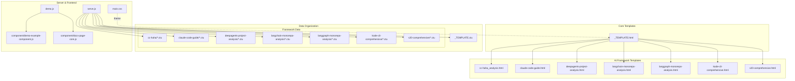
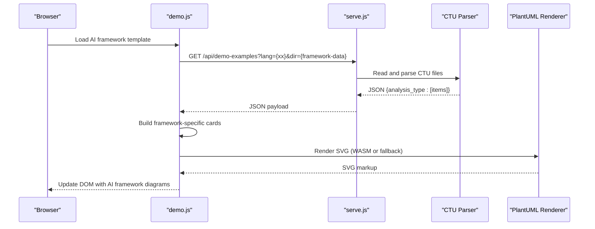
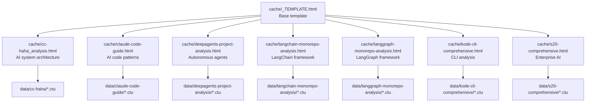
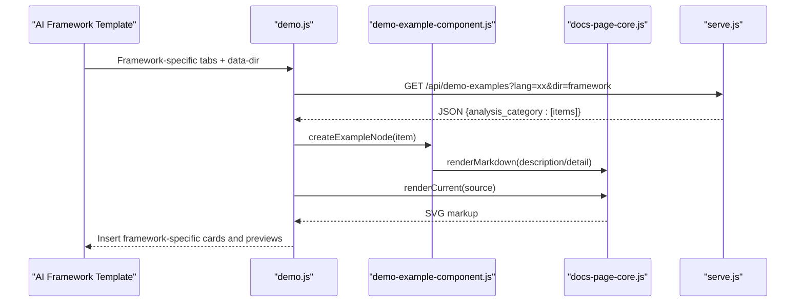
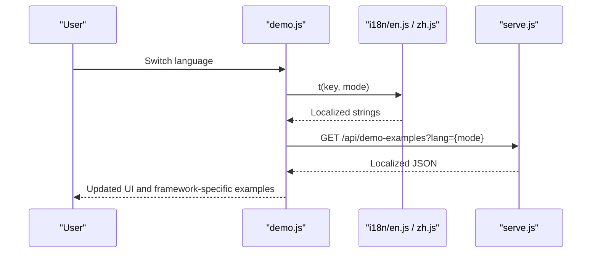
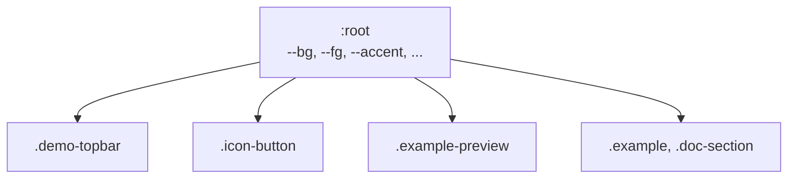
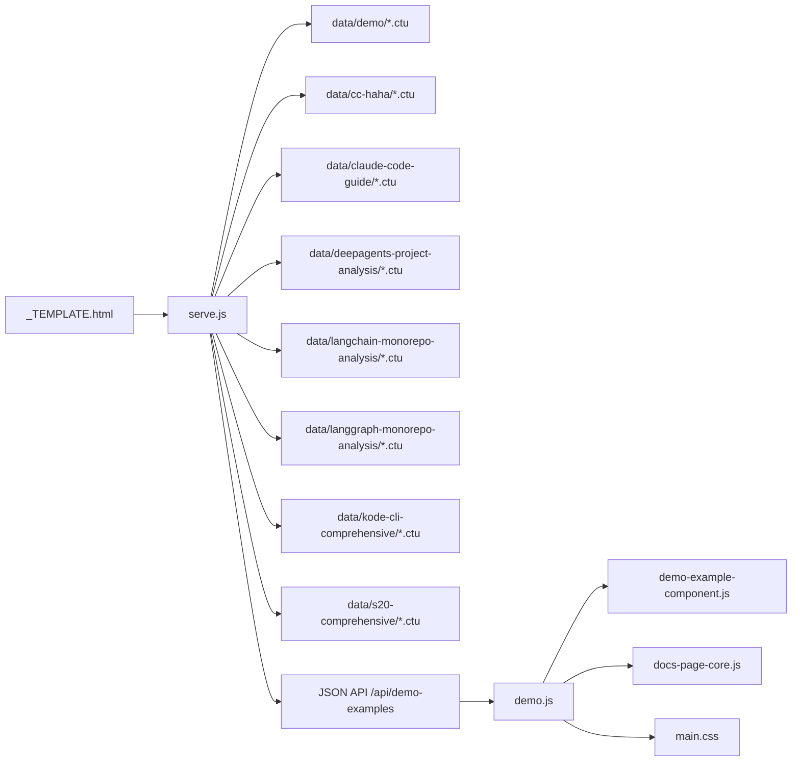

# Template System

<cite>
**Referenced Files in This Document**
- [cache/_TEMPLATE.html](file://cache/_TEMPLATE.html)
- [cache/cc-haha_analysis.html](file://cache/cc-haha_analysis.html)
- [cache/claude-code-guide.html](file://cache/claude-code-guide.html)
- [cache/deepagents-project-analysis.html](file://cache/deepagents-project-analysis.html)
- [cache/kode-cli-comprehensive.html](file://cache/kode-cli-comprehensive.html)
- [cache/langchain-monorepo-analysis.html](file://cache/langchain-monorepo-analysis.html)
- [cache/langgraph-monorepo-analysis.html](file://cache/langgraph-monorepo-analysis.html)
- [cache/s20-comprehensive.html](file://cache/s20-comprehensive.html)
- [data/_TEMPLATE.ctu](file://data/_TEMPLATE.ctu)
- [data/cc-haha/architecture--1_zh.ctu](file://data/cc-haha/architecture--1_zh.ctu)
- [data/claude-code-guide/architecture--1_zh.ctu](file://data/claude-code-guide/architecture--1_zh.ctu)
- [data/deepagents-project-analysis/architecture--1_zh.ctu](file://data/deepagents-project-analysis/architecture--1_zh.ctu)
- [data/kode-cli-comprehensive/architecture--1_zh.ctu](file://data/kode-cli-comprehensive/architecture--1_zh.ctu)
- [data/langchain-monorepo-analysis/architecture--1_zh.ctu](file://data/langchain-monorepo-analysis/architecture--1_zh.ctu)
- [data/langgraph-monorepo-analysis/architecture--1_zh.ctu](file://data/langgraph-monorepo-analysis/architecture--1_zh.ctu)
- [data/s20-comprehensive/architecture--1_zh.ctu](file://data/s20-comprehensive/architecture--1_zh.ctu)
- [main.css](file://main.css)
- [i18n/en.js](file://i18n/en.js)
- [i18n/zh.js](file://i18n/zh.js)
- [demo.js](file://demo.js)
- [serve.js](file://serve.js)
- [component/demo-example-component.js](file://component/demo-example-component.js)
- [component/docs-page-core.js](file://component/docs-page-core.js)
- [index.html](file://index.html)
</cite>

## Update Summary
**Changes Made**
- Added comprehensive documentation for new AI framework analysis templates
- Enhanced template architecture coverage for Claude code guide and DeepAgents projects
- Expanded template inheritance patterns for monorepo analysis frameworks
- Updated template creation guidelines for AI-focused report generation
- Added new template examples and their corresponding CTU data structures

## Table of Contents
1. [Introduction](#introduction)
2. [Project Structure](#project-structure)
3. [Core Components](#core-components)
4. [Architecture Overview](#architecture-overview)
5. [Detailed Component Analysis](#detailed-component-analysis)
6. [AI Framework Analysis Templates](#ai-framework-analysis-templates)
7. [Template Inheritance Patterns](#template-inheritance-patterns)
8. [Dependency Analysis](#dependency-analysis)
9. [Performance Considerations](#performance-considerations)
10. [Troubleshooting Guide](#troubleshooting-guide)
11. [Conclusion](#conclusion)
12. [Appendices](#appendices)

## Introduction
This document explains Code-To-UML's template system for reusable, data-driven report generation with enhanced support for AI framework analysis projects. The system now includes specialized templates for Claude AI code guides, DeepAgents project analysis, LangChain monorepo analysis, and LangGraph framework documentation. It covers:
- The CTU file format for data-driven examples
- The HTML template system using cache/_TEMPLATE.html as the base
- How CTU data maps to HTML presentation
- Template inheritance patterns across multiple generated HTML files
- Variable substitution and localization
- Theming via CSS custom properties
- Best practices for creating and maintaining consistent templates for AI framework analysis

## Project Structure
The template system now encompasses specialized AI framework analysis templates alongside the core template system:
- HTML templates in cache/ (including the base template and AI framework variants)
- CTU data files in data/ organized by AI framework and analysis type
- A Node.js development server that reads CTU files and serves JSON APIs consumed by the frontend
- Frontend scripts that render PlantUML diagrams and manage UI interactions

**Diagram sources**
- [cache/_TEMPLATE.html](file://cache/_TEMPLATE.html)
- [cache/cc-haha_analysis.html](file://cache/cc-haha_analysis.html)
- [cache/claude-code-guide.html](file://cache/claude-code-guide.html)
- [cache/deepagents-project-analysis.html](file://cache/deepagents-project-analysis.html)
- [cache/langchain-monorepo-analysis.html](file://cache/langchain-monorepo-analysis.html)
- [cache/langgraph-monorepo-analysis.html](file://cache/langgraph-monorepo-analysis.html)
- [cache/kode-cli-comprehensive.html](file://cache/kode-cli-comprehensive.html)
- [cache/s20-comprehensive.html](file://cache/s20-comprehensive.html)
- [data/_TEMPLATE.ctu](file://data/_TEMPLATE.ctu)
- [data/cc-haha/architecture--1_zh.ctu](file://data/cc-haha/architecture--1_zh.ctu)
- [data/claude-code-guide/architecture--1_zh.ctu](file://data/claude-code-guide/architecture--1_zh.ctu)
- [data/deepagents-project-analysis/architecture--1_zh.ctu](file://data/deepagents-project-analysis/architecture--1_zh.ctu)
- [data/langchain-monorepo-analysis/architecture--1_zh.ctu](file://data/langchain-monorepo-analysis/architecture--1_zh.ctu)
- [data/langgraph-monorepo-analysis/architecture--1_zh.ctu](file://data/langgraph-monorepo-analysis/architecture--1_zh.ctu)
- [data/kode-cli-comprehensive/architecture--1_zh.ctu](file://data/kode-cli-comprehensive/architecture--1_zh.ctu)
- [data/s20-comprehensive/architecture--1_zh.ctu](file://data/s20-comprehensive/architecture--1_zh.ctu)
- [serve.js](file://serve.js)
- [demo.js](file://demo.js)
- [component/demo-example-component.js](file://component/demo-example-component.js)
- [component/docs-page-core.js](file://component/docs-page-core.js)
- [main.css](file://main.css)

**Section sources**
- [cache/_TEMPLATE.html](file://cache/_TEMPLATE.html)
- [cache/cc-haha_analysis.html](file://cache/cc-haha_analysis.html)
- [cache/claude-code-guide.html](file://cache/claude-code-guide.html)
- [cache/deepagents-project-analysis.html](file://cache/deepagents-project-analysis.html)
- [cache/langchain-monorepo-analysis.html](file://cache/langchain-monorepo-analysis.html)
- [cache/langgraph-monorepo-analysis.html](file://cache/langgraph-monorepo-analysis.html)
- [cache/kode-cli-comprehensive.html](file://cache/kode-cli-comprehensive.html)
- [cache/s20-comprehensive.html](file://cache/s20-comprehensive.html)
- [data/_TEMPLATE.ctu](file://data/_TEMPLATE.ctu)
- [serve.js](file://serve.js)
- [demo.js](file://demo.js)
- [main.css](file://main.css)

## Core Components
- HTML Template Base: cache/_TEMPLATE.html defines the structural contract for report pages, including tab navigation, content panels, and script dependencies.
- AI Framework Templates: Specialized templates for Claude AI code guides, DeepAgents project analysis, and LangChain/LangGraph monorepo analysis with framework-specific content organization.
- CTU Data Format: data/*.ctu files define example groups with headers and blocks for title, description, PlantUML source, and details, organized by AI framework and analysis type.
- Server API: serve.js parses CTU files, exposes JSON via /api/demo-examples, and provides a fallback PlantUML renderer via /api/plantuml-svg.
- Frontend Renderer: demo.js orchestrates loading, localization, rendering, and UI updates; component/demo-example-component.js builds example cards; component/docs-page-core.js provides shared utilities.

**Section sources**
- [cache/_TEMPLATE.html](file://cache/_TEMPLATE.html)
- [cache/claude-code-guide.html](file://cache/claude-code-guide.html)
- [cache/deepagents-project-analysis.html](file://cache/deepagents-project-analysis.html)
- [cache/langchain-monorepo-analysis.html](file://cache/langchain-monorepo-analysis.html)
- [cache/langgraph-monorepo-analysis.html](file://cache/langgraph-monorepo-analysis.html)
- [data/_TEMPLATE.ctu](file://data/_TEMPLATE.ctu)
- [serve.js](file://serve.js)
- [demo.js](file://demo.js)
- [component/demo-example-component.js](file://component/demo-example-component.js)
- [component/docs-page-core.js](file://component/docs-page-core.js)

## Architecture Overview
The system follows a data-driven pipeline with enhanced support for AI framework analysis:
- CTU files are grouped and localized by the server for AI framework projects
- The frontend requests JSON for the active language and data directory
- The frontend renders example cards with editable PlantUML source and live SVG previews
- Templates are reused across AI frameworks via inheritance from the base template with framework-specific customizations

**Diagram sources**
- [demo.js](file://demo.js)
- [serve.js](file://serve.js)
- [component/docs-page-core.js](file://component/docs-page-core.js)

## Detailed Component Analysis

### HTML Template System and Inheritance
- Base Template: cache/_TEMPLATE.html establishes the page shell, navigation tabs, content panel, and script dependencies. It documents editable, configurable, and fixed regions to guide customization while preserving runtime behavior.
- AI Framework Variants: Multiple specialized templates inherit from the base template with framework-specific customizations:
  - Claude Code Guide: cache/claude-code-guide.html optimized for AI code review and development patterns
  - DeepAgents Project Analysis: cache/deepagents-project-analysis.html tailored for autonomous agent architectures
  - LangChain/LangGraph Monorepo Analysis: cache/langchain-monorepo-analysis.html and cache/langgraph-monorepo-analysis.html for large-scale AI framework documentation
  - CC-HAHA Analysis: cache/cc-haha_analysis.html for comprehensive AI system architecture
  - Kode CLI Comprehensive: cache/kode-cli-comprehensive.html for command-line interface analysis
  - S20 Comprehensive: cache/s20-comprehensive.html for enterprise AI solutions

**Diagram sources**
- [cache/_TEMPLATE.html](file://cache/_TEMPLATE.html)
- [cache/cc-haha_analysis.html](file://cache/cc-haha_analysis.html)
- [cache/claude-code-guide.html](file://cache/claude-code-guide.html)
- [cache/deepagents-project-analysis.html](file://cache/deepagents-project-analysis.html)
- [cache/langchain-monorepo-analysis.html](file://cache/langchain-monorepo-analysis.html)
- [cache/langgraph-monorepo-analysis.html](file://cache/langgraph-monorepo-analysis.html)
- [cache/kode-cli-comprehensive.html](file://cache/kode-cli-comprehensive.html)
- [cache/s20-comprehensive.html](file://cache/s20-comprehensive.html)

**Section sources**
- [cache/_TEMPLATE.html](file://cache/_TEMPLATE.html)
- [cache/cc-haha_analysis.html](file://cache/cc-haha_analysis.html)
- [cache/claude-code-guide.html](file://cache/claude-code-guide.html)
- [cache/deepagents-project-analysis.html](file://cache/deepagents-project-analysis.html)
- [cache/langchain-monorepo-analysis.html](file://cache/langchain-monorepo-analysis.html)
- [cache/langgraph-monorepo-analysis.html](file://cache/langgraph-monorepo-analysis.html)
- [cache/kode-cli-comprehensive.html](file://cache/kode-cli-comprehensive.html)
- [cache/s20-comprehensive.html](file://cache/s20-comprehensive.html)

### CTU File Format and Data Model
- Headers: Title and Describe appear at the top of each CTU file; Describe supports multiple lines until the first example block begins.
- Blocks: Each example group consists of:
  - [Example]: Title for the example card
  - [Description]: Short description (Markdown supported)
  - [UML]: PlantUML source code
  - [Detail]: Extended explanation (Markdown supported)
- Separators: Groups are separated by a long line of hyphens. A group is flushed when encountering a new separator or a new [Example] block after UML content.
- AI Framework Organization: Data files are organized by framework name with analysis-specific categories (architecture, calls, dataflow, flow, guide, objects, overview, principles, structure).

**Diagram sources**
- [data/_TEMPLATE.ctu](file://data/_TEMPLATE.ctu)
- [data/cc-haha/architecture--1_zh.ctu](file://data/cc-haha/architecture--1_zh.ctu)
- [data/claude-code-guide/architecture--1_zh.ctu](file://data/claude-code-guide/architecture--1_zh.ctu)
- [data/deepagents-project-analysis/architecture--1_zh.ctu](file://data/deepagents-project-analysis/architecture--1_zh.ctu)
- [serve.js](file://serve.js)

**Section sources**
- [data/_TEMPLATE.ctu](file://data/_TEMPLATE.ctu)
- [data/cc-haha/architecture--1_zh.ctu](file://data/cc-haha/architecture--1_zh.ctu)
- [data/claude-code-guide/architecture--1_zh.ctu](file://data/claude-code-guide/architecture--1_zh.ctu)
- [data/deepagents-project-analysis/architecture--1_zh.ctu](file://data/deepagents-project-analysis/architecture--1_zh.ctu)
- [serve.js](file://serve.js)

### Relationship Between CTU Data and HTML Presentation
- Tab Mapping: The data-diagram attribute on each tab corresponds to the category prefix in CTU filenames (e.g., architecture--1_zh.ctu maps to data-diagram="architecture").
- Data Directory: The data-dir attribute on the body selects the data subdirectory; the server loads files matching the category prefix and language suffix.
- Rendering Pipeline: demo.js loads JSON, builds example cards, and renders PlantUML SVGs. The demo-example-component.js creates the card structure and applies localization.

**Diagram sources**
- [demo.js](file://demo.js)
- [component/demo-example-component.js](file://component/demo-example-component.js)
- [component/docs-page-core.js](file://component/docs-page-core.js)
- [serve.js](file://serve.js)

**Section sources**
- [demo.js](file://demo.js)
- [component/demo-example-component.js](file://component/demo-example-component.js)
- [component/docs-page-core.js](file://component/docs-page-core.js)
- [serve.js](file://serve.js)

### Localization and Bilingual Content
- Language Switcher: demo.js initializes a language switcher and listens for language changes to refresh examples and UI labels.
- Data Model: Each CTU item stores titleI18n, descriptionI18n, detailI18n, and sectionTitleI18n/sectionDescriptionI18n keyed by language. The server merges these into localized strings based on the selected language.
- UI Labels: i18n/en.js and i18n/zh.js provide localized strings for UI labels, tooltips, and messages. demo.js applies these during initialization and on language changes.

**Diagram sources**
- [demo.js](file://demo.js)
- [i18n/en.js](file://i18n/en.js)
- [i18n/zh.js](file://i18n/zh.js)
- [serve.js](file://serve.js)

**Section sources**
- [demo.js](file://demo.js)
- [i18n/en.js](file://i18n/en.js)
- [i18n/zh.js](file://i18n/zh.js)
- [serve.js](file://serve.js)

### CSS Custom Property System and Theming
- Root Variables: main.css defines a set of CSS custom properties on :root for colors, surfaces, accents, and typography.
- Component Theming: Stylesheets reference these variables to maintain consistent theming across components (e.g., topbar, buttons, previews).
- Dark/Light Mode: color-scheme is declared on :root; components adapt to the scheme via color-mix and border/background tokens.

**Diagram sources**
- [main.css](file://main.css)

**Section sources**
- [main.css](file://main.css)

### Template Creation and Modification Workflow
- Create a new AI framework template:
  - Copy cache/_TEMPLATE.html to cache/framework-name-analysis.html
  - Update the page title, intro, and tab list to match AI framework content
  - Ensure data-diagram values align with CTU filename prefixes (architecture, calls, dataflow, etc.)
  - Add data-dir on the body to point to the appropriate framework data subdirectory
- Modify existing AI framework templates:
  - Edit [EDIT] regions for framework-specific titles and descriptions
  - Adjust [CONFIG] tab lists to reflect new analysis categories
  - Keep [FIXED] sections intact to preserve runtime behavior
- Maintain consistency across AI frameworks:
  - Use the same script dependencies and order
  - Keep the same class names and data-* attributes for interactive elements
  - Align tab labels with i18n keys for localization

**Section sources**
- [cache/_TEMPLATE.html](file://cache/_TEMPLATE.html)
- [demo.js](file://demo.js)
- [i18n/en.js](file://i18n/en.js)
- [i18n/zh.js](file://i18n/zh.js)

### Best Practices for Consistent AI Framework Reports
- Naming Conventions:
  - Use consistent analysis prefixes in CTU filenames (e.g., architecture, calls, dataflow, flow, guide, objects, overview, principles, structure)
  - Maintain language suffixes (_en or _zh) to enable bilingual content
- Content Organization:
  - Group related AI framework examples under the same analysis category
  - Use [Describe] headers to introduce each analysis framework
  - Keep [Detail] sections concise and focused on AI framework interpretation
- AI Framework Specific Guidance:
  - Claude Code Guide: emphasize code patterns and development practices
  - DeepAgents: focus on autonomous agent architectures and decision-making flows
  - LangChain/LangGraph: highlight monorepo structure and framework integration
- UI and Accessibility:
  - Preserve data-diagram attributes and class names for tabs and examples
  - Provide meaningful aria-labels for navigation and controls
- Theming:
  - Prefer CSS custom properties for colors and backgrounds
  - Avoid hardcoding colors in templates; rely on variables

**Section sources**
- [data/_TEMPLATE.ctu](file://data/_TEMPLATE.ctu)
- [cache/_TEMPLATE.html](file://cache/_TEMPLATE.html)
- [demo.js](file://demo.js)
- [main.css](file://main.css)

## AI Framework Analysis Templates

### Claude Code Guide Template
The Claude code guide template (cache/claude-code-guide.html) is optimized for AI-assisted code review and development patterns. It focuses on:
- Code architecture patterns and best practices
- Prompt engineering techniques
- AI-assisted development workflows
- Integration patterns with Claude AI services

**Section sources**
- [cache/claude-code-guide.html](file://cache/claude-code-guide.html)
- [data/claude-code-guide/architecture--1_zh.ctu](file://data/claude-code-guide/architecture--1_zh.ctu)
- [data/claude-code-guide/guide--1_zh.ctu](file://data/claude-code-guide/guide--1_zh.ctu)

### DeepAgents Project Analysis Template
The DeepAgents project analysis template (cache/deepagents-project-analysis.html) targets autonomous agent architectures:
- Multi-agent system design patterns
- Decision-making frameworks
- Agent communication protocols
- Autonomous operation flows

**Section sources**
- [cache/deepagents-project-analysis.html](file://cache/deepagents-project-analysis.html)
- [data/deepagents-project-analysis/architecture--1_zh.ctu](file://data/deepagents-project-analysis/architecture--1_zh.ctu)
- [data/deepagents-project-analysis/flow--1_zh.ctu](file://data/deepagents-project-analysis/flow--1_zh.ctu)

### LangChain Monorepo Analysis Template
The LangChain monorepo analysis template (cache/langchain-monorepo-analysis.html) handles large-scale AI framework documentation:
- Monorepo structure visualization
- Framework module relationships
- Integration patterns across packages
- Development workflow coordination

**Section sources**
- [cache/langchain-monorepo-analysis.html](file://cache/langchain-monorepo-analysis.html)
- [data/langchain-monorepo-analysis/architecture--1_zh.ctu](file://data/langchain-monorepo-analysis/architecture--1_zh.ctu)
- [data/langchain-monorepo-analysis/structure--1_zh.ctu](file://data/langchain-monorepo-analysis/structure--1_zh.ctu)

### LangGraph Monorepo Analysis Template
The LangGraph monorepo analysis template (cache/langgraph-monorepo-analysis.html) provides specialized documentation for LangGraph framework:
- Graph-based workflow design
- State management patterns
- Agent orchestration flows
- Framework-specific integration points

**Section sources**
- [cache/langgraph-monorepo-analysis.html](file://cache/langgraph-monorepo-analysis.html)
- [data/langgraph-monorepo-analysis/architecture--1_zh.ctu](file://data/langgraph-monorepo-analysis/architecture--1_zh.ctu)
- [data/langgraph-monorepo-analysis/flow--1_zh.ctu](file://data/langgraph-monorepo-analysis/flow--1_zh.ctu)

## Template Inheritance Patterns

### Base Template Architecture
The base template (cache/_TEMPLATE.html) establishes the foundational structure that all AI framework templates inherit from. This ensures consistency across different analysis types while allowing framework-specific customizations.

### Framework-Specific Customizations
Each AI framework template modifies the base template to address specific analysis requirements:
- Content organization tailored to the AI framework domain
- Analysis categories specific to the framework's documentation needs
- Visual design elements that reflect the framework's identity
- Navigation patterns optimized for framework-specific workflows

### Data Directory Mapping
Framework templates utilize the data-dir attribute to specify which CTU data directory to load, enabling separation of concerns between different AI frameworks while sharing common template infrastructure.

**Section sources**
- [cache/_TEMPLATE.html](file://cache/_TEMPLATE.html)
- [cache/claude-code-guide.html](file://cache/claude-code-guide.html)
- [cache/deepagents-project-analysis.html](file://cache/deepagents-project-analysis.html)
- [cache/langchain-monorepo-analysis.html](file://cache/langchain-monorepo-analysis.html)
- [cache/langgraph-monorepo-analysis.html](file://cache/langgraph-monorepo-analysis.html)

## Dependency Analysis
The template system exhibits low coupling between templates and high cohesion within the server and frontend components, with enhanced support for AI framework analysis.

**Diagram sources**
- [cache/_TEMPLATE.html](file://cache/_TEMPLATE.html)
- [serve.js](file://serve.js)
- [demo.js](file://demo.js)
- [component/demo-example-component.js](file://component/demo-example-component.js)
- [component/docs-page-core.js](file://component/docs-page-core.js)
- [main.css](file://main.css)

**Section sources**
- [serve.js](file://serve.js)
- [demo.js](file://demo.js)
- [component/demo-example-component.js](file://component/demo-example-component.js)
- [component/docs-page-core.js](file://component/docs-page-core.js)
- [main.css](file://main.css)

## Performance Considerations
- Rendering Queue: demo.js uses a render chain to avoid concurrent renders and reduce flicker.
- Large Diagrams: docs-page-core.js adds a safe scale directive for oversized diagrams and falls back to the server-side PlantUML renderer when needed.
- Markdown Rendering: demo-example-component.js uses markdown-it when available; otherwise, it applies a safe fallback to prevent XSS and preserve readability.
- Network Efficiency: The server caches JSON payloads and avoids unnecessary recomputation by using render generations and active tab tracking.
- AI Framework Optimization: Framework-specific templates may implement additional optimizations for handling large AI framework documentation sets.

## Troubleshooting Guide
- No Examples Loaded:
  - Verify data-dir matches the intended AI framework data subdirectory
  - Confirm CTU filenames match data-diagram values and include language suffixes
  - Check that the server responds to /api/demo-examples with valid JSON
- Render Failures:
  - For "Diagram too large," the system attempts a scaled render; if it still fails, the server fallback is used
  - Ensure PlantUML syntax is valid; errors are detected and surfaced to the UI
- Localization Issues:
  - Confirm language keys exist in i18n/en.js and i18n/zh.js
  - Trigger a language change to refresh UI labels and framework-specific example content
- Template Breakage:
  - Do not modify [FIXED] sections; keep class names and data-* attributes intact
  - Ensure script dependencies are loaded in the documented order
- AI Framework Issues:
  - Verify framework-specific CTU files exist in the expected data directory
  - Check that framework template data-dir matches the CTU file organization
  - Ensure framework-specific analysis categories are properly mapped to data-diagram attributes

**Section sources**
- [demo.js](file://demo.js)
- [component/docs-page-core.js](file://component/docs-page-core.js)
- [component/demo-example-component.js](file://component/demo-example-component.js)
- [serve.js](file://serve.js)

## Conclusion
Code-To-UML's enhanced template system combines a flexible HTML base with robust CTU data models and data-driven rendering pipelines, now specifically optimized for AI framework analysis projects. The addition of specialized templates for Claude AI code guides, DeepAgents project analysis, and LangChain/LangGraph monorepo documentation demonstrates the system's scalability and adaptability. By adhering to naming conventions, preserving template contracts, leveraging CSS custom properties, and implementing framework-specific customizations, teams can consistently produce high-quality, bilingual reports across diverse AI framework domains.

## Appendices

### AI Framework Template Examples
- Claude Code Guide: [cache/claude-code-guide.html](file://cache/claude-code-guide.html)
- DeepAgents Analysis: [cache/deepagents-project-analysis.html](file://cache/deepagents-project-analysis.html)
- LangChain Monorepo: [cache/langchain-monorepo-analysis.html](file://cache/langchain-monorepo-analysis.html)
- LangGraph Monorepo: [cache/langgraph-monorepo-analysis.html](file://cache/langgraph-monorepo-analysis.html)

**Section sources**
- [cache/claude-code-guide.html](file://cache/claude-code-guide.html)
- [cache/deepagents-project-analysis.html](file://cache/deepagents-project-analysis.html)
- [cache/langchain-monorepo-analysis.html](file://cache/langchain-monorepo-analysis.html)
- [cache/langgraph-monorepo-analysis.html](file://cache/langgraph-monorepo-analysis.html)

### AI Framework CTU Data Examples
- Claude Code Guide Architecture: [data/claude-code-guide/architecture--1_zh.ctu](file://data/claude-code-guide/architecture--1_zh.ctu)
- DeepAgents Project Analysis: [data/deepagents-project-analysis/architecture--1_zh.ctu](file://data/deepagents-project-analysis/architecture--1_zh.ctu)
- LangChain Monorepo Analysis: [data/langchain-monorepo-analysis/architecture--1_zh.ctu](file://data/langchain-monorepo-analysis/architecture--1_zh.ctu)
- LangGraph Monorepo Analysis: [data/langgraph-monorepo-analysis/architecture--1_zh.ctu](file://data/langgraph-monorepo-analysis/architecture--1_zh.ctu)

**Section sources**
- [data/claude-code-guide/architecture--1_zh.ctu](file://data/claude-code-guide/architecture--1_zh.ctu)
- [data/deepagents-project-analysis/architecture--1_zh.ctu](file://data/deepagents-project-analysis/architecture--1_zh.ctu)
- [data/langchain-monorepo-analysis/architecture--1_zh.ctu](file://data/langchain-monorepo-analysis/architecture--1_zh.ctu)
- [data/langgraph-monorepo-analysis/architecture--1_zh.ctu](file://data/langgraph-monorepo-analysis/architecture--1_zh.ctu)

### Cache Index and Generated HTML Management
- The cache index page scans cache/ for generated HTML files and allows clearing or deleting them via API endpoints.
- Use the index to manage multiple generated AI framework reports and ensure consistent cleanup.

**Section sources**
- [index.html](file://index.html)
- [serve.js](file://serve.js)