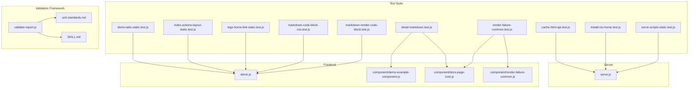
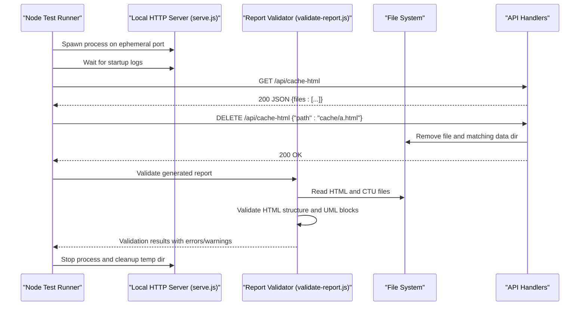
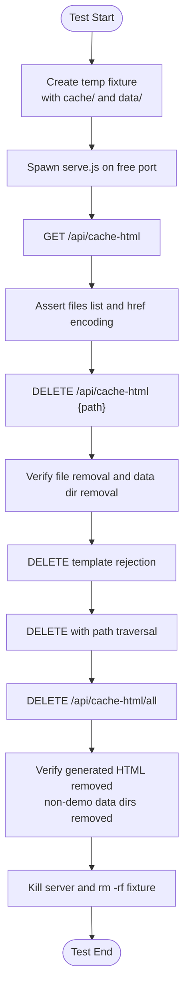
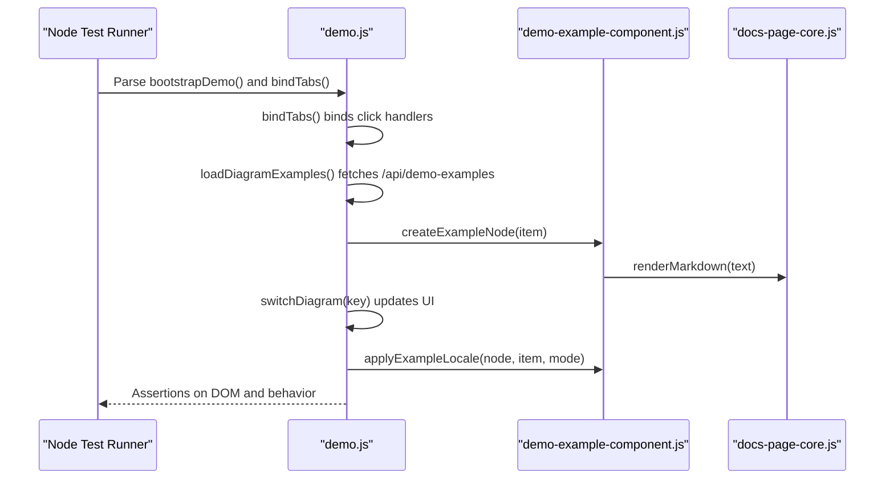
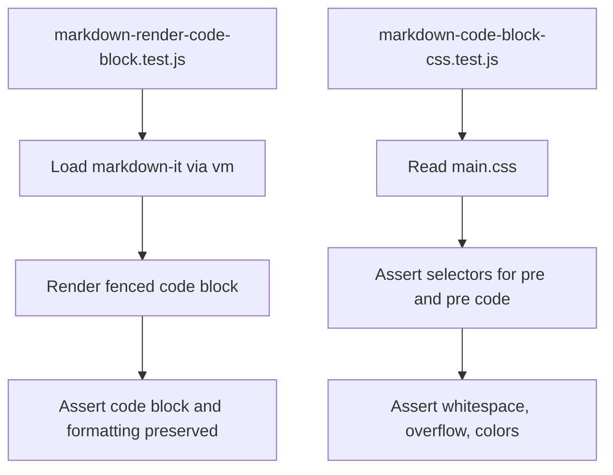
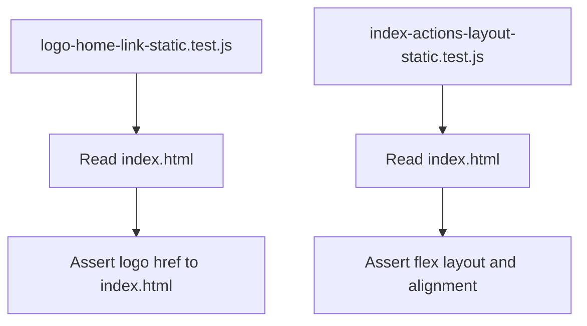
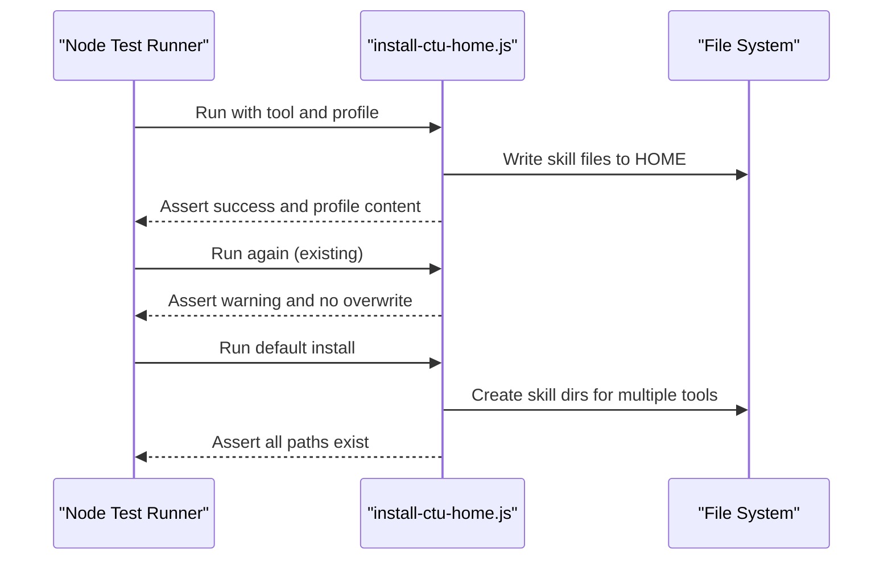
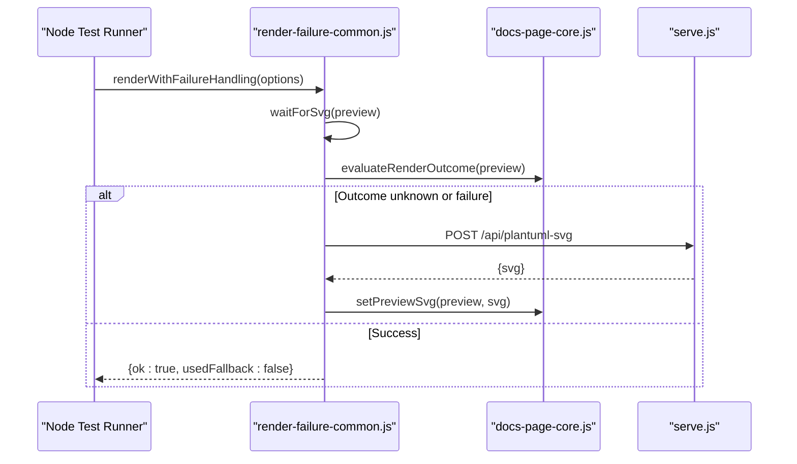
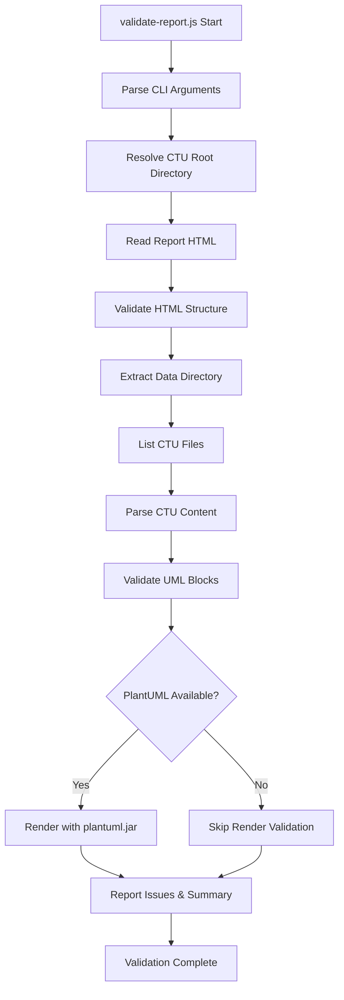
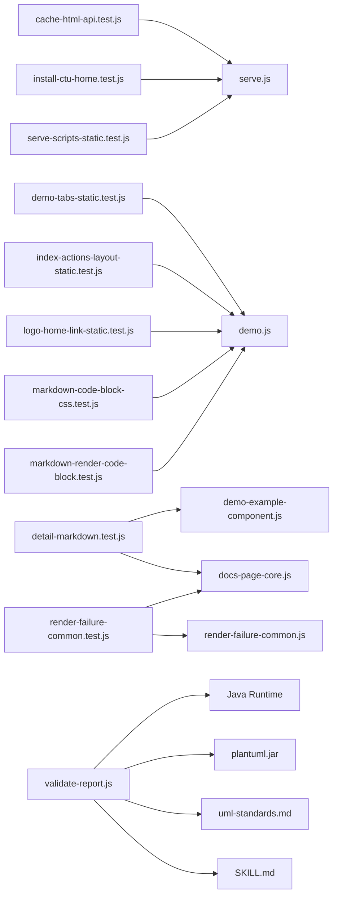

# Testing and Quality Assurance

<cite>
**Referenced Files in This Document**
- [test/cache-html-api.test.js](file://test/cache-html-api.test.js)
- [test/demo-tabs-static.test.js](file://test/demo-tabs-static.test.js)
- [test/detail-markdown.test.js](file://test/detail-markdown.test.js)
- [test/index-actions-layout-static.test.js](file://test/index-actions-layout-static.test.js)
- [test/install-ctu-home.test.js](file://test/install-ctu-home.test.js)
- [test/logo-home-link-static.test.js](file://test/logo-home-link-static.test.js)
- [test/markdown-code-block-css.test.js](file://test/markdown-code-block-css.test.js)
- [test/markdown-render-code-block.test.js](file://test/markdown-render-code-block.test.js)
- [test/render-failure-common.test.js](file://test/render-failure-common.test.js)
- [test/serve-scripts-static.test.js](file://test/serve-scripts-static.test.js)
- [skills/code-to-uml/scripts/validate-report.js](file://skills/code-to-uml/scripts/validate-report.js)
- [skills/code-to-uml/references/uml-standards.md](file://skills/code-to-uml/references/uml-standards.md)
- [skills/code-to-uml/SKILL.md](file://skills/code-to-uml/SKILL.md)
- [serve.js](file://serve.js)
- [demo.js](file://demo.js)
- [component/demo-example-component.js](file://component/demo-example-component.js)
- [component/docs-page-core.js](file://component/docs-page-core.js)
- [component/render-failure-common.js](file://component/render-failure-common.js)
</cite>

## Update Summary
**Changes Made**
- Added comprehensive validation framework documentation for the new validate-report.js script
- Documented UML diagram validation capabilities including PlantUML rendering verification
- Added quality gates and continuous integration considerations for the validation framework
- Enhanced testing methodology to include automated report validation
- Updated guidelines for writing tests that validate UML content and report structure

## Table of Contents
1. [Introduction](#introduction)
2. [Project Structure](#project-structure)
3. [Core Components](#core-components)
4. [Architecture Overview](#architecture-overview)
5. [Detailed Component Analysis](#detailed-component-analysis)
6. [Validation Framework](#validation-framework)
7. [Dependency Analysis](#dependency-analysis)
8. [Performance Considerations](#performance-considerations)
9. [Troubleshooting Guide](#troubleshooting-guide)
10. [Conclusion](#conclusion)
11. [Appendices](#appendices)

## Introduction
This document describes the testing framework and quality assurance processes for Code-To-UML. It explains the test suite structure, methodologies, and coverage areas across frontend components, server-side APIs, internationalization, error handling, and comprehensive report validation. The framework now includes sophisticated validation capabilities for HTML structure, UML diagram compliance, and automated PlantUML rendering verification. It provides guidelines for writing new tests, adding test cases for custom components, and maintaining reliability across environments. Continuous integration considerations and quality gates are included to help teams integrate robustness into their development lifecycle.

## Project Structure
The testing system is organized around a comprehensive suite of Node.js-based tests under the test directory, complemented by a sophisticated validation framework. Each test validates a specific aspect of the application, while the validation framework ensures report quality and UML diagram correctness:
- Server-side API endpoints and static serving behavior
- Frontend component rendering and internationalization
- Layout and accessibility attributes in HTML
- Tooling scripts for local development servers
- Installation flows for skill packages
- Comprehensive report validation including HTML structure, UML compliance, and PlantUML rendering

**Diagram sources**
- [test/cache-html-api.test.js:1-181](file://test/cache-html-api.test.js#L1-L181)
- [test/demo-tabs-static.test.js:1-41](file://test/demo-tabs-static.test.js#L1-L41)
- [test/detail-markdown.test.js:1-172](file://test/detail-markdown.test.js#L1-L172)
- [test/index-actions-layout-static.test.js:1-37](file://test/index-actions-layout-static.test.js#L1-L37)
- [test/install-ctu-home.test.js:1-95](file://test/install-ctu-home.test.js#L1-L95)
- [test/logo-home-link-static.test.js:1-34](file://test/logo-home-link-static.test.js#L1-L34)
- [test/markdown-code-block-css.test.js:1-36](file://test/markdown-code-block-css.test.js#L1-L36)
- [test/markdown-render-code-block.test.js:1-28](file://test/markdown-render-code-block.test.js#L1-L28)
- [test/render-failure-common.test.js:1-77](file://test/render-failure-common.test.js#L1-L77)
- [test/serve-scripts-static.test.js:1-18](file://test/serve-scripts-static.test.js#L1-L18)
- [skills/code-to-uml/scripts/validate-report.js:1-506](file://skills/code-to-uml/scripts/validate-report.js#L1-L506)
- [skills/code-to-uml/references/uml-standards.md:1-172](file://skills/code-to-uml/references/uml-standards.md#L1-L172)
- [skills/code-to-uml/SKILL.md:1-75](file://skills/code-to-uml/SKILL.md#L1-L75)
- [serve.js:1-567](file://serve.js#L1-L567)
- [demo.js:1-816](file://demo.js#L1-L816)
- [component/demo-example-component.js:1-159](file://component/demo-example-component.js#L1-L159)
- [component/docs-page-core.js:1-464](file://component/docs-page-core.js#L1-L464)
- [component/render-failure-common.js:1-249](file://component/render-failure-common.js#L1-L249)

**Section sources**
- [test/cache-html-api.test.js:1-181](file://test/cache-html-api.test.js#L1-L181)
- [test/demo-tabs-static.test.js:1-41](file://test/demo-tabs-static.test.js#L1-L41)
- [test/detail-markdown.test.js:1-172](file://test/detail-markdown.test.js#L1-L172)
- [test/index-actions-layout-static.test.js:1-37](file://test/index-actions-layout-static.test.js#L1-L37)
- [test/install-ctu-home.test.js:1-95](file://test/install-ctu-home.test.js#L1-L95)
- [test/logo-home-link-static.test.js:1-34](file://test/logo-home-link-static.test.js#L1-L34)
- [test/markdown-code-block-css.test.js:1-36](file://test/markdown-code-block-css.test.js#L1-L36)
- [test/markdown-render-code-block.test.js:1-28](file://test/markdown-render-code-block.test.js#L1-L28)
- [test/render-failure-common.test.js:1-77](file://test/render-failure-common.test.js#L1-L77)
- [test/serve-scripts-static.test.js:1-18](file://test/serve-scripts-static.test.js#L1-L18)

## Core Components
This section outlines the primary testing components and their responsibilities:
- API and server tests validate endpoint behavior, path safety, and error handling.
- Static rendering and layout tests ensure HTML and CSS behave as expected.
- Markdown rendering and internationalization tests validate component behavior in isolation.
- Failure-handling tests validate fallback logic and error propagation.
- Installation and script tests validate developer tooling and environment setup.
- **New** Validation framework tests ensure comprehensive report quality including HTML structure, UML diagram compliance, and PlantUML rendering verification.

Coverage highlights:
- Endpoint coverage: cache HTML listing and deletion, clearing cache, PlantUML fallback rendering, demo examples retrieval.
- Frontend coverage: tab switching, example rendering, markdown rendering, i18n application, error detection and messaging.
- Infrastructure coverage: static asset serving, script defaults and port handling.
- **New** Validation coverage: HTML structure validation, UML block compliance checking, PlantUML rendering verification, data directory organization validation.

**Section sources**
- [test/cache-html-api.test.js:84-181](file://test/cache-html-api.test.js#L84-L181)
- [test/detail-markdown.test.js:127-172](file://test/detail-markdown.test.js#L127-L172)
- [test/render-failure-common.test.js:18-77](file://test/render-failure-common.test.js#L18-L77)
- [test/markdown-render-code-block.test.js:14-28](file://test/markdown-render-code-block.test.js#L14-L28)
- [test/install-ctu-home.test.js:20-95](file://test/install-ctu-home.test.js#L20-L95)
- [test/serve-scripts-static.test.js:6-18](file://test/serve-scripts-static.test.js#L6-L18)
- [skills/code-to-uml/scripts/validate-report.js:134-222](file://skills/code-to-uml/scripts/validate-report.js#L134-L222)
- [skills/code-to-uml/scripts/validate-report.js:325-370](file://skills/code-to-uml/scripts/validate-report.js#L325-L370)
- [skills/code-to-uml/scripts/validate-report.js:372-397](file://skills/code-to-uml/scripts/validate-report.js#L372-L397)

## Architecture Overview
The testing architecture combines Node.js tests with a lightweight HTTP server to exercise both frontend and backend behaviors, now enhanced with comprehensive validation capabilities. Tests spawn the server locally, issue HTTP requests, and assert responses. Frontend tests either parse source code or simulate DOM contexts to validate component behavior. The new validation framework provides automated quality assurance for generated reports through sophisticated HTML structure validation, UML diagram compliance checking, and PlantUML rendering verification.

**Diagram sources**
- [test/cache-html-api.test.js:84-181](file://test/cache-html-api.test.js#L84-L181)
- [skills/code-to-uml/scripts/validate-report.js:454-498](file://skills/code-to-uml/scripts/validate-report.js#L454-L498)
- [serve.js:498-540](file://serve.js#L498-L540)

**Section sources**
- [test/cache-html-api.test.js:84-181](file://test/cache-html-api.test.js#L84-L181)
- [skills/code-to-uml/scripts/validate-report.js:454-498](file://skills/code-to-uml/scripts/validate-report.js#L454-L498)
- [serve.js:498-540](file://serve.js#L498-L540)

## Detailed Component Analysis

### Cache HTML API Test Suite
This suite validates:
- Listing cache HTML files recursively while excluding templates and non-HTML files.
- Deleting individual cache HTML files and associated data directories.
- Rejecting template deletions and preventing path traversal.
- Clearing all generated cache HTML and non-demo data directories.

**Diagram sources**
- [test/cache-html-api.test.js:84-181](file://test/cache-html-api.test.js#L84-L181)
- [serve.js:217-302](file://serve.js#L217-L302)

**Section sources**
- [test/cache-html-api.test.js:116-170](file://test/cache-html-api.test.js#L116-L170)
- [serve.js:193-215](file://serve.js#L193-L215)

### Demo Tabs and Example Rendering
These tests validate:
- Tab binding order and example loading sequence to ensure UI remains responsive during failures.
- Tab switching updates active state and triggers example resolution.
- Example node creation and markdown rendering for detail messages.
- Internationalization application to localized content.

**Diagram sources**
- [test/demo-tabs-static.test.js:6-41](file://test/demo-tabs-static.test.js#L6-L41)
- [test/detail-markdown.test.js:127-172](file://test/detail-markdown.test.js#L127-L172)
- [demo.js:146-172](file://demo.js#L146-L172)
- [component/demo-example-component.js:82-155](file://component/demo-example-component.js#L82-L155)
- [component/docs-page-core.js:25-37](file://component/docs-page-core.js#L25-L37)

**Section sources**
- [test/demo-tabs-static.test.js:8-16](file://test/demo-tabs-static.test.js#L8-L16)
- [test/detail-markdown.test.js:141-172](file://test/detail-markdown.test.js#L141-L172)
- [demo.js:187-215](file://demo.js#L187-L215)
- [component/demo-example-component.js:48-80](file://component/demo-example-component.js#L48-L80)

### Markdown Rendering and CSS Validation
These tests validate:
- Markdown-it integration for fenced code blocks and preservation of formatting.
- CSS selectors for code blocks to ensure proper layout and visibility.

**Diagram sources**
- [test/markdown-render-code-block.test.js:14-28](file://test/markdown-render-code-block.test.js#L14-L28)
- [test/markdown-code-block-css.test.js:14-35](file://test/markdown-code-block-css.test.js#L14-L35)

**Section sources**
- [test/markdown-render-code-block.test.js:23-28](file://test/markdown-render-code-block.test.js#L23-L28)
- [test/markdown-code-block-css.test.js:21-35](file://test/markdown-code-block-css.test.js#L21-L35)

### Layout and Accessibility Validation
These tests validate:
- Index page layout and action alignment.
- Logo navigation links across index, demo, and cached HTML pages.

**Diagram sources**
- [test/logo-home-link-static.test.js:10-33](file://test/logo-home-link-static.test.js#L10-L33)
- [test/index-actions-layout-static.test.js:8-36](file://test/index-actions-layout-static.test.js#L8-L36)

**Section sources**
- [test/logo-home-link-static.test.js:15-33](file://test/logo-home-link-static.test.js#L15-L33)
- [test/index-actions-layout-static.test.js:8-36](file://test/index-actions-layout-static.test.js#L8-L36)

### Installation and Developer Scripts
These tests validate:
- Skill installation into specific profiles and default installations across multiple tools.
- Script behavior for port detection, cleanup, and server startup.

**Diagram sources**
- [test/install-ctu-home.test.js:27-95](file://test/install-ctu-home.test.js#L27-L95)

**Section sources**
- [test/install-ctu-home.test.js:27-95](file://test/install-ctu-home.test.js#L27-L95)

### Render Failure Handling and Jar Fallback
These tests validate:
- Failure detection and fallback to PlantUML jar endpoint.
- Error propagation and message composition for client-side rendering failures.

**Diagram sources**
- [test/render-failure-common.test.js:18-77](file://test/render-failure-common.test.js#L18-L77)
- [component/render-failure-common.js:160-237](file://component/render-failure-common.js#L160-L237)
- [component/docs-page-core.js:397-433](file://component/docs-page-core.js#L397-L433)
- [serve.js:472-496](file://serve.js#L472-L496)

**Section sources**
- [test/render-failure-common.test.js:57-71](file://test/render-failure-common.test.js#L57-L71)
- [component/render-failure-common.js:160-237](file://component/render-failure-common.js#L160-L237)
- [component/docs-page-core.js:397-433](file://component/docs-page-core.js#L397-L433)
- [serve.js:472-496](file://serve.js#L472-L496)

## Validation Framework
**New** The validation framework provides comprehensive quality assurance for generated Code-To-UML reports through the validate-report.js script. This sophisticated 505-line validation system ensures HTML structure compliance, UML diagram correctness, and PlantUML rendering verification.

### HTML Structure Validation
The validator performs extensive HTML structure checks:
- Ensures presence of required body classes and attributes
- Validates runtime containers (main.content, nav.demo-tabs, #demo-title)
- Checks tab button integrity and active state consistency
- Verifies overview element synchronization with tabs
- Confirms official demo link validity when present

### UML Diagram Validation
The framework validates UML diagram compliance against established standards:
- Enforces proper start/end tags matching for PlantUML blocks
- Validates balanced delimiters including braces {} and parentheses ()
- Checks for unsafe special characters (<, >) requiring proper escaping
- Identifies ambiguous activity labels ("continue" should be explicit)
- Ensures proper participant/class declarations before usage

### PlantUML Rendering Verification
When plantuml.jar is available, the validator automatically renders and verifies diagrams:
- Spawns Java process with plantuml.jar for SVG generation
- Requires zero render errors for all non-empty UML blocks
- Validates SVG output format and content
- Provides detailed error reporting for rendering failures

### Data Directory Organization Validation
The validator ensures proper data organization:
- Validates CTU filename patterns and naming conventions
- Checks language-specific file organization (_zh.ctu, _en.ctu)
- Verifies tab-category correspondence with data files
- Counts cards and UML blocks for reporting completeness

**Diagram sources**
- [skills/code-to-uml/scripts/validate-report.js:454-498](file://skills/code-to-uml/scripts/validate-report.js#L454-L498)
- [skills/code-to-uml/scripts/validate-report.js:372-397](file://skills/code-to-uml/scripts/validate-report.js#L372-L397)
- [skills/code-to-uml/scripts/validate-report.js:325-370](file://skills/code-to-uml/scripts/validate-report.js#L325-L370)

**Section sources**
- [skills/code-to-uml/scripts/validate-report.js:134-222](file://skills/code-to-uml/scripts/validate-report.js#L134-L222)
- [skills/code-to-uml/scripts/validate-report.js:294-323](file://skills/code-to-uml/scripts/validate-report.js#L294-L323)
- [skills/code-to-uml/scripts/validate-report.js:325-370](file://skills/code-to-uml/scripts/validate-report.js#L325-L370)
- [skills/code-to-uml/scripts/validate-report.js:372-397](file://skills/code-to-uml/scripts/validate-report.js#L372-L397)
- [skills/code-to-uml/scripts/validate-report.js:454-498](file://skills/code-to-uml/scripts/validate-report.js#L454-L498)

## Dependency Analysis
The tests depend on:
- Node built-ins (fs, http, child_process, vm) for process spawning, file system operations, and sandboxed evaluation.
- The local HTTP server (serve.js) for API validation.
- Frontend components (demo.js, demo-example-component.js, docs-page-core.js, render-failure-common.js) for behavior validation.
- **New** Validation framework dependencies including PlantUML jar for rendering verification and Java runtime for diagram generation.

**Diagram sources**
- [test/cache-html-api.test.js:1-181](file://test/cache-html-api.test.js#L1-L181)
- [test/demo-tabs-static.test.js:1-41](file://test/demo-tabs-static.test.js#L1-L41)
- [test/detail-markdown.test.js:1-172](file://test/detail-markdown.test.js#L1-L172)
- [test/index-actions-layout-static.test.js:1-37](file://test/index-actions-layout-static.test.js#L1-L37)
- [test/install-ctu-home.test.js:1-95](file://test/install-ctu-home.test.js#L1-L95)
- [test/logo-home-link-static.test.js:1-34](file://test/logo-home-link-static.test.js#L1-L34)
- [test/markdown-code-block-css.test.js:1-36](file://test/markdown-code-block-css.test.js#L1-L36)
- [test/markdown-render-code-block.test.js:1-28](file://test/markdown-render-code-block.test.js#L1-L28)
- [test/render-failure-common.test.js:1-77](file://test/render-failure-common.test.js#L1-L77)
- [test/serve-scripts-static.test.js:1-18](file://test/serve-scripts-static.test.js#L1-L18)
- [skills/code-to-uml/scripts/validate-report.js:1-506](file://skills/code-to-uml/scripts/validate-report.js#L1-L506)
- [serve.js:1-567](file://serve.js#L1-L567)
- [demo.js:1-816](file://demo.js#L1-L816)
- [component/demo-example-component.js:1-159](file://component/demo-example-component.js#L1-L159)
- [component/docs-page-core.js:1-464](file://component/docs-page-core.js#L1-L464)
- [component/render-failure-common.js:1-249](file://component/render-failure-common.js#L1-L249)

**Section sources**
- [test/cache-html-api.test.js:1-181](file://test/cache-html-api.test.js#L1-L181)
- [test/render-failure-common.test.js:1-77](file://test/render-failure-common.test.js#L1-L77)
- [skills/code-to-uml/scripts/validate-report.js:1-506](file://skills/code-to-uml/scripts/validate-report.js#L1-L506)

## Performance Considerations
- Prefer minimal fixtures and short timeouts in tests to reduce flakiness and improve speed.
- Use ephemeral ports and temporary directories to avoid resource contention.
- Validate only the necessary behavior per test to keep suites fast and focused.
- Avoid heavy synchronous filesystem operations in hot paths; defer to asynchronous helpers.
- **New** The validation framework uses streaming for PlantUML rendering to handle large diagrams efficiently.
- **New** Validation results are sorted and deduplicated to minimize output noise and improve readability.

## Troubleshooting Guide
Common issues and resolutions:
- Port conflicts during server tests: ensure the test harness selects a free port and cleans up on exit.
- Path traversal or forbidden access errors: confirm path sanitization and root directory checks are enforced.
- Markdown rendering differences: verify markdown-it configuration and fallback behavior.
- Jar fallback failures: ensure the local server is running and reachable at the expected endpoint.
- Installation warnings for existing skills: expect warnings and no overwrite behavior.
- **New** Validation framework issues: ensure Java is installed and accessible when using --render option.
- **New** PlantUML rendering failures: verify plantuml.jar exists in CTU root and has proper permissions.
- **New** UML validation warnings: address unsafe special characters and ensure proper delimiter balancing.

**Section sources**
- [test/cache-html-api.test.js:25-50](file://test/cache-html-api.test.js#L25-L50)
- [test/install-ctu-home.test.js:57-63](file://test/install-ctu-home.test.js#L57-L63)
- [component/render-failure-common.js:86-115](file://component/render-failure-common.js#L86-L115)
- [component/docs-page-core.js:404-433](file://component/docs-page-core.js#L404-L433)
- [skills/code-to-uml/scripts/validate-report.js:372-397](file://skills/code-to-uml/scripts/validate-report.js#L372-L397)

## Conclusion
The testing framework for Code-To-UML combines Node.js-based API and infrastructure tests with targeted frontend validations and comprehensive report quality assurance. The new validation framework provides sophisticated HTML structure validation, UML diagram compliance checking, and automated PlantUML rendering verification. It ensures reliable behavior across caching, rendering, internationalization, error handling, and report quality. By following the guidelines below, teams can maintain high-quality tests and consistent reliability across environments.

## Appendices

### Guidelines for Writing New Tests
- Keep tests focused: one assertion per concern.
- Use temporary directories and ephemeral ports for server tests.
- Mock or simulate DOM contexts when validating frontend logic in Node.
- Validate both success paths and error conditions.
- Add assertions for internationalization and layout expectations.
- Keep test fixtures minimal and deterministic.
- **New** Include validation framework tests for report generation workflows.
- **New** Test both static validation and dynamic rendering scenarios.

### Adding Test Cases for Custom Components
- Identify the component's public API exposed on the window object.
- Use vm to run component code in a controlled context with stubbed globals.
- Assert DOM mutations, event handlers, and state transitions.
- Validate markdown rendering and i18n application.
- **New** Test validation framework integration for custom report types.
- **New** Verify UML block compliance for custom diagram types.

### Continuous Integration Considerations and Quality Gates
- Run the full test suite on pull requests and pushes to main.
- Gate merges on passing tests and acceptable coverage thresholds.
- Use ephemeral ports and isolated temporary directories in CI.
- Cache dependencies to speed up builds while keeping tests hermetic.
- Report test artifacts and logs for failed runs to aid debugging.
- **New** Include validation framework in CI pipeline with optional PlantUML rendering.
- **New** Set up quality gates requiring zero validation errors and warnings.
- **New** Configure separate jobs for validation with and without PlantUML rendering.

### Validation Framework Usage Examples
The validation framework can be integrated into development workflows:
- Run `node skills/code-to-uml/scripts/validate-report.js --html cache/report.html --lang zh` for basic validation
- Use `--render` flag when plantuml.jar is available for comprehensive diagram validation
- Enable `--strict` mode to treat warnings as failures in CI environments
- Specify custom root directory with `--root` when CTU_HOME is not set

**Section sources**
- [skills/code-to-uml/scripts/validate-report.js:13-26](file://skills/code-to-uml/scripts/validate-report.js#L13-L26)
- [skills/code-to-uml/SKILL.md:69-75](file://skills/code-to-uml/SKILL.md#L69-L75)
- [skills/code-to-uml/references/uml-standards.md:154-171](file://skills/code-to-uml/references/uml-standards.md#L154-L171)