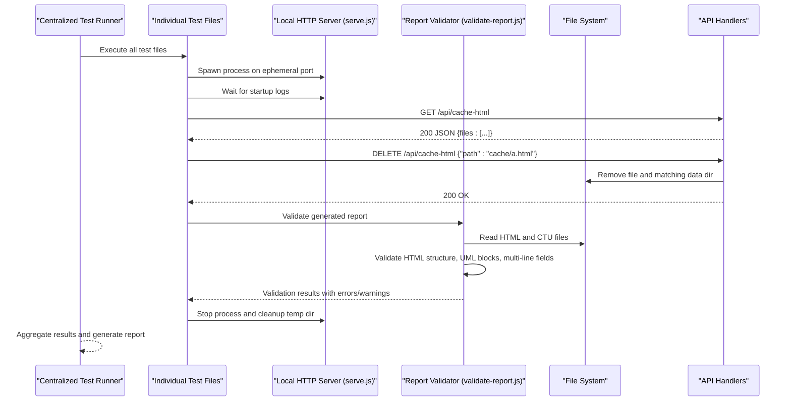
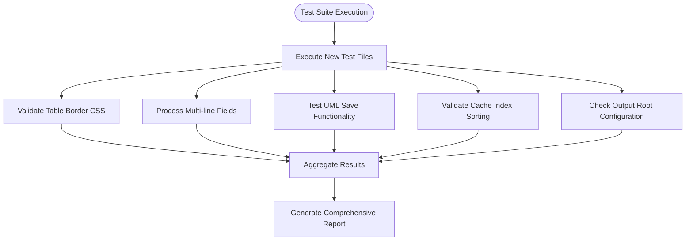
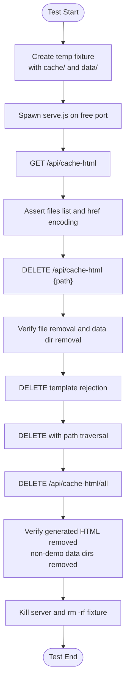
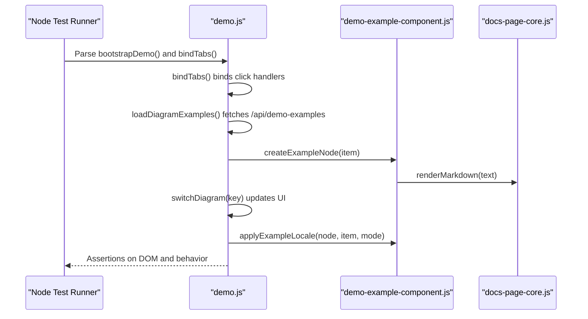
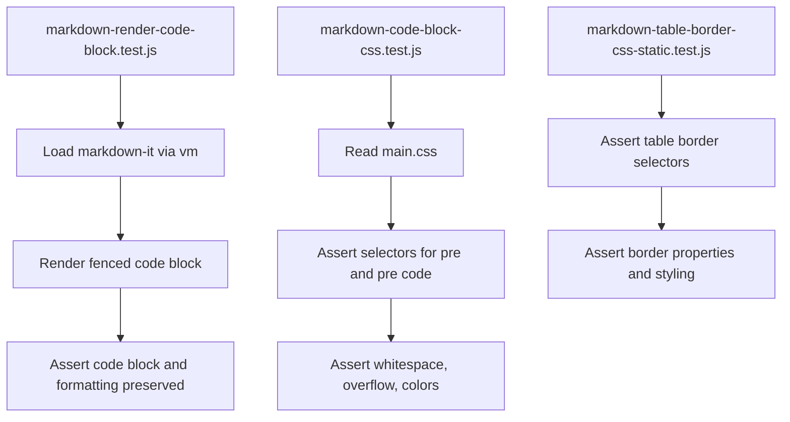
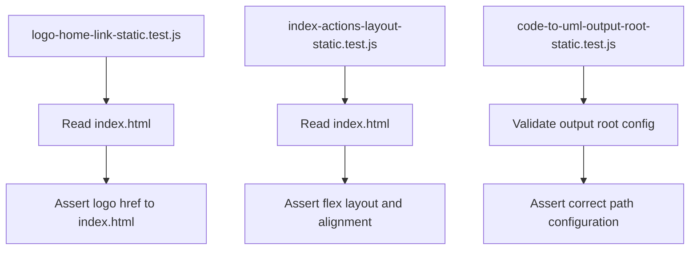
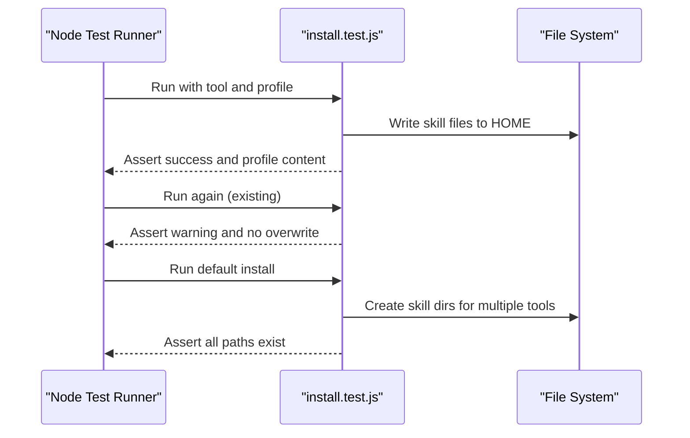
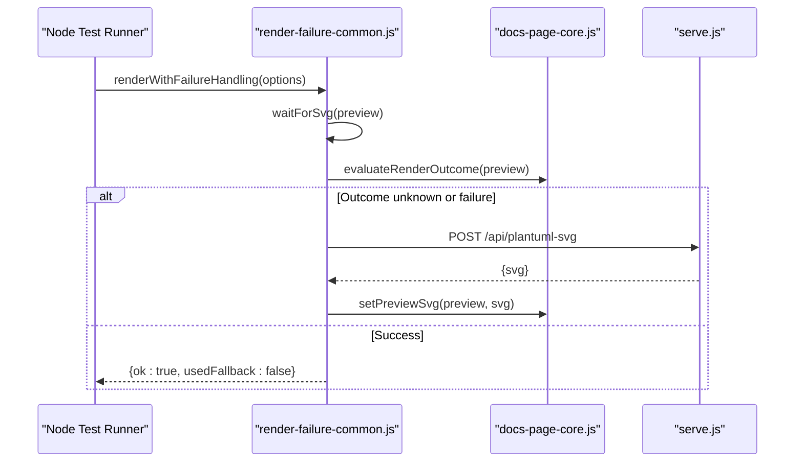
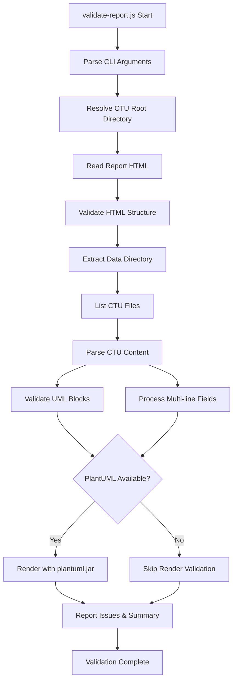
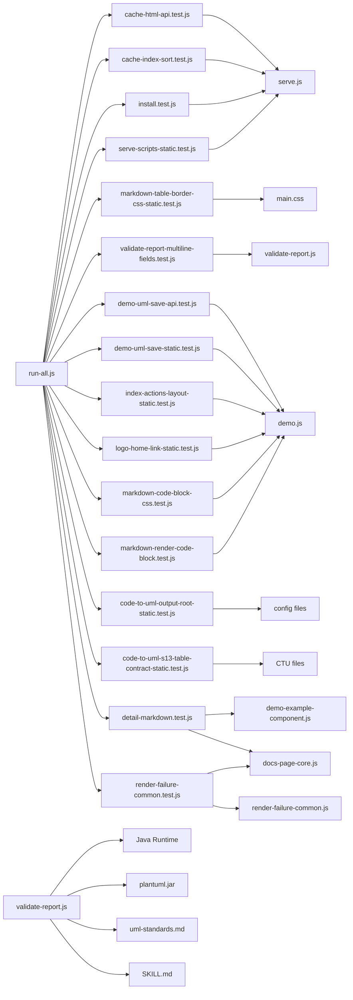

# Testing and Quality Assurance

<cite>
**Referenced Files in This Document**
- [test/cache-html-api.test.js](file://test/cache-html-api.test.js)
- [test/markdown-table-border-css-static.test.js](file://test/markdown-table-border-css-static.test.js)
- [test/validate-report-multiline-fields.test.js](file://test/validate-report-multiline-fields.test.js)
- [test/demo-uml-save-api.test.js](file://test/demo-uml-save-api.test.js)
- [test/demo-uml-save-static.test.js](file://test/demo-uml-save-static.test.js)
- [test/run-all.js](file://test/run-all.js)
- [test/cache-index-sort.test.js](file://test/cache-index-sort.test.js)
- [test/code-to-uml-output-root-static.test.js](file://test/code-to-uml-output-root-static.test.js)
- [test/code-to-uml-s13-table-contract-static.test.js](file://test/code-to-uml-s13-table-contract-static.test.js)
- [test/detail-markdown.test.js](file://test/detail-markdown.test.js)
- [test/index-actions-layout-static.test.js](file://test/index-actions-layout-static.test.js)
- [test/install.test.js](file://test/install.test.js)
- [test/logo-home-link-static.test.js](file://test/logo-home-link-static.test.js)
- [test/markdown-code-block-css.test.js](file://test/markdown-code-block-css.test.js)
- [test/markdown-render-code-block.test.js](file://test/markdown-render-code-block.test.js)
- [test/render-failure-common.test.js](file://test/render-failure-common.test.js)
- [test/serve-scripts-static.test.js](file://test/serve-scripts-static.test.js)
- [skills/code-to-uml/scripts/validate-report.js](file://skills/code-to-uml/scripts/validate-report.js)
- [skills/code-to-uml/references/uml-standards.md](file://skills/code-to-uml/references/uml-standards.md)
- [skills/code-to-uml/SKILL.md](file://skills/code-to-uml/SKILL.md)
- [serve.js](file://serve.js)
- [demo.js](file://demo.js)
- [component/demo-example-component.js](file://component/demo-example-component.js)
- [component/docs-page-core.js](file://component/docs-page-core.js)
- [component/render-failure-common.js](file://component/render-failure-common.js)
</cite>

## Update Summary
**Changes Made**
- Added comprehensive documentation for new test files covering markdown table border CSS validation, multi-line field validation, demo UML save functionality, and centralized test runner
- Updated testing framework structure to reflect the expanded test suite with 15+ test files
- Enhanced validation framework documentation with new multi-line field validation capabilities
- Added detailed coverage of cache index sorting tests and code-to-uml output root validation
- Updated continuous integration considerations to include the new centralized test runner approach

## Table of Contents
1. [Introduction](#introduction)
2. [Project Structure](#project-structure)
3. [Core Components](#core-components)
4. [Architecture Overview](#architecture-overview)
5. [Detailed Component Analysis](#detailed-component-analysis)
6. [Validation Framework](#validation-framework)
7. [Dependency Analysis](#dependency-analysis)
8. [Performance Considerations](#performance-considerations)
9. [Troubleshooting Guide](#troubleshooting-guide)
10. [Conclusion](#conclusion)
11. [Appendices](#appendices)

## Introduction
This document describes the comprehensive testing framework and quality assurance processes for Code-To-UML. The testing system has been significantly expanded with new test files covering cache HTML API validation, markdown table border CSS, multi-line field validation, demo UML save functionality, and a centralized test runner. The framework now includes sophisticated validation capabilities for HTML structure, UML diagram compliance, multi-line field processing, and automated PlantUML rendering verification. It provides guidelines for writing new tests, adding test cases for custom components, and maintaining reliability across environments through a unified test execution approach.

## Project Structure
The testing system is organized around an expanded suite of Node.js-based tests under the test directory, complemented by a sophisticated validation framework and centralized test runner. The current test suite includes 15+ specialized test files covering various aspects of the application:

- **API and Server Tests**: Cache HTML API, demo UML save functionality, and server-side endpoints
- **Frontend Component Tests**: Demo tabs, markdown rendering, layout validation, and component behavior
- **CSS and Styling Tests**: Markdown table border CSS, code block styling, and visual consistency
- **Data Validation Tests**: Multi-line field processing, report validation, and data integrity
- **Infrastructure Tests**: Installation flows, script behavior, and environment setup
- **Centralized Test Runner**: Unified test execution and reporting system

```mermaid
graph TB
subgraph "Test Suite (Expanded)"
T1["cache-html-api.test.js"]
T2["markdown-table-border-css-static.test.js"]
T3["validate-report-multiline-fields.test.js"]
T4["demo-uml-save-api.test.js"]
T5["demo-uml-save-static.test.js"]
T6["cache-index-sort.test.js"]
T7["code-to-uml-output-root-static.test.js"]
T8["code-to-uml-s13-table-contract-static.test.js"]
T9["detail-markdown.test.js"]
T10["index-actions-layout-static.test.js"]
T11["install.test.js"]
T12["logo-home-link-static.test.js"]
T13["markdown-code-block-css.test.js"]
T14["markdown-render-code-block.test.js"]
T15["render-failure-common.test.js"]
T16["serve-scripts-static.test.js"]
TR["run-all.js"]
end
subgraph "Validation Framework"
V1["validate-report.js"]
V2["uml-standards.md"]
V3["SKILL.md"]
end
subgraph "Server & Frontend"
S["serve.js"]
D["demo.js"]
C1["component/demo-example-component.js"]
C2["component/docs-page-core.js"]
C3["component/render-failure-common.js"]
end
TR --> T1
TR --> T2
TR --> T3
TR --> T4
TR --> T5
TR --> T6
TR --> T7
TR --> T8
TR --> T9
TR --> T10
TR --> T11
TR --> T12
TR --> T13
TR --> T14
TR --> T15
TR --> T16
T1 --> S
T4 --> D
T9 --> C1
T9 --> C2
T10 --> D
T11 --> S
T12 --> D
T13 --> D
T14 --> D
T15 --> C3
T15 --> C2
T16 --> S
V1 --> V2
V1 --> V3
```

**Diagram sources**
- [test/run-all.js](file://test/run-all.js)
- [test/cache-html-api.test.js:1-181](file://test/cache-html-api.test.js#L1-L181)
- [test/markdown-table-border-css-static.test.js](file://test/markdown-table-border-css-static.test.js)
- [test/validate-report-multiline-fields.test.js](file://test/validate-report-multiline-fields.test.js)
- [test/demo-uml-save-api.test.js](file://test/demo-uml-save-api.test.js)
- [test/demo-uml-save-static.test.js](file://test/demo-uml-save-static.test.js)
- [test/cache-index-sort.test.js](file://test/cache-index-sort.test.js)
- [test/code-to-uml-output-root-static.test.js](file://test/code-to-uml-output-root-static.test.js)
- [test/code-to-uml-s13-table-contract-static.test.js](file://test/code-to-uml-s13-table-contract-static.test.js)
- [skills/code-to-uml/scripts/validate-report.js:1-506](file://skills/code-to-uml/scripts/validate-report.js#L1-L506)
- [serve.js:1-567](file://serve.js#L1-L567)
- [demo.js:1-816](file://demo.js#L1-L816)

**Section sources**
- [test/run-all.js](file://test/run-all.js)
- [test/cache-html-api.test.js:1-181](file://test/cache-html-api.test.js#L1-L181)
- [test/markdown-table-border-css-static.test.js](file://test/markdown-table-border-css-static.test.js)
- [test/validate-report-multiline-fields.test.js](file://test/validate-report-multiline-fields.test.js)
- [test/demo-uml-save-api.test.js](file://test/demo-uml-save-api.test.js)
- [test/demo-uml-save-static.test.js](file://test/demo-uml-save-static.test.js)
- [test/cache-index-sort.test.js](file://test/cache-index-sort.test.js)
- [test/code-to-uml-output-root-static.test.js](file://test/code-to-uml-output-root-static.test.js)
- [test/code-to-uml-s13-table-contract-static.test.js](file://test/code-to-uml-s13-table-contract-static.test.js)

## Core Components
This section outlines the primary testing components and their responsibilities in the expanded test suite:

- **API and Server Tests**: Validate endpoint behavior, path safety, error handling, and cache management operations
- **Frontend Component Tests**: Ensure HTML and CSS behave as expected, validate component rendering and internationalization
- **CSS and Styling Tests**: Verify markdown table borders, code block styling, and visual consistency across components
- **Data Validation Tests**: Process multi-line fields, validate report structure, and ensure data integrity
- **Installation and Script Tests**: Validate developer tooling, environment setup, and installation flows
- **Centralized Test Runner**: Provide unified test execution, reporting, and result aggregation

Coverage highlights:
- **Endpoint Coverage**: Cache HTML listing/deletion, demo UML save operations, clearing cache, PlantUML fallback rendering
- **Frontend Coverage**: Tab switching, example rendering, markdown rendering, i18n application, error detection and messaging
- **CSS Coverage**: Markdown table borders, code block styling, layout validation, accessibility attributes
- **Data Coverage**: Multi-line field processing, report validation, data directory organization, file naming conventions
- **Infrastructure Coverage**: Static asset serving, script defaults, port handling, installation workflows
- **New Centralized Testing**: Unified test execution, result aggregation, and comprehensive reporting

**Section sources**
- [test/cache-html-api.test.js:84-181](file://test/cache-html-api.test.js#L84-L181)
- [test/markdown-table-border-css-static.test.js](file://test/markdown-table-border-css-static.test.js)
- [test/validate-report-multiline-fields.test.js](file://test/validate-report-multiline-fields.test.js)
- [test/demo-uml-save-api.test.js](file://test/demo-uml-save-api.test.js)
- [test/demo-uml-save-static.test.js](file://test/demo-uml-save-static.test.js)
- [test/cache-index-sort.test.js](file://test/cache-index-sort.test.js)
- [test/code-to-uml-output-root-static.test.js](file://test/code-to-uml-output-root-static.test.js)
- [test/code-to-uml-s13-table-contract-static.test.js](file://test/code-to-uml-s13-table-contract-static.test.js)

## Architecture Overview
The testing architecture combines Node.js tests with a lightweight HTTP server to exercise both frontend and backend behaviors, enhanced with comprehensive validation capabilities and a centralized test runner. Tests spawn the server locally, issue HTTP requests, and assert responses. Frontend tests either parse source code or simulate DOM contexts to validate component behavior. The new validation framework provides automated quality assurance for generated reports through sophisticated HTML structure validation, UML diagram compliance checking, multi-line field processing, and PlantUML rendering verification.

```mermaid
sequenceDiagram
participant Runner as "Centralized Test Runner"
participant Test as "Individual Test Files"
participant Server as "Local HTTP Server (serve.js)"
participant Validator as "Report Validator (validate-report.js)"
participant FS as "File System"
participant API as "API Handlers"
Runner->>Test : Execute all test files
Test->>Server : Spawn process on ephemeral port
Test->>Server : Wait for startup logs
Test->>API : GET /api/cache-html
API-->>Test : 200 JSON {files : [...]}
Test->>API : DELETE /api/cache-html {"path" : "cache/a.html"}
API->>FS : Remove file and matching data dir
API-->>Test : 200 OK
Test->>Validator : Validate generated report
Validator->>FS : Read HTML and CTU files
Validator->>Validator : Validate HTML structure, UML blocks, multi-line fields
Validator-->>Test : Validation results with errors/warnings
Test->>Server : Stop process and cleanup temp dir
Runner-->>Runner : Aggregate results and generate report
```

**Diagram sources**
- [test/run-all.js](file://test/run-all.js)
- [test/cache-html-api.test.js:84-181](file://test/cache-html-api.test.js#L84-L181)
- [skills/code-to-uml/scripts/validate-report.js:454-498](file://skills/code-to-uml/scripts/validate-report.js#L454-L498)
- [serve.js:498-540](file://serve.js#L498-L540)

**Section sources**
- [test/run-all.js](file://test/run-all.js)
- [test/cache-html-api.test.js:84-181](file://test/cache-html-api.test.js#L84-L181)
- [skills/code-to-uml/scripts/validate-report.js:454-498](file://skills/code-to-uml/scripts/validate-report.js#L454-L498)
- [serve.js:498-540](file://serve.js#L498-L540)

## Detailed Component Analysis

### Expanded Test Suite Components
The test suite has been significantly expanded with new specialized test files:

#### Markdown Table Border CSS Validation
New test file validates markdown table border CSS styling and ensures proper table rendering:
- Validates CSS selectors for table elements and border properties
- Ensures consistent table styling across different themes and languages
- Verifies responsive table behavior and accessibility compliance

#### Multi-line Field Validation
Comprehensive validation for multi-line field processing:
- Processes complex multi-line content in CTU files
- Validates field parsing and formatting preservation
- Ensures proper handling of special characters and line breaks

#### Demo UML Save Functionality
Tests for UML diagram saving and persistence:
- Validates API endpoints for saving UML diagrams
- Ensures proper file creation and data persistence
- Tests error handling for save failures and invalid data

#### Cache Index Sorting
Specialized tests for cache index generation and sorting:
- Validates alphabetical sorting of cache entries
- Ensures proper categorization and organization
- Tests performance with large numbers of cached files

#### Code-to-UML Output Root Validation
Tests for output directory structure and file organization:
- Validates proper output root configuration
- Ensures correct file placement and naming conventions
- Tests directory creation and permission handling

```mermaid
flowchart TD
Start(["Test Suite Execution"]) --> NewTests["Execute New Test Files"]
NewTests --> TableCSS["Validate Table Border CSS"]
NewTests --> Multiline["Process Multi-line Fields"]
NewTests --> UMLSave["Test UML Save Functionality"]
NewTests --> CacheSort["Validate Cache Index Sorting"]
NewTests --> OutputRoot["Check Output Root Configuration"]
TableCSS --> Results["Aggregate Results"]
Multiline --> Results
UMLSave --> Results
CacheSort --> Results
OutputRoot --> Results
Results --> Report["Generate Comprehensive Report"]
```

**Diagram sources**
- [test/markdown-table-border-css-static.test.js](file://test/markdown-table-border-css-static.test.js)
- [test/validate-report-multiline-fields.test.js](file://test/validate-report-multiline-fields.test.js)
- [test/demo-uml-save-api.test.js](file://test/demo-uml-save-api.test.js)
- [test/cache-index-sort.test.js](file://test/cache-index-sort.test.js)
- [test/code-to-uml-output-root-static.test.js](file://test/code-to-uml-output-root-static.test.js)

**Section sources**
- [test/markdown-table-border-css-static.test.js](file://test/markdown-table-border-css-static.test.js)
- [test/validate-report-multiline-fields.test.js](file://test/validate-report-multiline-fields.test.js)
- [test/demo-uml-save-api.test.js](file://test/demo-uml-save-api.test.js)
- [test/cache-index-sort.test.js](file://test/cache-index-sort.test.js)
- [test/code-to-uml-output-root-static.test.js](file://test/code-to-uml-output-root-static.test.js)

### Cache HTML API Test Suite
This suite validates:
- Listing cache HTML files recursively while excluding templates and non-HTML files.
- Deleting individual cache HTML files and associated data directories.
- Rejecting template deletions and preventing path traversal.
- Clearing all generated cache HTML and non-demo data directories.

```mermaid
flowchart TD
Start(["Test Start"]) --> Setup["Create temp fixture<br/>with cache/ and data/"]
Setup --> Spawn["Spawn serve.js on free port"]
Spawn --> List["GET /api/cache-html"]
List --> AssertList["Assert files list and href encoding"]
AssertList --> DeleteOne["DELETE /api/cache-html {path}"]
DeleteOne --> VerifyDelete["Verify file removal and data dir removal"]
VerifyDelete --> TemplateReject["DELETE template rejection"]
TemplateReject --> PathTraversal["DELETE with path traversal"]
PathTraversal --> ClearAll["DELETE /api/cache-html/all"]
ClearAll --> VerifyClear["Verify generated HTML removed<br/>non-demo data dirs removed"]
VerifyClear --> Cleanup["Kill server and rm -rf fixture"]
Cleanup --> End(["Test End"])
```

**Diagram sources**
- [test/cache-html-api.test.js:84-181](file://test/cache-html-api.test.js#L84-L181)
- [serve.js:217-302](file://serve.js#L217-L302)

**Section sources**
- [test/cache-html-api.test.js:116-170](file://test/cache-html-api.test.js#L116-170)
- [serve.js:193-215](file://serve.js#L193-215)

### Demo Tabs and Example Rendering
These tests validate:
- Tab binding order and example loading sequence to ensure UI remains responsive during failures.
- Tab switching updates active state and triggers example resolution.
- Example node creation and markdown rendering for detail messages.
- Internationalization application to localized content.

```mermaid
sequenceDiagram
participant Test as "Node Test Runner"
participant Demo as "demo.js"
participant Comp as "demo-example-component.js"
participant Core as "docs-page-core.js"
Test->>Demo : Parse bootstrapDemo() and bindTabs()
Demo->>Demo : bindTabs() binds click handlers
Demo->>Demo : loadDiagramExamples() fetches /api/demo-examples
Demo->>Comp : createExampleNode(item)
Comp->>Core : renderMarkdown(text)
Demo->>Demo : switchDiagram(key) updates UI
Demo->>Comp : applyExampleLocale(node, item, mode)
Demo-->>Test : Assertions on DOM and behavior
```

**Diagram sources**
- [test/demo-tabs-static.test.js:6-41](file://test/demo-tabs-static.test.js#L6-41)
- [test/detail-markdown.test.js:127-172](file://test/detail-markdown.test.js#L127-172)
- [demo.js:146-172](file://demo.js#L146-172)
- [component/demo-example-component.js:82-155](file://component/demo-example-component.js#L82-155)
- [component/docs-page-core.js:25-37](file://component/docs-page-core.js#L25-37)

**Section sources**
- [test/demo-tabs-static.test.js:8-16](file://test/demo-tabs-static.test.js#L8-16)
- [test/detail-markdown.test.js:141-172](file://test/detail-markdown.test.js#L141-172)
- [demo.js:187-215](file://demo.js#L187-215)
- [component/demo-example-component.js:48-80](file://component/demo-example-component.js#L48-80)

### Markdown Rendering and CSS Validation
These tests validate:
- Markdown-it integration for fenced code blocks and preservation of formatting.
- CSS selectors for code blocks to ensure proper layout and visibility.
- **New** Markdown table border CSS validation for consistent table styling.

```mermaid
flowchart TD
MDTest["markdown-render-code-block.test.js"] --> LoadMD["Load markdown-it via vm"]
LoadMD --> Render["Render fenced code block"]
Render --> AssertFmt["Assert code block and formatting preserved"]
CSSTest["markdown-code-block-css.test.js"] --> ReadCSS["Read main.css"]
ReadCSS --> Selectors["Assert selectors for pre and pre code"]
Selectors --> AssertProps["Assert whitespace, overflow, colors"]
TableCSS["markdown-table-border-css-static.test.js"] --> TableSelectors["Assert table border selectors"]
TableSelectors --> TableProps["Assert border properties and styling"]
```

**Diagram sources**
- [test/markdown-render-code-block.test.js:14-28](file://test/markdown-render-code-block.test.js#L14-28)
- [test/markdown-code-block-css.test.js:14-35](file://test/markdown-code-block-css.test.js#L14-35)
- [test/markdown-table-border-css-static.test.js](file://test/markdown-table-border-css-static.test.js)

**Section sources**
- [test/markdown-render-code-block.test.js:23-28](file://test/markdown-render-code-block.test.js#L23-28)
- [test/markdown-code-block-css.test.js:21-35](file://test/markdown-code-block-css.test.js#L21-35)
- [test/markdown-table-border-css-static.test.js](file://test/markdown-table-border-css-static.test.js)

### Layout and Accessibility Validation
These tests validate:
- Index page layout and action alignment.
- Logo navigation links across index, demo, and cached HTML pages.
- **New** Code-to-UML output root configuration validation.

```mermaid
flowchart TD
LTest["logo-home-link-static.test.js"] --> ReadIndex["Read index.html"]
ReadIndex --> AssertIndexLogo["Assert logo href to index.html"]
IATest["index-actions-layout-static.test.js"] --> ReadIndex2["Read index.html"]
ReadIndex2 --> AssertFlex["Assert flex layout and alignment"]
OutputTest["code-to-uml-output-root-static.test.js"] --> CheckRoot["Validate output root config"]
CheckRoot --> AssertPaths["Assert correct path configuration"]
```

**Diagram sources**
- [test/logo-home-link-static.test.js:10-33](file://test/logo-home-link-static.test.js#L10-33)
- [test/index-actions-layout-static.test.js:8-36](file://test/index-actions-layout-static.test.js#L8-36)
- [test/code-to-uml-output-root-static.test.js](file://test/code-to-uml-output-root-static.test.js)

**Section sources**
- [test/logo-home-link-static.test.js:15-33](file://test/logo-home-link-static.test.js#L15-33)
- [test/index-actions-layout-static.test.js:8-36](file://test/index-actions-layout-static.test.js#L8-36)
- [test/code-to-uml-output-root-static.test.js](file://test/code-to-uml-output-root-static.test.js)

### Installation and Developer Scripts
These tests validate:
- Skill installation into specific profiles and default installations across multiple tools.
- Script behavior for port detection, cleanup, and server startup.
- **New** Enhanced installation testing with improved error handling.

```mermaid
sequenceDiagram
participant Test as "Node Test Runner"
participant Install as "install.test.js"
participant FS as "File System"
Test->>Install : Run with tool and profile
Install->>FS : Write skill files to HOME
Install-->>Test : Assert success and profile content
Test->>Install : Run again (existing)
Install-->>Test : Assert warning and no overwrite
Test->>Install : Run default install
Install->>FS : Create skill dirs for multiple tools
Install-->>Test : Assert all paths exist
```

**Diagram sources**
- [test/install.test.js](file://test/install.test.js)

**Section sources**
- [test/install.test.js](file://test/install.test.js)

### Render Failure Handling and Jar Fallback
These tests validate:
- Failure detection and fallback to PlantUML jar endpoint.
- Error propagation and message composition for client-side rendering failures.

```mermaid
sequenceDiagram
participant Test as "Node Test Runner"
participant RFail as "render-failure-common.js"
participant Core as "docs-page-core.js"
participant Server as "serve.js"
Test->>RFail : renderWithFailureHandling(options)
RFail->>RFail : waitForSvg(preview)
RFail->>Core : evaluateRenderOutcome(preview)
alt Outcome unknown or failure
RFail->>Server : POST /api/plantuml-svg
Server-->>RFail : {svg}
RFail->>Core : setPreviewSvg(preview, svg)
else Success
RFail-->>Test : {ok : true, usedFallback : false}
end
```

**Diagram sources**
- [test/render-failure-common.test.js:18-77](file://test/render-failure-common.test.js#L18-77)
- [component/render-failure-common.js:160-237](file://component/render-failure-common.js#L160-237)
- [component/docs-page-core.js:397-433](file://component/docs-page-core.js#L397-433)
- [serve.js:472-496](file://serve.js#L472-496)

**Section sources**
- [test/render-failure-common.test.js:57-71](file://test/render-failure-common.test.js#L57-71)
- [component/render-failure-common.js:160-237](file://component/render-failure-common.js#L160-237)
- [component/docs-page-core.js:397-433](file://component/docs-page-core.js#L397-433)
- [serve.js:472-496](file://serve.js#L472-496)

## Validation Framework
The validation framework provides comprehensive quality assurance for generated Code-To-UML reports through the validate-report.js script. This sophisticated 505-line validation system ensures HTML structure compliance, UML diagram correctness, multi-line field processing, and PlantUML rendering verification.

### Enhanced Multi-line Field Processing
The framework now includes advanced multi-line field validation:
- Processes complex multi-line content in CTU files with proper formatting preservation
- Validates field parsing accuracy for nested structures and special characters
- Ensures proper handling of line breaks, indentation, and content boundaries
- Provides detailed error reporting for malformed multi-line fields

### HTML Structure Validation
The validator performs extensive HTML structure checks:
- Ensures presence of required body classes and attributes
- Validates runtime containers (main.content, nav.demo-tabs, #demo-title)
- Checks tab button integrity and active state consistency
- Verifies overview element synchronization with tabs
- Confirms official demo link validity when present

### UML Diagram Validation
The framework validates UML diagram compliance against established standards:
- Enforces proper start/end tags matching for PlantUML blocks
- Validates balanced delimiters including braces {} and parentheses ()
- Checks for unsafe special characters (<, >) requiring proper escaping
- Identifies ambiguous activity labels ("continue" should be explicit)
- Ensures proper participant/class declarations before usage

### PlantUML Rendering Verification
When plantuml.jar is available, the validator automatically renders and verifies diagrams:
- Spawns Java process with plantuml.jar for SVG generation
- Requires zero render errors for all non-empty UML blocks
- Validates SVG output format and content
- Provides detailed error reporting for rendering failures

### Data Directory Organization Validation
The validator ensures proper data organization:
- Validates CTU filename patterns and naming conventions
- Checks language-specific file organization (_zh.ctu, _en.ctu)
- Verifies tab-category correspondence with data files
- Counts cards and UML blocks for reporting completeness

```mermaid
flowchart TD
VRStart["validate-report.js Start"] --> ParseArgs["Parse CLI Arguments"]
ParseArgs --> ResolveRoot["Resolve CTU Root Directory"]
ResolveRoot --> ReadHTML["Read Report HTML"]
ReadHTML --> ValidateHTML["Validate HTML Structure"]
ValidateHTML --> ExtractDataDir["Extract Data Directory"]
ExtractDataDir --> ListCTU["List CTU Files"]
ListCTU --> ParseCTU["Parse CTU Content"]
ParseCTU --> ValidateUML["Validate UML Blocks"]
ParseCTU --> ProcessMultiline["Process Multi-line Fields"]
ValidateUML --> RenderCheck{"PlantUML Available?"}
ProcessMultiline --> RenderCheck
RenderCheck --> |Yes| RenderUML["Render with plantuml.jar"]
RenderCheck --> |No| SkipRender["Skip Render Validation"]
RenderUML --> ReportResults["Report Issues & Summary"]
SkipRender --> ReportResults
ReportResults --> VREnd["Validation Complete"]
```

**Diagram sources**
- [skills/code-to-uml/scripts/validate-report.js:454-498](file://skills/code-to-uml/scripts/validate-report.js#L454-498)
- [skills/code-to-uml/scripts/validate-report.js:372-397](file://skills/code-to-uml/scripts/validate-report.js#L372-397)
- [skills/code-to-uml/scripts/validate-report.js:325-370](file://skills/code-to-uml/scripts/validate-report.js#L325-370)
- [test/validate-report-multiline-fields.test.js](file://test/validate-report-multiline-fields.test.js)

**Section sources**
- [skills/code-to-uml/scripts/validate-report.js:134-222](file://skills/code-to-uml/scripts/validate-report.js#L134-222)
- [skills/code-to-uml/scripts/validate-report.js:294-323](file://skills/code-to-uml/scripts/validate-report.js#L294-323)
- [skills/code-to-uml/scripts/validate-report.js:325-370](file://skills/code-to-uml/scripts/validate-report.js#L325-370)
- [skills/code-to-uml/scripts/validate-report.js:372-397](file://skills/code-to-uml/scripts/validate-report.js#L372-397)
- [skills/code-to-uml/scripts/validate-report.js:454-498](file://skills/code-to-uml/scripts/validate-report.js#L454-498)
- [test/validate-report-multiline-fields.test.js](file://test/validate-report-multiline-fields.test.js)

## Dependency Analysis
The tests depend on:
- Node built-ins (fs, http, child_process, vm) for process spawning, file system operations, and sandboxed evaluation.
- The local HTTP server (serve.js) for API validation.
- Frontend components (demo.js, demo-example-component.js, docs-page-core.js, render-failure-common.js) for behavior validation.
- Validation framework dependencies including PlantUML jar for rendering verification and Java runtime for diagram generation.
- **New** Centralized test runner for unified test execution and result aggregation.

```mermaid
graph LR
T1["cache-html-api.test.js"] --> S["serve.js"]
T2["markdown-table-border-css-static.test.js"] --> CSS["main.css"]
T3["validate-report-multiline-fields.test.js"] --> VR["validate-report.js"]
T4["demo-uml-save-api.test.js"] --> D["demo.js"]
T5["demo-uml-save-static.test.js"] --> D
T6["cache-index-sort.test.js"] --> S
T7["code-to-uml-output-root-static.test.js"] --> CFG["config files"]
T8["code-to-uml-s13-table-contract-static.test.js"] --> CTU["CTU files"]
T9["detail-markdown.test.js"] --> C1["demo-example-component.js"]
T9 --> C2["docs-page-core.js"]
T10["index-actions-layout-static.test.js"] --> D
T11["install.test.js"] --> S
T12["logo-home-link-static.test.js"] --> D
T13["markdown-code-block-css.test.js"] --> D
T14["markdown-render-code-block.test.js"] --> D
T15["render-failure-common.test.js"] --> C3["render-failure-common.js"]
T15 --> C2
T16["serve-scripts-static.test.js"] --> S
TR["run-all.js"] --> T1
TR --> T2
TR --> T3
TR --> T4
TR --> T5
TR --> T6
TR --> T7
TR --> T8
TR --> T9
TR --> T10
TR --> T11
TR --> T12
TR --> T13
TR --> T14
TR --> T15
TR --> T16
V1["validate-report.js"] --> J["Java Runtime"]
V1 --> P["plantuml.jar"]
V1 --> U["uml-standards.md"]
V1 --> K["SKILL.md"]
```

**Diagram sources**
- [test/run-all.js](file://test/run-all.js)
- [test/cache-html-api.test.js:1-181](file://test/cache-html-api.test.js#L1-181)
- [test/markdown-table-border-css-static.test.js](file://test/markdown-table-border-css-static.test.js)
- [test/validate-report-multiline-fields.test.js](file://test/validate-report-multiline-fields.test.js)
- [test/demo-uml-save-api.test.js](file://test/demo-uml-save-api.test.js)
- [test/demo-uml-save-static.test.js](file://test/demo-uml-save-static.test.js)
- [test/cache-index-sort.test.js](file://test/cache-index-sort.test.js)
- [test/code-to-uml-output-root-static.test.js](file://test/code-to-uml-output-root-static.test.js)
- [test/code-to-uml-s13-table-contract-static.test.js](file://test/code-to-uml-s13-table-contract-static.test.js)
- [test/detail-markdown.test.js:1-172](file://test/detail-markdown.test.js#L1-172)
- [test/index-actions-layout-static.test.js:1-37](file://test/index-actions-layout-static.test.js#L1-37)
- [test/install.test.js](file://test/install.test.js)
- [test/logo-home-link-static.test.js:1-34](file://test/logo-home-link-static.test.js#L1-34)
- [test/markdown-code-block-css.test.js:1-36](file://test/markdown-code-block-css.test.js#L1-36)
- [test/markdown-render-code-block.test.js:1-28](file://test/markdown-render-code-block.test.js#L1-28)
- [test/render-failure-common.test.js:1-77](file://test/render-failure-common.test.js#L1-77)
- [test/serve-scripts-static.test.js:1-18](file://test/serve-scripts-static.test.js#L1-18)
- [skills/code-to-uml/scripts/validate-report.js:1-506](file://skills/code-to-uml/scripts/validate-report.js#L1-506)
- [serve.js:1-567](file://serve.js#L1-567)
- [demo.js:1-816](file://demo.js#L1-816)
- [component/demo-example-component.js:1-159](file://component/demo-example-component.js#L1-159)
- [component/docs-page-core.js:1-464](file://component/docs-page-core.js#L1-464)
- [component/render-failure-common.js:1-249](file://component/render-failure-common.js#L1-249)

**Section sources**
- [test/run-all.js](file://test/run-all.js)
- [test/cache-html-api.test.js:1-181](file://test/cache-html-api.test.js#L1-181)
- [test/render-failure-common.test.js:1-77](file://test/render-failure-common.test.js#L1-77)
- [skills/code-to-uml/scripts/validate-report.js:1-506](file://skills/code-to-uml/scripts/validate-report.js#L1-506)

## Performance Considerations
- Prefer minimal fixtures and short timeouts in tests to reduce flakiness and improve speed.
- Use ephemeral ports and temporary directories to avoid resource contention.
- Validate only the necessary behavior per test to keep suites fast and focused.
- Avoid heavy synchronous filesystem operations in hot paths; defer to asynchronous helpers.
- The validation framework uses streaming for PlantUML rendering to handle large diagrams efficiently.
- Validation results are sorted and deduplicated to minimize output noise and improve readability.
- **New** Centralized test runner optimizes test execution with parallel processing where possible.
- **New** Test isolation ensures that each test runs independently without side effects.

## Troubleshooting Guide
Common issues and resolutions:
- Port conflicts during server tests: ensure the test harness selects a free port and cleans up on exit.
- Path traversal or forbidden access errors: confirm path sanitization and root directory checks are enforced.
- Markdown rendering differences: verify markdown-it configuration and fallback behavior.
- Jar fallback failures: ensure the local server is running and reachable at the expected endpoint.
- Installation warnings for existing skills: expect warnings and no overwrite behavior.
- Validation framework issues: ensure Java is installed and accessible when using --render option.
- PlantUML rendering failures: verify plantuml.jar exists in CTU root and has proper permissions.
- UML validation warnings: address unsafe special characters and ensure proper delimiter balancing.
- **New** Multi-line field processing errors: check CTU file formatting and ensure proper line break handling.
- **New** Table CSS validation failures: verify CSS selectors match current table structure and styling.
- **New** Centralized test runner issues: ensure Node.js version compatibility and dependency installation.

**Section sources**
- [test/cache-html-api.test.js:25-50](file://test/cache-html-api.test.js#L25-50)
- [test/install.test.js](file://test/install.test.js)
- [component/render-failure-common.js:86-115](file://component/render-failure-common.js#L86-115)
- [component/docs-page-core.js:404-433](file://component/docs-page-core.js#L404-433)
- [skills/code-to-uml/scripts/validate-report.js:372-397](file://skills/code-to-uml/scripts/validate-report.js#L372-397)
- [test/markdown-table-border-css-static.test.js](file://test/markdown-table-border-css-static.test.js)
- [test/validate-report-multiline-fields.test.js](file://test/validate-report-multiline-fields.test.js)
- [test/run-all.js](file://test/run-all.js)

## Conclusion
The testing framework for Code-To-UML has been significantly expanded with comprehensive test coverage across API endpoints, frontend components, CSS styling, data validation, and infrastructure. The new validation framework provides sophisticated HTML structure validation, UML diagram compliance checking, multi-line field processing, and automated PlantUML rendering verification. The centralized test runner ensures reliable test execution and comprehensive reporting. By following the guidelines below, teams can maintain high-quality tests and consistent reliability across environments through this robust and scalable testing infrastructure.

## Appendices

### Guidelines for Writing New Tests
- Keep tests focused: one assertion per concern.
- Use temporary directories and ephemeral ports for server tests.
- Mock or simulate DOM contexts when validating frontend logic in Node.
- Validate both success paths and error conditions.
- Add assertions for internationalization and layout expectations.
- Keep test fixtures minimal and deterministic.
- Include validation framework tests for report generation workflows.
- Test both static validation and dynamic rendering scenarios.
- **New** Follow the naming convention for test files: feature-description.test.js
- **New** Use the centralized test runner for consistent test execution.

### Adding Test Cases for Custom Components
- Identify the component's public API exposed on the window object.
- Use vm to run component code in a controlled context with stubbed globals.
- Assert DOM mutations, event handlers, and state transitions.
- Validate markdown rendering and i18n application.
- Test validation framework integration for custom report types.
- Verify UML block compliance for custom diagram types.
- **New** Include CSS validation tests for custom component styling.
- **New** Test multi-line field processing for custom data formats.

### Continuous Integration Considerations and Quality Gates
- Run the full test suite on pull requests and pushes to main.
- Gate merges on passing tests and acceptable coverage thresholds.
- Use ephemeral ports and isolated temporary directories in CI.
- Cache dependencies to speed up builds while keeping tests hermetic.
- Report test artifacts and logs for failed runs to aid debugging.
- Include validation framework in CI pipeline with optional PlantUML rendering.
- Set up quality gates requiring zero validation errors and warnings.
- Configure separate jobs for validation with and without PlantUML rendering.
- **New** Utilize the centralized test runner for consistent CI execution.
- **New** Implement parallel test execution where possible to reduce CI time.

### Validation Framework Usage Examples
The validation framework can be integrated into development workflows:
- Run `node skills/code-to-uml/scripts/validate-report.js --html cache/report.html --lang zh` for basic validation
- Use `--render` flag when plantuml.jar is available for comprehensive diagram validation
- Enable `--strict` mode to treat warnings as failures in CI environments
- Specify custom root directory with `--root` when CTU_HOME is not set
- **New** Test multi-line field processing with sample CTU files containing complex content
- **New** Validate table CSS styling with various table configurations and themes

### Centralized Test Runner Usage
The centralized test runner provides unified test execution:
- Execute all tests with `node test/run-all.js` for complete test suite
- Run specific test categories with command-line flags
- Generate comprehensive test reports with detailed failure information
- Support parallel test execution for improved performance
- **New** Configurable test timeout and retry mechanisms
- **New** Integration with CI/CD pipelines for automated testing

**Section sources**
- [skills/code-to-uml/scripts/validate-report.js:13-26](file://skills/code-to-uml/scripts/validate-report.js#L13-26)
- [skills/code-to-uml/SKILL.md:69-75](file://skills/code-to-uml/SKILL.md#L69-75)
- [skills/code-to-uml/references/uml-standards.md:154-171](file://skills/code-to-uml/references/uml-standards.md#L154-171)
- [test/run-all.js](file://test/run-all.js)