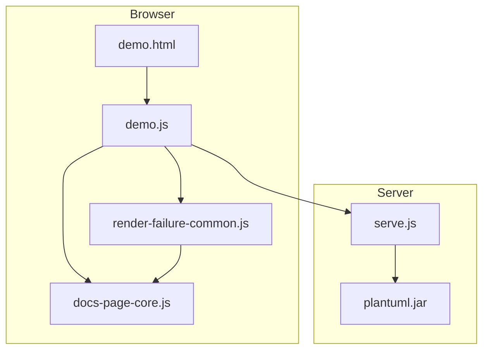
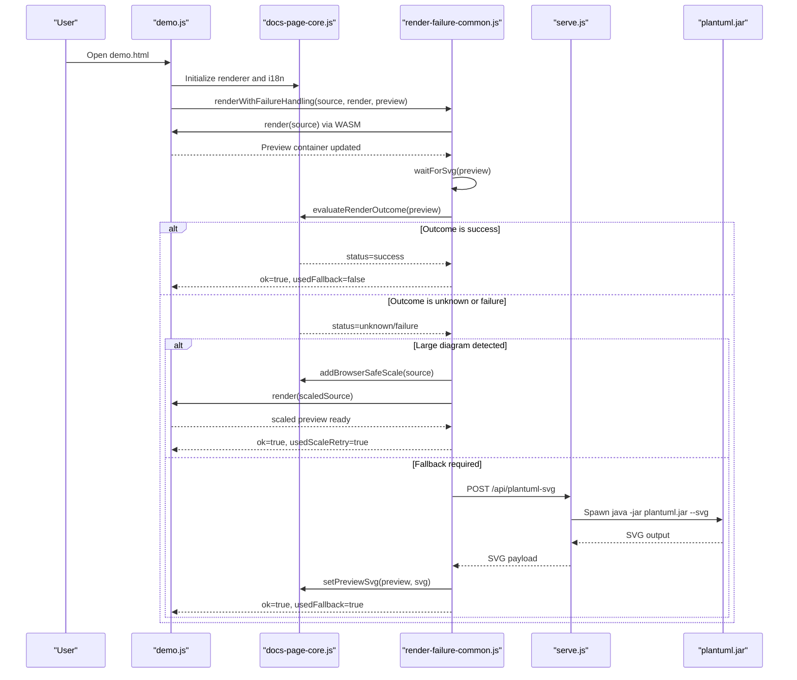
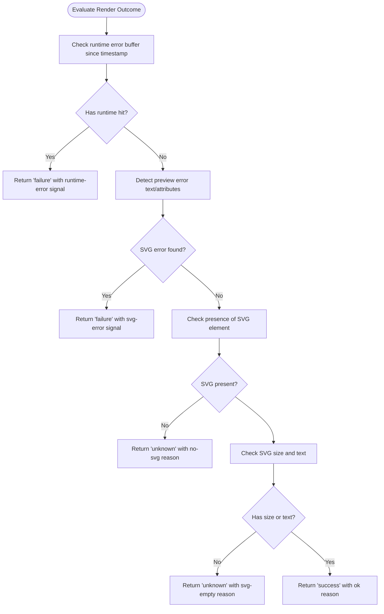
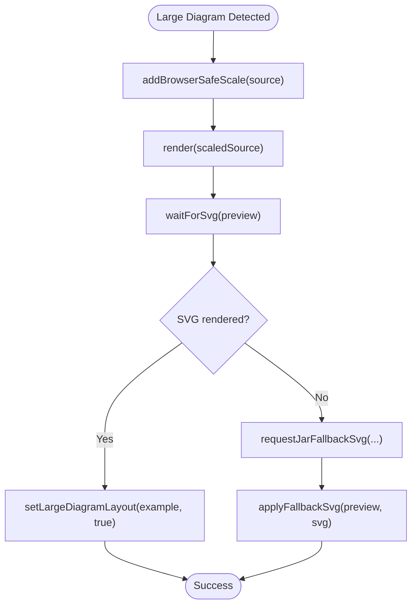
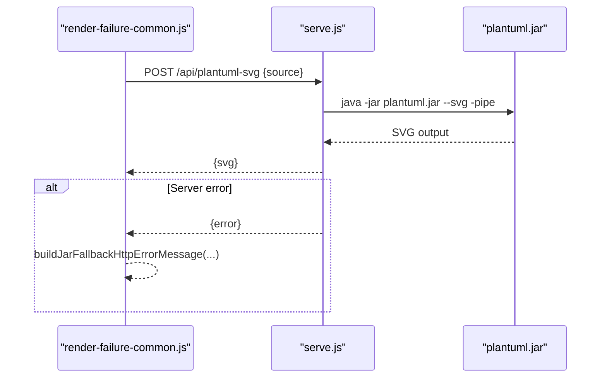
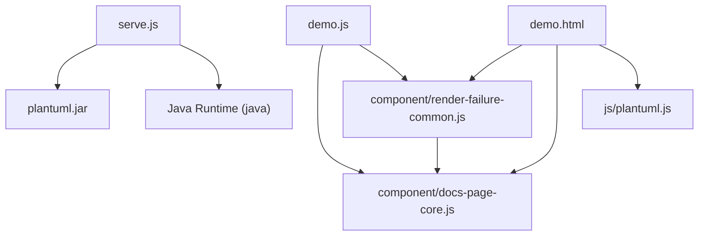

# Troubleshooting and FAQ

<cite>
**Referenced Files in This Document**
- [README.md](file://README.md)
- [README_zh.md](file://README_zh.md)
- [demo.html](file://demo.html)
- [demo.js](file://demo.js)
- [serve.js](file://serve.js)
- [component/render-failure-common.js](file://component/render-failure-common.js)
- [component/docs-page-core.js](file://component/docs-page-core.js)
- [test/render-failure-common.test.js](file://test/render-failure-common.test.js)
</cite>

## Table of Contents
1. [Introduction](#introduction)
2. [Project Structure](#project-structure)
3. [Core Components](#core-components)
4. [Architecture Overview](#architecture-overview)
5. [Detailed Component Analysis](#detailed-component-analysis)
6. [Dependency Analysis](#dependency-analysis)
7. [Performance Considerations](#performance-considerations)
8. [Troubleshooting Guide](#troubleshooting-guide)
9. [Conclusion](#conclusion)
10. [Appendices](#appendices)

## Introduction
This document provides comprehensive troubleshooting guidance for Code-To-UML, focusing on PlantUML rendering issues and their recovery mechanisms. It explains how the system detects rendering outcomes, handles timeouts and large diagrams, and falls back to server-side rendering when needed. It also covers browser compatibility, JavaScript runtime errors, and component rendering failures, with diagnostic procedures and step-by-step resolutions.

## Project Structure
Code-To-UML is a browser-first application that renders PlantUML diagrams using WASM with automatic fallback to a local Node.js server running plantuml.jar. The demo page loads PlantUML WASM and orchestrates rendering, while the server exposes a single endpoint for fallback rendering.

**Diagram sources**
- [demo.html:79-89](file://demo.html#L79-L89)
- [demo.js:1-30](file://demo.js#L1-L30)
- [component/docs-page-core.js:447-463](file://component/docs-page-core.js#L447-L463)
- [component/render-failure-common.js:160-237](file://component/render-failure-common.js#L160-L237)
- [serve.js:454-561](file://serve.js#L454-L561)

**Section sources**
- [README.md:166-200](file://README.md#L166-L200)
- [demo.html:79-89](file://demo.html#L79-L89)

## Core Components
- Browser rendering orchestration: The demo page initializes internationalization, loads PlantUML WASM, and coordinates rendering with error handling.
- Error detection and classification: The core module detects preview errors and runtime exceptions, and buffers runtime errors for targeted recovery.
- Failure handling: The failure-handling module waits for SVG rendering, evaluates outcomes, retries with reduced scale for large diagrams, and requests server-side fallback when necessary.
- Server fallback: The server runs plantuml.jar via a child process and returns SVG to the client.

Key responsibilities:
- Evaluate render outcome and decide whether to retry or fall back.
- Detect large diagrams and apply a browser-safe scaling strategy.
- Provide robust fallback to server-side rendering with clear error messages.

**Section sources**
- [demo.js:27-29](file://demo.js#L27-L29)
- [component/docs-page-core.js:293-355](file://component/docs-page-core.js#L293-L355)
- [component/render-failure-common.js:160-237](file://component/render-failure-common.js#L160-L237)
- [serve.js:56-87](file://serve.js#L56-L87)

## Architecture Overview
The rendering pipeline prioritizes WASM rendering for speed and responsiveness, with automatic fallback to server-side rendering when the browser cannot render reliably.

**Diagram sources**
- [demo.js:374-439](file://demo.js#L374-L439)
- [component/render-failure-common.js:160-237](file://component/render-failure-common.js#L160-L237)
- [component/docs-page-core.js:293-355](file://component/docs-page-core.js#L293-L355)
- [serve.js:472-496](file://serve.js#L472-L496)

**Section sources**
- [README.md:237-274](file://README.md#L237-L274)
- [demo.js:374-439](file://demo.js#L374-L439)

## Detailed Component Analysis

### Error Detection and Classification
The core module detects preview errors by inspecting the rendered SVG text and attributes. It also identifies runtime failures by scanning console errors and unhandled rejections. A runtime error buffer captures recent failures within a configurable window to inform retry decisions.

**Diagram sources**
- [component/docs-page-core.js:293-355](file://component/docs-page-core.js#L293-L355)

**Section sources**
- [component/docs-page-core.js:77-130](file://component/docs-page-core.js#L77-L130)
- [component/docs-page-core.js:145-176](file://component/docs-page-core.js#L145-L176)
- [component/docs-page-core.js:178-291](file://component/docs-page-core.js#L178-L291)

### Large Diagram Handling
When a large diagram is detected, the system attempts to reduce the diagram size by injecting a browser-safe scale directive and re-rendering. If successful, it applies a special layout class to improve viewing.

**Diagram sources**
- [component/docs-page-core.js:25-35](file://component/docs-page-core.js#L25-L35)
- [demo.js:412-429](file://demo.js#L412-L429)
- [component/render-failure-common.js:137-158](file://component/render-failure-common.js#L137-L158)

**Section sources**
- [component/docs-page-core.js:25-35](file://component/docs-page-core.js#L25-L35)
- [demo.js:412-429](file://demo.js#L412-L429)
- [component/render-failure-common.js:132-158](file://component/render-failure-common.js#L132-L158)

### Server-Side Fallback
When browser rendering fails or times out, the client requests server-side rendering via POST /api/plantuml-svg. The server spawns plantuml.jar and returns the SVG. If the server is unreachable or misconfigured, the client surfaces actionable error messages.

**Diagram sources**
- [component/render-failure-common.js:86-115](file://component/render-failure-common.js#L86-L115)
- [component/docs-page-core.js:404-433](file://component/docs-page-core.js#L404-L433)
- [serve.js:472-496](file://serve.js#L472-L496)
- [serve.js:56-87](file://serve.js#L56-L87)

**Section sources**
- [component/render-failure-common.js:86-115](file://component/render-failure-common.js#L86-L115)
- [component/docs-page-core.js:377-402](file://component/docs-page-core.js#L377-L402)
- [serve.js:472-496](file://serve.js#L472-L496)

## Dependency Analysis
- Browser dependencies: demo.html loads PlantUML WASM and the core modules that coordinate rendering and error handling.
- Server dependencies: serve.js requires Java to be installed and available on PATH to run plantuml.jar.

**Diagram sources**
- [demo.html:79-89](file://demo.html#L79-L89)
- [demo.js:1-30](file://demo.js#L1-L30)
- [serve.js:56-87](file://serve.js#L56-L87)

**Section sources**
- [README.md:83-86](file://README.md#L83-L86)
- [README_zh.md:83-86](file://README_zh.md#L83-L86)

## Performance Considerations
- Prefer WASM rendering for small to medium diagrams to avoid server round-trips.
- For large diagrams, the system automatically injects a browser-safe scale to improve rendering performance and reliability.
- Tune render wait timeouts and unknown recheck delays to balance responsiveness and accuracy.

[No sources needed since this section provides general guidance]

## Troubleshooting Guide

### 1) PlantUML Rendering Problems

- Symptom: No SVG appears in the preview.
  - Likely cause: Browser WASM renderer did not produce an SVG.
  - Action: Check the preview area for an error message injected by the failure handler. Verify the diagram syntax and size.
  - Recovery: The system retries with a reduced scale for large diagrams; if still failing, it attempts server fallback.

- Symptom: Preview shows an error panel or text indicating a syntax issue.
  - Likely cause: PlantUML syntax errors or unsupported constructs.
  - Action: Inspect the error text detected from the SVG and fix the PlantUML source accordingly.
  - Recovery: After fixing the source, trigger a re-render.

- Symptom: Rendering times out.
  - Likely cause: Large diagram or heavy layout computation.
  - Action: Reduce diagram complexity or remove unnecessary elements.
  - Recovery: The system retries with a browser-safe scale; if still failing, it falls back to server-side rendering.

**Section sources**
- [component/docs-page-core.js:77-130](file://component/docs-page-core.js#L77-L130)
- [component/docs-page-core.js:293-355](file://component/docs-page-core.js#L293-L355)
- [component/render-failure-common.js:132-158](file://component/render-failure-common.js#L132-L158)
- [demo.js:412-429](file://demo.js#L412-L429)

### 2) WASM Compatibility Issues

- Symptom: Renderer unavailable warning is logged.
  - Cause: PlantUML WASM module did not initialize.
  - Action: Ensure js/plantuml.js is loaded and accessible. Confirm the demo page includes the script tag.
  - Recovery: Load the demo page again; if the issue persists, verify the static asset path and MIME type.

**Section sources**
- [demo.js:113-115](file://demo.js#L113-L115)
- [demo.html:79-80](file://demo.html#L79-L80)

### 3) Large Diagram Limitations

- Symptom: Error indicates the diagram is too large for browser rendering.
  - Action: The system attempts to reduce the diagram size automatically.
  - Recovery: If automatic scaling succeeds, the diagram is displayed with a special layout. If not, server fallback is attempted.

**Section sources**
- [component/render-failure-common.js:132-158](file://component/render-failure-common.js#L132-L158)
- [demo.js:412-429](file://demo.js#L412-L429)

### 4) Java Dependency Problems

- Symptom: Server fallback fails with a message indicating Java is unavailable or the endpoint is not supported.
  - Cause: Java runtime not installed or plantuml.jar not found; or the server is not reachable.
  - Action: Install Java and ensure plantuml.jar is available. Start the server using the provided scripts and open the demo page via http://localhost:5401.
  - Recovery: After starting the server, retry the operation. The client will surface a clear error message if the endpoint is not available.

**Section sources**
- [README.md:83-86](file://README.md#L83-L86)
- [README_zh.md:83-86](file://README_zh.md#L83-L86)
- [component/docs-page-core.js:404-433](file://component/docs-page-core.js#L404-L433)
- [component/render-failure-common.js:86-115](file://component/render-failure-common.js#L86-L115)
- [serve.js:56-87](file://serve.js#L56-L87)

### 5) Browser Compatibility Issues

- Symptom: Rendering fails in certain browsers.
  - Action: Ensure the browser supports WebAssembly and modern JavaScript APIs used by the app.
  - Recovery: Test in a recent version of a major browser. If issues persist, disable any ad blockers or extensions that might interfere with script loading.

[No sources needed since this section provides general guidance]

### 6) JavaScript Runtime Errors

- Symptom: Console errors or unhandled rejections during rendering.
  - Cause: Runtime exceptions originating from PlantUML WASM or third-party libraries.
  - Action: The runtime error buffer captures recent failures; the failure handler uses these to classify outcomes and avoid blind retries.
  - Recovery: Fix the underlying issue in the diagram or environment; the system will retry with targeted logic.

**Section sources**
- [component/docs-page-core.js:178-291](file://component/docs-page-core.js#L178-L291)
- [component/docs-page-core.js:145-176](file://component/docs-page-core.js#L145-L176)

### 7) Component Rendering Failures

- Symptom: Example cards fail to render or display errors.
  - Action: Verify the example source is readable and the preview container exists. Check for stale or disconnected examples.
  - Recovery: Trigger a re-render; if the example is stale, the system skips updates gracefully.

**Section sources**
- [demo.js:374-439](file://demo.js#L374-L439)

### 8) Diagnostics and Logging Strategies

- Enable console logging: The demo page logs initialization and rendering errors to the console.
- Inspect preview messages: The failure handler writes human-readable messages into the preview area.
- Server logs: The server prints detailed error messages when fallback rendering fails.

Recommended checks:
- Confirm the demo page loads js/plantuml.js and component modules.
- Verify the server is running and reachable at the configured port.
- Review the runtime error buffer to identify recent failures.

**Section sources**
- [demo.js:124-129](file://demo.js#L124-L129)
- [demo.js:435-438](file://demo.js#L435-L438)
- [serve.js:492-494](file://serve.js#L492-L494)

### 9) Frequently Asked Questions

- How do I start the server?
  - Use the provided shell script or Node.js command to start the development server on the default port.

- Why does the demo sometimes fall back to server-side rendering?
  - The system prefers WASM for speed but falls back to plantuml.jar when browser rendering is unreliable or unsupported.

- Can I run this without Java?
  - For browser-first rendering, Java is not required. However, server fallback depends on Java being installed.

- How do I fix “Jar fallback endpoint not found”?
  - Ensure the server is started and reachable. The endpoint is POST /api/plantuml-svg.

- What should I do if I see a large diagram error?
  - The system attempts to scale the diagram automatically. If it still fails, server fallback is used.

**Section sources**
- [README.md:103-117](file://README.md#L103-L117)
- [README_zh.md:103-117](file://README_zh.md#L103-L117)
- [README.md:214-223](file://README.md#L214-L223)
- [README_zh.md:214-223](file://README_zh.md#L214-L223)
- [component/render-failure-common.js:132-158](file://component/render-failure-common.js#L132-L158)

## Conclusion
Code-To-UML’s rendering pipeline combines browser-first WASM rendering with robust error detection and server-side fallback. By understanding the failure categories, applying targeted recovery strategies, and following the diagnostic steps outlined above, most rendering issues can be quickly identified and resolved.

[No sources needed since this section summarizes without analyzing specific files]

## Appendices

### A) Step-by-Step Fixes

- Missing dependencies
  - Install Java and ensure plantuml.jar is available.
  - Start the server and open the demo page via http://localhost:5401.

- Permission issues
  - Ensure the server process has permission to spawn java and read/write cache/data directories.

- Network connectivity problems
  - Verify the client can reach the server at the configured port.
  - Check firewall or proxy settings if the fallback endpoint is unreachable.

- Syntax errors
  - Correct PlantUML syntax errors indicated by the preview error detector.
  - Simplify the diagram and retry.

**Section sources**
- [README.md:83-86](file://README.md#L83-L86)
- [README.md:103-117](file://README.md#L103-L117)
- [component/docs-page-core.js:77-130](file://component/docs-page-core.js#L77-L130)

### B) Validation Tests

- Unit tests validate the failure-handling logic and error message construction for server fallback scenarios.

**Section sources**
- [test/render-failure-common.test.js:18-71](file://test/render-failure-common.test.js#L18-L71)