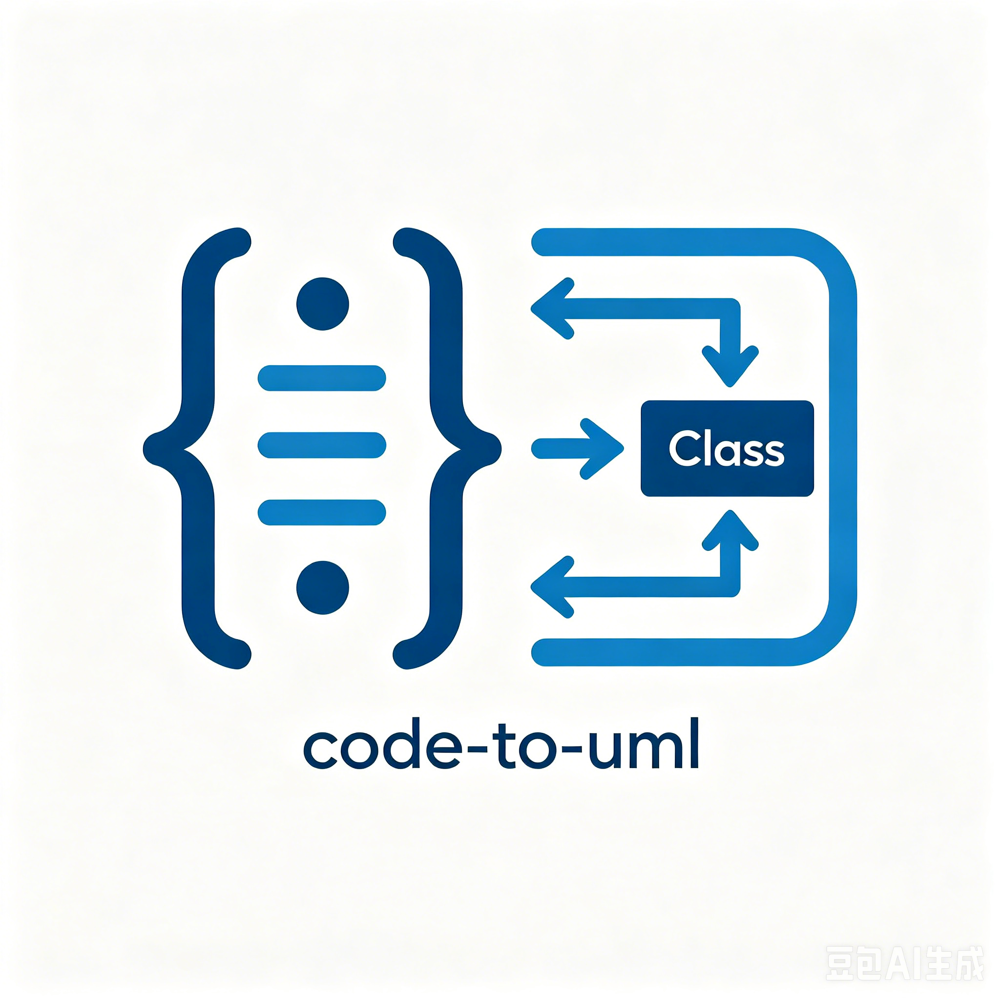
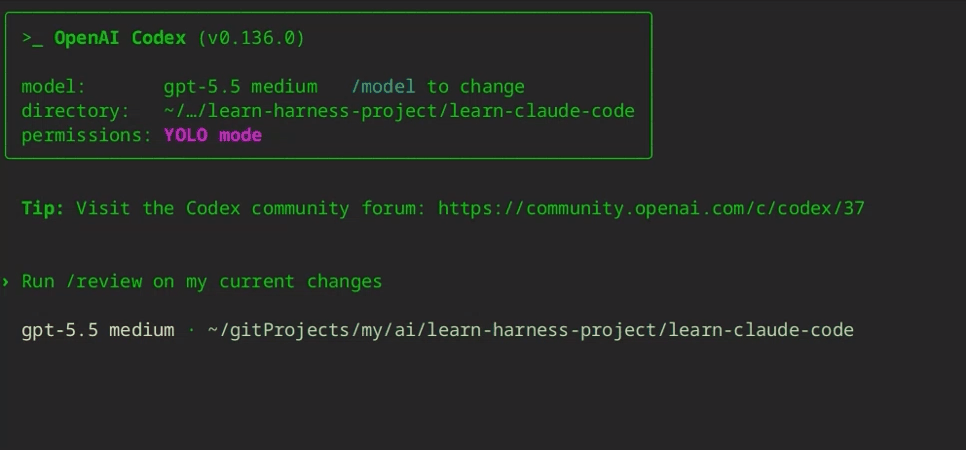

# Code-To-UML

<p align="center">
  
</p>

> Transform code into interactive UML reports and explore 100+ diagram examples — all in-browser, zero build tools.

**[中文文档](README_zh.md)**

<!-- Badges -->
<p align="center">
  <a href="https://github.com/pingwurth/code-to-uml/stargazers"></a>
  <a href="https://github.com/pingwurth/code-to-uml/network/members"></a>
  <a href="https://github.com/pingwurth/code-to-uml/issues"></a>
  <a href="https://github.com/pingwurth/code-to-uml/pulls"></a>
  <a href="https://github.com/pingwurth/code-to-uml/graphs/contributors"></a>
  <a href="https://github.com/pingwurth/code-to-uml/blob/main/LICENSE"></a>
</p>

<p align="center">
  <a href="https://twitter.com/intent/tweet?text=Check%20out%20Code-To-UML%20-%20AI-powered%20code%20analysis%20that%20generates%20interactive%20UML%20reports!&url=https://github.com/pingwurth/code-to-uml"></a>
  <a href="https://github.com/pingwurth/code-to-uml/discussions"></a>
  <a href="https://github.com/pingwurth/code-to-uml/blob/main/CONTRIBUTING.md"></a>
</p>

<p align="center">
  <a href="#why-code-to-uml"><strong>Why Code-To-UML?</strong></a> ·
  <a href="#demo"><strong>Demo</strong></a> ·
  <a href="#getting-started"><strong>Getting Started</strong></a> ·
  <a href="#contributing"><strong>Contributing</strong></a> ·
  <a href="#links"><strong>Links</strong></a>
</p>

---

## Why Code-To-UML?

> **"In the AI era, the ability to read code is scarcer than the ability to write it."**

Code-To-UML is the embodiment of this philosophy. It's not just another PlantUML online editor — it's a complete toolchain that lets AI understand your code, draw architecture diagrams, and generate bilingual reports.

### Six Core Pain Points, One Solution

| Pain Point | Problem Description | Code-To-UML Solution |
|------------|---------------------|----------------------|
| 🔍 **System Analysis Difficulty** | Complex codebases make it hard to quickly understand overall architecture and module relationships | One-click generation of project/module/file-level architecture diagrams with interactive navigation |
| 📝 **Design Documentation Burden** | Organizing existing code logic requires reading hundreds of lines method by method | Auto-generated 13-dimension analysis reports with intelligent code snippet extraction (< 30 lines) |
| 🐛 **Inefficient Debugging** | Line-by-line code reading for troubleshooting is extremely inefficient | Call relationship diagrams to quickly locate problem paths, data flow diagrams to track state changes |
| 🤖 **AI Code Review** | In the Vibe Coding era, AI-generated code needs more efficient review tools | Quickly understand AI-generated code structure, identify potential architecture issues and risks |
| 📚 **Rapid Framework Learning** | Learning new tech stacks and participating in open-source maintenance requires quick code comprehension | Auto-generated developer onboarding guides, core principles and design decision visualization |
| 🎯 **Reading Code > Writing Code** | Code comprehension ability becomes a core competitive advantage | AI skill integration, supporting mainstream AI tools like Cursor, Claude Code, and more |

**Core Value:** Transform code into interactive UML reports, improving code comprehension efficiency by 10x

---

## Demo

<p align="center">
  
</p>

---

## Key Features

- ✅ **Browser-First Rendering** — PlantUML WASM, zero server latency
- ✅ **Automatic Fallback** — Client fails → server-side retry with plantuml.jar
- ✅ **Interactive Lightbox** — Full-screen with zoom, pan, keyboard navigation
- ✅ **Side TOC with Scroll Sync** — Always-visible navigation for long reports
- ✅ **No Build Tools** — Zero npm overhead, pure HTML/JS served directly
- ✅ **Reusable Templates** — Generate analysis reports from structured `.ctu` data files
- ✅ **AI Skill Integration** — Bundled SKILL.md for AI agents to auto-generate reports

---

## Table of Contents

- [Why Code-To-UML?](#why-code-to-uml)
- [About](#about)
- [Supported Diagram Types](#supported-diagram-types)
- [Tech Stack](#tech-stack)
- [Getting Started](#getting-started)
- [Usage](#usage)
- [Project Structure](#project-structure)
- [API Reference](#api-reference)
- [Configuration](#configuration)
- [Architecture](#architecture)
- [AI Agent Integration](#ai-agent-integration)
- [Contributing](#contributing)
- [License](#license)
- [Links](#links)

---

## About

Most UML documentation workflows rely on heavyweight IDEs, fragile build pipelines, or opaque SaaS tools. Code-To-UML takes a different approach:

1. **Code Analysis Reports** — Feed source code to an AI agent and get back a self-contained HTML report with UML diagrams, bilingual explanations, and interactive navigation.
2. **Diagram Showcase** — Browse 100+ bilingual PlantUML examples across 20+ diagram types, rendered live in your browser.
3. **AI Agent Skill** — A bundled skill definition (`SKILL.md`) lets Cursor, Claude Code, Qwen, Codex, and other AI assistants generate reports autonomously.

No frameworks. No transpilers. No `node_modules`. Just open `demo.html` and go.

---

## Supported Diagram Types

| Category | Types |
|----------|-------|
| **UML** | Sequence, Use Case, Class, Object, Activity, Component, Deployment, State, Timing |
| **Non-UML** | Gantt, MindMap, WBS, EBNF, Regex, Network (nwdiag), JSON, YAML, Archimate, Salt (Wireframe) |

---

## Tech Stack

| Layer | Technology |
|-------|-----------|
| Server | Node.js lightweight dev server (`serve.js`, ~600 lines) |
| Runtime | Vanilla ES6+ JavaScript — no frameworks, no npm dependencies |
| Client Rendering | PlantUML WASM via `plantuml.js` |
| Server Rendering | `plantuml.jar` (Java) — automatic fallback |
| Graph Layout | Graphviz via Viz.js |
| Data Format | `.ctu` structured text files |
| Internationalization | Custom JS system, localStorage persistence, `docs:langchange` event |
| Styling | Pure CSS with custom properties for theming |

---

## Getting Started

### Prerequisites

- **Node.js 18+**
- **Java** (for server-side PlantUML rendering fallback)

### Installation

1. Clone the repository:

```bash
git clone https://github.com/pingwurth/code-to-uml.git
cd code-to-uml
```

2. Set up `CTU_HOME` for AI agent integration:

```bash
node install.js
```

3. Start the server:

```bash
./serve.sh
# or specify a custom port
./serve.sh 5401
# or directly with Node
node serve.js 5401
```

4. Open your browser:

```bash
# Visit the following URL to view analysis examples
http://localhost:5401
# Or view UML syntax examples
http://localhost:5401/plantuml-official-demo/en/sequence-diagram_en.html
```

No `npm install`. No build step. That's it.

---

## Usage

### Usage Examples

Use the `/code-to-uml` slash command in your AI agent to generate UML-backed HTML reports at any scope:

**File-level analysis**

```
/code-to-uml Please analyze the file component/render-failure-common.js and generate a UML-backed, consistently formatted HTML report.
```

**Function-level analysis**

```
/code-to-uml Please analyze the renderWithFailureHandling function and generate a UML-backed, consistently formatted HTML report.
```

**Project-level analysis**

```
/code-to-uml Please analyze the entire code-to-uml project and generate a UML-backed, consistently formatted HTML report.
```

**Module-level analysis**

```
/code-to-uml Please analyze the component/ module and generate a UML-backed, consistently formatted HTML report.
```

All four commands produce the same 13-section report structure — scope changes the depth and examples, not the section contract. Reports are saved to `cache/` and accessible via `index.html`.

### Interactive Demo

Open `demo.html` to browse all diagram examples. Use the tab bar to switch diagram types and the language toggle to switch between English and Chinese.

### Generating Reports

1. Place `.ctu` data files in `data/s20-comprehensive/` (or a custom directory).
2. Use the AI skill (see [AI Agent Integration](#ai-agent-integration)) or manually create an HTML report using `cache/_TEMPLATE.html`.
3. Generated reports appear in `cache/` and are accessible from `index.html`.

### .ctu File Format

Each `.ctu` file defines one or more diagram examples with metadata:

```text
Title: Section Title
Describe: Description
------------------------------------------------------------
[Example]
Example title

[Description]
Markdown description of what this diagram demonstrates

[UML]
@startuml
Alice -> Bob: Hello
Bob --> Alice: Hi there
@enduml

[Detail]
Explanation of diagram elements and syntax
------------------------------------------------------------
```

**Naming convention:** `{diagram-type}--{number}_{language}.ctu`

Examples: `sequence--1_en.ctu`, `class--3_zh.ctu`, `activity--2_en.ctu`

---

## Project Structure

```
code-to-uml/
├── serve.js                 # Dev server + API endpoints
├── demo.html                # Main diagram viewer SPA
├── demo.js                  # Page controller
├── index.html               # Home / cache index
├── main.css                 # All styles
├── i18n-config.js           # i18n runtime
├── i18n/
│   ├── zh.js                # Chinese strings
│   └── en.js                # English strings
├── component/               # Reusable UI components
│   ├── docs-page-core.js    # Core page logic
│   ├── render-failure-common.js  # Error handling
│   ├── demo-example-component.js # Example card renderer
│   └── toc-component.js     # Table of contents
├── data/
│   ├── demo/                # Built-in examples (.ctu files)
│   ├── _TEMPLATE.ctu        # Template for new reports
│   └── s20-comprehensive/   # Example: analysis report data
├── cache/
│   ├── _TEMPLATE.html       # Reusable report HTML template
│   └── (generated reports)
├── js/                      # PlantUML + theme libraries
├── plantuml-official-demo/  # Official PlantUML reference docs
├── skills/code-to-uml/
│   └── SKILL.md             # AI agent skill definition
├── CLAUDE.md                # Claude Code guidance
├── AGENTS.md                # Agent documentation
└── install.js      # CTU_HOME setup script
```

---

## API Reference

### `GET /api/demo-examples`

Returns parsed `.ctu` examples for the diagram viewer.

| Parameter | Type | Description |
|-----------|------|-------------|
| `lang` | `en` \| `zh` | Language filter (default: `en`) |

**Response:** JSON array of parsed example objects.

### `POST /api/plantuml-svg`

Server-side PlantUML rendering fallback.

| Field | Description |
|-------|-------------|
| **Body** | Raw PlantUML source text |
| **Content-Type** | `text/plain` |
| **Response** | SVG markup |

---

## Configuration

| Setting | Mechanism | Default |
|---------|-----------|---------|
| Server port | `PORT` env var or CLI argument | `5401` |
| Project root | `CTU_HOME` env var (set by `install.js`) | CWD |
| UI language | `localStorage` key `plantuml-docs-lang` | Browser locale |
| Theme | CSS custom properties in `main.css` | Light |

---

## Architecture

The rendering pipeline uses a two-tier strategy for maximum reliability:

```
User opens demo.html
        │
        ▼
  [Render Queue]
        │
        ▼
  Try browser rendering (plantuml.js WASM)
        │
        ▼
  Rendered? ── Yes ──▶ Display SVG
        │
       No
        │
        ▼
  Detect error type
        │
        ▼
  Retry server-side (POST /api/plantuml-svg)
        │
        ▼
  Success? ── Yes ──▶ Display SVG
        │
       No
        │
        ▼
  Show error message + recovery action
```

Key design decisions:
- **WASM-first** eliminates server round-trips for the majority of diagrams.
- **Automatic fallback** handles edge cases where WASM has limitations (large diagrams, certain stdlib imports).
- **Error categorization** enables targeted retry logic rather than blind retries.

---

## AI Agent Integration

Code-To-UML ships with a skill definition at [`skills/code-to-uml/SKILL.md`](skills/code-to-uml/SKILL.md) that enables AI coding assistants to generate analysis reports.

### Supported Agents

- Cursor (via Rules / AGENTS.md)
- Claude Code (via CLAUDE.md)
- Qwen Coder
- OpenAI Codex
- Any agent supporting skill/tool definitions

### Setup

1. Run `node install.js` to register the project path.
2. Point your AI agent to `skills/code-to-uml/SKILL.md`.
3. Ask the agent to analyze a codebase — it will produce `.ctu` data files and an HTML report.

---

## Contributing

We welcome contributions from the community! Please read our [Contributing Guide](CONTRIBUTING.md) before submitting a Pull Request.

Areas where contributions are welcome:

- **New diagram examples** — Add `.ctu` files for under-represented diagram types
- **Localization** — Extend beyond English/Chinese
- **Theme variants** — Additional CSS custom property sets
- **PlantUML stdlib coverage** — Examples using AWS, Azure, K8s icon libraries
- **Testing** — Expand the test suite in `test/`
- **Bug fixes** — Check our [open issues](https://github.com/pingwurth/code-to-uml/issues)
- **Documentation** — Improve guides and examples

### Quick Contribution Links

- 🐛 [Report a Bug](https://github.com/pingwurth/code-to-uml/issues/new?template=bug_report.md)
- 💡 [Request a Feature](https://github.com/pingwurth/code-to-uml/issues/new?template=feature_request.md)
- 📊 [Suggest a Diagram Example](https://github.com/pingwurth/code-to-uml/issues/new?template=new_example.md)
- 💬 [Join the Discussion](https://github.com/pingwurth/code-to-uml/discussions)

---

## License

[MIT](LICENSE)

---

## Links

### Documentation
- [PlantUML Official Documentation](https://plantuml.com)
- [AI Skill Definition](skills/code-to-uml/SKILL.md)
- [Agent Guidelines](AGENTS.md)
- [Claude Code Guidelines](CLAUDE.md)
- [CTU Template](data/_TEMPLATE.ctu)
- [Contributing Guide](CONTRIBUTING.md)

### Community
- [GitHub Discussions](https://github.com/pingwurth/code-to-uml/discussions) - Ask questions, share ideas
- [GitHub Issues](https://github.com/pingwurth/code-to-uml/issues) - Report bugs, request features
- [Pull Requests](https://github.com/pingwurth/code-to-uml/pulls) - Contribute code

### Social
- ⭐ [Star on GitHub](https://github.com/pingwurth/code-to-uml) - Show your support!
- 🐦 [Share on Twitter](https://twitter.com/intent/tweet?text=Check%20out%20Code-To-UML%20-%20AI-powered%20code%20analysis%20that%20generates%20interactive%20UML%20reports!&url=https://github.com/pingwurth/code-to-uml) - Spread the word
- 📖 [GitHub Profile](https://github.com/pingwurth) - Follow for updates
