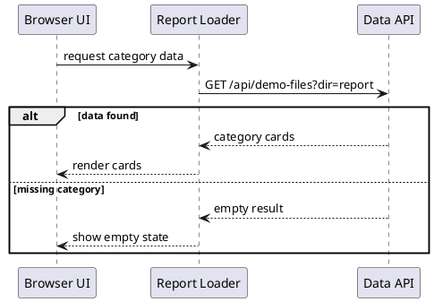
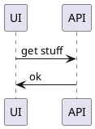

# UML Standards

Reference document for authoring valid, readable, and reviewable PlantUML blocks in Code-To-UML reports.

## Responsibility Boundary

This document defines PlantUML authoring quality: syntax safety, readability, diagram-specific conventions, detail-writing rules, and validation checks.

It does not decide whether a diagram is needed or which diagram type creates the most value. Use `diagram-decision-table.md` for diagram value and type selection. It also does not define required report sections, category ownership, or merge rules. Use `report-contract.md` for report coverage.

## Mandatory UML Block Contract

Every non-empty `[UML]` block must satisfy this contract:

- Contain PlantUML only. Put prose in `[Description]` or `[Detail]`, not inside the diagram body.
- Start with `@startuml` and end with `@enduml`, unless the chosen PlantUML type requires another explicit `@start...`/`@end...` pair such as `@startmindmap`.
- Render with zero PlantUML errors when the local renderer is available.
- Use stable aliases for participants, components, packages, classes, and states when labels contain spaces, punctuation, or localized text.
- Declare important participants/classes/components before using them when the diagram type supports declarations.
- Use consistent direction and arrow semantics throughout the same diagram.
- Keep source symbols, filenames, API routes, environment variables, and constants in their original spelling.
- Use report-language labels for explanatory text. If the report is Chinese, explanatory labels should be Chinese; source-code identifiers remain unchanged.
- Keep the diagram focused on one reader question. If it answers multiple unrelated questions, split it or move detail into text.

Empty or text-only cards may use an empty `[UML]` block or `None` only when the template explicitly supports that behavior.

## Common Escaping and Safety Rules

- Avoid raw `<` and `>` in labels unless PlantUML syntax requires them. Prefer quoted labels or escape the value in a way that the local renderer accepts.
- Quote labels that contain spaces, punctuation, brackets, colons, slashes, or localized text.
- Use aliases for quoted labels:
  - `participant "API Handler" as Handler`
  - `component "Report Loader" as Loader`
- Do not rely on implicit node creation for important objects. Implicit nodes make later edits harder to review.
- Avoid label text that looks like PlantUML syntax unless it is intentional and tested.
- Avoid HTML-like markup in labels unless it is necessary, locally rendered, and compatible with the target PlantUML version.
- Keep comments short and use PlantUML comments only for authoring context, not report explanation.

## Diagram-Type Specific Rules

### Sequence Diagrams

- Declare primary participants before the first message.
- Use sequence diagrams for ordering, responsibility handoff, async callbacks, retries, and cross-boundary calls.
- Use `alt`/`else`/`end` for meaningful branches and failure paths.
- Use `loop` for retries or repeated calls; name the retry condition.
- Use activation bars only when they clarify ownership of work.
- Do not draw a sequence diagram for a single obvious caller-callee pair unless ordering, retry, async behavior, or error handling matters.

Good pattern:

Bad pattern:

### Activity Diagrams

- Use activity diagrams for execution flow, branching rules, fallback behavior, and validation paths.
- Include `start` and `stop` or another explicit terminal state.
- Use action labels that describe the real operation, not vague verbs such as `continue`, `process`, or `handle`.
- Prefer explicit actions such as `:Return to the next loop iteration;` over ambiguous `continue`.
- Use `if`/`else` for branches and make the condition concrete.
- Use `repeat`/`repeat while` or `while` only when the loop condition is important to understanding the code.

### Component and Package Diagrams

- Use component/package diagrams for architecture boundaries, dependency direction, runtime ownership, storage boundaries, or module layering.
- Draw dependency arrows in the direction of knowledge or calls and explain that convention in `[Detail]`.
- Group related nodes with `package`, `frame`, `node`, or `database` only when the boundary means something in the implementation.
- Do not draw a file-list diagram. If there is no dependency, ownership, or runtime boundary to compare, use a table instead.
- Name components after real modules, files, services, or runtime units whenever possible.

### Class and Object Diagrams

- Use class/object diagrams for ownership, composition, inheritance, invariants, data shape, and collaborator relationships.
- Include only fields and methods that matter for the report's reader question.
- Mark visibility only when it adds useful information; do not clutter diagrams with obvious private internals.
- Prefer composition/aggregation arrows only when the source evidence supports ownership semantics.
- Do not duplicate the maintainer reference index as a class diagram.

### State Diagrams

- Use state diagrams for lifecycle, workflow, cache status, connection status, approval status, or retry/failure recovery.
- Include initial and terminal states when they exist.
- Label transitions with the event or condition that causes the move.
- Show illegal, ignored, or terminal transitions in `[Detail]` when the diagram would become too dense.
- Do not use a state diagram for ordinary boolean flags unless the lifecycle has meaningful transitions.

### Mindmap and WBS Diagrams

- Use mindmap/WBS diagrams for onboarding paths, review-question clusters, or high-level report navigation.
- Keep leaf nodes short and action-oriented.
- Do not put detailed explanations in mindmap leaves; put them in `[Detail]`.

## Readability Budget

Prefer diagrams that can be understood in one pass:

- Aim for 5-12 meaningful nodes per diagram.
- Avoid more than 20 visible nodes unless the diagram is a deliberate architecture map.
- Avoid crossing arrows where a package/component split or sequence diagram would read better.
- Prefer one precise diagram over several shallow variations of the same relationship.
- Use layout directives such as `left to right direction` only when they materially improve readability.
- Keep labels short; move caveats, tradeoffs, and edge cases into `[Detail]`.

## Detail Writing Template

Every diagram must be paired with `[Detail]`. The detail text must make the diagram useful even for a reader who does not know PlantUML.

Use this structure unless the section has a stronger local reason to differ:

1. Reading entry: where to start reading the diagram and what question it answers.
2. Key nodes and boundaries: which nodes matter most and what real source artifact each represents.
3. Arrow semantics: what the arrows mean in this diagram, such as call direction, dependency direction, data movement, or state transition.
4. Important branches or edge cases: failure paths, retries, fallbacks, missing data, illegal transitions, or ignored states.
5. Design reason and risk: why the design is shaped this way, what tradeoff it accepts, and what maintainers should watch before changing it.

Do not only restate visible labels. The diagram shows "what is connected"; `[Detail]` must explain "why it matters" and "where it can fail."

## UML Cannot Replace Text

Cover these topics in `[Description]` or `[Detail]`, even when the diagram includes related nodes:

- Design decisions, alternatives, and tradeoffs.
- Boundary conditions and detailed exception-path logic.
- Performance constraints, SLA numbers, cache limits, and resource limits.
- Security, permission, trust-boundary, and data-sensitivity concerns.
- Known pitfalls, implicit conventions, compatibility assumptions, and change risks.
- Evidence source: files, functions, symbols, routes, configs, or line references that support the diagram.

## Validation Checklist

Before finalizing a report, validate every non-empty `[UML]` block:

- [ ] The block contains PlantUML only.
- [ ] Start/end tags match the diagram type.
- [ ] Braces, parentheses, quotes, and control blocks are balanced.
- [ ] Important participants/classes/components/states are declared or intentionally implicit.
- [ ] Arrow syntax is valid and consistent for the diagram type.
- [ ] Labels with punctuation, spaces, or localized text are quoted or aliased safely.
- [ ] Raw `<` and `>` are absent unless required and verified.
- [ ] Activity diagrams avoid ambiguous `continue` labels.
- [ ] Sequence diagrams represent meaningful ordering, branch, retry, async, or boundary behavior.
- [ ] Component/package diagrams show real dependency, ownership, runtime, or storage boundaries.
- [ ] Class/object diagrams do not duplicate a symbol index without relationship semantics.
- [ ] State diagrams show real lifecycle transitions rather than trivial flags.
- [ ] `[Detail]` explains entry point, key nodes, arrow semantics, edge cases, design reason, and risk.
- [ ] Local PlantUML rendering passed, or the final response states that only static checks were performed.
